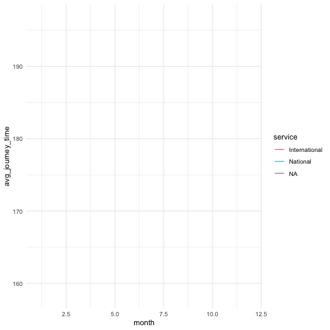
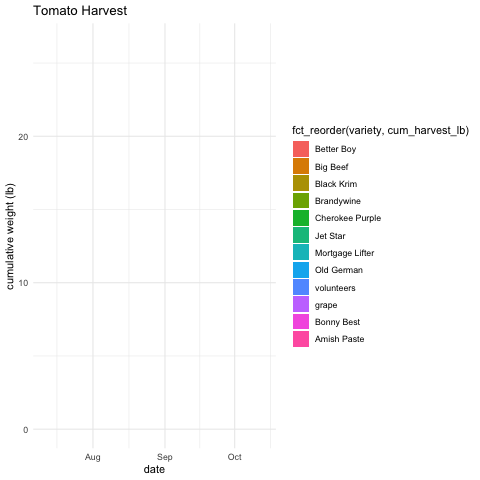
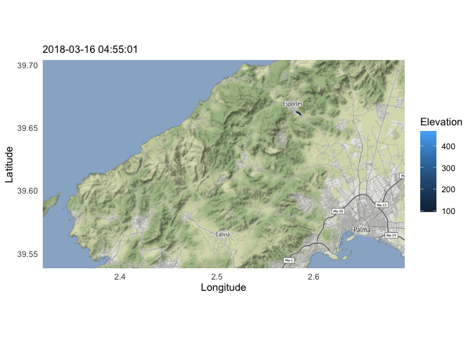
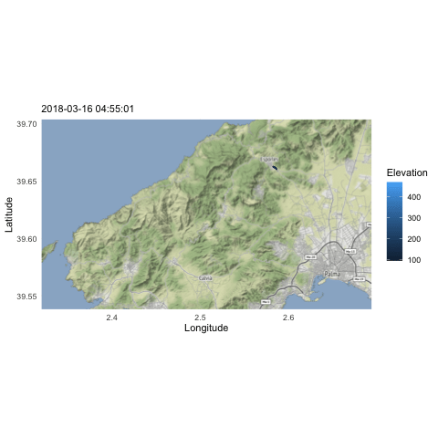
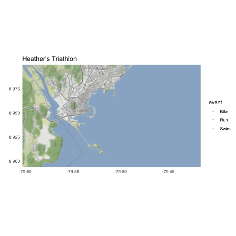
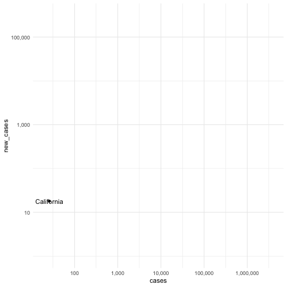
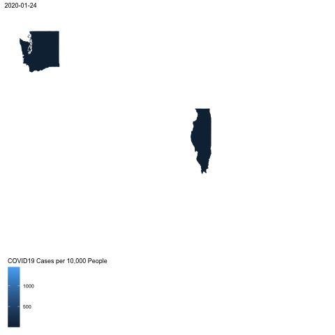

```r
library(tidyverse)     # for data cleaning and plotting
library(gardenR)       # for Lisa's garden data
library(lubridate)     # for date manipulation
library(openintro)     # for the abbr2state() function
library(palmerpenguins)# for Palmer penguin data
library(maps)          # for map data
library(ggmap)         # for mapping points on maps
library(gplots)        # for col2hex() function
library(RColorBrewer)  # for color palettes
library(sf)            # for working with spatial data
library(leaflet)       # for highly customizable mapping
library(ggthemes)      # for more themes (including theme_map())
library(plotly)        # for the ggplotly() - basic interactivity
library(gganimate)     # for adding animation layers to ggplots
library(transformr)    # for "tweening" (gganimate)
library(gifski)        # need the library for creating gifs but don't need to load each time
library(shiny)         # for creating interactive apps
theme_set(theme_minimal())
```


```r
# SNCF Train data
small_trains <- read_csv("https://raw.githubusercontent.com/rfordatascience/tidytuesday/master/data/2019/2019-02-26/small_trains.csv") 

# Lisa's garden data
data("garden_harvest")

# Lisa's Mallorca cycling data
mallorca_bike_day7 <- read_csv("https://www.dropbox.com/s/zc6jan4ltmjtvy0/mallorca_bike_day7.csv?dl=1") %>% 
  select(1:4, speed)

# Heather Lendway's Ironman 70.3 Pan Am championships Panama data
panama_swim <- read_csv("https://raw.githubusercontent.com/llendway/gps-data/master/data/panama_swim_20160131.csv")

panama_bike <- read_csv("https://raw.githubusercontent.com/llendway/gps-data/master/data/panama_bike_20160131.csv")

panama_run <- read_csv("https://raw.githubusercontent.com/llendway/gps-data/master/data/panama_run_20160131.csv")

#COVID-19 data from the New York Times
covid19 <- read_csv("https://raw.githubusercontent.com/nytimes/covid-19-data/master/us-states.csv")
```

## Put your homework on GitHub!

Go [here](https://github.com/llendway/github_for_collaboration/blob/master/github_for_collaboration.md) or to previous homework to remind yourself how to get set up. 

Once your repository is created, you should always open your **project** rather than just opening an .Rmd file. You can do that by either clicking on the .Rproj file in your repository folder on your computer. Or, by going to the upper right hand corner in R Studio and clicking the arrow next to where it says Project: (None). You should see your project come up in that list if you've used it recently. You could also go to File --> Open Project and navigate to your .Rproj file. 

## Instructions

* Put your name at the top of the document. 

* **For ALL graphs, you should include appropriate labels.** 

* Feel free to change the default theme, which I currently have set to `theme_minimal()`. 

* Use good coding practice. Read the short sections on good code with [pipes](https://style.tidyverse.org/pipes.html) and [ggplot2](https://style.tidyverse.org/ggplot2.html). **This is part of your grade!**

* **NEW!!** With animated graphs, add `eval=FALSE` to the code chunk that creates the animation and saves it using `anim_save()`. Add another code chunk to reread the gif back into the file. See the [tutorial](https://animation-and-interactivity-in-r.netlify.app/) for help. 

* When you are finished with ALL the exercises, uncomment the options at the top so your document looks nicer. Don't do it before then, or else you might miss some important warnings and messages.

## Warm-up exercises from tutorial

  1. Choose 2 graphs you have created for ANY assignment in this class and add interactivity using the `ggplotly()` function.
  

```r
plot_data <- garden_harvest %>%
  mutate(month = month(date, label=TRUE)) %>%
  group_by(month) %>%
  summarize(monthly_weight_g = sum(weight), num_harvests = n()) %>%
  mutate(monthly_weight_kg = monthly_weight_g / 1000)
graph <- plot_data %>%
  ggplot(aes(x = month, y = monthly_weight_kg, fill = num_harvests)) +
  geom_col() +
  scale_fill_gradient(low = "darkseagreen2", high = "cyan4", name = "Number of Harvests") +
  labs(x = "", y = "", title = "Vegetables Harvested Per Month (kg)") +
  theme_stata() +
  theme(plot.title = element_text(face = "bold", size = 25), 
        text = element_text(family = "Times"),
        panel.grid.major.x = element_blank(), 
        panel.grid.minor.x = element_blank(),
        panel.grid.minor.y = element_line(color = "#f0f4f4"),
        legend.position = c(0.2, 0.7)) 
ggplotly(graph)
```

```{=html}
<div id="htmlwidget-613e1e7d894d84a16d6d" style="width:672px;height:480px;" class="plotly html-widget"></div>
<script type="application/json" data-for="htmlwidget-613e1e7d894d84a16d6d">{"x":{"data":[{"orientation":"v","width":0.9,"base":0,"x":[1],"y":[5.672],"text":"month: Jun<br />monthly_weight_kg:   5.672<br />num_harvests:  72","type":"bar","marker":{"autocolorscale":false,"color":"rgba(180,238,180,1)","line":{"width":1.88976377952756,"color":"transparent"}},"showlegend":false,"xaxis":"x","yaxis":"y","hoverinfo":"text","frame":null},{"orientation":"v","width":0.9,"base":0,"x":[5],"y":[85.309],"text":"month: Oct<br />monthly_weight_kg:  85.309<br />num_harvests:  89","type":"bar","marker":{"autocolorscale":false,"color":"rgba(170,230,177,1)","line":{"width":1.88976377952756,"color":"transparent"}},"showlegend":false,"xaxis":"x","yaxis":"y","hoverinfo":"text","frame":null},{"orientation":"v","width":0.9,"base":0,"x":[4],"y":[162.392],"text":"month: Sep<br />monthly_weight_kg: 162.392<br />num_harvests: 144","type":"bar","marker":{"autocolorscale":false,"color":"rgba(136,205,167,1)","line":{"width":1.88976377952756,"color":"transparent"}},"showlegend":false,"xaxis":"x","yaxis":"y","hoverinfo":"text","frame":null},{"orientation":"v","width":0.9,"base":0,"x":[2],"y":[40.152],"text":"month: Jul<br />monthly_weight_kg:  40.152<br />num_harvests: 183","type":"bar","marker":{"autocolorscale":false,"color":"rgba(111,187,160,1)","line":{"width":1.88976377952756,"color":"transparent"}},"showlegend":false,"xaxis":"x","yaxis":"y","hoverinfo":"text","frame":null},{"orientation":"v","width":0.9,"base":0,"x":[3],"y":[138.73],"text":"month: Aug<br />monthly_weight_kg: 138.730<br />num_harvests: 293","type":"bar","marker":{"autocolorscale":false,"color":"rgba(0,139,139,1)","line":{"width":1.88976377952756,"color":"transparent"}},"showlegend":false,"xaxis":"x","yaxis":"y","hoverinfo":"text","frame":null},{"x":[1],"y":[0],"name":"99_06665af1146df7c827fe71734fb7af1a","type":"scatter","mode":"markers","opacity":0,"hoverinfo":"skip","showlegend":false,"marker":{"color":[0,1],"colorscale":[[0,"#B4EEB4"],[0.00334448160535117,"#B4EEB4"],[0.00668896321070235,"#B3EDB4"],[0.0100334448160535,"#B3EDB4"],[0.0133779264214047,"#B2EDB3"],[0.0167224080267559,"#B2ECB3"],[0.020066889632107,"#B1ECB3"],[0.0234113712374582,"#B1ECB3"],[0.0267558528428094,"#B0EBB3"],[0.0301003344481606,"#B0EBB3"],[0.0334448160535117,"#B0EBB3"],[0.0367892976588628,"#AFEAB3"],[0.0401337792642141,"#AFEAB2"],[0.0434782608695652,"#AEEAB2"],[0.0468227424749164,"#AEE9B2"],[0.0501672240802675,"#ADE9B2"],[0.0535117056856187,"#ADE8B2"],[0.0568561872909699,"#ACE8B2"],[0.0602006688963211,"#ACE8B2"],[0.0635451505016722,"#ACE7B1"],[0.0668896321070234,"#ABE7B1"],[0.0702341137123746,"#ABE7B1"],[0.0735785953177257,"#AAE6B1"],[0.0769230769230769,"#AAE6B1"],[0.0802675585284281,"#A9E6B1"],[0.0836120401337793,"#A9E5B1"],[0.0869565217391304,"#A8E5B0"],[0.0903010033444816,"#A8E5B0"],[0.0936454849498328,"#A7E4B0"],[0.096989966555184,"#A7E4B0"],[0.100334448160535,"#A7E4B0"],[0.103678929765886,"#A6E3B0"],[0.107023411371237,"#A6E3B0"],[0.110367892976589,"#A5E3B0"],[0.11371237458194,"#A5E2AF"],[0.117056856187291,"#A4E2AF"],[0.120401337792642,"#A4E2AF"],[0.123745819397993,"#A3E1AF"],[0.127090301003344,"#A3E1AF"],[0.130434782608696,"#A3E1AF"],[0.133779264214047,"#A2E0AF"],[0.137123745819398,"#A2E0AE"],[0.140468227424749,"#A1E0AE"],[0.1438127090301,"#A1DFAE"],[0.147157190635451,"#A0DFAE"],[0.150501672240803,"#A0DFAE"],[0.153846153846154,"#9FDEAE"],[0.157190635451505,"#9FDEAE"],[0.160535117056856,"#9EDDAE"],[0.163879598662207,"#9EDDAD"],[0.167224080267559,"#9EDDAD"],[0.17056856187291,"#9DDCAD"],[0.173913043478261,"#9DDCAD"],[0.177257525083612,"#9CDCAD"],[0.180602006688963,"#9CDBAD"],[0.183946488294314,"#9BDBAD"],[0.187290969899666,"#9BDBAC"],[0.190635451505017,"#9ADAAC"],[0.193979933110368,"#9ADAAC"],[0.197324414715719,"#9ADAAC"],[0.20066889632107,"#99D9AC"],[0.204013377926421,"#99D9AC"],[0.207357859531773,"#98D9AC"],[0.210702341137124,"#98D8AB"],[0.214046822742475,"#97D8AB"],[0.217391304347826,"#97D8AB"],[0.220735785953177,"#96D7AB"],[0.224080267558528,"#96D7AB"],[0.22742474916388,"#95D7AB"],[0.230769230769231,"#95D6AB"],[0.234113712374582,"#95D6AB"],[0.237458193979933,"#94D6AA"],[0.240802675585284,"#94D5AA"],[0.244147157190635,"#93D5AA"],[0.247491638795987,"#93D5AA"],[0.250836120401338,"#92D4AA"],[0.254180602006689,"#92D4AA"],[0.25752508361204,"#91D4AA"],[0.260869565217391,"#91D3A9"],[0.264214046822743,"#90D3A9"],[0.267558528428094,"#90D3A9"],[0.270903010033445,"#90D2A9"],[0.274247491638796,"#8FD2A9"],[0.277591973244147,"#8FD2A9"],[0.280936454849498,"#8ED1A9"],[0.28428093645485,"#8ED1A9"],[0.287625418060201,"#8DD1A8"],[0.290969899665552,"#8DD0A8"],[0.294314381270903,"#8CD0A8"],[0.297658862876254,"#8CD0A8"],[0.301003344481605,"#8BCFA8"],[0.304347826086956,"#8BCFA8"],[0.307692307692308,"#8ACFA8"],[0.311036789297659,"#8ACEA7"],[0.31438127090301,"#8ACEA7"],[0.317725752508361,"#89CEA7"],[0.321070234113712,"#89CDA7"],[0.324414715719063,"#88CDA7"],[0.327759197324415,"#88CDA7"],[0.331103678929766,"#87CCA7"],[0.334448160535117,"#87CCA6"],[0.337792642140468,"#86CCA6"],[0.341137123745819,"#86CBA6"],[0.344481605351171,"#85CBA6"],[0.347826086956522,"#85CBA6"],[0.351170568561873,"#84CAA6"],[0.354515050167224,"#84CAA6"],[0.357859531772575,"#84C9A6"],[0.361204013377926,"#83C9A5"],[0.364548494983278,"#83C9A5"],[0.367892976588629,"#82C8A5"],[0.37123745819398,"#82C8A5"],[0.374581939799331,"#81C8A5"],[0.377926421404682,"#81C7A5"],[0.381270903010033,"#80C7A5"],[0.384615384615385,"#80C7A4"],[0.387959866220736,"#7FC6A4"],[0.391304347826087,"#7FC6A4"],[0.394648829431438,"#7EC6A4"],[0.397993311036789,"#7EC5A4"],[0.40133779264214,"#7DC5A4"],[0.404682274247492,"#7DC5A4"],[0.408026755852843,"#7DC4A3"],[0.411371237458194,"#7CC4A3"],[0.414715719063545,"#7CC4A3"],[0.418060200668896,"#7BC3A3"],[0.421404682274247,"#7BC3A3"],[0.424749163879599,"#7AC3A3"],[0.42809364548495,"#7AC2A3"],[0.431438127090301,"#79C2A3"],[0.434782608695652,"#79C2A2"],[0.438127090301003,"#78C1A2"],[0.441471571906354,"#78C1A2"],[0.444816053511706,"#77C1A2"],[0.448160535117057,"#77C0A2"],[0.451505016722408,"#76C0A2"],[0.454849498327759,"#76C0A2"],[0.45819397993311,"#75BFA1"],[0.461538461538462,"#75BFA1"],[0.464882943143813,"#74BFA1"],[0.468227424749164,"#74BEA1"],[0.471571906354515,"#74BEA1"],[0.474916387959866,"#73BEA1"],[0.478260869565217,"#73BDA1"],[0.481605351170568,"#72BDA0"],[0.48494983277592,"#72BDA0"],[0.488294314381271,"#71BCA0"],[0.491638795986622,"#71BCA0"],[0.494983277591973,"#70BCA0"],[0.498327759197324,"#70BBA0"],[0.501672240802676,"#6FBBA0"],[0.505016722408027,"#6FBB9F"],[0.508361204013378,"#6EBA9F"],[0.511705685618729,"#6EBA9F"],[0.51505016722408,"#6DBA9F"],[0.518394648829431,"#6DB99F"],[0.521739130434782,"#6CB99F"],[0.525083612040134,"#6CB99F"],[0.528428093645485,"#6BB99F"],[0.531772575250836,"#6BB89E"],[0.535117056856187,"#6AB89E"],[0.538461538461538,"#6AB89E"],[0.54180602006689,"#69B79E"],[0.545150501672241,"#69B79E"],[0.548494983277592,"#68B79E"],[0.551839464882943,"#68B69E"],[0.555183946488294,"#67B69D"],[0.558528428093645,"#67B69D"],[0.561872909698997,"#66B59D"],[0.565217391304348,"#66B59D"],[0.568561872909699,"#65B59D"],[0.57190635451505,"#65B49D"],[0.575250836120401,"#64B49D"],[0.578595317725753,"#64B49C"],[0.581939799331104,"#63B39C"],[0.585284280936455,"#63B39C"],[0.588628762541806,"#62B39C"],[0.591973244147157,"#62B29C"],[0.595317725752508,"#61B29C"],[0.598662207357859,"#61B29C"],[0.602006688963211,"#60B19C"],[0.605351170568562,"#60B19B"],[0.608695652173913,"#5FB19B"],[0.612040133779264,"#5FB09B"],[0.615384615384615,"#5EB09B"],[0.618729096989966,"#5EB09B"],[0.622073578595318,"#5DAF9B"],[0.625418060200669,"#5DAF9B"],[0.62876254180602,"#5CAF9A"],[0.632107023411371,"#5CAE9A"],[0.635451505016722,"#5BAE9A"],[0.638795986622073,"#5BAE9A"],[0.642140468227425,"#5AAD9A"],[0.645484949832776,"#5AAD9A"],[0.648829431438127,"#59AD9A"],[0.652173913043478,"#59AC99"],[0.655518394648829,"#58AC99"],[0.658862876254181,"#57AC99"],[0.662207357859532,"#57AB99"],[0.665551839464883,"#56AB99"],[0.668896321070234,"#56AB99"],[0.672240802675585,"#55AA99"],[0.675585284280936,"#55AA98"],[0.678929765886288,"#54AA98"],[0.682274247491639,"#54A998"],[0.68561872909699,"#53A998"],[0.688963210702341,"#53A998"],[0.692307692307692,"#52A898"],[0.695652173913043,"#52A898"],[0.698996655518395,"#51A898"],[0.702341137123746,"#50A797"],[0.705685618729097,"#50A797"],[0.709030100334448,"#4FA797"],[0.712374581939799,"#4FA697"],[0.71571906354515,"#4EA697"],[0.719063545150502,"#4EA697"],[0.722408026755853,"#4DA697"],[0.725752508361204,"#4DA596"],[0.729096989966555,"#4CA596"],[0.732441471571906,"#4BA596"],[0.735785953177257,"#4BA496"],[0.739130434782609,"#4AA496"],[0.74247491638796,"#4AA496"],[0.745819397993311,"#49A396"],[0.749163879598662,"#48A395"],[0.752508361204013,"#48A395"],[0.755852842809364,"#47A295"],[0.759197324414716,"#47A295"],[0.762541806020067,"#46A295"],[0.765886287625418,"#46A195"],[0.769230769230769,"#45A195"],[0.77257525083612,"#44A194"],[0.775919732441472,"#44A094"],[0.779264214046823,"#43A094"],[0.782608695652174,"#43A094"],[0.785953177257525,"#429F94"],[0.789297658862876,"#419F94"],[0.792642140468227,"#419F94"],[0.795986622073579,"#409E93"],[0.79933110367893,"#3F9E93"],[0.802675585284281,"#3F9E93"],[0.806020066889632,"#3E9D93"],[0.809364548494983,"#3D9D93"],[0.812709030100334,"#3D9D93"],[0.816053511705686,"#3C9C93"],[0.819397993311037,"#3C9C93"],[0.822742474916388,"#3B9C92"],[0.826086956521739,"#3A9C92"],[0.82943143812709,"#3A9B92"],[0.832775919732441,"#399B92"],[0.836120401337792,"#389B92"],[0.839464882943144,"#379A92"],[0.842809364548495,"#379A92"],[0.846153846153846,"#369A91"],[0.849498327759197,"#359991"],[0.852842809364549,"#359991"],[0.8561872909699,"#349991"],[0.859531772575251,"#339891"],[0.862876254180602,"#339891"],[0.866220735785953,"#329891"],[0.869565217391304,"#319790"],[0.872909698996655,"#309790"],[0.876254180602007,"#309790"],[0.879598662207358,"#2F9690"],[0.882943143812709,"#2E9690"],[0.88628762541806,"#2D9690"],[0.889632107023411,"#2C9590"],[0.892976588628763,"#2C958F"],[0.896321070234114,"#2B958F"],[0.899665551839465,"#2A948F"],[0.903010033444816,"#29948F"],[0.906354515050167,"#28948F"],[0.909698996655518,"#27948F"],[0.913043478260869,"#26938F"],[0.916387959866221,"#25938E"],[0.919732441471572,"#25938E"],[0.923076923076923,"#24928E"],[0.926421404682274,"#23928E"],[0.929765886287625,"#22928E"],[0.933110367892977,"#21918E"],[0.936454849498327,"#20918E"],[0.939799331103679,"#1E918E"],[0.94314381270903,"#1D908D"],[0.946488294314381,"#1C908D"],[0.949832775919732,"#1B908D"],[0.953177257525084,"#1A8F8D"],[0.956521739130435,"#198F8D"],[0.959866220735786,"#178F8D"],[0.963210702341137,"#168E8D"],[0.966555183946488,"#148E8C"],[0.969899665551839,"#138E8C"],[0.973244147157191,"#118E8C"],[0.976588628762542,"#108D8C"],[0.979933110367893,"#0E8D8C"],[0.983277591973244,"#0C8D8C"],[0.986622073578595,"#098C8C"],[0.989966555183946,"#078C8B"],[0.993311036789298,"#058C8B"],[0.996655518394649,"#028B8B"],[1,"#008B8B"]],"colorbar":{"bgcolor":"rgba(255,255,255,1)","bordercolor":"rgba(0,0,0,1)","borderwidth":1.25984251968504,"thickness":23.04,"title":"Number of Harvests","titlefont":{"color":"rgba(30,45,83,1)","family":"Times","size":18.5971020813473},"tickmode":"array","ticktext":["100","150","200","250"],"tickvals":[0.126696832579186,0.352941176470588,0.579185520361991,0.805429864253394],"tickfont":{"color":"rgba(0,0,0,1)","family":"Times","size":13.2835896909864},"ticklen":2,"len":0.5}},"xaxis":"x","yaxis":"y","frame":null}],"layout":{"margin":{"t":72.728800332088,"r":23.52,"b":43.7854078728046,"l":43.7854078728046},"plot_bgcolor":"rgba(255,255,255,1)","paper_bgcolor":"rgba(234,242,243,1)","font":{"color":"rgba(0,0,0,1)","family":"Times","size":14.6118721461187},"title":{"text":"<b> Vegetables Harvested Per Month (kg) <\/b>","font":{"color":"rgba(30,45,83,1)","family":"Times","size":33.208800332088},"x":0.5,"xref":"paper"},"xaxis":{"domain":[0,1],"automargin":true,"type":"linear","autorange":false,"range":[0.4,5.6],"tickmode":"array","ticktext":["Jun","Jul","Aug","Sep","Oct"],"tickvals":[1,2,3,4,5],"categoryorder":"array","categoryarray":["Jun","Jul","Aug","Sep","Oct"],"nticks":null,"ticks":"outside","tickcolor":"rgba(0,0,0,1)","ticklen":6.98181818181818,"tickwidth":0.66417600664176,"showticklabels":true,"tickfont":{"color":"rgba(0,0,0,1)","family":"Times","size":13.2835896909864},"tickangle":-0,"showline":true,"linecolor":"rgba(0,0,0,1)","linewidth":0.66417600664176,"showgrid":false,"gridcolor":null,"gridwidth":0,"zeroline":false,"anchor":"y","title":{"text":"","font":{"color":"rgba(0,0,0,1)","family":"Times","size":13.2835896909864}},"hoverformat":".2f"},"yaxis":{"domain":[0,1],"automargin":true,"type":"linear","autorange":false,"range":[-8.1196,170.5116],"tickmode":"array","ticktext":["0","50","100","150"],"tickvals":[0,50,100,150],"categoryorder":"array","categoryarray":["0","50","100","150"],"nticks":null,"ticks":"outside","tickcolor":"rgba(0,0,0,1)","ticklen":6.98181818181818,"tickwidth":0.66417600664176,"showticklabels":true,"tickfont":{"color":"rgba(0,0,0,1)","family":"Times","size":13.2835896909864},"tickangle":-90,"showline":true,"linecolor":"rgba(0,0,0,1)","linewidth":0.66417600664176,"showgrid":true,"gridcolor":"rgba(234,242,243,1)","gridwidth":0.66417600664176,"zeroline":false,"anchor":"x","title":{"text":"","font":{"color":"rgba(0,0,0,1)","family":"Times","size":13.2835896909864}},"hoverformat":".2f"},"shapes":[{"type":"rect","fillcolor":null,"line":{"color":null,"width":0,"linetype":[]},"yref":"paper","xref":"paper","x0":0,"x1":1,"y0":0,"y1":1}],"showlegend":false,"legend":{"bgcolor":"rgba(255,255,255,1)","bordercolor":"rgba(0,0,0,1)","borderwidth":1.25984251968504,"font":{"color":"rgba(0,0,0,1)","family":"Times","size":13.2835896909864}},"hovermode":"closest","barmode":"relative"},"config":{"doubleClick":"reset","showSendToCloud":false},"source":"A","attrs":{"efdf60c3c9bd":{"x":{},"y":{},"fill":{},"type":"bar"}},"cur_data":"efdf60c3c9bd","visdat":{"efdf60c3c9bd":["function (y) ","x"]},"highlight":{"on":"plotly_click","persistent":false,"dynamic":false,"selectize":false,"opacityDim":0.2,"selected":{"opacity":1},"debounce":0},"shinyEvents":["plotly_hover","plotly_click","plotly_selected","plotly_relayout","plotly_brushed","plotly_brushing","plotly_clickannotation","plotly_doubleclick","plotly_deselect","plotly_afterplot","plotly_sunburstclick"],"base_url":"https://plot.ly"},"evals":[],"jsHooks":[]}</script>
```

```r
data_site <- 
  "https://www.macalester.edu/~dshuman1/data/112/2014-Q4-Trips-History-Data.rds" 
Trips <- readRDS(gzcon(url(data_site)))
graph2 <- Trips %>%
  mutate(time = hour(sdate) + minute(sdate)/60, weekday = wday(sdate, label=TRUE,abbr=TRUE)) %>%
  ggplot() +
  geom_density(aes(x = time, fill = client), alpha = .5, color = NA) +
  facet_wrap(~weekday) +
  labs(title="Daily rentals")
ggplotly(graph2)
```

```{=html}
<div id="htmlwidget-67009cc3e1404bb25954" style="width:672px;height:480px;" class="plotly html-widget"></div>
<script type="application/json" data-for="htmlwidget-67009cc3e1404bb25954">{"x":{"data":[{"x":[0,0.0469341161121983,0.0938682322243966,0.140802348336595,0.187736464448793,0.234670580560992,0.28160469667319,0.328538812785388,0.375472928897586,0.422407045009785,0.469341161121983,0.516275277234181,0.56320939334638,0.610143509458578,0.657077625570776,0.704011741682975,0.750945857795173,0.797879973907371,0.84481409001957,0.891748206131768,0.938682322243966,0.985616438356164,1.03255055446836,1.07948467058056,1.12641878669276,1.17335290280496,1.22028701891716,1.26722113502935,1.31415525114155,1.36108936725375,1.40802348336595,1.45495759947815,1.50189171559035,1.54882583170254,1.59575994781474,1.64269406392694,1.68962818003914,1.73656229615134,1.78349641226354,1.83043052837573,1.87736464448793,1.92429876060013,1.97123287671233,2.01816699282453,2.06510110893673,2.11203522504892,2.15896934116112,2.20590345727332,2.25283757338552,2.29977168949772,2.34670580560992,2.39363992172211,2.44057403783431,2.48750815394651,2.53444227005871,2.58137638617091,2.6283105022831,2.6752446183953,2.7221787345075,2.7691128506197,2.8160469667319,2.8629810828441,2.90991519895629,2.95684931506849,3.00378343118069,3.05071754729289,3.09765166340509,3.14458577951729,3.19151989562948,3.23845401174168,3.28538812785388,3.33232224396608,3.37925636007828,3.42619047619048,3.47312459230267,3.52005870841487,3.56699282452707,3.61392694063927,3.66086105675147,3.70779517286367,3.75472928897586,3.80166340508806,3.84859752120026,3.89553163731246,3.94246575342466,3.98939986953686,4.03633398564905,4.08326810176125,4.13020221787345,4.17713633398565,4.22407045009785,4.27100456621005,4.31793868232224,4.36487279843444,4.41180691454664,4.45874103065884,4.50567514677104,4.55260926288324,4.59954337899543,4.64647749510763,4.69341161121983,4.74034572733203,4.78727984344423,4.83421395955643,4.88114807566862,4.92808219178082,4.97501630789302,5.02195042400522,5.06888454011742,5.11581865622962,5.16275277234181,5.20968688845401,5.25662100456621,5.30355512067841,5.35048923679061,5.3974233529028,5.444357469015,5.4912915851272,5.5382257012394,5.5851598173516,5.6320939334638,5.67902804957599,5.72596216568819,5.77289628180039,5.81983039791259,5.86676451402479,5.91369863013699,5.96063274624918,6.00756686236138,6.05450097847358,6.10143509458578,6.14836921069798,6.19530332681018,6.24223744292237,6.28917155903457,6.33610567514677,6.38303979125897,6.42997390737117,6.47690802348337,6.52384213959556,6.57077625570776,6.61771037181996,6.66464448793216,6.71157860404436,6.75851272015656,6.80544683626875,6.85238095238095,6.89931506849315,6.94624918460535,6.99318330071755,7.04011741682975,7.08705153294194,7.13398564905414,7.18091976516634,7.22785388127854,7.27478799739074,7.32172211350294,7.36865622961513,7.41559034572733,7.46252446183953,7.50945857795173,7.55639269406393,7.60332681017613,7.65026092628832,7.69719504240052,7.74412915851272,7.79106327462492,7.83799739073712,7.88493150684932,7.93186562296151,7.97879973907371,8.02573385518591,8.07266797129811,8.11960208741031,8.1665362035225,8.2134703196347,8.2604044357469,8.3073385518591,8.3542726679713,8.4012067840835,8.44814090019569,8.49507501630789,8.54200913242009,8.58894324853229,8.63587736464449,8.68281148075669,8.72974559686888,8.77667971298108,8.82361382909328,8.87054794520548,8.91748206131768,8.96441617742988,9.01135029354207,9.05828440965427,9.10521852576647,9.15215264187867,9.19908675799087,9.24602087410307,9.29295499021526,9.33988910632746,9.38682322243966,9.43375733855186,9.48069145466406,9.52762557077626,9.57455968688845,9.62149380300065,9.66842791911285,9.71536203522505,9.76229615133725,9.80923026744945,9.85616438356164,9.90309849967384,9.95003261578604,9.99696673189824,10.0439008480104,10.0908349641226,10.1377690802348,10.184703196347,10.2316373124592,10.2785714285714,10.3255055446836,10.3724396607958,10.419373776908,10.4663078930202,10.5132420091324,10.5601761252446,10.6071102413568,10.654044357469,10.7009784735812,10.7479125896934,10.7948467058056,10.8417808219178,10.88871493803,10.9356490541422,10.9825831702544,11.0295172863666,11.0764514024788,11.123385518591,11.1703196347032,11.2172537508154,11.2641878669276,11.3111219830398,11.358056099152,11.4049902152642,11.4519243313764,11.4988584474886,11.5457925636008,11.592726679713,11.6396607958252,11.6865949119374,11.7335290280496,11.7804631441618,11.827397260274,11.8743313763862,11.9212654924984,11.9681996086106,12.0151337247228,12.062067840835,12.1090019569472,12.1559360730594,12.2028701891716,12.2498043052838,12.296738421396,12.3436725375082,12.3906066536204,12.4375407697325,12.4844748858447,12.5314090019569,12.5783431180691,12.6252772341813,12.6722113502935,12.7191454664057,12.7660795825179,12.8130136986301,12.8599478147423,12.9068819308545,12.9538160469667,13.0007501630789,13.0476842791911,13.0946183953033,13.1415525114155,13.1884866275277,13.2354207436399,13.2823548597521,13.3292889758643,13.3762230919765,13.4231572080887,13.4700913242009,13.5170254403131,13.5639595564253,13.6108936725375,13.6578277886497,13.7047619047619,13.7516960208741,13.7986301369863,13.8455642530985,13.8924983692107,13.9394324853229,13.9863666014351,14.0333007175473,14.0802348336595,14.1271689497717,14.1741030658839,14.2210371819961,14.2679712981083,14.3149054142205,14.3618395303327,14.4087736464449,14.4557077625571,14.5026418786693,14.5495759947815,14.5965101108937,14.6434442270059,14.6903783431181,14.7373124592303,14.7842465753425,14.8311806914547,14.8781148075669,14.9250489236791,14.9719830397913,15.0189171559035,15.0658512720157,15.1127853881279,15.1597195042401,15.2066536203523,15.2535877364644,15.3005218525766,15.3474559686888,15.394390084801,15.4413242009132,15.4882583170254,15.5351924331376,15.5821265492498,15.629060665362,15.6759947814742,15.7229288975864,15.7698630136986,15.8167971298108,15.863731245923,15.9106653620352,15.9575994781474,16.0045335942596,16.0514677103718,16.098401826484,16.1453359425962,16.1922700587084,16.2392041748206,16.2861382909328,16.333072407045,16.3800065231572,16.4269406392694,16.4738747553816,16.5208088714938,16.567742987606,16.6146771037182,16.6616112198304,16.7085453359426,16.7554794520548,16.802413568167,16.8493476842792,16.8962818003914,16.9432159165036,16.9901500326158,17.037084148728,17.0840182648402,17.1309523809524,17.1778864970646,17.2248206131768,17.271754729289,17.3186888454012,17.3656229615134,17.4125570776256,17.4594911937378,17.50642530985,17.5533594259622,17.6002935420744,17.6472276581866,17.6941617742988,17.741095890411,17.7880300065232,17.8349641226354,17.8818982387476,17.9288323548598,17.975766470972,18.0227005870841,18.0696347031963,18.1165688193085,18.1635029354207,18.2104370515329,18.2573711676451,18.3043052837573,18.3512393998695,18.3981735159817,18.4451076320939,18.4920417482061,18.5389758643183,18.5859099804305,18.6328440965427,18.6797782126549,18.7267123287671,18.7736464448793,18.8205805609915,18.8675146771037,18.9144487932159,18.9613829093281,19.0083170254403,19.0552511415525,19.1021852576647,19.1491193737769,19.1960534898891,19.2429876060013,19.2899217221135,19.3368558382257,19.3837899543379,19.4307240704501,19.4776581865623,19.5245923026745,19.5715264187867,19.6184605348989,19.6653946510111,19.7123287671233,19.7592628832355,19.8061969993477,19.8531311154599,19.9000652315721,19.9469993476843,19.9939334637965,20.0408675799087,20.0878016960209,20.1347358121331,20.1816699282453,20.2286040443575,20.2755381604697,20.3224722765819,20.3694063926941,20.4163405088063,20.4632746249185,20.5102087410307,20.5571428571429,20.6040769732551,20.6510110893673,20.6979452054795,20.7448793215917,20.7918134377038,20.838747553816,20.8856816699282,20.9326157860404,20.9795499021526,21.0264840182648,21.073418134377,21.1203522504892,21.1672863666014,21.2142204827136,21.2611545988258,21.308088714938,21.3550228310502,21.4019569471624,21.4488910632746,21.4958251793868,21.542759295499,21.5896934116112,21.6366275277234,21.6835616438356,21.7304957599478,21.77742987606,21.8243639921722,21.8712981082844,21.9182322243966,21.9651663405088,22.012100456621,22.0590345727332,22.1059686888454,22.1529028049576,22.1998369210698,22.246771037182,22.2937051532942,22.3406392694064,22.3875733855186,22.4345075016308,22.481441617743,22.5283757338552,22.5753098499674,22.6222439660796,22.6691780821918,22.716112198304,22.7630463144162,22.8099804305284,22.8569145466406,22.9038486627528,22.950782778865,22.9977168949772,23.0446510110894,23.0915851272016,23.1385192433138,23.185453359426,23.2323874755382,23.2793215916504,23.3262557077626,23.3731898238748,23.420123939987,23.4670580560992,23.5139921722113,23.5609262883236,23.6078604044357,23.6547945205479,23.7017286366601,23.7486627527723,23.7955968688845,23.8425309849967,23.8894651011089,23.9363992172211,23.9833333333333,23.9833333333333,23.9363992172211,23.8894651011089,23.8425309849967,23.7955968688845,23.7486627527723,23.7017286366601,23.6547945205479,23.6078604044357,23.5609262883236,23.5139921722113,23.4670580560992,23.420123939987,23.3731898238748,23.3262557077626,23.2793215916504,23.2323874755382,23.185453359426,23.1385192433138,23.0915851272016,23.0446510110894,22.9977168949772,22.950782778865,22.9038486627528,22.8569145466406,22.8099804305284,22.7630463144162,22.716112198304,22.6691780821918,22.6222439660796,22.5753098499674,22.5283757338552,22.481441617743,22.4345075016308,22.3875733855186,22.3406392694064,22.2937051532942,22.246771037182,22.1998369210698,22.1529028049576,22.1059686888454,22.0590345727332,22.012100456621,21.9651663405088,21.9182322243966,21.8712981082844,21.8243639921722,21.77742987606,21.7304957599478,21.6835616438356,21.6366275277234,21.5896934116112,21.542759295499,21.4958251793868,21.4488910632746,21.4019569471624,21.3550228310502,21.308088714938,21.2611545988258,21.2142204827136,21.1672863666014,21.1203522504892,21.073418134377,21.0264840182648,20.9795499021526,20.9326157860404,20.8856816699282,20.838747553816,20.7918134377038,20.7448793215917,20.6979452054795,20.6510110893673,20.6040769732551,20.5571428571429,20.5102087410307,20.4632746249185,20.4163405088063,20.3694063926941,20.3224722765819,20.2755381604697,20.2286040443575,20.1816699282453,20.1347358121331,20.0878016960209,20.0408675799087,19.9939334637965,19.9469993476843,19.9000652315721,19.8531311154599,19.8061969993477,19.7592628832355,19.7123287671233,19.6653946510111,19.6184605348989,19.5715264187867,19.5245923026745,19.4776581865623,19.4307240704501,19.3837899543379,19.3368558382257,19.2899217221135,19.2429876060013,19.1960534898891,19.1491193737769,19.1021852576647,19.0552511415525,19.0083170254403,18.9613829093281,18.9144487932159,18.8675146771037,18.8205805609915,18.7736464448793,18.7267123287671,18.6797782126549,18.6328440965427,18.5859099804305,18.5389758643183,18.4920417482061,18.4451076320939,18.3981735159817,18.3512393998695,18.3043052837573,18.2573711676451,18.2104370515329,18.1635029354207,18.1165688193085,18.0696347031963,18.0227005870841,17.975766470972,17.9288323548598,17.8818982387476,17.8349641226354,17.7880300065232,17.741095890411,17.6941617742988,17.6472276581866,17.6002935420744,17.5533594259622,17.50642530985,17.4594911937378,17.4125570776256,17.3656229615134,17.3186888454012,17.271754729289,17.2248206131768,17.1778864970646,17.1309523809524,17.0840182648402,17.037084148728,16.9901500326158,16.9432159165036,16.8962818003914,16.8493476842792,16.802413568167,16.7554794520548,16.7085453359426,16.6616112198304,16.6146771037182,16.567742987606,16.5208088714938,16.4738747553816,16.4269406392694,16.3800065231572,16.333072407045,16.2861382909328,16.2392041748206,16.1922700587084,16.1453359425962,16.098401826484,16.0514677103718,16.0045335942596,15.9575994781474,15.9106653620352,15.863731245923,15.8167971298108,15.7698630136986,15.7229288975864,15.6759947814742,15.629060665362,15.5821265492498,15.5351924331376,15.4882583170254,15.4413242009132,15.394390084801,15.3474559686888,15.3005218525766,15.2535877364644,15.2066536203523,15.1597195042401,15.1127853881279,15.0658512720157,15.0189171559035,14.9719830397913,14.9250489236791,14.8781148075669,14.8311806914547,14.7842465753425,14.7373124592303,14.6903783431181,14.6434442270059,14.5965101108937,14.5495759947815,14.5026418786693,14.4557077625571,14.4087736464449,14.3618395303327,14.3149054142205,14.2679712981083,14.2210371819961,14.1741030658839,14.1271689497717,14.0802348336595,14.0333007175473,13.9863666014351,13.9394324853229,13.8924983692107,13.8455642530985,13.7986301369863,13.7516960208741,13.7047619047619,13.6578277886497,13.6108936725375,13.5639595564253,13.5170254403131,13.4700913242009,13.4231572080887,13.3762230919765,13.3292889758643,13.2823548597521,13.2354207436399,13.1884866275277,13.1415525114155,13.0946183953033,13.0476842791911,13.0007501630789,12.9538160469667,12.9068819308545,12.8599478147423,12.8130136986301,12.7660795825179,12.7191454664057,12.6722113502935,12.6252772341813,12.5783431180691,12.5314090019569,12.4844748858447,12.4375407697325,12.3906066536204,12.3436725375082,12.296738421396,12.2498043052838,12.2028701891716,12.1559360730594,12.1090019569472,12.062067840835,12.0151337247228,11.9681996086106,11.9212654924984,11.8743313763862,11.827397260274,11.7804631441618,11.7335290280496,11.6865949119374,11.6396607958252,11.592726679713,11.5457925636008,11.4988584474886,11.4519243313764,11.4049902152642,11.358056099152,11.3111219830398,11.2641878669276,11.2172537508154,11.1703196347032,11.123385518591,11.0764514024788,11.0295172863666,10.9825831702544,10.9356490541422,10.88871493803,10.8417808219178,10.7948467058056,10.7479125896934,10.7009784735812,10.654044357469,10.6071102413568,10.5601761252446,10.5132420091324,10.4663078930202,10.419373776908,10.3724396607958,10.3255055446836,10.2785714285714,10.2316373124592,10.184703196347,10.1377690802348,10.0908349641226,10.0439008480104,9.99696673189824,9.95003261578604,9.90309849967384,9.85616438356164,9.80923026744945,9.76229615133725,9.71536203522505,9.66842791911285,9.62149380300065,9.57455968688845,9.52762557077626,9.48069145466406,9.43375733855186,9.38682322243966,9.33988910632746,9.29295499021526,9.24602087410307,9.19908675799087,9.15215264187867,9.10521852576647,9.05828440965427,9.01135029354207,8.96441617742988,8.91748206131768,8.87054794520548,8.82361382909328,8.77667971298108,8.72974559686888,8.68281148075669,8.63587736464449,8.58894324853229,8.54200913242009,8.49507501630789,8.44814090019569,8.4012067840835,8.3542726679713,8.3073385518591,8.2604044357469,8.2134703196347,8.1665362035225,8.11960208741031,8.07266797129811,8.02573385518591,7.97879973907371,7.93186562296151,7.88493150684932,7.83799739073712,7.79106327462492,7.74412915851272,7.69719504240052,7.65026092628832,7.60332681017613,7.55639269406393,7.50945857795173,7.46252446183953,7.41559034572733,7.36865622961513,7.32172211350294,7.27478799739074,7.22785388127854,7.18091976516634,7.13398564905414,7.08705153294194,7.04011741682975,6.99318330071755,6.94624918460535,6.89931506849315,6.85238095238095,6.80544683626875,6.75851272015656,6.71157860404436,6.66464448793216,6.61771037181996,6.57077625570776,6.52384213959556,6.47690802348337,6.42997390737117,6.38303979125897,6.33610567514677,6.28917155903457,6.24223744292237,6.19530332681018,6.14836921069798,6.10143509458578,6.05450097847358,6.00756686236138,5.96063274624918,5.91369863013699,5.86676451402479,5.81983039791259,5.77289628180039,5.72596216568819,5.67902804957599,5.6320939334638,5.5851598173516,5.5382257012394,5.4912915851272,5.444357469015,5.3974233529028,5.35048923679061,5.30355512067841,5.25662100456621,5.20968688845401,5.16275277234181,5.11581865622962,5.06888454011742,5.02195042400522,4.97501630789302,4.92808219178082,4.88114807566862,4.83421395955643,4.78727984344423,4.74034572733203,4.69341161121983,4.64647749510763,4.59954337899543,4.55260926288324,4.50567514677104,4.45874103065884,4.41180691454664,4.36487279843444,4.31793868232224,4.27100456621005,4.22407045009785,4.17713633398565,4.13020221787345,4.08326810176125,4.03633398564905,3.98939986953686,3.94246575342466,3.89553163731246,3.84859752120026,3.80166340508806,3.75472928897586,3.70779517286367,3.66086105675147,3.61392694063927,3.56699282452707,3.52005870841487,3.47312459230267,3.42619047619048,3.37925636007828,3.33232224396608,3.28538812785388,3.23845401174168,3.19151989562948,3.14458577951729,3.09765166340509,3.05071754729289,3.00378343118069,2.95684931506849,2.90991519895629,2.8629810828441,2.8160469667319,2.7691128506197,2.7221787345075,2.6752446183953,2.6283105022831,2.58137638617091,2.53444227005871,2.48750815394651,2.44057403783431,2.39363992172211,2.34670580560992,2.29977168949772,2.25283757338552,2.20590345727332,2.15896934116112,2.11203522504892,2.06510110893673,2.01816699282453,1.97123287671233,1.92429876060013,1.87736464448793,1.83043052837573,1.78349641226354,1.73656229615134,1.68962818003914,1.64269406392694,1.59575994781474,1.54882583170254,1.50189171559035,1.45495759947815,1.40802348336595,1.36108936725375,1.31415525114155,1.26722113502935,1.22028701891716,1.17335290280496,1.12641878669276,1.07948467058056,1.03255055446836,0.985616438356164,0.938682322243966,0.891748206131768,0.84481409001957,0.797879973907371,0.750945857795173,0.704011741682975,0.657077625570776,0.610143509458578,0.56320939334638,0.516275277234181,0.469341161121983,0.422407045009785,0.375472928897586,0.328538812785388,0.28160469667319,0.234670580560992,0.187736464448793,0.140802348336595,0.0938682322243966,0.0469341161121983,0,0],"y":[0,0,0,0,0,0,0,0,0,0,0,0,0,0,0,0,0,0,0,0,0,0,0,0,0,0,0,0,0,0,0,0,0,0,0,0,0,0,0,0,0,0,0,0,0,0,0,0,0,0,0,0,0,0,0,0,0,0,0,0,0,0,0,0,0,0,0,0,0,0,0,0,0,0,0,0,0,0,0,0,0,0,0,0,0,0,0,0,0,0,0,0,0,0,0,0,0,0,0,0,0,0,0,0,0,0,0,0,0,0,0,0,0,0,0,0,0,0,0,0,0,0,0,0,0,0,0,0,0,0,0,0,0,0,0,0,0,0,0,0,0,0,0,0,0,0,0,0,0,0,0,0,0,0,0,0,0,0,0,0,0,0,0,0,0,0,0,0,0,0,0,0,0,0,0,0,0,0,0,0,0,0,0,0,0,0,0,0,0,0,0,0,0,0,0,0,0,0,0,0,0,0,0,0,0,0,0,0,0,0,0,0,0,0,0,0,0,0,0,0,0,0,0,0,0,0,0,0,0,0,0,0,0,0,0,0,0,0,0,0,0,0,0,0,0,0,0,0,0,0,0,0,0,0,0,0,0,0,0,0,0,0,0,0,0,0,0,0,0,0,0,0,0,0,0,0,0,0,0,0,0,0,0,0,0,0,0,0,0,0,0,0,0,0,0,0,0,0,0,0,0,0,0,0,0,0,0,0,0,0,0,0,0,0,0,0,0,0,0,0,0,0,0,0,0,0,0,0,0,0,0,0,0,0,0,0,0,0,0,0,0,0,0,0,0,0,0,0,0,0,0,0,0,0,0,0,0,0,0,0,0,0,0,0,0,0,0,0,0,0,0,0,0,0,0,0,0,0,0,0,0,0,0,0,0,0,0,0,0,0,0,0,0,0,0,0,0,0,0,0,0,0,0,0,0,0,0,0,0,0,0,0,0,0,0,0,0,0,0,0,0,0,0,0,0,0,0,0,0,0,0,0,0,0,0,0,0,0,0,0,0,0,0,0,0,0,0,0,0,0,0,0,0,0,0,0,0,0,0,0,0,0,0,0,0,0,0,0,0,0,0,0,0,0,0,0,0,0,0,0,0,0,0,0,0,0,0,0,0,0,0,0,0,0,0,0,0,0,0,0,0,0,0,0,0,0,0,0,0,0,0,0,0.00310837444793992,0.00341867944506419,0.00373368229673452,0.00405059903216011,0.00436667642745779,0.00467927467194439,0.004984942008715,0.00528160637093872,0.00556808798674014,0.00584338082803337,0.00610697517590899,0.00635887171500774,0.00659958087654833,0.00683010713371171,0.00705127682612678,0.00726601286007513,0.00747718050687105,0.00768729122054395,0.00789890172944607,0.00811450983859571,0.00833644978303043,0.00856678928871166,0.0088083037537689,0.00906207122662033,0.00932761662124877,0.00960456280136055,0.009891903408972,0.0101880225522626,0.0104907368541101,0.0107973597239771,0.0111044888653363,0.011407674506248,0.0117033659238174,0.0119882160049812,0.0122591915406215,0.0125137116725992,0.0127497716175187,0.0129660477069,0.0131605978768743,0.0133336337173225,0.0134887041840793,0.0136281377871242,0.0137548451397964,0.0138721835690379,0.0139838053958707,0.0140934947056519,0.0142053551216688,0.0143239706612252,0.0144518779885101,0.0145912229822977,0.0147434926318165,0.0149094972739985,0.0150893841910488,0.0152826813090255,0.0154888591424354,0.015706736019272,0.0159330079231465,0.0161658149062153,0.0164034228893397,0.0166443428204725,0.0168874329823841,0.0171319815425799,0.0173778291776746,0.0176256993421964,0.017876576727735,0.0181320002373596,0.0183937979833271,0.0186639698670255,0.0189445592632604,0.0192375179763962,0.0195449311285837,0.0198701176711399,0.020211503016077,0.0205688654983466,0.0209413306006606,0.0213273993678757,0.0217250121673536,0.0221316464834974,0.0225444766832215,0.0229602470659646,0.0233752542207196,0.0237872031147108,0.0241944436391684,0.0245961145782124,0.0249922514447809,0.0253838537386906,0.0257729072996846,0.0261633579921957,0.0265598944175407,0.0269672467531052,0.0273903701416132,0.0278341978017601,0.0283033955436848,0.0288021257153757,0.0293338288190058,0.0299066461073881,0.0305166670068975,0.0311629327085407,0.0318438148658346,0.0325566946047434,0.0332981082721321,0.0340639268710142,0.0348495636389759,0.035651433853442,0.0364622382430527,0.0372776174827281,0.0380942641929148,0.0389097355125483,0.0397225687062051,0.0405323605432268,0.0413398090408879,0.0421472127994653,0.0429585947898179,0.0437783021504434,0.0446113127585401,0.0454630451931208,0.0463391520905344,0.0472453019344582,0.0481869529222073,0.0491744956739376,0.0502099440180529,0.0512938883825233,0.0524275807552246,0.0536108796302034,0.054842175093511,0.0561183568329715,0.0574348280240899,0.0587881149223699,0.0601669151611956,0.0615603856402077,0.0629591621205164,0.0643537226794996,0.0657347247907143,0.067093341548037,0.0684215873581431,0.0697085395126645,0.0709489549240816,0.0721430001692226,0.0732899117704717,0.0743905901218821,0.075447457286509,0.0764642564866665,0.0774458002508611,0.078395872621779,0.0793222112648658,0.0802329986691049,0.0811334483712159,0.0820279899398023,0.0829201126503457,0.0838122691884136,0.0847058408944192,0.085601213998429,0.0864973360298444,0.0873923453632384,0.0882842423362532,0.0891709591379654,0.0900505698379104,0.0909214739008512,0.0917825458339397,0.0926326559418375,0.0934716933742753,0.0943018251615065,0.0951245029775226,0.0959413860586634,0.0967541521387783,0.0975643034249235,0.0983729762502999,0.0991807001731875,0.0999869203110065,0.10079020369053,0.101588175380097,0.102377700139384,0.103154994545915,0.103915769977155,0.104655400502962,0.105367995908322,0.106044841687285,0.106685213983898,0.107285607123112,0.107843221159949,0.10835603552709,0.108822852506364,0.109243311453066,0.109616840523124,0.1099399868044,0.110221605536835,0.110464571820555,0.110672150158706,0.110847885272013,0.110995494257356,0.111118761810128,0.11122125015125,0.111304970785257,0.111376259209022,0.111437966200793,0.111492570246879,0.111542160997573,0.111588436245837,0.111632711606522,0.111675942030018,0.111718740330859,0.111761454821723,0.111804071973179,0.111846422311588,0.111888204954778,0.111929002721065,0.111968288092593,0.112005420364939,0.112038981464831,0.112068219991391,0.112091994830112,0.112108984062064,0.112117753290128,0.112116804918517,0.112104644473506,0.11207986327316,0.112039146280597,0.111983268529494,0.111912476659402,0.111827279379916,0.111728812233452,0.111618838612389,0.111499714516641,0.111374315389116,0.111246143939195,0.111119737262426,0.110998474476735,0.110885200056021,0.110782098457251,0.110690504015037,0.110610739703521,0.110541991357583,0.110482690714379,0.110427543196531,0.110370968931277,0.110306925099697,0.110228737476991,0.11012936008473,0.11000165765955,0.109838703837831,0.109628966305943,0.109368004730012,0.109054946536086,0.108687985939138,0.108266981537089,0.107793505907022,0.107270835282842,0.106703878126852,0.10609646250814,0.105459707879751,0.10480523245651,0.104142278283427,0.103479944542846,0.102826817069849,0.102190614781219,0.101577862598158,0.100996225338794,0.100449081429244,0.0999340516473344,0.0994492069649436,0.0989908116773751,0.0985534899044423,0.0981304405821842,0.0977136937738237,0.0972933687964399,0.0968570525465762,0.096395627233606,0.0959000768918824,0.0953620337757563,0.0947739712674076,0.0941293570403253,0.0934227658043973,0.0926458563393773,0.0917919952037951,0.0908671779307061,0.0898714227539548,0.0888057129761894,0.0876719068317099,0.0864726480114529,0.0852112794364884,0.0838892989240857,0.0825088442097899,0.0810820040779111,0.0796144203847514,0.0781120411209829,0.0765810581632032,0.0750278364193141,0.0734588331903328,0.0718804514580793,0.0703003082934504,0.068725397753273,0.067161043504468,0.0656119587594373,0.0640821492819508,0.0625748345013853,0.0610923894706275,0.0596369432800417,0.0582121179638537,0.0568133940780984,0.0554392938491148,0.0540877746592588,0.0527563544699985,0.0514422428833665,0.0501424742554995,0.0488541323550538,0.0475748621461727,0.0463004491243932,0.0450287869798899,0.0437581994379831,0.042487473252861,0.0412158773082149,0.0399431690386039,0.0386695894172979,0.0373961291292414,0.0361243753225911,0.0348561373471459,0.0335935488515792,0.0323390237902397,0.031095209582017,0.0298649373513564,0.0286511691857396,0.0274605667009751,0.0262939253093261,0.0251538757119036,0.0240430904239271,0.0229639901154898,0.0219186899026159,0.0209089524372416,0.0199361492041425,0.0190066468345854,0.0181163730621477,0.0172642362158997,0.0164496632871594,0.0156717577664098,0.0149293536120535,0.0142210744865626,0.0135453963580238,0.0129044455574101,0.0122933390949678,0.0117094823027926,0.011151474221774,0.0106180419999129,0.0101080470507327,0.00962048210823914,0.00915446004360374,0.00871153055938806,0.0082893592547569,0.00788632193378727,0.00750176494999806,0.00713502196545545,0.00678540645162715,0.00645221018233579,0.00613470763954901,0.00583365303345743,0.00554744642598724,0.00527456504224214,0.00501442622137841,0.00476652621337923,0.00453044660185477,0.00430585522534732,0.00409250133571268,0.00389123191076583,0.0037016266468445,0.00352279796850854,0.00335460864794096,0.00319687045893527,0.00304932450615838,0.00291162599281841,0.00278333408019111,0.0026645676421984,0.00255445982281957,0.00245151939236821,0.00235493385708318,0.00226387000634081,0.00217749800639491,0.00209501489333816,0.00201566667803283,0.00193889045682695,0.0018640035644236,0.00179035675945005,0.00171763219197902,0.00164561477215467,0.00157418672227062,0.00150332011173486,0.00143306781593167,0.00136361166846462,0.00129524824816489,0.00122815497604994,0.00116261756200152,0.00109894346581156,0.00103745577946523,0.000978487943445527,0.000922379194013894,0.000869641804460803,0.000820952924557748,0.00077626138523961,0.000735881900767523,0.000700113594485217,0.000669236672935543,0.000643509208354092,0.000623164111136348,0.000608611962607576,0.000600600227162823,0.000598524609192562,0.000602470822478787,0.000612492322683708,0.000628611182360866,0.000650819103925955,0.000679078454626622,0.000713462345299874,0.000754533395342289,0.000801306320407028,0.000853610637484813,0.000911246594249321,0.000973984686201356,0.00104156559799265,0.00111370071567502,0.00119011910280641,0.00127093662787349,0.00135513104034553,0.00144231614533877,0.0015321021196369,0.00162410247329811,0.00171794107521126,0.00181325908189482,0.00190972179378177,0.00200710555483798,0.00210498391262964,0.00220316286636055,0.00230149430537272,0.00239987644070495,0.00249825285930813,0.00259661006504336,0.0026949733707961,0.00279342834269526,0.00289206407265901,0.00299096203076559,0.00309018339776795,0.00318975116238906,0.00328963319700809,0.00338972609506825,0.00348984046889136,0.00358956548757089,0.00368840051443588,0.00378578258218542,0.00388105634970599,0.00397350297061603,0.00406236575655401,0.0041468797035732,0.00422630400574812,0.00429911612473287,0.0043652203858318,0.00442448640822406,0.00447675118648339,0.00452203319756567,0.00456053472892851,0.00459263781643679,0.00461889416699336,0.00463954174157673,0.00465603677465594,0.00466960901734451,0.00468131086474274,0.00469223219561581,0.00470348305192247,0.00471617877351287,0.0047314274784648,0.00475085365980222,0.00477560339976863,0.00480644254296352,0.00484429543739141,0.00489000719823763,0.00494432427037941,0.00500787263302785,0.00508113407454462,0.00516537111490529,0.00526037796990927,0.00536516715764551,0.00547920946444538,0.00560172956337176,0.00573171476510287,0.00586793181044002,0.00600895146502411,0.00615326007246045,0.00629860860205807,0.00644295060888169,0.00658450504891441,0.00672154062482959,0.00685240128439515,0.00697552295298475,0.00708944093918206,0.00719192231020664,0.00728105864976087,0.00735663183664206,0.00741741271804738,0.00746213489135455,0.00748947384272517,0.0074980350232361,0.00748635256220028,0.00745149697673724,0.00739041433959785,0.00730395964393502,0.00719084922050819,0.00705005439096079,0.00688088607095587,0.00668307619977669,0.00645685275410975,0.00620179066385146,0.00591810651215794,0.00561152232655183,0.00528511767456878,0.00494249130557984,0.00458767287509138,0],"text":["density: 0.0045876729<br />time:  0.00000000<br />client: Casual","density: 0.0049424913<br />time:  0.04693412<br />client: Casual","density: 0.0052851177<br />time:  0.09386823<br />client: Casual","density: 0.0056115223<br />time:  0.14080235<br />client: Casual","density: 0.0059181065<br />time:  0.18773646<br />client: Casual","density: 0.0062017907<br />time:  0.23467058<br />client: Casual","density: 0.0064568528<br />time:  0.28160470<br />client: Casual","density: 0.0066830762<br />time:  0.32853881<br />client: Casual","density: 0.0068808861<br />time:  0.37547293<br />client: Casual","density: 0.0070500544<br />time:  0.42240705<br />client: Casual","density: 0.0071908492<br />time:  0.46934116<br />client: Casual","density: 0.0073039596<br />time:  0.51627528<br />client: Casual","density: 0.0073904143<br />time:  0.56320939<br />client: Casual","density: 0.0074514970<br />time:  0.61014351<br />client: Casual","density: 0.0074863526<br />time:  0.65707763<br />client: Casual","density: 0.0074980350<br />time:  0.70401174<br />client: Casual","density: 0.0074894738<br />time:  0.75094586<br />client: Casual","density: 0.0074621349<br />time:  0.79787997<br />client: Casual","density: 0.0074174127<br />time:  0.84481409<br />client: Casual","density: 0.0073566318<br />time:  0.89174821<br />client: Casual","density: 0.0072810586<br />time:  0.93868232<br />client: Casual","density: 0.0071919223<br />time:  0.98561644<br />client: Casual","density: 0.0070894409<br />time:  1.03255055<br />client: Casual","density: 0.0069755230<br />time:  1.07948467<br />client: Casual","density: 0.0068524013<br />time:  1.12641879<br />client: Casual","density: 0.0067215406<br />time:  1.17335290<br />client: Casual","density: 0.0065845050<br />time:  1.22028702<br />client: Casual","density: 0.0064429506<br />time:  1.26722114<br />client: Casual","density: 0.0062986086<br />time:  1.31415525<br />client: Casual","density: 0.0061532601<br />time:  1.36108937<br />client: Casual","density: 0.0060089515<br />time:  1.40802348<br />client: Casual","density: 0.0058679318<br />time:  1.45495760<br />client: Casual","density: 0.0057317148<br />time:  1.50189172<br />client: Casual","density: 0.0056017296<br />time:  1.54882583<br />client: Casual","density: 0.0054792095<br />time:  1.59575995<br />client: Casual","density: 0.0053651672<br />time:  1.64269406<br />client: Casual","density: 0.0052603780<br />time:  1.68962818<br />client: Casual","density: 0.0051653711<br />time:  1.73656230<br />client: Casual","density: 0.0050811341<br />time:  1.78349641<br />client: Casual","density: 0.0050078726<br />time:  1.83043053<br />client: Casual","density: 0.0049443243<br />time:  1.87736464<br />client: Casual","density: 0.0048900072<br />time:  1.92429876<br />client: Casual","density: 0.0048442954<br />time:  1.97123288<br />client: Casual","density: 0.0048064425<br />time:  2.01816699<br />client: Casual","density: 0.0047756034<br />time:  2.06510111<br />client: Casual","density: 0.0047508537<br />time:  2.11203523<br />client: Casual","density: 0.0047314275<br />time:  2.15896934<br />client: Casual","density: 0.0047161788<br />time:  2.20590346<br />client: Casual","density: 0.0047034831<br />time:  2.25283757<br />client: Casual","density: 0.0046922322<br />time:  2.29977169<br />client: Casual","density: 0.0046813109<br />time:  2.34670581<br />client: Casual","density: 0.0046696090<br />time:  2.39363992<br />client: Casual","density: 0.0046560368<br />time:  2.44057404<br />client: Casual","density: 0.0046395417<br />time:  2.48750815<br />client: Casual","density: 0.0046188942<br />time:  2.53444227<br />client: Casual","density: 0.0045926378<br />time:  2.58137639<br />client: Casual","density: 0.0045605347<br />time:  2.62831050<br />client: Casual","density: 0.0045220332<br />time:  2.67524462<br />client: Casual","density: 0.0044767512<br />time:  2.72217873<br />client: Casual","density: 0.0044244864<br />time:  2.76911285<br />client: Casual","density: 0.0043652204<br />time:  2.81604697<br />client: Casual","density: 0.0042991161<br />time:  2.86298108<br />client: Casual","density: 0.0042263040<br />time:  2.90991520<br />client: Casual","density: 0.0041468797<br />time:  2.95684932<br />client: Casual","density: 0.0040623658<br />time:  3.00378343<br />client: Casual","density: 0.0039735030<br />time:  3.05071755<br />client: Casual","density: 0.0038810563<br />time:  3.09765166<br />client: Casual","density: 0.0037857826<br />time:  3.14458578<br />client: Casual","density: 0.0036884005<br />time:  3.19151990<br />client: Casual","density: 0.0035895655<br />time:  3.23845401<br />client: Casual","density: 0.0034898405<br />time:  3.28538813<br />client: Casual","density: 0.0033897261<br />time:  3.33232224<br />client: Casual","density: 0.0032896332<br />time:  3.37925636<br />client: Casual","density: 0.0031897512<br />time:  3.42619048<br />client: Casual","density: 0.0030901834<br />time:  3.47312459<br />client: Casual","density: 0.0029909620<br />time:  3.52005871<br />client: Casual","density: 0.0028920641<br />time:  3.56699282<br />client: Casual","density: 0.0027934283<br />time:  3.61392694<br />client: Casual","density: 0.0026949734<br />time:  3.66086106<br />client: Casual","density: 0.0025966101<br />time:  3.70779517<br />client: Casual","density: 0.0024982529<br />time:  3.75472929<br />client: Casual","density: 0.0023998764<br />time:  3.80166341<br />client: Casual","density: 0.0023014943<br />time:  3.84859752<br />client: Casual","density: 0.0022031629<br />time:  3.89553164<br />client: Casual","density: 0.0021049839<br />time:  3.94246575<br />client: Casual","density: 0.0020071056<br />time:  3.98939987<br />client: Casual","density: 0.0019097218<br />time:  4.03633399<br />client: Casual","density: 0.0018132591<br />time:  4.08326810<br />client: Casual","density: 0.0017179411<br />time:  4.13020222<br />client: Casual","density: 0.0016241025<br />time:  4.17713633<br />client: Casual","density: 0.0015321021<br />time:  4.22407045<br />client: Casual","density: 0.0014423161<br />time:  4.27100457<br />client: Casual","density: 0.0013551310<br />time:  4.31793868<br />client: Casual","density: 0.0012709366<br />time:  4.36487280<br />client: Casual","density: 0.0011901191<br />time:  4.41180691<br />client: Casual","density: 0.0011137007<br />time:  4.45874103<br />client: Casual","density: 0.0010415656<br />time:  4.50567515<br />client: Casual","density: 0.0009739847<br />time:  4.55260926<br />client: Casual","density: 0.0009112466<br />time:  4.59954338<br />client: Casual","density: 0.0008536106<br />time:  4.64647750<br />client: Casual","density: 0.0008013063<br />time:  4.69341161<br />client: Casual","density: 0.0007545334<br />time:  4.74034573<br />client: Casual","density: 0.0007134623<br />time:  4.78727984<br />client: Casual","density: 0.0006790785<br />time:  4.83421396<br />client: Casual","density: 0.0006508191<br />time:  4.88114808<br />client: Casual","density: 0.0006286112<br />time:  4.92808219<br />client: Casual","density: 0.0006124923<br />time:  4.97501631<br />client: Casual","density: 0.0006024708<br />time:  5.02195042<br />client: Casual","density: 0.0005985246<br />time:  5.06888454<br />client: Casual","density: 0.0006006002<br />time:  5.11581866<br />client: Casual","density: 0.0006086120<br />time:  5.16275277<br />client: Casual","density: 0.0006231641<br />time:  5.20968689<br />client: Casual","density: 0.0006435092<br />time:  5.25662100<br />client: Casual","density: 0.0006692367<br />time:  5.30355512<br />client: Casual","density: 0.0007001136<br />time:  5.35048924<br />client: Casual","density: 0.0007358819<br />time:  5.39742335<br />client: Casual","density: 0.0007762614<br />time:  5.44435747<br />client: Casual","density: 0.0008209529<br />time:  5.49129159<br />client: Casual","density: 0.0008696418<br />time:  5.53822570<br />client: Casual","density: 0.0009223792<br />time:  5.58515982<br />client: Casual","density: 0.0009784879<br />time:  5.63209393<br />client: Casual","density: 0.0010374558<br />time:  5.67902805<br />client: Casual","density: 0.0010989435<br />time:  5.72596217<br />client: Casual","density: 0.0011626176<br />time:  5.77289628<br />client: Casual","density: 0.0012281550<br />time:  5.81983040<br />client: Casual","density: 0.0012952482<br />time:  5.86676451<br />client: Casual","density: 0.0013636117<br />time:  5.91369863<br />client: Casual","density: 0.0014330678<br />time:  5.96063275<br />client: Casual","density: 0.0015033201<br />time:  6.00756686<br />client: Casual","density: 0.0015741867<br />time:  6.05450098<br />client: Casual","density: 0.0016456148<br />time:  6.10143509<br />client: Casual","density: 0.0017176322<br />time:  6.14836921<br />client: Casual","density: 0.0017903568<br />time:  6.19530333<br />client: Casual","density: 0.0018640036<br />time:  6.24223744<br />client: Casual","density: 0.0019388905<br />time:  6.28917156<br />client: Casual","density: 0.0020156667<br />time:  6.33610568<br />client: Casual","density: 0.0020950149<br />time:  6.38303979<br />client: Casual","density: 0.0021774980<br />time:  6.42997391<br />client: Casual","density: 0.0022638700<br />time:  6.47690802<br />client: Casual","density: 0.0023549339<br />time:  6.52384214<br />client: Casual","density: 0.0024515194<br />time:  6.57077626<br />client: Casual","density: 0.0025544598<br />time:  6.61771037<br />client: Casual","density: 0.0026645676<br />time:  6.66464449<br />client: Casual","density: 0.0027833341<br />time:  6.71157860<br />client: Casual","density: 0.0029116260<br />time:  6.75851272<br />client: Casual","density: 0.0030493245<br />time:  6.80544684<br />client: Casual","density: 0.0031968705<br />time:  6.85238095<br />client: Casual","density: 0.0033546086<br />time:  6.89931507<br />client: Casual","density: 0.0035227980<br />time:  6.94624918<br />client: Casual","density: 0.0037016266<br />time:  6.99318330<br />client: Casual","density: 0.0038912319<br />time:  7.04011742<br />client: Casual","density: 0.0040925013<br />time:  7.08705153<br />client: Casual","density: 0.0043058552<br />time:  7.13398565<br />client: Casual","density: 0.0045304466<br />time:  7.18091977<br />client: Casual","density: 0.0047665262<br />time:  7.22785388<br />client: Casual","density: 0.0050144262<br />time:  7.27478800<br />client: Casual","density: 0.0052745650<br />time:  7.32172211<br />client: Casual","density: 0.0055474464<br />time:  7.36865623<br />client: Casual","density: 0.0058336530<br />time:  7.41559035<br />client: Casual","density: 0.0061347076<br />time:  7.46252446<br />client: Casual","density: 0.0064522102<br />time:  7.50945858<br />client: Casual","density: 0.0067854065<br />time:  7.55639269<br />client: Casual","density: 0.0071350220<br />time:  7.60332681<br />client: Casual","density: 0.0075017649<br />time:  7.65026093<br />client: Casual","density: 0.0078863219<br />time:  7.69719504<br />client: Casual","density: 0.0082893593<br />time:  7.74412916<br />client: Casual","density: 0.0087115306<br />time:  7.79106327<br />client: Casual","density: 0.0091544600<br />time:  7.83799739<br />client: Casual","density: 0.0096204821<br />time:  7.88493151<br />client: Casual","density: 0.0101080471<br />time:  7.93186562<br />client: Casual","density: 0.0106180420<br />time:  7.97879974<br />client: Casual","density: 0.0111514742<br />time:  8.02573386<br />client: Casual","density: 0.0117094823<br />time:  8.07266797<br />client: Casual","density: 0.0122933391<br />time:  8.11960209<br />client: Casual","density: 0.0129044456<br />time:  8.16653620<br />client: Casual","density: 0.0135453964<br />time:  8.21347032<br />client: Casual","density: 0.0142210745<br />time:  8.26040444<br />client: Casual","density: 0.0149293536<br />time:  8.30733855<br />client: Casual","density: 0.0156717578<br />time:  8.35427267<br />client: Casual","density: 0.0164496633<br />time:  8.40120678<br />client: Casual","density: 0.0172642362<br />time:  8.44814090<br />client: Casual","density: 0.0181163731<br />time:  8.49507502<br />client: Casual","density: 0.0190066468<br />time:  8.54200913<br />client: Casual","density: 0.0199361492<br />time:  8.58894325<br />client: Casual","density: 0.0209089524<br />time:  8.63587736<br />client: Casual","density: 0.0219186899<br />time:  8.68281148<br />client: Casual","density: 0.0229639901<br />time:  8.72974560<br />client: Casual","density: 0.0240430904<br />time:  8.77667971<br />client: Casual","density: 0.0251538757<br />time:  8.82361383<br />client: Casual","density: 0.0262939253<br />time:  8.87054795<br />client: Casual","density: 0.0274605667<br />time:  8.91748206<br />client: Casual","density: 0.0286511692<br />time:  8.96441618<br />client: Casual","density: 0.0298649374<br />time:  9.01135029<br />client: Casual","density: 0.0310952096<br />time:  9.05828441<br />client: Casual","density: 0.0323390238<br />time:  9.10521853<br />client: Casual","density: 0.0335935489<br />time:  9.15215264<br />client: Casual","density: 0.0348561373<br />time:  9.19908676<br />client: Casual","density: 0.0361243753<br />time:  9.24602087<br />client: Casual","density: 0.0373961291<br />time:  9.29295499<br />client: Casual","density: 0.0386695894<br />time:  9.33988911<br />client: Casual","density: 0.0399431690<br />time:  9.38682322<br />client: Casual","density: 0.0412158773<br />time:  9.43375734<br />client: Casual","density: 0.0424874733<br />time:  9.48069145<br />client: Casual","density: 0.0437581994<br />time:  9.52762557<br />client: Casual","density: 0.0450287870<br />time:  9.57455969<br />client: Casual","density: 0.0463004491<br />time:  9.62149380<br />client: Casual","density: 0.0475748621<br />time:  9.66842792<br />client: Casual","density: 0.0488541324<br />time:  9.71536204<br />client: Casual","density: 0.0501424743<br />time:  9.76229615<br />client: Casual","density: 0.0514422429<br />time:  9.80923027<br />client: Casual","density: 0.0527563545<br />time:  9.85616438<br />client: Casual","density: 0.0540877747<br />time:  9.90309850<br />client: Casual","density: 0.0554392938<br />time:  9.95003262<br />client: Casual","density: 0.0568133941<br />time:  9.99696673<br />client: Casual","density: 0.0582121180<br />time: 10.04390085<br />client: Casual","density: 0.0596369433<br />time: 10.09083496<br />client: Casual","density: 0.0610923895<br />time: 10.13776908<br />client: Casual","density: 0.0625748345<br />time: 10.18470320<br />client: Casual","density: 0.0640821493<br />time: 10.23163731<br />client: Casual","density: 0.0656119588<br />time: 10.27857143<br />client: Casual","density: 0.0671610435<br />time: 10.32550554<br />client: Casual","density: 0.0687253978<br />time: 10.37243966<br />client: Casual","density: 0.0703003083<br />time: 10.41937378<br />client: Casual","density: 0.0718804515<br />time: 10.46630789<br />client: Casual","density: 0.0734588332<br />time: 10.51324201<br />client: Casual","density: 0.0750278364<br />time: 10.56017613<br />client: Casual","density: 0.0765810582<br />time: 10.60711024<br />client: Casual","density: 0.0781120411<br />time: 10.65404436<br />client: Casual","density: 0.0796144204<br />time: 10.70097847<br />client: Casual","density: 0.0810820041<br />time: 10.74791259<br />client: Casual","density: 0.0825088442<br />time: 10.79484671<br />client: Casual","density: 0.0838892989<br />time: 10.84178082<br />client: Casual","density: 0.0852112794<br />time: 10.88871494<br />client: Casual","density: 0.0864726480<br />time: 10.93564905<br />client: Casual","density: 0.0876719068<br />time: 10.98258317<br />client: Casual","density: 0.0888057130<br />time: 11.02951729<br />client: Casual","density: 0.0898714228<br />time: 11.07645140<br />client: Casual","density: 0.0908671779<br />time: 11.12338552<br />client: Casual","density: 0.0917919952<br />time: 11.17031963<br />client: Casual","density: 0.0926458563<br />time: 11.21725375<br />client: Casual","density: 0.0934227658<br />time: 11.26418787<br />client: Casual","density: 0.0941293570<br />time: 11.31112198<br />client: Casual","density: 0.0947739713<br />time: 11.35805610<br />client: Casual","density: 0.0953620338<br />time: 11.40499022<br />client: Casual","density: 0.0959000769<br />time: 11.45192433<br />client: Casual","density: 0.0963956272<br />time: 11.49885845<br />client: Casual","density: 0.0968570525<br />time: 11.54579256<br />client: Casual","density: 0.0972933688<br />time: 11.59272668<br />client: Casual","density: 0.0977136938<br />time: 11.63966080<br />client: Casual","density: 0.0981304406<br />time: 11.68659491<br />client: Casual","density: 0.0985534899<br />time: 11.73352903<br />client: Casual","density: 0.0989908117<br />time: 11.78046314<br />client: Casual","density: 0.0994492070<br />time: 11.82739726<br />client: Casual","density: 0.0999340516<br />time: 11.87433138<br />client: Casual","density: 0.1004490814<br />time: 11.92126549<br />client: Casual","density: 0.1009962253<br />time: 11.96819961<br />client: Casual","density: 0.1015778626<br />time: 12.01513372<br />client: Casual","density: 0.1021906148<br />time: 12.06206784<br />client: Casual","density: 0.1028268171<br />time: 12.10900196<br />client: Casual","density: 0.1034799445<br />time: 12.15593607<br />client: Casual","density: 0.1041422783<br />time: 12.20287019<br />client: Casual","density: 0.1048052325<br />time: 12.24980431<br />client: Casual","density: 0.1054597079<br />time: 12.29673842<br />client: Casual","density: 0.1060964625<br />time: 12.34367254<br />client: Casual","density: 0.1067038781<br />time: 12.39060665<br />client: Casual","density: 0.1072708353<br />time: 12.43754077<br />client: Casual","density: 0.1077935059<br />time: 12.48447489<br />client: Casual","density: 0.1082669815<br />time: 12.53140900<br />client: Casual","density: 0.1086879859<br />time: 12.57834312<br />client: Casual","density: 0.1090549465<br />time: 12.62527723<br />client: Casual","density: 0.1093680047<br />time: 12.67221135<br />client: Casual","density: 0.1096289663<br />time: 12.71914547<br />client: Casual","density: 0.1098387038<br />time: 12.76607958<br />client: Casual","density: 0.1100016577<br />time: 12.81301370<br />client: Casual","density: 0.1101293601<br />time: 12.85994781<br />client: Casual","density: 0.1102287375<br />time: 12.90688193<br />client: Casual","density: 0.1103069251<br />time: 12.95381605<br />client: Casual","density: 0.1103709689<br />time: 13.00075016<br />client: Casual","density: 0.1104275432<br />time: 13.04768428<br />client: Casual","density: 0.1104826907<br />time: 13.09461840<br />client: Casual","density: 0.1105419914<br />time: 13.14155251<br />client: Casual","density: 0.1106107397<br />time: 13.18848663<br />client: Casual","density: 0.1106905040<br />time: 13.23542074<br />client: Casual","density: 0.1107820985<br />time: 13.28235486<br />client: Casual","density: 0.1108852001<br />time: 13.32928898<br />client: Casual","density: 0.1109984745<br />time: 13.37622309<br />client: Casual","density: 0.1111197373<br />time: 13.42315721<br />client: Casual","density: 0.1112461439<br />time: 13.47009132<br />client: Casual","density: 0.1113743154<br />time: 13.51702544<br />client: Casual","density: 0.1114997145<br />time: 13.56395956<br />client: Casual","density: 0.1116188386<br />time: 13.61089367<br />client: Casual","density: 0.1117288122<br />time: 13.65782779<br />client: Casual","density: 0.1118272794<br />time: 13.70476190<br />client: Casual","density: 0.1119124767<br />time: 13.75169602<br />client: Casual","density: 0.1119832685<br />time: 13.79863014<br />client: Casual","density: 0.1120391463<br />time: 13.84556425<br />client: Casual","density: 0.1120798633<br />time: 13.89249837<br />client: Casual","density: 0.1121046445<br />time: 13.93943249<br />client: Casual","density: 0.1121168049<br />time: 13.98636660<br />client: Casual","density: 0.1121177533<br />time: 14.03330072<br />client: Casual","density: 0.1121089841<br />time: 14.08023483<br />client: Casual","density: 0.1120919948<br />time: 14.12716895<br />client: Casual","density: 0.1120682200<br />time: 14.17410307<br />client: Casual","density: 0.1120389815<br />time: 14.22103718<br />client: Casual","density: 0.1120054204<br />time: 14.26797130<br />client: Casual","density: 0.1119682881<br />time: 14.31490541<br />client: Casual","density: 0.1119290027<br />time: 14.36183953<br />client: Casual","density: 0.1118882050<br />time: 14.40877365<br />client: Casual","density: 0.1118464223<br />time: 14.45570776<br />client: Casual","density: 0.1118040720<br />time: 14.50264188<br />client: Casual","density: 0.1117614548<br />time: 14.54957599<br />client: Casual","density: 0.1117187403<br />time: 14.59651011<br />client: Casual","density: 0.1116759420<br />time: 14.64344423<br />client: Casual","density: 0.1116327116<br />time: 14.69037834<br />client: Casual","density: 0.1115884362<br />time: 14.73731246<br />client: Casual","density: 0.1115421610<br />time: 14.78424658<br />client: Casual","density: 0.1114925702<br />time: 14.83118069<br />client: Casual","density: 0.1114379662<br />time: 14.87811481<br />client: Casual","density: 0.1113762592<br />time: 14.92504892<br />client: Casual","density: 0.1113049708<br />time: 14.97198304<br />client: Casual","density: 0.1112212502<br />time: 15.01891716<br />client: Casual","density: 0.1111187618<br />time: 15.06585127<br />client: Casual","density: 0.1109954943<br />time: 15.11278539<br />client: Casual","density: 0.1108478853<br />time: 15.15971950<br />client: Casual","density: 0.1106721502<br />time: 15.20665362<br />client: Casual","density: 0.1104645718<br />time: 15.25358774<br />client: Casual","density: 0.1102216055<br />time: 15.30052185<br />client: Casual","density: 0.1099399868<br />time: 15.34745597<br />client: Casual","density: 0.1096168405<br />time: 15.39439008<br />client: Casual","density: 0.1092433115<br />time: 15.44132420<br />client: Casual","density: 0.1088228525<br />time: 15.48825832<br />client: Casual","density: 0.1083560355<br />time: 15.53519243<br />client: Casual","density: 0.1078432212<br />time: 15.58212655<br />client: Casual","density: 0.1072856071<br />time: 15.62906067<br />client: Casual","density: 0.1066852140<br />time: 15.67599478<br />client: Casual","density: 0.1060448417<br />time: 15.72292890<br />client: Casual","density: 0.1053679959<br />time: 15.76986301<br />client: Casual","density: 0.1046554005<br />time: 15.81679713<br />client: Casual","density: 0.1039157700<br />time: 15.86373125<br />client: Casual","density: 0.1031549945<br />time: 15.91066536<br />client: Casual","density: 0.1023777001<br />time: 15.95759948<br />client: Casual","density: 0.1015881754<br />time: 16.00453359<br />client: Casual","density: 0.1007902037<br />time: 16.05146771<br />client: Casual","density: 0.0999869203<br />time: 16.09840183<br />client: Casual","density: 0.0991807002<br />time: 16.14533594<br />client: Casual","density: 0.0983729763<br />time: 16.19227006<br />client: Casual","density: 0.0975643034<br />time: 16.23920417<br />client: Casual","density: 0.0967541521<br />time: 16.28613829<br />client: Casual","density: 0.0959413861<br />time: 16.33307241<br />client: Casual","density: 0.0951245030<br />time: 16.38000652<br />client: Casual","density: 0.0943018252<br />time: 16.42694064<br />client: Casual","density: 0.0934716934<br />time: 16.47387476<br />client: Casual","density: 0.0926326559<br />time: 16.52080887<br />client: Casual","density: 0.0917825458<br />time: 16.56774299<br />client: Casual","density: 0.0909214739<br />time: 16.61467710<br />client: Casual","density: 0.0900505698<br />time: 16.66161122<br />client: Casual","density: 0.0891709591<br />time: 16.70854534<br />client: Casual","density: 0.0882842423<br />time: 16.75547945<br />client: Casual","density: 0.0873923454<br />time: 16.80241357<br />client: Casual","density: 0.0864973360<br />time: 16.84934768<br />client: Casual","density: 0.0856012140<br />time: 16.89628180<br />client: Casual","density: 0.0847058409<br />time: 16.94321592<br />client: Casual","density: 0.0838122692<br />time: 16.99015003<br />client: Casual","density: 0.0829201127<br />time: 17.03708415<br />client: Casual","density: 0.0820279899<br />time: 17.08401826<br />client: Casual","density: 0.0811334484<br />time: 17.13095238<br />client: Casual","density: 0.0802329987<br />time: 17.17788650<br />client: Casual","density: 0.0793222113<br />time: 17.22482061<br />client: Casual","density: 0.0783958726<br />time: 17.27175473<br />client: Casual","density: 0.0774458003<br />time: 17.31868885<br />client: Casual","density: 0.0764642565<br />time: 17.36562296<br />client: Casual","density: 0.0754474573<br />time: 17.41255708<br />client: Casual","density: 0.0743905901<br />time: 17.45949119<br />client: Casual","density: 0.0732899118<br />time: 17.50642531<br />client: Casual","density: 0.0721430002<br />time: 17.55335943<br />client: Casual","density: 0.0709489549<br />time: 17.60029354<br />client: Casual","density: 0.0697085395<br />time: 17.64722766<br />client: Casual","density: 0.0684215874<br />time: 17.69416177<br />client: Casual","density: 0.0670933415<br />time: 17.74109589<br />client: Casual","density: 0.0657347248<br />time: 17.78803001<br />client: Casual","density: 0.0643537227<br />time: 17.83496412<br />client: Casual","density: 0.0629591621<br />time: 17.88189824<br />client: Casual","density: 0.0615603856<br />time: 17.92883235<br />client: Casual","density: 0.0601669152<br />time: 17.97576647<br />client: Casual","density: 0.0587881149<br />time: 18.02270059<br />client: Casual","density: 0.0574348280<br />time: 18.06963470<br />client: Casual","density: 0.0561183568<br />time: 18.11656882<br />client: Casual","density: 0.0548421751<br />time: 18.16350294<br />client: Casual","density: 0.0536108796<br />time: 18.21043705<br />client: Casual","density: 0.0524275808<br />time: 18.25737117<br />client: Casual","density: 0.0512938884<br />time: 18.30430528<br />client: Casual","density: 0.0502099440<br />time: 18.35123940<br />client: Casual","density: 0.0491744957<br />time: 18.39817352<br />client: Casual","density: 0.0481869529<br />time: 18.44510763<br />client: Casual","density: 0.0472453019<br />time: 18.49204175<br />client: Casual","density: 0.0463391521<br />time: 18.53897586<br />client: Casual","density: 0.0454630452<br />time: 18.58590998<br />client: Casual","density: 0.0446113128<br />time: 18.63284410<br />client: Casual","density: 0.0437783022<br />time: 18.67977821<br />client: Casual","density: 0.0429585948<br />time: 18.72671233<br />client: Casual","density: 0.0421472128<br />time: 18.77364644<br />client: Casual","density: 0.0413398090<br />time: 18.82058056<br />client: Casual","density: 0.0405323605<br />time: 18.86751468<br />client: Casual","density: 0.0397225687<br />time: 18.91444879<br />client: Casual","density: 0.0389097355<br />time: 18.96138291<br />client: Casual","density: 0.0380942642<br />time: 19.00831703<br />client: Casual","density: 0.0372776175<br />time: 19.05525114<br />client: Casual","density: 0.0364622382<br />time: 19.10218526<br />client: Casual","density: 0.0356514339<br />time: 19.14911937<br />client: Casual","density: 0.0348495636<br />time: 19.19605349<br />client: Casual","density: 0.0340639269<br />time: 19.24298761<br />client: Casual","density: 0.0332981083<br />time: 19.28992172<br />client: Casual","density: 0.0325566946<br />time: 19.33685584<br />client: Casual","density: 0.0318438149<br />time: 19.38378995<br />client: Casual","density: 0.0311629327<br />time: 19.43072407<br />client: Casual","density: 0.0305166670<br />time: 19.47765819<br />client: Casual","density: 0.0299066461<br />time: 19.52459230<br />client: Casual","density: 0.0293338288<br />time: 19.57152642<br />client: Casual","density: 0.0288021257<br />time: 19.61846053<br />client: Casual","density: 0.0283033955<br />time: 19.66539465<br />client: Casual","density: 0.0278341978<br />time: 19.71232877<br />client: Casual","density: 0.0273903701<br />time: 19.75926288<br />client: Casual","density: 0.0269672468<br />time: 19.80619700<br />client: Casual","density: 0.0265598944<br />time: 19.85313112<br />client: Casual","density: 0.0261633580<br />time: 19.90006523<br />client: Casual","density: 0.0257729073<br />time: 19.94699935<br />client: Casual","density: 0.0253838537<br />time: 19.99393346<br />client: Casual","density: 0.0249922514<br />time: 20.04086758<br />client: Casual","density: 0.0245961146<br />time: 20.08780170<br />client: Casual","density: 0.0241944436<br />time: 20.13473581<br />client: Casual","density: 0.0237872031<br />time: 20.18166993<br />client: Casual","density: 0.0233752542<br />time: 20.22860404<br />client: Casual","density: 0.0229602471<br />time: 20.27553816<br />client: Casual","density: 0.0225444767<br />time: 20.32247228<br />client: Casual","density: 0.0221316465<br />time: 20.36940639<br />client: Casual","density: 0.0217250122<br />time: 20.41634051<br />client: Casual","density: 0.0213273994<br />time: 20.46327462<br />client: Casual","density: 0.0209413306<br />time: 20.51020874<br />client: Casual","density: 0.0205688655<br />time: 20.55714286<br />client: Casual","density: 0.0202115030<br />time: 20.60407697<br />client: Casual","density: 0.0198701177<br />time: 20.65101109<br />client: Casual","density: 0.0195449311<br />time: 20.69794521<br />client: Casual","density: 0.0192375180<br />time: 20.74487932<br />client: Casual","density: 0.0189445593<br />time: 20.79181344<br />client: Casual","density: 0.0186639699<br />time: 20.83874755<br />client: Casual","density: 0.0183937980<br />time: 20.88568167<br />client: Casual","density: 0.0181320002<br />time: 20.93261579<br />client: Casual","density: 0.0178765767<br />time: 20.97954990<br />client: Casual","density: 0.0176256993<br />time: 21.02648402<br />client: Casual","density: 0.0173778292<br />time: 21.07341813<br />client: Casual","density: 0.0171319815<br />time: 21.12035225<br />client: Casual","density: 0.0168874330<br />time: 21.16728637<br />client: Casual","density: 0.0166443428<br />time: 21.21422048<br />client: Casual","density: 0.0164034229<br />time: 21.26115460<br />client: Casual","density: 0.0161658149<br />time: 21.30808871<br />client: Casual","density: 0.0159330079<br />time: 21.35502283<br />client: Casual","density: 0.0157067360<br />time: 21.40195695<br />client: Casual","density: 0.0154888591<br />time: 21.44889106<br />client: Casual","density: 0.0152826813<br />time: 21.49582518<br />client: Casual","density: 0.0150893842<br />time: 21.54275930<br />client: Casual","density: 0.0149094973<br />time: 21.58969341<br />client: Casual","density: 0.0147434926<br />time: 21.63662753<br />client: Casual","density: 0.0145912230<br />time: 21.68356164<br />client: Casual","density: 0.0144518780<br />time: 21.73049576<br />client: Casual","density: 0.0143239707<br />time: 21.77742988<br />client: Casual","density: 0.0142053551<br />time: 21.82436399<br />client: Casual","density: 0.0140934947<br />time: 21.87129811<br />client: Casual","density: 0.0139838054<br />time: 21.91823222<br />client: Casual","density: 0.0138721836<br />time: 21.96516634<br />client: Casual","density: 0.0137548451<br />time: 22.01210046<br />client: Casual","density: 0.0136281378<br />time: 22.05903457<br />client: Casual","density: 0.0134887042<br />time: 22.10596869<br />client: Casual","density: 0.0133336337<br />time: 22.15290280<br />client: Casual","density: 0.0131605979<br />time: 22.19983692<br />client: Casual","density: 0.0129660477<br />time: 22.24677104<br />client: Casual","density: 0.0127497716<br />time: 22.29370515<br />client: Casual","density: 0.0125137117<br />time: 22.34063927<br />client: Casual","density: 0.0122591915<br />time: 22.38757339<br />client: Casual","density: 0.0119882160<br />time: 22.43450750<br />client: Casual","density: 0.0117033659<br />time: 22.48144162<br />client: Casual","density: 0.0114076745<br />time: 22.52837573<br />client: Casual","density: 0.0111044889<br />time: 22.57530985<br />client: Casual","density: 0.0107973597<br />time: 22.62224397<br />client: Casual","density: 0.0104907369<br />time: 22.66917808<br />client: Casual","density: 0.0101880226<br />time: 22.71611220<br />client: Casual","density: 0.0098919034<br />time: 22.76304631<br />client: Casual","density: 0.0096045628<br />time: 22.80998043<br />client: Casual","density: 0.0093276166<br />time: 22.85691455<br />client: Casual","density: 0.0090620712<br />time: 22.90384866<br />client: Casual","density: 0.0088083038<br />time: 22.95078278<br />client: Casual","density: 0.0085667893<br />time: 22.99771689<br />client: Casual","density: 0.0083364498<br />time: 23.04465101<br />client: Casual","density: 0.0081145098<br />time: 23.09158513<br />client: Casual","density: 0.0078989017<br />time: 23.13851924<br />client: Casual","density: 0.0076872912<br />time: 23.18545336<br />client: Casual","density: 0.0074771805<br />time: 23.23238748<br />client: Casual","density: 0.0072660129<br />time: 23.27932159<br />client: Casual","density: 0.0070512768<br />time: 23.32625571<br />client: Casual","density: 0.0068301071<br />time: 23.37318982<br />client: Casual","density: 0.0065995809<br />time: 23.42012394<br />client: Casual","density: 0.0063588717<br />time: 23.46705806<br />client: Casual","density: 0.0061069752<br />time: 23.51399217<br />client: Casual","density: 0.0058433808<br />time: 23.56092629<br />client: Casual","density: 0.0055680880<br />time: 23.60786040<br />client: Casual","density: 0.0052816064<br />time: 23.65479452<br />client: Casual","density: 0.0049849420<br />time: 23.70172864<br />client: Casual","density: 0.0046792747<br />time: 23.74866275<br />client: Casual","density: 0.0043666764<br />time: 23.79559687<br />client: Casual","density: 0.0040505990<br />time: 23.84253098<br />client: Casual","density: 0.0037336823<br />time: 23.88946510<br />client: Casual","density: 0.0034186794<br />time: 23.93639922<br />client: Casual","density: 0.0031083744<br />time: 23.98333333<br />client: Casual","density: 0.0031083744<br />time: 23.98333333<br />client: Casual","density: 0.0034186794<br />time: 23.93639922<br />client: Casual","density: 0.0037336823<br />time: 23.88946510<br />client: Casual","density: 0.0040505990<br />time: 23.84253098<br />client: Casual","density: 0.0043666764<br />time: 23.79559687<br />client: Casual","density: 0.0046792747<br />time: 23.74866275<br />client: Casual","density: 0.0049849420<br />time: 23.70172864<br />client: Casual","density: 0.0052816064<br />time: 23.65479452<br />client: Casual","density: 0.0055680880<br />time: 23.60786040<br />client: Casual","density: 0.0058433808<br />time: 23.56092629<br />client: Casual","density: 0.0061069752<br />time: 23.51399217<br />client: Casual","density: 0.0063588717<br />time: 23.46705806<br />client: Casual","density: 0.0065995809<br />time: 23.42012394<br />client: Casual","density: 0.0068301071<br />time: 23.37318982<br />client: Casual","density: 0.0070512768<br />time: 23.32625571<br />client: Casual","density: 0.0072660129<br />time: 23.27932159<br />client: Casual","density: 0.0074771805<br />time: 23.23238748<br />client: Casual","density: 0.0076872912<br />time: 23.18545336<br />client: Casual","density: 0.0078989017<br />time: 23.13851924<br />client: Casual","density: 0.0081145098<br />time: 23.09158513<br />client: Casual","density: 0.0083364498<br />time: 23.04465101<br />client: Casual","density: 0.0085667893<br />time: 22.99771689<br />client: Casual","density: 0.0088083038<br />time: 22.95078278<br />client: Casual","density: 0.0090620712<br />time: 22.90384866<br />client: Casual","density: 0.0093276166<br />time: 22.85691455<br />client: Casual","density: 0.0096045628<br />time: 22.80998043<br />client: Casual","density: 0.0098919034<br />time: 22.76304631<br />client: Casual","density: 0.0101880226<br />time: 22.71611220<br />client: Casual","density: 0.0104907369<br />time: 22.66917808<br />client: Casual","density: 0.0107973597<br />time: 22.62224397<br />client: Casual","density: 0.0111044889<br />time: 22.57530985<br />client: Casual","density: 0.0114076745<br />time: 22.52837573<br />client: Casual","density: 0.0117033659<br />time: 22.48144162<br />client: Casual","density: 0.0119882160<br />time: 22.43450750<br />client: Casual","density: 0.0122591915<br />time: 22.38757339<br />client: Casual","density: 0.0125137117<br />time: 22.34063927<br />client: Casual","density: 0.0127497716<br />time: 22.29370515<br />client: Casual","density: 0.0129660477<br />time: 22.24677104<br />client: Casual","density: 0.0131605979<br />time: 22.19983692<br />client: Casual","density: 0.0133336337<br />time: 22.15290280<br />client: Casual","density: 0.0134887042<br />time: 22.10596869<br />client: Casual","density: 0.0136281378<br />time: 22.05903457<br />client: Casual","density: 0.0137548451<br />time: 22.01210046<br />client: Casual","density: 0.0138721836<br />time: 21.96516634<br />client: Casual","density: 0.0139838054<br />time: 21.91823222<br />client: Casual","density: 0.0140934947<br />time: 21.87129811<br />client: Casual","density: 0.0142053551<br />time: 21.82436399<br />client: Casual","density: 0.0143239707<br />time: 21.77742988<br />client: Casual","density: 0.0144518780<br />time: 21.73049576<br />client: Casual","density: 0.0145912230<br />time: 21.68356164<br />client: Casual","density: 0.0147434926<br />time: 21.63662753<br />client: Casual","density: 0.0149094973<br />time: 21.58969341<br />client: Casual","density: 0.0150893842<br />time: 21.54275930<br />client: Casual","density: 0.0152826813<br />time: 21.49582518<br />client: Casual","density: 0.0154888591<br />time: 21.44889106<br />client: Casual","density: 0.0157067360<br />time: 21.40195695<br />client: Casual","density: 0.0159330079<br />time: 21.35502283<br />client: Casual","density: 0.0161658149<br />time: 21.30808871<br />client: Casual","density: 0.0164034229<br />time: 21.26115460<br />client: Casual","density: 0.0166443428<br />time: 21.21422048<br />client: Casual","density: 0.0168874330<br />time: 21.16728637<br />client: Casual","density: 0.0171319815<br />time: 21.12035225<br />client: Casual","density: 0.0173778292<br />time: 21.07341813<br />client: Casual","density: 0.0176256993<br />time: 21.02648402<br />client: Casual","density: 0.0178765767<br />time: 20.97954990<br />client: Casual","density: 0.0181320002<br />time: 20.93261579<br />client: Casual","density: 0.0183937980<br />time: 20.88568167<br />client: Casual","density: 0.0186639699<br />time: 20.83874755<br />client: Casual","density: 0.0189445593<br />time: 20.79181344<br />client: Casual","density: 0.0192375180<br />time: 20.74487932<br />client: Casual","density: 0.0195449311<br />time: 20.69794521<br />client: Casual","density: 0.0198701177<br />time: 20.65101109<br />client: Casual","density: 0.0202115030<br />time: 20.60407697<br />client: Casual","density: 0.0205688655<br />time: 20.55714286<br />client: Casual","density: 0.0209413306<br />time: 20.51020874<br />client: Casual","density: 0.0213273994<br />time: 20.46327462<br />client: Casual","density: 0.0217250122<br />time: 20.41634051<br />client: Casual","density: 0.0221316465<br />time: 20.36940639<br />client: Casual","density: 0.0225444767<br />time: 20.32247228<br />client: Casual","density: 0.0229602471<br />time: 20.27553816<br />client: Casual","density: 0.0233752542<br />time: 20.22860404<br />client: Casual","density: 0.0237872031<br />time: 20.18166993<br />client: Casual","density: 0.0241944436<br />time: 20.13473581<br />client: Casual","density: 0.0245961146<br />time: 20.08780170<br />client: Casual","density: 0.0249922514<br />time: 20.04086758<br />client: Casual","density: 0.0253838537<br />time: 19.99393346<br />client: Casual","density: 0.0257729073<br />time: 19.94699935<br />client: Casual","density: 0.0261633580<br />time: 19.90006523<br />client: Casual","density: 0.0265598944<br />time: 19.85313112<br />client: Casual","density: 0.0269672468<br />time: 19.80619700<br />client: Casual","density: 0.0273903701<br />time: 19.75926288<br />client: Casual","density: 0.0278341978<br />time: 19.71232877<br />client: Casual","density: 0.0283033955<br />time: 19.66539465<br />client: Casual","density: 0.0288021257<br />time: 19.61846053<br />client: Casual","density: 0.0293338288<br />time: 19.57152642<br />client: Casual","density: 0.0299066461<br />time: 19.52459230<br />client: Casual","density: 0.0305166670<br />time: 19.47765819<br />client: Casual","density: 0.0311629327<br />time: 19.43072407<br />client: Casual","density: 0.0318438149<br />time: 19.38378995<br />client: Casual","density: 0.0325566946<br />time: 19.33685584<br />client: Casual","density: 0.0332981083<br />time: 19.28992172<br />client: Casual","density: 0.0340639269<br />time: 19.24298761<br />client: Casual","density: 0.0348495636<br />time: 19.19605349<br />client: Casual","density: 0.0356514339<br />time: 19.14911937<br />client: Casual","density: 0.0364622382<br />time: 19.10218526<br />client: Casual","density: 0.0372776175<br />time: 19.05525114<br />client: Casual","density: 0.0380942642<br />time: 19.00831703<br />client: Casual","density: 0.0389097355<br />time: 18.96138291<br />client: Casual","density: 0.0397225687<br />time: 18.91444879<br />client: Casual","density: 0.0405323605<br />time: 18.86751468<br />client: Casual","density: 0.0413398090<br />time: 18.82058056<br />client: Casual","density: 0.0421472128<br />time: 18.77364644<br />client: Casual","density: 0.0429585948<br />time: 18.72671233<br />client: Casual","density: 0.0437783022<br />time: 18.67977821<br />client: Casual","density: 0.0446113128<br />time: 18.63284410<br />client: Casual","density: 0.0454630452<br />time: 18.58590998<br />client: Casual","density: 0.0463391521<br />time: 18.53897586<br />client: Casual","density: 0.0472453019<br />time: 18.49204175<br />client: Casual","density: 0.0481869529<br />time: 18.44510763<br />client: Casual","density: 0.0491744957<br />time: 18.39817352<br />client: Casual","density: 0.0502099440<br />time: 18.35123940<br />client: Casual","density: 0.0512938884<br />time: 18.30430528<br />client: Casual","density: 0.0524275808<br />time: 18.25737117<br />client: Casual","density: 0.0536108796<br />time: 18.21043705<br />client: Casual","density: 0.0548421751<br />time: 18.16350294<br />client: Casual","density: 0.0561183568<br />time: 18.11656882<br />client: Casual","density: 0.0574348280<br />time: 18.06963470<br />client: Casual","density: 0.0587881149<br />time: 18.02270059<br />client: Casual","density: 0.0601669152<br />time: 17.97576647<br />client: Casual","density: 0.0615603856<br />time: 17.92883235<br />client: Casual","density: 0.0629591621<br />time: 17.88189824<br />client: Casual","density: 0.0643537227<br />time: 17.83496412<br />client: Casual","density: 0.0657347248<br />time: 17.78803001<br />client: Casual","density: 0.0670933415<br />time: 17.74109589<br />client: Casual","density: 0.0684215874<br />time: 17.69416177<br />client: Casual","density: 0.0697085395<br />time: 17.64722766<br />client: Casual","density: 0.0709489549<br />time: 17.60029354<br />client: Casual","density: 0.0721430002<br />time: 17.55335943<br />client: Casual","density: 0.0732899118<br />time: 17.50642531<br />client: Casual","density: 0.0743905901<br />time: 17.45949119<br />client: Casual","density: 0.0754474573<br />time: 17.41255708<br />client: Casual","density: 0.0764642565<br />time: 17.36562296<br />client: Casual","density: 0.0774458003<br />time: 17.31868885<br />client: Casual","density: 0.0783958726<br />time: 17.27175473<br />client: Casual","density: 0.0793222113<br />time: 17.22482061<br />client: Casual","density: 0.0802329987<br />time: 17.17788650<br />client: Casual","density: 0.0811334484<br />time: 17.13095238<br />client: Casual","density: 0.0820279899<br />time: 17.08401826<br />client: Casual","density: 0.0829201127<br />time: 17.03708415<br />client: Casual","density: 0.0838122692<br />time: 16.99015003<br />client: Casual","density: 0.0847058409<br />time: 16.94321592<br />client: Casual","density: 0.0856012140<br />time: 16.89628180<br />client: Casual","density: 0.0864973360<br />time: 16.84934768<br />client: Casual","density: 0.0873923454<br />time: 16.80241357<br />client: Casual","density: 0.0882842423<br />time: 16.75547945<br />client: Casual","density: 0.0891709591<br />time: 16.70854534<br />client: Casual","density: 0.0900505698<br />time: 16.66161122<br />client: Casual","density: 0.0909214739<br />time: 16.61467710<br />client: Casual","density: 0.0917825458<br />time: 16.56774299<br />client: Casual","density: 0.0926326559<br />time: 16.52080887<br />client: Casual","density: 0.0934716934<br />time: 16.47387476<br />client: Casual","density: 0.0943018252<br />time: 16.42694064<br />client: Casual","density: 0.0951245030<br />time: 16.38000652<br />client: Casual","density: 0.0959413861<br />time: 16.33307241<br />client: Casual","density: 0.0967541521<br />time: 16.28613829<br />client: Casual","density: 0.0975643034<br />time: 16.23920417<br />client: Casual","density: 0.0983729763<br />time: 16.19227006<br />client: Casual","density: 0.0991807002<br />time: 16.14533594<br />client: Casual","density: 0.0999869203<br />time: 16.09840183<br />client: Casual","density: 0.1007902037<br />time: 16.05146771<br />client: Casual","density: 0.1015881754<br />time: 16.00453359<br />client: Casual","density: 0.1023777001<br />time: 15.95759948<br />client: Casual","density: 0.1031549945<br />time: 15.91066536<br />client: Casual","density: 0.1039157700<br />time: 15.86373125<br />client: Casual","density: 0.1046554005<br />time: 15.81679713<br />client: Casual","density: 0.1053679959<br />time: 15.76986301<br />client: Casual","density: 0.1060448417<br />time: 15.72292890<br />client: Casual","density: 0.1066852140<br />time: 15.67599478<br />client: Casual","density: 0.1072856071<br />time: 15.62906067<br />client: Casual","density: 0.1078432212<br />time: 15.58212655<br />client: Casual","density: 0.1083560355<br />time: 15.53519243<br />client: Casual","density: 0.1088228525<br />time: 15.48825832<br />client: Casual","density: 0.1092433115<br />time: 15.44132420<br />client: Casual","density: 0.1096168405<br />time: 15.39439008<br />client: Casual","density: 0.1099399868<br />time: 15.34745597<br />client: Casual","density: 0.1102216055<br />time: 15.30052185<br />client: Casual","density: 0.1104645718<br />time: 15.25358774<br />client: Casual","density: 0.1106721502<br />time: 15.20665362<br />client: Casual","density: 0.1108478853<br />time: 15.15971950<br />client: Casual","density: 0.1109954943<br />time: 15.11278539<br />client: Casual","density: 0.1111187618<br />time: 15.06585127<br />client: Casual","density: 0.1112212502<br />time: 15.01891716<br />client: Casual","density: 0.1113049708<br />time: 14.97198304<br />client: Casual","density: 0.1113762592<br />time: 14.92504892<br />client: Casual","density: 0.1114379662<br />time: 14.87811481<br />client: Casual","density: 0.1114925702<br />time: 14.83118069<br />client: Casual","density: 0.1115421610<br />time: 14.78424658<br />client: Casual","density: 0.1115884362<br />time: 14.73731246<br />client: Casual","density: 0.1116327116<br />time: 14.69037834<br />client: Casual","density: 0.1116759420<br />time: 14.64344423<br />client: Casual","density: 0.1117187403<br />time: 14.59651011<br />client: Casual","density: 0.1117614548<br />time: 14.54957599<br />client: Casual","density: 0.1118040720<br />time: 14.50264188<br />client: Casual","density: 0.1118464223<br />time: 14.45570776<br />client: Casual","density: 0.1118882050<br />time: 14.40877365<br />client: Casual","density: 0.1119290027<br />time: 14.36183953<br />client: Casual","density: 0.1119682881<br />time: 14.31490541<br />client: Casual","density: 0.1120054204<br />time: 14.26797130<br />client: Casual","density: 0.1120389815<br />time: 14.22103718<br />client: Casual","density: 0.1120682200<br />time: 14.17410307<br />client: Casual","density: 0.1120919948<br />time: 14.12716895<br />client: Casual","density: 0.1121089841<br />time: 14.08023483<br />client: Casual","density: 0.1121177533<br />time: 14.03330072<br />client: Casual","density: 0.1121168049<br />time: 13.98636660<br />client: Casual","density: 0.1121046445<br />time: 13.93943249<br />client: Casual","density: 0.1120798633<br />time: 13.89249837<br />client: Casual","density: 0.1120391463<br />time: 13.84556425<br />client: Casual","density: 0.1119832685<br />time: 13.79863014<br />client: Casual","density: 0.1119124767<br />time: 13.75169602<br />client: Casual","density: 0.1118272794<br />time: 13.70476190<br />client: Casual","density: 0.1117288122<br />time: 13.65782779<br />client: Casual","density: 0.1116188386<br />time: 13.61089367<br />client: Casual","density: 0.1114997145<br />time: 13.56395956<br />client: Casual","density: 0.1113743154<br />time: 13.51702544<br />client: Casual","density: 0.1112461439<br />time: 13.47009132<br />client: Casual","density: 0.1111197373<br />time: 13.42315721<br />client: Casual","density: 0.1109984745<br />time: 13.37622309<br />client: Casual","density: 0.1108852001<br />time: 13.32928898<br />client: Casual","density: 0.1107820985<br />time: 13.28235486<br />client: Casual","density: 0.1106905040<br />time: 13.23542074<br />client: Casual","density: 0.1106107397<br />time: 13.18848663<br />client: Casual","density: 0.1105419914<br />time: 13.14155251<br />client: Casual","density: 0.1104826907<br />time: 13.09461840<br />client: Casual","density: 0.1104275432<br />time: 13.04768428<br />client: Casual","density: 0.1103709689<br />time: 13.00075016<br />client: Casual","density: 0.1103069251<br />time: 12.95381605<br />client: Casual","density: 0.1102287375<br />time: 12.90688193<br />client: Casual","density: 0.1101293601<br />time: 12.85994781<br />client: Casual","density: 0.1100016577<br />time: 12.81301370<br />client: Casual","density: 0.1098387038<br />time: 12.76607958<br />client: Casual","density: 0.1096289663<br />time: 12.71914547<br />client: Casual","density: 0.1093680047<br />time: 12.67221135<br />client: Casual","density: 0.1090549465<br />time: 12.62527723<br />client: Casual","density: 0.1086879859<br />time: 12.57834312<br />client: Casual","density: 0.1082669815<br />time: 12.53140900<br />client: Casual","density: 0.1077935059<br />time: 12.48447489<br />client: Casual","density: 0.1072708353<br />time: 12.43754077<br />client: Casual","density: 0.1067038781<br />time: 12.39060665<br />client: Casual","density: 0.1060964625<br />time: 12.34367254<br />client: Casual","density: 0.1054597079<br />time: 12.29673842<br />client: Casual","density: 0.1048052325<br />time: 12.24980431<br />client: Casual","density: 0.1041422783<br />time: 12.20287019<br />client: Casual","density: 0.1034799445<br />time: 12.15593607<br />client: Casual","density: 0.1028268171<br />time: 12.10900196<br />client: Casual","density: 0.1021906148<br />time: 12.06206784<br />client: Casual","density: 0.1015778626<br />time: 12.01513372<br />client: Casual","density: 0.1009962253<br />time: 11.96819961<br />client: Casual","density: 0.1004490814<br />time: 11.92126549<br />client: Casual","density: 0.0999340516<br />time: 11.87433138<br />client: Casual","density: 0.0994492070<br />time: 11.82739726<br />client: Casual","density: 0.0989908117<br />time: 11.78046314<br />client: Casual","density: 0.0985534899<br />time: 11.73352903<br />client: Casual","density: 0.0981304406<br />time: 11.68659491<br />client: Casual","density: 0.0977136938<br />time: 11.63966080<br />client: Casual","density: 0.0972933688<br />time: 11.59272668<br />client: Casual","density: 0.0968570525<br />time: 11.54579256<br />client: Casual","density: 0.0963956272<br />time: 11.49885845<br />client: Casual","density: 0.0959000769<br />time: 11.45192433<br />client: Casual","density: 0.0953620338<br />time: 11.40499022<br />client: Casual","density: 0.0947739713<br />time: 11.35805610<br />client: Casual","density: 0.0941293570<br />time: 11.31112198<br />client: Casual","density: 0.0934227658<br />time: 11.26418787<br />client: Casual","density: 0.0926458563<br />time: 11.21725375<br />client: Casual","density: 0.0917919952<br />time: 11.17031963<br />client: Casual","density: 0.0908671779<br />time: 11.12338552<br />client: Casual","density: 0.0898714228<br />time: 11.07645140<br />client: Casual","density: 0.0888057130<br />time: 11.02951729<br />client: Casual","density: 0.0876719068<br />time: 10.98258317<br />client: Casual","density: 0.0864726480<br />time: 10.93564905<br />client: Casual","density: 0.0852112794<br />time: 10.88871494<br />client: Casual","density: 0.0838892989<br />time: 10.84178082<br />client: Casual","density: 0.0825088442<br />time: 10.79484671<br />client: Casual","density: 0.0810820041<br />time: 10.74791259<br />client: Casual","density: 0.0796144204<br />time: 10.70097847<br />client: Casual","density: 0.0781120411<br />time: 10.65404436<br />client: Casual","density: 0.0765810582<br />time: 10.60711024<br />client: Casual","density: 0.0750278364<br />time: 10.56017613<br />client: Casual","density: 0.0734588332<br />time: 10.51324201<br />client: Casual","density: 0.0718804515<br />time: 10.46630789<br />client: Casual","density: 0.0703003083<br />time: 10.41937378<br />client: Casual","density: 0.0687253978<br />time: 10.37243966<br />client: Casual","density: 0.0671610435<br />time: 10.32550554<br />client: Casual","density: 0.0656119588<br />time: 10.27857143<br />client: Casual","density: 0.0640821493<br />time: 10.23163731<br />client: Casual","density: 0.0625748345<br />time: 10.18470320<br />client: Casual","density: 0.0610923895<br />time: 10.13776908<br />client: Casual","density: 0.0596369433<br />time: 10.09083496<br />client: Casual","density: 0.0582121180<br />time: 10.04390085<br />client: Casual","density: 0.0568133941<br />time:  9.99696673<br />client: Casual","density: 0.0554392938<br />time:  9.95003262<br />client: Casual","density: 0.0540877747<br />time:  9.90309850<br />client: Casual","density: 0.0527563545<br />time:  9.85616438<br />client: Casual","density: 0.0514422429<br />time:  9.80923027<br />client: Casual","density: 0.0501424743<br />time:  9.76229615<br />client: Casual","density: 0.0488541324<br />time:  9.71536204<br />client: Casual","density: 0.0475748621<br />time:  9.66842792<br />client: Casual","density: 0.0463004491<br />time:  9.62149380<br />client: Casual","density: 0.0450287870<br />time:  9.57455969<br />client: Casual","density: 0.0437581994<br />time:  9.52762557<br />client: Casual","density: 0.0424874733<br />time:  9.48069145<br />client: Casual","density: 0.0412158773<br />time:  9.43375734<br />client: Casual","density: 0.0399431690<br />time:  9.38682322<br />client: Casual","density: 0.0386695894<br />time:  9.33988911<br />client: Casual","density: 0.0373961291<br />time:  9.29295499<br />client: Casual","density: 0.0361243753<br />time:  9.24602087<br />client: Casual","density: 0.0348561373<br />time:  9.19908676<br />client: Casual","density: 0.0335935489<br />time:  9.15215264<br />client: Casual","density: 0.0323390238<br />time:  9.10521853<br />client: Casual","density: 0.0310952096<br />time:  9.05828441<br />client: Casual","density: 0.0298649374<br />time:  9.01135029<br />client: Casual","density: 0.0286511692<br />time:  8.96441618<br />client: Casual","density: 0.0274605667<br />time:  8.91748206<br />client: Casual","density: 0.0262939253<br />time:  8.87054795<br />client: Casual","density: 0.0251538757<br />time:  8.82361383<br />client: Casual","density: 0.0240430904<br />time:  8.77667971<br />client: Casual","density: 0.0229639901<br />time:  8.72974560<br />client: Casual","density: 0.0219186899<br />time:  8.68281148<br />client: Casual","density: 0.0209089524<br />time:  8.63587736<br />client: Casual","density: 0.0199361492<br />time:  8.58894325<br />client: Casual","density: 0.0190066468<br />time:  8.54200913<br />client: Casual","density: 0.0181163731<br />time:  8.49507502<br />client: Casual","density: 0.0172642362<br />time:  8.44814090<br />client: Casual","density: 0.0164496633<br />time:  8.40120678<br />client: Casual","density: 0.0156717578<br />time:  8.35427267<br />client: Casual","density: 0.0149293536<br />time:  8.30733855<br />client: Casual","density: 0.0142210745<br />time:  8.26040444<br />client: Casual","density: 0.0135453964<br />time:  8.21347032<br />client: Casual","density: 0.0129044456<br />time:  8.16653620<br />client: Casual","density: 0.0122933391<br />time:  8.11960209<br />client: Casual","density: 0.0117094823<br />time:  8.07266797<br />client: Casual","density: 0.0111514742<br />time:  8.02573386<br />client: Casual","density: 0.0106180420<br />time:  7.97879974<br />client: Casual","density: 0.0101080471<br />time:  7.93186562<br />client: Casual","density: 0.0096204821<br />time:  7.88493151<br />client: Casual","density: 0.0091544600<br />time:  7.83799739<br />client: Casual","density: 0.0087115306<br />time:  7.79106327<br />client: Casual","density: 0.0082893593<br />time:  7.74412916<br />client: Casual","density: 0.0078863219<br />time:  7.69719504<br />client: Casual","density: 0.0075017649<br />time:  7.65026093<br />client: Casual","density: 0.0071350220<br />time:  7.60332681<br />client: Casual","density: 0.0067854065<br />time:  7.55639269<br />client: Casual","density: 0.0064522102<br />time:  7.50945858<br />client: Casual","density: 0.0061347076<br />time:  7.46252446<br />client: Casual","density: 0.0058336530<br />time:  7.41559035<br />client: Casual","density: 0.0055474464<br />time:  7.36865623<br />client: Casual","density: 0.0052745650<br />time:  7.32172211<br />client: Casual","density: 0.0050144262<br />time:  7.27478800<br />client: Casual","density: 0.0047665262<br />time:  7.22785388<br />client: Casual","density: 0.0045304466<br />time:  7.18091977<br />client: Casual","density: 0.0043058552<br />time:  7.13398565<br />client: Casual","density: 0.0040925013<br />time:  7.08705153<br />client: Casual","density: 0.0038912319<br />time:  7.04011742<br />client: Casual","density: 0.0037016266<br />time:  6.99318330<br />client: Casual","density: 0.0035227980<br />time:  6.94624918<br />client: Casual","density: 0.0033546086<br />time:  6.89931507<br />client: Casual","density: 0.0031968705<br />time:  6.85238095<br />client: Casual","density: 0.0030493245<br />time:  6.80544684<br />client: Casual","density: 0.0029116260<br />time:  6.75851272<br />client: Casual","density: 0.0027833341<br />time:  6.71157860<br />client: Casual","density: 0.0026645676<br />time:  6.66464449<br />client: Casual","density: 0.0025544598<br />time:  6.61771037<br />client: Casual","density: 0.0024515194<br />time:  6.57077626<br />client: Casual","density: 0.0023549339<br />time:  6.52384214<br />client: Casual","density: 0.0022638700<br />time:  6.47690802<br />client: Casual","density: 0.0021774980<br />time:  6.42997391<br />client: Casual","density: 0.0020950149<br />time:  6.38303979<br />client: Casual","density: 0.0020156667<br />time:  6.33610568<br />client: Casual","density: 0.0019388905<br />time:  6.28917156<br />client: Casual","density: 0.0018640036<br />time:  6.24223744<br />client: Casual","density: 0.0017903568<br />time:  6.19530333<br />client: Casual","density: 0.0017176322<br />time:  6.14836921<br />client: Casual","density: 0.0016456148<br />time:  6.10143509<br />client: Casual","density: 0.0015741867<br />time:  6.05450098<br />client: Casual","density: 0.0015033201<br />time:  6.00756686<br />client: Casual","density: 0.0014330678<br />time:  5.96063275<br />client: Casual","density: 0.0013636117<br />time:  5.91369863<br />client: Casual","density: 0.0012952482<br />time:  5.86676451<br />client: Casual","density: 0.0012281550<br />time:  5.81983040<br />client: Casual","density: 0.0011626176<br />time:  5.77289628<br />client: Casual","density: 0.0010989435<br />time:  5.72596217<br />client: Casual","density: 0.0010374558<br />time:  5.67902805<br />client: Casual","density: 0.0009784879<br />time:  5.63209393<br />client: Casual","density: 0.0009223792<br />time:  5.58515982<br />client: Casual","density: 0.0008696418<br />time:  5.53822570<br />client: Casual","density: 0.0008209529<br />time:  5.49129159<br />client: Casual","density: 0.0007762614<br />time:  5.44435747<br />client: Casual","density: 0.0007358819<br />time:  5.39742335<br />client: Casual","density: 0.0007001136<br />time:  5.35048924<br />client: Casual","density: 0.0006692367<br />time:  5.30355512<br />client: Casual","density: 0.0006435092<br />time:  5.25662100<br />client: Casual","density: 0.0006231641<br />time:  5.20968689<br />client: Casual","density: 0.0006086120<br />time:  5.16275277<br />client: Casual","density: 0.0006006002<br />time:  5.11581866<br />client: Casual","density: 0.0005985246<br />time:  5.06888454<br />client: Casual","density: 0.0006024708<br />time:  5.02195042<br />client: Casual","density: 0.0006124923<br />time:  4.97501631<br />client: Casual","density: 0.0006286112<br />time:  4.92808219<br />client: Casual","density: 0.0006508191<br />time:  4.88114808<br />client: Casual","density: 0.0006790785<br />time:  4.83421396<br />client: Casual","density: 0.0007134623<br />time:  4.78727984<br />client: Casual","density: 0.0007545334<br />time:  4.74034573<br />client: Casual","density: 0.0008013063<br />time:  4.69341161<br />client: Casual","density: 0.0008536106<br />time:  4.64647750<br />client: Casual","density: 0.0009112466<br />time:  4.59954338<br />client: Casual","density: 0.0009739847<br />time:  4.55260926<br />client: Casual","density: 0.0010415656<br />time:  4.50567515<br />client: Casual","density: 0.0011137007<br />time:  4.45874103<br />client: Casual","density: 0.0011901191<br />time:  4.41180691<br />client: Casual","density: 0.0012709366<br />time:  4.36487280<br />client: Casual","density: 0.0013551310<br />time:  4.31793868<br />client: Casual","density: 0.0014423161<br />time:  4.27100457<br />client: Casual","density: 0.0015321021<br />time:  4.22407045<br />client: Casual","density: 0.0016241025<br />time:  4.17713633<br />client: Casual","density: 0.0017179411<br />time:  4.13020222<br />client: Casual","density: 0.0018132591<br />time:  4.08326810<br />client: Casual","density: 0.0019097218<br />time:  4.03633399<br />client: Casual","density: 0.0020071056<br />time:  3.98939987<br />client: Casual","density: 0.0021049839<br />time:  3.94246575<br />client: Casual","density: 0.0022031629<br />time:  3.89553164<br />client: Casual","density: 0.0023014943<br />time:  3.84859752<br />client: Casual","density: 0.0023998764<br />time:  3.80166341<br />client: Casual","density: 0.0024982529<br />time:  3.75472929<br />client: Casual","density: 0.0025966101<br />time:  3.70779517<br />client: Casual","density: 0.0026949734<br />time:  3.66086106<br />client: Casual","density: 0.0027934283<br />time:  3.61392694<br />client: Casual","density: 0.0028920641<br />time:  3.56699282<br />client: Casual","density: 0.0029909620<br />time:  3.52005871<br />client: Casual","density: 0.0030901834<br />time:  3.47312459<br />client: Casual","density: 0.0031897512<br />time:  3.42619048<br />client: Casual","density: 0.0032896332<br />time:  3.37925636<br />client: Casual","density: 0.0033897261<br />time:  3.33232224<br />client: Casual","density: 0.0034898405<br />time:  3.28538813<br />client: Casual","density: 0.0035895655<br />time:  3.23845401<br />client: Casual","density: 0.0036884005<br />time:  3.19151990<br />client: Casual","density: 0.0037857826<br />time:  3.14458578<br />client: Casual","density: 0.0038810563<br />time:  3.09765166<br />client: Casual","density: 0.0039735030<br />time:  3.05071755<br />client: Casual","density: 0.0040623658<br />time:  3.00378343<br />client: Casual","density: 0.0041468797<br />time:  2.95684932<br />client: Casual","density: 0.0042263040<br />time:  2.90991520<br />client: Casual","density: 0.0042991161<br />time:  2.86298108<br />client: Casual","density: 0.0043652204<br />time:  2.81604697<br />client: Casual","density: 0.0044244864<br />time:  2.76911285<br />client: Casual","density: 0.0044767512<br />time:  2.72217873<br />client: Casual","density: 0.0045220332<br />time:  2.67524462<br />client: Casual","density: 0.0045605347<br />time:  2.62831050<br />client: Casual","density: 0.0045926378<br />time:  2.58137639<br />client: Casual","density: 0.0046188942<br />time:  2.53444227<br />client: Casual","density: 0.0046395417<br />time:  2.48750815<br />client: Casual","density: 0.0046560368<br />time:  2.44057404<br />client: Casual","density: 0.0046696090<br />time:  2.39363992<br />client: Casual","density: 0.0046813109<br />time:  2.34670581<br />client: Casual","density: 0.0046922322<br />time:  2.29977169<br />client: Casual","density: 0.0047034831<br />time:  2.25283757<br />client: Casual","density: 0.0047161788<br />time:  2.20590346<br />client: Casual","density: 0.0047314275<br />time:  2.15896934<br />client: Casual","density: 0.0047508537<br />time:  2.11203523<br />client: Casual","density: 0.0047756034<br />time:  2.06510111<br />client: Casual","density: 0.0048064425<br />time:  2.01816699<br />client: Casual","density: 0.0048442954<br />time:  1.97123288<br />client: Casual","density: 0.0048900072<br />time:  1.92429876<br />client: Casual","density: 0.0049443243<br />time:  1.87736464<br />client: Casual","density: 0.0050078726<br />time:  1.83043053<br />client: Casual","density: 0.0050811341<br />time:  1.78349641<br />client: Casual","density: 0.0051653711<br />time:  1.73656230<br />client: Casual","density: 0.0052603780<br />time:  1.68962818<br />client: Casual","density: 0.0053651672<br />time:  1.64269406<br />client: Casual","density: 0.0054792095<br />time:  1.59575995<br />client: Casual","density: 0.0056017296<br />time:  1.54882583<br />client: Casual","density: 0.0057317148<br />time:  1.50189172<br />client: Casual","density: 0.0058679318<br />time:  1.45495760<br />client: Casual","density: 0.0060089515<br />time:  1.40802348<br />client: Casual","density: 0.0061532601<br />time:  1.36108937<br />client: Casual","density: 0.0062986086<br />time:  1.31415525<br />client: Casual","density: 0.0064429506<br />time:  1.26722114<br />client: Casual","density: 0.0065845050<br />time:  1.22028702<br />client: Casual","density: 0.0067215406<br />time:  1.17335290<br />client: Casual","density: 0.0068524013<br />time:  1.12641879<br />client: Casual","density: 0.0069755230<br />time:  1.07948467<br />client: Casual","density: 0.0070894409<br />time:  1.03255055<br />client: Casual","density: 0.0071919223<br />time:  0.98561644<br />client: Casual","density: 0.0072810586<br />time:  0.93868232<br />client: Casual","density: 0.0073566318<br />time:  0.89174821<br />client: Casual","density: 0.0074174127<br />time:  0.84481409<br />client: Casual","density: 0.0074621349<br />time:  0.79787997<br />client: Casual","density: 0.0074894738<br />time:  0.75094586<br />client: Casual","density: 0.0074980350<br />time:  0.70401174<br />client: Casual","density: 0.0074863526<br />time:  0.65707763<br />client: Casual","density: 0.0074514970<br />time:  0.61014351<br />client: Casual","density: 0.0073904143<br />time:  0.56320939<br />client: Casual","density: 0.0073039596<br />time:  0.51627528<br />client: Casual","density: 0.0071908492<br />time:  0.46934116<br />client: Casual","density: 0.0070500544<br />time:  0.42240705<br />client: Casual","density: 0.0068808861<br />time:  0.37547293<br />client: Casual","density: 0.0066830762<br />time:  0.32853881<br />client: Casual","density: 0.0064568528<br />time:  0.28160470<br />client: Casual","density: 0.0062017907<br />time:  0.23467058<br />client: Casual","density: 0.0059181065<br />time:  0.18773646<br />client: Casual","density: 0.0056115223<br />time:  0.14080235<br />client: Casual","density: 0.0052851177<br />time:  0.09386823<br />client: Casual","density: 0.0049424913<br />time:  0.04693412<br />client: Casual","density: 0.0045876729<br />time:  0.00000000<br />client: Casual","density: 0.0045876729<br />time:  0.00000000<br />client: Casual"],"type":"scatter","mode":"lines","line":{"width":1.88976377952756,"color":"transparent","dash":"solid"},"fill":"toself","fillcolor":"rgba(248,118,109,0.5)","hoveron":"points","name":"Casual","legendgroup":"Casual","showlegend":true,"xaxis":"x","yaxis":"y","hoverinfo":"text","frame":null},{"x":[0,0.0469341161121983,0.0938682322243966,0.140802348336595,0.187736464448793,0.234670580560992,0.28160469667319,0.328538812785388,0.375472928897586,0.422407045009785,0.469341161121983,0.516275277234181,0.56320939334638,0.610143509458578,0.657077625570776,0.704011741682975,0.750945857795173,0.797879973907371,0.84481409001957,0.891748206131768,0.938682322243966,0.985616438356164,1.03255055446836,1.07948467058056,1.12641878669276,1.17335290280496,1.22028701891716,1.26722113502935,1.31415525114155,1.36108936725375,1.40802348336595,1.45495759947815,1.50189171559035,1.54882583170254,1.59575994781474,1.64269406392694,1.68962818003914,1.73656229615134,1.78349641226354,1.83043052837573,1.87736464448793,1.92429876060013,1.97123287671233,2.01816699282453,2.06510110893673,2.11203522504892,2.15896934116112,2.20590345727332,2.25283757338552,2.29977168949772,2.34670580560992,2.39363992172211,2.44057403783431,2.48750815394651,2.53444227005871,2.58137638617091,2.6283105022831,2.6752446183953,2.7221787345075,2.7691128506197,2.8160469667319,2.8629810828441,2.90991519895629,2.95684931506849,3.00378343118069,3.05071754729289,3.09765166340509,3.14458577951729,3.19151989562948,3.23845401174168,3.28538812785388,3.33232224396608,3.37925636007828,3.42619047619048,3.47312459230267,3.52005870841487,3.56699282452707,3.61392694063927,3.66086105675147,3.70779517286367,3.75472928897586,3.80166340508806,3.84859752120026,3.89553163731246,3.94246575342466,3.98939986953686,4.03633398564905,4.08326810176125,4.13020221787345,4.17713633398565,4.22407045009785,4.27100456621005,4.31793868232224,4.36487279843444,4.41180691454664,4.45874103065884,4.50567514677104,4.55260926288324,4.59954337899543,4.64647749510763,4.69341161121983,4.74034572733203,4.78727984344423,4.83421395955643,4.88114807566862,4.92808219178082,4.97501630789302,5.02195042400522,5.06888454011742,5.11581865622962,5.16275277234181,5.20968688845401,5.25662100456621,5.30355512067841,5.35048923679061,5.3974233529028,5.444357469015,5.4912915851272,5.5382257012394,5.5851598173516,5.6320939334638,5.67902804957599,5.72596216568819,5.77289628180039,5.81983039791259,5.86676451402479,5.91369863013699,5.96063274624918,6.00756686236138,6.05450097847358,6.10143509458578,6.14836921069798,6.19530332681018,6.24223744292237,6.28917155903457,6.33610567514677,6.38303979125897,6.42997390737117,6.47690802348337,6.52384213959556,6.57077625570776,6.61771037181996,6.66464448793216,6.71157860404436,6.75851272015656,6.80544683626875,6.85238095238095,6.89931506849315,6.94624918460535,6.99318330071755,7.04011741682975,7.08705153294194,7.13398564905414,7.18091976516634,7.22785388127854,7.27478799739074,7.32172211350294,7.36865622961513,7.41559034572733,7.46252446183953,7.50945857795173,7.55639269406393,7.60332681017613,7.65026092628832,7.69719504240052,7.74412915851272,7.79106327462492,7.83799739073712,7.88493150684932,7.93186562296151,7.97879973907371,8.02573385518591,8.07266797129811,8.11960208741031,8.1665362035225,8.2134703196347,8.2604044357469,8.3073385518591,8.3542726679713,8.4012067840835,8.44814090019569,8.49507501630789,8.54200913242009,8.58894324853229,8.63587736464449,8.68281148075669,8.72974559686888,8.77667971298108,8.82361382909328,8.87054794520548,8.91748206131768,8.96441617742988,9.01135029354207,9.05828440965427,9.10521852576647,9.15215264187867,9.19908675799087,9.24602087410307,9.29295499021526,9.33988910632746,9.38682322243966,9.43375733855186,9.48069145466406,9.52762557077626,9.57455968688845,9.62149380300065,9.66842791911285,9.71536203522505,9.76229615133725,9.80923026744945,9.85616438356164,9.90309849967384,9.95003261578604,9.99696673189824,10.0439008480104,10.0908349641226,10.1377690802348,10.184703196347,10.2316373124592,10.2785714285714,10.3255055446836,10.3724396607958,10.419373776908,10.4663078930202,10.5132420091324,10.5601761252446,10.6071102413568,10.654044357469,10.7009784735812,10.7479125896934,10.7948467058056,10.8417808219178,10.88871493803,10.9356490541422,10.9825831702544,11.0295172863666,11.0764514024788,11.123385518591,11.1703196347032,11.2172537508154,11.2641878669276,11.3111219830398,11.358056099152,11.4049902152642,11.4519243313764,11.4988584474886,11.5457925636008,11.592726679713,11.6396607958252,11.6865949119374,11.7335290280496,11.7804631441618,11.827397260274,11.8743313763862,11.9212654924984,11.9681996086106,12.0151337247228,12.062067840835,12.1090019569472,12.1559360730594,12.2028701891716,12.2498043052838,12.296738421396,12.3436725375082,12.3906066536204,12.4375407697325,12.4844748858447,12.5314090019569,12.5783431180691,12.6252772341813,12.6722113502935,12.7191454664057,12.7660795825179,12.8130136986301,12.8599478147423,12.9068819308545,12.9538160469667,13.0007501630789,13.0476842791911,13.0946183953033,13.1415525114155,13.1884866275277,13.2354207436399,13.2823548597521,13.3292889758643,13.3762230919765,13.4231572080887,13.4700913242009,13.5170254403131,13.5639595564253,13.6108936725375,13.6578277886497,13.7047619047619,13.7516960208741,13.7986301369863,13.8455642530985,13.8924983692107,13.9394324853229,13.9863666014351,14.0333007175473,14.0802348336595,14.1271689497717,14.1741030658839,14.2210371819961,14.2679712981083,14.3149054142205,14.3618395303327,14.4087736464449,14.4557077625571,14.5026418786693,14.5495759947815,14.5965101108937,14.6434442270059,14.6903783431181,14.7373124592303,14.7842465753425,14.8311806914547,14.8781148075669,14.9250489236791,14.9719830397913,15.0189171559035,15.0658512720157,15.1127853881279,15.1597195042401,15.2066536203523,15.2535877364644,15.3005218525766,15.3474559686888,15.394390084801,15.4413242009132,15.4882583170254,15.5351924331376,15.5821265492498,15.629060665362,15.6759947814742,15.7229288975864,15.7698630136986,15.8167971298108,15.863731245923,15.9106653620352,15.9575994781474,16.0045335942596,16.0514677103718,16.098401826484,16.1453359425962,16.1922700587084,16.2392041748206,16.2861382909328,16.333072407045,16.3800065231572,16.4269406392694,16.4738747553816,16.5208088714938,16.567742987606,16.6146771037182,16.6616112198304,16.7085453359426,16.7554794520548,16.802413568167,16.8493476842792,16.8962818003914,16.9432159165036,16.9901500326158,17.037084148728,17.0840182648402,17.1309523809524,17.1778864970646,17.2248206131768,17.271754729289,17.3186888454012,17.3656229615134,17.4125570776256,17.4594911937378,17.50642530985,17.5533594259622,17.6002935420744,17.6472276581866,17.6941617742988,17.741095890411,17.7880300065232,17.8349641226354,17.8818982387476,17.9288323548598,17.975766470972,18.0227005870841,18.0696347031963,18.1165688193085,18.1635029354207,18.2104370515329,18.2573711676451,18.3043052837573,18.3512393998695,18.3981735159817,18.4451076320939,18.4920417482061,18.5389758643183,18.5859099804305,18.6328440965427,18.6797782126549,18.7267123287671,18.7736464448793,18.8205805609915,18.8675146771037,18.9144487932159,18.9613829093281,19.0083170254403,19.0552511415525,19.1021852576647,19.1491193737769,19.1960534898891,19.2429876060013,19.2899217221135,19.3368558382257,19.3837899543379,19.4307240704501,19.4776581865623,19.5245923026745,19.5715264187867,19.6184605348989,19.6653946510111,19.7123287671233,19.7592628832355,19.8061969993477,19.8531311154599,19.9000652315721,19.9469993476843,19.9939334637965,20.0408675799087,20.0878016960209,20.1347358121331,20.1816699282453,20.2286040443575,20.2755381604697,20.3224722765819,20.3694063926941,20.4163405088063,20.4632746249185,20.5102087410307,20.5571428571429,20.6040769732551,20.6510110893673,20.6979452054795,20.7448793215917,20.7918134377038,20.838747553816,20.8856816699282,20.9326157860404,20.9795499021526,21.0264840182648,21.073418134377,21.1203522504892,21.1672863666014,21.2142204827136,21.2611545988258,21.308088714938,21.3550228310502,21.4019569471624,21.4488910632746,21.4958251793868,21.542759295499,21.5896934116112,21.6366275277234,21.6835616438356,21.7304957599478,21.77742987606,21.8243639921722,21.8712981082844,21.9182322243966,21.9651663405088,22.012100456621,22.0590345727332,22.1059686888454,22.1529028049576,22.1998369210698,22.246771037182,22.2937051532942,22.3406392694064,22.3875733855186,22.4345075016308,22.481441617743,22.5283757338552,22.5753098499674,22.6222439660796,22.6691780821918,22.716112198304,22.7630463144162,22.8099804305284,22.8569145466406,22.9038486627528,22.950782778865,22.9977168949772,23.0446510110894,23.0915851272016,23.1385192433138,23.185453359426,23.2323874755382,23.2793215916504,23.3262557077626,23.3731898238748,23.420123939987,23.4670580560992,23.5139921722113,23.5609262883236,23.6078604044357,23.6547945205479,23.7017286366601,23.7486627527723,23.7955968688845,23.8425309849967,23.8894651011089,23.9363992172211,23.9833333333333,23.9833333333333,23.9363992172211,23.8894651011089,23.8425309849967,23.7955968688845,23.7486627527723,23.7017286366601,23.6547945205479,23.6078604044357,23.5609262883236,23.5139921722113,23.4670580560992,23.420123939987,23.3731898238748,23.3262557077626,23.2793215916504,23.2323874755382,23.185453359426,23.1385192433138,23.0915851272016,23.0446510110894,22.9977168949772,22.950782778865,22.9038486627528,22.8569145466406,22.8099804305284,22.7630463144162,22.716112198304,22.6691780821918,22.6222439660796,22.5753098499674,22.5283757338552,22.481441617743,22.4345075016308,22.3875733855186,22.3406392694064,22.2937051532942,22.246771037182,22.1998369210698,22.1529028049576,22.1059686888454,22.0590345727332,22.012100456621,21.9651663405088,21.9182322243966,21.8712981082844,21.8243639921722,21.77742987606,21.7304957599478,21.6835616438356,21.6366275277234,21.5896934116112,21.542759295499,21.4958251793868,21.4488910632746,21.4019569471624,21.3550228310502,21.308088714938,21.2611545988258,21.2142204827136,21.1672863666014,21.1203522504892,21.073418134377,21.0264840182648,20.9795499021526,20.9326157860404,20.8856816699282,20.838747553816,20.7918134377038,20.7448793215917,20.6979452054795,20.6510110893673,20.6040769732551,20.5571428571429,20.5102087410307,20.4632746249185,20.4163405088063,20.3694063926941,20.3224722765819,20.2755381604697,20.2286040443575,20.1816699282453,20.1347358121331,20.0878016960209,20.0408675799087,19.9939334637965,19.9469993476843,19.9000652315721,19.8531311154599,19.8061969993477,19.7592628832355,19.7123287671233,19.6653946510111,19.6184605348989,19.5715264187867,19.5245923026745,19.4776581865623,19.4307240704501,19.3837899543379,19.3368558382257,19.2899217221135,19.2429876060013,19.1960534898891,19.1491193737769,19.1021852576647,19.0552511415525,19.0083170254403,18.9613829093281,18.9144487932159,18.8675146771037,18.8205805609915,18.7736464448793,18.7267123287671,18.6797782126549,18.6328440965427,18.5859099804305,18.5389758643183,18.4920417482061,18.4451076320939,18.3981735159817,18.3512393998695,18.3043052837573,18.2573711676451,18.2104370515329,18.1635029354207,18.1165688193085,18.0696347031963,18.0227005870841,17.975766470972,17.9288323548598,17.8818982387476,17.8349641226354,17.7880300065232,17.741095890411,17.6941617742988,17.6472276581866,17.6002935420744,17.5533594259622,17.50642530985,17.4594911937378,17.4125570776256,17.3656229615134,17.3186888454012,17.271754729289,17.2248206131768,17.1778864970646,17.1309523809524,17.0840182648402,17.037084148728,16.9901500326158,16.9432159165036,16.8962818003914,16.8493476842792,16.802413568167,16.7554794520548,16.7085453359426,16.6616112198304,16.6146771037182,16.567742987606,16.5208088714938,16.4738747553816,16.4269406392694,16.3800065231572,16.333072407045,16.2861382909328,16.2392041748206,16.1922700587084,16.1453359425962,16.098401826484,16.0514677103718,16.0045335942596,15.9575994781474,15.9106653620352,15.863731245923,15.8167971298108,15.7698630136986,15.7229288975864,15.6759947814742,15.629060665362,15.5821265492498,15.5351924331376,15.4882583170254,15.4413242009132,15.394390084801,15.3474559686888,15.3005218525766,15.2535877364644,15.2066536203523,15.1597195042401,15.1127853881279,15.0658512720157,15.0189171559035,14.9719830397913,14.9250489236791,14.8781148075669,14.8311806914547,14.7842465753425,14.7373124592303,14.6903783431181,14.6434442270059,14.5965101108937,14.5495759947815,14.5026418786693,14.4557077625571,14.4087736464449,14.3618395303327,14.3149054142205,14.2679712981083,14.2210371819961,14.1741030658839,14.1271689497717,14.0802348336595,14.0333007175473,13.9863666014351,13.9394324853229,13.8924983692107,13.8455642530985,13.7986301369863,13.7516960208741,13.7047619047619,13.6578277886497,13.6108936725375,13.5639595564253,13.5170254403131,13.4700913242009,13.4231572080887,13.3762230919765,13.3292889758643,13.2823548597521,13.2354207436399,13.1884866275277,13.1415525114155,13.0946183953033,13.0476842791911,13.0007501630789,12.9538160469667,12.9068819308545,12.8599478147423,12.8130136986301,12.7660795825179,12.7191454664057,12.6722113502935,12.6252772341813,12.5783431180691,12.5314090019569,12.4844748858447,12.4375407697325,12.3906066536204,12.3436725375082,12.296738421396,12.2498043052838,12.2028701891716,12.1559360730594,12.1090019569472,12.062067840835,12.0151337247228,11.9681996086106,11.9212654924984,11.8743313763862,11.827397260274,11.7804631441618,11.7335290280496,11.6865949119374,11.6396607958252,11.592726679713,11.5457925636008,11.4988584474886,11.4519243313764,11.4049902152642,11.358056099152,11.3111219830398,11.2641878669276,11.2172537508154,11.1703196347032,11.123385518591,11.0764514024788,11.0295172863666,10.9825831702544,10.9356490541422,10.88871493803,10.8417808219178,10.7948467058056,10.7479125896934,10.7009784735812,10.654044357469,10.6071102413568,10.5601761252446,10.5132420091324,10.4663078930202,10.419373776908,10.3724396607958,10.3255055446836,10.2785714285714,10.2316373124592,10.184703196347,10.1377690802348,10.0908349641226,10.0439008480104,9.99696673189824,9.95003261578604,9.90309849967384,9.85616438356164,9.80923026744945,9.76229615133725,9.71536203522505,9.66842791911285,9.62149380300065,9.57455968688845,9.52762557077626,9.48069145466406,9.43375733855186,9.38682322243966,9.33988910632746,9.29295499021526,9.24602087410307,9.19908675799087,9.15215264187867,9.10521852576647,9.05828440965427,9.01135029354207,8.96441617742988,8.91748206131768,8.87054794520548,8.82361382909328,8.77667971298108,8.72974559686888,8.68281148075669,8.63587736464449,8.58894324853229,8.54200913242009,8.49507501630789,8.44814090019569,8.4012067840835,8.3542726679713,8.3073385518591,8.2604044357469,8.2134703196347,8.1665362035225,8.11960208741031,8.07266797129811,8.02573385518591,7.97879973907371,7.93186562296151,7.88493150684932,7.83799739073712,7.79106327462492,7.74412915851272,7.69719504240052,7.65026092628832,7.60332681017613,7.55639269406393,7.50945857795173,7.46252446183953,7.41559034572733,7.36865622961513,7.32172211350294,7.27478799739074,7.22785388127854,7.18091976516634,7.13398564905414,7.08705153294194,7.04011741682975,6.99318330071755,6.94624918460535,6.89931506849315,6.85238095238095,6.80544683626875,6.75851272015656,6.71157860404436,6.66464448793216,6.61771037181996,6.57077625570776,6.52384213959556,6.47690802348337,6.42997390737117,6.38303979125897,6.33610567514677,6.28917155903457,6.24223744292237,6.19530332681018,6.14836921069798,6.10143509458578,6.05450097847358,6.00756686236138,5.96063274624918,5.91369863013699,5.86676451402479,5.81983039791259,5.77289628180039,5.72596216568819,5.67902804957599,5.6320939334638,5.5851598173516,5.5382257012394,5.4912915851272,5.444357469015,5.3974233529028,5.35048923679061,5.30355512067841,5.25662100456621,5.20968688845401,5.16275277234181,5.11581865622962,5.06888454011742,5.02195042400522,4.97501630789302,4.92808219178082,4.88114807566862,4.83421395955643,4.78727984344423,4.74034572733203,4.69341161121983,4.64647749510763,4.59954337899543,4.55260926288324,4.50567514677104,4.45874103065884,4.41180691454664,4.36487279843444,4.31793868232224,4.27100456621005,4.22407045009785,4.17713633398565,4.13020221787345,4.08326810176125,4.03633398564905,3.98939986953686,3.94246575342466,3.89553163731246,3.84859752120026,3.80166340508806,3.75472928897586,3.70779517286367,3.66086105675147,3.61392694063927,3.56699282452707,3.52005870841487,3.47312459230267,3.42619047619048,3.37925636007828,3.33232224396608,3.28538812785388,3.23845401174168,3.19151989562948,3.14458577951729,3.09765166340509,3.05071754729289,3.00378343118069,2.95684931506849,2.90991519895629,2.8629810828441,2.8160469667319,2.7691128506197,2.7221787345075,2.6752446183953,2.6283105022831,2.58137638617091,2.53444227005871,2.48750815394651,2.44057403783431,2.39363992172211,2.34670580560992,2.29977168949772,2.25283757338552,2.20590345727332,2.15896934116112,2.11203522504892,2.06510110893673,2.01816699282453,1.97123287671233,1.92429876060013,1.87736464448793,1.83043052837573,1.78349641226354,1.73656229615134,1.68962818003914,1.64269406392694,1.59575994781474,1.54882583170254,1.50189171559035,1.45495759947815,1.40802348336595,1.36108936725375,1.31415525114155,1.26722113502935,1.22028701891716,1.17335290280496,1.12641878669276,1.07948467058056,1.03255055446836,0.985616438356164,0.938682322243966,0.891748206131768,0.84481409001957,0.797879973907371,0.750945857795173,0.704011741682975,0.657077625570776,0.610143509458578,0.56320939334638,0.516275277234181,0.469341161121983,0.422407045009785,0.375472928897586,0.328538812785388,0.28160469667319,0.234670580560992,0.187736464448793,0.140802348336595,0.0938682322243966,0.0469341161121983,0,0],"y":[0,0,0,0,0,0,0,0,0,0,0,0,0,0,0,0,0,0,0,0,0,0,0,0,0,0,0,0,0,0,0,0,0,0,0,0,0,0,0,0,0,0,0,0,0,0,0,0,0,0,0,0,0,0,0,0,0,0,0,0,0,0,0,0,0,0,0,0,0,0,0,0,0,0,0,0,0,0,0,0,0,0,0,0,0,0,0,0,0,0,0,0,0,0,0,0,0,0,0,0,0,0,0,0,0,0,0,0,0,0,0,0,0,0,0,0,0,0,0,0,0,0,0,0,0,0,0,0,0,0,0,0,0,0,0,0,0,0,0,0,0,0,0,0,0,0,0,0,0,0,0,0,0,0,0,0,0,0,0,0,0,0,0,0,0,0,0,0,0,0,0,0,0,0,0,0,0,0,0,0,0,0,0,0,0,0,0,0,0,0,0,0,0,0,0,0,0,0,0,0,0,0,0,0,0,0,0,0,0,0,0,0,0,0,0,0,0,0,0,0,0,0,0,0,0,0,0,0,0,0,0,0,0,0,0,0,0,0,0,0,0,0,0,0,0,0,0,0,0,0,0,0,0,0,0,0,0,0,0,0,0,0,0,0,0,0,0,0,0,0,0,0,0,0,0,0,0,0,0,0,0,0,0,0,0,0,0,0,0,0,0,0,0,0,0,0,0,0,0,0,0,0,0,0,0,0,0,0,0,0,0,0,0,0,0,0,0,0,0,0,0,0,0,0,0,0,0,0,0,0,0,0,0,0,0,0,0,0,0,0,0,0,0,0,0,0,0,0,0,0,0,0,0,0,0,0,0,0,0,0,0,0,0,0,0,0,0,0,0,0,0,0,0,0,0,0,0,0,0,0,0,0,0,0,0,0,0,0,0,0,0,0,0,0,0,0,0,0,0,0,0,0,0,0,0,0,0,0,0,0,0,0,0,0,0,0,0,0,0,0,0,0,0,0,0,0,0,0,0,0,0,0,0,0,0,0,0,0,0,0,0,0,0,0,0,0,0,0,0,0,0,0,0,0,0,0,0,0,0,0,0,0,0,0,0,0,0,0,0,0,0,0,0,0,0,0,0,0,0,0,0,0,0,0,0,0,0,0,0,0,0,0,0,0,0,0,0,0,0,0,0,0,0,0,0,0,0,0,0,0,0,0,0.00564741180467427,0.00612424663265837,0.00661504338102203,0.00711839577347771,0.0076328873704338,0.00815710611191687,0.00868965812078079,0.00922979432676957,0.00977557662313356,0.0103251420377855,0.0108773739089492,0.0114312235333693,0.0119857087767068,0.0125399116433051,0.0130924620554069,0.0136426506614325,0.0141897390177052,0.0147329954186667,0.0152716856377812,0.015805060695084,0.0163316449390613,0.0168500342010653,0.0173600288178049,0.0178605762224453,0.0183505328460895,0.0188286612446256,0.0192936287138859,0.019740715856278,0.0201703897100435,0.0205813984145195,0.0209720862169762,0.0213408042112532,0.0216859373612998,0.0220039811624537,0.0222910315513555,0.0225497395535779,0.0227792803212215,0.022979104002528,0.0231489618772712,0.023288930475079,0.0233946856863584,0.0234711744746064,0.0235214380242672,0.0235474294769504,0.0235514367507406,0.0235360597079047,0.0235035917843512,0.0234568663178869,0.0234021549583775,0.0233430080104798,0.0232829955425773,0.0232256637323203,0.023174492050423,0.0231349092872787,0.0231103898797968,0.0231029135801373,0.0231149252259136,0.0231485834215399,0.0232057491559953,0.0232886402119069,0.0234032100074407,0.0235451538961244,0.0237147628686469,0.0239120529472951,0.0241367786081516,0.0243884469341984,0.0246693723548203,0.0249773992229741,0.0253087036157585,0.0256618486777926,0.0260352898324669,0.0264273973200342,0.0268364997956252,0.0272635903494937,0.0277032839585097,0.0281539835145019,0.0286142039605075,0.029082598736537,0.0295579854048357,0.0300398781845973,0.030527490149776,0.031019883343578,0.0315171031850928,0.0320194663374129,0.0325275572539869,0.0330422220455454,0.0335665161024157,0.03410094549209,0.0346470296585917,0.0352065803109188,0.035781488838469,0.0363736922136918,0.0369867902536807,0.0376248396216274,0.0382867328289338,0.0389739862549104,0.0396879216546752,0.0404296438767065,0.0412000203822289,0.0420047831361621,0.0428403731913964,0.0437051690188008,0.0445986151893825,0.0455198892378039,0.046467914724914,0.047442589402011,0.0484444300123697,0.049467332744953,0.050509357238784,0.0515685226940694,0.0526428455677729,0.0537303771910366,0.0548305802214546,0.0559403173220864,0.0570574594405812,0.0581808565137162,0.0593095739190113,0.0604428896688638,0.0615803929038431,0.0627223250314986,0.0638678233156676,0.0650168137520682,0.0661691763531304,0.067324689802852,0.068482976349973,0.0696435229986358,0.0708047399973777,0.0719647855507766,0.0731216042115678,0.0742727458038778,0.0754153791020701,0.0765462335845658,0.0776572505963294,0.0787470157666179,0.0798115844146592,0.0808470933832678,0.0818498537285834,0.0828164428661752,0.0837394370119608,0.0846150764942862,0.0854467436378836,0.0862339317987068,0.0869768756438654,0.0876765560500757,0.0883346955107457,0.0889469743537122,0.0895249169737203,0.0900734146013713,0.0905969495303882,0.0911002020721787,0.0915879391981757,0.0920645245400793,0.0925357112973069,0.0930066409319907,0.0934804050068828,0.0939594331808197,0.0944454407678512,0.0949393850806346,0.0954425547873427,0.0959523369457481,0.0964661705163466,0.0969812023652663,0.0974940350405664,0.0980008118987562,0.0984963995614765,0.0989729494646698,0.0994277085286923,0.0998564157317438,0.100255139902545,0.100620372665836,0.100949116554962,0.101232720696366,0.101472952344197,0.101672343370885,0.101831633696582,0.101952337448556,0.102036717395168,0.102086848312429,0.102103446414072,0.102097441141864,0.102073812467393,0.102037705111065,0.101994315964314,0.101948780580659,0.101907233372888,0.101875550691111,0.101856857567837,0.101853880666192,0.101868578761344,0.101902100023668,0.101954898433452,0.10202946824673,0.102119447644448,0.102221825934294,0.102332998865355,0.102448866768091,0.102564937659276,0.102675219718649,0.102772750756824,0.102853491111441,0.102913158528741,0.102947905548195,0.102954394675113,0.10292986566152,0.102865126990512,0.102765266313013,0.102630789769251,0.102462299291017,0.102260952173954,0.102028405711325,0.101764643406657,0.101471840419119,0.101156814750315,0.100822482109177,0.10047174331393,0.100107428862825,0.0997322469244799,0.0993478104848185,0.0989580575922153,0.0985650071275699,0.0981700644860262,0.0977743173033314,0.0973785276459034,0.0969831433078508,0.0965880992813349,0.0961927102228368,0.0957960367313362,0.0953968393653343,0.09499359737023,0.0945845302379912,0.0941658605285788,0.0937352740822286,0.0932908986175464,0.0928303689659426,0.0923514104171185,0.0918519036762452,0.0913290898757655,0.0907774876990255,0.0902005890680109,0.0895982904102739,0.0889710674258063,0.0883199963407665,0.0876467682005547,0.0869516792374048,0.0862401693679564,0.0855179360035389,0.0847894019403782,0.0840592948846413,0.0833325618900545,0.0826144563388293,0.0819144340212271,0.0812354121974243,0.0805816757562036,0.0799570273670805,0.0793647170535579,0.0788073779030285,0.0782911443119301,0.0778171309692302,0.077380853049958,0.0769811563852373,0.0766161885280192,0.076283442533176,0.0759798072180781,0.0757055264913253,0.0754502431090648,0.0752090232157761,0.0749771305149544,0.0747498234915543,0.0745224371912733,0.074289580239255,0.0740451041255566,0.0737862149181643,0.0735098911615716,0.0732135679346875,0.07289514272794,0.0725529752533283,0.072181147433076,0.0717827089259522,0.0713585179287775,0.0709087953795572,0.0704339646257826,0.0699346043086835,0.0694099725176455,0.068858911784477,0.0682858542512473,0.0676914225440523,0.0670761558160322,0.0664405039686612,0.0657848252884049,0.0651062548755822,0.0644070133777446,0.063688375764447,0.0629504546817285,0.0621933869566894,0.061417354165545,0.0606218944244167,0.0598049400202337,0.0589704545606051,0.05811915763504,0.0572519041205594,0.056369683207483,0.0554736157630871,0.0545635087723114,0.0536420048071715,0.0527116768868966,0.0517741302200732,0.050831004524097,0.0498839548533174,0.0489346289127343,0.0479850658773842,0.0470371942852755,0.0460923704819872,0.0451518205842835,0.0442166257869308,0.0432877088234707,0.0423666913940964,0.0414541708522084,0.0405495481097101,0.0396527916820693,0.0387636911942959,0.0378818668967391,0.0370067807951439,0.036138745160446,0.0352754611591809,0.0344159205494982,0.03355913546632,0.032704114312837,0.0318498861146231,0.0309954146570958,0.0301395511193379,0.0292817383130816,0.0284215503390549,0.0275587344423796,0.026693222101193,0.0258251385418737,0.0249545827526676,0.0240827734054712,0.0232107364487897,0.0223396109220803,0.0214707019659164,0.0206054660885187,0.019745999696925,0.0188953513744272,0.0180545385442566,0.017225426601312,0.0164098747490911,0.0156097136113421,0.0148267231824338,0.0140660783900959,0.0133277513234698,0.0126119855917662,0.0119199295981284,0.0112525604807089,0.0106106766375846,0.00999601710091958,0.00941261189300946,0.00885585484115732,0.008325595048961,0.00782151940220976,0.00734316389928207,0.00688992585521872,0.00646432006853202,0.00606364545423406,0.00568499891059057,0.00532736138126572,0.0049896941265082,0.00467095392332376,0.00437041945958468,0.00408982524322339,0.00382468144508186,0.0035741540548127,0.00333747937337827,0.0031139664367963,0.00290299848731212,0.00270536266561169,0.00252028324454237,0.00234619761240053,0.00218282011090399,0.00202990656646847,0.00188724658417993,0.00175465565065373,0.00163403775608659,0.00152311032793304,0.00142164401700129,0.00132943683866664,0.00124626175462207,0.00117186269088542,0.00110669658434541,0.00105054884480789,0.00100195014238502,0.000960466992549103,0.000925636850249269,0.000896971780756379,0.000873962515873674,0.000856907471728825,0.000844289520764777,0.000835438544329893,0.000829841150948169,0.000827003448845925,0.000826455954736239,0.000827850073400131,0.00083076293335286,0.00083460178933965,0.000839088809761123,0.000843988125237442,0.000849105018679254,0.000854284744178483,0.000859386544377145,0.000864335335634886,0.000869113675987635,0.000873721762847265,0.000878177519788869,0.000882513326360941,0.000886772573834804,0.000891025698428776,0.00089534321483555,0.000899782252282266,0.000904398563359128,0.000909245991323138,0.000914376117622508,0.000919895682804677,0.000925845704624911,0.000932246270647555,0.000939144388485733,0.000946589153018345,0.0009546326835042,0.000963347492175089,0.000972946597579122,0.0009833759428496,0.000994719032334772,0.0010070675788263,0.00102052164019018,0.00103518965918927,0.00105137061283332,0.00106921761585953,0.00108873475585779,0.00111006427884814,0.00113335082983318,0.00115873978994293,0.00118637550023377,0.00121696366996001,0.00125014153213675,0.00128601553916397,0.0013246791523767,0.00136620701141866,0.00141065251912202,0.00145832836726613,0.00150929323343185,0.00156312299867621,0.00161972368241587,0.00167896903103866,0.00174070075319641,0.00180472904585897,0.0018711584143989,0.00193929982923038,0.00200880868581545,0.00207937739042605,0.00215069008021051,0.00222242783609806,0.00229425241951691,0.00236573518067962,0.0024366076472307,0.00250664930750841,0.0025756809430128,0.00264356933591991,0.0027102315960871,0.00277544253399554,0.00283944716815157,0.00290246004862184,0.00296468856831494,0.00302638846894173,0.00308785833800247,0.00314946288815485,0.00321176812530582,0.00327512831251806,0.00333990141455997,0.00340641553789709,0.00347495756076271,0.00354576193082757,0.00361936521160597,0.00369563038499143,0.00377426982350611,0.00385506714991212,0.00393769872776368,0.00402173241352444,0.00410662603413878,0.00419146321581624,0.00427522296859329,0.00435696654157384,0.00443568513591541,0.00451031053893578,0.00457972623355137,0.00464178351917075,0.0046950211598207,0.00473891535859447,0.00477235334641425,0.00479427569418834,0.0048036905941134,0.00479965802282445,0.00477809597998073,0.0047413850312546,0.00468914115628217,0.0046211438796287,0.0045373444000094,0.00443787268465243,0.00432159293858779,0.00418908395138583,0.00404307853479789,0.00388465468631321,0.00371504922701742,0.00353564385921301,0.00334794976431783,0],"text":["density: 0.0033479498<br />time:  0.00000000<br />client: Casual","density: 0.0035356439<br />time:  0.04693412<br />client: Casual","density: 0.0037150492<br />time:  0.09386823<br />client: Casual","density: 0.0038846547<br />time:  0.14080235<br />client: Casual","density: 0.0040430785<br />time:  0.18773646<br />client: Casual","density: 0.0041890840<br />time:  0.23467058<br />client: Casual","density: 0.0043215929<br />time:  0.28160470<br />client: Casual","density: 0.0044378727<br />time:  0.32853881<br />client: Casual","density: 0.0045373444<br />time:  0.37547293<br />client: Casual","density: 0.0046211439<br />time:  0.42240705<br />client: Casual","density: 0.0046891412<br />time:  0.46934116<br />client: Casual","density: 0.0047413850<br />time:  0.51627528<br />client: Casual","density: 0.0047780960<br />time:  0.56320939<br />client: Casual","density: 0.0047996580<br />time:  0.61014351<br />client: Casual","density: 0.0048036906<br />time:  0.65707763<br />client: Casual","density: 0.0047942757<br />time:  0.70401174<br />client: Casual","density: 0.0047723533<br />time:  0.75094586<br />client: Casual","density: 0.0047389154<br />time:  0.79787997<br />client: Casual","density: 0.0046950212<br />time:  0.84481409<br />client: Casual","density: 0.0046417835<br />time:  0.89174821<br />client: Casual","density: 0.0045797262<br />time:  0.93868232<br />client: Casual","density: 0.0045103105<br />time:  0.98561644<br />client: Casual","density: 0.0044356851<br />time:  1.03255055<br />client: Casual","density: 0.0043569665<br />time:  1.07948467<br />client: Casual","density: 0.0042752230<br />time:  1.12641879<br />client: Casual","density: 0.0041914632<br />time:  1.17335290<br />client: Casual","density: 0.0041066260<br />time:  1.22028702<br />client: Casual","density: 0.0040217324<br />time:  1.26722114<br />client: Casual","density: 0.0039376987<br />time:  1.31415525<br />client: Casual","density: 0.0038550671<br />time:  1.36108937<br />client: Casual","density: 0.0037742698<br />time:  1.40802348<br />client: Casual","density: 0.0036956304<br />time:  1.45495760<br />client: Casual","density: 0.0036193652<br />time:  1.50189172<br />client: Casual","density: 0.0035457619<br />time:  1.54882583<br />client: Casual","density: 0.0034749576<br />time:  1.59575995<br />client: Casual","density: 0.0034064155<br />time:  1.64269406<br />client: Casual","density: 0.0033399014<br />time:  1.68962818<br />client: Casual","density: 0.0032751283<br />time:  1.73656230<br />client: Casual","density: 0.0032117681<br />time:  1.78349641<br />client: Casual","density: 0.0031494629<br />time:  1.83043053<br />client: Casual","density: 0.0030878583<br />time:  1.87736464<br />client: Casual","density: 0.0030263885<br />time:  1.92429876<br />client: Casual","density: 0.0029646886<br />time:  1.97123288<br />client: Casual","density: 0.0029024600<br />time:  2.01816699<br />client: Casual","density: 0.0028394472<br />time:  2.06510111<br />client: Casual","density: 0.0027754425<br />time:  2.11203523<br />client: Casual","density: 0.0027102316<br />time:  2.15896934<br />client: Casual","density: 0.0026435693<br />time:  2.20590346<br />client: Casual","density: 0.0025756809<br />time:  2.25283757<br />client: Casual","density: 0.0025066493<br />time:  2.29977169<br />client: Casual","density: 0.0024366076<br />time:  2.34670581<br />client: Casual","density: 0.0023657352<br />time:  2.39363992<br />client: Casual","density: 0.0022942524<br />time:  2.44057404<br />client: Casual","density: 0.0022224278<br />time:  2.48750815<br />client: Casual","density: 0.0021506901<br />time:  2.53444227<br />client: Casual","density: 0.0020793774<br />time:  2.58137639<br />client: Casual","density: 0.0020088087<br />time:  2.62831050<br />client: Casual","density: 0.0019392998<br />time:  2.67524462<br />client: Casual","density: 0.0018711584<br />time:  2.72217873<br />client: Casual","density: 0.0018047290<br />time:  2.76911285<br />client: Casual","density: 0.0017407008<br />time:  2.81604697<br />client: Casual","density: 0.0016789690<br />time:  2.86298108<br />client: Casual","density: 0.0016197237<br />time:  2.90991520<br />client: Casual","density: 0.0015631230<br />time:  2.95684932<br />client: Casual","density: 0.0015092932<br />time:  3.00378343<br />client: Casual","density: 0.0014583284<br />time:  3.05071755<br />client: Casual","density: 0.0014106525<br />time:  3.09765166<br />client: Casual","density: 0.0013662070<br />time:  3.14458578<br />client: Casual","density: 0.0013246792<br />time:  3.19151990<br />client: Casual","density: 0.0012860155<br />time:  3.23845401<br />client: Casual","density: 0.0012501415<br />time:  3.28538813<br />client: Casual","density: 0.0012169637<br />time:  3.33232224<br />client: Casual","density: 0.0011863755<br />time:  3.37925636<br />client: Casual","density: 0.0011587398<br />time:  3.42619048<br />client: Casual","density: 0.0011333508<br />time:  3.47312459<br />client: Casual","density: 0.0011100643<br />time:  3.52005871<br />client: Casual","density: 0.0010887348<br />time:  3.56699282<br />client: Casual","density: 0.0010692176<br />time:  3.61392694<br />client: Casual","density: 0.0010513706<br />time:  3.66086106<br />client: Casual","density: 0.0010351897<br />time:  3.70779517<br />client: Casual","density: 0.0010205216<br />time:  3.75472929<br />client: Casual","density: 0.0010070676<br />time:  3.80166341<br />client: Casual","density: 0.0009947190<br />time:  3.84859752<br />client: Casual","density: 0.0009833759<br />time:  3.89553164<br />client: Casual","density: 0.0009729466<br />time:  3.94246575<br />client: Casual","density: 0.0009633475<br />time:  3.98939987<br />client: Casual","density: 0.0009546327<br />time:  4.03633399<br />client: Casual","density: 0.0009465892<br />time:  4.08326810<br />client: Casual","density: 0.0009391444<br />time:  4.13020222<br />client: Casual","density: 0.0009322463<br />time:  4.17713633<br />client: Casual","density: 0.0009258457<br />time:  4.22407045<br />client: Casual","density: 0.0009198957<br />time:  4.27100457<br />client: Casual","density: 0.0009143761<br />time:  4.31793868<br />client: Casual","density: 0.0009092460<br />time:  4.36487280<br />client: Casual","density: 0.0009043986<br />time:  4.41180691<br />client: Casual","density: 0.0008997823<br />time:  4.45874103<br />client: Casual","density: 0.0008953432<br />time:  4.50567515<br />client: Casual","density: 0.0008910257<br />time:  4.55260926<br />client: Casual","density: 0.0008867726<br />time:  4.59954338<br />client: Casual","density: 0.0008825133<br />time:  4.64647750<br />client: Casual","density: 0.0008781775<br />time:  4.69341161<br />client: Casual","density: 0.0008737218<br />time:  4.74034573<br />client: Casual","density: 0.0008691137<br />time:  4.78727984<br />client: Casual","density: 0.0008643353<br />time:  4.83421396<br />client: Casual","density: 0.0008593865<br />time:  4.88114808<br />client: Casual","density: 0.0008542847<br />time:  4.92808219<br />client: Casual","density: 0.0008491050<br />time:  4.97501631<br />client: Casual","density: 0.0008439881<br />time:  5.02195042<br />client: Casual","density: 0.0008390888<br />time:  5.06888454<br />client: Casual","density: 0.0008346018<br />time:  5.11581866<br />client: Casual","density: 0.0008307629<br />time:  5.16275277<br />client: Casual","density: 0.0008278501<br />time:  5.20968689<br />client: Casual","density: 0.0008264560<br />time:  5.25662100<br />client: Casual","density: 0.0008270034<br />time:  5.30355512<br />client: Casual","density: 0.0008298412<br />time:  5.35048924<br />client: Casual","density: 0.0008354385<br />time:  5.39742335<br />client: Casual","density: 0.0008442895<br />time:  5.44435747<br />client: Casual","density: 0.0008569075<br />time:  5.49129159<br />client: Casual","density: 0.0008739625<br />time:  5.53822570<br />client: Casual","density: 0.0008969718<br />time:  5.58515982<br />client: Casual","density: 0.0009256369<br />time:  5.63209393<br />client: Casual","density: 0.0009604670<br />time:  5.67902805<br />client: Casual","density: 0.0010019501<br />time:  5.72596217<br />client: Casual","density: 0.0010505488<br />time:  5.77289628<br />client: Casual","density: 0.0011066966<br />time:  5.81983040<br />client: Casual","density: 0.0011718627<br />time:  5.86676451<br />client: Casual","density: 0.0012462618<br />time:  5.91369863<br />client: Casual","density: 0.0013294368<br />time:  5.96063275<br />client: Casual","density: 0.0014216440<br />time:  6.00756686<br />client: Casual","density: 0.0015231103<br />time:  6.05450098<br />client: Casual","density: 0.0016340378<br />time:  6.10143509<br />client: Casual","density: 0.0017546557<br />time:  6.14836921<br />client: Casual","density: 0.0018872466<br />time:  6.19530333<br />client: Casual","density: 0.0020299066<br />time:  6.24223744<br />client: Casual","density: 0.0021828201<br />time:  6.28917156<br />client: Casual","density: 0.0023461976<br />time:  6.33610568<br />client: Casual","density: 0.0025202832<br />time:  6.38303979<br />client: Casual","density: 0.0027053627<br />time:  6.42997391<br />client: Casual","density: 0.0029029985<br />time:  6.47690802<br />client: Casual","density: 0.0031139664<br />time:  6.52384214<br />client: Casual","density: 0.0033374794<br />time:  6.57077626<br />client: Casual","density: 0.0035741541<br />time:  6.61771037<br />client: Casual","density: 0.0038246814<br />time:  6.66464449<br />client: Casual","density: 0.0040898252<br />time:  6.71157860<br />client: Casual","density: 0.0043704195<br />time:  6.75851272<br />client: Casual","density: 0.0046709539<br />time:  6.80544684<br />client: Casual","density: 0.0049896941<br />time:  6.85238095<br />client: Casual","density: 0.0053273614<br />time:  6.89931507<br />client: Casual","density: 0.0056849989<br />time:  6.94624918<br />client: Casual","density: 0.0060636455<br />time:  6.99318330<br />client: Casual","density: 0.0064643201<br />time:  7.04011742<br />client: Casual","density: 0.0068899259<br />time:  7.08705153<br />client: Casual","density: 0.0073431639<br />time:  7.13398565<br />client: Casual","density: 0.0078215194<br />time:  7.18091977<br />client: Casual","density: 0.0083255950<br />time:  7.22785388<br />client: Casual","density: 0.0088558548<br />time:  7.27478800<br />client: Casual","density: 0.0094126119<br />time:  7.32172211<br />client: Casual","density: 0.0099960171<br />time:  7.36865623<br />client: Casual","density: 0.0106106766<br />time:  7.41559035<br />client: Casual","density: 0.0112525605<br />time:  7.46252446<br />client: Casual","density: 0.0119199296<br />time:  7.50945858<br />client: Casual","density: 0.0126119856<br />time:  7.55639269<br />client: Casual","density: 0.0133277513<br />time:  7.60332681<br />client: Casual","density: 0.0140660784<br />time:  7.65026093<br />client: Casual","density: 0.0148267232<br />time:  7.69719504<br />client: Casual","density: 0.0156097136<br />time:  7.74412916<br />client: Casual","density: 0.0164098747<br />time:  7.79106327<br />client: Casual","density: 0.0172254266<br />time:  7.83799739<br />client: Casual","density: 0.0180545385<br />time:  7.88493151<br />client: Casual","density: 0.0188953514<br />time:  7.93186562<br />client: Casual","density: 0.0197459997<br />time:  7.97879974<br />client: Casual","density: 0.0206054661<br />time:  8.02573386<br />client: Casual","density: 0.0214707020<br />time:  8.07266797<br />client: Casual","density: 0.0223396109<br />time:  8.11960209<br />client: Casual","density: 0.0232107364<br />time:  8.16653620<br />client: Casual","density: 0.0240827734<br />time:  8.21347032<br />client: Casual","density: 0.0249545828<br />time:  8.26040444<br />client: Casual","density: 0.0258251385<br />time:  8.30733855<br />client: Casual","density: 0.0266932221<br />time:  8.35427267<br />client: Casual","density: 0.0275587344<br />time:  8.40120678<br />client: Casual","density: 0.0284215503<br />time:  8.44814090<br />client: Casual","density: 0.0292817383<br />time:  8.49507502<br />client: Casual","density: 0.0301395511<br />time:  8.54200913<br />client: Casual","density: 0.0309954147<br />time:  8.58894325<br />client: Casual","density: 0.0318498861<br />time:  8.63587736<br />client: Casual","density: 0.0327041143<br />time:  8.68281148<br />client: Casual","density: 0.0335591355<br />time:  8.72974560<br />client: Casual","density: 0.0344159205<br />time:  8.77667971<br />client: Casual","density: 0.0352754612<br />time:  8.82361383<br />client: Casual","density: 0.0361387452<br />time:  8.87054795<br />client: Casual","density: 0.0370067808<br />time:  8.91748206<br />client: Casual","density: 0.0378818669<br />time:  8.96441618<br />client: Casual","density: 0.0387636912<br />time:  9.01135029<br />client: Casual","density: 0.0396527917<br />time:  9.05828441<br />client: Casual","density: 0.0405495481<br />time:  9.10521853<br />client: Casual","density: 0.0414541709<br />time:  9.15215264<br />client: Casual","density: 0.0423666914<br />time:  9.19908676<br />client: Casual","density: 0.0432877088<br />time:  9.24602087<br />client: Casual","density: 0.0442166258<br />time:  9.29295499<br />client: Casual","density: 0.0451518206<br />time:  9.33988911<br />client: Casual","density: 0.0460923705<br />time:  9.38682322<br />client: Casual","density: 0.0470371943<br />time:  9.43375734<br />client: Casual","density: 0.0479850659<br />time:  9.48069145<br />client: Casual","density: 0.0489346289<br />time:  9.52762557<br />client: Casual","density: 0.0498839549<br />time:  9.57455969<br />client: Casual","density: 0.0508310045<br />time:  9.62149380<br />client: Casual","density: 0.0517741302<br />time:  9.66842792<br />client: Casual","density: 0.0527116769<br />time:  9.71536204<br />client: Casual","density: 0.0536420048<br />time:  9.76229615<br />client: Casual","density: 0.0545635088<br />time:  9.80923027<br />client: Casual","density: 0.0554736158<br />time:  9.85616438<br />client: Casual","density: 0.0563696832<br />time:  9.90309850<br />client: Casual","density: 0.0572519041<br />time:  9.95003262<br />client: Casual","density: 0.0581191576<br />time:  9.99696673<br />client: Casual","density: 0.0589704546<br />time: 10.04390085<br />client: Casual","density: 0.0598049400<br />time: 10.09083496<br />client: Casual","density: 0.0606218944<br />time: 10.13776908<br />client: Casual","density: 0.0614173542<br />time: 10.18470320<br />client: Casual","density: 0.0621933870<br />time: 10.23163731<br />client: Casual","density: 0.0629504547<br />time: 10.27857143<br />client: Casual","density: 0.0636883758<br />time: 10.32550554<br />client: Casual","density: 0.0644070134<br />time: 10.37243966<br />client: Casual","density: 0.0651062549<br />time: 10.41937378<br />client: Casual","density: 0.0657848253<br />time: 10.46630789<br />client: Casual","density: 0.0664405040<br />time: 10.51324201<br />client: Casual","density: 0.0670761558<br />time: 10.56017613<br />client: Casual","density: 0.0676914225<br />time: 10.60711024<br />client: Casual","density: 0.0682858543<br />time: 10.65404436<br />client: Casual","density: 0.0688589118<br />time: 10.70097847<br />client: Casual","density: 0.0694099725<br />time: 10.74791259<br />client: Casual","density: 0.0699346043<br />time: 10.79484671<br />client: Casual","density: 0.0704339646<br />time: 10.84178082<br />client: Casual","density: 0.0709087954<br />time: 10.88871494<br />client: Casual","density: 0.0713585179<br />time: 10.93564905<br />client: Casual","density: 0.0717827089<br />time: 10.98258317<br />client: Casual","density: 0.0721811474<br />time: 11.02951729<br />client: Casual","density: 0.0725529753<br />time: 11.07645140<br />client: Casual","density: 0.0728951427<br />time: 11.12338552<br />client: Casual","density: 0.0732135679<br />time: 11.17031963<br />client: Casual","density: 0.0735098912<br />time: 11.21725375<br />client: Casual","density: 0.0737862149<br />time: 11.26418787<br />client: Casual","density: 0.0740451041<br />time: 11.31112198<br />client: Casual","density: 0.0742895802<br />time: 11.35805610<br />client: Casual","density: 0.0745224372<br />time: 11.40499022<br />client: Casual","density: 0.0747498235<br />time: 11.45192433<br />client: Casual","density: 0.0749771305<br />time: 11.49885845<br />client: Casual","density: 0.0752090232<br />time: 11.54579256<br />client: Casual","density: 0.0754502431<br />time: 11.59272668<br />client: Casual","density: 0.0757055265<br />time: 11.63966080<br />client: Casual","density: 0.0759798072<br />time: 11.68659491<br />client: Casual","density: 0.0762834425<br />time: 11.73352903<br />client: Casual","density: 0.0766161885<br />time: 11.78046314<br />client: Casual","density: 0.0769811564<br />time: 11.82739726<br />client: Casual","density: 0.0773808530<br />time: 11.87433138<br />client: Casual","density: 0.0778171310<br />time: 11.92126549<br />client: Casual","density: 0.0782911443<br />time: 11.96819961<br />client: Casual","density: 0.0788073779<br />time: 12.01513372<br />client: Casual","density: 0.0793647171<br />time: 12.06206784<br />client: Casual","density: 0.0799570274<br />time: 12.10900196<br />client: Casual","density: 0.0805816758<br />time: 12.15593607<br />client: Casual","density: 0.0812354122<br />time: 12.20287019<br />client: Casual","density: 0.0819144340<br />time: 12.24980431<br />client: Casual","density: 0.0826144563<br />time: 12.29673842<br />client: Casual","density: 0.0833325619<br />time: 12.34367254<br />client: Casual","density: 0.0840592949<br />time: 12.39060665<br />client: Casual","density: 0.0847894019<br />time: 12.43754077<br />client: Casual","density: 0.0855179360<br />time: 12.48447489<br />client: Casual","density: 0.0862401694<br />time: 12.53140900<br />client: Casual","density: 0.0869516792<br />time: 12.57834312<br />client: Casual","density: 0.0876467682<br />time: 12.62527723<br />client: Casual","density: 0.0883199963<br />time: 12.67221135<br />client: Casual","density: 0.0889710674<br />time: 12.71914547<br />client: Casual","density: 0.0895982904<br />time: 12.76607958<br />client: Casual","density: 0.0902005891<br />time: 12.81301370<br />client: Casual","density: 0.0907774877<br />time: 12.85994781<br />client: Casual","density: 0.0913290899<br />time: 12.90688193<br />client: Casual","density: 0.0918519037<br />time: 12.95381605<br />client: Casual","density: 0.0923514104<br />time: 13.00075016<br />client: Casual","density: 0.0928303690<br />time: 13.04768428<br />client: Casual","density: 0.0932908986<br />time: 13.09461840<br />client: Casual","density: 0.0937352741<br />time: 13.14155251<br />client: Casual","density: 0.0941658605<br />time: 13.18848663<br />client: Casual","density: 0.0945845302<br />time: 13.23542074<br />client: Casual","density: 0.0949935974<br />time: 13.28235486<br />client: Casual","density: 0.0953968394<br />time: 13.32928898<br />client: Casual","density: 0.0957960367<br />time: 13.37622309<br />client: Casual","density: 0.0961927102<br />time: 13.42315721<br />client: Casual","density: 0.0965880993<br />time: 13.47009132<br />client: Casual","density: 0.0969831433<br />time: 13.51702544<br />client: Casual","density: 0.0973785276<br />time: 13.56395956<br />client: Casual","density: 0.0977743173<br />time: 13.61089367<br />client: Casual","density: 0.0981700645<br />time: 13.65782779<br />client: Casual","density: 0.0985650071<br />time: 13.70476190<br />client: Casual","density: 0.0989580576<br />time: 13.75169602<br />client: Casual","density: 0.0993478105<br />time: 13.79863014<br />client: Casual","density: 0.0997322469<br />time: 13.84556425<br />client: Casual","density: 0.1001074289<br />time: 13.89249837<br />client: Casual","density: 0.1004717433<br />time: 13.93943249<br />client: Casual","density: 0.1008224821<br />time: 13.98636660<br />client: Casual","density: 0.1011568148<br />time: 14.03330072<br />client: Casual","density: 0.1014718404<br />time: 14.08023483<br />client: Casual","density: 0.1017646434<br />time: 14.12716895<br />client: Casual","density: 0.1020284057<br />time: 14.17410307<br />client: Casual","density: 0.1022609522<br />time: 14.22103718<br />client: Casual","density: 0.1024622993<br />time: 14.26797130<br />client: Casual","density: 0.1026307898<br />time: 14.31490541<br />client: Casual","density: 0.1027652663<br />time: 14.36183953<br />client: Casual","density: 0.1028651270<br />time: 14.40877365<br />client: Casual","density: 0.1029298657<br />time: 14.45570776<br />client: Casual","density: 0.1029543947<br />time: 14.50264188<br />client: Casual","density: 0.1029479055<br />time: 14.54957599<br />client: Casual","density: 0.1029131585<br />time: 14.59651011<br />client: Casual","density: 0.1028534911<br />time: 14.64344423<br />client: Casual","density: 0.1027727508<br />time: 14.69037834<br />client: Casual","density: 0.1026752197<br />time: 14.73731246<br />client: Casual","density: 0.1025649377<br />time: 14.78424658<br />client: Casual","density: 0.1024488668<br />time: 14.83118069<br />client: Casual","density: 0.1023329989<br />time: 14.87811481<br />client: Casual","density: 0.1022218259<br />time: 14.92504892<br />client: Casual","density: 0.1021194476<br />time: 14.97198304<br />client: Casual","density: 0.1020294682<br />time: 15.01891716<br />client: Casual","density: 0.1019548984<br />time: 15.06585127<br />client: Casual","density: 0.1019021000<br />time: 15.11278539<br />client: Casual","density: 0.1018685788<br />time: 15.15971950<br />client: Casual","density: 0.1018538807<br />time: 15.20665362<br />client: Casual","density: 0.1018568576<br />time: 15.25358774<br />client: Casual","density: 0.1018755507<br />time: 15.30052185<br />client: Casual","density: 0.1019072334<br />time: 15.34745597<br />client: Casual","density: 0.1019487806<br />time: 15.39439008<br />client: Casual","density: 0.1019943160<br />time: 15.44132420<br />client: Casual","density: 0.1020377051<br />time: 15.48825832<br />client: Casual","density: 0.1020738125<br />time: 15.53519243<br />client: Casual","density: 0.1020974411<br />time: 15.58212655<br />client: Casual","density: 0.1021034464<br />time: 15.62906067<br />client: Casual","density: 0.1020868483<br />time: 15.67599478<br />client: Casual","density: 0.1020367174<br />time: 15.72292890<br />client: Casual","density: 0.1019523374<br />time: 15.76986301<br />client: Casual","density: 0.1018316337<br />time: 15.81679713<br />client: Casual","density: 0.1016723434<br />time: 15.86373125<br />client: Casual","density: 0.1014729523<br />time: 15.91066536<br />client: Casual","density: 0.1012327207<br />time: 15.95759948<br />client: Casual","density: 0.1009491166<br />time: 16.00453359<br />client: Casual","density: 0.1006203727<br />time: 16.05146771<br />client: Casual","density: 0.1002551399<br />time: 16.09840183<br />client: Casual","density: 0.0998564157<br />time: 16.14533594<br />client: Casual","density: 0.0994277085<br />time: 16.19227006<br />client: Casual","density: 0.0989729495<br />time: 16.23920417<br />client: Casual","density: 0.0984963996<br />time: 16.28613829<br />client: Casual","density: 0.0980008119<br />time: 16.33307241<br />client: Casual","density: 0.0974940350<br />time: 16.38000652<br />client: Casual","density: 0.0969812024<br />time: 16.42694064<br />client: Casual","density: 0.0964661705<br />time: 16.47387476<br />client: Casual","density: 0.0959523369<br />time: 16.52080887<br />client: Casual","density: 0.0954425548<br />time: 16.56774299<br />client: Casual","density: 0.0949393851<br />time: 16.61467710<br />client: Casual","density: 0.0944454408<br />time: 16.66161122<br />client: Casual","density: 0.0939594332<br />time: 16.70854534<br />client: Casual","density: 0.0934804050<br />time: 16.75547945<br />client: Casual","density: 0.0930066409<br />time: 16.80241357<br />client: Casual","density: 0.0925357113<br />time: 16.84934768<br />client: Casual","density: 0.0920645245<br />time: 16.89628180<br />client: Casual","density: 0.0915879392<br />time: 16.94321592<br />client: Casual","density: 0.0911002021<br />time: 16.99015003<br />client: Casual","density: 0.0905969495<br />time: 17.03708415<br />client: Casual","density: 0.0900734146<br />time: 17.08401826<br />client: Casual","density: 0.0895249170<br />time: 17.13095238<br />client: Casual","density: 0.0889469744<br />time: 17.17788650<br />client: Casual","density: 0.0883346955<br />time: 17.22482061<br />client: Casual","density: 0.0876765561<br />time: 17.27175473<br />client: Casual","density: 0.0869768756<br />time: 17.31868885<br />client: Casual","density: 0.0862339318<br />time: 17.36562296<br />client: Casual","density: 0.0854467436<br />time: 17.41255708<br />client: Casual","density: 0.0846150765<br />time: 17.45949119<br />client: Casual","density: 0.0837394370<br />time: 17.50642531<br />client: Casual","density: 0.0828164429<br />time: 17.55335943<br />client: Casual","density: 0.0818498537<br />time: 17.60029354<br />client: Casual","density: 0.0808470934<br />time: 17.64722766<br />client: Casual","density: 0.0798115844<br />time: 17.69416177<br />client: Casual","density: 0.0787470158<br />time: 17.74109589<br />client: Casual","density: 0.0776572506<br />time: 17.78803001<br />client: Casual","density: 0.0765462336<br />time: 17.83496412<br />client: Casual","density: 0.0754153791<br />time: 17.88189824<br />client: Casual","density: 0.0742727458<br />time: 17.92883235<br />client: Casual","density: 0.0731216042<br />time: 17.97576647<br />client: Casual","density: 0.0719647856<br />time: 18.02270059<br />client: Casual","density: 0.0708047400<br />time: 18.06963470<br />client: Casual","density: 0.0696435230<br />time: 18.11656882<br />client: Casual","density: 0.0684829763<br />time: 18.16350294<br />client: Casual","density: 0.0673246898<br />time: 18.21043705<br />client: Casual","density: 0.0661691764<br />time: 18.25737117<br />client: Casual","density: 0.0650168138<br />time: 18.30430528<br />client: Casual","density: 0.0638678233<br />time: 18.35123940<br />client: Casual","density: 0.0627223250<br />time: 18.39817352<br />client: Casual","density: 0.0615803929<br />time: 18.44510763<br />client: Casual","density: 0.0604428897<br />time: 18.49204175<br />client: Casual","density: 0.0593095739<br />time: 18.53897586<br />client: Casual","density: 0.0581808565<br />time: 18.58590998<br />client: Casual","density: 0.0570574594<br />time: 18.63284410<br />client: Casual","density: 0.0559403173<br />time: 18.67977821<br />client: Casual","density: 0.0548305802<br />time: 18.72671233<br />client: Casual","density: 0.0537303772<br />time: 18.77364644<br />client: Casual","density: 0.0526428456<br />time: 18.82058056<br />client: Casual","density: 0.0515685227<br />time: 18.86751468<br />client: Casual","density: 0.0505093572<br />time: 18.91444879<br />client: Casual","density: 0.0494673327<br />time: 18.96138291<br />client: Casual","density: 0.0484444300<br />time: 19.00831703<br />client: Casual","density: 0.0474425894<br />time: 19.05525114<br />client: Casual","density: 0.0464679147<br />time: 19.10218526<br />client: Casual","density: 0.0455198892<br />time: 19.14911937<br />client: Casual","density: 0.0445986152<br />time: 19.19605349<br />client: Casual","density: 0.0437051690<br />time: 19.24298761<br />client: Casual","density: 0.0428403732<br />time: 19.28992172<br />client: Casual","density: 0.0420047831<br />time: 19.33685584<br />client: Casual","density: 0.0412000204<br />time: 19.38378995<br />client: Casual","density: 0.0404296439<br />time: 19.43072407<br />client: Casual","density: 0.0396879217<br />time: 19.47765819<br />client: Casual","density: 0.0389739863<br />time: 19.52459230<br />client: Casual","density: 0.0382867328<br />time: 19.57152642<br />client: Casual","density: 0.0376248396<br />time: 19.61846053<br />client: Casual","density: 0.0369867903<br />time: 19.66539465<br />client: Casual","density: 0.0363736922<br />time: 19.71232877<br />client: Casual","density: 0.0357814888<br />time: 19.75926288<br />client: Casual","density: 0.0352065803<br />time: 19.80619700<br />client: Casual","density: 0.0346470297<br />time: 19.85313112<br />client: Casual","density: 0.0341009455<br />time: 19.90006523<br />client: Casual","density: 0.0335665161<br />time: 19.94699935<br />client: Casual","density: 0.0330422220<br />time: 19.99393346<br />client: Casual","density: 0.0325275573<br />time: 20.04086758<br />client: Casual","density: 0.0320194663<br />time: 20.08780170<br />client: Casual","density: 0.0315171032<br />time: 20.13473581<br />client: Casual","density: 0.0310198833<br />time: 20.18166993<br />client: Casual","density: 0.0305274901<br />time: 20.22860404<br />client: Casual","density: 0.0300398782<br />time: 20.27553816<br />client: Casual","density: 0.0295579854<br />time: 20.32247228<br />client: Casual","density: 0.0290825987<br />time: 20.36940639<br />client: Casual","density: 0.0286142040<br />time: 20.41634051<br />client: Casual","density: 0.0281539835<br />time: 20.46327462<br />client: Casual","density: 0.0277032840<br />time: 20.51020874<br />client: Casual","density: 0.0272635903<br />time: 20.55714286<br />client: Casual","density: 0.0268364998<br />time: 20.60407697<br />client: Casual","density: 0.0264273973<br />time: 20.65101109<br />client: Casual","density: 0.0260352898<br />time: 20.69794521<br />client: Casual","density: 0.0256618487<br />time: 20.74487932<br />client: Casual","density: 0.0253087036<br />time: 20.79181344<br />client: Casual","density: 0.0249773992<br />time: 20.83874755<br />client: Casual","density: 0.0246693724<br />time: 20.88568167<br />client: Casual","density: 0.0243884469<br />time: 20.93261579<br />client: Casual","density: 0.0241367786<br />time: 20.97954990<br />client: Casual","density: 0.0239120529<br />time: 21.02648402<br />client: Casual","density: 0.0237147629<br />time: 21.07341813<br />client: Casual","density: 0.0235451539<br />time: 21.12035225<br />client: Casual","density: 0.0234032100<br />time: 21.16728637<br />client: Casual","density: 0.0232886402<br />time: 21.21422048<br />client: Casual","density: 0.0232057492<br />time: 21.26115460<br />client: Casual","density: 0.0231485834<br />time: 21.30808871<br />client: Casual","density: 0.0231149252<br />time: 21.35502283<br />client: Casual","density: 0.0231029136<br />time: 21.40195695<br />client: Casual","density: 0.0231103899<br />time: 21.44889106<br />client: Casual","density: 0.0231349093<br />time: 21.49582518<br />client: Casual","density: 0.0231744921<br />time: 21.54275930<br />client: Casual","density: 0.0232256637<br />time: 21.58969341<br />client: Casual","density: 0.0232829955<br />time: 21.63662753<br />client: Casual","density: 0.0233430080<br />time: 21.68356164<br />client: Casual","density: 0.0234021550<br />time: 21.73049576<br />client: Casual","density: 0.0234568663<br />time: 21.77742988<br />client: Casual","density: 0.0235035918<br />time: 21.82436399<br />client: Casual","density: 0.0235360597<br />time: 21.87129811<br />client: Casual","density: 0.0235514368<br />time: 21.91823222<br />client: Casual","density: 0.0235474295<br />time: 21.96516634<br />client: Casual","density: 0.0235214380<br />time: 22.01210046<br />client: Casual","density: 0.0234711745<br />time: 22.05903457<br />client: Casual","density: 0.0233946857<br />time: 22.10596869<br />client: Casual","density: 0.0232889305<br />time: 22.15290280<br />client: Casual","density: 0.0231489619<br />time: 22.19983692<br />client: Casual","density: 0.0229791040<br />time: 22.24677104<br />client: Casual","density: 0.0227792803<br />time: 22.29370515<br />client: Casual","density: 0.0225497396<br />time: 22.34063927<br />client: Casual","density: 0.0222910316<br />time: 22.38757339<br />client: Casual","density: 0.0220039812<br />time: 22.43450750<br />client: Casual","density: 0.0216859374<br />time: 22.48144162<br />client: Casual","density: 0.0213408042<br />time: 22.52837573<br />client: Casual","density: 0.0209720862<br />time: 22.57530985<br />client: Casual","density: 0.0205813984<br />time: 22.62224397<br />client: Casual","density: 0.0201703897<br />time: 22.66917808<br />client: Casual","density: 0.0197407159<br />time: 22.71611220<br />client: Casual","density: 0.0192936287<br />time: 22.76304631<br />client: Casual","density: 0.0188286612<br />time: 22.80998043<br />client: Casual","density: 0.0183505328<br />time: 22.85691455<br />client: Casual","density: 0.0178605762<br />time: 22.90384866<br />client: Casual","density: 0.0173600288<br />time: 22.95078278<br />client: Casual","density: 0.0168500342<br />time: 22.99771689<br />client: Casual","density: 0.0163316449<br />time: 23.04465101<br />client: Casual","density: 0.0158050607<br />time: 23.09158513<br />client: Casual","density: 0.0152716856<br />time: 23.13851924<br />client: Casual","density: 0.0147329954<br />time: 23.18545336<br />client: Casual","density: 0.0141897390<br />time: 23.23238748<br />client: Casual","density: 0.0136426507<br />time: 23.27932159<br />client: Casual","density: 0.0130924621<br />time: 23.32625571<br />client: Casual","density: 0.0125399116<br />time: 23.37318982<br />client: Casual","density: 0.0119857088<br />time: 23.42012394<br />client: Casual","density: 0.0114312235<br />time: 23.46705806<br />client: Casual","density: 0.0108773739<br />time: 23.51399217<br />client: Casual","density: 0.0103251420<br />time: 23.56092629<br />client: Casual","density: 0.0097755766<br />time: 23.60786040<br />client: Casual","density: 0.0092297943<br />time: 23.65479452<br />client: Casual","density: 0.0086896581<br />time: 23.70172864<br />client: Casual","density: 0.0081571061<br />time: 23.74866275<br />client: Casual","density: 0.0076328874<br />time: 23.79559687<br />client: Casual","density: 0.0071183958<br />time: 23.84253098<br />client: Casual","density: 0.0066150434<br />time: 23.88946510<br />client: Casual","density: 0.0061242466<br />time: 23.93639922<br />client: Casual","density: 0.0056474118<br />time: 23.98333333<br />client: Casual","density: 0.0056474118<br />time: 23.98333333<br />client: Casual","density: 0.0061242466<br />time: 23.93639922<br />client: Casual","density: 0.0066150434<br />time: 23.88946510<br />client: Casual","density: 0.0071183958<br />time: 23.84253098<br />client: Casual","density: 0.0076328874<br />time: 23.79559687<br />client: Casual","density: 0.0081571061<br />time: 23.74866275<br />client: Casual","density: 0.0086896581<br />time: 23.70172864<br />client: Casual","density: 0.0092297943<br />time: 23.65479452<br />client: Casual","density: 0.0097755766<br />time: 23.60786040<br />client: Casual","density: 0.0103251420<br />time: 23.56092629<br />client: Casual","density: 0.0108773739<br />time: 23.51399217<br />client: Casual","density: 0.0114312235<br />time: 23.46705806<br />client: Casual","density: 0.0119857088<br />time: 23.42012394<br />client: Casual","density: 0.0125399116<br />time: 23.37318982<br />client: Casual","density: 0.0130924621<br />time: 23.32625571<br />client: Casual","density: 0.0136426507<br />time: 23.27932159<br />client: Casual","density: 0.0141897390<br />time: 23.23238748<br />client: Casual","density: 0.0147329954<br />time: 23.18545336<br />client: Casual","density: 0.0152716856<br />time: 23.13851924<br />client: Casual","density: 0.0158050607<br />time: 23.09158513<br />client: Casual","density: 0.0163316449<br />time: 23.04465101<br />client: Casual","density: 0.0168500342<br />time: 22.99771689<br />client: Casual","density: 0.0173600288<br />time: 22.95078278<br />client: Casual","density: 0.0178605762<br />time: 22.90384866<br />client: Casual","density: 0.0183505328<br />time: 22.85691455<br />client: Casual","density: 0.0188286612<br />time: 22.80998043<br />client: Casual","density: 0.0192936287<br />time: 22.76304631<br />client: Casual","density: 0.0197407159<br />time: 22.71611220<br />client: Casual","density: 0.0201703897<br />time: 22.66917808<br />client: Casual","density: 0.0205813984<br />time: 22.62224397<br />client: Casual","density: 0.0209720862<br />time: 22.57530985<br />client: Casual","density: 0.0213408042<br />time: 22.52837573<br />client: Casual","density: 0.0216859374<br />time: 22.48144162<br />client: Casual","density: 0.0220039812<br />time: 22.43450750<br />client: Casual","density: 0.0222910316<br />time: 22.38757339<br />client: Casual","density: 0.0225497396<br />time: 22.34063927<br />client: Casual","density: 0.0227792803<br />time: 22.29370515<br />client: Casual","density: 0.0229791040<br />time: 22.24677104<br />client: Casual","density: 0.0231489619<br />time: 22.19983692<br />client: Casual","density: 0.0232889305<br />time: 22.15290280<br />client: Casual","density: 0.0233946857<br />time: 22.10596869<br />client: Casual","density: 0.0234711745<br />time: 22.05903457<br />client: Casual","density: 0.0235214380<br />time: 22.01210046<br />client: Casual","density: 0.0235474295<br />time: 21.96516634<br />client: Casual","density: 0.0235514368<br />time: 21.91823222<br />client: Casual","density: 0.0235360597<br />time: 21.87129811<br />client: Casual","density: 0.0235035918<br />time: 21.82436399<br />client: Casual","density: 0.0234568663<br />time: 21.77742988<br />client: Casual","density: 0.0234021550<br />time: 21.73049576<br />client: Casual","density: 0.0233430080<br />time: 21.68356164<br />client: Casual","density: 0.0232829955<br />time: 21.63662753<br />client: Casual","density: 0.0232256637<br />time: 21.58969341<br />client: Casual","density: 0.0231744921<br />time: 21.54275930<br />client: Casual","density: 0.0231349093<br />time: 21.49582518<br />client: Casual","density: 0.0231103899<br />time: 21.44889106<br />client: Casual","density: 0.0231029136<br />time: 21.40195695<br />client: Casual","density: 0.0231149252<br />time: 21.35502283<br />client: Casual","density: 0.0231485834<br />time: 21.30808871<br />client: Casual","density: 0.0232057492<br />time: 21.26115460<br />client: Casual","density: 0.0232886402<br />time: 21.21422048<br />client: Casual","density: 0.0234032100<br />time: 21.16728637<br />client: Casual","density: 0.0235451539<br />time: 21.12035225<br />client: Casual","density: 0.0237147629<br />time: 21.07341813<br />client: Casual","density: 0.0239120529<br />time: 21.02648402<br />client: Casual","density: 0.0241367786<br />time: 20.97954990<br />client: Casual","density: 0.0243884469<br />time: 20.93261579<br />client: Casual","density: 0.0246693724<br />time: 20.88568167<br />client: Casual","density: 0.0249773992<br />time: 20.83874755<br />client: Casual","density: 0.0253087036<br />time: 20.79181344<br />client: Casual","density: 0.0256618487<br />time: 20.74487932<br />client: Casual","density: 0.0260352898<br />time: 20.69794521<br />client: Casual","density: 0.0264273973<br />time: 20.65101109<br />client: Casual","density: 0.0268364998<br />time: 20.60407697<br />client: Casual","density: 0.0272635903<br />time: 20.55714286<br />client: Casual","density: 0.0277032840<br />time: 20.51020874<br />client: Casual","density: 0.0281539835<br />time: 20.46327462<br />client: Casual","density: 0.0286142040<br />time: 20.41634051<br />client: Casual","density: 0.0290825987<br />time: 20.36940639<br />client: Casual","density: 0.0295579854<br />time: 20.32247228<br />client: Casual","density: 0.0300398782<br />time: 20.27553816<br />client: Casual","density: 0.0305274901<br />time: 20.22860404<br />client: Casual","density: 0.0310198833<br />time: 20.18166993<br />client: Casual","density: 0.0315171032<br />time: 20.13473581<br />client: Casual","density: 0.0320194663<br />time: 20.08780170<br />client: Casual","density: 0.0325275573<br />time: 20.04086758<br />client: Casual","density: 0.0330422220<br />time: 19.99393346<br />client: Casual","density: 0.0335665161<br />time: 19.94699935<br />client: Casual","density: 0.0341009455<br />time: 19.90006523<br />client: Casual","density: 0.0346470297<br />time: 19.85313112<br />client: Casual","density: 0.0352065803<br />time: 19.80619700<br />client: Casual","density: 0.0357814888<br />time: 19.75926288<br />client: Casual","density: 0.0363736922<br />time: 19.71232877<br />client: Casual","density: 0.0369867903<br />time: 19.66539465<br />client: Casual","density: 0.0376248396<br />time: 19.61846053<br />client: Casual","density: 0.0382867328<br />time: 19.57152642<br />client: Casual","density: 0.0389739863<br />time: 19.52459230<br />client: Casual","density: 0.0396879217<br />time: 19.47765819<br />client: Casual","density: 0.0404296439<br />time: 19.43072407<br />client: Casual","density: 0.0412000204<br />time: 19.38378995<br />client: Casual","density: 0.0420047831<br />time: 19.33685584<br />client: Casual","density: 0.0428403732<br />time: 19.28992172<br />client: Casual","density: 0.0437051690<br />time: 19.24298761<br />client: Casual","density: 0.0445986152<br />time: 19.19605349<br />client: Casual","density: 0.0455198892<br />time: 19.14911937<br />client: Casual","density: 0.0464679147<br />time: 19.10218526<br />client: Casual","density: 0.0474425894<br />time: 19.05525114<br />client: Casual","density: 0.0484444300<br />time: 19.00831703<br />client: Casual","density: 0.0494673327<br />time: 18.96138291<br />client: Casual","density: 0.0505093572<br />time: 18.91444879<br />client: Casual","density: 0.0515685227<br />time: 18.86751468<br />client: Casual","density: 0.0526428456<br />time: 18.82058056<br />client: Casual","density: 0.0537303772<br />time: 18.77364644<br />client: Casual","density: 0.0548305802<br />time: 18.72671233<br />client: Casual","density: 0.0559403173<br />time: 18.67977821<br />client: Casual","density: 0.0570574594<br />time: 18.63284410<br />client: Casual","density: 0.0581808565<br />time: 18.58590998<br />client: Casual","density: 0.0593095739<br />time: 18.53897586<br />client: Casual","density: 0.0604428897<br />time: 18.49204175<br />client: Casual","density: 0.0615803929<br />time: 18.44510763<br />client: Casual","density: 0.0627223250<br />time: 18.39817352<br />client: Casual","density: 0.0638678233<br />time: 18.35123940<br />client: Casual","density: 0.0650168138<br />time: 18.30430528<br />client: Casual","density: 0.0661691764<br />time: 18.25737117<br />client: Casual","density: 0.0673246898<br />time: 18.21043705<br />client: Casual","density: 0.0684829763<br />time: 18.16350294<br />client: Casual","density: 0.0696435230<br />time: 18.11656882<br />client: Casual","density: 0.0708047400<br />time: 18.06963470<br />client: Casual","density: 0.0719647856<br />time: 18.02270059<br />client: Casual","density: 0.0731216042<br />time: 17.97576647<br />client: Casual","density: 0.0742727458<br />time: 17.92883235<br />client: Casual","density: 0.0754153791<br />time: 17.88189824<br />client: Casual","density: 0.0765462336<br />time: 17.83496412<br />client: Casual","density: 0.0776572506<br />time: 17.78803001<br />client: Casual","density: 0.0787470158<br />time: 17.74109589<br />client: Casual","density: 0.0798115844<br />time: 17.69416177<br />client: Casual","density: 0.0808470934<br />time: 17.64722766<br />client: Casual","density: 0.0818498537<br />time: 17.60029354<br />client: Casual","density: 0.0828164429<br />time: 17.55335943<br />client: Casual","density: 0.0837394370<br />time: 17.50642531<br />client: Casual","density: 0.0846150765<br />time: 17.45949119<br />client: Casual","density: 0.0854467436<br />time: 17.41255708<br />client: Casual","density: 0.0862339318<br />time: 17.36562296<br />client: Casual","density: 0.0869768756<br />time: 17.31868885<br />client: Casual","density: 0.0876765561<br />time: 17.27175473<br />client: Casual","density: 0.0883346955<br />time: 17.22482061<br />client: Casual","density: 0.0889469744<br />time: 17.17788650<br />client: Casual","density: 0.0895249170<br />time: 17.13095238<br />client: Casual","density: 0.0900734146<br />time: 17.08401826<br />client: Casual","density: 0.0905969495<br />time: 17.03708415<br />client: Casual","density: 0.0911002021<br />time: 16.99015003<br />client: Casual","density: 0.0915879392<br />time: 16.94321592<br />client: Casual","density: 0.0920645245<br />time: 16.89628180<br />client: Casual","density: 0.0925357113<br />time: 16.84934768<br />client: Casual","density: 0.0930066409<br />time: 16.80241357<br />client: Casual","density: 0.0934804050<br />time: 16.75547945<br />client: Casual","density: 0.0939594332<br />time: 16.70854534<br />client: Casual","density: 0.0944454408<br />time: 16.66161122<br />client: Casual","density: 0.0949393851<br />time: 16.61467710<br />client: Casual","density: 0.0954425548<br />time: 16.56774299<br />client: Casual","density: 0.0959523369<br />time: 16.52080887<br />client: Casual","density: 0.0964661705<br />time: 16.47387476<br />client: Casual","density: 0.0969812024<br />time: 16.42694064<br />client: Casual","density: 0.0974940350<br />time: 16.38000652<br />client: Casual","density: 0.0980008119<br />time: 16.33307241<br />client: Casual","density: 0.0984963996<br />time: 16.28613829<br />client: Casual","density: 0.0989729495<br />time: 16.23920417<br />client: Casual","density: 0.0994277085<br />time: 16.19227006<br />client: Casual","density: 0.0998564157<br />time: 16.14533594<br />client: Casual","density: 0.1002551399<br />time: 16.09840183<br />client: Casual","density: 0.1006203727<br />time: 16.05146771<br />client: Casual","density: 0.1009491166<br />time: 16.00453359<br />client: Casual","density: 0.1012327207<br />time: 15.95759948<br />client: Casual","density: 0.1014729523<br />time: 15.91066536<br />client: Casual","density: 0.1016723434<br />time: 15.86373125<br />client: Casual","density: 0.1018316337<br />time: 15.81679713<br />client: Casual","density: 0.1019523374<br />time: 15.76986301<br />client: Casual","density: 0.1020367174<br />time: 15.72292890<br />client: Casual","density: 0.1020868483<br />time: 15.67599478<br />client: Casual","density: 0.1021034464<br />time: 15.62906067<br />client: Casual","density: 0.1020974411<br />time: 15.58212655<br />client: Casual","density: 0.1020738125<br />time: 15.53519243<br />client: Casual","density: 0.1020377051<br />time: 15.48825832<br />client: Casual","density: 0.1019943160<br />time: 15.44132420<br />client: Casual","density: 0.1019487806<br />time: 15.39439008<br />client: Casual","density: 0.1019072334<br />time: 15.34745597<br />client: Casual","density: 0.1018755507<br />time: 15.30052185<br />client: Casual","density: 0.1018568576<br />time: 15.25358774<br />client: Casual","density: 0.1018538807<br />time: 15.20665362<br />client: Casual","density: 0.1018685788<br />time: 15.15971950<br />client: Casual","density: 0.1019021000<br />time: 15.11278539<br />client: Casual","density: 0.1019548984<br />time: 15.06585127<br />client: Casual","density: 0.1020294682<br />time: 15.01891716<br />client: Casual","density: 0.1021194476<br />time: 14.97198304<br />client: Casual","density: 0.1022218259<br />time: 14.92504892<br />client: Casual","density: 0.1023329989<br />time: 14.87811481<br />client: Casual","density: 0.1024488668<br />time: 14.83118069<br />client: Casual","density: 0.1025649377<br />time: 14.78424658<br />client: Casual","density: 0.1026752197<br />time: 14.73731246<br />client: Casual","density: 0.1027727508<br />time: 14.69037834<br />client: Casual","density: 0.1028534911<br />time: 14.64344423<br />client: Casual","density: 0.1029131585<br />time: 14.59651011<br />client: Casual","density: 0.1029479055<br />time: 14.54957599<br />client: Casual","density: 0.1029543947<br />time: 14.50264188<br />client: Casual","density: 0.1029298657<br />time: 14.45570776<br />client: Casual","density: 0.1028651270<br />time: 14.40877365<br />client: Casual","density: 0.1027652663<br />time: 14.36183953<br />client: Casual","density: 0.1026307898<br />time: 14.31490541<br />client: Casual","density: 0.1024622993<br />time: 14.26797130<br />client: Casual","density: 0.1022609522<br />time: 14.22103718<br />client: Casual","density: 0.1020284057<br />time: 14.17410307<br />client: Casual","density: 0.1017646434<br />time: 14.12716895<br />client: Casual","density: 0.1014718404<br />time: 14.08023483<br />client: Casual","density: 0.1011568148<br />time: 14.03330072<br />client: Casual","density: 0.1008224821<br />time: 13.98636660<br />client: Casual","density: 0.1004717433<br />time: 13.93943249<br />client: Casual","density: 0.1001074289<br />time: 13.89249837<br />client: Casual","density: 0.0997322469<br />time: 13.84556425<br />client: Casual","density: 0.0993478105<br />time: 13.79863014<br />client: Casual","density: 0.0989580576<br />time: 13.75169602<br />client: Casual","density: 0.0985650071<br />time: 13.70476190<br />client: Casual","density: 0.0981700645<br />time: 13.65782779<br />client: Casual","density: 0.0977743173<br />time: 13.61089367<br />client: Casual","density: 0.0973785276<br />time: 13.56395956<br />client: Casual","density: 0.0969831433<br />time: 13.51702544<br />client: Casual","density: 0.0965880993<br />time: 13.47009132<br />client: Casual","density: 0.0961927102<br />time: 13.42315721<br />client: Casual","density: 0.0957960367<br />time: 13.37622309<br />client: Casual","density: 0.0953968394<br />time: 13.32928898<br />client: Casual","density: 0.0949935974<br />time: 13.28235486<br />client: Casual","density: 0.0945845302<br />time: 13.23542074<br />client: Casual","density: 0.0941658605<br />time: 13.18848663<br />client: Casual","density: 0.0937352741<br />time: 13.14155251<br />client: Casual","density: 0.0932908986<br />time: 13.09461840<br />client: Casual","density: 0.0928303690<br />time: 13.04768428<br />client: Casual","density: 0.0923514104<br />time: 13.00075016<br />client: Casual","density: 0.0918519037<br />time: 12.95381605<br />client: Casual","density: 0.0913290899<br />time: 12.90688193<br />client: Casual","density: 0.0907774877<br />time: 12.85994781<br />client: Casual","density: 0.0902005891<br />time: 12.81301370<br />client: Casual","density: 0.0895982904<br />time: 12.76607958<br />client: Casual","density: 0.0889710674<br />time: 12.71914547<br />client: Casual","density: 0.0883199963<br />time: 12.67221135<br />client: Casual","density: 0.0876467682<br />time: 12.62527723<br />client: Casual","density: 0.0869516792<br />time: 12.57834312<br />client: Casual","density: 0.0862401694<br />time: 12.53140900<br />client: Casual","density: 0.0855179360<br />time: 12.48447489<br />client: Casual","density: 0.0847894019<br />time: 12.43754077<br />client: Casual","density: 0.0840592949<br />time: 12.39060665<br />client: Casual","density: 0.0833325619<br />time: 12.34367254<br />client: Casual","density: 0.0826144563<br />time: 12.29673842<br />client: Casual","density: 0.0819144340<br />time: 12.24980431<br />client: Casual","density: 0.0812354122<br />time: 12.20287019<br />client: Casual","density: 0.0805816758<br />time: 12.15593607<br />client: Casual","density: 0.0799570274<br />time: 12.10900196<br />client: Casual","density: 0.0793647171<br />time: 12.06206784<br />client: Casual","density: 0.0788073779<br />time: 12.01513372<br />client: Casual","density: 0.0782911443<br />time: 11.96819961<br />client: Casual","density: 0.0778171310<br />time: 11.92126549<br />client: Casual","density: 0.0773808530<br />time: 11.87433138<br />client: Casual","density: 0.0769811564<br />time: 11.82739726<br />client: Casual","density: 0.0766161885<br />time: 11.78046314<br />client: Casual","density: 0.0762834425<br />time: 11.73352903<br />client: Casual","density: 0.0759798072<br />time: 11.68659491<br />client: Casual","density: 0.0757055265<br />time: 11.63966080<br />client: Casual","density: 0.0754502431<br />time: 11.59272668<br />client: Casual","density: 0.0752090232<br />time: 11.54579256<br />client: Casual","density: 0.0749771305<br />time: 11.49885845<br />client: Casual","density: 0.0747498235<br />time: 11.45192433<br />client: Casual","density: 0.0745224372<br />time: 11.40499022<br />client: Casual","density: 0.0742895802<br />time: 11.35805610<br />client: Casual","density: 0.0740451041<br />time: 11.31112198<br />client: Casual","density: 0.0737862149<br />time: 11.26418787<br />client: Casual","density: 0.0735098912<br />time: 11.21725375<br />client: Casual","density: 0.0732135679<br />time: 11.17031963<br />client: Casual","density: 0.0728951427<br />time: 11.12338552<br />client: Casual","density: 0.0725529753<br />time: 11.07645140<br />client: Casual","density: 0.0721811474<br />time: 11.02951729<br />client: Casual","density: 0.0717827089<br />time: 10.98258317<br />client: Casual","density: 0.0713585179<br />time: 10.93564905<br />client: Casual","density: 0.0709087954<br />time: 10.88871494<br />client: Casual","density: 0.0704339646<br />time: 10.84178082<br />client: Casual","density: 0.0699346043<br />time: 10.79484671<br />client: Casual","density: 0.0694099725<br />time: 10.74791259<br />client: Casual","density: 0.0688589118<br />time: 10.70097847<br />client: Casual","density: 0.0682858543<br />time: 10.65404436<br />client: Casual","density: 0.0676914225<br />time: 10.60711024<br />client: Casual","density: 0.0670761558<br />time: 10.56017613<br />client: Casual","density: 0.0664405040<br />time: 10.51324201<br />client: Casual","density: 0.0657848253<br />time: 10.46630789<br />client: Casual","density: 0.0651062549<br />time: 10.41937378<br />client: Casual","density: 0.0644070134<br />time: 10.37243966<br />client: Casual","density: 0.0636883758<br />time: 10.32550554<br />client: Casual","density: 0.0629504547<br />time: 10.27857143<br />client: Casual","density: 0.0621933870<br />time: 10.23163731<br />client: Casual","density: 0.0614173542<br />time: 10.18470320<br />client: Casual","density: 0.0606218944<br />time: 10.13776908<br />client: Casual","density: 0.0598049400<br />time: 10.09083496<br />client: Casual","density: 0.0589704546<br />time: 10.04390085<br />client: Casual","density: 0.0581191576<br />time:  9.99696673<br />client: Casual","density: 0.0572519041<br />time:  9.95003262<br />client: Casual","density: 0.0563696832<br />time:  9.90309850<br />client: Casual","density: 0.0554736158<br />time:  9.85616438<br />client: Casual","density: 0.0545635088<br />time:  9.80923027<br />client: Casual","density: 0.0536420048<br />time:  9.76229615<br />client: Casual","density: 0.0527116769<br />time:  9.71536204<br />client: Casual","density: 0.0517741302<br />time:  9.66842792<br />client: Casual","density: 0.0508310045<br />time:  9.62149380<br />client: Casual","density: 0.0498839549<br />time:  9.57455969<br />client: Casual","density: 0.0489346289<br />time:  9.52762557<br />client: Casual","density: 0.0479850659<br />time:  9.48069145<br />client: Casual","density: 0.0470371943<br />time:  9.43375734<br />client: Casual","density: 0.0460923705<br />time:  9.38682322<br />client: Casual","density: 0.0451518206<br />time:  9.33988911<br />client: Casual","density: 0.0442166258<br />time:  9.29295499<br />client: Casual","density: 0.0432877088<br />time:  9.24602087<br />client: Casual","density: 0.0423666914<br />time:  9.19908676<br />client: Casual","density: 0.0414541709<br />time:  9.15215264<br />client: Casual","density: 0.0405495481<br />time:  9.10521853<br />client: Casual","density: 0.0396527917<br />time:  9.05828441<br />client: Casual","density: 0.0387636912<br />time:  9.01135029<br />client: Casual","density: 0.0378818669<br />time:  8.96441618<br />client: Casual","density: 0.0370067808<br />time:  8.91748206<br />client: Casual","density: 0.0361387452<br />time:  8.87054795<br />client: Casual","density: 0.0352754612<br />time:  8.82361383<br />client: Casual","density: 0.0344159205<br />time:  8.77667971<br />client: Casual","density: 0.0335591355<br />time:  8.72974560<br />client: Casual","density: 0.0327041143<br />time:  8.68281148<br />client: Casual","density: 0.0318498861<br />time:  8.63587736<br />client: Casual","density: 0.0309954147<br />time:  8.58894325<br />client: Casual","density: 0.0301395511<br />time:  8.54200913<br />client: Casual","density: 0.0292817383<br />time:  8.49507502<br />client: Casual","density: 0.0284215503<br />time:  8.44814090<br />client: Casual","density: 0.0275587344<br />time:  8.40120678<br />client: Casual","density: 0.0266932221<br />time:  8.35427267<br />client: Casual","density: 0.0258251385<br />time:  8.30733855<br />client: Casual","density: 0.0249545828<br />time:  8.26040444<br />client: Casual","density: 0.0240827734<br />time:  8.21347032<br />client: Casual","density: 0.0232107364<br />time:  8.16653620<br />client: Casual","density: 0.0223396109<br />time:  8.11960209<br />client: Casual","density: 0.0214707020<br />time:  8.07266797<br />client: Casual","density: 0.0206054661<br />time:  8.02573386<br />client: Casual","density: 0.0197459997<br />time:  7.97879974<br />client: Casual","density: 0.0188953514<br />time:  7.93186562<br />client: Casual","density: 0.0180545385<br />time:  7.88493151<br />client: Casual","density: 0.0172254266<br />time:  7.83799739<br />client: Casual","density: 0.0164098747<br />time:  7.79106327<br />client: Casual","density: 0.0156097136<br />time:  7.74412916<br />client: Casual","density: 0.0148267232<br />time:  7.69719504<br />client: Casual","density: 0.0140660784<br />time:  7.65026093<br />client: Casual","density: 0.0133277513<br />time:  7.60332681<br />client: Casual","density: 0.0126119856<br />time:  7.55639269<br />client: Casual","density: 0.0119199296<br />time:  7.50945858<br />client: Casual","density: 0.0112525605<br />time:  7.46252446<br />client: Casual","density: 0.0106106766<br />time:  7.41559035<br />client: Casual","density: 0.0099960171<br />time:  7.36865623<br />client: Casual","density: 0.0094126119<br />time:  7.32172211<br />client: Casual","density: 0.0088558548<br />time:  7.27478800<br />client: Casual","density: 0.0083255950<br />time:  7.22785388<br />client: Casual","density: 0.0078215194<br />time:  7.18091977<br />client: Casual","density: 0.0073431639<br />time:  7.13398565<br />client: Casual","density: 0.0068899259<br />time:  7.08705153<br />client: Casual","density: 0.0064643201<br />time:  7.04011742<br />client: Casual","density: 0.0060636455<br />time:  6.99318330<br />client: Casual","density: 0.0056849989<br />time:  6.94624918<br />client: Casual","density: 0.0053273614<br />time:  6.89931507<br />client: Casual","density: 0.0049896941<br />time:  6.85238095<br />client: Casual","density: 0.0046709539<br />time:  6.80544684<br />client: Casual","density: 0.0043704195<br />time:  6.75851272<br />client: Casual","density: 0.0040898252<br />time:  6.71157860<br />client: Casual","density: 0.0038246814<br />time:  6.66464449<br />client: Casual","density: 0.0035741541<br />time:  6.61771037<br />client: Casual","density: 0.0033374794<br />time:  6.57077626<br />client: Casual","density: 0.0031139664<br />time:  6.52384214<br />client: Casual","density: 0.0029029985<br />time:  6.47690802<br />client: Casual","density: 0.0027053627<br />time:  6.42997391<br />client: Casual","density: 0.0025202832<br />time:  6.38303979<br />client: Casual","density: 0.0023461976<br />time:  6.33610568<br />client: Casual","density: 0.0021828201<br />time:  6.28917156<br />client: Casual","density: 0.0020299066<br />time:  6.24223744<br />client: Casual","density: 0.0018872466<br />time:  6.19530333<br />client: Casual","density: 0.0017546557<br />time:  6.14836921<br />client: Casual","density: 0.0016340378<br />time:  6.10143509<br />client: Casual","density: 0.0015231103<br />time:  6.05450098<br />client: Casual","density: 0.0014216440<br />time:  6.00756686<br />client: Casual","density: 0.0013294368<br />time:  5.96063275<br />client: Casual","density: 0.0012462618<br />time:  5.91369863<br />client: Casual","density: 0.0011718627<br />time:  5.86676451<br />client: Casual","density: 0.0011066966<br />time:  5.81983040<br />client: Casual","density: 0.0010505488<br />time:  5.77289628<br />client: Casual","density: 0.0010019501<br />time:  5.72596217<br />client: Casual","density: 0.0009604670<br />time:  5.67902805<br />client: Casual","density: 0.0009256369<br />time:  5.63209393<br />client: Casual","density: 0.0008969718<br />time:  5.58515982<br />client: Casual","density: 0.0008739625<br />time:  5.53822570<br />client: Casual","density: 0.0008569075<br />time:  5.49129159<br />client: Casual","density: 0.0008442895<br />time:  5.44435747<br />client: Casual","density: 0.0008354385<br />time:  5.39742335<br />client: Casual","density: 0.0008298412<br />time:  5.35048924<br />client: Casual","density: 0.0008270034<br />time:  5.30355512<br />client: Casual","density: 0.0008264560<br />time:  5.25662100<br />client: Casual","density: 0.0008278501<br />time:  5.20968689<br />client: Casual","density: 0.0008307629<br />time:  5.16275277<br />client: Casual","density: 0.0008346018<br />time:  5.11581866<br />client: Casual","density: 0.0008390888<br />time:  5.06888454<br />client: Casual","density: 0.0008439881<br />time:  5.02195042<br />client: Casual","density: 0.0008491050<br />time:  4.97501631<br />client: Casual","density: 0.0008542847<br />time:  4.92808219<br />client: Casual","density: 0.0008593865<br />time:  4.88114808<br />client: Casual","density: 0.0008643353<br />time:  4.83421396<br />client: Casual","density: 0.0008691137<br />time:  4.78727984<br />client: Casual","density: 0.0008737218<br />time:  4.74034573<br />client: Casual","density: 0.0008781775<br />time:  4.69341161<br />client: Casual","density: 0.0008825133<br />time:  4.64647750<br />client: Casual","density: 0.0008867726<br />time:  4.59954338<br />client: Casual","density: 0.0008910257<br />time:  4.55260926<br />client: Casual","density: 0.0008953432<br />time:  4.50567515<br />client: Casual","density: 0.0008997823<br />time:  4.45874103<br />client: Casual","density: 0.0009043986<br />time:  4.41180691<br />client: Casual","density: 0.0009092460<br />time:  4.36487280<br />client: Casual","density: 0.0009143761<br />time:  4.31793868<br />client: Casual","density: 0.0009198957<br />time:  4.27100457<br />client: Casual","density: 0.0009258457<br />time:  4.22407045<br />client: Casual","density: 0.0009322463<br />time:  4.17713633<br />client: Casual","density: 0.0009391444<br />time:  4.13020222<br />client: Casual","density: 0.0009465892<br />time:  4.08326810<br />client: Casual","density: 0.0009546327<br />time:  4.03633399<br />client: Casual","density: 0.0009633475<br />time:  3.98939987<br />client: Casual","density: 0.0009729466<br />time:  3.94246575<br />client: Casual","density: 0.0009833759<br />time:  3.89553164<br />client: Casual","density: 0.0009947190<br />time:  3.84859752<br />client: Casual","density: 0.0010070676<br />time:  3.80166341<br />client: Casual","density: 0.0010205216<br />time:  3.75472929<br />client: Casual","density: 0.0010351897<br />time:  3.70779517<br />client: Casual","density: 0.0010513706<br />time:  3.66086106<br />client: Casual","density: 0.0010692176<br />time:  3.61392694<br />client: Casual","density: 0.0010887348<br />time:  3.56699282<br />client: Casual","density: 0.0011100643<br />time:  3.52005871<br />client: Casual","density: 0.0011333508<br />time:  3.47312459<br />client: Casual","density: 0.0011587398<br />time:  3.42619048<br />client: Casual","density: 0.0011863755<br />time:  3.37925636<br />client: Casual","density: 0.0012169637<br />time:  3.33232224<br />client: Casual","density: 0.0012501415<br />time:  3.28538813<br />client: Casual","density: 0.0012860155<br />time:  3.23845401<br />client: Casual","density: 0.0013246792<br />time:  3.19151990<br />client: Casual","density: 0.0013662070<br />time:  3.14458578<br />client: Casual","density: 0.0014106525<br />time:  3.09765166<br />client: Casual","density: 0.0014583284<br />time:  3.05071755<br />client: Casual","density: 0.0015092932<br />time:  3.00378343<br />client: Casual","density: 0.0015631230<br />time:  2.95684932<br />client: Casual","density: 0.0016197237<br />time:  2.90991520<br />client: Casual","density: 0.0016789690<br />time:  2.86298108<br />client: Casual","density: 0.0017407008<br />time:  2.81604697<br />client: Casual","density: 0.0018047290<br />time:  2.76911285<br />client: Casual","density: 0.0018711584<br />time:  2.72217873<br />client: Casual","density: 0.0019392998<br />time:  2.67524462<br />client: Casual","density: 0.0020088087<br />time:  2.62831050<br />client: Casual","density: 0.0020793774<br />time:  2.58137639<br />client: Casual","density: 0.0021506901<br />time:  2.53444227<br />client: Casual","density: 0.0022224278<br />time:  2.48750815<br />client: Casual","density: 0.0022942524<br />time:  2.44057404<br />client: Casual","density: 0.0023657352<br />time:  2.39363992<br />client: Casual","density: 0.0024366076<br />time:  2.34670581<br />client: Casual","density: 0.0025066493<br />time:  2.29977169<br />client: Casual","density: 0.0025756809<br />time:  2.25283757<br />client: Casual","density: 0.0026435693<br />time:  2.20590346<br />client: Casual","density: 0.0027102316<br />time:  2.15896934<br />client: Casual","density: 0.0027754425<br />time:  2.11203523<br />client: Casual","density: 0.0028394472<br />time:  2.06510111<br />client: Casual","density: 0.0029024600<br />time:  2.01816699<br />client: Casual","density: 0.0029646886<br />time:  1.97123288<br />client: Casual","density: 0.0030263885<br />time:  1.92429876<br />client: Casual","density: 0.0030878583<br />time:  1.87736464<br />client: Casual","density: 0.0031494629<br />time:  1.83043053<br />client: Casual","density: 0.0032117681<br />time:  1.78349641<br />client: Casual","density: 0.0032751283<br />time:  1.73656230<br />client: Casual","density: 0.0033399014<br />time:  1.68962818<br />client: Casual","density: 0.0034064155<br />time:  1.64269406<br />client: Casual","density: 0.0034749576<br />time:  1.59575995<br />client: Casual","density: 0.0035457619<br />time:  1.54882583<br />client: Casual","density: 0.0036193652<br />time:  1.50189172<br />client: Casual","density: 0.0036956304<br />time:  1.45495760<br />client: Casual","density: 0.0037742698<br />time:  1.40802348<br />client: Casual","density: 0.0038550671<br />time:  1.36108937<br />client: Casual","density: 0.0039376987<br />time:  1.31415525<br />client: Casual","density: 0.0040217324<br />time:  1.26722114<br />client: Casual","density: 0.0041066260<br />time:  1.22028702<br />client: Casual","density: 0.0041914632<br />time:  1.17335290<br />client: Casual","density: 0.0042752230<br />time:  1.12641879<br />client: Casual","density: 0.0043569665<br />time:  1.07948467<br />client: Casual","density: 0.0044356851<br />time:  1.03255055<br />client: Casual","density: 0.0045103105<br />time:  0.98561644<br />client: Casual","density: 0.0045797262<br />time:  0.93868232<br />client: Casual","density: 0.0046417835<br />time:  0.89174821<br />client: Casual","density: 0.0046950212<br />time:  0.84481409<br />client: Casual","density: 0.0047389154<br />time:  0.79787997<br />client: Casual","density: 0.0047723533<br />time:  0.75094586<br />client: Casual","density: 0.0047942757<br />time:  0.70401174<br />client: Casual","density: 0.0048036906<br />time:  0.65707763<br />client: Casual","density: 0.0047996580<br />time:  0.61014351<br />client: Casual","density: 0.0047780960<br />time:  0.56320939<br />client: Casual","density: 0.0047413850<br />time:  0.51627528<br />client: Casual","density: 0.0046891412<br />time:  0.46934116<br />client: Casual","density: 0.0046211439<br />time:  0.42240705<br />client: Casual","density: 0.0045373444<br />time:  0.37547293<br />client: Casual","density: 0.0044378727<br />time:  0.32853881<br />client: Casual","density: 0.0043215929<br />time:  0.28160470<br />client: Casual","density: 0.0041890840<br />time:  0.23467058<br />client: Casual","density: 0.0040430785<br />time:  0.18773646<br />client: Casual","density: 0.0038846547<br />time:  0.14080235<br />client: Casual","density: 0.0037150492<br />time:  0.09386823<br />client: Casual","density: 0.0035356439<br />time:  0.04693412<br />client: Casual","density: 0.0033479498<br />time:  0.00000000<br />client: Casual","density: 0.0033479498<br />time:  0.00000000<br />client: Casual"],"type":"scatter","mode":"lines","line":{"width":1.88976377952756,"color":"transparent","dash":"solid"},"fill":"toself","fillcolor":"rgba(248,118,109,0.5)","hoveron":"points","name":"Casual","legendgroup":"Casual","showlegend":false,"xaxis":"x2","yaxis":"y","hoverinfo":"text","frame":null},{"x":[0,0.0469341161121983,0.0938682322243966,0.140802348336595,0.187736464448793,0.234670580560992,0.28160469667319,0.328538812785388,0.375472928897586,0.422407045009785,0.469341161121983,0.516275277234181,0.56320939334638,0.610143509458578,0.657077625570776,0.704011741682975,0.750945857795173,0.797879973907371,0.84481409001957,0.891748206131768,0.938682322243966,0.985616438356164,1.03255055446836,1.07948467058056,1.12641878669276,1.17335290280496,1.22028701891716,1.26722113502935,1.31415525114155,1.36108936725375,1.40802348336595,1.45495759947815,1.50189171559035,1.54882583170254,1.59575994781474,1.64269406392694,1.68962818003914,1.73656229615134,1.78349641226354,1.83043052837573,1.87736464448793,1.92429876060013,1.97123287671233,2.01816699282453,2.06510110893673,2.11203522504892,2.15896934116112,2.20590345727332,2.25283757338552,2.29977168949772,2.34670580560992,2.39363992172211,2.44057403783431,2.48750815394651,2.53444227005871,2.58137638617091,2.6283105022831,2.6752446183953,2.7221787345075,2.7691128506197,2.8160469667319,2.8629810828441,2.90991519895629,2.95684931506849,3.00378343118069,3.05071754729289,3.09765166340509,3.14458577951729,3.19151989562948,3.23845401174168,3.28538812785388,3.33232224396608,3.37925636007828,3.42619047619048,3.47312459230267,3.52005870841487,3.56699282452707,3.61392694063927,3.66086105675147,3.70779517286367,3.75472928897586,3.80166340508806,3.84859752120026,3.89553163731246,3.94246575342466,3.98939986953686,4.03633398564905,4.08326810176125,4.13020221787345,4.17713633398565,4.22407045009785,4.27100456621005,4.31793868232224,4.36487279843444,4.41180691454664,4.45874103065884,4.50567514677104,4.55260926288324,4.59954337899543,4.64647749510763,4.69341161121983,4.74034572733203,4.78727984344423,4.83421395955643,4.88114807566862,4.92808219178082,4.97501630789302,5.02195042400522,5.06888454011742,5.11581865622962,5.16275277234181,5.20968688845401,5.25662100456621,5.30355512067841,5.35048923679061,5.3974233529028,5.444357469015,5.4912915851272,5.5382257012394,5.5851598173516,5.6320939334638,5.67902804957599,5.72596216568819,5.77289628180039,5.81983039791259,5.86676451402479,5.91369863013699,5.96063274624918,6.00756686236138,6.05450097847358,6.10143509458578,6.14836921069798,6.19530332681018,6.24223744292237,6.28917155903457,6.33610567514677,6.38303979125897,6.42997390737117,6.47690802348337,6.52384213959556,6.57077625570776,6.61771037181996,6.66464448793216,6.71157860404436,6.75851272015656,6.80544683626875,6.85238095238095,6.89931506849315,6.94624918460535,6.99318330071755,7.04011741682975,7.08705153294194,7.13398564905414,7.18091976516634,7.22785388127854,7.27478799739074,7.32172211350294,7.36865622961513,7.41559034572733,7.46252446183953,7.50945857795173,7.55639269406393,7.60332681017613,7.65026092628832,7.69719504240052,7.74412915851272,7.79106327462492,7.83799739073712,7.88493150684932,7.93186562296151,7.97879973907371,8.02573385518591,8.07266797129811,8.11960208741031,8.1665362035225,8.2134703196347,8.2604044357469,8.3073385518591,8.3542726679713,8.4012067840835,8.44814090019569,8.49507501630789,8.54200913242009,8.58894324853229,8.63587736464449,8.68281148075669,8.72974559686888,8.77667971298108,8.82361382909328,8.87054794520548,8.91748206131768,8.96441617742988,9.01135029354207,9.05828440965427,9.10521852576647,9.15215264187867,9.19908675799087,9.24602087410307,9.29295499021526,9.33988910632746,9.38682322243966,9.43375733855186,9.48069145466406,9.52762557077626,9.57455968688845,9.62149380300065,9.66842791911285,9.71536203522505,9.76229615133725,9.80923026744945,9.85616438356164,9.90309849967384,9.95003261578604,9.99696673189824,10.0439008480104,10.0908349641226,10.1377690802348,10.184703196347,10.2316373124592,10.2785714285714,10.3255055446836,10.3724396607958,10.419373776908,10.4663078930202,10.5132420091324,10.5601761252446,10.6071102413568,10.654044357469,10.7009784735812,10.7479125896934,10.7948467058056,10.8417808219178,10.88871493803,10.9356490541422,10.9825831702544,11.0295172863666,11.0764514024788,11.123385518591,11.1703196347032,11.2172537508154,11.2641878669276,11.3111219830398,11.358056099152,11.4049902152642,11.4519243313764,11.4988584474886,11.5457925636008,11.592726679713,11.6396607958252,11.6865949119374,11.7335290280496,11.7804631441618,11.827397260274,11.8743313763862,11.9212654924984,11.9681996086106,12.0151337247228,12.062067840835,12.1090019569472,12.1559360730594,12.2028701891716,12.2498043052838,12.296738421396,12.3436725375082,12.3906066536204,12.4375407697325,12.4844748858447,12.5314090019569,12.5783431180691,12.6252772341813,12.6722113502935,12.7191454664057,12.7660795825179,12.8130136986301,12.8599478147423,12.9068819308545,12.9538160469667,13.0007501630789,13.0476842791911,13.0946183953033,13.1415525114155,13.1884866275277,13.2354207436399,13.2823548597521,13.3292889758643,13.3762230919765,13.4231572080887,13.4700913242009,13.5170254403131,13.5639595564253,13.6108936725375,13.6578277886497,13.7047619047619,13.7516960208741,13.7986301369863,13.8455642530985,13.8924983692107,13.9394324853229,13.9863666014351,14.0333007175473,14.0802348336595,14.1271689497717,14.1741030658839,14.2210371819961,14.2679712981083,14.3149054142205,14.3618395303327,14.4087736464449,14.4557077625571,14.5026418786693,14.5495759947815,14.5965101108937,14.6434442270059,14.6903783431181,14.7373124592303,14.7842465753425,14.8311806914547,14.8781148075669,14.9250489236791,14.9719830397913,15.0189171559035,15.0658512720157,15.1127853881279,15.1597195042401,15.2066536203523,15.2535877364644,15.3005218525766,15.3474559686888,15.394390084801,15.4413242009132,15.4882583170254,15.5351924331376,15.5821265492498,15.629060665362,15.6759947814742,15.7229288975864,15.7698630136986,15.8167971298108,15.863731245923,15.9106653620352,15.9575994781474,16.0045335942596,16.0514677103718,16.098401826484,16.1453359425962,16.1922700587084,16.2392041748206,16.2861382909328,16.333072407045,16.3800065231572,16.4269406392694,16.4738747553816,16.5208088714938,16.567742987606,16.6146771037182,16.6616112198304,16.7085453359426,16.7554794520548,16.802413568167,16.8493476842792,16.8962818003914,16.9432159165036,16.9901500326158,17.037084148728,17.0840182648402,17.1309523809524,17.1778864970646,17.2248206131768,17.271754729289,17.3186888454012,17.3656229615134,17.4125570776256,17.4594911937378,17.50642530985,17.5533594259622,17.6002935420744,17.6472276581866,17.6941617742988,17.741095890411,17.7880300065232,17.8349641226354,17.8818982387476,17.9288323548598,17.975766470972,18.0227005870841,18.0696347031963,18.1165688193085,18.1635029354207,18.2104370515329,18.2573711676451,18.3043052837573,18.3512393998695,18.3981735159817,18.4451076320939,18.4920417482061,18.5389758643183,18.5859099804305,18.6328440965427,18.6797782126549,18.7267123287671,18.7736464448793,18.8205805609915,18.8675146771037,18.9144487932159,18.9613829093281,19.0083170254403,19.0552511415525,19.1021852576647,19.1491193737769,19.1960534898891,19.2429876060013,19.2899217221135,19.3368558382257,19.3837899543379,19.4307240704501,19.4776581865623,19.5245923026745,19.5715264187867,19.6184605348989,19.6653946510111,19.7123287671233,19.7592628832355,19.8061969993477,19.8531311154599,19.9000652315721,19.9469993476843,19.9939334637965,20.0408675799087,20.0878016960209,20.1347358121331,20.1816699282453,20.2286040443575,20.2755381604697,20.3224722765819,20.3694063926941,20.4163405088063,20.4632746249185,20.5102087410307,20.5571428571429,20.6040769732551,20.6510110893673,20.6979452054795,20.7448793215917,20.7918134377038,20.838747553816,20.8856816699282,20.9326157860404,20.9795499021526,21.0264840182648,21.073418134377,21.1203522504892,21.1672863666014,21.2142204827136,21.2611545988258,21.308088714938,21.3550228310502,21.4019569471624,21.4488910632746,21.4958251793868,21.542759295499,21.5896934116112,21.6366275277234,21.6835616438356,21.7304957599478,21.77742987606,21.8243639921722,21.8712981082844,21.9182322243966,21.9651663405088,22.012100456621,22.0590345727332,22.1059686888454,22.1529028049576,22.1998369210698,22.246771037182,22.2937051532942,22.3406392694064,22.3875733855186,22.4345075016308,22.481441617743,22.5283757338552,22.5753098499674,22.6222439660796,22.6691780821918,22.716112198304,22.7630463144162,22.8099804305284,22.8569145466406,22.9038486627528,22.950782778865,22.9977168949772,23.0446510110894,23.0915851272016,23.1385192433138,23.185453359426,23.2323874755382,23.2793215916504,23.3262557077626,23.3731898238748,23.420123939987,23.4670580560992,23.5139921722113,23.5609262883236,23.6078604044357,23.6547945205479,23.7017286366601,23.7486627527723,23.7955968688845,23.8425309849967,23.8894651011089,23.9363992172211,23.9833333333333,23.9833333333333,23.9363992172211,23.8894651011089,23.8425309849967,23.7955968688845,23.7486627527723,23.7017286366601,23.6547945205479,23.6078604044357,23.5609262883236,23.5139921722113,23.4670580560992,23.420123939987,23.3731898238748,23.3262557077626,23.2793215916504,23.2323874755382,23.185453359426,23.1385192433138,23.0915851272016,23.0446510110894,22.9977168949772,22.950782778865,22.9038486627528,22.8569145466406,22.8099804305284,22.7630463144162,22.716112198304,22.6691780821918,22.6222439660796,22.5753098499674,22.5283757338552,22.481441617743,22.4345075016308,22.3875733855186,22.3406392694064,22.2937051532942,22.246771037182,22.1998369210698,22.1529028049576,22.1059686888454,22.0590345727332,22.012100456621,21.9651663405088,21.9182322243966,21.8712981082844,21.8243639921722,21.77742987606,21.7304957599478,21.6835616438356,21.6366275277234,21.5896934116112,21.542759295499,21.4958251793868,21.4488910632746,21.4019569471624,21.3550228310502,21.308088714938,21.2611545988258,21.2142204827136,21.1672863666014,21.1203522504892,21.073418134377,21.0264840182648,20.9795499021526,20.9326157860404,20.8856816699282,20.838747553816,20.7918134377038,20.7448793215917,20.6979452054795,20.6510110893673,20.6040769732551,20.5571428571429,20.5102087410307,20.4632746249185,20.4163405088063,20.3694063926941,20.3224722765819,20.2755381604697,20.2286040443575,20.1816699282453,20.1347358121331,20.0878016960209,20.0408675799087,19.9939334637965,19.9469993476843,19.9000652315721,19.8531311154599,19.8061969993477,19.7592628832355,19.7123287671233,19.6653946510111,19.6184605348989,19.5715264187867,19.5245923026745,19.4776581865623,19.4307240704501,19.3837899543379,19.3368558382257,19.2899217221135,19.2429876060013,19.1960534898891,19.1491193737769,19.1021852576647,19.0552511415525,19.0083170254403,18.9613829093281,18.9144487932159,18.8675146771037,18.8205805609915,18.7736464448793,18.7267123287671,18.6797782126549,18.6328440965427,18.5859099804305,18.5389758643183,18.4920417482061,18.4451076320939,18.3981735159817,18.3512393998695,18.3043052837573,18.2573711676451,18.2104370515329,18.1635029354207,18.1165688193085,18.0696347031963,18.0227005870841,17.975766470972,17.9288323548598,17.8818982387476,17.8349641226354,17.7880300065232,17.741095890411,17.6941617742988,17.6472276581866,17.6002935420744,17.5533594259622,17.50642530985,17.4594911937378,17.4125570776256,17.3656229615134,17.3186888454012,17.271754729289,17.2248206131768,17.1778864970646,17.1309523809524,17.0840182648402,17.037084148728,16.9901500326158,16.9432159165036,16.8962818003914,16.8493476842792,16.802413568167,16.7554794520548,16.7085453359426,16.6616112198304,16.6146771037182,16.567742987606,16.5208088714938,16.4738747553816,16.4269406392694,16.3800065231572,16.333072407045,16.2861382909328,16.2392041748206,16.1922700587084,16.1453359425962,16.098401826484,16.0514677103718,16.0045335942596,15.9575994781474,15.9106653620352,15.863731245923,15.8167971298108,15.7698630136986,15.7229288975864,15.6759947814742,15.629060665362,15.5821265492498,15.5351924331376,15.4882583170254,15.4413242009132,15.394390084801,15.3474559686888,15.3005218525766,15.2535877364644,15.2066536203523,15.1597195042401,15.1127853881279,15.0658512720157,15.0189171559035,14.9719830397913,14.9250489236791,14.8781148075669,14.8311806914547,14.7842465753425,14.7373124592303,14.6903783431181,14.6434442270059,14.5965101108937,14.5495759947815,14.5026418786693,14.4557077625571,14.4087736464449,14.3618395303327,14.3149054142205,14.2679712981083,14.2210371819961,14.1741030658839,14.1271689497717,14.0802348336595,14.0333007175473,13.9863666014351,13.9394324853229,13.8924983692107,13.8455642530985,13.7986301369863,13.7516960208741,13.7047619047619,13.6578277886497,13.6108936725375,13.5639595564253,13.5170254403131,13.4700913242009,13.4231572080887,13.3762230919765,13.3292889758643,13.2823548597521,13.2354207436399,13.1884866275277,13.1415525114155,13.0946183953033,13.0476842791911,13.0007501630789,12.9538160469667,12.9068819308545,12.8599478147423,12.8130136986301,12.7660795825179,12.7191454664057,12.6722113502935,12.6252772341813,12.5783431180691,12.5314090019569,12.4844748858447,12.4375407697325,12.3906066536204,12.3436725375082,12.296738421396,12.2498043052838,12.2028701891716,12.1559360730594,12.1090019569472,12.062067840835,12.0151337247228,11.9681996086106,11.9212654924984,11.8743313763862,11.827397260274,11.7804631441618,11.7335290280496,11.6865949119374,11.6396607958252,11.592726679713,11.5457925636008,11.4988584474886,11.4519243313764,11.4049902152642,11.358056099152,11.3111219830398,11.2641878669276,11.2172537508154,11.1703196347032,11.123385518591,11.0764514024788,11.0295172863666,10.9825831702544,10.9356490541422,10.88871493803,10.8417808219178,10.7948467058056,10.7479125896934,10.7009784735812,10.654044357469,10.6071102413568,10.5601761252446,10.5132420091324,10.4663078930202,10.419373776908,10.3724396607958,10.3255055446836,10.2785714285714,10.2316373124592,10.184703196347,10.1377690802348,10.0908349641226,10.0439008480104,9.99696673189824,9.95003261578604,9.90309849967384,9.85616438356164,9.80923026744945,9.76229615133725,9.71536203522505,9.66842791911285,9.62149380300065,9.57455968688845,9.52762557077626,9.48069145466406,9.43375733855186,9.38682322243966,9.33988910632746,9.29295499021526,9.24602087410307,9.19908675799087,9.15215264187867,9.10521852576647,9.05828440965427,9.01135029354207,8.96441617742988,8.91748206131768,8.87054794520548,8.82361382909328,8.77667971298108,8.72974559686888,8.68281148075669,8.63587736464449,8.58894324853229,8.54200913242009,8.49507501630789,8.44814090019569,8.4012067840835,8.3542726679713,8.3073385518591,8.2604044357469,8.2134703196347,8.1665362035225,8.11960208741031,8.07266797129811,8.02573385518591,7.97879973907371,7.93186562296151,7.88493150684932,7.83799739073712,7.79106327462492,7.74412915851272,7.69719504240052,7.65026092628832,7.60332681017613,7.55639269406393,7.50945857795173,7.46252446183953,7.41559034572733,7.36865622961513,7.32172211350294,7.27478799739074,7.22785388127854,7.18091976516634,7.13398564905414,7.08705153294194,7.04011741682975,6.99318330071755,6.94624918460535,6.89931506849315,6.85238095238095,6.80544683626875,6.75851272015656,6.71157860404436,6.66464448793216,6.61771037181996,6.57077625570776,6.52384213959556,6.47690802348337,6.42997390737117,6.38303979125897,6.33610567514677,6.28917155903457,6.24223744292237,6.19530332681018,6.14836921069798,6.10143509458578,6.05450097847358,6.00756686236138,5.96063274624918,5.91369863013699,5.86676451402479,5.81983039791259,5.77289628180039,5.72596216568819,5.67902804957599,5.6320939334638,5.5851598173516,5.5382257012394,5.4912915851272,5.444357469015,5.3974233529028,5.35048923679061,5.30355512067841,5.25662100456621,5.20968688845401,5.16275277234181,5.11581865622962,5.06888454011742,5.02195042400522,4.97501630789302,4.92808219178082,4.88114807566862,4.83421395955643,4.78727984344423,4.74034572733203,4.69341161121983,4.64647749510763,4.59954337899543,4.55260926288324,4.50567514677104,4.45874103065884,4.41180691454664,4.36487279843444,4.31793868232224,4.27100456621005,4.22407045009785,4.17713633398565,4.13020221787345,4.08326810176125,4.03633398564905,3.98939986953686,3.94246575342466,3.89553163731246,3.84859752120026,3.80166340508806,3.75472928897586,3.70779517286367,3.66086105675147,3.61392694063927,3.56699282452707,3.52005870841487,3.47312459230267,3.42619047619048,3.37925636007828,3.33232224396608,3.28538812785388,3.23845401174168,3.19151989562948,3.14458577951729,3.09765166340509,3.05071754729289,3.00378343118069,2.95684931506849,2.90991519895629,2.8629810828441,2.8160469667319,2.7691128506197,2.7221787345075,2.6752446183953,2.6283105022831,2.58137638617091,2.53444227005871,2.48750815394651,2.44057403783431,2.39363992172211,2.34670580560992,2.29977168949772,2.25283757338552,2.20590345727332,2.15896934116112,2.11203522504892,2.06510110893673,2.01816699282453,1.97123287671233,1.92429876060013,1.87736464448793,1.83043052837573,1.78349641226354,1.73656229615134,1.68962818003914,1.64269406392694,1.59575994781474,1.54882583170254,1.50189171559035,1.45495759947815,1.40802348336595,1.36108936725375,1.31415525114155,1.26722113502935,1.22028701891716,1.17335290280496,1.12641878669276,1.07948467058056,1.03255055446836,0.985616438356164,0.938682322243966,0.891748206131768,0.84481409001957,0.797879973907371,0.750945857795173,0.704011741682975,0.657077625570776,0.610143509458578,0.56320939334638,0.516275277234181,0.469341161121983,0.422407045009785,0.375472928897586,0.328538812785388,0.28160469667319,0.234670580560992,0.187736464448793,0.140802348336595,0.0938682322243966,0.0469341161121983,0,0],"y":[0,0,0,0,0,0,0,0,0,0,0,0,0,0,0,0,0,0,0,0,0,0,0,0,0,0,0,0,0,0,0,0,0,0,0,0,0,0,0,0,0,0,0,0,0,0,0,0,0,0,0,0,0,0,0,0,0,0,0,0,0,0,0,0,0,0,0,0,0,0,0,0,0,0,0,0,0,0,0,0,0,0,0,0,0,0,0,0,0,0,0,0,0,0,0,0,0,0,0,0,0,0,0,0,0,0,0,0,0,0,0,0,0,0,0,0,0,0,0,0,0,0,0,0,0,0,0,0,0,0,0,0,0,0,0,0,0,0,0,0,0,0,0,0,0,0,0,0,0,0,0,0,0,0,0,0,0,0,0,0,0,0,0,0,0,0,0,0,0,0,0,0,0,0,0,0,0,0,0,0,0,0,0,0,0,0,0,0,0,0,0,0,0,0,0,0,0,0,0,0,0,0,0,0,0,0,0,0,0,0,0,0,0,0,0,0,0,0,0,0,0,0,0,0,0,0,0,0,0,0,0,0,0,0,0,0,0,0,0,0,0,0,0,0,0,0,0,0,0,0,0,0,0,0,0,0,0,0,0,0,0,0,0,0,0,0,0,0,0,0,0,0,0,0,0,0,0,0,0,0,0,0,0,0,0,0,0,0,0,0,0,0,0,0,0,0,0,0,0,0,0,0,0,0,0,0,0,0,0,0,0,0,0,0,0,0,0,0,0,0,0,0,0,0,0,0,0,0,0,0,0,0,0,0,0,0,0,0,0,0,0,0,0,0,0,0,0,0,0,0,0,0,0,0,0,0,0,0,0,0,0,0,0,0,0,0,0,0,0,0,0,0,0,0,0,0,0,0,0,0,0,0,0,0,0,0,0,0,0,0,0,0,0,0,0,0,0,0,0,0,0,0,0,0,0,0,0,0,0,0,0,0,0,0,0,0,0,0,0,0,0,0,0,0,0,0,0,0,0,0,0,0,0,0,0,0,0,0,0,0,0,0,0,0,0,0,0,0,0,0,0,0,0,0,0,0,0,0,0,0,0,0,0,0,0,0,0,0,0,0,0,0,0,0,0,0,0,0,0,0,0,0,0,0,0,0,0,0,0,0,0,0,0,0,0,0,0,0,0,0,0,0,0,0,0,0,0,0,0,0,0,0,0.00422699650945656,0.00455063454538765,0.00488269670474484,0.00522379588539307,0.0055723743460621,0.00592766007288252,0.00628943727648428,0.00665761059707173,0.00703220896570171,0.00741407661193544,0.00780397418980343,0.00820154940694942,0.0086074191619269,0.00902226612713037,0.00944682081517286,0.00988207936557592,0.0103312014232109,0.0107926347031501,0.011266923484103,0.0117544816649189,0.0122555718179008,0.0127702849590313,0.0133007562170231,0.0138447131196634,0.0144005535089597,0.0149671834763551,0.0155432740702005,0.0161272684192106,0.016717702770936,0.0173117243375805,0.0179062438544031,0.0184988632014841,0.0190871317395533,0.0196685781630229,0.0202404691045503,0.020797357275769,0.0213390677215493,0.0218636659761243,0.0223694300974981,0.0228548681661353,0.0233187341676938,0.0237559230828526,0.0241684957281492,0.0245575710481122,0.0249232754539745,0.0252659603960617,0.0255861849398049,0.0258826661116264,0.0261561725720752,0.0264106768532039,0.0266473776051289,0.0268675061276291,0.0270723083621383,0.0272627348305955,0.0274380953000748,0.0276024393379543,0.0277568587773771,0.0279024064383059,0.0280401021237269,0.0281709394546515,0.0282951176489445,0.0284146984793391,0.0285310166544295,0.0286451578746338,0.028758267679067,0.0288715596749301,0.0289866789787508,0.0291057614586915,0.0292301499737777,0.0293614727848534,0.0295014184768283,0.0296517251204576,0.0298145298785244,0.0299948515154727,0.0301919377406067,0.0304074884742607,0.030643126241715,0.0309003794544378,0.0311806660119925,0.0314899161267316,0.031826381016181,0.0321895394074461,0.0325799476555135,0.0329979680248723,0.0334437653934005,0.0339201037405609,0.0344271655253737,0.0349607337972703,0.0355199657628195,0.0361038559215796,0.0367112475589231,0.0373413772795456,0.0379959069039249,0.0386686932522358,0.0393580897120537,0.0400624352977059,0.0407800767332852,0.0415093908046874,0.0422502497603884,0.0429994933593588,0.0437554754414256,0.0445172295414914,0.0452839965246671,0.0460552420880053,0.0468311302653421,0.0476119555658375,0.0483977765739639,0.0491894547767769,0.0499881102259099,0.0507951078515216,0.0516123861738994,0.052444623848998,0.0532918928818313,0.0541563377637742,0.055040096526497,0.0559452546169423,0.0568737982062464,0.0578325451839821,0.0588199744451839,0.0598357113618569,0.0608802198449811,0.0619535267054932,0.0630551957538411,0.064186936788912,0.0653467374938083,0.0665286255296627,0.0677295801922687,0.0689461605086355,0.0701745435527528,0.0714106118496196,0.0726485817173857,0.0738821633626831,0.0751065829945202,0.0763171398777325,0.077509267443551,0.0786785932699943,0.0798150790157127,0.0809177701435149,0.0819851552749577,0.0830148801763488,0.0840050715691626,0.0849543426251103,0.0858572969128888,0.0867130034881591,0.0875271759606407,0.0883006810976169,0.0890346767707224,0.0897305664871002,0.0903889109431017,0.091006271277836,0.0915917494785656,0.0921470587267676,0.0926737862271378,0.093173358778814,0.0936470103587203,0.0940913021927336,0.0945104251112295,0.0949056647837414,0.0952769124788662,0.0956238228706176,0.0959458346687799,0.0962392650814422,0.0965023662021484,0.0967372671021818,0.0969429867421328,0.0971186389752488,0.0972634780240484,0.097375935449033,0.0974505041773854,0.0974938381224614,0.0975067323133288,0.0974903748951731,0.0974463518077293,0.0973766484247297,0.0972801698483449,0.0971641890632859,0.0970331493666812,0.096890694761041,0.0967406230920554,0.096586831972777,0.0964338891196658,0.0962873461895542,0.0961505986900088,0.0960268215077899,0.0959188277779838,0.0958290235619557,0.0957600893666923,0.0957172078686152,0.0956966172475571,0.0956979949891289,0.0957204862577862,0.095762725353373,0.0958228603359331,0.0959006576810561,0.0959899914050036,0.0960869000278882,0.0961879178344672,0.0962894939044213,0.0963880525352582,0.0964787975346518,0.0965568883418083,0.0966202856100599,0.096666444176257,0.0966931839030089,0.096698716148384,0.0966808498935154,0.0966348153708147,0.0965651165110119,0.0964722395603814,0.0963570645717595,0.0962208401394148,0.09606515636237,0.0958892671932299,0.0956987911358836,0.0954969670202576,0.0952863975064542,0.0950697172664338,0.0948495522305327,0.0946287625685071,0.0944107905866211,0.0941977734102258,0.0939915450105683,0.0937936853470743,0.0936055048900697,0.0934284461402791,0.0932651205044396,0.0931134926518245,0.0929733338110485,0.0928441438994389,0.0927251641185099,0.0926153902313831,0.0925146402354842,0.0924196410657833,0.0923282621656758,0.0922385446300048,0.0921484099117085,0.0920556741387614,0.0919571128337741,0.0918492544175773,0.0917302593087159,0.0915976611351898,0.0914489913791021,0.0912817935282697,0.0910927319638535,0.0908748856552312,0.0906301420544433,0.0903564493670793,0.0900519118074392,0.0897148103560428,0.0893436234666408,0.0889300080786507,0.0884782828448011,0.0879894353313724,0.0874633792468065,0.0869003478273149,0.0863008994331266,0.0856620581066573,0.0849858813419338,0.0842783700733577,0.0835417252419689,0.082778402860207,0.0819910911874943,0.0811820296059625,0.0803528620069568,0.0795109069206286,0.0786594788702631,0.0778018688349039,0.0769413073983958,0.0760809279572378,0.0752251284466544,0.0743768373873686,0.0735381228827079,0.072710881197507,0.0718966739807608,0.0710967114571097,0.0703136380706321,0.0695477357024273,0.0687968975841478,0.0680603980601954,0.0673371918649492,0.0666259394624126,0.0659253477688907,0.0652340002747358,0.0645478016472547,0.0638645813923247,0.0631821881885745,0.0624985352815333,0.0618116456055312,0.0611182962855215,0.0604174911894674,0.0597085088559065,0.0589907871947498,0.0582641344381455,0.0575287421117251,0.0567844414604707,0.0560330436501946,0.055277255597232,0.0545191924115238,0.0537612356689393,0.0530059928221878,0.0522566493991371,0.0515185572220193,0.0507935501777166,0.0500843877405652,0.049393627762377,0.0487235728487814,0.0480762179355645,0.0474582232458928,0.0468667386011514,0.0463009950742565,0.0457605522451909,0.0452444468757467,0.0447511974500049,0.0442808317785119,0.0438292190996542,0.0433907163276347,0.0429616706803415,0.0425382053066395,0.0421162780491763,0.0416913873821048,0.0412567467958818,0.0408089695907997,0.0403443845448045,0.039859613131813,0.0393516099839601,0.0388177009135169,0.0382496032590825,0.0376500416802065,0.0370191893878711,0.0363567181342482,0.0356627340346543,0.0349377603474217,0.0341793377113821,0.0333899327911968,0.0325747552946079,0.0317359459593642,0.0308758186871703,0.0299968273438369,0.0291009657608458,0.0281900143136392,0.0272696320804488,0.0263424273264748,0.0254109534063401,0.0244776969368242,0.023545067091581,0.0226166407221988,0.0216947198448325,0.0207812025451459,0.0198780055911051,0.018986954990115,0.0181097884075607,0.0172503320009427,0.0164105512884794,0.0155901254083424,0.0147903651463915,0.0140125008059678,0.0132576801360731,0.0125281321912792,0.0118286360565472,0.0111554714052006,0.0105092744990731,0.00989056635985204,0.00929974868967835,0.00873709998372875,0.00820841993051836,0.00770878872972447,0.00723706485080535,0.0067928430433407,0.00637559513432259,0.00598467453705818,0.00562232176894248,0.00528678101479691,0.00497427726510071,0.0046836938552656,0.00441386355868905,0.00416357932062783,0.0039323922672569,0.00372086202757632,0.00352441081168326,0.00334183780975469,0.00317198128880096,0.0030137257415229,0.00286600868997484,0.00272947423422352,0.00260134001890801,0.0024805651333913,0.00236645418276569,0.00225838590802267,0.00215581227796861,0.00205881880658024,0.00196678110777793,0.00187890625848182,0.00179497587479276,0.00171481776935222,0.00163830122927883,0.0015655018512502,0.00149681166538016,0.00143156726099947,0.00136975972560171,0.00131138565787713,0.00125644368625278,0.00120493112111417,0.00115752809194377,0.00111360166833523,0.00107301343527933,0.00103570509808503,0.00100160356963079,0.000970620772344679,0.000943012334719882,0.000918530366812142,0.000896718337381026,0.000877423316825234,0.000860485930911675,0.00084574236965113,0.000833117098315408,0.000822622993925263,0.000813743615949847,0.000806338767374804,0.00080028228182509,0.000795464102450533,0.000791792292815435,0.000789405244924891,0.000788072638254739,0.000787772107828922,0.000788533488538774,0.000790409996990399,0.000793477267017469,0.000798020565244723,0.000804185486843428,0.000811981517150195,0.000821557948502781,0.000833065912452045,0.00084665494868615,0.000862593372481187,0.000881361475290484,0.000902657497383898,0.000926559005231679,0.000953121599749884,0.000982378422942665,0.00101433990706438,0.00104953353101274,0.00108741239873329,0.00112784259978302,0.00117074842622751,0.00121604935988118,0.00126366374711458,0.00131379038340395,0.00136627900024798,0.00142086922016693,0.00147754771845222,0.00153632418665035,0.00159723247466116,0.0016604546474791,0.00172641262343452,0.00179485129665985,0.00186592386899062,0.00193979789239231,0.00201665214909047,0.0020966734399389,0.00218080994381453,0.00226868083802303,0.00236037777435306,0.00245605840047662,0.00255586418765293,0.00265991838340444,0.00276890633552083,0.00288278606164625,0.00300114745832527,0.00312399099668781,0.00325129103094317,0.00338299507564588,0.00351924902514816,0.00366038699451926,0.00380546388392621,0.00395425739164191,0.00410650311859907,0.00426189094025158,0.00442006123284904,0.00458092158301629,0.00474335197805089,0.00490666752850879,0.00507015360591852,0.00523301398904554,0.00539436849927314,0.00555270766006328,0.00570653769879114,0.00585488301405841,0.00599643651158676,0.00612983106954553,0.00625364926446065,0.00636570445815449,0.00646241028898473,0.00654426369664044,0.00660986682199281,0.00665789668440347,0.0066871243524779,0.00669643414413129,0.00668022976730279,0.00664162592856609,0.00658068833773905,0.00649726910519248,0.0063914494679814,0.00626354587977452,0.00611142403847619,0.00593722448008431,0.00574433523483568,0.0055342684705055,0.00530871799298499,0.00506954084612923,0.00481824175256212,0.00455677191500112,0.00428937327013303,0],"text":["density: 0.0042893733<br />time:  0.00000000<br />client: Casual","density: 0.0045567719<br />time:  0.04693412<br />client: Casual","density: 0.0048182418<br />time:  0.09386823<br />client: Casual","density: 0.0050695408<br />time:  0.14080235<br />client: Casual","density: 0.0053087180<br />time:  0.18773646<br />client: Casual","density: 0.0055342685<br />time:  0.23467058<br />client: Casual","density: 0.0057443352<br />time:  0.28160470<br />client: Casual","density: 0.0059372245<br />time:  0.32853881<br />client: Casual","density: 0.0061114240<br />time:  0.37547293<br />client: Casual","density: 0.0062635459<br />time:  0.42240705<br />client: Casual","density: 0.0063914495<br />time:  0.46934116<br />client: Casual","density: 0.0064972691<br />time:  0.51627528<br />client: Casual","density: 0.0065806883<br />time:  0.56320939<br />client: Casual","density: 0.0066416259<br />time:  0.61014351<br />client: Casual","density: 0.0066802298<br />time:  0.65707763<br />client: Casual","density: 0.0066964341<br />time:  0.70401174<br />client: Casual","density: 0.0066871244<br />time:  0.75094586<br />client: Casual","density: 0.0066578967<br />time:  0.79787997<br />client: Casual","density: 0.0066098668<br />time:  0.84481409<br />client: Casual","density: 0.0065442637<br />time:  0.89174821<br />client: Casual","density: 0.0064624103<br />time:  0.93868232<br />client: Casual","density: 0.0063657045<br />time:  0.98561644<br />client: Casual","density: 0.0062536493<br />time:  1.03255055<br />client: Casual","density: 0.0061298311<br />time:  1.07948467<br />client: Casual","density: 0.0059964365<br />time:  1.12641879<br />client: Casual","density: 0.0058548830<br />time:  1.17335290<br />client: Casual","density: 0.0057065377<br />time:  1.22028702<br />client: Casual","density: 0.0055527077<br />time:  1.26722114<br />client: Casual","density: 0.0053943685<br />time:  1.31415525<br />client: Casual","density: 0.0052330140<br />time:  1.36108937<br />client: Casual","density: 0.0050701536<br />time:  1.40802348<br />client: Casual","density: 0.0049066675<br />time:  1.45495760<br />client: Casual","density: 0.0047433520<br />time:  1.50189172<br />client: Casual","density: 0.0045809216<br />time:  1.54882583<br />client: Casual","density: 0.0044200612<br />time:  1.59575995<br />client: Casual","density: 0.0042618909<br />time:  1.64269406<br />client: Casual","density: 0.0041065031<br />time:  1.68962818<br />client: Casual","density: 0.0039542574<br />time:  1.73656230<br />client: Casual","density: 0.0038054639<br />time:  1.78349641<br />client: Casual","density: 0.0036603870<br />time:  1.83043053<br />client: Casual","density: 0.0035192490<br />time:  1.87736464<br />client: Casual","density: 0.0033829951<br />time:  1.92429876<br />client: Casual","density: 0.0032512910<br />time:  1.97123288<br />client: Casual","density: 0.0031239910<br />time:  2.01816699<br />client: Casual","density: 0.0030011475<br />time:  2.06510111<br />client: Casual","density: 0.0028827861<br />time:  2.11203523<br />client: Casual","density: 0.0027689063<br />time:  2.15896934<br />client: Casual","density: 0.0026599184<br />time:  2.20590346<br />client: Casual","density: 0.0025558642<br />time:  2.25283757<br />client: Casual","density: 0.0024560584<br />time:  2.29977169<br />client: Casual","density: 0.0023603778<br />time:  2.34670581<br />client: Casual","density: 0.0022686808<br />time:  2.39363992<br />client: Casual","density: 0.0021808099<br />time:  2.44057404<br />client: Casual","density: 0.0020966734<br />time:  2.48750815<br />client: Casual","density: 0.0020166521<br />time:  2.53444227<br />client: Casual","density: 0.0019397979<br />time:  2.58137639<br />client: Casual","density: 0.0018659239<br />time:  2.62831050<br />client: Casual","density: 0.0017948513<br />time:  2.67524462<br />client: Casual","density: 0.0017264126<br />time:  2.72217873<br />client: Casual","density: 0.0016604546<br />time:  2.76911285<br />client: Casual","density: 0.0015972325<br />time:  2.81604697<br />client: Casual","density: 0.0015363242<br />time:  2.86298108<br />client: Casual","density: 0.0014775477<br />time:  2.90991520<br />client: Casual","density: 0.0014208692<br />time:  2.95684932<br />client: Casual","density: 0.0013662790<br />time:  3.00378343<br />client: Casual","density: 0.0013137904<br />time:  3.05071755<br />client: Casual","density: 0.0012636637<br />time:  3.09765166<br />client: Casual","density: 0.0012160494<br />time:  3.14458578<br />client: Casual","density: 0.0011707484<br />time:  3.19151990<br />client: Casual","density: 0.0011278426<br />time:  3.23845401<br />client: Casual","density: 0.0010874124<br />time:  3.28538813<br />client: Casual","density: 0.0010495335<br />time:  3.33232224<br />client: Casual","density: 0.0010143399<br />time:  3.37925636<br />client: Casual","density: 0.0009823784<br />time:  3.42619048<br />client: Casual","density: 0.0009531216<br />time:  3.47312459<br />client: Casual","density: 0.0009265590<br />time:  3.52005871<br />client: Casual","density: 0.0009026575<br />time:  3.56699282<br />client: Casual","density: 0.0008813615<br />time:  3.61392694<br />client: Casual","density: 0.0008625934<br />time:  3.66086106<br />client: Casual","density: 0.0008466549<br />time:  3.70779517<br />client: Casual","density: 0.0008330659<br />time:  3.75472929<br />client: Casual","density: 0.0008215579<br />time:  3.80166341<br />client: Casual","density: 0.0008119815<br />time:  3.84859752<br />client: Casual","density: 0.0008041855<br />time:  3.89553164<br />client: Casual","density: 0.0007980206<br />time:  3.94246575<br />client: Casual","density: 0.0007934773<br />time:  3.98939987<br />client: Casual","density: 0.0007904100<br />time:  4.03633399<br />client: Casual","density: 0.0007885335<br />time:  4.08326810<br />client: Casual","density: 0.0007877721<br />time:  4.13020222<br />client: Casual","density: 0.0007880726<br />time:  4.17713633<br />client: Casual","density: 0.0007894052<br />time:  4.22407045<br />client: Casual","density: 0.0007917923<br />time:  4.27100457<br />client: Casual","density: 0.0007954641<br />time:  4.31793868<br />client: Casual","density: 0.0008002823<br />time:  4.36487280<br />client: Casual","density: 0.0008063388<br />time:  4.41180691<br />client: Casual","density: 0.0008137436<br />time:  4.45874103<br />client: Casual","density: 0.0008226230<br />time:  4.50567515<br />client: Casual","density: 0.0008331171<br />time:  4.55260926<br />client: Casual","density: 0.0008457424<br />time:  4.59954338<br />client: Casual","density: 0.0008604859<br />time:  4.64647750<br />client: Casual","density: 0.0008774233<br />time:  4.69341161<br />client: Casual","density: 0.0008967183<br />time:  4.74034573<br />client: Casual","density: 0.0009185304<br />time:  4.78727984<br />client: Casual","density: 0.0009430123<br />time:  4.83421396<br />client: Casual","density: 0.0009706208<br />time:  4.88114808<br />client: Casual","density: 0.0010016036<br />time:  4.92808219<br />client: Casual","density: 0.0010357051<br />time:  4.97501631<br />client: Casual","density: 0.0010730134<br />time:  5.02195042<br />client: Casual","density: 0.0011136017<br />time:  5.06888454<br />client: Casual","density: 0.0011575281<br />time:  5.11581866<br />client: Casual","density: 0.0012049311<br />time:  5.16275277<br />client: Casual","density: 0.0012564437<br />time:  5.20968689<br />client: Casual","density: 0.0013113857<br />time:  5.25662100<br />client: Casual","density: 0.0013697597<br />time:  5.30355512<br />client: Casual","density: 0.0014315673<br />time:  5.35048924<br />client: Casual","density: 0.0014968117<br />time:  5.39742335<br />client: Casual","density: 0.0015655019<br />time:  5.44435747<br />client: Casual","density: 0.0016383012<br />time:  5.49129159<br />client: Casual","density: 0.0017148178<br />time:  5.53822570<br />client: Casual","density: 0.0017949759<br />time:  5.58515982<br />client: Casual","density: 0.0018789063<br />time:  5.63209393<br />client: Casual","density: 0.0019667811<br />time:  5.67902805<br />client: Casual","density: 0.0020588188<br />time:  5.72596217<br />client: Casual","density: 0.0021558123<br />time:  5.77289628<br />client: Casual","density: 0.0022583859<br />time:  5.81983040<br />client: Casual","density: 0.0023664542<br />time:  5.86676451<br />client: Casual","density: 0.0024805651<br />time:  5.91369863<br />client: Casual","density: 0.0026013400<br />time:  5.96063275<br />client: Casual","density: 0.0027294742<br />time:  6.00756686<br />client: Casual","density: 0.0028660087<br />time:  6.05450098<br />client: Casual","density: 0.0030137257<br />time:  6.10143509<br />client: Casual","density: 0.0031719813<br />time:  6.14836921<br />client: Casual","density: 0.0033418378<br />time:  6.19530333<br />client: Casual","density: 0.0035244108<br />time:  6.24223744<br />client: Casual","density: 0.0037208620<br />time:  6.28917156<br />client: Casual","density: 0.0039323923<br />time:  6.33610568<br />client: Casual","density: 0.0041635793<br />time:  6.38303979<br />client: Casual","density: 0.0044138636<br />time:  6.42997391<br />client: Casual","density: 0.0046836939<br />time:  6.47690802<br />client: Casual","density: 0.0049742773<br />time:  6.52384214<br />client: Casual","density: 0.0052867810<br />time:  6.57077626<br />client: Casual","density: 0.0056223218<br />time:  6.61771037<br />client: Casual","density: 0.0059846745<br />time:  6.66464449<br />client: Casual","density: 0.0063755951<br />time:  6.71157860<br />client: Casual","density: 0.0067928430<br />time:  6.75851272<br />client: Casual","density: 0.0072370649<br />time:  6.80544684<br />client: Casual","density: 0.0077087887<br />time:  6.85238095<br />client: Casual","density: 0.0082084199<br />time:  6.89931507<br />client: Casual","density: 0.0087371000<br />time:  6.94624918<br />client: Casual","density: 0.0092997487<br />time:  6.99318330<br />client: Casual","density: 0.0098905664<br />time:  7.04011742<br />client: Casual","density: 0.0105092745<br />time:  7.08705153<br />client: Casual","density: 0.0111554714<br />time:  7.13398565<br />client: Casual","density: 0.0118286361<br />time:  7.18091977<br />client: Casual","density: 0.0125281322<br />time:  7.22785388<br />client: Casual","density: 0.0132576801<br />time:  7.27478800<br />client: Casual","density: 0.0140125008<br />time:  7.32172211<br />client: Casual","density: 0.0147903651<br />time:  7.36865623<br />client: Casual","density: 0.0155901254<br />time:  7.41559035<br />client: Casual","density: 0.0164105513<br />time:  7.46252446<br />client: Casual","density: 0.0172503320<br />time:  7.50945858<br />client: Casual","density: 0.0181097884<br />time:  7.55639269<br />client: Casual","density: 0.0189869550<br />time:  7.60332681<br />client: Casual","density: 0.0198780056<br />time:  7.65026093<br />client: Casual","density: 0.0207812025<br />time:  7.69719504<br />client: Casual","density: 0.0216947198<br />time:  7.74412916<br />client: Casual","density: 0.0226166407<br />time:  7.79106327<br />client: Casual","density: 0.0235450671<br />time:  7.83799739<br />client: Casual","density: 0.0244776969<br />time:  7.88493151<br />client: Casual","density: 0.0254109534<br />time:  7.93186562<br />client: Casual","density: 0.0263424273<br />time:  7.97879974<br />client: Casual","density: 0.0272696321<br />time:  8.02573386<br />client: Casual","density: 0.0281900143<br />time:  8.07266797<br />client: Casual","density: 0.0291009658<br />time:  8.11960209<br />client: Casual","density: 0.0299968273<br />time:  8.16653620<br />client: Casual","density: 0.0308758187<br />time:  8.21347032<br />client: Casual","density: 0.0317359460<br />time:  8.26040444<br />client: Casual","density: 0.0325747553<br />time:  8.30733855<br />client: Casual","density: 0.0333899328<br />time:  8.35427267<br />client: Casual","density: 0.0341793377<br />time:  8.40120678<br />client: Casual","density: 0.0349377603<br />time:  8.44814090<br />client: Casual","density: 0.0356627340<br />time:  8.49507502<br />client: Casual","density: 0.0363567181<br />time:  8.54200913<br />client: Casual","density: 0.0370191894<br />time:  8.58894325<br />client: Casual","density: 0.0376500417<br />time:  8.63587736<br />client: Casual","density: 0.0382496033<br />time:  8.68281148<br />client: Casual","density: 0.0388177009<br />time:  8.72974560<br />client: Casual","density: 0.0393516100<br />time:  8.77667971<br />client: Casual","density: 0.0398596131<br />time:  8.82361383<br />client: Casual","density: 0.0403443845<br />time:  8.87054795<br />client: Casual","density: 0.0408089696<br />time:  8.91748206<br />client: Casual","density: 0.0412567468<br />time:  8.96441618<br />client: Casual","density: 0.0416913874<br />time:  9.01135029<br />client: Casual","density: 0.0421162780<br />time:  9.05828441<br />client: Casual","density: 0.0425382053<br />time:  9.10521853<br />client: Casual","density: 0.0429616707<br />time:  9.15215264<br />client: Casual","density: 0.0433907163<br />time:  9.19908676<br />client: Casual","density: 0.0438292191<br />time:  9.24602087<br />client: Casual","density: 0.0442808318<br />time:  9.29295499<br />client: Casual","density: 0.0447511975<br />time:  9.33988911<br />client: Casual","density: 0.0452444469<br />time:  9.38682322<br />client: Casual","density: 0.0457605522<br />time:  9.43375734<br />client: Casual","density: 0.0463009951<br />time:  9.48069145<br />client: Casual","density: 0.0468667386<br />time:  9.52762557<br />client: Casual","density: 0.0474582232<br />time:  9.57455969<br />client: Casual","density: 0.0480762179<br />time:  9.62149380<br />client: Casual","density: 0.0487235728<br />time:  9.66842792<br />client: Casual","density: 0.0493936278<br />time:  9.71536204<br />client: Casual","density: 0.0500843877<br />time:  9.76229615<br />client: Casual","density: 0.0507935502<br />time:  9.80923027<br />client: Casual","density: 0.0515185572<br />time:  9.85616438<br />client: Casual","density: 0.0522566494<br />time:  9.90309850<br />client: Casual","density: 0.0530059928<br />time:  9.95003262<br />client: Casual","density: 0.0537612357<br />time:  9.99696673<br />client: Casual","density: 0.0545191924<br />time: 10.04390085<br />client: Casual","density: 0.0552772556<br />time: 10.09083496<br />client: Casual","density: 0.0560330437<br />time: 10.13776908<br />client: Casual","density: 0.0567844415<br />time: 10.18470320<br />client: Casual","density: 0.0575287421<br />time: 10.23163731<br />client: Casual","density: 0.0582641344<br />time: 10.27857143<br />client: Casual","density: 0.0589907872<br />time: 10.32550554<br />client: Casual","density: 0.0597085089<br />time: 10.37243966<br />client: Casual","density: 0.0604174912<br />time: 10.41937378<br />client: Casual","density: 0.0611182963<br />time: 10.46630789<br />client: Casual","density: 0.0618116456<br />time: 10.51324201<br />client: Casual","density: 0.0624985353<br />time: 10.56017613<br />client: Casual","density: 0.0631821882<br />time: 10.60711024<br />client: Casual","density: 0.0638645814<br />time: 10.65404436<br />client: Casual","density: 0.0645478016<br />time: 10.70097847<br />client: Casual","density: 0.0652340003<br />time: 10.74791259<br />client: Casual","density: 0.0659253478<br />time: 10.79484671<br />client: Casual","density: 0.0666259395<br />time: 10.84178082<br />client: Casual","density: 0.0673371919<br />time: 10.88871494<br />client: Casual","density: 0.0680603981<br />time: 10.93564905<br />client: Casual","density: 0.0687968976<br />time: 10.98258317<br />client: Casual","density: 0.0695477357<br />time: 11.02951729<br />client: Casual","density: 0.0703136381<br />time: 11.07645140<br />client: Casual","density: 0.0710967115<br />time: 11.12338552<br />client: Casual","density: 0.0718966740<br />time: 11.17031963<br />client: Casual","density: 0.0727108812<br />time: 11.21725375<br />client: Casual","density: 0.0735381229<br />time: 11.26418787<br />client: Casual","density: 0.0743768374<br />time: 11.31112198<br />client: Casual","density: 0.0752251284<br />time: 11.35805610<br />client: Casual","density: 0.0760809280<br />time: 11.40499022<br />client: Casual","density: 0.0769413074<br />time: 11.45192433<br />client: Casual","density: 0.0778018688<br />time: 11.49885845<br />client: Casual","density: 0.0786594789<br />time: 11.54579256<br />client: Casual","density: 0.0795109069<br />time: 11.59272668<br />client: Casual","density: 0.0803528620<br />time: 11.63966080<br />client: Casual","density: 0.0811820296<br />time: 11.68659491<br />client: Casual","density: 0.0819910912<br />time: 11.73352903<br />client: Casual","density: 0.0827784029<br />time: 11.78046314<br />client: Casual","density: 0.0835417252<br />time: 11.82739726<br />client: Casual","density: 0.0842783701<br />time: 11.87433138<br />client: Casual","density: 0.0849858813<br />time: 11.92126549<br />client: Casual","density: 0.0856620581<br />time: 11.96819961<br />client: Casual","density: 0.0863008994<br />time: 12.01513372<br />client: Casual","density: 0.0869003478<br />time: 12.06206784<br />client: Casual","density: 0.0874633792<br />time: 12.10900196<br />client: Casual","density: 0.0879894353<br />time: 12.15593607<br />client: Casual","density: 0.0884782828<br />time: 12.20287019<br />client: Casual","density: 0.0889300081<br />time: 12.24980431<br />client: Casual","density: 0.0893436235<br />time: 12.29673842<br />client: Casual","density: 0.0897148104<br />time: 12.34367254<br />client: Casual","density: 0.0900519118<br />time: 12.39060665<br />client: Casual","density: 0.0903564494<br />time: 12.43754077<br />client: Casual","density: 0.0906301421<br />time: 12.48447489<br />client: Casual","density: 0.0908748857<br />time: 12.53140900<br />client: Casual","density: 0.0910927320<br />time: 12.57834312<br />client: Casual","density: 0.0912817935<br />time: 12.62527723<br />client: Casual","density: 0.0914489914<br />time: 12.67221135<br />client: Casual","density: 0.0915976611<br />time: 12.71914547<br />client: Casual","density: 0.0917302593<br />time: 12.76607958<br />client: Casual","density: 0.0918492544<br />time: 12.81301370<br />client: Casual","density: 0.0919571128<br />time: 12.85994781<br />client: Casual","density: 0.0920556741<br />time: 12.90688193<br />client: Casual","density: 0.0921484099<br />time: 12.95381605<br />client: Casual","density: 0.0922385446<br />time: 13.00075016<br />client: Casual","density: 0.0923282622<br />time: 13.04768428<br />client: Casual","density: 0.0924196411<br />time: 13.09461840<br />client: Casual","density: 0.0925146402<br />time: 13.14155251<br />client: Casual","density: 0.0926153902<br />time: 13.18848663<br />client: Casual","density: 0.0927251641<br />time: 13.23542074<br />client: Casual","density: 0.0928441439<br />time: 13.28235486<br />client: Casual","density: 0.0929733338<br />time: 13.32928898<br />client: Casual","density: 0.0931134927<br />time: 13.37622309<br />client: Casual","density: 0.0932651205<br />time: 13.42315721<br />client: Casual","density: 0.0934284461<br />time: 13.47009132<br />client: Casual","density: 0.0936055049<br />time: 13.51702544<br />client: Casual","density: 0.0937936853<br />time: 13.56395956<br />client: Casual","density: 0.0939915450<br />time: 13.61089367<br />client: Casual","density: 0.0941977734<br />time: 13.65782779<br />client: Casual","density: 0.0944107906<br />time: 13.70476190<br />client: Casual","density: 0.0946287626<br />time: 13.75169602<br />client: Casual","density: 0.0948495522<br />time: 13.79863014<br />client: Casual","density: 0.0950697173<br />time: 13.84556425<br />client: Casual","density: 0.0952863975<br />time: 13.89249837<br />client: Casual","density: 0.0954969670<br />time: 13.93943249<br />client: Casual","density: 0.0956987911<br />time: 13.98636660<br />client: Casual","density: 0.0958892672<br />time: 14.03330072<br />client: Casual","density: 0.0960651564<br />time: 14.08023483<br />client: Casual","density: 0.0962208401<br />time: 14.12716895<br />client: Casual","density: 0.0963570646<br />time: 14.17410307<br />client: Casual","density: 0.0964722396<br />time: 14.22103718<br />client: Casual","density: 0.0965651165<br />time: 14.26797130<br />client: Casual","density: 0.0966348154<br />time: 14.31490541<br />client: Casual","density: 0.0966808499<br />time: 14.36183953<br />client: Casual","density: 0.0966987161<br />time: 14.40877365<br />client: Casual","density: 0.0966931839<br />time: 14.45570776<br />client: Casual","density: 0.0966664442<br />time: 14.50264188<br />client: Casual","density: 0.0966202856<br />time: 14.54957599<br />client: Casual","density: 0.0965568883<br />time: 14.59651011<br />client: Casual","density: 0.0964787975<br />time: 14.64344423<br />client: Casual","density: 0.0963880525<br />time: 14.69037834<br />client: Casual","density: 0.0962894939<br />time: 14.73731246<br />client: Casual","density: 0.0961879178<br />time: 14.78424658<br />client: Casual","density: 0.0960869000<br />time: 14.83118069<br />client: Casual","density: 0.0959899914<br />time: 14.87811481<br />client: Casual","density: 0.0959006577<br />time: 14.92504892<br />client: Casual","density: 0.0958228603<br />time: 14.97198304<br />client: Casual","density: 0.0957627254<br />time: 15.01891716<br />client: Casual","density: 0.0957204863<br />time: 15.06585127<br />client: Casual","density: 0.0956979950<br />time: 15.11278539<br />client: Casual","density: 0.0956966172<br />time: 15.15971950<br />client: Casual","density: 0.0957172079<br />time: 15.20665362<br />client: Casual","density: 0.0957600894<br />time: 15.25358774<br />client: Casual","density: 0.0958290236<br />time: 15.30052185<br />client: Casual","density: 0.0959188278<br />time: 15.34745597<br />client: Casual","density: 0.0960268215<br />time: 15.39439008<br />client: Casual","density: 0.0961505987<br />time: 15.44132420<br />client: Casual","density: 0.0962873462<br />time: 15.48825832<br />client: Casual","density: 0.0964338891<br />time: 15.53519243<br />client: Casual","density: 0.0965868320<br />time: 15.58212655<br />client: Casual","density: 0.0967406231<br />time: 15.62906067<br />client: Casual","density: 0.0968906948<br />time: 15.67599478<br />client: Casual","density: 0.0970331494<br />time: 15.72292890<br />client: Casual","density: 0.0971641891<br />time: 15.76986301<br />client: Casual","density: 0.0972801698<br />time: 15.81679713<br />client: Casual","density: 0.0973766484<br />time: 15.86373125<br />client: Casual","density: 0.0974463518<br />time: 15.91066536<br />client: Casual","density: 0.0974903749<br />time: 15.95759948<br />client: Casual","density: 0.0975067323<br />time: 16.00453359<br />client: Casual","density: 0.0974938381<br />time: 16.05146771<br />client: Casual","density: 0.0974505042<br />time: 16.09840183<br />client: Casual","density: 0.0973759354<br />time: 16.14533594<br />client: Casual","density: 0.0972634780<br />time: 16.19227006<br />client: Casual","density: 0.0971186390<br />time: 16.23920417<br />client: Casual","density: 0.0969429867<br />time: 16.28613829<br />client: Casual","density: 0.0967372671<br />time: 16.33307241<br />client: Casual","density: 0.0965023662<br />time: 16.38000652<br />client: Casual","density: 0.0962392651<br />time: 16.42694064<br />client: Casual","density: 0.0959458347<br />time: 16.47387476<br />client: Casual","density: 0.0956238229<br />time: 16.52080887<br />client: Casual","density: 0.0952769125<br />time: 16.56774299<br />client: Casual","density: 0.0949056648<br />time: 16.61467710<br />client: Casual","density: 0.0945104251<br />time: 16.66161122<br />client: Casual","density: 0.0940913022<br />time: 16.70854534<br />client: Casual","density: 0.0936470104<br />time: 16.75547945<br />client: Casual","density: 0.0931733588<br />time: 16.80241357<br />client: Casual","density: 0.0926737862<br />time: 16.84934768<br />client: Casual","density: 0.0921470587<br />time: 16.89628180<br />client: Casual","density: 0.0915917495<br />time: 16.94321592<br />client: Casual","density: 0.0910062713<br />time: 16.99015003<br />client: Casual","density: 0.0903889109<br />time: 17.03708415<br />client: Casual","density: 0.0897305665<br />time: 17.08401826<br />client: Casual","density: 0.0890346768<br />time: 17.13095238<br />client: Casual","density: 0.0883006811<br />time: 17.17788650<br />client: Casual","density: 0.0875271760<br />time: 17.22482061<br />client: Casual","density: 0.0867130035<br />time: 17.27175473<br />client: Casual","density: 0.0858572969<br />time: 17.31868885<br />client: Casual","density: 0.0849543426<br />time: 17.36562296<br />client: Casual","density: 0.0840050716<br />time: 17.41255708<br />client: Casual","density: 0.0830148802<br />time: 17.45949119<br />client: Casual","density: 0.0819851553<br />time: 17.50642531<br />client: Casual","density: 0.0809177701<br />time: 17.55335943<br />client: Casual","density: 0.0798150790<br />time: 17.60029354<br />client: Casual","density: 0.0786785933<br />time: 17.64722766<br />client: Casual","density: 0.0775092674<br />time: 17.69416177<br />client: Casual","density: 0.0763171399<br />time: 17.74109589<br />client: Casual","density: 0.0751065830<br />time: 17.78803001<br />client: Casual","density: 0.0738821634<br />time: 17.83496412<br />client: Casual","density: 0.0726485817<br />time: 17.88189824<br />client: Casual","density: 0.0714106118<br />time: 17.92883235<br />client: Casual","density: 0.0701745436<br />time: 17.97576647<br />client: Casual","density: 0.0689461605<br />time: 18.02270059<br />client: Casual","density: 0.0677295802<br />time: 18.06963470<br />client: Casual","density: 0.0665286255<br />time: 18.11656882<br />client: Casual","density: 0.0653467375<br />time: 18.16350294<br />client: Casual","density: 0.0641869368<br />time: 18.21043705<br />client: Casual","density: 0.0630551958<br />time: 18.25737117<br />client: Casual","density: 0.0619535267<br />time: 18.30430528<br />client: Casual","density: 0.0608802198<br />time: 18.35123940<br />client: Casual","density: 0.0598357114<br />time: 18.39817352<br />client: Casual","density: 0.0588199744<br />time: 18.44510763<br />client: Casual","density: 0.0578325452<br />time: 18.49204175<br />client: Casual","density: 0.0568737982<br />time: 18.53897586<br />client: Casual","density: 0.0559452546<br />time: 18.58590998<br />client: Casual","density: 0.0550400965<br />time: 18.63284410<br />client: Casual","density: 0.0541563378<br />time: 18.67977821<br />client: Casual","density: 0.0532918929<br />time: 18.72671233<br />client: Casual","density: 0.0524446238<br />time: 18.77364644<br />client: Casual","density: 0.0516123862<br />time: 18.82058056<br />client: Casual","density: 0.0507951079<br />time: 18.86751468<br />client: Casual","density: 0.0499881102<br />time: 18.91444879<br />client: Casual","density: 0.0491894548<br />time: 18.96138291<br />client: Casual","density: 0.0483977766<br />time: 19.00831703<br />client: Casual","density: 0.0476119556<br />time: 19.05525114<br />client: Casual","density: 0.0468311303<br />time: 19.10218526<br />client: Casual","density: 0.0460552421<br />time: 19.14911937<br />client: Casual","density: 0.0452839965<br />time: 19.19605349<br />client: Casual","density: 0.0445172295<br />time: 19.24298761<br />client: Casual","density: 0.0437554754<br />time: 19.28992172<br />client: Casual","density: 0.0429994934<br />time: 19.33685584<br />client: Casual","density: 0.0422502498<br />time: 19.38378995<br />client: Casual","density: 0.0415093908<br />time: 19.43072407<br />client: Casual","density: 0.0407800767<br />time: 19.47765819<br />client: Casual","density: 0.0400624353<br />time: 19.52459230<br />client: Casual","density: 0.0393580897<br />time: 19.57152642<br />client: Casual","density: 0.0386686933<br />time: 19.61846053<br />client: Casual","density: 0.0379959069<br />time: 19.66539465<br />client: Casual","density: 0.0373413773<br />time: 19.71232877<br />client: Casual","density: 0.0367112476<br />time: 19.75926288<br />client: Casual","density: 0.0361038559<br />time: 19.80619700<br />client: Casual","density: 0.0355199658<br />time: 19.85313112<br />client: Casual","density: 0.0349607338<br />time: 19.90006523<br />client: Casual","density: 0.0344271655<br />time: 19.94699935<br />client: Casual","density: 0.0339201037<br />time: 19.99393346<br />client: Casual","density: 0.0334437654<br />time: 20.04086758<br />client: Casual","density: 0.0329979680<br />time: 20.08780170<br />client: Casual","density: 0.0325799477<br />time: 20.13473581<br />client: Casual","density: 0.0321895394<br />time: 20.18166993<br />client: Casual","density: 0.0318263810<br />time: 20.22860404<br />client: Casual","density: 0.0314899161<br />time: 20.27553816<br />client: Casual","density: 0.0311806660<br />time: 20.32247228<br />client: Casual","density: 0.0309003795<br />time: 20.36940639<br />client: Casual","density: 0.0306431262<br />time: 20.41634051<br />client: Casual","density: 0.0304074885<br />time: 20.46327462<br />client: Casual","density: 0.0301919377<br />time: 20.51020874<br />client: Casual","density: 0.0299948515<br />time: 20.55714286<br />client: Casual","density: 0.0298145299<br />time: 20.60407697<br />client: Casual","density: 0.0296517251<br />time: 20.65101109<br />client: Casual","density: 0.0295014185<br />time: 20.69794521<br />client: Casual","density: 0.0293614728<br />time: 20.74487932<br />client: Casual","density: 0.0292301500<br />time: 20.79181344<br />client: Casual","density: 0.0291057615<br />time: 20.83874755<br />client: Casual","density: 0.0289866790<br />time: 20.88568167<br />client: Casual","density: 0.0288715597<br />time: 20.93261579<br />client: Casual","density: 0.0287582677<br />time: 20.97954990<br />client: Casual","density: 0.0286451579<br />time: 21.02648402<br />client: Casual","density: 0.0285310167<br />time: 21.07341813<br />client: Casual","density: 0.0284146985<br />time: 21.12035225<br />client: Casual","density: 0.0282951176<br />time: 21.16728637<br />client: Casual","density: 0.0281709395<br />time: 21.21422048<br />client: Casual","density: 0.0280401021<br />time: 21.26115460<br />client: Casual","density: 0.0279024064<br />time: 21.30808871<br />client: Casual","density: 0.0277568588<br />time: 21.35502283<br />client: Casual","density: 0.0276024393<br />time: 21.40195695<br />client: Casual","density: 0.0274380953<br />time: 21.44889106<br />client: Casual","density: 0.0272627348<br />time: 21.49582518<br />client: Casual","density: 0.0270723084<br />time: 21.54275930<br />client: Casual","density: 0.0268675061<br />time: 21.58969341<br />client: Casual","density: 0.0266473776<br />time: 21.63662753<br />client: Casual","density: 0.0264106769<br />time: 21.68356164<br />client: Casual","density: 0.0261561726<br />time: 21.73049576<br />client: Casual","density: 0.0258826661<br />time: 21.77742988<br />client: Casual","density: 0.0255861849<br />time: 21.82436399<br />client: Casual","density: 0.0252659604<br />time: 21.87129811<br />client: Casual","density: 0.0249232755<br />time: 21.91823222<br />client: Casual","density: 0.0245575710<br />time: 21.96516634<br />client: Casual","density: 0.0241684957<br />time: 22.01210046<br />client: Casual","density: 0.0237559231<br />time: 22.05903457<br />client: Casual","density: 0.0233187342<br />time: 22.10596869<br />client: Casual","density: 0.0228548682<br />time: 22.15290280<br />client: Casual","density: 0.0223694301<br />time: 22.19983692<br />client: Casual","density: 0.0218636660<br />time: 22.24677104<br />client: Casual","density: 0.0213390677<br />time: 22.29370515<br />client: Casual","density: 0.0207973573<br />time: 22.34063927<br />client: Casual","density: 0.0202404691<br />time: 22.38757339<br />client: Casual","density: 0.0196685782<br />time: 22.43450750<br />client: Casual","density: 0.0190871317<br />time: 22.48144162<br />client: Casual","density: 0.0184988632<br />time: 22.52837573<br />client: Casual","density: 0.0179062439<br />time: 22.57530985<br />client: Casual","density: 0.0173117243<br />time: 22.62224397<br />client: Casual","density: 0.0167177028<br />time: 22.66917808<br />client: Casual","density: 0.0161272684<br />time: 22.71611220<br />client: Casual","density: 0.0155432741<br />time: 22.76304631<br />client: Casual","density: 0.0149671835<br />time: 22.80998043<br />client: Casual","density: 0.0144005535<br />time: 22.85691455<br />client: Casual","density: 0.0138447131<br />time: 22.90384866<br />client: Casual","density: 0.0133007562<br />time: 22.95078278<br />client: Casual","density: 0.0127702850<br />time: 22.99771689<br />client: Casual","density: 0.0122555718<br />time: 23.04465101<br />client: Casual","density: 0.0117544817<br />time: 23.09158513<br />client: Casual","density: 0.0112669235<br />time: 23.13851924<br />client: Casual","density: 0.0107926347<br />time: 23.18545336<br />client: Casual","density: 0.0103312014<br />time: 23.23238748<br />client: Casual","density: 0.0098820794<br />time: 23.27932159<br />client: Casual","density: 0.0094468208<br />time: 23.32625571<br />client: Casual","density: 0.0090222661<br />time: 23.37318982<br />client: Casual","density: 0.0086074192<br />time: 23.42012394<br />client: Casual","density: 0.0082015494<br />time: 23.46705806<br />client: Casual","density: 0.0078039742<br />time: 23.51399217<br />client: Casual","density: 0.0074140766<br />time: 23.56092629<br />client: Casual","density: 0.0070322090<br />time: 23.60786040<br />client: Casual","density: 0.0066576106<br />time: 23.65479452<br />client: Casual","density: 0.0062894373<br />time: 23.70172864<br />client: Casual","density: 0.0059276601<br />time: 23.74866275<br />client: Casual","density: 0.0055723743<br />time: 23.79559687<br />client: Casual","density: 0.0052237959<br />time: 23.84253098<br />client: Casual","density: 0.0048826967<br />time: 23.88946510<br />client: Casual","density: 0.0045506345<br />time: 23.93639922<br />client: Casual","density: 0.0042269965<br />time: 23.98333333<br />client: Casual","density: 0.0042269965<br />time: 23.98333333<br />client: Casual","density: 0.0045506345<br />time: 23.93639922<br />client: Casual","density: 0.0048826967<br />time: 23.88946510<br />client: Casual","density: 0.0052237959<br />time: 23.84253098<br />client: Casual","density: 0.0055723743<br />time: 23.79559687<br />client: Casual","density: 0.0059276601<br />time: 23.74866275<br />client: Casual","density: 0.0062894373<br />time: 23.70172864<br />client: Casual","density: 0.0066576106<br />time: 23.65479452<br />client: Casual","density: 0.0070322090<br />time: 23.60786040<br />client: Casual","density: 0.0074140766<br />time: 23.56092629<br />client: Casual","density: 0.0078039742<br />time: 23.51399217<br />client: Casual","density: 0.0082015494<br />time: 23.46705806<br />client: Casual","density: 0.0086074192<br />time: 23.42012394<br />client: Casual","density: 0.0090222661<br />time: 23.37318982<br />client: Casual","density: 0.0094468208<br />time: 23.32625571<br />client: Casual","density: 0.0098820794<br />time: 23.27932159<br />client: Casual","density: 0.0103312014<br />time: 23.23238748<br />client: Casual","density: 0.0107926347<br />time: 23.18545336<br />client: Casual","density: 0.0112669235<br />time: 23.13851924<br />client: Casual","density: 0.0117544817<br />time: 23.09158513<br />client: Casual","density: 0.0122555718<br />time: 23.04465101<br />client: Casual","density: 0.0127702850<br />time: 22.99771689<br />client: Casual","density: 0.0133007562<br />time: 22.95078278<br />client: Casual","density: 0.0138447131<br />time: 22.90384866<br />client: Casual","density: 0.0144005535<br />time: 22.85691455<br />client: Casual","density: 0.0149671835<br />time: 22.80998043<br />client: Casual","density: 0.0155432741<br />time: 22.76304631<br />client: Casual","density: 0.0161272684<br />time: 22.71611220<br />client: Casual","density: 0.0167177028<br />time: 22.66917808<br />client: Casual","density: 0.0173117243<br />time: 22.62224397<br />client: Casual","density: 0.0179062439<br />time: 22.57530985<br />client: Casual","density: 0.0184988632<br />time: 22.52837573<br />client: Casual","density: 0.0190871317<br />time: 22.48144162<br />client: Casual","density: 0.0196685782<br />time: 22.43450750<br />client: Casual","density: 0.0202404691<br />time: 22.38757339<br />client: Casual","density: 0.0207973573<br />time: 22.34063927<br />client: Casual","density: 0.0213390677<br />time: 22.29370515<br />client: Casual","density: 0.0218636660<br />time: 22.24677104<br />client: Casual","density: 0.0223694301<br />time: 22.19983692<br />client: Casual","density: 0.0228548682<br />time: 22.15290280<br />client: Casual","density: 0.0233187342<br />time: 22.10596869<br />client: Casual","density: 0.0237559231<br />time: 22.05903457<br />client: Casual","density: 0.0241684957<br />time: 22.01210046<br />client: Casual","density: 0.0245575710<br />time: 21.96516634<br />client: Casual","density: 0.0249232755<br />time: 21.91823222<br />client: Casual","density: 0.0252659604<br />time: 21.87129811<br />client: Casual","density: 0.0255861849<br />time: 21.82436399<br />client: Casual","density: 0.0258826661<br />time: 21.77742988<br />client: Casual","density: 0.0261561726<br />time: 21.73049576<br />client: Casual","density: 0.0264106769<br />time: 21.68356164<br />client: Casual","density: 0.0266473776<br />time: 21.63662753<br />client: Casual","density: 0.0268675061<br />time: 21.58969341<br />client: Casual","density: 0.0270723084<br />time: 21.54275930<br />client: Casual","density: 0.0272627348<br />time: 21.49582518<br />client: Casual","density: 0.0274380953<br />time: 21.44889106<br />client: Casual","density: 0.0276024393<br />time: 21.40195695<br />client: Casual","density: 0.0277568588<br />time: 21.35502283<br />client: Casual","density: 0.0279024064<br />time: 21.30808871<br />client: Casual","density: 0.0280401021<br />time: 21.26115460<br />client: Casual","density: 0.0281709395<br />time: 21.21422048<br />client: Casual","density: 0.0282951176<br />time: 21.16728637<br />client: Casual","density: 0.0284146985<br />time: 21.12035225<br />client: Casual","density: 0.0285310167<br />time: 21.07341813<br />client: Casual","density: 0.0286451579<br />time: 21.02648402<br />client: Casual","density: 0.0287582677<br />time: 20.97954990<br />client: Casual","density: 0.0288715597<br />time: 20.93261579<br />client: Casual","density: 0.0289866790<br />time: 20.88568167<br />client: Casual","density: 0.0291057615<br />time: 20.83874755<br />client: Casual","density: 0.0292301500<br />time: 20.79181344<br />client: Casual","density: 0.0293614728<br />time: 20.74487932<br />client: Casual","density: 0.0295014185<br />time: 20.69794521<br />client: Casual","density: 0.0296517251<br />time: 20.65101109<br />client: Casual","density: 0.0298145299<br />time: 20.60407697<br />client: Casual","density: 0.0299948515<br />time: 20.55714286<br />client: Casual","density: 0.0301919377<br />time: 20.51020874<br />client: Casual","density: 0.0304074885<br />time: 20.46327462<br />client: Casual","density: 0.0306431262<br />time: 20.41634051<br />client: Casual","density: 0.0309003795<br />time: 20.36940639<br />client: Casual","density: 0.0311806660<br />time: 20.32247228<br />client: Casual","density: 0.0314899161<br />time: 20.27553816<br />client: Casual","density: 0.0318263810<br />time: 20.22860404<br />client: Casual","density: 0.0321895394<br />time: 20.18166993<br />client: Casual","density: 0.0325799477<br />time: 20.13473581<br />client: Casual","density: 0.0329979680<br />time: 20.08780170<br />client: Casual","density: 0.0334437654<br />time: 20.04086758<br />client: Casual","density: 0.0339201037<br />time: 19.99393346<br />client: Casual","density: 0.0344271655<br />time: 19.94699935<br />client: Casual","density: 0.0349607338<br />time: 19.90006523<br />client: Casual","density: 0.0355199658<br />time: 19.85313112<br />client: Casual","density: 0.0361038559<br />time: 19.80619700<br />client: Casual","density: 0.0367112476<br />time: 19.75926288<br />client: Casual","density: 0.0373413773<br />time: 19.71232877<br />client: Casual","density: 0.0379959069<br />time: 19.66539465<br />client: Casual","density: 0.0386686933<br />time: 19.61846053<br />client: Casual","density: 0.0393580897<br />time: 19.57152642<br />client: Casual","density: 0.0400624353<br />time: 19.52459230<br />client: Casual","density: 0.0407800767<br />time: 19.47765819<br />client: Casual","density: 0.0415093908<br />time: 19.43072407<br />client: Casual","density: 0.0422502498<br />time: 19.38378995<br />client: Casual","density: 0.0429994934<br />time: 19.33685584<br />client: Casual","density: 0.0437554754<br />time: 19.28992172<br />client: Casual","density: 0.0445172295<br />time: 19.24298761<br />client: Casual","density: 0.0452839965<br />time: 19.19605349<br />client: Casual","density: 0.0460552421<br />time: 19.14911937<br />client: Casual","density: 0.0468311303<br />time: 19.10218526<br />client: Casual","density: 0.0476119556<br />time: 19.05525114<br />client: Casual","density: 0.0483977766<br />time: 19.00831703<br />client: Casual","density: 0.0491894548<br />time: 18.96138291<br />client: Casual","density: 0.0499881102<br />time: 18.91444879<br />client: Casual","density: 0.0507951079<br />time: 18.86751468<br />client: Casual","density: 0.0516123862<br />time: 18.82058056<br />client: Casual","density: 0.0524446238<br />time: 18.77364644<br />client: Casual","density: 0.0532918929<br />time: 18.72671233<br />client: Casual","density: 0.0541563378<br />time: 18.67977821<br />client: Casual","density: 0.0550400965<br />time: 18.63284410<br />client: Casual","density: 0.0559452546<br />time: 18.58590998<br />client: Casual","density: 0.0568737982<br />time: 18.53897586<br />client: Casual","density: 0.0578325452<br />time: 18.49204175<br />client: Casual","density: 0.0588199744<br />time: 18.44510763<br />client: Casual","density: 0.0598357114<br />time: 18.39817352<br />client: Casual","density: 0.0608802198<br />time: 18.35123940<br />client: Casual","density: 0.0619535267<br />time: 18.30430528<br />client: Casual","density: 0.0630551958<br />time: 18.25737117<br />client: Casual","density: 0.0641869368<br />time: 18.21043705<br />client: Casual","density: 0.0653467375<br />time: 18.16350294<br />client: Casual","density: 0.0665286255<br />time: 18.11656882<br />client: Casual","density: 0.0677295802<br />time: 18.06963470<br />client: Casual","density: 0.0689461605<br />time: 18.02270059<br />client: Casual","density: 0.0701745436<br />time: 17.97576647<br />client: Casual","density: 0.0714106118<br />time: 17.92883235<br />client: Casual","density: 0.0726485817<br />time: 17.88189824<br />client: Casual","density: 0.0738821634<br />time: 17.83496412<br />client: Casual","density: 0.0751065830<br />time: 17.78803001<br />client: Casual","density: 0.0763171399<br />time: 17.74109589<br />client: Casual","density: 0.0775092674<br />time: 17.69416177<br />client: Casual","density: 0.0786785933<br />time: 17.64722766<br />client: Casual","density: 0.0798150790<br />time: 17.60029354<br />client: Casual","density: 0.0809177701<br />time: 17.55335943<br />client: Casual","density: 0.0819851553<br />time: 17.50642531<br />client: Casual","density: 0.0830148802<br />time: 17.45949119<br />client: Casual","density: 0.0840050716<br />time: 17.41255708<br />client: Casual","density: 0.0849543426<br />time: 17.36562296<br />client: Casual","density: 0.0858572969<br />time: 17.31868885<br />client: Casual","density: 0.0867130035<br />time: 17.27175473<br />client: Casual","density: 0.0875271760<br />time: 17.22482061<br />client: Casual","density: 0.0883006811<br />time: 17.17788650<br />client: Casual","density: 0.0890346768<br />time: 17.13095238<br />client: Casual","density: 0.0897305665<br />time: 17.08401826<br />client: Casual","density: 0.0903889109<br />time: 17.03708415<br />client: Casual","density: 0.0910062713<br />time: 16.99015003<br />client: Casual","density: 0.0915917495<br />time: 16.94321592<br />client: Casual","density: 0.0921470587<br />time: 16.89628180<br />client: Casual","density: 0.0926737862<br />time: 16.84934768<br />client: Casual","density: 0.0931733588<br />time: 16.80241357<br />client: Casual","density: 0.0936470104<br />time: 16.75547945<br />client: Casual","density: 0.0940913022<br />time: 16.70854534<br />client: Casual","density: 0.0945104251<br />time: 16.66161122<br />client: Casual","density: 0.0949056648<br />time: 16.61467710<br />client: Casual","density: 0.0952769125<br />time: 16.56774299<br />client: Casual","density: 0.0956238229<br />time: 16.52080887<br />client: Casual","density: 0.0959458347<br />time: 16.47387476<br />client: Casual","density: 0.0962392651<br />time: 16.42694064<br />client: Casual","density: 0.0965023662<br />time: 16.38000652<br />client: Casual","density: 0.0967372671<br />time: 16.33307241<br />client: Casual","density: 0.0969429867<br />time: 16.28613829<br />client: Casual","density: 0.0971186390<br />time: 16.23920417<br />client: Casual","density: 0.0972634780<br />time: 16.19227006<br />client: Casual","density: 0.0973759354<br />time: 16.14533594<br />client: Casual","density: 0.0974505042<br />time: 16.09840183<br />client: Casual","density: 0.0974938381<br />time: 16.05146771<br />client: Casual","density: 0.0975067323<br />time: 16.00453359<br />client: Casual","density: 0.0974903749<br />time: 15.95759948<br />client: Casual","density: 0.0974463518<br />time: 15.91066536<br />client: Casual","density: 0.0973766484<br />time: 15.86373125<br />client: Casual","density: 0.0972801698<br />time: 15.81679713<br />client: Casual","density: 0.0971641891<br />time: 15.76986301<br />client: Casual","density: 0.0970331494<br />time: 15.72292890<br />client: Casual","density: 0.0968906948<br />time: 15.67599478<br />client: Casual","density: 0.0967406231<br />time: 15.62906067<br />client: Casual","density: 0.0965868320<br />time: 15.58212655<br />client: Casual","density: 0.0964338891<br />time: 15.53519243<br />client: Casual","density: 0.0962873462<br />time: 15.48825832<br />client: Casual","density: 0.0961505987<br />time: 15.44132420<br />client: Casual","density: 0.0960268215<br />time: 15.39439008<br />client: Casual","density: 0.0959188278<br />time: 15.34745597<br />client: Casual","density: 0.0958290236<br />time: 15.30052185<br />client: Casual","density: 0.0957600894<br />time: 15.25358774<br />client: Casual","density: 0.0957172079<br />time: 15.20665362<br />client: Casual","density: 0.0956966172<br />time: 15.15971950<br />client: Casual","density: 0.0956979950<br />time: 15.11278539<br />client: Casual","density: 0.0957204863<br />time: 15.06585127<br />client: Casual","density: 0.0957627254<br />time: 15.01891716<br />client: Casual","density: 0.0958228603<br />time: 14.97198304<br />client: Casual","density: 0.0959006577<br />time: 14.92504892<br />client: Casual","density: 0.0959899914<br />time: 14.87811481<br />client: Casual","density: 0.0960869000<br />time: 14.83118069<br />client: Casual","density: 0.0961879178<br />time: 14.78424658<br />client: Casual","density: 0.0962894939<br />time: 14.73731246<br />client: Casual","density: 0.0963880525<br />time: 14.69037834<br />client: Casual","density: 0.0964787975<br />time: 14.64344423<br />client: Casual","density: 0.0965568883<br />time: 14.59651011<br />client: Casual","density: 0.0966202856<br />time: 14.54957599<br />client: Casual","density: 0.0966664442<br />time: 14.50264188<br />client: Casual","density: 0.0966931839<br />time: 14.45570776<br />client: Casual","density: 0.0966987161<br />time: 14.40877365<br />client: Casual","density: 0.0966808499<br />time: 14.36183953<br />client: Casual","density: 0.0966348154<br />time: 14.31490541<br />client: Casual","density: 0.0965651165<br />time: 14.26797130<br />client: Casual","density: 0.0964722396<br />time: 14.22103718<br />client: Casual","density: 0.0963570646<br />time: 14.17410307<br />client: Casual","density: 0.0962208401<br />time: 14.12716895<br />client: Casual","density: 0.0960651564<br />time: 14.08023483<br />client: Casual","density: 0.0958892672<br />time: 14.03330072<br />client: Casual","density: 0.0956987911<br />time: 13.98636660<br />client: Casual","density: 0.0954969670<br />time: 13.93943249<br />client: Casual","density: 0.0952863975<br />time: 13.89249837<br />client: Casual","density: 0.0950697173<br />time: 13.84556425<br />client: Casual","density: 0.0948495522<br />time: 13.79863014<br />client: Casual","density: 0.0946287626<br />time: 13.75169602<br />client: Casual","density: 0.0944107906<br />time: 13.70476190<br />client: Casual","density: 0.0941977734<br />time: 13.65782779<br />client: Casual","density: 0.0939915450<br />time: 13.61089367<br />client: Casual","density: 0.0937936853<br />time: 13.56395956<br />client: Casual","density: 0.0936055049<br />time: 13.51702544<br />client: Casual","density: 0.0934284461<br />time: 13.47009132<br />client: Casual","density: 0.0932651205<br />time: 13.42315721<br />client: Casual","density: 0.0931134927<br />time: 13.37622309<br />client: Casual","density: 0.0929733338<br />time: 13.32928898<br />client: Casual","density: 0.0928441439<br />time: 13.28235486<br />client: Casual","density: 0.0927251641<br />time: 13.23542074<br />client: Casual","density: 0.0926153902<br />time: 13.18848663<br />client: Casual","density: 0.0925146402<br />time: 13.14155251<br />client: Casual","density: 0.0924196411<br />time: 13.09461840<br />client: Casual","density: 0.0923282622<br />time: 13.04768428<br />client: Casual","density: 0.0922385446<br />time: 13.00075016<br />client: Casual","density: 0.0921484099<br />time: 12.95381605<br />client: Casual","density: 0.0920556741<br />time: 12.90688193<br />client: Casual","density: 0.0919571128<br />time: 12.85994781<br />client: Casual","density: 0.0918492544<br />time: 12.81301370<br />client: Casual","density: 0.0917302593<br />time: 12.76607958<br />client: Casual","density: 0.0915976611<br />time: 12.71914547<br />client: Casual","density: 0.0914489914<br />time: 12.67221135<br />client: Casual","density: 0.0912817935<br />time: 12.62527723<br />client: Casual","density: 0.0910927320<br />time: 12.57834312<br />client: Casual","density: 0.0908748857<br />time: 12.53140900<br />client: Casual","density: 0.0906301421<br />time: 12.48447489<br />client: Casual","density: 0.0903564494<br />time: 12.43754077<br />client: Casual","density: 0.0900519118<br />time: 12.39060665<br />client: Casual","density: 0.0897148104<br />time: 12.34367254<br />client: Casual","density: 0.0893436235<br />time: 12.29673842<br />client: Casual","density: 0.0889300081<br />time: 12.24980431<br />client: Casual","density: 0.0884782828<br />time: 12.20287019<br />client: Casual","density: 0.0879894353<br />time: 12.15593607<br />client: Casual","density: 0.0874633792<br />time: 12.10900196<br />client: Casual","density: 0.0869003478<br />time: 12.06206784<br />client: Casual","density: 0.0863008994<br />time: 12.01513372<br />client: Casual","density: 0.0856620581<br />time: 11.96819961<br />client: Casual","density: 0.0849858813<br />time: 11.92126549<br />client: Casual","density: 0.0842783701<br />time: 11.87433138<br />client: Casual","density: 0.0835417252<br />time: 11.82739726<br />client: Casual","density: 0.0827784029<br />time: 11.78046314<br />client: Casual","density: 0.0819910912<br />time: 11.73352903<br />client: Casual","density: 0.0811820296<br />time: 11.68659491<br />client: Casual","density: 0.0803528620<br />time: 11.63966080<br />client: Casual","density: 0.0795109069<br />time: 11.59272668<br />client: Casual","density: 0.0786594789<br />time: 11.54579256<br />client: Casual","density: 0.0778018688<br />time: 11.49885845<br />client: Casual","density: 0.0769413074<br />time: 11.45192433<br />client: Casual","density: 0.0760809280<br />time: 11.40499022<br />client: Casual","density: 0.0752251284<br />time: 11.35805610<br />client: Casual","density: 0.0743768374<br />time: 11.31112198<br />client: Casual","density: 0.0735381229<br />time: 11.26418787<br />client: Casual","density: 0.0727108812<br />time: 11.21725375<br />client: Casual","density: 0.0718966740<br />time: 11.17031963<br />client: Casual","density: 0.0710967115<br />time: 11.12338552<br />client: Casual","density: 0.0703136381<br />time: 11.07645140<br />client: Casual","density: 0.0695477357<br />time: 11.02951729<br />client: Casual","density: 0.0687968976<br />time: 10.98258317<br />client: Casual","density: 0.0680603981<br />time: 10.93564905<br />client: Casual","density: 0.0673371919<br />time: 10.88871494<br />client: Casual","density: 0.0666259395<br />time: 10.84178082<br />client: Casual","density: 0.0659253478<br />time: 10.79484671<br />client: Casual","density: 0.0652340003<br />time: 10.74791259<br />client: Casual","density: 0.0645478016<br />time: 10.70097847<br />client: Casual","density: 0.0638645814<br />time: 10.65404436<br />client: Casual","density: 0.0631821882<br />time: 10.60711024<br />client: Casual","density: 0.0624985353<br />time: 10.56017613<br />client: Casual","density: 0.0618116456<br />time: 10.51324201<br />client: Casual","density: 0.0611182963<br />time: 10.46630789<br />client: Casual","density: 0.0604174912<br />time: 10.41937378<br />client: Casual","density: 0.0597085089<br />time: 10.37243966<br />client: Casual","density: 0.0589907872<br />time: 10.32550554<br />client: Casual","density: 0.0582641344<br />time: 10.27857143<br />client: Casual","density: 0.0575287421<br />time: 10.23163731<br />client: Casual","density: 0.0567844415<br />time: 10.18470320<br />client: Casual","density: 0.0560330437<br />time: 10.13776908<br />client: Casual","density: 0.0552772556<br />time: 10.09083496<br />client: Casual","density: 0.0545191924<br />time: 10.04390085<br />client: Casual","density: 0.0537612357<br />time:  9.99696673<br />client: Casual","density: 0.0530059928<br />time:  9.95003262<br />client: Casual","density: 0.0522566494<br />time:  9.90309850<br />client: Casual","density: 0.0515185572<br />time:  9.85616438<br />client: Casual","density: 0.0507935502<br />time:  9.80923027<br />client: Casual","density: 0.0500843877<br />time:  9.76229615<br />client: Casual","density: 0.0493936278<br />time:  9.71536204<br />client: Casual","density: 0.0487235728<br />time:  9.66842792<br />client: Casual","density: 0.0480762179<br />time:  9.62149380<br />client: Casual","density: 0.0474582232<br />time:  9.57455969<br />client: Casual","density: 0.0468667386<br />time:  9.52762557<br />client: Casual","density: 0.0463009951<br />time:  9.48069145<br />client: Casual","density: 0.0457605522<br />time:  9.43375734<br />client: Casual","density: 0.0452444469<br />time:  9.38682322<br />client: Casual","density: 0.0447511975<br />time:  9.33988911<br />client: Casual","density: 0.0442808318<br />time:  9.29295499<br />client: Casual","density: 0.0438292191<br />time:  9.24602087<br />client: Casual","density: 0.0433907163<br />time:  9.19908676<br />client: Casual","density: 0.0429616707<br />time:  9.15215264<br />client: Casual","density: 0.0425382053<br />time:  9.10521853<br />client: Casual","density: 0.0421162780<br />time:  9.05828441<br />client: Casual","density: 0.0416913874<br />time:  9.01135029<br />client: Casual","density: 0.0412567468<br />time:  8.96441618<br />client: Casual","density: 0.0408089696<br />time:  8.91748206<br />client: Casual","density: 0.0403443845<br />time:  8.87054795<br />client: Casual","density: 0.0398596131<br />time:  8.82361383<br />client: Casual","density: 0.0393516100<br />time:  8.77667971<br />client: Casual","density: 0.0388177009<br />time:  8.72974560<br />client: Casual","density: 0.0382496033<br />time:  8.68281148<br />client: Casual","density: 0.0376500417<br />time:  8.63587736<br />client: Casual","density: 0.0370191894<br />time:  8.58894325<br />client: Casual","density: 0.0363567181<br />time:  8.54200913<br />client: Casual","density: 0.0356627340<br />time:  8.49507502<br />client: Casual","density: 0.0349377603<br />time:  8.44814090<br />client: Casual","density: 0.0341793377<br />time:  8.40120678<br />client: Casual","density: 0.0333899328<br />time:  8.35427267<br />client: Casual","density: 0.0325747553<br />time:  8.30733855<br />client: Casual","density: 0.0317359460<br />time:  8.26040444<br />client: Casual","density: 0.0308758187<br />time:  8.21347032<br />client: Casual","density: 0.0299968273<br />time:  8.16653620<br />client: Casual","density: 0.0291009658<br />time:  8.11960209<br />client: Casual","density: 0.0281900143<br />time:  8.07266797<br />client: Casual","density: 0.0272696321<br />time:  8.02573386<br />client: Casual","density: 0.0263424273<br />time:  7.97879974<br />client: Casual","density: 0.0254109534<br />time:  7.93186562<br />client: Casual","density: 0.0244776969<br />time:  7.88493151<br />client: Casual","density: 0.0235450671<br />time:  7.83799739<br />client: Casual","density: 0.0226166407<br />time:  7.79106327<br />client: Casual","density: 0.0216947198<br />time:  7.74412916<br />client: Casual","density: 0.0207812025<br />time:  7.69719504<br />client: Casual","density: 0.0198780056<br />time:  7.65026093<br />client: Casual","density: 0.0189869550<br />time:  7.60332681<br />client: Casual","density: 0.0181097884<br />time:  7.55639269<br />client: Casual","density: 0.0172503320<br />time:  7.50945858<br />client: Casual","density: 0.0164105513<br />time:  7.46252446<br />client: Casual","density: 0.0155901254<br />time:  7.41559035<br />client: Casual","density: 0.0147903651<br />time:  7.36865623<br />client: Casual","density: 0.0140125008<br />time:  7.32172211<br />client: Casual","density: 0.0132576801<br />time:  7.27478800<br />client: Casual","density: 0.0125281322<br />time:  7.22785388<br />client: Casual","density: 0.0118286361<br />time:  7.18091977<br />client: Casual","density: 0.0111554714<br />time:  7.13398565<br />client: Casual","density: 0.0105092745<br />time:  7.08705153<br />client: Casual","density: 0.0098905664<br />time:  7.04011742<br />client: Casual","density: 0.0092997487<br />time:  6.99318330<br />client: Casual","density: 0.0087371000<br />time:  6.94624918<br />client: Casual","density: 0.0082084199<br />time:  6.89931507<br />client: Casual","density: 0.0077087887<br />time:  6.85238095<br />client: Casual","density: 0.0072370649<br />time:  6.80544684<br />client: Casual","density: 0.0067928430<br />time:  6.75851272<br />client: Casual","density: 0.0063755951<br />time:  6.71157860<br />client: Casual","density: 0.0059846745<br />time:  6.66464449<br />client: Casual","density: 0.0056223218<br />time:  6.61771037<br />client: Casual","density: 0.0052867810<br />time:  6.57077626<br />client: Casual","density: 0.0049742773<br />time:  6.52384214<br />client: Casual","density: 0.0046836939<br />time:  6.47690802<br />client: Casual","density: 0.0044138636<br />time:  6.42997391<br />client: Casual","density: 0.0041635793<br />time:  6.38303979<br />client: Casual","density: 0.0039323923<br />time:  6.33610568<br />client: Casual","density: 0.0037208620<br />time:  6.28917156<br />client: Casual","density: 0.0035244108<br />time:  6.24223744<br />client: Casual","density: 0.0033418378<br />time:  6.19530333<br />client: Casual","density: 0.0031719813<br />time:  6.14836921<br />client: Casual","density: 0.0030137257<br />time:  6.10143509<br />client: Casual","density: 0.0028660087<br />time:  6.05450098<br />client: Casual","density: 0.0027294742<br />time:  6.00756686<br />client: Casual","density: 0.0026013400<br />time:  5.96063275<br />client: Casual","density: 0.0024805651<br />time:  5.91369863<br />client: Casual","density: 0.0023664542<br />time:  5.86676451<br />client: Casual","density: 0.0022583859<br />time:  5.81983040<br />client: Casual","density: 0.0021558123<br />time:  5.77289628<br />client: Casual","density: 0.0020588188<br />time:  5.72596217<br />client: Casual","density: 0.0019667811<br />time:  5.67902805<br />client: Casual","density: 0.0018789063<br />time:  5.63209393<br />client: Casual","density: 0.0017949759<br />time:  5.58515982<br />client: Casual","density: 0.0017148178<br />time:  5.53822570<br />client: Casual","density: 0.0016383012<br />time:  5.49129159<br />client: Casual","density: 0.0015655019<br />time:  5.44435747<br />client: Casual","density: 0.0014968117<br />time:  5.39742335<br />client: Casual","density: 0.0014315673<br />time:  5.35048924<br />client: Casual","density: 0.0013697597<br />time:  5.30355512<br />client: Casual","density: 0.0013113857<br />time:  5.25662100<br />client: Casual","density: 0.0012564437<br />time:  5.20968689<br />client: Casual","density: 0.0012049311<br />time:  5.16275277<br />client: Casual","density: 0.0011575281<br />time:  5.11581866<br />client: Casual","density: 0.0011136017<br />time:  5.06888454<br />client: Casual","density: 0.0010730134<br />time:  5.02195042<br />client: Casual","density: 0.0010357051<br />time:  4.97501631<br />client: Casual","density: 0.0010016036<br />time:  4.92808219<br />client: Casual","density: 0.0009706208<br />time:  4.88114808<br />client: Casual","density: 0.0009430123<br />time:  4.83421396<br />client: Casual","density: 0.0009185304<br />time:  4.78727984<br />client: Casual","density: 0.0008967183<br />time:  4.74034573<br />client: Casual","density: 0.0008774233<br />time:  4.69341161<br />client: Casual","density: 0.0008604859<br />time:  4.64647750<br />client: Casual","density: 0.0008457424<br />time:  4.59954338<br />client: Casual","density: 0.0008331171<br />time:  4.55260926<br />client: Casual","density: 0.0008226230<br />time:  4.50567515<br />client: Casual","density: 0.0008137436<br />time:  4.45874103<br />client: Casual","density: 0.0008063388<br />time:  4.41180691<br />client: Casual","density: 0.0008002823<br />time:  4.36487280<br />client: Casual","density: 0.0007954641<br />time:  4.31793868<br />client: Casual","density: 0.0007917923<br />time:  4.27100457<br />client: Casual","density: 0.0007894052<br />time:  4.22407045<br />client: Casual","density: 0.0007880726<br />time:  4.17713633<br />client: Casual","density: 0.0007877721<br />time:  4.13020222<br />client: Casual","density: 0.0007885335<br />time:  4.08326810<br />client: Casual","density: 0.0007904100<br />time:  4.03633399<br />client: Casual","density: 0.0007934773<br />time:  3.98939987<br />client: Casual","density: 0.0007980206<br />time:  3.94246575<br />client: Casual","density: 0.0008041855<br />time:  3.89553164<br />client: Casual","density: 0.0008119815<br />time:  3.84859752<br />client: Casual","density: 0.0008215579<br />time:  3.80166341<br />client: Casual","density: 0.0008330659<br />time:  3.75472929<br />client: Casual","density: 0.0008466549<br />time:  3.70779517<br />client: Casual","density: 0.0008625934<br />time:  3.66086106<br />client: Casual","density: 0.0008813615<br />time:  3.61392694<br />client: Casual","density: 0.0009026575<br />time:  3.56699282<br />client: Casual","density: 0.0009265590<br />time:  3.52005871<br />client: Casual","density: 0.0009531216<br />time:  3.47312459<br />client: Casual","density: 0.0009823784<br />time:  3.42619048<br />client: Casual","density: 0.0010143399<br />time:  3.37925636<br />client: Casual","density: 0.0010495335<br />time:  3.33232224<br />client: Casual","density: 0.0010874124<br />time:  3.28538813<br />client: Casual","density: 0.0011278426<br />time:  3.23845401<br />client: Casual","density: 0.0011707484<br />time:  3.19151990<br />client: Casual","density: 0.0012160494<br />time:  3.14458578<br />client: Casual","density: 0.0012636637<br />time:  3.09765166<br />client: Casual","density: 0.0013137904<br />time:  3.05071755<br />client: Casual","density: 0.0013662790<br />time:  3.00378343<br />client: Casual","density: 0.0014208692<br />time:  2.95684932<br />client: Casual","density: 0.0014775477<br />time:  2.90991520<br />client: Casual","density: 0.0015363242<br />time:  2.86298108<br />client: Casual","density: 0.0015972325<br />time:  2.81604697<br />client: Casual","density: 0.0016604546<br />time:  2.76911285<br />client: Casual","density: 0.0017264126<br />time:  2.72217873<br />client: Casual","density: 0.0017948513<br />time:  2.67524462<br />client: Casual","density: 0.0018659239<br />time:  2.62831050<br />client: Casual","density: 0.0019397979<br />time:  2.58137639<br />client: Casual","density: 0.0020166521<br />time:  2.53444227<br />client: Casual","density: 0.0020966734<br />time:  2.48750815<br />client: Casual","density: 0.0021808099<br />time:  2.44057404<br />client: Casual","density: 0.0022686808<br />time:  2.39363992<br />client: Casual","density: 0.0023603778<br />time:  2.34670581<br />client: Casual","density: 0.0024560584<br />time:  2.29977169<br />client: Casual","density: 0.0025558642<br />time:  2.25283757<br />client: Casual","density: 0.0026599184<br />time:  2.20590346<br />client: Casual","density: 0.0027689063<br />time:  2.15896934<br />client: Casual","density: 0.0028827861<br />time:  2.11203523<br />client: Casual","density: 0.0030011475<br />time:  2.06510111<br />client: Casual","density: 0.0031239910<br />time:  2.01816699<br />client: Casual","density: 0.0032512910<br />time:  1.97123288<br />client: Casual","density: 0.0033829951<br />time:  1.92429876<br />client: Casual","density: 0.0035192490<br />time:  1.87736464<br />client: Casual","density: 0.0036603870<br />time:  1.83043053<br />client: Casual","density: 0.0038054639<br />time:  1.78349641<br />client: Casual","density: 0.0039542574<br />time:  1.73656230<br />client: Casual","density: 0.0041065031<br />time:  1.68962818<br />client: Casual","density: 0.0042618909<br />time:  1.64269406<br />client: Casual","density: 0.0044200612<br />time:  1.59575995<br />client: Casual","density: 0.0045809216<br />time:  1.54882583<br />client: Casual","density: 0.0047433520<br />time:  1.50189172<br />client: Casual","density: 0.0049066675<br />time:  1.45495760<br />client: Casual","density: 0.0050701536<br />time:  1.40802348<br />client: Casual","density: 0.0052330140<br />time:  1.36108937<br />client: Casual","density: 0.0053943685<br />time:  1.31415525<br />client: Casual","density: 0.0055527077<br />time:  1.26722114<br />client: Casual","density: 0.0057065377<br />time:  1.22028702<br />client: Casual","density: 0.0058548830<br />time:  1.17335290<br />client: Casual","density: 0.0059964365<br />time:  1.12641879<br />client: Casual","density: 0.0061298311<br />time:  1.07948467<br />client: Casual","density: 0.0062536493<br />time:  1.03255055<br />client: Casual","density: 0.0063657045<br />time:  0.98561644<br />client: Casual","density: 0.0064624103<br />time:  0.93868232<br />client: Casual","density: 0.0065442637<br />time:  0.89174821<br />client: Casual","density: 0.0066098668<br />time:  0.84481409<br />client: Casual","density: 0.0066578967<br />time:  0.79787997<br />client: Casual","density: 0.0066871244<br />time:  0.75094586<br />client: Casual","density: 0.0066964341<br />time:  0.70401174<br />client: Casual","density: 0.0066802298<br />time:  0.65707763<br />client: Casual","density: 0.0066416259<br />time:  0.61014351<br />client: Casual","density: 0.0065806883<br />time:  0.56320939<br />client: Casual","density: 0.0064972691<br />time:  0.51627528<br />client: Casual","density: 0.0063914495<br />time:  0.46934116<br />client: Casual","density: 0.0062635459<br />time:  0.42240705<br />client: Casual","density: 0.0061114240<br />time:  0.37547293<br />client: Casual","density: 0.0059372245<br />time:  0.32853881<br />client: Casual","density: 0.0057443352<br />time:  0.28160470<br />client: Casual","density: 0.0055342685<br />time:  0.23467058<br />client: Casual","density: 0.0053087180<br />time:  0.18773646<br />client: Casual","density: 0.0050695408<br />time:  0.14080235<br />client: Casual","density: 0.0048182418<br />time:  0.09386823<br />client: Casual","density: 0.0045567719<br />time:  0.04693412<br />client: Casual","density: 0.0042893733<br />time:  0.00000000<br />client: Casual","density: 0.0042893733<br />time:  0.00000000<br />client: Casual"],"type":"scatter","mode":"lines","line":{"width":1.88976377952756,"color":"transparent","dash":"solid"},"fill":"toself","fillcolor":"rgba(248,118,109,0.5)","hoveron":"points","name":"Casual","legendgroup":"Casual","showlegend":false,"xaxis":"x3","yaxis":"y","hoverinfo":"text","frame":null},{"x":[0,0.0469341161121983,0.0938682322243966,0.140802348336595,0.187736464448793,0.234670580560992,0.28160469667319,0.328538812785388,0.375472928897586,0.422407045009785,0.469341161121983,0.516275277234181,0.56320939334638,0.610143509458578,0.657077625570776,0.704011741682975,0.750945857795173,0.797879973907371,0.84481409001957,0.891748206131768,0.938682322243966,0.985616438356164,1.03255055446836,1.07948467058056,1.12641878669276,1.17335290280496,1.22028701891716,1.26722113502935,1.31415525114155,1.36108936725375,1.40802348336595,1.45495759947815,1.50189171559035,1.54882583170254,1.59575994781474,1.64269406392694,1.68962818003914,1.73656229615134,1.78349641226354,1.83043052837573,1.87736464448793,1.92429876060013,1.97123287671233,2.01816699282453,2.06510110893673,2.11203522504892,2.15896934116112,2.20590345727332,2.25283757338552,2.29977168949772,2.34670580560992,2.39363992172211,2.44057403783431,2.48750815394651,2.53444227005871,2.58137638617091,2.6283105022831,2.6752446183953,2.7221787345075,2.7691128506197,2.8160469667319,2.8629810828441,2.90991519895629,2.95684931506849,3.00378343118069,3.05071754729289,3.09765166340509,3.14458577951729,3.19151989562948,3.23845401174168,3.28538812785388,3.33232224396608,3.37925636007828,3.42619047619048,3.47312459230267,3.52005870841487,3.56699282452707,3.61392694063927,3.66086105675147,3.70779517286367,3.75472928897586,3.80166340508806,3.84859752120026,3.89553163731246,3.94246575342466,3.98939986953686,4.03633398564905,4.08326810176125,4.13020221787345,4.17713633398565,4.22407045009785,4.27100456621005,4.31793868232224,4.36487279843444,4.41180691454664,4.45874103065884,4.50567514677104,4.55260926288324,4.59954337899543,4.64647749510763,4.69341161121983,4.74034572733203,4.78727984344423,4.83421395955643,4.88114807566862,4.92808219178082,4.97501630789302,5.02195042400522,5.06888454011742,5.11581865622962,5.16275277234181,5.20968688845401,5.25662100456621,5.30355512067841,5.35048923679061,5.3974233529028,5.444357469015,5.4912915851272,5.5382257012394,5.5851598173516,5.6320939334638,5.67902804957599,5.72596216568819,5.77289628180039,5.81983039791259,5.86676451402479,5.91369863013699,5.96063274624918,6.00756686236138,6.05450097847358,6.10143509458578,6.14836921069798,6.19530332681018,6.24223744292237,6.28917155903457,6.33610567514677,6.38303979125897,6.42997390737117,6.47690802348337,6.52384213959556,6.57077625570776,6.61771037181996,6.66464448793216,6.71157860404436,6.75851272015656,6.80544683626875,6.85238095238095,6.89931506849315,6.94624918460535,6.99318330071755,7.04011741682975,7.08705153294194,7.13398564905414,7.18091976516634,7.22785388127854,7.27478799739074,7.32172211350294,7.36865622961513,7.41559034572733,7.46252446183953,7.50945857795173,7.55639269406393,7.60332681017613,7.65026092628832,7.69719504240052,7.74412915851272,7.79106327462492,7.83799739073712,7.88493150684932,7.93186562296151,7.97879973907371,8.02573385518591,8.07266797129811,8.11960208741031,8.1665362035225,8.2134703196347,8.2604044357469,8.3073385518591,8.3542726679713,8.4012067840835,8.44814090019569,8.49507501630789,8.54200913242009,8.58894324853229,8.63587736464449,8.68281148075669,8.72974559686888,8.77667971298108,8.82361382909328,8.87054794520548,8.91748206131768,8.96441617742988,9.01135029354207,9.05828440965427,9.10521852576647,9.15215264187867,9.19908675799087,9.24602087410307,9.29295499021526,9.33988910632746,9.38682322243966,9.43375733855186,9.48069145466406,9.52762557077626,9.57455968688845,9.62149380300065,9.66842791911285,9.71536203522505,9.76229615133725,9.80923026744945,9.85616438356164,9.90309849967384,9.95003261578604,9.99696673189824,10.0439008480104,10.0908349641226,10.1377690802348,10.184703196347,10.2316373124592,10.2785714285714,10.3255055446836,10.3724396607958,10.419373776908,10.4663078930202,10.5132420091324,10.5601761252446,10.6071102413568,10.654044357469,10.7009784735812,10.7479125896934,10.7948467058056,10.8417808219178,10.88871493803,10.9356490541422,10.9825831702544,11.0295172863666,11.0764514024788,11.123385518591,11.1703196347032,11.2172537508154,11.2641878669276,11.3111219830398,11.358056099152,11.4049902152642,11.4519243313764,11.4988584474886,11.5457925636008,11.592726679713,11.6396607958252,11.6865949119374,11.7335290280496,11.7804631441618,11.827397260274,11.8743313763862,11.9212654924984,11.9681996086106,12.0151337247228,12.062067840835,12.1090019569472,12.1559360730594,12.2028701891716,12.2498043052838,12.296738421396,12.3436725375082,12.3906066536204,12.4375407697325,12.4844748858447,12.5314090019569,12.5783431180691,12.6252772341813,12.6722113502935,12.7191454664057,12.7660795825179,12.8130136986301,12.8599478147423,12.9068819308545,12.9538160469667,13.0007501630789,13.0476842791911,13.0946183953033,13.1415525114155,13.1884866275277,13.2354207436399,13.2823548597521,13.3292889758643,13.3762230919765,13.4231572080887,13.4700913242009,13.5170254403131,13.5639595564253,13.6108936725375,13.6578277886497,13.7047619047619,13.7516960208741,13.7986301369863,13.8455642530985,13.8924983692107,13.9394324853229,13.9863666014351,14.0333007175473,14.0802348336595,14.1271689497717,14.1741030658839,14.2210371819961,14.2679712981083,14.3149054142205,14.3618395303327,14.4087736464449,14.4557077625571,14.5026418786693,14.5495759947815,14.5965101108937,14.6434442270059,14.6903783431181,14.7373124592303,14.7842465753425,14.8311806914547,14.8781148075669,14.9250489236791,14.9719830397913,15.0189171559035,15.0658512720157,15.1127853881279,15.1597195042401,15.2066536203523,15.2535877364644,15.3005218525766,15.3474559686888,15.394390084801,15.4413242009132,15.4882583170254,15.5351924331376,15.5821265492498,15.629060665362,15.6759947814742,15.7229288975864,15.7698630136986,15.8167971298108,15.863731245923,15.9106653620352,15.9575994781474,16.0045335942596,16.0514677103718,16.098401826484,16.1453359425962,16.1922700587084,16.2392041748206,16.2861382909328,16.333072407045,16.3800065231572,16.4269406392694,16.4738747553816,16.5208088714938,16.567742987606,16.6146771037182,16.6616112198304,16.7085453359426,16.7554794520548,16.802413568167,16.8493476842792,16.8962818003914,16.9432159165036,16.9901500326158,17.037084148728,17.0840182648402,17.1309523809524,17.1778864970646,17.2248206131768,17.271754729289,17.3186888454012,17.3656229615134,17.4125570776256,17.4594911937378,17.50642530985,17.5533594259622,17.6002935420744,17.6472276581866,17.6941617742988,17.741095890411,17.7880300065232,17.8349641226354,17.8818982387476,17.9288323548598,17.975766470972,18.0227005870841,18.0696347031963,18.1165688193085,18.1635029354207,18.2104370515329,18.2573711676451,18.3043052837573,18.3512393998695,18.3981735159817,18.4451076320939,18.4920417482061,18.5389758643183,18.5859099804305,18.6328440965427,18.6797782126549,18.7267123287671,18.7736464448793,18.8205805609915,18.8675146771037,18.9144487932159,18.9613829093281,19.0083170254403,19.0552511415525,19.1021852576647,19.1491193737769,19.1960534898891,19.2429876060013,19.2899217221135,19.3368558382257,19.3837899543379,19.4307240704501,19.4776581865623,19.5245923026745,19.5715264187867,19.6184605348989,19.6653946510111,19.7123287671233,19.7592628832355,19.8061969993477,19.8531311154599,19.9000652315721,19.9469993476843,19.9939334637965,20.0408675799087,20.0878016960209,20.1347358121331,20.1816699282453,20.2286040443575,20.2755381604697,20.3224722765819,20.3694063926941,20.4163405088063,20.4632746249185,20.5102087410307,20.5571428571429,20.6040769732551,20.6510110893673,20.6979452054795,20.7448793215917,20.7918134377038,20.838747553816,20.8856816699282,20.9326157860404,20.9795499021526,21.0264840182648,21.073418134377,21.1203522504892,21.1672863666014,21.2142204827136,21.2611545988258,21.308088714938,21.3550228310502,21.4019569471624,21.4488910632746,21.4958251793868,21.542759295499,21.5896934116112,21.6366275277234,21.6835616438356,21.7304957599478,21.77742987606,21.8243639921722,21.8712981082844,21.9182322243966,21.9651663405088,22.012100456621,22.0590345727332,22.1059686888454,22.1529028049576,22.1998369210698,22.246771037182,22.2937051532942,22.3406392694064,22.3875733855186,22.4345075016308,22.481441617743,22.5283757338552,22.5753098499674,22.6222439660796,22.6691780821918,22.716112198304,22.7630463144162,22.8099804305284,22.8569145466406,22.9038486627528,22.950782778865,22.9977168949772,23.0446510110894,23.0915851272016,23.1385192433138,23.185453359426,23.2323874755382,23.2793215916504,23.3262557077626,23.3731898238748,23.420123939987,23.4670580560992,23.5139921722113,23.5609262883236,23.6078604044357,23.6547945205479,23.7017286366601,23.7486627527723,23.7955968688845,23.8425309849967,23.8894651011089,23.9363992172211,23.9833333333333,23.9833333333333,23.9363992172211,23.8894651011089,23.8425309849967,23.7955968688845,23.7486627527723,23.7017286366601,23.6547945205479,23.6078604044357,23.5609262883236,23.5139921722113,23.4670580560992,23.420123939987,23.3731898238748,23.3262557077626,23.2793215916504,23.2323874755382,23.185453359426,23.1385192433138,23.0915851272016,23.0446510110894,22.9977168949772,22.950782778865,22.9038486627528,22.8569145466406,22.8099804305284,22.7630463144162,22.716112198304,22.6691780821918,22.6222439660796,22.5753098499674,22.5283757338552,22.481441617743,22.4345075016308,22.3875733855186,22.3406392694064,22.2937051532942,22.246771037182,22.1998369210698,22.1529028049576,22.1059686888454,22.0590345727332,22.012100456621,21.9651663405088,21.9182322243966,21.8712981082844,21.8243639921722,21.77742987606,21.7304957599478,21.6835616438356,21.6366275277234,21.5896934116112,21.542759295499,21.4958251793868,21.4488910632746,21.4019569471624,21.3550228310502,21.308088714938,21.2611545988258,21.2142204827136,21.1672863666014,21.1203522504892,21.073418134377,21.0264840182648,20.9795499021526,20.9326157860404,20.8856816699282,20.838747553816,20.7918134377038,20.7448793215917,20.6979452054795,20.6510110893673,20.6040769732551,20.5571428571429,20.5102087410307,20.4632746249185,20.4163405088063,20.3694063926941,20.3224722765819,20.2755381604697,20.2286040443575,20.1816699282453,20.1347358121331,20.0878016960209,20.0408675799087,19.9939334637965,19.9469993476843,19.9000652315721,19.8531311154599,19.8061969993477,19.7592628832355,19.7123287671233,19.6653946510111,19.6184605348989,19.5715264187867,19.5245923026745,19.4776581865623,19.4307240704501,19.3837899543379,19.3368558382257,19.2899217221135,19.2429876060013,19.1960534898891,19.1491193737769,19.1021852576647,19.0552511415525,19.0083170254403,18.9613829093281,18.9144487932159,18.8675146771037,18.8205805609915,18.7736464448793,18.7267123287671,18.6797782126549,18.6328440965427,18.5859099804305,18.5389758643183,18.4920417482061,18.4451076320939,18.3981735159817,18.3512393998695,18.3043052837573,18.2573711676451,18.2104370515329,18.1635029354207,18.1165688193085,18.0696347031963,18.0227005870841,17.975766470972,17.9288323548598,17.8818982387476,17.8349641226354,17.7880300065232,17.741095890411,17.6941617742988,17.6472276581866,17.6002935420744,17.5533594259622,17.50642530985,17.4594911937378,17.4125570776256,17.3656229615134,17.3186888454012,17.271754729289,17.2248206131768,17.1778864970646,17.1309523809524,17.0840182648402,17.037084148728,16.9901500326158,16.9432159165036,16.8962818003914,16.8493476842792,16.802413568167,16.7554794520548,16.7085453359426,16.6616112198304,16.6146771037182,16.567742987606,16.5208088714938,16.4738747553816,16.4269406392694,16.3800065231572,16.333072407045,16.2861382909328,16.2392041748206,16.1922700587084,16.1453359425962,16.098401826484,16.0514677103718,16.0045335942596,15.9575994781474,15.9106653620352,15.863731245923,15.8167971298108,15.7698630136986,15.7229288975864,15.6759947814742,15.629060665362,15.5821265492498,15.5351924331376,15.4882583170254,15.4413242009132,15.394390084801,15.3474559686888,15.3005218525766,15.2535877364644,15.2066536203523,15.1597195042401,15.1127853881279,15.0658512720157,15.0189171559035,14.9719830397913,14.9250489236791,14.8781148075669,14.8311806914547,14.7842465753425,14.7373124592303,14.6903783431181,14.6434442270059,14.5965101108937,14.5495759947815,14.5026418786693,14.4557077625571,14.4087736464449,14.3618395303327,14.3149054142205,14.2679712981083,14.2210371819961,14.1741030658839,14.1271689497717,14.0802348336595,14.0333007175473,13.9863666014351,13.9394324853229,13.8924983692107,13.8455642530985,13.7986301369863,13.7516960208741,13.7047619047619,13.6578277886497,13.6108936725375,13.5639595564253,13.5170254403131,13.4700913242009,13.4231572080887,13.3762230919765,13.3292889758643,13.2823548597521,13.2354207436399,13.1884866275277,13.1415525114155,13.0946183953033,13.0476842791911,13.0007501630789,12.9538160469667,12.9068819308545,12.8599478147423,12.8130136986301,12.7660795825179,12.7191454664057,12.6722113502935,12.6252772341813,12.5783431180691,12.5314090019569,12.4844748858447,12.4375407697325,12.3906066536204,12.3436725375082,12.296738421396,12.2498043052838,12.2028701891716,12.1559360730594,12.1090019569472,12.062067840835,12.0151337247228,11.9681996086106,11.9212654924984,11.8743313763862,11.827397260274,11.7804631441618,11.7335290280496,11.6865949119374,11.6396607958252,11.592726679713,11.5457925636008,11.4988584474886,11.4519243313764,11.4049902152642,11.358056099152,11.3111219830398,11.2641878669276,11.2172537508154,11.1703196347032,11.123385518591,11.0764514024788,11.0295172863666,10.9825831702544,10.9356490541422,10.88871493803,10.8417808219178,10.7948467058056,10.7479125896934,10.7009784735812,10.654044357469,10.6071102413568,10.5601761252446,10.5132420091324,10.4663078930202,10.419373776908,10.3724396607958,10.3255055446836,10.2785714285714,10.2316373124592,10.184703196347,10.1377690802348,10.0908349641226,10.0439008480104,9.99696673189824,9.95003261578604,9.90309849967384,9.85616438356164,9.80923026744945,9.76229615133725,9.71536203522505,9.66842791911285,9.62149380300065,9.57455968688845,9.52762557077626,9.48069145466406,9.43375733855186,9.38682322243966,9.33988910632746,9.29295499021526,9.24602087410307,9.19908675799087,9.15215264187867,9.10521852576647,9.05828440965427,9.01135029354207,8.96441617742988,8.91748206131768,8.87054794520548,8.82361382909328,8.77667971298108,8.72974559686888,8.68281148075669,8.63587736464449,8.58894324853229,8.54200913242009,8.49507501630789,8.44814090019569,8.4012067840835,8.3542726679713,8.3073385518591,8.2604044357469,8.2134703196347,8.1665362035225,8.11960208741031,8.07266797129811,8.02573385518591,7.97879973907371,7.93186562296151,7.88493150684932,7.83799739073712,7.79106327462492,7.74412915851272,7.69719504240052,7.65026092628832,7.60332681017613,7.55639269406393,7.50945857795173,7.46252446183953,7.41559034572733,7.36865622961513,7.32172211350294,7.27478799739074,7.22785388127854,7.18091976516634,7.13398564905414,7.08705153294194,7.04011741682975,6.99318330071755,6.94624918460535,6.89931506849315,6.85238095238095,6.80544683626875,6.75851272015656,6.71157860404436,6.66464448793216,6.61771037181996,6.57077625570776,6.52384213959556,6.47690802348337,6.42997390737117,6.38303979125897,6.33610567514677,6.28917155903457,6.24223744292237,6.19530332681018,6.14836921069798,6.10143509458578,6.05450097847358,6.00756686236138,5.96063274624918,5.91369863013699,5.86676451402479,5.81983039791259,5.77289628180039,5.72596216568819,5.67902804957599,5.6320939334638,5.5851598173516,5.5382257012394,5.4912915851272,5.444357469015,5.3974233529028,5.35048923679061,5.30355512067841,5.25662100456621,5.20968688845401,5.16275277234181,5.11581865622962,5.06888454011742,5.02195042400522,4.97501630789302,4.92808219178082,4.88114807566862,4.83421395955643,4.78727984344423,4.74034572733203,4.69341161121983,4.64647749510763,4.59954337899543,4.55260926288324,4.50567514677104,4.45874103065884,4.41180691454664,4.36487279843444,4.31793868232224,4.27100456621005,4.22407045009785,4.17713633398565,4.13020221787345,4.08326810176125,4.03633398564905,3.98939986953686,3.94246575342466,3.89553163731246,3.84859752120026,3.80166340508806,3.75472928897586,3.70779517286367,3.66086105675147,3.61392694063927,3.56699282452707,3.52005870841487,3.47312459230267,3.42619047619048,3.37925636007828,3.33232224396608,3.28538812785388,3.23845401174168,3.19151989562948,3.14458577951729,3.09765166340509,3.05071754729289,3.00378343118069,2.95684931506849,2.90991519895629,2.8629810828441,2.8160469667319,2.7691128506197,2.7221787345075,2.6752446183953,2.6283105022831,2.58137638617091,2.53444227005871,2.48750815394651,2.44057403783431,2.39363992172211,2.34670580560992,2.29977168949772,2.25283757338552,2.20590345727332,2.15896934116112,2.11203522504892,2.06510110893673,2.01816699282453,1.97123287671233,1.92429876060013,1.87736464448793,1.83043052837573,1.78349641226354,1.73656229615134,1.68962818003914,1.64269406392694,1.59575994781474,1.54882583170254,1.50189171559035,1.45495759947815,1.40802348336595,1.36108936725375,1.31415525114155,1.26722113502935,1.22028701891716,1.17335290280496,1.12641878669276,1.07948467058056,1.03255055446836,0.985616438356164,0.938682322243966,0.891748206131768,0.84481409001957,0.797879973907371,0.750945857795173,0.704011741682975,0.657077625570776,0.610143509458578,0.56320939334638,0.516275277234181,0.469341161121983,0.422407045009785,0.375472928897586,0.328538812785388,0.28160469667319,0.234670580560992,0.187736464448793,0.140802348336595,0.0938682322243966,0.0469341161121983,0,0],"y":[0,0,0,0,0,0,0,0,0,0,0,0,0,0,0,0,0,0,0,0,0,0,0,0,0,0,0,0,0,0,0,0,0,0,0,0,0,0,0,0,0,0,0,0,0,0,0,0,0,0,0,0,0,0,0,0,0,0,0,0,0,0,0,0,0,0,0,0,0,0,0,0,0,0,0,0,0,0,0,0,0,0,0,0,0,0,0,0,0,0,0,0,0,0,0,0,0,0,0,0,0,0,0,0,0,0,0,0,0,0,0,0,0,0,0,0,0,0,0,0,0,0,0,0,0,0,0,0,0,0,0,0,0,0,0,0,0,0,0,0,0,0,0,0,0,0,0,0,0,0,0,0,0,0,0,0,0,0,0,0,0,0,0,0,0,0,0,0,0,0,0,0,0,0,0,0,0,0,0,0,0,0,0,0,0,0,0,0,0,0,0,0,0,0,0,0,0,0,0,0,0,0,0,0,0,0,0,0,0,0,0,0,0,0,0,0,0,0,0,0,0,0,0,0,0,0,0,0,0,0,0,0,0,0,0,0,0,0,0,0,0,0,0,0,0,0,0,0,0,0,0,0,0,0,0,0,0,0,0,0,0,0,0,0,0,0,0,0,0,0,0,0,0,0,0,0,0,0,0,0,0,0,0,0,0,0,0,0,0,0,0,0,0,0,0,0,0,0,0,0,0,0,0,0,0,0,0,0,0,0,0,0,0,0,0,0,0,0,0,0,0,0,0,0,0,0,0,0,0,0,0,0,0,0,0,0,0,0,0,0,0,0,0,0,0,0,0,0,0,0,0,0,0,0,0,0,0,0,0,0,0,0,0,0,0,0,0,0,0,0,0,0,0,0,0,0,0,0,0,0,0,0,0,0,0,0,0,0,0,0,0,0,0,0,0,0,0,0,0,0,0,0,0,0,0,0,0,0,0,0,0,0,0,0,0,0,0,0,0,0,0,0,0,0,0,0,0,0,0,0,0,0,0,0,0,0,0,0,0,0,0,0,0,0,0,0,0,0,0,0,0,0,0,0,0,0,0,0,0,0,0,0,0,0,0,0,0,0,0,0,0,0,0,0,0,0,0,0,0,0,0,0,0,0,0,0,0,0,0,0,0,0,0,0,0,0,0,0,0,0,0,0,0,0,0,0,0,0,0,0,0,0,0.00670008741579998,0.00717095688419979,0.00765122225190347,0.00813941128205996,0.00863483318064516,0.00913409015963781,0.00963530278349744,0.010136820768321,0.0106369976511908,0.0111340346626529,0.0116246295165584,0.0121080149098461,0.0125827785309811,0.0130475899645215,0.0135012079436703,0.0139410824299164,0.0143649348435265,0.0147741450524953,0.0151681769383282,0.0155466449239398,0.0159093173479419,0.0162534402316072,0.0165806133959,0.0168928551957989,0.0171908374470417,0.0174753752550194,0.0177474214738897,0.0180058152872964,0.0182547825133444,0.0184959967457848,0.0187309136192163,0.0189610183189982,0.0191877557657612,0.0194130213795676,0.0196388978010711,0.0198666693791758,0.0200975233258929,0.0203325412970877,0.0205734263491523,0.0208214872610143,0.0210764070410576,0.0213385201947064,0.0216080329016726,0.0218850277832479,0.0221708081285451,0.0224642438483289,0.0227644241609118,0.0230709897893256,0.0233835631086908,0.0237017607982989,0.0240264515177372,0.0243559700789832,0.024690126692188,0.0250288658916422,0.0253722304214878,0.0257206980882333,0.0260755027118535,0.026436214191561,0.02680348005576,0.0271780321007178,0.0275606778020751,0.0279536858782512,0.028358509578931,0.0287748688149154,0.0292036724396722,0.0296457814793405,0.0301019969305778,0.0305762548267314,0.0310671821293766,0.0315741388380873,0.032097297120908,0.0326366966384007,0.0331923660709478,0.0337678677052112,0.0343584679282002,0.0349635491590137,0.0355824272928139,0.0362143642835206,0.036859454901383,0.0375177666040295,0.0381862583662622,0.0388642615641844,0.039551182629726,0.0402465116718243,0.0409509774620774,0.0416640069085492,0.0423846489032803,0.0431129939896448,0.043849226965481,0.0445936203303599,0.045348567128833,0.0461132045866366,0.0468875907275534,0.0476721744232433,0.0484673740423251,0.0492738324503768,0.0500944234887503,0.0509265370369273,0.0517701403806053,0.0526250941551556,0.0534911532102095,0.0543689085797946,0.0552583750832351,0.0561570353693328,0.0570641791357363,0.0579790626773002,0.0589009197494446,0.0598298039942659,0.0607642300742342,0.0617029205944767,0.0626452750083486,0.0635907528963325,0.0645388761335463,0.0654896368675259,0.0664421643906771,0.06739613462266,0.0683512951869881,0.0693073849485985,0.0702641258733871,0.0712210048171107,0.0721773180283938,0.0731323719170856,0.074085332503321,0.0750352178977557,0.0759801846614732,0.0769177483961213,0.0778468584805067,0.0787656236261508,0.0796720236811958,0.080563921598938,0.081435360049628,0.0822844997877102,0.0831104915471297,0.083911032926403,0.0846838885686475,0.0854269087987378,0.0861292839510406,0.0867963084626933,0.08742708119367,0.0880203857864121,0.088575205687903,0.0890885256174354,0.0895533506118808,0.0899779348433816,0.0903623164021601,0.0907066678469044,0.0910112833780555,0.0912717152233332,0.0914881655323073,0.0916668001712502,0.0918082258196949,0.0919130476044766,0.0919818617576229,0.0920084447367163,0.0919980108137889,0.0919535508398324,0.0918755395450628,0.0917644448420602,0.091620733653727,0.0914365285804272,0.0912211270303502,0.0909751645197356,0.0906993457685483,0.0903944520528651,0.0900594558868431,0.0896924878543793,0.0893003012672236,0.0888842087188245,0.0884456127744802,0.0879860023641125,0.0875045696267841,0.0870042238960649,0.0864891695626621,0.0859612376945859,0.0854222900990023,0.0848742143028234,0.0843180609803549,0.0837576532594765,0.0831952903526318,0.0826329042930749,0.0820724269280818,0.0815158915636862,0.0809675112116514,0.0804282270498852,0.0798999481069868,0.0793845684691881,0.078883962719119,0.078401649763294,0.0779420890842106,0.0775038883989386,0.0770886113551252,0.0766977160246283,0.0763325436996432,0.0759987720924351,0.0756964855596796,0.075423253114893,0.0751794250714779,0.0749651377591249,0.074780308969212,0.0746309972952377,0.0745106650474225,0.0744170771615144,0.0743489599573808,0.0743048763007953,0.0742838669643064,0.0742875344451335,0.0743086998676508,0.0743454810168063,0.074396028945635,0.0744585485136261,0.074532139558832,0.0746150664375826,0.0747045010160506,0.0747994817213752,0.0748992569332253,0.0750032907328254,0.0751119852891148,0.0752251968699191,0.075343025555129,0.075466120587704,0.0755952888100557,0.0757314800025604,0.0758782475865916,0.0760353970858675,0.0762039467177125,0.0763850762990108,0.0765799071229695,0.07679023505719,0.0770200174015257,0.0772665028512933,0.0775300044205241,0.0778106324070243,0.0781082890260762,0.0784245077625851,0.0787586958275174,0.0791072549553031,0.0794688737454137,0.0798420526573507,0.0802251118801315,0.0806170631018714,0.0810139464071631,0.081412844769441,0.0818113456734732,0.0822069628928144,0.0825971472354577,0.0829760334353885,0.083342259071213,0.0836932788599307,0.0840265109409623,0.0843394177994179,0.084627865664168,0.0848847408972799,0.0851126305069286,0.0853095560391994,0.0854736952139045,0.0856033926009607,0.0856921366057751,0.0857382384262765,0.0857458651180687,0.0857145944435544,0.0856442512129796,0.085534909640766,0.0853792545323656,0.0851839165738968,0.0849525140088708,0.0846864364730854,0.0843872502464758,0.0840564567875447,0.0836894509622176,0.0832964455152676,0.0828794932341575,0.0824406127871955,0.0819817672758439,0.0815036103532515,0.0810068578045939,0.0804962117779995,0.0799727808256509,0.0794374595083895,0.0788909237360699,0.0783320226830052,0.0777611534921531,0.0771792588137809,0.0765858466233636,0.0759802784220342,0.0753617856069612,0.0747260852080481,0.0740742324694205,0.073405933865017,0.0727202896704076,0.0720164783901952,0.0712933128801284,0.0705457774563469,0.0697783439919365,0.068991072885422,0.0681842279838989,0.0673582780864736,0.0665123038750725,0.0656465169544223,0.0647654720834697,0.0638707033940478,0.0629638774278638,0.0620467786957674,0.0611204309601406,0.0601883214131759,0.0592532613595612,0.058317208045756,0.057382060642536,0.0564496438460265,0.0555233201198888,0.054604112145764,0.0536930367542413,0.0527910809375285,0.0518990421619029,0.0510179522346091,0.0501502533148981,0.0492934013141396,0.0484470740267456,0.0476107762300756,0.0467838485691578,0.0459662456965555,0.0451567243010208,0.0443527496728732,0.0435530630551496,0.0427563746197108,0.0419613783186865,0.0411664816812108,0.0403698721144924,0.039570462637299,0.0387672838715955,0.0379594856818414,0.0371463467918741,0.0363256866564749,0.0354985826422689,0.0346651467495312,0.0338255609311605,0.0329801689259142,0.0321292420477054,0.0312732048722845,0.0304141983384567,0.0295533547190647,0.0286919024669397,0.0278311567861092,0.0269730616501146,0.0261199618701973,0.0252730497912678,0.0244338460658378,0.0236038576022559,0.0227845688758828,0.0219802572144903,0.0211913053367793,0.0204180446120983,0.0196616064545863,0.0189230320114275,0.0182032687165914,0.0175087066741974,0.0168348583696001,0.0161821543766928,0.0155509087445904,0.014941318876644,0.014354994397022,0.0137944762833392,0.0132551493193942,0.0127365720568624,0.0122382063688963,0.0117594218998948,0.0113019867206241,0.0108642962305344,0.0104430446827432,0.0100372486990819,0.00964590101880759,0.00926797852291012,0.00890473803663442,0.00855284644440813,0.00821071416619148,0.00787747585741023,0.00755232964493403,0.00723464651887564,0.00692513313330517,0.00662152623127722,0.00632350818900599,0.0060308540115869,0.0057434296807218,0.00546165315039835,0.00518617247251521,0.00491628101608155,0.00465226351098257,0.00439444795787974,0.00414319888656442,0.0039001089813571,0.00366546412509049,0.00343888234007933,0.00322073272854256,0.00301135437138507,0.00281105144643162,0.00262228246062981,0.00244349879701337,0.00227440210438127,0.00211500825301178,0.00196527941835036,0.00182541943574847,0.00169709713510727,0.00157779408940492,0.0014672197178382,0.00136505609748164,0.00127096157776021,0.00118530553901973,0.00110796529565288,0.00103729265172188,0.000972911801143619,0.000914456284777973,0.00086157114666412,0.000814736688956969,0.000773088903361455,0.000735870469032234,0.000702831478964825,0.000673742253239433,0.000648393140343578,0.000627397546399759,0.000609768838817715,0.000595296122891232,0.00058386406731616,0.000575369758127196,0.000569851531412183,0.000567676198097043,0.00056815986830446,0.000571251879192094,0.000576908453040445,0.000585092511697886,0.000596065166256307,0.000609874406723255,0.000626139739244083,0.000644859266752336,0.000666036582249984,0.000689680530140488,0.000716280483667621,0.00074559277663755,0.000777446490171855,0.000811866162010175,0.000848875350396033,0.000888495743926679,0.000931432237471211,0.000977028340805649,0.00102525524276245,0.0010760941815227,0.00112951541673787,0.00118563214084044,0.00124469993276497,0.00130611198574087,0.00136976892692391,0.00143556103344364,0.00150336912817039,0.00157328998518246,0.00164511159881457,0.00171844585041405,0.00179315758036246,0.00186911707947061,0.00194620173297355,0.00202447594718056,0.00210367453324859,0.00218367722831451,0.00226444420398189,0.00234595414494998,0.00242821078431473,0.00251144675387276,0.00259553223188779,0.00268054214742317,0.00276656152508254,0.00285368346164172,0.00294211344835919,0.0030321451363316,0.00312363583606159,0.00321665690561851,0.00331126222714281,0.00340748571541683,0.0035055722059245,0.00360540220314501,0.00370667783205811,0.00380925392597184,0.00391294592487206,0.00401752882551569,0.00412274336112993,0.00422799290246272,0.00433282699832477,0.00443677804927553,0.00453933783511715,0.00463989204348979,0.00473697631296056,0.00483039099281247,0.00491943266444722,0.00500337512641177,0.00508147230012527,0.00515222587619126,0.00521386593454315,0.00526678188557595,0.00531021872206176,0.0053434437023015,0.00536575152953496,0.00537440004977091,0.00536926493317872,0.00535108360673743,0.0053194747352882,0.00527414107442579,0.00521487433425364,0.00513828331395235,0.00504739159407889,0.00494292818894147,0.00482529520499373,0.00469500608998468,0.00455225437212225,0.0043961151016357,0.00423031687641452,0.00405592699786255,0],"text":["density: 0.0040559270<br />time:  0.00000000<br />client: Casual","density: 0.0042303169<br />time:  0.04693412<br />client: Casual","density: 0.0043961151<br />time:  0.09386823<br />client: Casual","density: 0.0045522544<br />time:  0.14080235<br />client: Casual","density: 0.0046950061<br />time:  0.18773646<br />client: Casual","density: 0.0048252952<br />time:  0.23467058<br />client: Casual","density: 0.0049429282<br />time:  0.28160470<br />client: Casual","density: 0.0050473916<br />time:  0.32853881<br />client: Casual","density: 0.0051382833<br />time:  0.37547293<br />client: Casual","density: 0.0052148743<br />time:  0.42240705<br />client: Casual","density: 0.0052741411<br />time:  0.46934116<br />client: Casual","density: 0.0053194747<br />time:  0.51627528<br />client: Casual","density: 0.0053510836<br />time:  0.56320939<br />client: Casual","density: 0.0053692649<br />time:  0.61014351<br />client: Casual","density: 0.0053744000<br />time:  0.65707763<br />client: Casual","density: 0.0053657515<br />time:  0.70401174<br />client: Casual","density: 0.0053434437<br />time:  0.75094586<br />client: Casual","density: 0.0053102187<br />time:  0.79787997<br />client: Casual","density: 0.0052667819<br />time:  0.84481409<br />client: Casual","density: 0.0052138659<br />time:  0.89174821<br />client: Casual","density: 0.0051522259<br />time:  0.93868232<br />client: Casual","density: 0.0050814723<br />time:  0.98561644<br />client: Casual","density: 0.0050033751<br />time:  1.03255055<br />client: Casual","density: 0.0049194327<br />time:  1.07948467<br />client: Casual","density: 0.0048303910<br />time:  1.12641879<br />client: Casual","density: 0.0047369763<br />time:  1.17335290<br />client: Casual","density: 0.0046398920<br />time:  1.22028702<br />client: Casual","density: 0.0045393378<br />time:  1.26722114<br />client: Casual","density: 0.0044367780<br />time:  1.31415525<br />client: Casual","density: 0.0043328270<br />time:  1.36108937<br />client: Casual","density: 0.0042279929<br />time:  1.40802348<br />client: Casual","density: 0.0041227434<br />time:  1.45495760<br />client: Casual","density: 0.0040175288<br />time:  1.50189172<br />client: Casual","density: 0.0039129459<br />time:  1.54882583<br />client: Casual","density: 0.0038092539<br />time:  1.59575995<br />client: Casual","density: 0.0037066778<br />time:  1.64269406<br />client: Casual","density: 0.0036054022<br />time:  1.68962818<br />client: Casual","density: 0.0035055722<br />time:  1.73656230<br />client: Casual","density: 0.0034074857<br />time:  1.78349641<br />client: Casual","density: 0.0033112622<br />time:  1.83043053<br />client: Casual","density: 0.0032166569<br />time:  1.87736464<br />client: Casual","density: 0.0031236358<br />time:  1.92429876<br />client: Casual","density: 0.0030321451<br />time:  1.97123288<br />client: Casual","density: 0.0029421134<br />time:  2.01816699<br />client: Casual","density: 0.0028536835<br />time:  2.06510111<br />client: Casual","density: 0.0027665615<br />time:  2.11203523<br />client: Casual","density: 0.0026805421<br />time:  2.15896934<br />client: Casual","density: 0.0025955322<br />time:  2.20590346<br />client: Casual","density: 0.0025114468<br />time:  2.25283757<br />client: Casual","density: 0.0024282108<br />time:  2.29977169<br />client: Casual","density: 0.0023459541<br />time:  2.34670581<br />client: Casual","density: 0.0022644442<br />time:  2.39363992<br />client: Casual","density: 0.0021836772<br />time:  2.44057404<br />client: Casual","density: 0.0021036745<br />time:  2.48750815<br />client: Casual","density: 0.0020244759<br />time:  2.53444227<br />client: Casual","density: 0.0019462017<br />time:  2.58137639<br />client: Casual","density: 0.0018691171<br />time:  2.62831050<br />client: Casual","density: 0.0017931576<br />time:  2.67524462<br />client: Casual","density: 0.0017184459<br />time:  2.72217873<br />client: Casual","density: 0.0016451116<br />time:  2.76911285<br />client: Casual","density: 0.0015732900<br />time:  2.81604697<br />client: Casual","density: 0.0015033691<br />time:  2.86298108<br />client: Casual","density: 0.0014355610<br />time:  2.90991520<br />client: Casual","density: 0.0013697689<br />time:  2.95684932<br />client: Casual","density: 0.0013061120<br />time:  3.00378343<br />client: Casual","density: 0.0012446999<br />time:  3.05071755<br />client: Casual","density: 0.0011856321<br />time:  3.09765166<br />client: Casual","density: 0.0011295154<br />time:  3.14458578<br />client: Casual","density: 0.0010760942<br />time:  3.19151990<br />client: Casual","density: 0.0010252552<br />time:  3.23845401<br />client: Casual","density: 0.0009770283<br />time:  3.28538813<br />client: Casual","density: 0.0009314322<br />time:  3.33232224<br />client: Casual","density: 0.0008884957<br />time:  3.37925636<br />client: Casual","density: 0.0008488754<br />time:  3.42619048<br />client: Casual","density: 0.0008118662<br />time:  3.47312459<br />client: Casual","density: 0.0007774465<br />time:  3.52005871<br />client: Casual","density: 0.0007455928<br />time:  3.56699282<br />client: Casual","density: 0.0007162805<br />time:  3.61392694<br />client: Casual","density: 0.0006896805<br />time:  3.66086106<br />client: Casual","density: 0.0006660366<br />time:  3.70779517<br />client: Casual","density: 0.0006448593<br />time:  3.75472929<br />client: Casual","density: 0.0006261397<br />time:  3.80166341<br />client: Casual","density: 0.0006098744<br />time:  3.84859752<br />client: Casual","density: 0.0005960652<br />time:  3.89553164<br />client: Casual","density: 0.0005850925<br />time:  3.94246575<br />client: Casual","density: 0.0005769085<br />time:  3.98939987<br />client: Casual","density: 0.0005712519<br />time:  4.03633399<br />client: Casual","density: 0.0005681599<br />time:  4.08326810<br />client: Casual","density: 0.0005676762<br />time:  4.13020222<br />client: Casual","density: 0.0005698515<br />time:  4.17713633<br />client: Casual","density: 0.0005753698<br />time:  4.22407045<br />client: Casual","density: 0.0005838641<br />time:  4.27100457<br />client: Casual","density: 0.0005952961<br />time:  4.31793868<br />client: Casual","density: 0.0006097688<br />time:  4.36487280<br />client: Casual","density: 0.0006273975<br />time:  4.41180691<br />client: Casual","density: 0.0006483931<br />time:  4.45874103<br />client: Casual","density: 0.0006737423<br />time:  4.50567515<br />client: Casual","density: 0.0007028315<br />time:  4.55260926<br />client: Casual","density: 0.0007358705<br />time:  4.59954338<br />client: Casual","density: 0.0007730889<br />time:  4.64647750<br />client: Casual","density: 0.0008147367<br />time:  4.69341161<br />client: Casual","density: 0.0008615711<br />time:  4.74034573<br />client: Casual","density: 0.0009144563<br />time:  4.78727984<br />client: Casual","density: 0.0009729118<br />time:  4.83421396<br />client: Casual","density: 0.0010372927<br />time:  4.88114808<br />client: Casual","density: 0.0011079653<br />time:  4.92808219<br />client: Casual","density: 0.0011853055<br />time:  4.97501631<br />client: Casual","density: 0.0012709616<br />time:  5.02195042<br />client: Casual","density: 0.0013650561<br />time:  5.06888454<br />client: Casual","density: 0.0014672197<br />time:  5.11581866<br />client: Casual","density: 0.0015777941<br />time:  5.16275277<br />client: Casual","density: 0.0016970971<br />time:  5.20968689<br />client: Casual","density: 0.0018254194<br />time:  5.25662100<br />client: Casual","density: 0.0019652794<br />time:  5.30355512<br />client: Casual","density: 0.0021150083<br />time:  5.35048924<br />client: Casual","density: 0.0022744021<br />time:  5.39742335<br />client: Casual","density: 0.0024434988<br />time:  5.44435747<br />client: Casual","density: 0.0026222825<br />time:  5.49129159<br />client: Casual","density: 0.0028110514<br />time:  5.53822570<br />client: Casual","density: 0.0030113544<br />time:  5.58515982<br />client: Casual","density: 0.0032207327<br />time:  5.63209393<br />client: Casual","density: 0.0034388823<br />time:  5.67902805<br />client: Casual","density: 0.0036654641<br />time:  5.72596217<br />client: Casual","density: 0.0039001090<br />time:  5.77289628<br />client: Casual","density: 0.0041431989<br />time:  5.81983040<br />client: Casual","density: 0.0043944480<br />time:  5.86676451<br />client: Casual","density: 0.0046522635<br />time:  5.91369863<br />client: Casual","density: 0.0049162810<br />time:  5.96063275<br />client: Casual","density: 0.0051861725<br />time:  6.00756686<br />client: Casual","density: 0.0054616532<br />time:  6.05450098<br />client: Casual","density: 0.0057434297<br />time:  6.10143509<br />client: Casual","density: 0.0060308540<br />time:  6.14836921<br />client: Casual","density: 0.0063235082<br />time:  6.19530333<br />client: Casual","density: 0.0066215262<br />time:  6.24223744<br />client: Casual","density: 0.0069251331<br />time:  6.28917156<br />client: Casual","density: 0.0072346465<br />time:  6.33610568<br />client: Casual","density: 0.0075523296<br />time:  6.38303979<br />client: Casual","density: 0.0078774759<br />time:  6.42997391<br />client: Casual","density: 0.0082107142<br />time:  6.47690802<br />client: Casual","density: 0.0085528464<br />time:  6.52384214<br />client: Casual","density: 0.0089047380<br />time:  6.57077626<br />client: Casual","density: 0.0092679785<br />time:  6.61771037<br />client: Casual","density: 0.0096459010<br />time:  6.66464449<br />client: Casual","density: 0.0100372487<br />time:  6.71157860<br />client: Casual","density: 0.0104430447<br />time:  6.75851272<br />client: Casual","density: 0.0108642962<br />time:  6.80544684<br />client: Casual","density: 0.0113019867<br />time:  6.85238095<br />client: Casual","density: 0.0117594219<br />time:  6.89931507<br />client: Casual","density: 0.0122382064<br />time:  6.94624918<br />client: Casual","density: 0.0127365721<br />time:  6.99318330<br />client: Casual","density: 0.0132551493<br />time:  7.04011742<br />client: Casual","density: 0.0137944763<br />time:  7.08705153<br />client: Casual","density: 0.0143549944<br />time:  7.13398565<br />client: Casual","density: 0.0149413189<br />time:  7.18091977<br />client: Casual","density: 0.0155509087<br />time:  7.22785388<br />client: Casual","density: 0.0161821544<br />time:  7.27478800<br />client: Casual","density: 0.0168348584<br />time:  7.32172211<br />client: Casual","density: 0.0175087067<br />time:  7.36865623<br />client: Casual","density: 0.0182032687<br />time:  7.41559035<br />client: Casual","density: 0.0189230320<br />time:  7.46252446<br />client: Casual","density: 0.0196616065<br />time:  7.50945858<br />client: Casual","density: 0.0204180446<br />time:  7.55639269<br />client: Casual","density: 0.0211913053<br />time:  7.60332681<br />client: Casual","density: 0.0219802572<br />time:  7.65026093<br />client: Casual","density: 0.0227845689<br />time:  7.69719504<br />client: Casual","density: 0.0236038576<br />time:  7.74412916<br />client: Casual","density: 0.0244338461<br />time:  7.79106327<br />client: Casual","density: 0.0252730498<br />time:  7.83799739<br />client: Casual","density: 0.0261199619<br />time:  7.88493151<br />client: Casual","density: 0.0269730617<br />time:  7.93186562<br />client: Casual","density: 0.0278311568<br />time:  7.97879974<br />client: Casual","density: 0.0286919025<br />time:  8.02573386<br />client: Casual","density: 0.0295533547<br />time:  8.07266797<br />client: Casual","density: 0.0304141983<br />time:  8.11960209<br />client: Casual","density: 0.0312732049<br />time:  8.16653620<br />client: Casual","density: 0.0321292420<br />time:  8.21347032<br />client: Casual","density: 0.0329801689<br />time:  8.26040444<br />client: Casual","density: 0.0338255609<br />time:  8.30733855<br />client: Casual","density: 0.0346651467<br />time:  8.35427267<br />client: Casual","density: 0.0354985826<br />time:  8.40120678<br />client: Casual","density: 0.0363256867<br />time:  8.44814090<br />client: Casual","density: 0.0371463468<br />time:  8.49507502<br />client: Casual","density: 0.0379594857<br />time:  8.54200913<br />client: Casual","density: 0.0387672839<br />time:  8.58894325<br />client: Casual","density: 0.0395704626<br />time:  8.63587736<br />client: Casual","density: 0.0403698721<br />time:  8.68281148<br />client: Casual","density: 0.0411664817<br />time:  8.72974560<br />client: Casual","density: 0.0419613783<br />time:  8.77667971<br />client: Casual","density: 0.0427563746<br />time:  8.82361383<br />client: Casual","density: 0.0435530631<br />time:  8.87054795<br />client: Casual","density: 0.0443527497<br />time:  8.91748206<br />client: Casual","density: 0.0451567243<br />time:  8.96441618<br />client: Casual","density: 0.0459662457<br />time:  9.01135029<br />client: Casual","density: 0.0467838486<br />time:  9.05828441<br />client: Casual","density: 0.0476107762<br />time:  9.10521853<br />client: Casual","density: 0.0484470740<br />time:  9.15215264<br />client: Casual","density: 0.0492934013<br />time:  9.19908676<br />client: Casual","density: 0.0501502533<br />time:  9.24602087<br />client: Casual","density: 0.0510179522<br />time:  9.29295499<br />client: Casual","density: 0.0518990422<br />time:  9.33988911<br />client: Casual","density: 0.0527910809<br />time:  9.38682322<br />client: Casual","density: 0.0536930368<br />time:  9.43375734<br />client: Casual","density: 0.0546041121<br />time:  9.48069145<br />client: Casual","density: 0.0555233201<br />time:  9.52762557<br />client: Casual","density: 0.0564496438<br />time:  9.57455969<br />client: Casual","density: 0.0573820606<br />time:  9.62149380<br />client: Casual","density: 0.0583172080<br />time:  9.66842792<br />client: Casual","density: 0.0592532614<br />time:  9.71536204<br />client: Casual","density: 0.0601883214<br />time:  9.76229615<br />client: Casual","density: 0.0611204310<br />time:  9.80923027<br />client: Casual","density: 0.0620467787<br />time:  9.85616438<br />client: Casual","density: 0.0629638774<br />time:  9.90309850<br />client: Casual","density: 0.0638707034<br />time:  9.95003262<br />client: Casual","density: 0.0647654721<br />time:  9.99696673<br />client: Casual","density: 0.0656465170<br />time: 10.04390085<br />client: Casual","density: 0.0665123039<br />time: 10.09083496<br />client: Casual","density: 0.0673582781<br />time: 10.13776908<br />client: Casual","density: 0.0681842280<br />time: 10.18470320<br />client: Casual","density: 0.0689910729<br />time: 10.23163731<br />client: Casual","density: 0.0697783440<br />time: 10.27857143<br />client: Casual","density: 0.0705457775<br />time: 10.32550554<br />client: Casual","density: 0.0712933129<br />time: 10.37243966<br />client: Casual","density: 0.0720164784<br />time: 10.41937378<br />client: Casual","density: 0.0727202897<br />time: 10.46630789<br />client: Casual","density: 0.0734059339<br />time: 10.51324201<br />client: Casual","density: 0.0740742325<br />time: 10.56017613<br />client: Casual","density: 0.0747260852<br />time: 10.60711024<br />client: Casual","density: 0.0753617856<br />time: 10.65404436<br />client: Casual","density: 0.0759802784<br />time: 10.70097847<br />client: Casual","density: 0.0765858466<br />time: 10.74791259<br />client: Casual","density: 0.0771792588<br />time: 10.79484671<br />client: Casual","density: 0.0777611535<br />time: 10.84178082<br />client: Casual","density: 0.0783320227<br />time: 10.88871494<br />client: Casual","density: 0.0788909237<br />time: 10.93564905<br />client: Casual","density: 0.0794374595<br />time: 10.98258317<br />client: Casual","density: 0.0799727808<br />time: 11.02951729<br />client: Casual","density: 0.0804962118<br />time: 11.07645140<br />client: Casual","density: 0.0810068578<br />time: 11.12338552<br />client: Casual","density: 0.0815036104<br />time: 11.17031963<br />client: Casual","density: 0.0819817673<br />time: 11.21725375<br />client: Casual","density: 0.0824406128<br />time: 11.26418787<br />client: Casual","density: 0.0828794932<br />time: 11.31112198<br />client: Casual","density: 0.0832964455<br />time: 11.35805610<br />client: Casual","density: 0.0836894510<br />time: 11.40499022<br />client: Casual","density: 0.0840564568<br />time: 11.45192433<br />client: Casual","density: 0.0843872502<br />time: 11.49885845<br />client: Casual","density: 0.0846864365<br />time: 11.54579256<br />client: Casual","density: 0.0849525140<br />time: 11.59272668<br />client: Casual","density: 0.0851839166<br />time: 11.63966080<br />client: Casual","density: 0.0853792545<br />time: 11.68659491<br />client: Casual","density: 0.0855349096<br />time: 11.73352903<br />client: Casual","density: 0.0856442512<br />time: 11.78046314<br />client: Casual","density: 0.0857145944<br />time: 11.82739726<br />client: Casual","density: 0.0857458651<br />time: 11.87433138<br />client: Casual","density: 0.0857382384<br />time: 11.92126549<br />client: Casual","density: 0.0856921366<br />time: 11.96819961<br />client: Casual","density: 0.0856033926<br />time: 12.01513372<br />client: Casual","density: 0.0854736952<br />time: 12.06206784<br />client: Casual","density: 0.0853095560<br />time: 12.10900196<br />client: Casual","density: 0.0851126305<br />time: 12.15593607<br />client: Casual","density: 0.0848847409<br />time: 12.20287019<br />client: Casual","density: 0.0846278657<br />time: 12.24980431<br />client: Casual","density: 0.0843394178<br />time: 12.29673842<br />client: Casual","density: 0.0840265109<br />time: 12.34367254<br />client: Casual","density: 0.0836932789<br />time: 12.39060665<br />client: Casual","density: 0.0833422591<br />time: 12.43754077<br />client: Casual","density: 0.0829760334<br />time: 12.48447489<br />client: Casual","density: 0.0825971472<br />time: 12.53140900<br />client: Casual","density: 0.0822069629<br />time: 12.57834312<br />client: Casual","density: 0.0818113457<br />time: 12.62527723<br />client: Casual","density: 0.0814128448<br />time: 12.67221135<br />client: Casual","density: 0.0810139464<br />time: 12.71914547<br />client: Casual","density: 0.0806170631<br />time: 12.76607958<br />client: Casual","density: 0.0802251119<br />time: 12.81301370<br />client: Casual","density: 0.0798420527<br />time: 12.85994781<br />client: Casual","density: 0.0794688737<br />time: 12.90688193<br />client: Casual","density: 0.0791072550<br />time: 12.95381605<br />client: Casual","density: 0.0787586958<br />time: 13.00075016<br />client: Casual","density: 0.0784245078<br />time: 13.04768428<br />client: Casual","density: 0.0781082890<br />time: 13.09461840<br />client: Casual","density: 0.0778106324<br />time: 13.14155251<br />client: Casual","density: 0.0775300044<br />time: 13.18848663<br />client: Casual","density: 0.0772665029<br />time: 13.23542074<br />client: Casual","density: 0.0770200174<br />time: 13.28235486<br />client: Casual","density: 0.0767902351<br />time: 13.32928898<br />client: Casual","density: 0.0765799071<br />time: 13.37622309<br />client: Casual","density: 0.0763850763<br />time: 13.42315721<br />client: Casual","density: 0.0762039467<br />time: 13.47009132<br />client: Casual","density: 0.0760353971<br />time: 13.51702544<br />client: Casual","density: 0.0758782476<br />time: 13.56395956<br />client: Casual","density: 0.0757314800<br />time: 13.61089367<br />client: Casual","density: 0.0755952888<br />time: 13.65782779<br />client: Casual","density: 0.0754661206<br />time: 13.70476190<br />client: Casual","density: 0.0753430256<br />time: 13.75169602<br />client: Casual","density: 0.0752251969<br />time: 13.79863014<br />client: Casual","density: 0.0751119853<br />time: 13.84556425<br />client: Casual","density: 0.0750032907<br />time: 13.89249837<br />client: Casual","density: 0.0748992569<br />time: 13.93943249<br />client: Casual","density: 0.0747994817<br />time: 13.98636660<br />client: Casual","density: 0.0747045010<br />time: 14.03330072<br />client: Casual","density: 0.0746150664<br />time: 14.08023483<br />client: Casual","density: 0.0745321396<br />time: 14.12716895<br />client: Casual","density: 0.0744585485<br />time: 14.17410307<br />client: Casual","density: 0.0743960289<br />time: 14.22103718<br />client: Casual","density: 0.0743454810<br />time: 14.26797130<br />client: Casual","density: 0.0743086999<br />time: 14.31490541<br />client: Casual","density: 0.0742875344<br />time: 14.36183953<br />client: Casual","density: 0.0742838670<br />time: 14.40877365<br />client: Casual","density: 0.0743048763<br />time: 14.45570776<br />client: Casual","density: 0.0743489600<br />time: 14.50264188<br />client: Casual","density: 0.0744170772<br />time: 14.54957599<br />client: Casual","density: 0.0745106650<br />time: 14.59651011<br />client: Casual","density: 0.0746309973<br />time: 14.64344423<br />client: Casual","density: 0.0747803090<br />time: 14.69037834<br />client: Casual","density: 0.0749651378<br />time: 14.73731246<br />client: Casual","density: 0.0751794251<br />time: 14.78424658<br />client: Casual","density: 0.0754232531<br />time: 14.83118069<br />client: Casual","density: 0.0756964856<br />time: 14.87811481<br />client: Casual","density: 0.0759987721<br />time: 14.92504892<br />client: Casual","density: 0.0763325437<br />time: 14.97198304<br />client: Casual","density: 0.0766977160<br />time: 15.01891716<br />client: Casual","density: 0.0770886114<br />time: 15.06585127<br />client: Casual","density: 0.0775038884<br />time: 15.11278539<br />client: Casual","density: 0.0779420891<br />time: 15.15971950<br />client: Casual","density: 0.0784016498<br />time: 15.20665362<br />client: Casual","density: 0.0788839627<br />time: 15.25358774<br />client: Casual","density: 0.0793845685<br />time: 15.30052185<br />client: Casual","density: 0.0798999481<br />time: 15.34745597<br />client: Casual","density: 0.0804282270<br />time: 15.39439008<br />client: Casual","density: 0.0809675112<br />time: 15.44132420<br />client: Casual","density: 0.0815158916<br />time: 15.48825832<br />client: Casual","density: 0.0820724269<br />time: 15.53519243<br />client: Casual","density: 0.0826329043<br />time: 15.58212655<br />client: Casual","density: 0.0831952904<br />time: 15.62906067<br />client: Casual","density: 0.0837576533<br />time: 15.67599478<br />client: Casual","density: 0.0843180610<br />time: 15.72292890<br />client: Casual","density: 0.0848742143<br />time: 15.76986301<br />client: Casual","density: 0.0854222901<br />time: 15.81679713<br />client: Casual","density: 0.0859612377<br />time: 15.86373125<br />client: Casual","density: 0.0864891696<br />time: 15.91066536<br />client: Casual","density: 0.0870042239<br />time: 15.95759948<br />client: Casual","density: 0.0875045696<br />time: 16.00453359<br />client: Casual","density: 0.0879860024<br />time: 16.05146771<br />client: Casual","density: 0.0884456128<br />time: 16.09840183<br />client: Casual","density: 0.0888842087<br />time: 16.14533594<br />client: Casual","density: 0.0893003013<br />time: 16.19227006<br />client: Casual","density: 0.0896924879<br />time: 16.23920417<br />client: Casual","density: 0.0900594559<br />time: 16.28613829<br />client: Casual","density: 0.0903944521<br />time: 16.33307241<br />client: Casual","density: 0.0906993458<br />time: 16.38000652<br />client: Casual","density: 0.0909751645<br />time: 16.42694064<br />client: Casual","density: 0.0912211270<br />time: 16.47387476<br />client: Casual","density: 0.0914365286<br />time: 16.52080887<br />client: Casual","density: 0.0916207337<br />time: 16.56774299<br />client: Casual","density: 0.0917644448<br />time: 16.61467710<br />client: Casual","density: 0.0918755395<br />time: 16.66161122<br />client: Casual","density: 0.0919535508<br />time: 16.70854534<br />client: Casual","density: 0.0919980108<br />time: 16.75547945<br />client: Casual","density: 0.0920084447<br />time: 16.80241357<br />client: Casual","density: 0.0919818618<br />time: 16.84934768<br />client: Casual","density: 0.0919130476<br />time: 16.89628180<br />client: Casual","density: 0.0918082258<br />time: 16.94321592<br />client: Casual","density: 0.0916668002<br />time: 16.99015003<br />client: Casual","density: 0.0914881655<br />time: 17.03708415<br />client: Casual","density: 0.0912717152<br />time: 17.08401826<br />client: Casual","density: 0.0910112834<br />time: 17.13095238<br />client: Casual","density: 0.0907066678<br />time: 17.17788650<br />client: Casual","density: 0.0903623164<br />time: 17.22482061<br />client: Casual","density: 0.0899779348<br />time: 17.27175473<br />client: Casual","density: 0.0895533506<br />time: 17.31868885<br />client: Casual","density: 0.0890885256<br />time: 17.36562296<br />client: Casual","density: 0.0885752057<br />time: 17.41255708<br />client: Casual","density: 0.0880203858<br />time: 17.45949119<br />client: Casual","density: 0.0874270812<br />time: 17.50642531<br />client: Casual","density: 0.0867963085<br />time: 17.55335943<br />client: Casual","density: 0.0861292840<br />time: 17.60029354<br />client: Casual","density: 0.0854269088<br />time: 17.64722766<br />client: Casual","density: 0.0846838886<br />time: 17.69416177<br />client: Casual","density: 0.0839110329<br />time: 17.74109589<br />client: Casual","density: 0.0831104915<br />time: 17.78803001<br />client: Casual","density: 0.0822844998<br />time: 17.83496412<br />client: Casual","density: 0.0814353600<br />time: 17.88189824<br />client: Casual","density: 0.0805639216<br />time: 17.92883235<br />client: Casual","density: 0.0796720237<br />time: 17.97576647<br />client: Casual","density: 0.0787656236<br />time: 18.02270059<br />client: Casual","density: 0.0778468585<br />time: 18.06963470<br />client: Casual","density: 0.0769177484<br />time: 18.11656882<br />client: Casual","density: 0.0759801847<br />time: 18.16350294<br />client: Casual","density: 0.0750352179<br />time: 18.21043705<br />client: Casual","density: 0.0740853325<br />time: 18.25737117<br />client: Casual","density: 0.0731323719<br />time: 18.30430528<br />client: Casual","density: 0.0721773180<br />time: 18.35123940<br />client: Casual","density: 0.0712210048<br />time: 18.39817352<br />client: Casual","density: 0.0702641259<br />time: 18.44510763<br />client: Casual","density: 0.0693073849<br />time: 18.49204175<br />client: Casual","density: 0.0683512952<br />time: 18.53897586<br />client: Casual","density: 0.0673961346<br />time: 18.58590998<br />client: Casual","density: 0.0664421644<br />time: 18.63284410<br />client: Casual","density: 0.0654896369<br />time: 18.67977821<br />client: Casual","density: 0.0645388761<br />time: 18.72671233<br />client: Casual","density: 0.0635907529<br />time: 18.77364644<br />client: Casual","density: 0.0626452750<br />time: 18.82058056<br />client: Casual","density: 0.0617029206<br />time: 18.86751468<br />client: Casual","density: 0.0607642301<br />time: 18.91444879<br />client: Casual","density: 0.0598298040<br />time: 18.96138291<br />client: Casual","density: 0.0589009197<br />time: 19.00831703<br />client: Casual","density: 0.0579790627<br />time: 19.05525114<br />client: Casual","density: 0.0570641791<br />time: 19.10218526<br />client: Casual","density: 0.0561570354<br />time: 19.14911937<br />client: Casual","density: 0.0552583751<br />time: 19.19605349<br />client: Casual","density: 0.0543689086<br />time: 19.24298761<br />client: Casual","density: 0.0534911532<br />time: 19.28992172<br />client: Casual","density: 0.0526250942<br />time: 19.33685584<br />client: Casual","density: 0.0517701404<br />time: 19.38378995<br />client: Casual","density: 0.0509265370<br />time: 19.43072407<br />client: Casual","density: 0.0500944235<br />time: 19.47765819<br />client: Casual","density: 0.0492738325<br />time: 19.52459230<br />client: Casual","density: 0.0484673740<br />time: 19.57152642<br />client: Casual","density: 0.0476721744<br />time: 19.61846053<br />client: Casual","density: 0.0468875907<br />time: 19.66539465<br />client: Casual","density: 0.0461132046<br />time: 19.71232877<br />client: Casual","density: 0.0453485671<br />time: 19.75926288<br />client: Casual","density: 0.0445936203<br />time: 19.80619700<br />client: Casual","density: 0.0438492270<br />time: 19.85313112<br />client: Casual","density: 0.0431129940<br />time: 19.90006523<br />client: Casual","density: 0.0423846489<br />time: 19.94699935<br />client: Casual","density: 0.0416640069<br />time: 19.99393346<br />client: Casual","density: 0.0409509775<br />time: 20.04086758<br />client: Casual","density: 0.0402465117<br />time: 20.08780170<br />client: Casual","density: 0.0395511826<br />time: 20.13473581<br />client: Casual","density: 0.0388642616<br />time: 20.18166993<br />client: Casual","density: 0.0381862584<br />time: 20.22860404<br />client: Casual","density: 0.0375177666<br />time: 20.27553816<br />client: Casual","density: 0.0368594549<br />time: 20.32247228<br />client: Casual","density: 0.0362143643<br />time: 20.36940639<br />client: Casual","density: 0.0355824273<br />time: 20.41634051<br />client: Casual","density: 0.0349635492<br />time: 20.46327462<br />client: Casual","density: 0.0343584679<br />time: 20.51020874<br />client: Casual","density: 0.0337678677<br />time: 20.55714286<br />client: Casual","density: 0.0331923661<br />time: 20.60407697<br />client: Casual","density: 0.0326366966<br />time: 20.65101109<br />client: Casual","density: 0.0320972971<br />time: 20.69794521<br />client: Casual","density: 0.0315741388<br />time: 20.74487932<br />client: Casual","density: 0.0310671821<br />time: 20.79181344<br />client: Casual","density: 0.0305762548<br />time: 20.83874755<br />client: Casual","density: 0.0301019969<br />time: 20.88568167<br />client: Casual","density: 0.0296457815<br />time: 20.93261579<br />client: Casual","density: 0.0292036724<br />time: 20.97954990<br />client: Casual","density: 0.0287748688<br />time: 21.02648402<br />client: Casual","density: 0.0283585096<br />time: 21.07341813<br />client: Casual","density: 0.0279536859<br />time: 21.12035225<br />client: Casual","density: 0.0275606778<br />time: 21.16728637<br />client: Casual","density: 0.0271780321<br />time: 21.21422048<br />client: Casual","density: 0.0268034801<br />time: 21.26115460<br />client: Casual","density: 0.0264362142<br />time: 21.30808871<br />client: Casual","density: 0.0260755027<br />time: 21.35502283<br />client: Casual","density: 0.0257206981<br />time: 21.40195695<br />client: Casual","density: 0.0253722304<br />time: 21.44889106<br />client: Casual","density: 0.0250288659<br />time: 21.49582518<br />client: Casual","density: 0.0246901267<br />time: 21.54275930<br />client: Casual","density: 0.0243559701<br />time: 21.58969341<br />client: Casual","density: 0.0240264515<br />time: 21.63662753<br />client: Casual","density: 0.0237017608<br />time: 21.68356164<br />client: Casual","density: 0.0233835631<br />time: 21.73049576<br />client: Casual","density: 0.0230709898<br />time: 21.77742988<br />client: Casual","density: 0.0227644242<br />time: 21.82436399<br />client: Casual","density: 0.0224642438<br />time: 21.87129811<br />client: Casual","density: 0.0221708081<br />time: 21.91823222<br />client: Casual","density: 0.0218850278<br />time: 21.96516634<br />client: Casual","density: 0.0216080329<br />time: 22.01210046<br />client: Casual","density: 0.0213385202<br />time: 22.05903457<br />client: Casual","density: 0.0210764070<br />time: 22.10596869<br />client: Casual","density: 0.0208214873<br />time: 22.15290280<br />client: Casual","density: 0.0205734263<br />time: 22.19983692<br />client: Casual","density: 0.0203325413<br />time: 22.24677104<br />client: Casual","density: 0.0200975233<br />time: 22.29370515<br />client: Casual","density: 0.0198666694<br />time: 22.34063927<br />client: Casual","density: 0.0196388978<br />time: 22.38757339<br />client: Casual","density: 0.0194130214<br />time: 22.43450750<br />client: Casual","density: 0.0191877558<br />time: 22.48144162<br />client: Casual","density: 0.0189610183<br />time: 22.52837573<br />client: Casual","density: 0.0187309136<br />time: 22.57530985<br />client: Casual","density: 0.0184959967<br />time: 22.62224397<br />client: Casual","density: 0.0182547825<br />time: 22.66917808<br />client: Casual","density: 0.0180058153<br />time: 22.71611220<br />client: Casual","density: 0.0177474215<br />time: 22.76304631<br />client: Casual","density: 0.0174753753<br />time: 22.80998043<br />client: Casual","density: 0.0171908374<br />time: 22.85691455<br />client: Casual","density: 0.0168928552<br />time: 22.90384866<br />client: Casual","density: 0.0165806134<br />time: 22.95078278<br />client: Casual","density: 0.0162534402<br />time: 22.99771689<br />client: Casual","density: 0.0159093173<br />time: 23.04465101<br />client: Casual","density: 0.0155466449<br />time: 23.09158513<br />client: Casual","density: 0.0151681769<br />time: 23.13851924<br />client: Casual","density: 0.0147741451<br />time: 23.18545336<br />client: Casual","density: 0.0143649348<br />time: 23.23238748<br />client: Casual","density: 0.0139410824<br />time: 23.27932159<br />client: Casual","density: 0.0135012079<br />time: 23.32625571<br />client: Casual","density: 0.0130475900<br />time: 23.37318982<br />client: Casual","density: 0.0125827785<br />time: 23.42012394<br />client: Casual","density: 0.0121080149<br />time: 23.46705806<br />client: Casual","density: 0.0116246295<br />time: 23.51399217<br />client: Casual","density: 0.0111340347<br />time: 23.56092629<br />client: Casual","density: 0.0106369977<br />time: 23.60786040<br />client: Casual","density: 0.0101368208<br />time: 23.65479452<br />client: Casual","density: 0.0096353028<br />time: 23.70172864<br />client: Casual","density: 0.0091340902<br />time: 23.74866275<br />client: Casual","density: 0.0086348332<br />time: 23.79559687<br />client: Casual","density: 0.0081394113<br />time: 23.84253098<br />client: Casual","density: 0.0076512223<br />time: 23.88946510<br />client: Casual","density: 0.0071709569<br />time: 23.93639922<br />client: Casual","density: 0.0067000874<br />time: 23.98333333<br />client: Casual","density: 0.0067000874<br />time: 23.98333333<br />client: Casual","density: 0.0071709569<br />time: 23.93639922<br />client: Casual","density: 0.0076512223<br />time: 23.88946510<br />client: Casual","density: 0.0081394113<br />time: 23.84253098<br />client: Casual","density: 0.0086348332<br />time: 23.79559687<br />client: Casual","density: 0.0091340902<br />time: 23.74866275<br />client: Casual","density: 0.0096353028<br />time: 23.70172864<br />client: Casual","density: 0.0101368208<br />time: 23.65479452<br />client: Casual","density: 0.0106369977<br />time: 23.60786040<br />client: Casual","density: 0.0111340347<br />time: 23.56092629<br />client: Casual","density: 0.0116246295<br />time: 23.51399217<br />client: Casual","density: 0.0121080149<br />time: 23.46705806<br />client: Casual","density: 0.0125827785<br />time: 23.42012394<br />client: Casual","density: 0.0130475900<br />time: 23.37318982<br />client: Casual","density: 0.0135012079<br />time: 23.32625571<br />client: Casual","density: 0.0139410824<br />time: 23.27932159<br />client: Casual","density: 0.0143649348<br />time: 23.23238748<br />client: Casual","density: 0.0147741451<br />time: 23.18545336<br />client: Casual","density: 0.0151681769<br />time: 23.13851924<br />client: Casual","density: 0.0155466449<br />time: 23.09158513<br />client: Casual","density: 0.0159093173<br />time: 23.04465101<br />client: Casual","density: 0.0162534402<br />time: 22.99771689<br />client: Casual","density: 0.0165806134<br />time: 22.95078278<br />client: Casual","density: 0.0168928552<br />time: 22.90384866<br />client: Casual","density: 0.0171908374<br />time: 22.85691455<br />client: Casual","density: 0.0174753753<br />time: 22.80998043<br />client: Casual","density: 0.0177474215<br />time: 22.76304631<br />client: Casual","density: 0.0180058153<br />time: 22.71611220<br />client: Casual","density: 0.0182547825<br />time: 22.66917808<br />client: Casual","density: 0.0184959967<br />time: 22.62224397<br />client: Casual","density: 0.0187309136<br />time: 22.57530985<br />client: Casual","density: 0.0189610183<br />time: 22.52837573<br />client: Casual","density: 0.0191877558<br />time: 22.48144162<br />client: Casual","density: 0.0194130214<br />time: 22.43450750<br />client: Casual","density: 0.0196388978<br />time: 22.38757339<br />client: Casual","density: 0.0198666694<br />time: 22.34063927<br />client: Casual","density: 0.0200975233<br />time: 22.29370515<br />client: Casual","density: 0.0203325413<br />time: 22.24677104<br />client: Casual","density: 0.0205734263<br />time: 22.19983692<br />client: Casual","density: 0.0208214873<br />time: 22.15290280<br />client: Casual","density: 0.0210764070<br />time: 22.10596869<br />client: Casual","density: 0.0213385202<br />time: 22.05903457<br />client: Casual","density: 0.0216080329<br />time: 22.01210046<br />client: Casual","density: 0.0218850278<br />time: 21.96516634<br />client: Casual","density: 0.0221708081<br />time: 21.91823222<br />client: Casual","density: 0.0224642438<br />time: 21.87129811<br />client: Casual","density: 0.0227644242<br />time: 21.82436399<br />client: Casual","density: 0.0230709898<br />time: 21.77742988<br />client: Casual","density: 0.0233835631<br />time: 21.73049576<br />client: Casual","density: 0.0237017608<br />time: 21.68356164<br />client: Casual","density: 0.0240264515<br />time: 21.63662753<br />client: Casual","density: 0.0243559701<br />time: 21.58969341<br />client: Casual","density: 0.0246901267<br />time: 21.54275930<br />client: Casual","density: 0.0250288659<br />time: 21.49582518<br />client: Casual","density: 0.0253722304<br />time: 21.44889106<br />client: Casual","density: 0.0257206981<br />time: 21.40195695<br />client: Casual","density: 0.0260755027<br />time: 21.35502283<br />client: Casual","density: 0.0264362142<br />time: 21.30808871<br />client: Casual","density: 0.0268034801<br />time: 21.26115460<br />client: Casual","density: 0.0271780321<br />time: 21.21422048<br />client: Casual","density: 0.0275606778<br />time: 21.16728637<br />client: Casual","density: 0.0279536859<br />time: 21.12035225<br />client: Casual","density: 0.0283585096<br />time: 21.07341813<br />client: Casual","density: 0.0287748688<br />time: 21.02648402<br />client: Casual","density: 0.0292036724<br />time: 20.97954990<br />client: Casual","density: 0.0296457815<br />time: 20.93261579<br />client: Casual","density: 0.0301019969<br />time: 20.88568167<br />client: Casual","density: 0.0305762548<br />time: 20.83874755<br />client: Casual","density: 0.0310671821<br />time: 20.79181344<br />client: Casual","density: 0.0315741388<br />time: 20.74487932<br />client: Casual","density: 0.0320972971<br />time: 20.69794521<br />client: Casual","density: 0.0326366966<br />time: 20.65101109<br />client: Casual","density: 0.0331923661<br />time: 20.60407697<br />client: Casual","density: 0.0337678677<br />time: 20.55714286<br />client: Casual","density: 0.0343584679<br />time: 20.51020874<br />client: Casual","density: 0.0349635492<br />time: 20.46327462<br />client: Casual","density: 0.0355824273<br />time: 20.41634051<br />client: Casual","density: 0.0362143643<br />time: 20.36940639<br />client: Casual","density: 0.0368594549<br />time: 20.32247228<br />client: Casual","density: 0.0375177666<br />time: 20.27553816<br />client: Casual","density: 0.0381862584<br />time: 20.22860404<br />client: Casual","density: 0.0388642616<br />time: 20.18166993<br />client: Casual","density: 0.0395511826<br />time: 20.13473581<br />client: Casual","density: 0.0402465117<br />time: 20.08780170<br />client: Casual","density: 0.0409509775<br />time: 20.04086758<br />client: Casual","density: 0.0416640069<br />time: 19.99393346<br />client: Casual","density: 0.0423846489<br />time: 19.94699935<br />client: Casual","density: 0.0431129940<br />time: 19.90006523<br />client: Casual","density: 0.0438492270<br />time: 19.85313112<br />client: Casual","density: 0.0445936203<br />time: 19.80619700<br />client: Casual","density: 0.0453485671<br />time: 19.75926288<br />client: Casual","density: 0.0461132046<br />time: 19.71232877<br />client: Casual","density: 0.0468875907<br />time: 19.66539465<br />client: Casual","density: 0.0476721744<br />time: 19.61846053<br />client: Casual","density: 0.0484673740<br />time: 19.57152642<br />client: Casual","density: 0.0492738325<br />time: 19.52459230<br />client: Casual","density: 0.0500944235<br />time: 19.47765819<br />client: Casual","density: 0.0509265370<br />time: 19.43072407<br />client: Casual","density: 0.0517701404<br />time: 19.38378995<br />client: Casual","density: 0.0526250942<br />time: 19.33685584<br />client: Casual","density: 0.0534911532<br />time: 19.28992172<br />client: Casual","density: 0.0543689086<br />time: 19.24298761<br />client: Casual","density: 0.0552583751<br />time: 19.19605349<br />client: Casual","density: 0.0561570354<br />time: 19.14911937<br />client: Casual","density: 0.0570641791<br />time: 19.10218526<br />client: Casual","density: 0.0579790627<br />time: 19.05525114<br />client: Casual","density: 0.0589009197<br />time: 19.00831703<br />client: Casual","density: 0.0598298040<br />time: 18.96138291<br />client: Casual","density: 0.0607642301<br />time: 18.91444879<br />client: Casual","density: 0.0617029206<br />time: 18.86751468<br />client: Casual","density: 0.0626452750<br />time: 18.82058056<br />client: Casual","density: 0.0635907529<br />time: 18.77364644<br />client: Casual","density: 0.0645388761<br />time: 18.72671233<br />client: Casual","density: 0.0654896369<br />time: 18.67977821<br />client: Casual","density: 0.0664421644<br />time: 18.63284410<br />client: Casual","density: 0.0673961346<br />time: 18.58590998<br />client: Casual","density: 0.0683512952<br />time: 18.53897586<br />client: Casual","density: 0.0693073849<br />time: 18.49204175<br />client: Casual","density: 0.0702641259<br />time: 18.44510763<br />client: Casual","density: 0.0712210048<br />time: 18.39817352<br />client: Casual","density: 0.0721773180<br />time: 18.35123940<br />client: Casual","density: 0.0731323719<br />time: 18.30430528<br />client: Casual","density: 0.0740853325<br />time: 18.25737117<br />client: Casual","density: 0.0750352179<br />time: 18.21043705<br />client: Casual","density: 0.0759801847<br />time: 18.16350294<br />client: Casual","density: 0.0769177484<br />time: 18.11656882<br />client: Casual","density: 0.0778468585<br />time: 18.06963470<br />client: Casual","density: 0.0787656236<br />time: 18.02270059<br />client: Casual","density: 0.0796720237<br />time: 17.97576647<br />client: Casual","density: 0.0805639216<br />time: 17.92883235<br />client: Casual","density: 0.0814353600<br />time: 17.88189824<br />client: Casual","density: 0.0822844998<br />time: 17.83496412<br />client: Casual","density: 0.0831104915<br />time: 17.78803001<br />client: Casual","density: 0.0839110329<br />time: 17.74109589<br />client: Casual","density: 0.0846838886<br />time: 17.69416177<br />client: Casual","density: 0.0854269088<br />time: 17.64722766<br />client: Casual","density: 0.0861292840<br />time: 17.60029354<br />client: Casual","density: 0.0867963085<br />time: 17.55335943<br />client: Casual","density: 0.0874270812<br />time: 17.50642531<br />client: Casual","density: 0.0880203858<br />time: 17.45949119<br />client: Casual","density: 0.0885752057<br />time: 17.41255708<br />client: Casual","density: 0.0890885256<br />time: 17.36562296<br />client: Casual","density: 0.0895533506<br />time: 17.31868885<br />client: Casual","density: 0.0899779348<br />time: 17.27175473<br />client: Casual","density: 0.0903623164<br />time: 17.22482061<br />client: Casual","density: 0.0907066678<br />time: 17.17788650<br />client: Casual","density: 0.0910112834<br />time: 17.13095238<br />client: Casual","density: 0.0912717152<br />time: 17.08401826<br />client: Casual","density: 0.0914881655<br />time: 17.03708415<br />client: Casual","density: 0.0916668002<br />time: 16.99015003<br />client: Casual","density: 0.0918082258<br />time: 16.94321592<br />client: Casual","density: 0.0919130476<br />time: 16.89628180<br />client: Casual","density: 0.0919818618<br />time: 16.84934768<br />client: Casual","density: 0.0920084447<br />time: 16.80241357<br />client: Casual","density: 0.0919980108<br />time: 16.75547945<br />client: Casual","density: 0.0919535508<br />time: 16.70854534<br />client: Casual","density: 0.0918755395<br />time: 16.66161122<br />client: Casual","density: 0.0917644448<br />time: 16.61467710<br />client: Casual","density: 0.0916207337<br />time: 16.56774299<br />client: Casual","density: 0.0914365286<br />time: 16.52080887<br />client: Casual","density: 0.0912211270<br />time: 16.47387476<br />client: Casual","density: 0.0909751645<br />time: 16.42694064<br />client: Casual","density: 0.0906993458<br />time: 16.38000652<br />client: Casual","density: 0.0903944521<br />time: 16.33307241<br />client: Casual","density: 0.0900594559<br />time: 16.28613829<br />client: Casual","density: 0.0896924879<br />time: 16.23920417<br />client: Casual","density: 0.0893003013<br />time: 16.19227006<br />client: Casual","density: 0.0888842087<br />time: 16.14533594<br />client: Casual","density: 0.0884456128<br />time: 16.09840183<br />client: Casual","density: 0.0879860024<br />time: 16.05146771<br />client: Casual","density: 0.0875045696<br />time: 16.00453359<br />client: Casual","density: 0.0870042239<br />time: 15.95759948<br />client: Casual","density: 0.0864891696<br />time: 15.91066536<br />client: Casual","density: 0.0859612377<br />time: 15.86373125<br />client: Casual","density: 0.0854222901<br />time: 15.81679713<br />client: Casual","density: 0.0848742143<br />time: 15.76986301<br />client: Casual","density: 0.0843180610<br />time: 15.72292890<br />client: Casual","density: 0.0837576533<br />time: 15.67599478<br />client: Casual","density: 0.0831952904<br />time: 15.62906067<br />client: Casual","density: 0.0826329043<br />time: 15.58212655<br />client: Casual","density: 0.0820724269<br />time: 15.53519243<br />client: Casual","density: 0.0815158916<br />time: 15.48825832<br />client: Casual","density: 0.0809675112<br />time: 15.44132420<br />client: Casual","density: 0.0804282270<br />time: 15.39439008<br />client: Casual","density: 0.0798999481<br />time: 15.34745597<br />client: Casual","density: 0.0793845685<br />time: 15.30052185<br />client: Casual","density: 0.0788839627<br />time: 15.25358774<br />client: Casual","density: 0.0784016498<br />time: 15.20665362<br />client: Casual","density: 0.0779420891<br />time: 15.15971950<br />client: Casual","density: 0.0775038884<br />time: 15.11278539<br />client: Casual","density: 0.0770886114<br />time: 15.06585127<br />client: Casual","density: 0.0766977160<br />time: 15.01891716<br />client: Casual","density: 0.0763325437<br />time: 14.97198304<br />client: Casual","density: 0.0759987721<br />time: 14.92504892<br />client: Casual","density: 0.0756964856<br />time: 14.87811481<br />client: Casual","density: 0.0754232531<br />time: 14.83118069<br />client: Casual","density: 0.0751794251<br />time: 14.78424658<br />client: Casual","density: 0.0749651378<br />time: 14.73731246<br />client: Casual","density: 0.0747803090<br />time: 14.69037834<br />client: Casual","density: 0.0746309973<br />time: 14.64344423<br />client: Casual","density: 0.0745106650<br />time: 14.59651011<br />client: Casual","density: 0.0744170772<br />time: 14.54957599<br />client: Casual","density: 0.0743489600<br />time: 14.50264188<br />client: Casual","density: 0.0743048763<br />time: 14.45570776<br />client: Casual","density: 0.0742838670<br />time: 14.40877365<br />client: Casual","density: 0.0742875344<br />time: 14.36183953<br />client: Casual","density: 0.0743086999<br />time: 14.31490541<br />client: Casual","density: 0.0743454810<br />time: 14.26797130<br />client: Casual","density: 0.0743960289<br />time: 14.22103718<br />client: Casual","density: 0.0744585485<br />time: 14.17410307<br />client: Casual","density: 0.0745321396<br />time: 14.12716895<br />client: Casual","density: 0.0746150664<br />time: 14.08023483<br />client: Casual","density: 0.0747045010<br />time: 14.03330072<br />client: Casual","density: 0.0747994817<br />time: 13.98636660<br />client: Casual","density: 0.0748992569<br />time: 13.93943249<br />client: Casual","density: 0.0750032907<br />time: 13.89249837<br />client: Casual","density: 0.0751119853<br />time: 13.84556425<br />client: Casual","density: 0.0752251969<br />time: 13.79863014<br />client: Casual","density: 0.0753430256<br />time: 13.75169602<br />client: Casual","density: 0.0754661206<br />time: 13.70476190<br />client: Casual","density: 0.0755952888<br />time: 13.65782779<br />client: Casual","density: 0.0757314800<br />time: 13.61089367<br />client: Casual","density: 0.0758782476<br />time: 13.56395956<br />client: Casual","density: 0.0760353971<br />time: 13.51702544<br />client: Casual","density: 0.0762039467<br />time: 13.47009132<br />client: Casual","density: 0.0763850763<br />time: 13.42315721<br />client: Casual","density: 0.0765799071<br />time: 13.37622309<br />client: Casual","density: 0.0767902351<br />time: 13.32928898<br />client: Casual","density: 0.0770200174<br />time: 13.28235486<br />client: Casual","density: 0.0772665029<br />time: 13.23542074<br />client: Casual","density: 0.0775300044<br />time: 13.18848663<br />client: Casual","density: 0.0778106324<br />time: 13.14155251<br />client: Casual","density: 0.0781082890<br />time: 13.09461840<br />client: Casual","density: 0.0784245078<br />time: 13.04768428<br />client: Casual","density: 0.0787586958<br />time: 13.00075016<br />client: Casual","density: 0.0791072550<br />time: 12.95381605<br />client: Casual","density: 0.0794688737<br />time: 12.90688193<br />client: Casual","density: 0.0798420527<br />time: 12.85994781<br />client: Casual","density: 0.0802251119<br />time: 12.81301370<br />client: Casual","density: 0.0806170631<br />time: 12.76607958<br />client: Casual","density: 0.0810139464<br />time: 12.71914547<br />client: Casual","density: 0.0814128448<br />time: 12.67221135<br />client: Casual","density: 0.0818113457<br />time: 12.62527723<br />client: Casual","density: 0.0822069629<br />time: 12.57834312<br />client: Casual","density: 0.0825971472<br />time: 12.53140900<br />client: Casual","density: 0.0829760334<br />time: 12.48447489<br />client: Casual","density: 0.0833422591<br />time: 12.43754077<br />client: Casual","density: 0.0836932789<br />time: 12.39060665<br />client: Casual","density: 0.0840265109<br />time: 12.34367254<br />client: Casual","density: 0.0843394178<br />time: 12.29673842<br />client: Casual","density: 0.0846278657<br />time: 12.24980431<br />client: Casual","density: 0.0848847409<br />time: 12.20287019<br />client: Casual","density: 0.0851126305<br />time: 12.15593607<br />client: Casual","density: 0.0853095560<br />time: 12.10900196<br />client: Casual","density: 0.0854736952<br />time: 12.06206784<br />client: Casual","density: 0.0856033926<br />time: 12.01513372<br />client: Casual","density: 0.0856921366<br />time: 11.96819961<br />client: Casual","density: 0.0857382384<br />time: 11.92126549<br />client: Casual","density: 0.0857458651<br />time: 11.87433138<br />client: Casual","density: 0.0857145944<br />time: 11.82739726<br />client: Casual","density: 0.0856442512<br />time: 11.78046314<br />client: Casual","density: 0.0855349096<br />time: 11.73352903<br />client: Casual","density: 0.0853792545<br />time: 11.68659491<br />client: Casual","density: 0.0851839166<br />time: 11.63966080<br />client: Casual","density: 0.0849525140<br />time: 11.59272668<br />client: Casual","density: 0.0846864365<br />time: 11.54579256<br />client: Casual","density: 0.0843872502<br />time: 11.49885845<br />client: Casual","density: 0.0840564568<br />time: 11.45192433<br />client: Casual","density: 0.0836894510<br />time: 11.40499022<br />client: Casual","density: 0.0832964455<br />time: 11.35805610<br />client: Casual","density: 0.0828794932<br />time: 11.31112198<br />client: Casual","density: 0.0824406128<br />time: 11.26418787<br />client: Casual","density: 0.0819817673<br />time: 11.21725375<br />client: Casual","density: 0.0815036104<br />time: 11.17031963<br />client: Casual","density: 0.0810068578<br />time: 11.12338552<br />client: Casual","density: 0.0804962118<br />time: 11.07645140<br />client: Casual","density: 0.0799727808<br />time: 11.02951729<br />client: Casual","density: 0.0794374595<br />time: 10.98258317<br />client: Casual","density: 0.0788909237<br />time: 10.93564905<br />client: Casual","density: 0.0783320227<br />time: 10.88871494<br />client: Casual","density: 0.0777611535<br />time: 10.84178082<br />client: Casual","density: 0.0771792588<br />time: 10.79484671<br />client: Casual","density: 0.0765858466<br />time: 10.74791259<br />client: Casual","density: 0.0759802784<br />time: 10.70097847<br />client: Casual","density: 0.0753617856<br />time: 10.65404436<br />client: Casual","density: 0.0747260852<br />time: 10.60711024<br />client: Casual","density: 0.0740742325<br />time: 10.56017613<br />client: Casual","density: 0.0734059339<br />time: 10.51324201<br />client: Casual","density: 0.0727202897<br />time: 10.46630789<br />client: Casual","density: 0.0720164784<br />time: 10.41937378<br />client: Casual","density: 0.0712933129<br />time: 10.37243966<br />client: Casual","density: 0.0705457775<br />time: 10.32550554<br />client: Casual","density: 0.0697783440<br />time: 10.27857143<br />client: Casual","density: 0.0689910729<br />time: 10.23163731<br />client: Casual","density: 0.0681842280<br />time: 10.18470320<br />client: Casual","density: 0.0673582781<br />time: 10.13776908<br />client: Casual","density: 0.0665123039<br />time: 10.09083496<br />client: Casual","density: 0.0656465170<br />time: 10.04390085<br />client: Casual","density: 0.0647654721<br />time:  9.99696673<br />client: Casual","density: 0.0638707034<br />time:  9.95003262<br />client: Casual","density: 0.0629638774<br />time:  9.90309850<br />client: Casual","density: 0.0620467787<br />time:  9.85616438<br />client: Casual","density: 0.0611204310<br />time:  9.80923027<br />client: Casual","density: 0.0601883214<br />time:  9.76229615<br />client: Casual","density: 0.0592532614<br />time:  9.71536204<br />client: Casual","density: 0.0583172080<br />time:  9.66842792<br />client: Casual","density: 0.0573820606<br />time:  9.62149380<br />client: Casual","density: 0.0564496438<br />time:  9.57455969<br />client: Casual","density: 0.0555233201<br />time:  9.52762557<br />client: Casual","density: 0.0546041121<br />time:  9.48069145<br />client: Casual","density: 0.0536930368<br />time:  9.43375734<br />client: Casual","density: 0.0527910809<br />time:  9.38682322<br />client: Casual","density: 0.0518990422<br />time:  9.33988911<br />client: Casual","density: 0.0510179522<br />time:  9.29295499<br />client: Casual","density: 0.0501502533<br />time:  9.24602087<br />client: Casual","density: 0.0492934013<br />time:  9.19908676<br />client: Casual","density: 0.0484470740<br />time:  9.15215264<br />client: Casual","density: 0.0476107762<br />time:  9.10521853<br />client: Casual","density: 0.0467838486<br />time:  9.05828441<br />client: Casual","density: 0.0459662457<br />time:  9.01135029<br />client: Casual","density: 0.0451567243<br />time:  8.96441618<br />client: Casual","density: 0.0443527497<br />time:  8.91748206<br />client: Casual","density: 0.0435530631<br />time:  8.87054795<br />client: Casual","density: 0.0427563746<br />time:  8.82361383<br />client: Casual","density: 0.0419613783<br />time:  8.77667971<br />client: Casual","density: 0.0411664817<br />time:  8.72974560<br />client: Casual","density: 0.0403698721<br />time:  8.68281148<br />client: Casual","density: 0.0395704626<br />time:  8.63587736<br />client: Casual","density: 0.0387672839<br />time:  8.58894325<br />client: Casual","density: 0.0379594857<br />time:  8.54200913<br />client: Casual","density: 0.0371463468<br />time:  8.49507502<br />client: Casual","density: 0.0363256867<br />time:  8.44814090<br />client: Casual","density: 0.0354985826<br />time:  8.40120678<br />client: Casual","density: 0.0346651467<br />time:  8.35427267<br />client: Casual","density: 0.0338255609<br />time:  8.30733855<br />client: Casual","density: 0.0329801689<br />time:  8.26040444<br />client: Casual","density: 0.0321292420<br />time:  8.21347032<br />client: Casual","density: 0.0312732049<br />time:  8.16653620<br />client: Casual","density: 0.0304141983<br />time:  8.11960209<br />client: Casual","density: 0.0295533547<br />time:  8.07266797<br />client: Casual","density: 0.0286919025<br />time:  8.02573386<br />client: Casual","density: 0.0278311568<br />time:  7.97879974<br />client: Casual","density: 0.0269730617<br />time:  7.93186562<br />client: Casual","density: 0.0261199619<br />time:  7.88493151<br />client: Casual","density: 0.0252730498<br />time:  7.83799739<br />client: Casual","density: 0.0244338461<br />time:  7.79106327<br />client: Casual","density: 0.0236038576<br />time:  7.74412916<br />client: Casual","density: 0.0227845689<br />time:  7.69719504<br />client: Casual","density: 0.0219802572<br />time:  7.65026093<br />client: Casual","density: 0.0211913053<br />time:  7.60332681<br />client: Casual","density: 0.0204180446<br />time:  7.55639269<br />client: Casual","density: 0.0196616065<br />time:  7.50945858<br />client: Casual","density: 0.0189230320<br />time:  7.46252446<br />client: Casual","density: 0.0182032687<br />time:  7.41559035<br />client: Casual","density: 0.0175087067<br />time:  7.36865623<br />client: Casual","density: 0.0168348584<br />time:  7.32172211<br />client: Casual","density: 0.0161821544<br />time:  7.27478800<br />client: Casual","density: 0.0155509087<br />time:  7.22785388<br />client: Casual","density: 0.0149413189<br />time:  7.18091977<br />client: Casual","density: 0.0143549944<br />time:  7.13398565<br />client: Casual","density: 0.0137944763<br />time:  7.08705153<br />client: Casual","density: 0.0132551493<br />time:  7.04011742<br />client: Casual","density: 0.0127365721<br />time:  6.99318330<br />client: Casual","density: 0.0122382064<br />time:  6.94624918<br />client: Casual","density: 0.0117594219<br />time:  6.89931507<br />client: Casual","density: 0.0113019867<br />time:  6.85238095<br />client: Casual","density: 0.0108642962<br />time:  6.80544684<br />client: Casual","density: 0.0104430447<br />time:  6.75851272<br />client: Casual","density: 0.0100372487<br />time:  6.71157860<br />client: Casual","density: 0.0096459010<br />time:  6.66464449<br />client: Casual","density: 0.0092679785<br />time:  6.61771037<br />client: Casual","density: 0.0089047380<br />time:  6.57077626<br />client: Casual","density: 0.0085528464<br />time:  6.52384214<br />client: Casual","density: 0.0082107142<br />time:  6.47690802<br />client: Casual","density: 0.0078774759<br />time:  6.42997391<br />client: Casual","density: 0.0075523296<br />time:  6.38303979<br />client: Casual","density: 0.0072346465<br />time:  6.33610568<br />client: Casual","density: 0.0069251331<br />time:  6.28917156<br />client: Casual","density: 0.0066215262<br />time:  6.24223744<br />client: Casual","density: 0.0063235082<br />time:  6.19530333<br />client: Casual","density: 0.0060308540<br />time:  6.14836921<br />client: Casual","density: 0.0057434297<br />time:  6.10143509<br />client: Casual","density: 0.0054616532<br />time:  6.05450098<br />client: Casual","density: 0.0051861725<br />time:  6.00756686<br />client: Casual","density: 0.0049162810<br />time:  5.96063275<br />client: Casual","density: 0.0046522635<br />time:  5.91369863<br />client: Casual","density: 0.0043944480<br />time:  5.86676451<br />client: Casual","density: 0.0041431989<br />time:  5.81983040<br />client: Casual","density: 0.0039001090<br />time:  5.77289628<br />client: Casual","density: 0.0036654641<br />time:  5.72596217<br />client: Casual","density: 0.0034388823<br />time:  5.67902805<br />client: Casual","density: 0.0032207327<br />time:  5.63209393<br />client: Casual","density: 0.0030113544<br />time:  5.58515982<br />client: Casual","density: 0.0028110514<br />time:  5.53822570<br />client: Casual","density: 0.0026222825<br />time:  5.49129159<br />client: Casual","density: 0.0024434988<br />time:  5.44435747<br />client: Casual","density: 0.0022744021<br />time:  5.39742335<br />client: Casual","density: 0.0021150083<br />time:  5.35048924<br />client: Casual","density: 0.0019652794<br />time:  5.30355512<br />client: Casual","density: 0.0018254194<br />time:  5.25662100<br />client: Casual","density: 0.0016970971<br />time:  5.20968689<br />client: Casual","density: 0.0015777941<br />time:  5.16275277<br />client: Casual","density: 0.0014672197<br />time:  5.11581866<br />client: Casual","density: 0.0013650561<br />time:  5.06888454<br />client: Casual","density: 0.0012709616<br />time:  5.02195042<br />client: Casual","density: 0.0011853055<br />time:  4.97501631<br />client: Casual","density: 0.0011079653<br />time:  4.92808219<br />client: Casual","density: 0.0010372927<br />time:  4.88114808<br />client: Casual","density: 0.0009729118<br />time:  4.83421396<br />client: Casual","density: 0.0009144563<br />time:  4.78727984<br />client: Casual","density: 0.0008615711<br />time:  4.74034573<br />client: Casual","density: 0.0008147367<br />time:  4.69341161<br />client: Casual","density: 0.0007730889<br />time:  4.64647750<br />client: Casual","density: 0.0007358705<br />time:  4.59954338<br />client: Casual","density: 0.0007028315<br />time:  4.55260926<br />client: Casual","density: 0.0006737423<br />time:  4.50567515<br />client: Casual","density: 0.0006483931<br />time:  4.45874103<br />client: Casual","density: 0.0006273975<br />time:  4.41180691<br />client: Casual","density: 0.0006097688<br />time:  4.36487280<br />client: Casual","density: 0.0005952961<br />time:  4.31793868<br />client: Casual","density: 0.0005838641<br />time:  4.27100457<br />client: Casual","density: 0.0005753698<br />time:  4.22407045<br />client: Casual","density: 0.0005698515<br />time:  4.17713633<br />client: Casual","density: 0.0005676762<br />time:  4.13020222<br />client: Casual","density: 0.0005681599<br />time:  4.08326810<br />client: Casual","density: 0.0005712519<br />time:  4.03633399<br />client: Casual","density: 0.0005769085<br />time:  3.98939987<br />client: Casual","density: 0.0005850925<br />time:  3.94246575<br />client: Casual","density: 0.0005960652<br />time:  3.89553164<br />client: Casual","density: 0.0006098744<br />time:  3.84859752<br />client: Casual","density: 0.0006261397<br />time:  3.80166341<br />client: Casual","density: 0.0006448593<br />time:  3.75472929<br />client: Casual","density: 0.0006660366<br />time:  3.70779517<br />client: Casual","density: 0.0006896805<br />time:  3.66086106<br />client: Casual","density: 0.0007162805<br />time:  3.61392694<br />client: Casual","density: 0.0007455928<br />time:  3.56699282<br />client: Casual","density: 0.0007774465<br />time:  3.52005871<br />client: Casual","density: 0.0008118662<br />time:  3.47312459<br />client: Casual","density: 0.0008488754<br />time:  3.42619048<br />client: Casual","density: 0.0008884957<br />time:  3.37925636<br />client: Casual","density: 0.0009314322<br />time:  3.33232224<br />client: Casual","density: 0.0009770283<br />time:  3.28538813<br />client: Casual","density: 0.0010252552<br />time:  3.23845401<br />client: Casual","density: 0.0010760942<br />time:  3.19151990<br />client: Casual","density: 0.0011295154<br />time:  3.14458578<br />client: Casual","density: 0.0011856321<br />time:  3.09765166<br />client: Casual","density: 0.0012446999<br />time:  3.05071755<br />client: Casual","density: 0.0013061120<br />time:  3.00378343<br />client: Casual","density: 0.0013697689<br />time:  2.95684932<br />client: Casual","density: 0.0014355610<br />time:  2.90991520<br />client: Casual","density: 0.0015033691<br />time:  2.86298108<br />client: Casual","density: 0.0015732900<br />time:  2.81604697<br />client: Casual","density: 0.0016451116<br />time:  2.76911285<br />client: Casual","density: 0.0017184459<br />time:  2.72217873<br />client: Casual","density: 0.0017931576<br />time:  2.67524462<br />client: Casual","density: 0.0018691171<br />time:  2.62831050<br />client: Casual","density: 0.0019462017<br />time:  2.58137639<br />client: Casual","density: 0.0020244759<br />time:  2.53444227<br />client: Casual","density: 0.0021036745<br />time:  2.48750815<br />client: Casual","density: 0.0021836772<br />time:  2.44057404<br />client: Casual","density: 0.0022644442<br />time:  2.39363992<br />client: Casual","density: 0.0023459541<br />time:  2.34670581<br />client: Casual","density: 0.0024282108<br />time:  2.29977169<br />client: Casual","density: 0.0025114468<br />time:  2.25283757<br />client: Casual","density: 0.0025955322<br />time:  2.20590346<br />client: Casual","density: 0.0026805421<br />time:  2.15896934<br />client: Casual","density: 0.0027665615<br />time:  2.11203523<br />client: Casual","density: 0.0028536835<br />time:  2.06510111<br />client: Casual","density: 0.0029421134<br />time:  2.01816699<br />client: Casual","density: 0.0030321451<br />time:  1.97123288<br />client: Casual","density: 0.0031236358<br />time:  1.92429876<br />client: Casual","density: 0.0032166569<br />time:  1.87736464<br />client: Casual","density: 0.0033112622<br />time:  1.83043053<br />client: Casual","density: 0.0034074857<br />time:  1.78349641<br />client: Casual","density: 0.0035055722<br />time:  1.73656230<br />client: Casual","density: 0.0036054022<br />time:  1.68962818<br />client: Casual","density: 0.0037066778<br />time:  1.64269406<br />client: Casual","density: 0.0038092539<br />time:  1.59575995<br />client: Casual","density: 0.0039129459<br />time:  1.54882583<br />client: Casual","density: 0.0040175288<br />time:  1.50189172<br />client: Casual","density: 0.0041227434<br />time:  1.45495760<br />client: Casual","density: 0.0042279929<br />time:  1.40802348<br />client: Casual","density: 0.0043328270<br />time:  1.36108937<br />client: Casual","density: 0.0044367780<br />time:  1.31415525<br />client: Casual","density: 0.0045393378<br />time:  1.26722114<br />client: Casual","density: 0.0046398920<br />time:  1.22028702<br />client: Casual","density: 0.0047369763<br />time:  1.17335290<br />client: Casual","density: 0.0048303910<br />time:  1.12641879<br />client: Casual","density: 0.0049194327<br />time:  1.07948467<br />client: Casual","density: 0.0050033751<br />time:  1.03255055<br />client: Casual","density: 0.0050814723<br />time:  0.98561644<br />client: Casual","density: 0.0051522259<br />time:  0.93868232<br />client: Casual","density: 0.0052138659<br />time:  0.89174821<br />client: Casual","density: 0.0052667819<br />time:  0.84481409<br />client: Casual","density: 0.0053102187<br />time:  0.79787997<br />client: Casual","density: 0.0053434437<br />time:  0.75094586<br />client: Casual","density: 0.0053657515<br />time:  0.70401174<br />client: Casual","density: 0.0053744000<br />time:  0.65707763<br />client: Casual","density: 0.0053692649<br />time:  0.61014351<br />client: Casual","density: 0.0053510836<br />time:  0.56320939<br />client: Casual","density: 0.0053194747<br />time:  0.51627528<br />client: Casual","density: 0.0052741411<br />time:  0.46934116<br />client: Casual","density: 0.0052148743<br />time:  0.42240705<br />client: Casual","density: 0.0051382833<br />time:  0.37547293<br />client: Casual","density: 0.0050473916<br />time:  0.32853881<br />client: Casual","density: 0.0049429282<br />time:  0.28160470<br />client: Casual","density: 0.0048252952<br />time:  0.23467058<br />client: Casual","density: 0.0046950061<br />time:  0.18773646<br />client: Casual","density: 0.0045522544<br />time:  0.14080235<br />client: Casual","density: 0.0043961151<br />time:  0.09386823<br />client: Casual","density: 0.0042303169<br />time:  0.04693412<br />client: Casual","density: 0.0040559270<br />time:  0.00000000<br />client: Casual","density: 0.0040559270<br />time:  0.00000000<br />client: Casual"],"type":"scatter","mode":"lines","line":{"width":1.88976377952756,"color":"transparent","dash":"solid"},"fill":"toself","fillcolor":"rgba(248,118,109,0.5)","hoveron":"points","name":"Casual","legendgroup":"Casual","showlegend":false,"xaxis":"x","yaxis":"y2","hoverinfo":"text","frame":null},{"x":[0,0.0469341161121983,0.0938682322243966,0.140802348336595,0.187736464448793,0.234670580560992,0.28160469667319,0.328538812785388,0.375472928897586,0.422407045009785,0.469341161121983,0.516275277234181,0.56320939334638,0.610143509458578,0.657077625570776,0.704011741682975,0.750945857795173,0.797879973907371,0.84481409001957,0.891748206131768,0.938682322243966,0.985616438356164,1.03255055446836,1.07948467058056,1.12641878669276,1.17335290280496,1.22028701891716,1.26722113502935,1.31415525114155,1.36108936725375,1.40802348336595,1.45495759947815,1.50189171559035,1.54882583170254,1.59575994781474,1.64269406392694,1.68962818003914,1.73656229615134,1.78349641226354,1.83043052837573,1.87736464448793,1.92429876060013,1.97123287671233,2.01816699282453,2.06510110893673,2.11203522504892,2.15896934116112,2.20590345727332,2.25283757338552,2.29977168949772,2.34670580560992,2.39363992172211,2.44057403783431,2.48750815394651,2.53444227005871,2.58137638617091,2.6283105022831,2.6752446183953,2.7221787345075,2.7691128506197,2.8160469667319,2.8629810828441,2.90991519895629,2.95684931506849,3.00378343118069,3.05071754729289,3.09765166340509,3.14458577951729,3.19151989562948,3.23845401174168,3.28538812785388,3.33232224396608,3.37925636007828,3.42619047619048,3.47312459230267,3.52005870841487,3.56699282452707,3.61392694063927,3.66086105675147,3.70779517286367,3.75472928897586,3.80166340508806,3.84859752120026,3.89553163731246,3.94246575342466,3.98939986953686,4.03633398564905,4.08326810176125,4.13020221787345,4.17713633398565,4.22407045009785,4.27100456621005,4.31793868232224,4.36487279843444,4.41180691454664,4.45874103065884,4.50567514677104,4.55260926288324,4.59954337899543,4.64647749510763,4.69341161121983,4.74034572733203,4.78727984344423,4.83421395955643,4.88114807566862,4.92808219178082,4.97501630789302,5.02195042400522,5.06888454011742,5.11581865622962,5.16275277234181,5.20968688845401,5.25662100456621,5.30355512067841,5.35048923679061,5.3974233529028,5.444357469015,5.4912915851272,5.5382257012394,5.5851598173516,5.6320939334638,5.67902804957599,5.72596216568819,5.77289628180039,5.81983039791259,5.86676451402479,5.91369863013699,5.96063274624918,6.00756686236138,6.05450097847358,6.10143509458578,6.14836921069798,6.19530332681018,6.24223744292237,6.28917155903457,6.33610567514677,6.38303979125897,6.42997390737117,6.47690802348337,6.52384213959556,6.57077625570776,6.61771037181996,6.66464448793216,6.71157860404436,6.75851272015656,6.80544683626875,6.85238095238095,6.89931506849315,6.94624918460535,6.99318330071755,7.04011741682975,7.08705153294194,7.13398564905414,7.18091976516634,7.22785388127854,7.27478799739074,7.32172211350294,7.36865622961513,7.41559034572733,7.46252446183953,7.50945857795173,7.55639269406393,7.60332681017613,7.65026092628832,7.69719504240052,7.74412915851272,7.79106327462492,7.83799739073712,7.88493150684932,7.93186562296151,7.97879973907371,8.02573385518591,8.07266797129811,8.11960208741031,8.1665362035225,8.2134703196347,8.2604044357469,8.3073385518591,8.3542726679713,8.4012067840835,8.44814090019569,8.49507501630789,8.54200913242009,8.58894324853229,8.63587736464449,8.68281148075669,8.72974559686888,8.77667971298108,8.82361382909328,8.87054794520548,8.91748206131768,8.96441617742988,9.01135029354207,9.05828440965427,9.10521852576647,9.15215264187867,9.19908675799087,9.24602087410307,9.29295499021526,9.33988910632746,9.38682322243966,9.43375733855186,9.48069145466406,9.52762557077626,9.57455968688845,9.62149380300065,9.66842791911285,9.71536203522505,9.76229615133725,9.80923026744945,9.85616438356164,9.90309849967384,9.95003261578604,9.99696673189824,10.0439008480104,10.0908349641226,10.1377690802348,10.184703196347,10.2316373124592,10.2785714285714,10.3255055446836,10.3724396607958,10.419373776908,10.4663078930202,10.5132420091324,10.5601761252446,10.6071102413568,10.654044357469,10.7009784735812,10.7479125896934,10.7948467058056,10.8417808219178,10.88871493803,10.9356490541422,10.9825831702544,11.0295172863666,11.0764514024788,11.123385518591,11.1703196347032,11.2172537508154,11.2641878669276,11.3111219830398,11.358056099152,11.4049902152642,11.4519243313764,11.4988584474886,11.5457925636008,11.592726679713,11.6396607958252,11.6865949119374,11.7335290280496,11.7804631441618,11.827397260274,11.8743313763862,11.9212654924984,11.9681996086106,12.0151337247228,12.062067840835,12.1090019569472,12.1559360730594,12.2028701891716,12.2498043052838,12.296738421396,12.3436725375082,12.3906066536204,12.4375407697325,12.4844748858447,12.5314090019569,12.5783431180691,12.6252772341813,12.6722113502935,12.7191454664057,12.7660795825179,12.8130136986301,12.8599478147423,12.9068819308545,12.9538160469667,13.0007501630789,13.0476842791911,13.0946183953033,13.1415525114155,13.1884866275277,13.2354207436399,13.2823548597521,13.3292889758643,13.3762230919765,13.4231572080887,13.4700913242009,13.5170254403131,13.5639595564253,13.6108936725375,13.6578277886497,13.7047619047619,13.7516960208741,13.7986301369863,13.8455642530985,13.8924983692107,13.9394324853229,13.9863666014351,14.0333007175473,14.0802348336595,14.1271689497717,14.1741030658839,14.2210371819961,14.2679712981083,14.3149054142205,14.3618395303327,14.4087736464449,14.4557077625571,14.5026418786693,14.5495759947815,14.5965101108937,14.6434442270059,14.6903783431181,14.7373124592303,14.7842465753425,14.8311806914547,14.8781148075669,14.9250489236791,14.9719830397913,15.0189171559035,15.0658512720157,15.1127853881279,15.1597195042401,15.2066536203523,15.2535877364644,15.3005218525766,15.3474559686888,15.394390084801,15.4413242009132,15.4882583170254,15.5351924331376,15.5821265492498,15.629060665362,15.6759947814742,15.7229288975864,15.7698630136986,15.8167971298108,15.863731245923,15.9106653620352,15.9575994781474,16.0045335942596,16.0514677103718,16.098401826484,16.1453359425962,16.1922700587084,16.2392041748206,16.2861382909328,16.333072407045,16.3800065231572,16.4269406392694,16.4738747553816,16.5208088714938,16.567742987606,16.6146771037182,16.6616112198304,16.7085453359426,16.7554794520548,16.802413568167,16.8493476842792,16.8962818003914,16.9432159165036,16.9901500326158,17.037084148728,17.0840182648402,17.1309523809524,17.1778864970646,17.2248206131768,17.271754729289,17.3186888454012,17.3656229615134,17.4125570776256,17.4594911937378,17.50642530985,17.5533594259622,17.6002935420744,17.6472276581866,17.6941617742988,17.741095890411,17.7880300065232,17.8349641226354,17.8818982387476,17.9288323548598,17.975766470972,18.0227005870841,18.0696347031963,18.1165688193085,18.1635029354207,18.2104370515329,18.2573711676451,18.3043052837573,18.3512393998695,18.3981735159817,18.4451076320939,18.4920417482061,18.5389758643183,18.5859099804305,18.6328440965427,18.6797782126549,18.7267123287671,18.7736464448793,18.8205805609915,18.8675146771037,18.9144487932159,18.9613829093281,19.0083170254403,19.0552511415525,19.1021852576647,19.1491193737769,19.1960534898891,19.2429876060013,19.2899217221135,19.3368558382257,19.3837899543379,19.4307240704501,19.4776581865623,19.5245923026745,19.5715264187867,19.6184605348989,19.6653946510111,19.7123287671233,19.7592628832355,19.8061969993477,19.8531311154599,19.9000652315721,19.9469993476843,19.9939334637965,20.0408675799087,20.0878016960209,20.1347358121331,20.1816699282453,20.2286040443575,20.2755381604697,20.3224722765819,20.3694063926941,20.4163405088063,20.4632746249185,20.5102087410307,20.5571428571429,20.6040769732551,20.6510110893673,20.6979452054795,20.7448793215917,20.7918134377038,20.838747553816,20.8856816699282,20.9326157860404,20.9795499021526,21.0264840182648,21.073418134377,21.1203522504892,21.1672863666014,21.2142204827136,21.2611545988258,21.308088714938,21.3550228310502,21.4019569471624,21.4488910632746,21.4958251793868,21.542759295499,21.5896934116112,21.6366275277234,21.6835616438356,21.7304957599478,21.77742987606,21.8243639921722,21.8712981082844,21.9182322243966,21.9651663405088,22.012100456621,22.0590345727332,22.1059686888454,22.1529028049576,22.1998369210698,22.246771037182,22.2937051532942,22.3406392694064,22.3875733855186,22.4345075016308,22.481441617743,22.5283757338552,22.5753098499674,22.6222439660796,22.6691780821918,22.716112198304,22.7630463144162,22.8099804305284,22.8569145466406,22.9038486627528,22.950782778865,22.9977168949772,23.0446510110894,23.0915851272016,23.1385192433138,23.185453359426,23.2323874755382,23.2793215916504,23.3262557077626,23.3731898238748,23.420123939987,23.4670580560992,23.5139921722113,23.5609262883236,23.6078604044357,23.6547945205479,23.7017286366601,23.7486627527723,23.7955968688845,23.8425309849967,23.8894651011089,23.9363992172211,23.9833333333333,23.9833333333333,23.9363992172211,23.8894651011089,23.8425309849967,23.7955968688845,23.7486627527723,23.7017286366601,23.6547945205479,23.6078604044357,23.5609262883236,23.5139921722113,23.4670580560992,23.420123939987,23.3731898238748,23.3262557077626,23.2793215916504,23.2323874755382,23.185453359426,23.1385192433138,23.0915851272016,23.0446510110894,22.9977168949772,22.950782778865,22.9038486627528,22.8569145466406,22.8099804305284,22.7630463144162,22.716112198304,22.6691780821918,22.6222439660796,22.5753098499674,22.5283757338552,22.481441617743,22.4345075016308,22.3875733855186,22.3406392694064,22.2937051532942,22.246771037182,22.1998369210698,22.1529028049576,22.1059686888454,22.0590345727332,22.012100456621,21.9651663405088,21.9182322243966,21.8712981082844,21.8243639921722,21.77742987606,21.7304957599478,21.6835616438356,21.6366275277234,21.5896934116112,21.542759295499,21.4958251793868,21.4488910632746,21.4019569471624,21.3550228310502,21.308088714938,21.2611545988258,21.2142204827136,21.1672863666014,21.1203522504892,21.073418134377,21.0264840182648,20.9795499021526,20.9326157860404,20.8856816699282,20.838747553816,20.7918134377038,20.7448793215917,20.6979452054795,20.6510110893673,20.6040769732551,20.5571428571429,20.5102087410307,20.4632746249185,20.4163405088063,20.3694063926941,20.3224722765819,20.2755381604697,20.2286040443575,20.1816699282453,20.1347358121331,20.0878016960209,20.0408675799087,19.9939334637965,19.9469993476843,19.9000652315721,19.8531311154599,19.8061969993477,19.7592628832355,19.7123287671233,19.6653946510111,19.6184605348989,19.5715264187867,19.5245923026745,19.4776581865623,19.4307240704501,19.3837899543379,19.3368558382257,19.2899217221135,19.2429876060013,19.1960534898891,19.1491193737769,19.1021852576647,19.0552511415525,19.0083170254403,18.9613829093281,18.9144487932159,18.8675146771037,18.8205805609915,18.7736464448793,18.7267123287671,18.6797782126549,18.6328440965427,18.5859099804305,18.5389758643183,18.4920417482061,18.4451076320939,18.3981735159817,18.3512393998695,18.3043052837573,18.2573711676451,18.2104370515329,18.1635029354207,18.1165688193085,18.0696347031963,18.0227005870841,17.975766470972,17.9288323548598,17.8818982387476,17.8349641226354,17.7880300065232,17.741095890411,17.6941617742988,17.6472276581866,17.6002935420744,17.5533594259622,17.50642530985,17.4594911937378,17.4125570776256,17.3656229615134,17.3186888454012,17.271754729289,17.2248206131768,17.1778864970646,17.1309523809524,17.0840182648402,17.037084148728,16.9901500326158,16.9432159165036,16.8962818003914,16.8493476842792,16.802413568167,16.7554794520548,16.7085453359426,16.6616112198304,16.6146771037182,16.567742987606,16.5208088714938,16.4738747553816,16.4269406392694,16.3800065231572,16.333072407045,16.2861382909328,16.2392041748206,16.1922700587084,16.1453359425962,16.098401826484,16.0514677103718,16.0045335942596,15.9575994781474,15.9106653620352,15.863731245923,15.8167971298108,15.7698630136986,15.7229288975864,15.6759947814742,15.629060665362,15.5821265492498,15.5351924331376,15.4882583170254,15.4413242009132,15.394390084801,15.3474559686888,15.3005218525766,15.2535877364644,15.2066536203523,15.1597195042401,15.1127853881279,15.0658512720157,15.0189171559035,14.9719830397913,14.9250489236791,14.8781148075669,14.8311806914547,14.7842465753425,14.7373124592303,14.6903783431181,14.6434442270059,14.5965101108937,14.5495759947815,14.5026418786693,14.4557077625571,14.4087736464449,14.3618395303327,14.3149054142205,14.2679712981083,14.2210371819961,14.1741030658839,14.1271689497717,14.0802348336595,14.0333007175473,13.9863666014351,13.9394324853229,13.8924983692107,13.8455642530985,13.7986301369863,13.7516960208741,13.7047619047619,13.6578277886497,13.6108936725375,13.5639595564253,13.5170254403131,13.4700913242009,13.4231572080887,13.3762230919765,13.3292889758643,13.2823548597521,13.2354207436399,13.1884866275277,13.1415525114155,13.0946183953033,13.0476842791911,13.0007501630789,12.9538160469667,12.9068819308545,12.8599478147423,12.8130136986301,12.7660795825179,12.7191454664057,12.6722113502935,12.6252772341813,12.5783431180691,12.5314090019569,12.4844748858447,12.4375407697325,12.3906066536204,12.3436725375082,12.296738421396,12.2498043052838,12.2028701891716,12.1559360730594,12.1090019569472,12.062067840835,12.0151337247228,11.9681996086106,11.9212654924984,11.8743313763862,11.827397260274,11.7804631441618,11.7335290280496,11.6865949119374,11.6396607958252,11.592726679713,11.5457925636008,11.4988584474886,11.4519243313764,11.4049902152642,11.358056099152,11.3111219830398,11.2641878669276,11.2172537508154,11.1703196347032,11.123385518591,11.0764514024788,11.0295172863666,10.9825831702544,10.9356490541422,10.88871493803,10.8417808219178,10.7948467058056,10.7479125896934,10.7009784735812,10.654044357469,10.6071102413568,10.5601761252446,10.5132420091324,10.4663078930202,10.419373776908,10.3724396607958,10.3255055446836,10.2785714285714,10.2316373124592,10.184703196347,10.1377690802348,10.0908349641226,10.0439008480104,9.99696673189824,9.95003261578604,9.90309849967384,9.85616438356164,9.80923026744945,9.76229615133725,9.71536203522505,9.66842791911285,9.62149380300065,9.57455968688845,9.52762557077626,9.48069145466406,9.43375733855186,9.38682322243966,9.33988910632746,9.29295499021526,9.24602087410307,9.19908675799087,9.15215264187867,9.10521852576647,9.05828440965427,9.01135029354207,8.96441617742988,8.91748206131768,8.87054794520548,8.82361382909328,8.77667971298108,8.72974559686888,8.68281148075669,8.63587736464449,8.58894324853229,8.54200913242009,8.49507501630789,8.44814090019569,8.4012067840835,8.3542726679713,8.3073385518591,8.2604044357469,8.2134703196347,8.1665362035225,8.11960208741031,8.07266797129811,8.02573385518591,7.97879973907371,7.93186562296151,7.88493150684932,7.83799739073712,7.79106327462492,7.74412915851272,7.69719504240052,7.65026092628832,7.60332681017613,7.55639269406393,7.50945857795173,7.46252446183953,7.41559034572733,7.36865622961513,7.32172211350294,7.27478799739074,7.22785388127854,7.18091976516634,7.13398564905414,7.08705153294194,7.04011741682975,6.99318330071755,6.94624918460535,6.89931506849315,6.85238095238095,6.80544683626875,6.75851272015656,6.71157860404436,6.66464448793216,6.61771037181996,6.57077625570776,6.52384213959556,6.47690802348337,6.42997390737117,6.38303979125897,6.33610567514677,6.28917155903457,6.24223744292237,6.19530332681018,6.14836921069798,6.10143509458578,6.05450097847358,6.00756686236138,5.96063274624918,5.91369863013699,5.86676451402479,5.81983039791259,5.77289628180039,5.72596216568819,5.67902804957599,5.6320939334638,5.5851598173516,5.5382257012394,5.4912915851272,5.444357469015,5.3974233529028,5.35048923679061,5.30355512067841,5.25662100456621,5.20968688845401,5.16275277234181,5.11581865622962,5.06888454011742,5.02195042400522,4.97501630789302,4.92808219178082,4.88114807566862,4.83421395955643,4.78727984344423,4.74034572733203,4.69341161121983,4.64647749510763,4.59954337899543,4.55260926288324,4.50567514677104,4.45874103065884,4.41180691454664,4.36487279843444,4.31793868232224,4.27100456621005,4.22407045009785,4.17713633398565,4.13020221787345,4.08326810176125,4.03633398564905,3.98939986953686,3.94246575342466,3.89553163731246,3.84859752120026,3.80166340508806,3.75472928897586,3.70779517286367,3.66086105675147,3.61392694063927,3.56699282452707,3.52005870841487,3.47312459230267,3.42619047619048,3.37925636007828,3.33232224396608,3.28538812785388,3.23845401174168,3.19151989562948,3.14458577951729,3.09765166340509,3.05071754729289,3.00378343118069,2.95684931506849,2.90991519895629,2.8629810828441,2.8160469667319,2.7691128506197,2.7221787345075,2.6752446183953,2.6283105022831,2.58137638617091,2.53444227005871,2.48750815394651,2.44057403783431,2.39363992172211,2.34670580560992,2.29977168949772,2.25283757338552,2.20590345727332,2.15896934116112,2.11203522504892,2.06510110893673,2.01816699282453,1.97123287671233,1.92429876060013,1.87736464448793,1.83043052837573,1.78349641226354,1.73656229615134,1.68962818003914,1.64269406392694,1.59575994781474,1.54882583170254,1.50189171559035,1.45495759947815,1.40802348336595,1.36108936725375,1.31415525114155,1.26722113502935,1.22028701891716,1.17335290280496,1.12641878669276,1.07948467058056,1.03255055446836,0.985616438356164,0.938682322243966,0.891748206131768,0.84481409001957,0.797879973907371,0.750945857795173,0.704011741682975,0.657077625570776,0.610143509458578,0.56320939334638,0.516275277234181,0.469341161121983,0.422407045009785,0.375472928897586,0.328538812785388,0.28160469667319,0.234670580560992,0.187736464448793,0.140802348336595,0.0938682322243966,0.0469341161121983,0,0],"y":[0,0,0,0,0,0,0,0,0,0,0,0,0,0,0,0,0,0,0,0,0,0,0,0,0,0,0,0,0,0,0,0,0,0,0,0,0,0,0,0,0,0,0,0,0,0,0,0,0,0,0,0,0,0,0,0,0,0,0,0,0,0,0,0,0,0,0,0,0,0,0,0,0,0,0,0,0,0,0,0,0,0,0,0,0,0,0,0,0,0,0,0,0,0,0,0,0,0,0,0,0,0,0,0,0,0,0,0,0,0,0,0,0,0,0,0,0,0,0,0,0,0,0,0,0,0,0,0,0,0,0,0,0,0,0,0,0,0,0,0,0,0,0,0,0,0,0,0,0,0,0,0,0,0,0,0,0,0,0,0,0,0,0,0,0,0,0,0,0,0,0,0,0,0,0,0,0,0,0,0,0,0,0,0,0,0,0,0,0,0,0,0,0,0,0,0,0,0,0,0,0,0,0,0,0,0,0,0,0,0,0,0,0,0,0,0,0,0,0,0,0,0,0,0,0,0,0,0,0,0,0,0,0,0,0,0,0,0,0,0,0,0,0,0,0,0,0,0,0,0,0,0,0,0,0,0,0,0,0,0,0,0,0,0,0,0,0,0,0,0,0,0,0,0,0,0,0,0,0,0,0,0,0,0,0,0,0,0,0,0,0,0,0,0,0,0,0,0,0,0,0,0,0,0,0,0,0,0,0,0,0,0,0,0,0,0,0,0,0,0,0,0,0,0,0,0,0,0,0,0,0,0,0,0,0,0,0,0,0,0,0,0,0,0,0,0,0,0,0,0,0,0,0,0,0,0,0,0,0,0,0,0,0,0,0,0,0,0,0,0,0,0,0,0,0,0,0,0,0,0,0,0,0,0,0,0,0,0,0,0,0,0,0,0,0,0,0,0,0,0,0,0,0,0,0,0,0,0,0,0,0,0,0,0,0,0,0,0,0,0,0,0,0,0,0,0,0,0,0,0,0,0,0,0,0,0,0,0,0,0,0,0,0,0,0,0,0,0,0,0,0,0,0,0,0,0,0,0,0,0,0,0,0,0,0,0,0,0,0,0,0,0,0,0,0,0,0,0,0,0,0,0,0,0,0,0,0,0,0,0,0,0,0,0,0,0,0,0,0,0,0,0,0,0,0,0,0,0,0,0,0,0,0.00684712632556639,0.00741456080218042,0.00799682751085587,0.00858945628805872,0.00918974598024642,0.0097949549287513,0.010402331441536,0.0110090182204926,0.0116108405238115,0.0122055380727673,0.0127909066603056,0.013364950491218,0.0139259007433449,0.0144722328159263,0.0149997139367823,0.01550919218886,0.0160011938474934,0.0164756434469529,0.0169327323813883,0.0173729086262669,0.0177955632683715,0.01820137200641,0.0185939183171463,0.0189746504671125,0.0193451173259813,0.0197069430528413,0.0200617902850144,0.0204107735414896,0.0207570815210636,0.0211022358417404,0.0214476481652924,0.0217946040522641,0.0221442479984112,0.0224982544025577,0.0228573741226584,0.0232217184781353,0.0235915498073076,0.0239669729372905,0.0243479453771749,0.0247345797615801,0.0251269450018316,0.0255236604786004,0.0259242115911624,0.0263280612399339,0.0267346642231252,0.0271434808865582,0.0275541871803025,0.0279658930525965,0.0283781480869165,0.0287905734576483,0.0292028130861583,0.0296145256362986,0.0300252132455377,0.0304343528334799,0.0308416214656886,0.0312465368883754,0.0316485557709262,0.0320470705524443,0.0324412484511039,0.0328292016767657,0.0332109213444693,0.0335855526283668,0.0339522475224851,0.0343101843853181,0.0346585878819433,0.0349948395436508,0.0353194636595785,0.0356327381611891,0.035934539617409,0.0362249236565221,0.0365041325879319,0.0367717524920229,0.037028312269265,0.0372763710050646,0.0375171585582642,0.0377520675816212,0.0379826437944138,0.038210575556272,0.0384382387243138,0.0386682992239406,0.0389029119196944,0.0391443118770144,0.0393948070634543,0.0396567710469526,0.039935182973125,0.0402326857146133,0.0405506131592668,0.0408915071131761,0.0412578965283751,0.0416522823518844,0.0420791021770707,0.0425452952151975,0.0430478036962099,0.0435886103721986,0.0441695207582462,0.0447921452700828,0.0454578819597521,0.0461770509426122,0.0469428320486662,0.0477543482185149,0.0486116510376758,0.0495145260607414,0.0504624969299117,0.0514597827846309,0.0525046319834741,0.0535905943138958,0.0547160124113703,0.0558790532694596,0.0570777203210189,0.0583107778492416,0.0595802038652277,0.0608768090421868,0.0621979206125491,0.0635407563843037,0.0649024251860057,0.0662799268971388,0.0676714820170178,0.0690711625273223,0.0704748217402718,0.071878869352638,0.0732796088975508,0.0746732438419086,0.0760544367712889,0.0774166517401458,0.0787574490187758,0.0800727810693389,0.0813586402587685,0.0826110878128866,0.0838262288527076,0.0849898846560998,0.0861072861457476,0.0871754817961782,0.0881918290778808,0.0891540162860917,0.0900600824897615,0.0908999187404209,0.0916756501045612,0.092391823470367,0.0930484560605867,0.0936459046112837,0.0941848434672555,0.0946629914489766,0.095075938332861,0.0954351120665922,0.0957422756631641,0.0959992805123003,0.0962080436390328,0.0963705266563323,0.0964804369487813,0.0965480470076292,0.0965765881805242,0.0965681243382039,0.0965247704064014,0.0964487096625503,0.0963391166827177,0.0961996339356698,0.0960364006902944,0.0958523276644637,0.0956504980126739,0.0954341601521249,0.095206530165643,0.0949712962501971,0.09473430066742,0.0944991458090726,0.0942693191802868,0.0940481371466587,0.0938386885256498,0.0936468327724753,0.0934737128434837,0.0933198781208981,0.0931862041613848,0.0930730430045592,0.0929802224595971,0.0929085771477487,0.0928570751175638,0.0928208679314825,0.0927976115575884,0.0927847707703298,0.0927796899835386,0.0927796667219647,0.0927817167082381,0.0927824434446985,0.0927799300207723,0.0927726210084049,0.092759349294587,0.0927393582495303,0.0927113851405553,0.0926763535400872,0.0926358113000952,0.0925910152523217,0.0925434766554205,0.0924949127837949,0.0924474000105507,0.0924040161976014,0.0923664827659737,0.0923365467802479,0.0923157744508989,0.0923055175343644,0.0923068821333293,0.0923232865889365,0.0923529477098532,0.092395337817623,0.09244997236295,0.0925160696585976,0.0925925623493011,0.0926788645835886,0.0927724803392493,0.0928703611236291,0.0929703054287321,0.0930699804797203,0.0931669449910612,0.0932584197291639,0.0933394672348661,0.0934085587790805,0.0934631582888169,0.0935008132682723,0.0935191814770632,0.0935160578085798,0.0934849288921289,0.093426289219022,0.0933402642400168,0.0932259420103571,0.0930827493811079,0.0929104702940123,0.0927068683980492,0.0924714659801058,0.0922098132189532,0.0919237252315545,0.0916153704407391,0.091287245759441,0.0909421457643006,0.0905811934012892,0.0902116939584908,0.0898371121798554,0.0894608868957931,0.0890863722294493,0.0887167787831719,0.0883567685062729,0.0880093163487114,0.0876755066757348,0.0873566372499915,0.0870534702860332,0.0867662040394487,0.0864952317191622,0.0862403040542925,0.0859964123650727,0.0857606258455213,0.0855294927254736,0.0852990848321722,0.0850650459465629,0.0848193853145991,0.0845569667628837,0.0842728710101294,0.0839619948640172,0.0836194166086418,0.0832404844855895,0.0828156953529701,0.0823400966851933,0.0818160250167276,0.0812418816019148,0.0806168660793348,0.0799410003207911,0.0792138009182687,0.0784299453480214,0.0776028898997741,0.0767367584575221,0.0758362424879851,0.0749065142264606,0.0739531363562626,0.0729804658793912,0.0719985385542242,0.071014057803501,0.070032469667239,0.069058821460698,0.0680976824346261,0.067154839765119,0.066235680751606,0.0653395892410219,0.0644676425175983,0.063620226008898,0.062797063426302,0.0619972522826165,0.0612234741967261,0.0604679552378224,0.059727996186409,0.0590007355148085,0.0582832189827233,0.0575724734073914,0.0568655811584867,0.0561586931763515,0.0554493589014809,0.0547357718895297,0.054016500576594,0.0532905054771322,0.0525567333686482,0.0518143052387868,0.0510651210421152,0.0503101400602582,0.0495506087804434,0.0487880238462526,0.0480240935433688,0.0472614234429423,0.0465025004376163,0.0457492797320396,0.0450036619932167,0.0442674248126088,0.0435421861301476,0.0428309475684686,0.0421351829904289,0.0414539900971018,0.040787594687266,0.0401359054701646,0.0394985141535224,0.038875034408693,0.0382660002110237,0.0376670665460282,0.0370763963773041,0.0364919794678946,0.0359116658144012,0.0353331998996113,0.0347535789986384,0.0341697612060143,0.0335796220842694,0.0329811223490502,0.032372394072999,0.0317517682186295,0.0311165439960702,0.0304644063170326,0.0297967329883569,0.0291132631548028,0.0284140239171379,0.0276993238651828,0.0269697449286264,0.0262233883815751,0.0254649770964277,0.0246960339634998,0.0239182177492021,0.0231333115191353,0.0223432005638,0.0215498162473254,0.0207561725522755,0.0199645547248391,0.0191769762625895,0.018395415395846,0.0176218040829161,0.0168587061303388,0.0161099617890271,0.0153754795669634,0.0146567897425308,0.0139553249875748,0.0132724162152057,0.0126092884862246,0.0119714943730421,0.0113566568741891,0.0107648671817265,0.0101967081074462,0.00965262689584037,0.00913293272336899,0.00864056488314278,0.00817548632391742,0.00773457896798959,0.00731742471351441,0.00692348121856484,0.00655208907788176,0.00620304469557044,0.00587871858663118,0.00557370508627828,0.00528693018767921,0.00501729072286227,0.00476366708274837,0.00452493578008736,0.00430205447064462,0.00409205623061541,0.00389316733332836,0.0037044653068605,0.00352509340074401,0.00335426429679646,0.00319185328947197,0.00303743504426867,0.00288941257634785,0.00274737288830656,0.00261096427410997,0.00247989210480698,0.00235391443613228,0.00223390514876344,0.0021186009716345,0.00200791005798309,0.0019017689936433,0.00180013298394297,0.00170297254029743,0.00161089983805725,0.00152366419719512,0.00144087687553212,0.0013625370961468,0.00128864243515394,0.00121918734877314,0.00115440686928749,0.00109478779458273,0.00103952716662672,0.000988574867471971,0.000941866978960201,0.000899324606478865,0.00086085274428536,0.00082707983017858,0.000797150879443523,0.000770773789832339,0.000747755507296304,0.000727884894179304,0.000710933655277896,0.000696915929208351,0.000685457524604867,0.000675975007054351,0.000668187733208491,0.000661815576419014,0.000656582062629787,0.000652231974079257,0.000648524638664193,0.000645067838353032,0.00064166731449091,0.000638155336380189,0.000634392471639494,0.000630269177768896,0.00062562692927761,0.00062048362430711,0.000614890121130345,0.000608899832262733,0.000602592705167115,0.000596072945363294,0.000589477013852713,0.000583023956991822,0.000576890607003726,0.00057124524499259,0.000566254125965409,0.00056207797747231,0.000558868550561928,0.00055705374117375,0.000556514097173975,0.000557321095527242,0.000559524313104031,0.000563149039431793,0.000568196202397155,0.000574827473621705,0.00058288574506688,0.000592162812886987,0.000602560269234827,0.000613971373205539,0.000626284603485275,0.000639423132725925,0.000653322714849947,0.000667767286192132,0.000682697597235588,0.000698078544857423,0.000713901840357762,0.000730188492933743,0.000747128010627983,0.000764779991297216,0.000783290243412725,0.000802852801372617,0.000823691047304124,0.000846055255342798,0.000870470428612041,0.000897379174461965,0.00092688071320214,0.000959286287772434,0.000994899037037224,0.00103400851946168,0.00107699271096939,0.00112487040334678,0.001177039337254,0.00123361233033088,0.0012946510143847,0.00136016302041238,0.00143009944013374,0.00150502856394072,0.00158419040152246,0.00166702909084042,0.00175318630290323,0.00184225059429427,0.00193376043971031,0.00202730248680123,0.00212214780695597,0.00221740315162555,0.00231242693652523,0.0024065615621822,0.0024991377971967,0.00258947908374977,0.00267600553290586,0.00275854280385888,0.00283644240356605,0.0029090627802451,0.00297577876729466,0.00303598368862731,0.00308798177722604,0.00313138240583361,0.00316632299987924,0.00319234281991349,0.00320902114730783,0.00321598147809509,0.00321232897564732,0.00319649963592754,0.0031701218266696,0.00313315387657768,0.00308563872024668,0.00302770809695095,0.00295958645155706,0.00287979817443502,0.00279062746321495,0.0026930161438631,0.00258769220586946,0.00247546666662198,0.00235722665906757,0.00223352901655356,0],"text":["density: 0.0022335290<br />time:  0.00000000<br />client: Casual","density: 0.0023572267<br />time:  0.04693412<br />client: Casual","density: 0.0024754667<br />time:  0.09386823<br />client: Casual","density: 0.0025876922<br />time:  0.14080235<br />client: Casual","density: 0.0026930161<br />time:  0.18773646<br />client: Casual","density: 0.0027906275<br />time:  0.23467058<br />client: Casual","density: 0.0028797982<br />time:  0.28160470<br />client: Casual","density: 0.0029595865<br />time:  0.32853881<br />client: Casual","density: 0.0030277081<br />time:  0.37547293<br />client: Casual","density: 0.0030856387<br />time:  0.42240705<br />client: Casual","density: 0.0031331539<br />time:  0.46934116<br />client: Casual","density: 0.0031701218<br />time:  0.51627528<br />client: Casual","density: 0.0031964996<br />time:  0.56320939<br />client: Casual","density: 0.0032123290<br />time:  0.61014351<br />client: Casual","density: 0.0032159815<br />time:  0.65707763<br />client: Casual","density: 0.0032090211<br />time:  0.70401174<br />client: Casual","density: 0.0031923428<br />time:  0.75094586<br />client: Casual","density: 0.0031663230<br />time:  0.79787997<br />client: Casual","density: 0.0031313824<br />time:  0.84481409<br />client: Casual","density: 0.0030879818<br />time:  0.89174821<br />client: Casual","density: 0.0030359837<br />time:  0.93868232<br />client: Casual","density: 0.0029757788<br />time:  0.98561644<br />client: Casual","density: 0.0029090628<br />time:  1.03255055<br />client: Casual","density: 0.0028364424<br />time:  1.07948467<br />client: Casual","density: 0.0027585428<br />time:  1.12641879<br />client: Casual","density: 0.0026760055<br />time:  1.17335290<br />client: Casual","density: 0.0025894791<br />time:  1.22028702<br />client: Casual","density: 0.0024991378<br />time:  1.26722114<br />client: Casual","density: 0.0024065616<br />time:  1.31415525<br />client: Casual","density: 0.0023124269<br />time:  1.36108937<br />client: Casual","density: 0.0022174032<br />time:  1.40802348<br />client: Casual","density: 0.0021221478<br />time:  1.45495760<br />client: Casual","density: 0.0020273025<br />time:  1.50189172<br />client: Casual","density: 0.0019337604<br />time:  1.54882583<br />client: Casual","density: 0.0018422506<br />time:  1.59575995<br />client: Casual","density: 0.0017531863<br />time:  1.64269406<br />client: Casual","density: 0.0016670291<br />time:  1.68962818<br />client: Casual","density: 0.0015841904<br />time:  1.73656230<br />client: Casual","density: 0.0015050286<br />time:  1.78349641<br />client: Casual","density: 0.0014300994<br />time:  1.83043053<br />client: Casual","density: 0.0013601630<br />time:  1.87736464<br />client: Casual","density: 0.0012946510<br />time:  1.92429876<br />client: Casual","density: 0.0012336123<br />time:  1.97123288<br />client: Casual","density: 0.0011770393<br />time:  2.01816699<br />client: Casual","density: 0.0011248704<br />time:  2.06510111<br />client: Casual","density: 0.0010769927<br />time:  2.11203523<br />client: Casual","density: 0.0010340085<br />time:  2.15896934<br />client: Casual","density: 0.0009948990<br />time:  2.20590346<br />client: Casual","density: 0.0009592863<br />time:  2.25283757<br />client: Casual","density: 0.0009268807<br />time:  2.29977169<br />client: Casual","density: 0.0008973792<br />time:  2.34670581<br />client: Casual","density: 0.0008704704<br />time:  2.39363992<br />client: Casual","density: 0.0008460553<br />time:  2.44057404<br />client: Casual","density: 0.0008236910<br />time:  2.48750815<br />client: Casual","density: 0.0008028528<br />time:  2.53444227<br />client: Casual","density: 0.0007832902<br />time:  2.58137639<br />client: Casual","density: 0.0007647800<br />time:  2.62831050<br />client: Casual","density: 0.0007471280<br />time:  2.67524462<br />client: Casual","density: 0.0007301885<br />time:  2.72217873<br />client: Casual","density: 0.0007139018<br />time:  2.76911285<br />client: Casual","density: 0.0006980785<br />time:  2.81604697<br />client: Casual","density: 0.0006826976<br />time:  2.86298108<br />client: Casual","density: 0.0006677673<br />time:  2.90991520<br />client: Casual","density: 0.0006533227<br />time:  2.95684932<br />client: Casual","density: 0.0006394231<br />time:  3.00378343<br />client: Casual","density: 0.0006262846<br />time:  3.05071755<br />client: Casual","density: 0.0006139714<br />time:  3.09765166<br />client: Casual","density: 0.0006025603<br />time:  3.14458578<br />client: Casual","density: 0.0005921628<br />time:  3.19151990<br />client: Casual","density: 0.0005828857<br />time:  3.23845401<br />client: Casual","density: 0.0005748275<br />time:  3.28538813<br />client: Casual","density: 0.0005681962<br />time:  3.33232224<br />client: Casual","density: 0.0005631490<br />time:  3.37925636<br />client: Casual","density: 0.0005595243<br />time:  3.42619048<br />client: Casual","density: 0.0005573211<br />time:  3.47312459<br />client: Casual","density: 0.0005565141<br />time:  3.52005871<br />client: Casual","density: 0.0005570537<br />time:  3.56699282<br />client: Casual","density: 0.0005588686<br />time:  3.61392694<br />client: Casual","density: 0.0005620780<br />time:  3.66086106<br />client: Casual","density: 0.0005662541<br />time:  3.70779517<br />client: Casual","density: 0.0005712452<br />time:  3.75472929<br />client: Casual","density: 0.0005768906<br />time:  3.80166341<br />client: Casual","density: 0.0005830240<br />time:  3.84859752<br />client: Casual","density: 0.0005894770<br />time:  3.89553164<br />client: Casual","density: 0.0005960729<br />time:  3.94246575<br />client: Casual","density: 0.0006025927<br />time:  3.98939987<br />client: Casual","density: 0.0006088998<br />time:  4.03633399<br />client: Casual","density: 0.0006148901<br />time:  4.08326810<br />client: Casual","density: 0.0006204836<br />time:  4.13020222<br />client: Casual","density: 0.0006256269<br />time:  4.17713633<br />client: Casual","density: 0.0006302692<br />time:  4.22407045<br />client: Casual","density: 0.0006343925<br />time:  4.27100457<br />client: Casual","density: 0.0006381553<br />time:  4.31793868<br />client: Casual","density: 0.0006416673<br />time:  4.36487280<br />client: Casual","density: 0.0006450678<br />time:  4.41180691<br />client: Casual","density: 0.0006485246<br />time:  4.45874103<br />client: Casual","density: 0.0006522320<br />time:  4.50567515<br />client: Casual","density: 0.0006565821<br />time:  4.55260926<br />client: Casual","density: 0.0006618156<br />time:  4.59954338<br />client: Casual","density: 0.0006681877<br />time:  4.64647750<br />client: Casual","density: 0.0006759750<br />time:  4.69341161<br />client: Casual","density: 0.0006854575<br />time:  4.74034573<br />client: Casual","density: 0.0006969159<br />time:  4.78727984<br />client: Casual","density: 0.0007109337<br />time:  4.83421396<br />client: Casual","density: 0.0007278849<br />time:  4.88114808<br />client: Casual","density: 0.0007477555<br />time:  4.92808219<br />client: Casual","density: 0.0007707738<br />time:  4.97501631<br />client: Casual","density: 0.0007971509<br />time:  5.02195042<br />client: Casual","density: 0.0008270798<br />time:  5.06888454<br />client: Casual","density: 0.0008608527<br />time:  5.11581866<br />client: Casual","density: 0.0008993246<br />time:  5.16275277<br />client: Casual","density: 0.0009418670<br />time:  5.20968689<br />client: Casual","density: 0.0009885749<br />time:  5.25662100<br />client: Casual","density: 0.0010395272<br />time:  5.30355512<br />client: Casual","density: 0.0010947878<br />time:  5.35048924<br />client: Casual","density: 0.0011544069<br />time:  5.39742335<br />client: Casual","density: 0.0012191873<br />time:  5.44435747<br />client: Casual","density: 0.0012886424<br />time:  5.49129159<br />client: Casual","density: 0.0013625371<br />time:  5.53822570<br />client: Casual","density: 0.0014408769<br />time:  5.58515982<br />client: Casual","density: 0.0015236642<br />time:  5.63209393<br />client: Casual","density: 0.0016108998<br />time:  5.67902805<br />client: Casual","density: 0.0017029725<br />time:  5.72596217<br />client: Casual","density: 0.0018001330<br />time:  5.77289628<br />client: Casual","density: 0.0019017690<br />time:  5.81983040<br />client: Casual","density: 0.0020079101<br />time:  5.86676451<br />client: Casual","density: 0.0021186010<br />time:  5.91369863<br />client: Casual","density: 0.0022339051<br />time:  5.96063275<br />client: Casual","density: 0.0023539144<br />time:  6.00756686<br />client: Casual","density: 0.0024798921<br />time:  6.05450098<br />client: Casual","density: 0.0026109643<br />time:  6.10143509<br />client: Casual","density: 0.0027473729<br />time:  6.14836921<br />client: Casual","density: 0.0028894126<br />time:  6.19530333<br />client: Casual","density: 0.0030374350<br />time:  6.24223744<br />client: Casual","density: 0.0031918533<br />time:  6.28917156<br />client: Casual","density: 0.0033542643<br />time:  6.33610568<br />client: Casual","density: 0.0035250934<br />time:  6.38303979<br />client: Casual","density: 0.0037044653<br />time:  6.42997391<br />client: Casual","density: 0.0038931673<br />time:  6.47690802<br />client: Casual","density: 0.0040920562<br />time:  6.52384214<br />client: Casual","density: 0.0043020545<br />time:  6.57077626<br />client: Casual","density: 0.0045249358<br />time:  6.61771037<br />client: Casual","density: 0.0047636671<br />time:  6.66464449<br />client: Casual","density: 0.0050172907<br />time:  6.71157860<br />client: Casual","density: 0.0052869302<br />time:  6.75851272<br />client: Casual","density: 0.0055737051<br />time:  6.80544684<br />client: Casual","density: 0.0058787186<br />time:  6.85238095<br />client: Casual","density: 0.0062030447<br />time:  6.89931507<br />client: Casual","density: 0.0065520891<br />time:  6.94624918<br />client: Casual","density: 0.0069234812<br />time:  6.99318330<br />client: Casual","density: 0.0073174247<br />time:  7.04011742<br />client: Casual","density: 0.0077345790<br />time:  7.08705153<br />client: Casual","density: 0.0081754863<br />time:  7.13398565<br />client: Casual","density: 0.0086405649<br />time:  7.18091977<br />client: Casual","density: 0.0091329327<br />time:  7.22785388<br />client: Casual","density: 0.0096526269<br />time:  7.27478800<br />client: Casual","density: 0.0101967081<br />time:  7.32172211<br />client: Casual","density: 0.0107648672<br />time:  7.36865623<br />client: Casual","density: 0.0113566569<br />time:  7.41559035<br />client: Casual","density: 0.0119714944<br />time:  7.46252446<br />client: Casual","density: 0.0126092885<br />time:  7.50945858<br />client: Casual","density: 0.0132724162<br />time:  7.55639269<br />client: Casual","density: 0.0139553250<br />time:  7.60332681<br />client: Casual","density: 0.0146567897<br />time:  7.65026093<br />client: Casual","density: 0.0153754796<br />time:  7.69719504<br />client: Casual","density: 0.0161099618<br />time:  7.74412916<br />client: Casual","density: 0.0168587061<br />time:  7.79106327<br />client: Casual","density: 0.0176218041<br />time:  7.83799739<br />client: Casual","density: 0.0183954154<br />time:  7.88493151<br />client: Casual","density: 0.0191769763<br />time:  7.93186562<br />client: Casual","density: 0.0199645547<br />time:  7.97879974<br />client: Casual","density: 0.0207561726<br />time:  8.02573386<br />client: Casual","density: 0.0215498162<br />time:  8.07266797<br />client: Casual","density: 0.0223432006<br />time:  8.11960209<br />client: Casual","density: 0.0231333115<br />time:  8.16653620<br />client: Casual","density: 0.0239182177<br />time:  8.21347032<br />client: Casual","density: 0.0246960340<br />time:  8.26040444<br />client: Casual","density: 0.0254649771<br />time:  8.30733855<br />client: Casual","density: 0.0262233884<br />time:  8.35427267<br />client: Casual","density: 0.0269697449<br />time:  8.40120678<br />client: Casual","density: 0.0276993239<br />time:  8.44814090<br />client: Casual","density: 0.0284140239<br />time:  8.49507502<br />client: Casual","density: 0.0291132632<br />time:  8.54200913<br />client: Casual","density: 0.0297967330<br />time:  8.58894325<br />client: Casual","density: 0.0304644063<br />time:  8.63587736<br />client: Casual","density: 0.0311165440<br />time:  8.68281148<br />client: Casual","density: 0.0317517682<br />time:  8.72974560<br />client: Casual","density: 0.0323723941<br />time:  8.77667971<br />client: Casual","density: 0.0329811223<br />time:  8.82361383<br />client: Casual","density: 0.0335796221<br />time:  8.87054795<br />client: Casual","density: 0.0341697612<br />time:  8.91748206<br />client: Casual","density: 0.0347535790<br />time:  8.96441618<br />client: Casual","density: 0.0353331999<br />time:  9.01135029<br />client: Casual","density: 0.0359116658<br />time:  9.05828441<br />client: Casual","density: 0.0364919795<br />time:  9.10521853<br />client: Casual","density: 0.0370763964<br />time:  9.15215264<br />client: Casual","density: 0.0376670665<br />time:  9.19908676<br />client: Casual","density: 0.0382660002<br />time:  9.24602087<br />client: Casual","density: 0.0388750344<br />time:  9.29295499<br />client: Casual","density: 0.0394985142<br />time:  9.33988911<br />client: Casual","density: 0.0401359055<br />time:  9.38682322<br />client: Casual","density: 0.0407875947<br />time:  9.43375734<br />client: Casual","density: 0.0414539901<br />time:  9.48069145<br />client: Casual","density: 0.0421351830<br />time:  9.52762557<br />client: Casual","density: 0.0428309476<br />time:  9.57455969<br />client: Casual","density: 0.0435421861<br />time:  9.62149380<br />client: Casual","density: 0.0442674248<br />time:  9.66842792<br />client: Casual","density: 0.0450036620<br />time:  9.71536204<br />client: Casual","density: 0.0457492797<br />time:  9.76229615<br />client: Casual","density: 0.0465025004<br />time:  9.80923027<br />client: Casual","density: 0.0472614234<br />time:  9.85616438<br />client: Casual","density: 0.0480240935<br />time:  9.90309850<br />client: Casual","density: 0.0487880238<br />time:  9.95003262<br />client: Casual","density: 0.0495506088<br />time:  9.99696673<br />client: Casual","density: 0.0503101401<br />time: 10.04390085<br />client: Casual","density: 0.0510651210<br />time: 10.09083496<br />client: Casual","density: 0.0518143052<br />time: 10.13776908<br />client: Casual","density: 0.0525567334<br />time: 10.18470320<br />client: Casual","density: 0.0532905055<br />time: 10.23163731<br />client: Casual","density: 0.0540165006<br />time: 10.27857143<br />client: Casual","density: 0.0547357719<br />time: 10.32550554<br />client: Casual","density: 0.0554493589<br />time: 10.37243966<br />client: Casual","density: 0.0561586932<br />time: 10.41937378<br />client: Casual","density: 0.0568655812<br />time: 10.46630789<br />client: Casual","density: 0.0575724734<br />time: 10.51324201<br />client: Casual","density: 0.0582832190<br />time: 10.56017613<br />client: Casual","density: 0.0590007355<br />time: 10.60711024<br />client: Casual","density: 0.0597279962<br />time: 10.65404436<br />client: Casual","density: 0.0604679552<br />time: 10.70097847<br />client: Casual","density: 0.0612234742<br />time: 10.74791259<br />client: Casual","density: 0.0619972523<br />time: 10.79484671<br />client: Casual","density: 0.0627970634<br />time: 10.84178082<br />client: Casual","density: 0.0636202260<br />time: 10.88871494<br />client: Casual","density: 0.0644676425<br />time: 10.93564905<br />client: Casual","density: 0.0653395892<br />time: 10.98258317<br />client: Casual","density: 0.0662356808<br />time: 11.02951729<br />client: Casual","density: 0.0671548398<br />time: 11.07645140<br />client: Casual","density: 0.0680976824<br />time: 11.12338552<br />client: Casual","density: 0.0690588215<br />time: 11.17031963<br />client: Casual","density: 0.0700324697<br />time: 11.21725375<br />client: Casual","density: 0.0710140578<br />time: 11.26418787<br />client: Casual","density: 0.0719985386<br />time: 11.31112198<br />client: Casual","density: 0.0729804659<br />time: 11.35805610<br />client: Casual","density: 0.0739531364<br />time: 11.40499022<br />client: Casual","density: 0.0749065142<br />time: 11.45192433<br />client: Casual","density: 0.0758362425<br />time: 11.49885845<br />client: Casual","density: 0.0767367585<br />time: 11.54579256<br />client: Casual","density: 0.0776028899<br />time: 11.59272668<br />client: Casual","density: 0.0784299453<br />time: 11.63966080<br />client: Casual","density: 0.0792138009<br />time: 11.68659491<br />client: Casual","density: 0.0799410003<br />time: 11.73352903<br />client: Casual","density: 0.0806168661<br />time: 11.78046314<br />client: Casual","density: 0.0812418816<br />time: 11.82739726<br />client: Casual","density: 0.0818160250<br />time: 11.87433138<br />client: Casual","density: 0.0823400967<br />time: 11.92126549<br />client: Casual","density: 0.0828156954<br />time: 11.96819961<br />client: Casual","density: 0.0832404845<br />time: 12.01513372<br />client: Casual","density: 0.0836194166<br />time: 12.06206784<br />client: Casual","density: 0.0839619949<br />time: 12.10900196<br />client: Casual","density: 0.0842728710<br />time: 12.15593607<br />client: Casual","density: 0.0845569668<br />time: 12.20287019<br />client: Casual","density: 0.0848193853<br />time: 12.24980431<br />client: Casual","density: 0.0850650459<br />time: 12.29673842<br />client: Casual","density: 0.0852990848<br />time: 12.34367254<br />client: Casual","density: 0.0855294927<br />time: 12.39060665<br />client: Casual","density: 0.0857606258<br />time: 12.43754077<br />client: Casual","density: 0.0859964124<br />time: 12.48447489<br />client: Casual","density: 0.0862403041<br />time: 12.53140900<br />client: Casual","density: 0.0864952317<br />time: 12.57834312<br />client: Casual","density: 0.0867662040<br />time: 12.62527723<br />client: Casual","density: 0.0870534703<br />time: 12.67221135<br />client: Casual","density: 0.0873566372<br />time: 12.71914547<br />client: Casual","density: 0.0876755067<br />time: 12.76607958<br />client: Casual","density: 0.0880093163<br />time: 12.81301370<br />client: Casual","density: 0.0883567685<br />time: 12.85994781<br />client: Casual","density: 0.0887167788<br />time: 12.90688193<br />client: Casual","density: 0.0890863722<br />time: 12.95381605<br />client: Casual","density: 0.0894608869<br />time: 13.00075016<br />client: Casual","density: 0.0898371122<br />time: 13.04768428<br />client: Casual","density: 0.0902116940<br />time: 13.09461840<br />client: Casual","density: 0.0905811934<br />time: 13.14155251<br />client: Casual","density: 0.0909421458<br />time: 13.18848663<br />client: Casual","density: 0.0912872458<br />time: 13.23542074<br />client: Casual","density: 0.0916153704<br />time: 13.28235486<br />client: Casual","density: 0.0919237252<br />time: 13.32928898<br />client: Casual","density: 0.0922098132<br />time: 13.37622309<br />client: Casual","density: 0.0924714660<br />time: 13.42315721<br />client: Casual","density: 0.0927068684<br />time: 13.47009132<br />client: Casual","density: 0.0929104703<br />time: 13.51702544<br />client: Casual","density: 0.0930827494<br />time: 13.56395956<br />client: Casual","density: 0.0932259420<br />time: 13.61089367<br />client: Casual","density: 0.0933402642<br />time: 13.65782779<br />client: Casual","density: 0.0934262892<br />time: 13.70476190<br />client: Casual","density: 0.0934849289<br />time: 13.75169602<br />client: Casual","density: 0.0935160578<br />time: 13.79863014<br />client: Casual","density: 0.0935191815<br />time: 13.84556425<br />client: Casual","density: 0.0935008133<br />time: 13.89249837<br />client: Casual","density: 0.0934631583<br />time: 13.93943249<br />client: Casual","density: 0.0934085588<br />time: 13.98636660<br />client: Casual","density: 0.0933394672<br />time: 14.03330072<br />client: Casual","density: 0.0932584197<br />time: 14.08023483<br />client: Casual","density: 0.0931669450<br />time: 14.12716895<br />client: Casual","density: 0.0930699805<br />time: 14.17410307<br />client: Casual","density: 0.0929703054<br />time: 14.22103718<br />client: Casual","density: 0.0928703611<br />time: 14.26797130<br />client: Casual","density: 0.0927724803<br />time: 14.31490541<br />client: Casual","density: 0.0926788646<br />time: 14.36183953<br />client: Casual","density: 0.0925925623<br />time: 14.40877365<br />client: Casual","density: 0.0925160697<br />time: 14.45570776<br />client: Casual","density: 0.0924499724<br />time: 14.50264188<br />client: Casual","density: 0.0923953378<br />time: 14.54957599<br />client: Casual","density: 0.0923529477<br />time: 14.59651011<br />client: Casual","density: 0.0923232866<br />time: 14.64344423<br />client: Casual","density: 0.0923068821<br />time: 14.69037834<br />client: Casual","density: 0.0923055175<br />time: 14.73731246<br />client: Casual","density: 0.0923157745<br />time: 14.78424658<br />client: Casual","density: 0.0923365468<br />time: 14.83118069<br />client: Casual","density: 0.0923664828<br />time: 14.87811481<br />client: Casual","density: 0.0924040162<br />time: 14.92504892<br />client: Casual","density: 0.0924474000<br />time: 14.97198304<br />client: Casual","density: 0.0924949128<br />time: 15.01891716<br />client: Casual","density: 0.0925434767<br />time: 15.06585127<br />client: Casual","density: 0.0925910153<br />time: 15.11278539<br />client: Casual","density: 0.0926358113<br />time: 15.15971950<br />client: Casual","density: 0.0926763535<br />time: 15.20665362<br />client: Casual","density: 0.0927113851<br />time: 15.25358774<br />client: Casual","density: 0.0927393582<br />time: 15.30052185<br />client: Casual","density: 0.0927593493<br />time: 15.34745597<br />client: Casual","density: 0.0927726210<br />time: 15.39439008<br />client: Casual","density: 0.0927799300<br />time: 15.44132420<br />client: Casual","density: 0.0927824434<br />time: 15.48825832<br />client: Casual","density: 0.0927817167<br />time: 15.53519243<br />client: Casual","density: 0.0927796667<br />time: 15.58212655<br />client: Casual","density: 0.0927796900<br />time: 15.62906067<br />client: Casual","density: 0.0927847708<br />time: 15.67599478<br />client: Casual","density: 0.0927976116<br />time: 15.72292890<br />client: Casual","density: 0.0928208679<br />time: 15.76986301<br />client: Casual","density: 0.0928570751<br />time: 15.81679713<br />client: Casual","density: 0.0929085771<br />time: 15.86373125<br />client: Casual","density: 0.0929802225<br />time: 15.91066536<br />client: Casual","density: 0.0930730430<br />time: 15.95759948<br />client: Casual","density: 0.0931862042<br />time: 16.00453359<br />client: Casual","density: 0.0933198781<br />time: 16.05146771<br />client: Casual","density: 0.0934737128<br />time: 16.09840183<br />client: Casual","density: 0.0936468328<br />time: 16.14533594<br />client: Casual","density: 0.0938386885<br />time: 16.19227006<br />client: Casual","density: 0.0940481371<br />time: 16.23920417<br />client: Casual","density: 0.0942693192<br />time: 16.28613829<br />client: Casual","density: 0.0944991458<br />time: 16.33307241<br />client: Casual","density: 0.0947343007<br />time: 16.38000652<br />client: Casual","density: 0.0949712963<br />time: 16.42694064<br />client: Casual","density: 0.0952065302<br />time: 16.47387476<br />client: Casual","density: 0.0954341602<br />time: 16.52080887<br />client: Casual","density: 0.0956504980<br />time: 16.56774299<br />client: Casual","density: 0.0958523277<br />time: 16.61467710<br />client: Casual","density: 0.0960364007<br />time: 16.66161122<br />client: Casual","density: 0.0961996339<br />time: 16.70854534<br />client: Casual","density: 0.0963391167<br />time: 16.75547945<br />client: Casual","density: 0.0964487097<br />time: 16.80241357<br />client: Casual","density: 0.0965247704<br />time: 16.84934768<br />client: Casual","density: 0.0965681243<br />time: 16.89628180<br />client: Casual","density: 0.0965765882<br />time: 16.94321592<br />client: Casual","density: 0.0965480470<br />time: 16.99015003<br />client: Casual","density: 0.0964804369<br />time: 17.03708415<br />client: Casual","density: 0.0963705267<br />time: 17.08401826<br />client: Casual","density: 0.0962080436<br />time: 17.13095238<br />client: Casual","density: 0.0959992805<br />time: 17.17788650<br />client: Casual","density: 0.0957422757<br />time: 17.22482061<br />client: Casual","density: 0.0954351121<br />time: 17.27175473<br />client: Casual","density: 0.0950759383<br />time: 17.31868885<br />client: Casual","density: 0.0946629914<br />time: 17.36562296<br />client: Casual","density: 0.0941848435<br />time: 17.41255708<br />client: Casual","density: 0.0936459046<br />time: 17.45949119<br />client: Casual","density: 0.0930484561<br />time: 17.50642531<br />client: Casual","density: 0.0923918235<br />time: 17.55335943<br />client: Casual","density: 0.0916756501<br />time: 17.60029354<br />client: Casual","density: 0.0908999187<br />time: 17.64722766<br />client: Casual","density: 0.0900600825<br />time: 17.69416177<br />client: Casual","density: 0.0891540163<br />time: 17.74109589<br />client: Casual","density: 0.0881918291<br />time: 17.78803001<br />client: Casual","density: 0.0871754818<br />time: 17.83496412<br />client: Casual","density: 0.0861072861<br />time: 17.88189824<br />client: Casual","density: 0.0849898847<br />time: 17.92883235<br />client: Casual","density: 0.0838262289<br />time: 17.97576647<br />client: Casual","density: 0.0826110878<br />time: 18.02270059<br />client: Casual","density: 0.0813586403<br />time: 18.06963470<br />client: Casual","density: 0.0800727811<br />time: 18.11656882<br />client: Casual","density: 0.0787574490<br />time: 18.16350294<br />client: Casual","density: 0.0774166517<br />time: 18.21043705<br />client: Casual","density: 0.0760544368<br />time: 18.25737117<br />client: Casual","density: 0.0746732438<br />time: 18.30430528<br />client: Casual","density: 0.0732796089<br />time: 18.35123940<br />client: Casual","density: 0.0718788694<br />time: 18.39817352<br />client: Casual","density: 0.0704748217<br />time: 18.44510763<br />client: Casual","density: 0.0690711625<br />time: 18.49204175<br />client: Casual","density: 0.0676714820<br />time: 18.53897586<br />client: Casual","density: 0.0662799269<br />time: 18.58590998<br />client: Casual","density: 0.0649024252<br />time: 18.63284410<br />client: Casual","density: 0.0635407564<br />time: 18.67977821<br />client: Casual","density: 0.0621979206<br />time: 18.72671233<br />client: Casual","density: 0.0608768090<br />time: 18.77364644<br />client: Casual","density: 0.0595802039<br />time: 18.82058056<br />client: Casual","density: 0.0583107778<br />time: 18.86751468<br />client: Casual","density: 0.0570777203<br />time: 18.91444879<br />client: Casual","density: 0.0558790533<br />time: 18.96138291<br />client: Casual","density: 0.0547160124<br />time: 19.00831703<br />client: Casual","density: 0.0535905943<br />time: 19.05525114<br />client: Casual","density: 0.0525046320<br />time: 19.10218526<br />client: Casual","density: 0.0514597828<br />time: 19.14911937<br />client: Casual","density: 0.0504624969<br />time: 19.19605349<br />client: Casual","density: 0.0495145261<br />time: 19.24298761<br />client: Casual","density: 0.0486116510<br />time: 19.28992172<br />client: Casual","density: 0.0477543482<br />time: 19.33685584<br />client: Casual","density: 0.0469428320<br />time: 19.38378995<br />client: Casual","density: 0.0461770509<br />time: 19.43072407<br />client: Casual","density: 0.0454578820<br />time: 19.47765819<br />client: Casual","density: 0.0447921453<br />time: 19.52459230<br />client: Casual","density: 0.0441695208<br />time: 19.57152642<br />client: Casual","density: 0.0435886104<br />time: 19.61846053<br />client: Casual","density: 0.0430478037<br />time: 19.66539465<br />client: Casual","density: 0.0425452952<br />time: 19.71232877<br />client: Casual","density: 0.0420791022<br />time: 19.75926288<br />client: Casual","density: 0.0416522824<br />time: 19.80619700<br />client: Casual","density: 0.0412578965<br />time: 19.85313112<br />client: Casual","density: 0.0408915071<br />time: 19.90006523<br />client: Casual","density: 0.0405506132<br />time: 19.94699935<br />client: Casual","density: 0.0402326857<br />time: 19.99393346<br />client: Casual","density: 0.0399351830<br />time: 20.04086758<br />client: Casual","density: 0.0396567710<br />time: 20.08780170<br />client: Casual","density: 0.0393948071<br />time: 20.13473581<br />client: Casual","density: 0.0391443119<br />time: 20.18166993<br />client: Casual","density: 0.0389029119<br />time: 20.22860404<br />client: Casual","density: 0.0386682992<br />time: 20.27553816<br />client: Casual","density: 0.0384382387<br />time: 20.32247228<br />client: Casual","density: 0.0382105756<br />time: 20.36940639<br />client: Casual","density: 0.0379826438<br />time: 20.41634051<br />client: Casual","density: 0.0377520676<br />time: 20.46327462<br />client: Casual","density: 0.0375171586<br />time: 20.51020874<br />client: Casual","density: 0.0372763710<br />time: 20.55714286<br />client: Casual","density: 0.0370283123<br />time: 20.60407697<br />client: Casual","density: 0.0367717525<br />time: 20.65101109<br />client: Casual","density: 0.0365041326<br />time: 20.69794521<br />client: Casual","density: 0.0362249237<br />time: 20.74487932<br />client: Casual","density: 0.0359345396<br />time: 20.79181344<br />client: Casual","density: 0.0356327382<br />time: 20.83874755<br />client: Casual","density: 0.0353194637<br />time: 20.88568167<br />client: Casual","density: 0.0349948395<br />time: 20.93261579<br />client: Casual","density: 0.0346585879<br />time: 20.97954990<br />client: Casual","density: 0.0343101844<br />time: 21.02648402<br />client: Casual","density: 0.0339522475<br />time: 21.07341813<br />client: Casual","density: 0.0335855526<br />time: 21.12035225<br />client: Casual","density: 0.0332109213<br />time: 21.16728637<br />client: Casual","density: 0.0328292017<br />time: 21.21422048<br />client: Casual","density: 0.0324412485<br />time: 21.26115460<br />client: Casual","density: 0.0320470706<br />time: 21.30808871<br />client: Casual","density: 0.0316485558<br />time: 21.35502283<br />client: Casual","density: 0.0312465369<br />time: 21.40195695<br />client: Casual","density: 0.0308416215<br />time: 21.44889106<br />client: Casual","density: 0.0304343528<br />time: 21.49582518<br />client: Casual","density: 0.0300252132<br />time: 21.54275930<br />client: Casual","density: 0.0296145256<br />time: 21.58969341<br />client: Casual","density: 0.0292028131<br />time: 21.63662753<br />client: Casual","density: 0.0287905735<br />time: 21.68356164<br />client: Casual","density: 0.0283781481<br />time: 21.73049576<br />client: Casual","density: 0.0279658931<br />time: 21.77742988<br />client: Casual","density: 0.0275541872<br />time: 21.82436399<br />client: Casual","density: 0.0271434809<br />time: 21.87129811<br />client: Casual","density: 0.0267346642<br />time: 21.91823222<br />client: Casual","density: 0.0263280612<br />time: 21.96516634<br />client: Casual","density: 0.0259242116<br />time: 22.01210046<br />client: Casual","density: 0.0255236605<br />time: 22.05903457<br />client: Casual","density: 0.0251269450<br />time: 22.10596869<br />client: Casual","density: 0.0247345798<br />time: 22.15290280<br />client: Casual","density: 0.0243479454<br />time: 22.19983692<br />client: Casual","density: 0.0239669729<br />time: 22.24677104<br />client: Casual","density: 0.0235915498<br />time: 22.29370515<br />client: Casual","density: 0.0232217185<br />time: 22.34063927<br />client: Casual","density: 0.0228573741<br />time: 22.38757339<br />client: Casual","density: 0.0224982544<br />time: 22.43450750<br />client: Casual","density: 0.0221442480<br />time: 22.48144162<br />client: Casual","density: 0.0217946041<br />time: 22.52837573<br />client: Casual","density: 0.0214476482<br />time: 22.57530985<br />client: Casual","density: 0.0211022358<br />time: 22.62224397<br />client: Casual","density: 0.0207570815<br />time: 22.66917808<br />client: Casual","density: 0.0204107735<br />time: 22.71611220<br />client: Casual","density: 0.0200617903<br />time: 22.76304631<br />client: Casual","density: 0.0197069431<br />time: 22.80998043<br />client: Casual","density: 0.0193451173<br />time: 22.85691455<br />client: Casual","density: 0.0189746505<br />time: 22.90384866<br />client: Casual","density: 0.0185939183<br />time: 22.95078278<br />client: Casual","density: 0.0182013720<br />time: 22.99771689<br />client: Casual","density: 0.0177955633<br />time: 23.04465101<br />client: Casual","density: 0.0173729086<br />time: 23.09158513<br />client: Casual","density: 0.0169327324<br />time: 23.13851924<br />client: Casual","density: 0.0164756434<br />time: 23.18545336<br />client: Casual","density: 0.0160011938<br />time: 23.23238748<br />client: Casual","density: 0.0155091922<br />time: 23.27932159<br />client: Casual","density: 0.0149997139<br />time: 23.32625571<br />client: Casual","density: 0.0144722328<br />time: 23.37318982<br />client: Casual","density: 0.0139259007<br />time: 23.42012394<br />client: Casual","density: 0.0133649505<br />time: 23.46705806<br />client: Casual","density: 0.0127909067<br />time: 23.51399217<br />client: Casual","density: 0.0122055381<br />time: 23.56092629<br />client: Casual","density: 0.0116108405<br />time: 23.60786040<br />client: Casual","density: 0.0110090182<br />time: 23.65479452<br />client: Casual","density: 0.0104023314<br />time: 23.70172864<br />client: Casual","density: 0.0097949549<br />time: 23.74866275<br />client: Casual","density: 0.0091897460<br />time: 23.79559687<br />client: Casual","density: 0.0085894563<br />time: 23.84253098<br />client: Casual","density: 0.0079968275<br />time: 23.88946510<br />client: Casual","density: 0.0074145608<br />time: 23.93639922<br />client: Casual","density: 0.0068471263<br />time: 23.98333333<br />client: Casual","density: 0.0068471263<br />time: 23.98333333<br />client: Casual","density: 0.0074145608<br />time: 23.93639922<br />client: Casual","density: 0.0079968275<br />time: 23.88946510<br />client: Casual","density: 0.0085894563<br />time: 23.84253098<br />client: Casual","density: 0.0091897460<br />time: 23.79559687<br />client: Casual","density: 0.0097949549<br />time: 23.74866275<br />client: Casual","density: 0.0104023314<br />time: 23.70172864<br />client: Casual","density: 0.0110090182<br />time: 23.65479452<br />client: Casual","density: 0.0116108405<br />time: 23.60786040<br />client: Casual","density: 0.0122055381<br />time: 23.56092629<br />client: Casual","density: 0.0127909067<br />time: 23.51399217<br />client: Casual","density: 0.0133649505<br />time: 23.46705806<br />client: Casual","density: 0.0139259007<br />time: 23.42012394<br />client: Casual","density: 0.0144722328<br />time: 23.37318982<br />client: Casual","density: 0.0149997139<br />time: 23.32625571<br />client: Casual","density: 0.0155091922<br />time: 23.27932159<br />client: Casual","density: 0.0160011938<br />time: 23.23238748<br />client: Casual","density: 0.0164756434<br />time: 23.18545336<br />client: Casual","density: 0.0169327324<br />time: 23.13851924<br />client: Casual","density: 0.0173729086<br />time: 23.09158513<br />client: Casual","density: 0.0177955633<br />time: 23.04465101<br />client: Casual","density: 0.0182013720<br />time: 22.99771689<br />client: Casual","density: 0.0185939183<br />time: 22.95078278<br />client: Casual","density: 0.0189746505<br />time: 22.90384866<br />client: Casual","density: 0.0193451173<br />time: 22.85691455<br />client: Casual","density: 0.0197069431<br />time: 22.80998043<br />client: Casual","density: 0.0200617903<br />time: 22.76304631<br />client: Casual","density: 0.0204107735<br />time: 22.71611220<br />client: Casual","density: 0.0207570815<br />time: 22.66917808<br />client: Casual","density: 0.0211022358<br />time: 22.62224397<br />client: Casual","density: 0.0214476482<br />time: 22.57530985<br />client: Casual","density: 0.0217946041<br />time: 22.52837573<br />client: Casual","density: 0.0221442480<br />time: 22.48144162<br />client: Casual","density: 0.0224982544<br />time: 22.43450750<br />client: Casual","density: 0.0228573741<br />time: 22.38757339<br />client: Casual","density: 0.0232217185<br />time: 22.34063927<br />client: Casual","density: 0.0235915498<br />time: 22.29370515<br />client: Casual","density: 0.0239669729<br />time: 22.24677104<br />client: Casual","density: 0.0243479454<br />time: 22.19983692<br />client: Casual","density: 0.0247345798<br />time: 22.15290280<br />client: Casual","density: 0.0251269450<br />time: 22.10596869<br />client: Casual","density: 0.0255236605<br />time: 22.05903457<br />client: Casual","density: 0.0259242116<br />time: 22.01210046<br />client: Casual","density: 0.0263280612<br />time: 21.96516634<br />client: Casual","density: 0.0267346642<br />time: 21.91823222<br />client: Casual","density: 0.0271434809<br />time: 21.87129811<br />client: Casual","density: 0.0275541872<br />time: 21.82436399<br />client: Casual","density: 0.0279658931<br />time: 21.77742988<br />client: Casual","density: 0.0283781481<br />time: 21.73049576<br />client: Casual","density: 0.0287905735<br />time: 21.68356164<br />client: Casual","density: 0.0292028131<br />time: 21.63662753<br />client: Casual","density: 0.0296145256<br />time: 21.58969341<br />client: Casual","density: 0.0300252132<br />time: 21.54275930<br />client: Casual","density: 0.0304343528<br />time: 21.49582518<br />client: Casual","density: 0.0308416215<br />time: 21.44889106<br />client: Casual","density: 0.0312465369<br />time: 21.40195695<br />client: Casual","density: 0.0316485558<br />time: 21.35502283<br />client: Casual","density: 0.0320470706<br />time: 21.30808871<br />client: Casual","density: 0.0324412485<br />time: 21.26115460<br />client: Casual","density: 0.0328292017<br />time: 21.21422048<br />client: Casual","density: 0.0332109213<br />time: 21.16728637<br />client: Casual","density: 0.0335855526<br />time: 21.12035225<br />client: Casual","density: 0.0339522475<br />time: 21.07341813<br />client: Casual","density: 0.0343101844<br />time: 21.02648402<br />client: Casual","density: 0.0346585879<br />time: 20.97954990<br />client: Casual","density: 0.0349948395<br />time: 20.93261579<br />client: Casual","density: 0.0353194637<br />time: 20.88568167<br />client: Casual","density: 0.0356327382<br />time: 20.83874755<br />client: Casual","density: 0.0359345396<br />time: 20.79181344<br />client: Casual","density: 0.0362249237<br />time: 20.74487932<br />client: Casual","density: 0.0365041326<br />time: 20.69794521<br />client: Casual","density: 0.0367717525<br />time: 20.65101109<br />client: Casual","density: 0.0370283123<br />time: 20.60407697<br />client: Casual","density: 0.0372763710<br />time: 20.55714286<br />client: Casual","density: 0.0375171586<br />time: 20.51020874<br />client: Casual","density: 0.0377520676<br />time: 20.46327462<br />client: Casual","density: 0.0379826438<br />time: 20.41634051<br />client: Casual","density: 0.0382105756<br />time: 20.36940639<br />client: Casual","density: 0.0384382387<br />time: 20.32247228<br />client: Casual","density: 0.0386682992<br />time: 20.27553816<br />client: Casual","density: 0.0389029119<br />time: 20.22860404<br />client: Casual","density: 0.0391443119<br />time: 20.18166993<br />client: Casual","density: 0.0393948071<br />time: 20.13473581<br />client: Casual","density: 0.0396567710<br />time: 20.08780170<br />client: Casual","density: 0.0399351830<br />time: 20.04086758<br />client: Casual","density: 0.0402326857<br />time: 19.99393346<br />client: Casual","density: 0.0405506132<br />time: 19.94699935<br />client: Casual","density: 0.0408915071<br />time: 19.90006523<br />client: Casual","density: 0.0412578965<br />time: 19.85313112<br />client: Casual","density: 0.0416522824<br />time: 19.80619700<br />client: Casual","density: 0.0420791022<br />time: 19.75926288<br />client: Casual","density: 0.0425452952<br />time: 19.71232877<br />client: Casual","density: 0.0430478037<br />time: 19.66539465<br />client: Casual","density: 0.0435886104<br />time: 19.61846053<br />client: Casual","density: 0.0441695208<br />time: 19.57152642<br />client: Casual","density: 0.0447921453<br />time: 19.52459230<br />client: Casual","density: 0.0454578820<br />time: 19.47765819<br />client: Casual","density: 0.0461770509<br />time: 19.43072407<br />client: Casual","density: 0.0469428320<br />time: 19.38378995<br />client: Casual","density: 0.0477543482<br />time: 19.33685584<br />client: Casual","density: 0.0486116510<br />time: 19.28992172<br />client: Casual","density: 0.0495145261<br />time: 19.24298761<br />client: Casual","density: 0.0504624969<br />time: 19.19605349<br />client: Casual","density: 0.0514597828<br />time: 19.14911937<br />client: Casual","density: 0.0525046320<br />time: 19.10218526<br />client: Casual","density: 0.0535905943<br />time: 19.05525114<br />client: Casual","density: 0.0547160124<br />time: 19.00831703<br />client: Casual","density: 0.0558790533<br />time: 18.96138291<br />client: Casual","density: 0.0570777203<br />time: 18.91444879<br />client: Casual","density: 0.0583107778<br />time: 18.86751468<br />client: Casual","density: 0.0595802039<br />time: 18.82058056<br />client: Casual","density: 0.0608768090<br />time: 18.77364644<br />client: Casual","density: 0.0621979206<br />time: 18.72671233<br />client: Casual","density: 0.0635407564<br />time: 18.67977821<br />client: Casual","density: 0.0649024252<br />time: 18.63284410<br />client: Casual","density: 0.0662799269<br />time: 18.58590998<br />client: Casual","density: 0.0676714820<br />time: 18.53897586<br />client: Casual","density: 0.0690711625<br />time: 18.49204175<br />client: Casual","density: 0.0704748217<br />time: 18.44510763<br />client: Casual","density: 0.0718788694<br />time: 18.39817352<br />client: Casual","density: 0.0732796089<br />time: 18.35123940<br />client: Casual","density: 0.0746732438<br />time: 18.30430528<br />client: Casual","density: 0.0760544368<br />time: 18.25737117<br />client: Casual","density: 0.0774166517<br />time: 18.21043705<br />client: Casual","density: 0.0787574490<br />time: 18.16350294<br />client: Casual","density: 0.0800727811<br />time: 18.11656882<br />client: Casual","density: 0.0813586403<br />time: 18.06963470<br />client: Casual","density: 0.0826110878<br />time: 18.02270059<br />client: Casual","density: 0.0838262289<br />time: 17.97576647<br />client: Casual","density: 0.0849898847<br />time: 17.92883235<br />client: Casual","density: 0.0861072861<br />time: 17.88189824<br />client: Casual","density: 0.0871754818<br />time: 17.83496412<br />client: Casual","density: 0.0881918291<br />time: 17.78803001<br />client: Casual","density: 0.0891540163<br />time: 17.74109589<br />client: Casual","density: 0.0900600825<br />time: 17.69416177<br />client: Casual","density: 0.0908999187<br />time: 17.64722766<br />client: Casual","density: 0.0916756501<br />time: 17.60029354<br />client: Casual","density: 0.0923918235<br />time: 17.55335943<br />client: Casual","density: 0.0930484561<br />time: 17.50642531<br />client: Casual","density: 0.0936459046<br />time: 17.45949119<br />client: Casual","density: 0.0941848435<br />time: 17.41255708<br />client: Casual","density: 0.0946629914<br />time: 17.36562296<br />client: Casual","density: 0.0950759383<br />time: 17.31868885<br />client: Casual","density: 0.0954351121<br />time: 17.27175473<br />client: Casual","density: 0.0957422757<br />time: 17.22482061<br />client: Casual","density: 0.0959992805<br />time: 17.17788650<br />client: Casual","density: 0.0962080436<br />time: 17.13095238<br />client: Casual","density: 0.0963705267<br />time: 17.08401826<br />client: Casual","density: 0.0964804369<br />time: 17.03708415<br />client: Casual","density: 0.0965480470<br />time: 16.99015003<br />client: Casual","density: 0.0965765882<br />time: 16.94321592<br />client: Casual","density: 0.0965681243<br />time: 16.89628180<br />client: Casual","density: 0.0965247704<br />time: 16.84934768<br />client: Casual","density: 0.0964487097<br />time: 16.80241357<br />client: Casual","density: 0.0963391167<br />time: 16.75547945<br />client: Casual","density: 0.0961996339<br />time: 16.70854534<br />client: Casual","density: 0.0960364007<br />time: 16.66161122<br />client: Casual","density: 0.0958523277<br />time: 16.61467710<br />client: Casual","density: 0.0956504980<br />time: 16.56774299<br />client: Casual","density: 0.0954341602<br />time: 16.52080887<br />client: Casual","density: 0.0952065302<br />time: 16.47387476<br />client: Casual","density: 0.0949712963<br />time: 16.42694064<br />client: Casual","density: 0.0947343007<br />time: 16.38000652<br />client: Casual","density: 0.0944991458<br />time: 16.33307241<br />client: Casual","density: 0.0942693192<br />time: 16.28613829<br />client: Casual","density: 0.0940481371<br />time: 16.23920417<br />client: Casual","density: 0.0938386885<br />time: 16.19227006<br />client: Casual","density: 0.0936468328<br />time: 16.14533594<br />client: Casual","density: 0.0934737128<br />time: 16.09840183<br />client: Casual","density: 0.0933198781<br />time: 16.05146771<br />client: Casual","density: 0.0931862042<br />time: 16.00453359<br />client: Casual","density: 0.0930730430<br />time: 15.95759948<br />client: Casual","density: 0.0929802225<br />time: 15.91066536<br />client: Casual","density: 0.0929085771<br />time: 15.86373125<br />client: Casual","density: 0.0928570751<br />time: 15.81679713<br />client: Casual","density: 0.0928208679<br />time: 15.76986301<br />client: Casual","density: 0.0927976116<br />time: 15.72292890<br />client: Casual","density: 0.0927847708<br />time: 15.67599478<br />client: Casual","density: 0.0927796900<br />time: 15.62906067<br />client: Casual","density: 0.0927796667<br />time: 15.58212655<br />client: Casual","density: 0.0927817167<br />time: 15.53519243<br />client: Casual","density: 0.0927824434<br />time: 15.48825832<br />client: Casual","density: 0.0927799300<br />time: 15.44132420<br />client: Casual","density: 0.0927726210<br />time: 15.39439008<br />client: Casual","density: 0.0927593493<br />time: 15.34745597<br />client: Casual","density: 0.0927393582<br />time: 15.30052185<br />client: Casual","density: 0.0927113851<br />time: 15.25358774<br />client: Casual","density: 0.0926763535<br />time: 15.20665362<br />client: Casual","density: 0.0926358113<br />time: 15.15971950<br />client: Casual","density: 0.0925910153<br />time: 15.11278539<br />client: Casual","density: 0.0925434767<br />time: 15.06585127<br />client: Casual","density: 0.0924949128<br />time: 15.01891716<br />client: Casual","density: 0.0924474000<br />time: 14.97198304<br />client: Casual","density: 0.0924040162<br />time: 14.92504892<br />client: Casual","density: 0.0923664828<br />time: 14.87811481<br />client: Casual","density: 0.0923365468<br />time: 14.83118069<br />client: Casual","density: 0.0923157745<br />time: 14.78424658<br />client: Casual","density: 0.0923055175<br />time: 14.73731246<br />client: Casual","density: 0.0923068821<br />time: 14.69037834<br />client: Casual","density: 0.0923232866<br />time: 14.64344423<br />client: Casual","density: 0.0923529477<br />time: 14.59651011<br />client: Casual","density: 0.0923953378<br />time: 14.54957599<br />client: Casual","density: 0.0924499724<br />time: 14.50264188<br />client: Casual","density: 0.0925160697<br />time: 14.45570776<br />client: Casual","density: 0.0925925623<br />time: 14.40877365<br />client: Casual","density: 0.0926788646<br />time: 14.36183953<br />client: Casual","density: 0.0927724803<br />time: 14.31490541<br />client: Casual","density: 0.0928703611<br />time: 14.26797130<br />client: Casual","density: 0.0929703054<br />time: 14.22103718<br />client: Casual","density: 0.0930699805<br />time: 14.17410307<br />client: Casual","density: 0.0931669450<br />time: 14.12716895<br />client: Casual","density: 0.0932584197<br />time: 14.08023483<br />client: Casual","density: 0.0933394672<br />time: 14.03330072<br />client: Casual","density: 0.0934085588<br />time: 13.98636660<br />client: Casual","density: 0.0934631583<br />time: 13.93943249<br />client: Casual","density: 0.0935008133<br />time: 13.89249837<br />client: Casual","density: 0.0935191815<br />time: 13.84556425<br />client: Casual","density: 0.0935160578<br />time: 13.79863014<br />client: Casual","density: 0.0934849289<br />time: 13.75169602<br />client: Casual","density: 0.0934262892<br />time: 13.70476190<br />client: Casual","density: 0.0933402642<br />time: 13.65782779<br />client: Casual","density: 0.0932259420<br />time: 13.61089367<br />client: Casual","density: 0.0930827494<br />time: 13.56395956<br />client: Casual","density: 0.0929104703<br />time: 13.51702544<br />client: Casual","density: 0.0927068684<br />time: 13.47009132<br />client: Casual","density: 0.0924714660<br />time: 13.42315721<br />client: Casual","density: 0.0922098132<br />time: 13.37622309<br />client: Casual","density: 0.0919237252<br />time: 13.32928898<br />client: Casual","density: 0.0916153704<br />time: 13.28235486<br />client: Casual","density: 0.0912872458<br />time: 13.23542074<br />client: Casual","density: 0.0909421458<br />time: 13.18848663<br />client: Casual","density: 0.0905811934<br />time: 13.14155251<br />client: Casual","density: 0.0902116940<br />time: 13.09461840<br />client: Casual","density: 0.0898371122<br />time: 13.04768428<br />client: Casual","density: 0.0894608869<br />time: 13.00075016<br />client: Casual","density: 0.0890863722<br />time: 12.95381605<br />client: Casual","density: 0.0887167788<br />time: 12.90688193<br />client: Casual","density: 0.0883567685<br />time: 12.85994781<br />client: Casual","density: 0.0880093163<br />time: 12.81301370<br />client: Casual","density: 0.0876755067<br />time: 12.76607958<br />client: Casual","density: 0.0873566372<br />time: 12.71914547<br />client: Casual","density: 0.0870534703<br />time: 12.67221135<br />client: Casual","density: 0.0867662040<br />time: 12.62527723<br />client: Casual","density: 0.0864952317<br />time: 12.57834312<br />client: Casual","density: 0.0862403041<br />time: 12.53140900<br />client: Casual","density: 0.0859964124<br />time: 12.48447489<br />client: Casual","density: 0.0857606258<br />time: 12.43754077<br />client: Casual","density: 0.0855294927<br />time: 12.39060665<br />client: Casual","density: 0.0852990848<br />time: 12.34367254<br />client: Casual","density: 0.0850650459<br />time: 12.29673842<br />client: Casual","density: 0.0848193853<br />time: 12.24980431<br />client: Casual","density: 0.0845569668<br />time: 12.20287019<br />client: Casual","density: 0.0842728710<br />time: 12.15593607<br />client: Casual","density: 0.0839619949<br />time: 12.10900196<br />client: Casual","density: 0.0836194166<br />time: 12.06206784<br />client: Casual","density: 0.0832404845<br />time: 12.01513372<br />client: Casual","density: 0.0828156954<br />time: 11.96819961<br />client: Casual","density: 0.0823400967<br />time: 11.92126549<br />client: Casual","density: 0.0818160250<br />time: 11.87433138<br />client: Casual","density: 0.0812418816<br />time: 11.82739726<br />client: Casual","density: 0.0806168661<br />time: 11.78046314<br />client: Casual","density: 0.0799410003<br />time: 11.73352903<br />client: Casual","density: 0.0792138009<br />time: 11.68659491<br />client: Casual","density: 0.0784299453<br />time: 11.63966080<br />client: Casual","density: 0.0776028899<br />time: 11.59272668<br />client: Casual","density: 0.0767367585<br />time: 11.54579256<br />client: Casual","density: 0.0758362425<br />time: 11.49885845<br />client: Casual","density: 0.0749065142<br />time: 11.45192433<br />client: Casual","density: 0.0739531364<br />time: 11.40499022<br />client: Casual","density: 0.0729804659<br />time: 11.35805610<br />client: Casual","density: 0.0719985386<br />time: 11.31112198<br />client: Casual","density: 0.0710140578<br />time: 11.26418787<br />client: Casual","density: 0.0700324697<br />time: 11.21725375<br />client: Casual","density: 0.0690588215<br />time: 11.17031963<br />client: Casual","density: 0.0680976824<br />time: 11.12338552<br />client: Casual","density: 0.0671548398<br />time: 11.07645140<br />client: Casual","density: 0.0662356808<br />time: 11.02951729<br />client: Casual","density: 0.0653395892<br />time: 10.98258317<br />client: Casual","density: 0.0644676425<br />time: 10.93564905<br />client: Casual","density: 0.0636202260<br />time: 10.88871494<br />client: Casual","density: 0.0627970634<br />time: 10.84178082<br />client: Casual","density: 0.0619972523<br />time: 10.79484671<br />client: Casual","density: 0.0612234742<br />time: 10.74791259<br />client: Casual","density: 0.0604679552<br />time: 10.70097847<br />client: Casual","density: 0.0597279962<br />time: 10.65404436<br />client: Casual","density: 0.0590007355<br />time: 10.60711024<br />client: Casual","density: 0.0582832190<br />time: 10.56017613<br />client: Casual","density: 0.0575724734<br />time: 10.51324201<br />client: Casual","density: 0.0568655812<br />time: 10.46630789<br />client: Casual","density: 0.0561586932<br />time: 10.41937378<br />client: Casual","density: 0.0554493589<br />time: 10.37243966<br />client: Casual","density: 0.0547357719<br />time: 10.32550554<br />client: Casual","density: 0.0540165006<br />time: 10.27857143<br />client: Casual","density: 0.0532905055<br />time: 10.23163731<br />client: Casual","density: 0.0525567334<br />time: 10.18470320<br />client: Casual","density: 0.0518143052<br />time: 10.13776908<br />client: Casual","density: 0.0510651210<br />time: 10.09083496<br />client: Casual","density: 0.0503101401<br />time: 10.04390085<br />client: Casual","density: 0.0495506088<br />time:  9.99696673<br />client: Casual","density: 0.0487880238<br />time:  9.95003262<br />client: Casual","density: 0.0480240935<br />time:  9.90309850<br />client: Casual","density: 0.0472614234<br />time:  9.85616438<br />client: Casual","density: 0.0465025004<br />time:  9.80923027<br />client: Casual","density: 0.0457492797<br />time:  9.76229615<br />client: Casual","density: 0.0450036620<br />time:  9.71536204<br />client: Casual","density: 0.0442674248<br />time:  9.66842792<br />client: Casual","density: 0.0435421861<br />time:  9.62149380<br />client: Casual","density: 0.0428309476<br />time:  9.57455969<br />client: Casual","density: 0.0421351830<br />time:  9.52762557<br />client: Casual","density: 0.0414539901<br />time:  9.48069145<br />client: Casual","density: 0.0407875947<br />time:  9.43375734<br />client: Casual","density: 0.0401359055<br />time:  9.38682322<br />client: Casual","density: 0.0394985142<br />time:  9.33988911<br />client: Casual","density: 0.0388750344<br />time:  9.29295499<br />client: Casual","density: 0.0382660002<br />time:  9.24602087<br />client: Casual","density: 0.0376670665<br />time:  9.19908676<br />client: Casual","density: 0.0370763964<br />time:  9.15215264<br />client: Casual","density: 0.0364919795<br />time:  9.10521853<br />client: Casual","density: 0.0359116658<br />time:  9.05828441<br />client: Casual","density: 0.0353331999<br />time:  9.01135029<br />client: Casual","density: 0.0347535790<br />time:  8.96441618<br />client: Casual","density: 0.0341697612<br />time:  8.91748206<br />client: Casual","density: 0.0335796221<br />time:  8.87054795<br />client: Casual","density: 0.0329811223<br />time:  8.82361383<br />client: Casual","density: 0.0323723941<br />time:  8.77667971<br />client: Casual","density: 0.0317517682<br />time:  8.72974560<br />client: Casual","density: 0.0311165440<br />time:  8.68281148<br />client: Casual","density: 0.0304644063<br />time:  8.63587736<br />client: Casual","density: 0.0297967330<br />time:  8.58894325<br />client: Casual","density: 0.0291132632<br />time:  8.54200913<br />client: Casual","density: 0.0284140239<br />time:  8.49507502<br />client: Casual","density: 0.0276993239<br />time:  8.44814090<br />client: Casual","density: 0.0269697449<br />time:  8.40120678<br />client: Casual","density: 0.0262233884<br />time:  8.35427267<br />client: Casual","density: 0.0254649771<br />time:  8.30733855<br />client: Casual","density: 0.0246960340<br />time:  8.26040444<br />client: Casual","density: 0.0239182177<br />time:  8.21347032<br />client: Casual","density: 0.0231333115<br />time:  8.16653620<br />client: Casual","density: 0.0223432006<br />time:  8.11960209<br />client: Casual","density: 0.0215498162<br />time:  8.07266797<br />client: Casual","density: 0.0207561726<br />time:  8.02573386<br />client: Casual","density: 0.0199645547<br />time:  7.97879974<br />client: Casual","density: 0.0191769763<br />time:  7.93186562<br />client: Casual","density: 0.0183954154<br />time:  7.88493151<br />client: Casual","density: 0.0176218041<br />time:  7.83799739<br />client: Casual","density: 0.0168587061<br />time:  7.79106327<br />client: Casual","density: 0.0161099618<br />time:  7.74412916<br />client: Casual","density: 0.0153754796<br />time:  7.69719504<br />client: Casual","density: 0.0146567897<br />time:  7.65026093<br />client: Casual","density: 0.0139553250<br />time:  7.60332681<br />client: Casual","density: 0.0132724162<br />time:  7.55639269<br />client: Casual","density: 0.0126092885<br />time:  7.50945858<br />client: Casual","density: 0.0119714944<br />time:  7.46252446<br />client: Casual","density: 0.0113566569<br />time:  7.41559035<br />client: Casual","density: 0.0107648672<br />time:  7.36865623<br />client: Casual","density: 0.0101967081<br />time:  7.32172211<br />client: Casual","density: 0.0096526269<br />time:  7.27478800<br />client: Casual","density: 0.0091329327<br />time:  7.22785388<br />client: Casual","density: 0.0086405649<br />time:  7.18091977<br />client: Casual","density: 0.0081754863<br />time:  7.13398565<br />client: Casual","density: 0.0077345790<br />time:  7.08705153<br />client: Casual","density: 0.0073174247<br />time:  7.04011742<br />client: Casual","density: 0.0069234812<br />time:  6.99318330<br />client: Casual","density: 0.0065520891<br />time:  6.94624918<br />client: Casual","density: 0.0062030447<br />time:  6.89931507<br />client: Casual","density: 0.0058787186<br />time:  6.85238095<br />client: Casual","density: 0.0055737051<br />time:  6.80544684<br />client: Casual","density: 0.0052869302<br />time:  6.75851272<br />client: Casual","density: 0.0050172907<br />time:  6.71157860<br />client: Casual","density: 0.0047636671<br />time:  6.66464449<br />client: Casual","density: 0.0045249358<br />time:  6.61771037<br />client: Casual","density: 0.0043020545<br />time:  6.57077626<br />client: Casual","density: 0.0040920562<br />time:  6.52384214<br />client: Casual","density: 0.0038931673<br />time:  6.47690802<br />client: Casual","density: 0.0037044653<br />time:  6.42997391<br />client: Casual","density: 0.0035250934<br />time:  6.38303979<br />client: Casual","density: 0.0033542643<br />time:  6.33610568<br />client: Casual","density: 0.0031918533<br />time:  6.28917156<br />client: Casual","density: 0.0030374350<br />time:  6.24223744<br />client: Casual","density: 0.0028894126<br />time:  6.19530333<br />client: Casual","density: 0.0027473729<br />time:  6.14836921<br />client: Casual","density: 0.0026109643<br />time:  6.10143509<br />client: Casual","density: 0.0024798921<br />time:  6.05450098<br />client: Casual","density: 0.0023539144<br />time:  6.00756686<br />client: Casual","density: 0.0022339051<br />time:  5.96063275<br />client: Casual","density: 0.0021186010<br />time:  5.91369863<br />client: Casual","density: 0.0020079101<br />time:  5.86676451<br />client: Casual","density: 0.0019017690<br />time:  5.81983040<br />client: Casual","density: 0.0018001330<br />time:  5.77289628<br />client: Casual","density: 0.0017029725<br />time:  5.72596217<br />client: Casual","density: 0.0016108998<br />time:  5.67902805<br />client: Casual","density: 0.0015236642<br />time:  5.63209393<br />client: Casual","density: 0.0014408769<br />time:  5.58515982<br />client: Casual","density: 0.0013625371<br />time:  5.53822570<br />client: Casual","density: 0.0012886424<br />time:  5.49129159<br />client: Casual","density: 0.0012191873<br />time:  5.44435747<br />client: Casual","density: 0.0011544069<br />time:  5.39742335<br />client: Casual","density: 0.0010947878<br />time:  5.35048924<br />client: Casual","density: 0.0010395272<br />time:  5.30355512<br />client: Casual","density: 0.0009885749<br />time:  5.25662100<br />client: Casual","density: 0.0009418670<br />time:  5.20968689<br />client: Casual","density: 0.0008993246<br />time:  5.16275277<br />client: Casual","density: 0.0008608527<br />time:  5.11581866<br />client: Casual","density: 0.0008270798<br />time:  5.06888454<br />client: Casual","density: 0.0007971509<br />time:  5.02195042<br />client: Casual","density: 0.0007707738<br />time:  4.97501631<br />client: Casual","density: 0.0007477555<br />time:  4.92808219<br />client: Casual","density: 0.0007278849<br />time:  4.88114808<br />client: Casual","density: 0.0007109337<br />time:  4.83421396<br />client: Casual","density: 0.0006969159<br />time:  4.78727984<br />client: Casual","density: 0.0006854575<br />time:  4.74034573<br />client: Casual","density: 0.0006759750<br />time:  4.69341161<br />client: Casual","density: 0.0006681877<br />time:  4.64647750<br />client: Casual","density: 0.0006618156<br />time:  4.59954338<br />client: Casual","density: 0.0006565821<br />time:  4.55260926<br />client: Casual","density: 0.0006522320<br />time:  4.50567515<br />client: Casual","density: 0.0006485246<br />time:  4.45874103<br />client: Casual","density: 0.0006450678<br />time:  4.41180691<br />client: Casual","density: 0.0006416673<br />time:  4.36487280<br />client: Casual","density: 0.0006381553<br />time:  4.31793868<br />client: Casual","density: 0.0006343925<br />time:  4.27100457<br />client: Casual","density: 0.0006302692<br />time:  4.22407045<br />client: Casual","density: 0.0006256269<br />time:  4.17713633<br />client: Casual","density: 0.0006204836<br />time:  4.13020222<br />client: Casual","density: 0.0006148901<br />time:  4.08326810<br />client: Casual","density: 0.0006088998<br />time:  4.03633399<br />client: Casual","density: 0.0006025927<br />time:  3.98939987<br />client: Casual","density: 0.0005960729<br />time:  3.94246575<br />client: Casual","density: 0.0005894770<br />time:  3.89553164<br />client: Casual","density: 0.0005830240<br />time:  3.84859752<br />client: Casual","density: 0.0005768906<br />time:  3.80166341<br />client: Casual","density: 0.0005712452<br />time:  3.75472929<br />client: Casual","density: 0.0005662541<br />time:  3.70779517<br />client: Casual","density: 0.0005620780<br />time:  3.66086106<br />client: Casual","density: 0.0005588686<br />time:  3.61392694<br />client: Casual","density: 0.0005570537<br />time:  3.56699282<br />client: Casual","density: 0.0005565141<br />time:  3.52005871<br />client: Casual","density: 0.0005573211<br />time:  3.47312459<br />client: Casual","density: 0.0005595243<br />time:  3.42619048<br />client: Casual","density: 0.0005631490<br />time:  3.37925636<br />client: Casual","density: 0.0005681962<br />time:  3.33232224<br />client: Casual","density: 0.0005748275<br />time:  3.28538813<br />client: Casual","density: 0.0005828857<br />time:  3.23845401<br />client: Casual","density: 0.0005921628<br />time:  3.19151990<br />client: Casual","density: 0.0006025603<br />time:  3.14458578<br />client: Casual","density: 0.0006139714<br />time:  3.09765166<br />client: Casual","density: 0.0006262846<br />time:  3.05071755<br />client: Casual","density: 0.0006394231<br />time:  3.00378343<br />client: Casual","density: 0.0006533227<br />time:  2.95684932<br />client: Casual","density: 0.0006677673<br />time:  2.90991520<br />client: Casual","density: 0.0006826976<br />time:  2.86298108<br />client: Casual","density: 0.0006980785<br />time:  2.81604697<br />client: Casual","density: 0.0007139018<br />time:  2.76911285<br />client: Casual","density: 0.0007301885<br />time:  2.72217873<br />client: Casual","density: 0.0007471280<br />time:  2.67524462<br />client: Casual","density: 0.0007647800<br />time:  2.62831050<br />client: Casual","density: 0.0007832902<br />time:  2.58137639<br />client: Casual","density: 0.0008028528<br />time:  2.53444227<br />client: Casual","density: 0.0008236910<br />time:  2.48750815<br />client: Casual","density: 0.0008460553<br />time:  2.44057404<br />client: Casual","density: 0.0008704704<br />time:  2.39363992<br />client: Casual","density: 0.0008973792<br />time:  2.34670581<br />client: Casual","density: 0.0009268807<br />time:  2.29977169<br />client: Casual","density: 0.0009592863<br />time:  2.25283757<br />client: Casual","density: 0.0009948990<br />time:  2.20590346<br />client: Casual","density: 0.0010340085<br />time:  2.15896934<br />client: Casual","density: 0.0010769927<br />time:  2.11203523<br />client: Casual","density: 0.0011248704<br />time:  2.06510111<br />client: Casual","density: 0.0011770393<br />time:  2.01816699<br />client: Casual","density: 0.0012336123<br />time:  1.97123288<br />client: Casual","density: 0.0012946510<br />time:  1.92429876<br />client: Casual","density: 0.0013601630<br />time:  1.87736464<br />client: Casual","density: 0.0014300994<br />time:  1.83043053<br />client: Casual","density: 0.0015050286<br />time:  1.78349641<br />client: Casual","density: 0.0015841904<br />time:  1.73656230<br />client: Casual","density: 0.0016670291<br />time:  1.68962818<br />client: Casual","density: 0.0017531863<br />time:  1.64269406<br />client: Casual","density: 0.0018422506<br />time:  1.59575995<br />client: Casual","density: 0.0019337604<br />time:  1.54882583<br />client: Casual","density: 0.0020273025<br />time:  1.50189172<br />client: Casual","density: 0.0021221478<br />time:  1.45495760<br />client: Casual","density: 0.0022174032<br />time:  1.40802348<br />client: Casual","density: 0.0023124269<br />time:  1.36108937<br />client: Casual","density: 0.0024065616<br />time:  1.31415525<br />client: Casual","density: 0.0024991378<br />time:  1.26722114<br />client: Casual","density: 0.0025894791<br />time:  1.22028702<br />client: Casual","density: 0.0026760055<br />time:  1.17335290<br />client: Casual","density: 0.0027585428<br />time:  1.12641879<br />client: Casual","density: 0.0028364424<br />time:  1.07948467<br />client: Casual","density: 0.0029090628<br />time:  1.03255055<br />client: Casual","density: 0.0029757788<br />time:  0.98561644<br />client: Casual","density: 0.0030359837<br />time:  0.93868232<br />client: Casual","density: 0.0030879818<br />time:  0.89174821<br />client: Casual","density: 0.0031313824<br />time:  0.84481409<br />client: Casual","density: 0.0031663230<br />time:  0.79787997<br />client: Casual","density: 0.0031923428<br />time:  0.75094586<br />client: Casual","density: 0.0032090211<br />time:  0.70401174<br />client: Casual","density: 0.0032159815<br />time:  0.65707763<br />client: Casual","density: 0.0032123290<br />time:  0.61014351<br />client: Casual","density: 0.0031964996<br />time:  0.56320939<br />client: Casual","density: 0.0031701218<br />time:  0.51627528<br />client: Casual","density: 0.0031331539<br />time:  0.46934116<br />client: Casual","density: 0.0030856387<br />time:  0.42240705<br />client: Casual","density: 0.0030277081<br />time:  0.37547293<br />client: Casual","density: 0.0029595865<br />time:  0.32853881<br />client: Casual","density: 0.0028797982<br />time:  0.28160470<br />client: Casual","density: 0.0027906275<br />time:  0.23467058<br />client: Casual","density: 0.0026930161<br />time:  0.18773646<br />client: Casual","density: 0.0025876922<br />time:  0.14080235<br />client: Casual","density: 0.0024754667<br />time:  0.09386823<br />client: Casual","density: 0.0023572267<br />time:  0.04693412<br />client: Casual","density: 0.0022335290<br />time:  0.00000000<br />client: Casual","density: 0.0022335290<br />time:  0.00000000<br />client: Casual"],"type":"scatter","mode":"lines","line":{"width":1.88976377952756,"color":"transparent","dash":"solid"},"fill":"toself","fillcolor":"rgba(248,118,109,0.5)","hoveron":"points","name":"Casual","legendgroup":"Casual","showlegend":false,"xaxis":"x2","yaxis":"y2","hoverinfo":"text","frame":null},{"x":[0,0.0469341161121983,0.0938682322243966,0.140802348336595,0.187736464448793,0.234670580560992,0.28160469667319,0.328538812785388,0.375472928897586,0.422407045009785,0.469341161121983,0.516275277234181,0.56320939334638,0.610143509458578,0.657077625570776,0.704011741682975,0.750945857795173,0.797879973907371,0.84481409001957,0.891748206131768,0.938682322243966,0.985616438356164,1.03255055446836,1.07948467058056,1.12641878669276,1.17335290280496,1.22028701891716,1.26722113502935,1.31415525114155,1.36108936725375,1.40802348336595,1.45495759947815,1.50189171559035,1.54882583170254,1.59575994781474,1.64269406392694,1.68962818003914,1.73656229615134,1.78349641226354,1.83043052837573,1.87736464448793,1.92429876060013,1.97123287671233,2.01816699282453,2.06510110893673,2.11203522504892,2.15896934116112,2.20590345727332,2.25283757338552,2.29977168949772,2.34670580560992,2.39363992172211,2.44057403783431,2.48750815394651,2.53444227005871,2.58137638617091,2.6283105022831,2.6752446183953,2.7221787345075,2.7691128506197,2.8160469667319,2.8629810828441,2.90991519895629,2.95684931506849,3.00378343118069,3.05071754729289,3.09765166340509,3.14458577951729,3.19151989562948,3.23845401174168,3.28538812785388,3.33232224396608,3.37925636007828,3.42619047619048,3.47312459230267,3.52005870841487,3.56699282452707,3.61392694063927,3.66086105675147,3.70779517286367,3.75472928897586,3.80166340508806,3.84859752120026,3.89553163731246,3.94246575342466,3.98939986953686,4.03633398564905,4.08326810176125,4.13020221787345,4.17713633398565,4.22407045009785,4.27100456621005,4.31793868232224,4.36487279843444,4.41180691454664,4.45874103065884,4.50567514677104,4.55260926288324,4.59954337899543,4.64647749510763,4.69341161121983,4.74034572733203,4.78727984344423,4.83421395955643,4.88114807566862,4.92808219178082,4.97501630789302,5.02195042400522,5.06888454011742,5.11581865622962,5.16275277234181,5.20968688845401,5.25662100456621,5.30355512067841,5.35048923679061,5.3974233529028,5.444357469015,5.4912915851272,5.5382257012394,5.5851598173516,5.6320939334638,5.67902804957599,5.72596216568819,5.77289628180039,5.81983039791259,5.86676451402479,5.91369863013699,5.96063274624918,6.00756686236138,6.05450097847358,6.10143509458578,6.14836921069798,6.19530332681018,6.24223744292237,6.28917155903457,6.33610567514677,6.38303979125897,6.42997390737117,6.47690802348337,6.52384213959556,6.57077625570776,6.61771037181996,6.66464448793216,6.71157860404436,6.75851272015656,6.80544683626875,6.85238095238095,6.89931506849315,6.94624918460535,6.99318330071755,7.04011741682975,7.08705153294194,7.13398564905414,7.18091976516634,7.22785388127854,7.27478799739074,7.32172211350294,7.36865622961513,7.41559034572733,7.46252446183953,7.50945857795173,7.55639269406393,7.60332681017613,7.65026092628832,7.69719504240052,7.74412915851272,7.79106327462492,7.83799739073712,7.88493150684932,7.93186562296151,7.97879973907371,8.02573385518591,8.07266797129811,8.11960208741031,8.1665362035225,8.2134703196347,8.2604044357469,8.3073385518591,8.3542726679713,8.4012067840835,8.44814090019569,8.49507501630789,8.54200913242009,8.58894324853229,8.63587736464449,8.68281148075669,8.72974559686888,8.77667971298108,8.82361382909328,8.87054794520548,8.91748206131768,8.96441617742988,9.01135029354207,9.05828440965427,9.10521852576647,9.15215264187867,9.19908675799087,9.24602087410307,9.29295499021526,9.33988910632746,9.38682322243966,9.43375733855186,9.48069145466406,9.52762557077626,9.57455968688845,9.62149380300065,9.66842791911285,9.71536203522505,9.76229615133725,9.80923026744945,9.85616438356164,9.90309849967384,9.95003261578604,9.99696673189824,10.0439008480104,10.0908349641226,10.1377690802348,10.184703196347,10.2316373124592,10.2785714285714,10.3255055446836,10.3724396607958,10.419373776908,10.4663078930202,10.5132420091324,10.5601761252446,10.6071102413568,10.654044357469,10.7009784735812,10.7479125896934,10.7948467058056,10.8417808219178,10.88871493803,10.9356490541422,10.9825831702544,11.0295172863666,11.0764514024788,11.123385518591,11.1703196347032,11.2172537508154,11.2641878669276,11.3111219830398,11.358056099152,11.4049902152642,11.4519243313764,11.4988584474886,11.5457925636008,11.592726679713,11.6396607958252,11.6865949119374,11.7335290280496,11.7804631441618,11.827397260274,11.8743313763862,11.9212654924984,11.9681996086106,12.0151337247228,12.062067840835,12.1090019569472,12.1559360730594,12.2028701891716,12.2498043052838,12.296738421396,12.3436725375082,12.3906066536204,12.4375407697325,12.4844748858447,12.5314090019569,12.5783431180691,12.6252772341813,12.6722113502935,12.7191454664057,12.7660795825179,12.8130136986301,12.8599478147423,12.9068819308545,12.9538160469667,13.0007501630789,13.0476842791911,13.0946183953033,13.1415525114155,13.1884866275277,13.2354207436399,13.2823548597521,13.3292889758643,13.3762230919765,13.4231572080887,13.4700913242009,13.5170254403131,13.5639595564253,13.6108936725375,13.6578277886497,13.7047619047619,13.7516960208741,13.7986301369863,13.8455642530985,13.8924983692107,13.9394324853229,13.9863666014351,14.0333007175473,14.0802348336595,14.1271689497717,14.1741030658839,14.2210371819961,14.2679712981083,14.3149054142205,14.3618395303327,14.4087736464449,14.4557077625571,14.5026418786693,14.5495759947815,14.5965101108937,14.6434442270059,14.6903783431181,14.7373124592303,14.7842465753425,14.8311806914547,14.8781148075669,14.9250489236791,14.9719830397913,15.0189171559035,15.0658512720157,15.1127853881279,15.1597195042401,15.2066536203523,15.2535877364644,15.3005218525766,15.3474559686888,15.394390084801,15.4413242009132,15.4882583170254,15.5351924331376,15.5821265492498,15.629060665362,15.6759947814742,15.7229288975864,15.7698630136986,15.8167971298108,15.863731245923,15.9106653620352,15.9575994781474,16.0045335942596,16.0514677103718,16.098401826484,16.1453359425962,16.1922700587084,16.2392041748206,16.2861382909328,16.333072407045,16.3800065231572,16.4269406392694,16.4738747553816,16.5208088714938,16.567742987606,16.6146771037182,16.6616112198304,16.7085453359426,16.7554794520548,16.802413568167,16.8493476842792,16.8962818003914,16.9432159165036,16.9901500326158,17.037084148728,17.0840182648402,17.1309523809524,17.1778864970646,17.2248206131768,17.271754729289,17.3186888454012,17.3656229615134,17.4125570776256,17.4594911937378,17.50642530985,17.5533594259622,17.6002935420744,17.6472276581866,17.6941617742988,17.741095890411,17.7880300065232,17.8349641226354,17.8818982387476,17.9288323548598,17.975766470972,18.0227005870841,18.0696347031963,18.1165688193085,18.1635029354207,18.2104370515329,18.2573711676451,18.3043052837573,18.3512393998695,18.3981735159817,18.4451076320939,18.4920417482061,18.5389758643183,18.5859099804305,18.6328440965427,18.6797782126549,18.7267123287671,18.7736464448793,18.8205805609915,18.8675146771037,18.9144487932159,18.9613829093281,19.0083170254403,19.0552511415525,19.1021852576647,19.1491193737769,19.1960534898891,19.2429876060013,19.2899217221135,19.3368558382257,19.3837899543379,19.4307240704501,19.4776581865623,19.5245923026745,19.5715264187867,19.6184605348989,19.6653946510111,19.7123287671233,19.7592628832355,19.8061969993477,19.8531311154599,19.9000652315721,19.9469993476843,19.9939334637965,20.0408675799087,20.0878016960209,20.1347358121331,20.1816699282453,20.2286040443575,20.2755381604697,20.3224722765819,20.3694063926941,20.4163405088063,20.4632746249185,20.5102087410307,20.5571428571429,20.6040769732551,20.6510110893673,20.6979452054795,20.7448793215917,20.7918134377038,20.838747553816,20.8856816699282,20.9326157860404,20.9795499021526,21.0264840182648,21.073418134377,21.1203522504892,21.1672863666014,21.2142204827136,21.2611545988258,21.308088714938,21.3550228310502,21.4019569471624,21.4488910632746,21.4958251793868,21.542759295499,21.5896934116112,21.6366275277234,21.6835616438356,21.7304957599478,21.77742987606,21.8243639921722,21.8712981082844,21.9182322243966,21.9651663405088,22.012100456621,22.0590345727332,22.1059686888454,22.1529028049576,22.1998369210698,22.246771037182,22.2937051532942,22.3406392694064,22.3875733855186,22.4345075016308,22.481441617743,22.5283757338552,22.5753098499674,22.6222439660796,22.6691780821918,22.716112198304,22.7630463144162,22.8099804305284,22.8569145466406,22.9038486627528,22.950782778865,22.9977168949772,23.0446510110894,23.0915851272016,23.1385192433138,23.185453359426,23.2323874755382,23.2793215916504,23.3262557077626,23.3731898238748,23.420123939987,23.4670580560992,23.5139921722113,23.5609262883236,23.6078604044357,23.6547945205479,23.7017286366601,23.7486627527723,23.7955968688845,23.8425309849967,23.8894651011089,23.9363992172211,23.9833333333333,23.9833333333333,23.9363992172211,23.8894651011089,23.8425309849967,23.7955968688845,23.7486627527723,23.7017286366601,23.6547945205479,23.6078604044357,23.5609262883236,23.5139921722113,23.4670580560992,23.420123939987,23.3731898238748,23.3262557077626,23.2793215916504,23.2323874755382,23.185453359426,23.1385192433138,23.0915851272016,23.0446510110894,22.9977168949772,22.950782778865,22.9038486627528,22.8569145466406,22.8099804305284,22.7630463144162,22.716112198304,22.6691780821918,22.6222439660796,22.5753098499674,22.5283757338552,22.481441617743,22.4345075016308,22.3875733855186,22.3406392694064,22.2937051532942,22.246771037182,22.1998369210698,22.1529028049576,22.1059686888454,22.0590345727332,22.012100456621,21.9651663405088,21.9182322243966,21.8712981082844,21.8243639921722,21.77742987606,21.7304957599478,21.6835616438356,21.6366275277234,21.5896934116112,21.542759295499,21.4958251793868,21.4488910632746,21.4019569471624,21.3550228310502,21.308088714938,21.2611545988258,21.2142204827136,21.1672863666014,21.1203522504892,21.073418134377,21.0264840182648,20.9795499021526,20.9326157860404,20.8856816699282,20.838747553816,20.7918134377038,20.7448793215917,20.6979452054795,20.6510110893673,20.6040769732551,20.5571428571429,20.5102087410307,20.4632746249185,20.4163405088063,20.3694063926941,20.3224722765819,20.2755381604697,20.2286040443575,20.1816699282453,20.1347358121331,20.0878016960209,20.0408675799087,19.9939334637965,19.9469993476843,19.9000652315721,19.8531311154599,19.8061969993477,19.7592628832355,19.7123287671233,19.6653946510111,19.6184605348989,19.5715264187867,19.5245923026745,19.4776581865623,19.4307240704501,19.3837899543379,19.3368558382257,19.2899217221135,19.2429876060013,19.1960534898891,19.1491193737769,19.1021852576647,19.0552511415525,19.0083170254403,18.9613829093281,18.9144487932159,18.8675146771037,18.8205805609915,18.7736464448793,18.7267123287671,18.6797782126549,18.6328440965427,18.5859099804305,18.5389758643183,18.4920417482061,18.4451076320939,18.3981735159817,18.3512393998695,18.3043052837573,18.2573711676451,18.2104370515329,18.1635029354207,18.1165688193085,18.0696347031963,18.0227005870841,17.975766470972,17.9288323548598,17.8818982387476,17.8349641226354,17.7880300065232,17.741095890411,17.6941617742988,17.6472276581866,17.6002935420744,17.5533594259622,17.50642530985,17.4594911937378,17.4125570776256,17.3656229615134,17.3186888454012,17.271754729289,17.2248206131768,17.1778864970646,17.1309523809524,17.0840182648402,17.037084148728,16.9901500326158,16.9432159165036,16.8962818003914,16.8493476842792,16.802413568167,16.7554794520548,16.7085453359426,16.6616112198304,16.6146771037182,16.567742987606,16.5208088714938,16.4738747553816,16.4269406392694,16.3800065231572,16.333072407045,16.2861382909328,16.2392041748206,16.1922700587084,16.1453359425962,16.098401826484,16.0514677103718,16.0045335942596,15.9575994781474,15.9106653620352,15.863731245923,15.8167971298108,15.7698630136986,15.7229288975864,15.6759947814742,15.629060665362,15.5821265492498,15.5351924331376,15.4882583170254,15.4413242009132,15.394390084801,15.3474559686888,15.3005218525766,15.2535877364644,15.2066536203523,15.1597195042401,15.1127853881279,15.0658512720157,15.0189171559035,14.9719830397913,14.9250489236791,14.8781148075669,14.8311806914547,14.7842465753425,14.7373124592303,14.6903783431181,14.6434442270059,14.5965101108937,14.5495759947815,14.5026418786693,14.4557077625571,14.4087736464449,14.3618395303327,14.3149054142205,14.2679712981083,14.2210371819961,14.1741030658839,14.1271689497717,14.0802348336595,14.0333007175473,13.9863666014351,13.9394324853229,13.8924983692107,13.8455642530985,13.7986301369863,13.7516960208741,13.7047619047619,13.6578277886497,13.6108936725375,13.5639595564253,13.5170254403131,13.4700913242009,13.4231572080887,13.3762230919765,13.3292889758643,13.2823548597521,13.2354207436399,13.1884866275277,13.1415525114155,13.0946183953033,13.0476842791911,13.0007501630789,12.9538160469667,12.9068819308545,12.8599478147423,12.8130136986301,12.7660795825179,12.7191454664057,12.6722113502935,12.6252772341813,12.5783431180691,12.5314090019569,12.4844748858447,12.4375407697325,12.3906066536204,12.3436725375082,12.296738421396,12.2498043052838,12.2028701891716,12.1559360730594,12.1090019569472,12.062067840835,12.0151337247228,11.9681996086106,11.9212654924984,11.8743313763862,11.827397260274,11.7804631441618,11.7335290280496,11.6865949119374,11.6396607958252,11.592726679713,11.5457925636008,11.4988584474886,11.4519243313764,11.4049902152642,11.358056099152,11.3111219830398,11.2641878669276,11.2172537508154,11.1703196347032,11.123385518591,11.0764514024788,11.0295172863666,10.9825831702544,10.9356490541422,10.88871493803,10.8417808219178,10.7948467058056,10.7479125896934,10.7009784735812,10.654044357469,10.6071102413568,10.5601761252446,10.5132420091324,10.4663078930202,10.419373776908,10.3724396607958,10.3255055446836,10.2785714285714,10.2316373124592,10.184703196347,10.1377690802348,10.0908349641226,10.0439008480104,9.99696673189824,9.95003261578604,9.90309849967384,9.85616438356164,9.80923026744945,9.76229615133725,9.71536203522505,9.66842791911285,9.62149380300065,9.57455968688845,9.52762557077626,9.48069145466406,9.43375733855186,9.38682322243966,9.33988910632746,9.29295499021526,9.24602087410307,9.19908675799087,9.15215264187867,9.10521852576647,9.05828440965427,9.01135029354207,8.96441617742988,8.91748206131768,8.87054794520548,8.82361382909328,8.77667971298108,8.72974559686888,8.68281148075669,8.63587736464449,8.58894324853229,8.54200913242009,8.49507501630789,8.44814090019569,8.4012067840835,8.3542726679713,8.3073385518591,8.2604044357469,8.2134703196347,8.1665362035225,8.11960208741031,8.07266797129811,8.02573385518591,7.97879973907371,7.93186562296151,7.88493150684932,7.83799739073712,7.79106327462492,7.74412915851272,7.69719504240052,7.65026092628832,7.60332681017613,7.55639269406393,7.50945857795173,7.46252446183953,7.41559034572733,7.36865622961513,7.32172211350294,7.27478799739074,7.22785388127854,7.18091976516634,7.13398564905414,7.08705153294194,7.04011741682975,6.99318330071755,6.94624918460535,6.89931506849315,6.85238095238095,6.80544683626875,6.75851272015656,6.71157860404436,6.66464448793216,6.61771037181996,6.57077625570776,6.52384213959556,6.47690802348337,6.42997390737117,6.38303979125897,6.33610567514677,6.28917155903457,6.24223744292237,6.19530332681018,6.14836921069798,6.10143509458578,6.05450097847358,6.00756686236138,5.96063274624918,5.91369863013699,5.86676451402479,5.81983039791259,5.77289628180039,5.72596216568819,5.67902804957599,5.6320939334638,5.5851598173516,5.5382257012394,5.4912915851272,5.444357469015,5.3974233529028,5.35048923679061,5.30355512067841,5.25662100456621,5.20968688845401,5.16275277234181,5.11581865622962,5.06888454011742,5.02195042400522,4.97501630789302,4.92808219178082,4.88114807566862,4.83421395955643,4.78727984344423,4.74034572733203,4.69341161121983,4.64647749510763,4.59954337899543,4.55260926288324,4.50567514677104,4.45874103065884,4.41180691454664,4.36487279843444,4.31793868232224,4.27100456621005,4.22407045009785,4.17713633398565,4.13020221787345,4.08326810176125,4.03633398564905,3.98939986953686,3.94246575342466,3.89553163731246,3.84859752120026,3.80166340508806,3.75472928897586,3.70779517286367,3.66086105675147,3.61392694063927,3.56699282452707,3.52005870841487,3.47312459230267,3.42619047619048,3.37925636007828,3.33232224396608,3.28538812785388,3.23845401174168,3.19151989562948,3.14458577951729,3.09765166340509,3.05071754729289,3.00378343118069,2.95684931506849,2.90991519895629,2.8629810828441,2.8160469667319,2.7691128506197,2.7221787345075,2.6752446183953,2.6283105022831,2.58137638617091,2.53444227005871,2.48750815394651,2.44057403783431,2.39363992172211,2.34670580560992,2.29977168949772,2.25283757338552,2.20590345727332,2.15896934116112,2.11203522504892,2.06510110893673,2.01816699282453,1.97123287671233,1.92429876060013,1.87736464448793,1.83043052837573,1.78349641226354,1.73656229615134,1.68962818003914,1.64269406392694,1.59575994781474,1.54882583170254,1.50189171559035,1.45495759947815,1.40802348336595,1.36108936725375,1.31415525114155,1.26722113502935,1.22028701891716,1.17335290280496,1.12641878669276,1.07948467058056,1.03255055446836,0.985616438356164,0.938682322243966,0.891748206131768,0.84481409001957,0.797879973907371,0.750945857795173,0.704011741682975,0.657077625570776,0.610143509458578,0.56320939334638,0.516275277234181,0.469341161121983,0.422407045009785,0.375472928897586,0.328538812785388,0.28160469667319,0.234670580560992,0.187736464448793,0.140802348336595,0.0938682322243966,0.0469341161121983,0,0],"y":[0,0,0,0,0,0,0,0,0,0,0,0,0,0,0,0,0,0,0,0,0,0,0,0,0,0,0,0,0,0,0,0,0,0,0,0,0,0,0,0,0,0,0,0,0,0,0,0,0,0,0,0,0,0,0,0,0,0,0,0,0,0,0,0,0,0,0,0,0,0,0,0,0,0,0,0,0,0,0,0,0,0,0,0,0,0,0,0,0,0,0,0,0,0,0,0,0,0,0,0,0,0,0,0,0,0,0,0,0,0,0,0,0,0,0,0,0,0,0,0,0,0,0,0,0,0,0,0,0,0,0,0,0,0,0,0,0,0,0,0,0,0,0,0,0,0,0,0,0,0,0,0,0,0,0,0,0,0,0,0,0,0,0,0,0,0,0,0,0,0,0,0,0,0,0,0,0,0,0,0,0,0,0,0,0,0,0,0,0,0,0,0,0,0,0,0,0,0,0,0,0,0,0,0,0,0,0,0,0,0,0,0,0,0,0,0,0,0,0,0,0,0,0,0,0,0,0,0,0,0,0,0,0,0,0,0,0,0,0,0,0,0,0,0,0,0,0,0,0,0,0,0,0,0,0,0,0,0,0,0,0,0,0,0,0,0,0,0,0,0,0,0,0,0,0,0,0,0,0,0,0,0,0,0,0,0,0,0,0,0,0,0,0,0,0,0,0,0,0,0,0,0,0,0,0,0,0,0,0,0,0,0,0,0,0,0,0,0,0,0,0,0,0,0,0,0,0,0,0,0,0,0,0,0,0,0,0,0,0,0,0,0,0,0,0,0,0,0,0,0,0,0,0,0,0,0,0,0,0,0,0,0,0,0,0,0,0,0,0,0,0,0,0,0,0,0,0,0,0,0,0,0,0,0,0,0,0,0,0,0,0,0,0,0,0,0,0,0,0,0,0,0,0,0,0,0,0,0,0,0,0,0,0,0,0,0,0,0,0,0,0,0,0,0,0,0,0,0,0,0,0,0,0,0,0,0,0,0,0,0,0,0,0,0,0,0,0,0,0,0,0,0,0,0,0,0,0,0,0,0,0,0,0,0,0,0,0,0,0,0,0,0,0,0,0,0,0,0,0,0,0,0,0,0,0,0,0,0,0,0,0,0,0,0,0,0,0,0,0,0,0,0,0,0,0,0,0,0,0,0,0,0,0.00690496762968982,0.00746751395343,0.00803630436066697,0.00860789375425459,0.00917885476694872,0.00974583111513228,0.0103041283457658,0.0108501533161191,0.0113820512649656,0.0118976704276847,0.0123952020598306,0.0128731907013251,0.0133305393121879,0.013762622248605,0.0141723652853137,0.0145606327771768,0.0149278608026737,0.0152746794137783,0.0156018755074869,0.0159100115291768,0.0161973888704669,0.0164685731063291,0.0167245263618417,0.0169661513532529,0.0171942804367874,0.0174096681552642,0.017612194420422,0.0178018355333578,0.0179807486694671,0.0181493833302955,0.0183081816944545,0.0184575965480512,0.018598108898198,0.0187293443315187,0.0188524404405684,0.0189689044933444,0.0190795949357326,0.0191854595878448,0.0192875311081138,0.0193869204492909,0.0194848685303367,0.0195831839941768,0.0196831946292916,0.0197861751501542,0.0198933816998904,0.0200060394862395,0.0201254235464062,0.0202544582414203,0.0203928236961238,0.0205414578716578,0.0207012398720777,0.0208729948521956,0.0210574994596425,0.0212563798729209,0.0214718029712133,0.0217024082110342,0.0219488178049489,0.0222116260745422,0.022491392810579,0.0227886347034173,0.0231058830111561,0.0234433385025032,0.0237994071945856,0.0241741077530523,0.0245672971987613,0.0249786565727109,0.0254076785024084,0.0258561698034157,0.0263208261971056,0.0267995555260785,0.0272909006292039,0.0277932736549039,0.0283049842564206,0.0288242873645278,0.0293499969133988,0.0298788279916094,0.0304091712549163,0.0309395526651823,0.0314686546756001,0.0319953335895907,0.0325184034450042,0.0330365213546988,0.0335498435926652,0.0340581445707315,0.034561330863152,0.0350594194422203,0.0355525156785769,0.0360403209147066,0.0365231353573673,0.0370017084186811,0.0374762875903541,0.0379471338874092,0.0384145332623222,0.038878811728191,0.039340061164041,0.0397993060142641,0.0402575025267917,0.0407156786726049,0.0411751077116779,0.0416373329761601,0.0421041899699462,0.0425800572616054,0.0430668633535398,0.0435676744466101,0.0440858604399978,0.0446250220439023,0.0451889509650065,0.0457831292508515,0.0464169270995736,0.0470895187080179,0.0478046654346327,0.0485658819536218,0.0493763700327645,0.0502389538492727,0.0511614455226605,0.0521470451035414,0.0531901070951391,0.054290551386879,0.0554475985253585,0.0566597559536088,0.0579248099264039,0.0592462724623199,0.0606146246787817,0.0620217289838845,0.063462018683685,0.0649294172632505,0.0664174006140908,0.0679190639399774,0.0694262477412411,0.0709285597545595,0.0724185029085156,0.0738887903034443,0.0753323729572371,0.0767425271224684,0.0781111939370535,0.0794247134774632,0.0806855390795757,0.0818899658038229,0.0830350820930881,0.0841187952808011,0.0851398496813015,0.0860924143309004,0.0869754914514323,0.0877988698386074,0.0885653212189537,0.0892782486798178,0.0899416163616351,0.0905598738936656,0.0911333542247823,0.0916717299992154,0.0921831533119679,0.0926728365872813,0.0931457885270825,0.093606719023206,0.0940599466143402,0.0945093665987395,0.0949591044761242,0.0954110094245515,0.0958660963486414,0.0963246068797527,0.0967860121796827,0.0972489879957455,0.0977103887800407,0.0981666971841754,0.0986142669108147,0.0990491605741568,0.0994672667497376,0.0998644199687585,0.100234139820366,0.100569873201204,0.100872012824941,0.101138273976035,0.101367081070857,0.101557617143344,0.101709860432721,0.101820118048376,0.101893011455483,0.101934607790739,0.101948550441232,0.101938937736786,0.10191021317493,0.101867049847655,0.101813710284885,0.10175741384246,0.101702510240938,0.101652613979104,0.101610787288166,0.101579476951516,0.101560736481334,0.101557834287474,0.101568038728434,0.101590306207476,0.101623009414617,0.101664004484458,0.10171070403831,0.101760038387259,0.101807474467384,0.101849306234426,0.101882274911499,0.101903304276201,0.101909571463893,0.101898572102623,0.101865577608514,0.101809279288554,0.101730723566074,0.101629707278485,0.101506496324162,0.101361801836713,0.101196750096465,0.101010102408967,0.100806899595367,0.100590059939163,0.100361877072234,0.100124658839005,0.0998806660551409,0.0996320250988266,0.0993807439487174,0.0991291636424804,0.0988783780430603,0.0986291250041627,0.0983817759006691,0.0981363308970455,0.0978924426281794,0.0976489670388248,0.0974043345274108,0.0971569696884574,0.0969051263290987,0.0966469399538448,0.0963804822869836,0.0961023783236473,0.0958103354466215,0.095503883055886,0.0951818245646108,0.094843293154874,0.0944877902270682,0.0941152194592512,0.093723437202415,0.0933158127154604,0.092894832573721,0.0924626279110329,0.0920217000988519,0.0915748748603105,0.0911252554845012,0.0906773558853346,0.0902351464227456,0.0898018818465195,0.0893805815342126,0.0889739400799777,0.0885842408577846,0.0882143592178915,0.0878674970487671,0.0875404906445552,0.0872323462230144,0.0869413260271457,0.0866649691974424,0.0864001244131203,0.0861431332780876,0.0858875972952334,0.0856276533117217,0.0853580382132066,0.0850734616687039,0.0847687227044693,0.084438824631037,0.0840735705044154,0.0836708916446772,0.0832294857035408,0.082747069535659,0.0822220652132485,0.0816536049667501,0.0810415252017852,0.0803779528264687,0.079673450239532,0.0789303966694113,0.0781513796702326,0.0773393010848775,0.0764973079151681,0.0756277021406938,0.0747324351341905,0.0738192384443163,0.0728914240160501,0.0719521764432131,0.071004526997521,0.0700513309657254,0.0690952820259677,0.0681396178956466,0.0671866014517033,0.0662379584823034,0.0652951681115991,0.0643594589154911,0.0634318055712189,0.0625142823554277,0.0616065502931607,0.0607079848473837,0.0598182756404348,0.0589368843058921,0.0580630597368901,0.0571958557589898,0.0563348444781364,0.0554773817105943,0.0546220024149702,0.0537673024058975,0.0529119124509582,0.0520545359936528,0.0511938186022436,0.0503279243544182,0.0494568134291283,0.0485801491691534,0.0476978597574617,0.0468101412726183,0.0459174561067798,0.045020280532134,0.0441199874548107,0.0432184226420444,0.0423170393289342,0.0414173553759248,0.0405209088165584,0.0396292128845396,0.0387448118345064,0.0378689007177435,0.0370019239598073,0.0361445338991448,0.0352971237341005,0.034459821202558,0.0336324874752035,0.0328163155887228,0.0320087300278696,0.0312085353087096,0.0304146241193516,0.029625826580709,0.0288409534056774,0.0280588818829941,0.0272784772285492,0.0264984671215619,0.0257182799407035,0.0249375701033817,0.0241562291392063,0.0233743924869909,0.0225925126028064,0.0218116283386258,0.0210327969545986,0.0202572316553537,0.0194862789301548,0.0187213906615241,0.0179640958746166,0.0172174655610998,0.0164831653694933,0.0157619622042504,0.0150552972107644,0.0143645226304512,0.0136908887145924,0.0130355323300499,0.0124031774634342,0.0117918886686612,0.0112017020197514,0.0106330796459288,0.01008634907162,0.00956170571115719,0.00905969102706311,0.00858384715490782,0.00812970497603996,0.00769687350779557,0.0072848727754331,0.00689314291580479,0.00652105362156623,0.00616920524818754,0.00583775830776821,0.00552331042866864,0.0052250591523838,0.00494220396908613,0.0046739543599715,0.00441953721777935,0.00417968486217429,0.00395298426929896,0.00373765715377917,0.00353310058705893,0.00333874955820984,0.00315407578738024,0.00297858609526765,0.00281322264664954,0.0026562688829686,0.00250702322216666,0.00236512429875117,0.00223022855485313,0.00210200875938364,0.0019802325575822,0.00186562354710245,0.00175666242525922,0.00165309647059197,0.00155468917623943,0.00146122107985684,0.00137249055414216,0.00128859179286082,0.00120967554792142,0.00113495432027187,0.00106432394367564,0.000997697961440033,0.000935006389475124,0.000876194302200265,0.000821654426978154,0.000771279774687073,0.000724686195508135,0.000681859370284171,0.000642785151026914,0.000607447519484004,0.000575826622359855,0.000548495115205626,0.000524960807551483,0.00050500139670759,0.000488549724189016,0.000475526041922975,0.00046583757094341,0.000459393724988345,0.000456649890774509,0.000456796719754868,0.000459674152581219,0.000465110193012712,0.000472921676292202,0.000482915149699795,0.000494981953671753,0.000509005327325942,0.000524461472073571,0.000541129746514244,0.000558791519924036,0.000577232741411851,0.000596246607725486,0.000615650519016314,0.000635202007504108,0.000654721839100224,0.000674091918039047,0.000693220485627997,0.000712043699360141,0.000730526906558333,0.000748621714506083,0.000766420872565302,0.00078402604866869,0.000801544646428459,0.000819104749754632,0.000836851830323726,0.000854945208964351,0.0008737154133013,0.000893267220380874,0.000913766220798062,0.000935371502649317,0.000958231841300927,0.000982484131547226,0.00100833052679334,0.00103610214515903,0.00106563873592901,0.00109702128203988,0.00113032720845229,0.00116563339628966,0.00120301919685622,0.00124279463511778,0.00128513251146527,0.0013299073627503,0.0013772510421946,0.0014273065517026,0.00148022584622496,0.00153616704273211,0.00159579482789193,0.00165903330359888,0.00172581063369112,0.00179622874049151,0.00187035968050009,0.00194824134176839,0.00202987362944744,0.00211591787995271,0.0022055401442188,0.00229853063408072,0.00239468808355702,0.00249378301166251,0.00259556358057078,0.00269984229813462,0.00280653048251102,0.00291495268257848,0.00302486162297912,0.00313602936912908,0.00324824839359726,0.00336133137991551,0.00347515284829236,0.00358951403379376,0.0037041715669057,0.0038189389259054,0.00393359145422896,0.00404785315806375,0.00416138341996624,0.00427348554096319,0.00438346246524556,0.00449065579597721,0.00459419931456078,0.00469310872741588,0.00478628603799808,0.00487252633745423,0.00494855548774834,0.0050140248363926,0.00506766485519633,0.0051080561850543,0.00513382824086478,0.00514368922837665,0.00513589245562355,0.005106462860117,0.00505785134740289,0.00498968535520304,0.00490185514818629,0.00479452441097478,0.00466813748466051,0.00452206136442095,0.00435705713603743,0.00417700875435639,0.0039836624920807,0.00377894327525265,0.00356492275758654,0],"text":["density: 0.0035649228<br />time:  0.00000000<br />client: Casual","density: 0.0037789433<br />time:  0.04693412<br />client: Casual","density: 0.0039836625<br />time:  0.09386823<br />client: Casual","density: 0.0041770088<br />time:  0.14080235<br />client: Casual","density: 0.0043570571<br />time:  0.18773646<br />client: Casual","density: 0.0045220614<br />time:  0.23467058<br />client: Casual","density: 0.0046681375<br />time:  0.28160470<br />client: Casual","density: 0.0047945244<br />time:  0.32853881<br />client: Casual","density: 0.0049018551<br />time:  0.37547293<br />client: Casual","density: 0.0049896854<br />time:  0.42240705<br />client: Casual","density: 0.0050578513<br />time:  0.46934116<br />client: Casual","density: 0.0051064629<br />time:  0.51627528<br />client: Casual","density: 0.0051358925<br />time:  0.56320939<br />client: Casual","density: 0.0051436892<br />time:  0.61014351<br />client: Casual","density: 0.0051338282<br />time:  0.65707763<br />client: Casual","density: 0.0051080562<br />time:  0.70401174<br />client: Casual","density: 0.0050676649<br />time:  0.75094586<br />client: Casual","density: 0.0050140248<br />time:  0.79787997<br />client: Casual","density: 0.0049485555<br />time:  0.84481409<br />client: Casual","density: 0.0048725263<br />time:  0.89174821<br />client: Casual","density: 0.0047862860<br />time:  0.93868232<br />client: Casual","density: 0.0046931087<br />time:  0.98561644<br />client: Casual","density: 0.0045941993<br />time:  1.03255055<br />client: Casual","density: 0.0044906558<br />time:  1.07948467<br />client: Casual","density: 0.0043834625<br />time:  1.12641879<br />client: Casual","density: 0.0042734855<br />time:  1.17335290<br />client: Casual","density: 0.0041613834<br />time:  1.22028702<br />client: Casual","density: 0.0040478532<br />time:  1.26722114<br />client: Casual","density: 0.0039335915<br />time:  1.31415525<br />client: Casual","density: 0.0038189389<br />time:  1.36108937<br />client: Casual","density: 0.0037041716<br />time:  1.40802348<br />client: Casual","density: 0.0035895140<br />time:  1.45495760<br />client: Casual","density: 0.0034751528<br />time:  1.50189172<br />client: Casual","density: 0.0033613314<br />time:  1.54882583<br />client: Casual","density: 0.0032482484<br />time:  1.59575995<br />client: Casual","density: 0.0031360294<br />time:  1.64269406<br />client: Casual","density: 0.0030248616<br />time:  1.68962818<br />client: Casual","density: 0.0029149527<br />time:  1.73656230<br />client: Casual","density: 0.0028065305<br />time:  1.78349641<br />client: Casual","density: 0.0026998423<br />time:  1.83043053<br />client: Casual","density: 0.0025955636<br />time:  1.87736464<br />client: Casual","density: 0.0024937830<br />time:  1.92429876<br />client: Casual","density: 0.0023946881<br />time:  1.97123288<br />client: Casual","density: 0.0022985306<br />time:  2.01816699<br />client: Casual","density: 0.0022055401<br />time:  2.06510111<br />client: Casual","density: 0.0021159179<br />time:  2.11203523<br />client: Casual","density: 0.0020298736<br />time:  2.15896934<br />client: Casual","density: 0.0019482413<br />time:  2.20590346<br />client: Casual","density: 0.0018703597<br />time:  2.25283757<br />client: Casual","density: 0.0017962287<br />time:  2.29977169<br />client: Casual","density: 0.0017258106<br />time:  2.34670581<br />client: Casual","density: 0.0016590333<br />time:  2.39363992<br />client: Casual","density: 0.0015957948<br />time:  2.44057404<br />client: Casual","density: 0.0015361670<br />time:  2.48750815<br />client: Casual","density: 0.0014802258<br />time:  2.53444227<br />client: Casual","density: 0.0014273066<br />time:  2.58137639<br />client: Casual","density: 0.0013772510<br />time:  2.62831050<br />client: Casual","density: 0.0013299074<br />time:  2.67524462<br />client: Casual","density: 0.0012851325<br />time:  2.72217873<br />client: Casual","density: 0.0012427946<br />time:  2.76911285<br />client: Casual","density: 0.0012030192<br />time:  2.81604697<br />client: Casual","density: 0.0011656334<br />time:  2.86298108<br />client: Casual","density: 0.0011303272<br />time:  2.90991520<br />client: Casual","density: 0.0010970213<br />time:  2.95684932<br />client: Casual","density: 0.0010656387<br />time:  3.00378343<br />client: Casual","density: 0.0010361021<br />time:  3.05071755<br />client: Casual","density: 0.0010083305<br />time:  3.09765166<br />client: Casual","density: 0.0009824841<br />time:  3.14458578<br />client: Casual","density: 0.0009582318<br />time:  3.19151990<br />client: Casual","density: 0.0009353715<br />time:  3.23845401<br />client: Casual","density: 0.0009137662<br />time:  3.28538813<br />client: Casual","density: 0.0008932672<br />time:  3.33232224<br />client: Casual","density: 0.0008737154<br />time:  3.37925636<br />client: Casual","density: 0.0008549452<br />time:  3.42619048<br />client: Casual","density: 0.0008368518<br />time:  3.47312459<br />client: Casual","density: 0.0008191047<br />time:  3.52005871<br />client: Casual","density: 0.0008015446<br />time:  3.56699282<br />client: Casual","density: 0.0007840260<br />time:  3.61392694<br />client: Casual","density: 0.0007664209<br />time:  3.66086106<br />client: Casual","density: 0.0007486217<br />time:  3.70779517<br />client: Casual","density: 0.0007305269<br />time:  3.75472929<br />client: Casual","density: 0.0007120437<br />time:  3.80166341<br />client: Casual","density: 0.0006932205<br />time:  3.84859752<br />client: Casual","density: 0.0006740919<br />time:  3.89553164<br />client: Casual","density: 0.0006547218<br />time:  3.94246575<br />client: Casual","density: 0.0006352020<br />time:  3.98939987<br />client: Casual","density: 0.0006156505<br />time:  4.03633399<br />client: Casual","density: 0.0005962466<br />time:  4.08326810<br />client: Casual","density: 0.0005772327<br />time:  4.13020222<br />client: Casual","density: 0.0005587915<br />time:  4.17713633<br />client: Casual","density: 0.0005411297<br />time:  4.22407045<br />client: Casual","density: 0.0005244615<br />time:  4.27100457<br />client: Casual","density: 0.0005090053<br />time:  4.31793868<br />client: Casual","density: 0.0004949820<br />time:  4.36487280<br />client: Casual","density: 0.0004829151<br />time:  4.41180691<br />client: Casual","density: 0.0004729217<br />time:  4.45874103<br />client: Casual","density: 0.0004651102<br />time:  4.50567515<br />client: Casual","density: 0.0004596742<br />time:  4.55260926<br />client: Casual","density: 0.0004567967<br />time:  4.59954338<br />client: Casual","density: 0.0004566499<br />time:  4.64647750<br />client: Casual","density: 0.0004593937<br />time:  4.69341161<br />client: Casual","density: 0.0004658376<br />time:  4.74034573<br />client: Casual","density: 0.0004755260<br />time:  4.78727984<br />client: Casual","density: 0.0004885497<br />time:  4.83421396<br />client: Casual","density: 0.0005050014<br />time:  4.88114808<br />client: Casual","density: 0.0005249608<br />time:  4.92808219<br />client: Casual","density: 0.0005484951<br />time:  4.97501631<br />client: Casual","density: 0.0005758266<br />time:  5.02195042<br />client: Casual","density: 0.0006074475<br />time:  5.06888454<br />client: Casual","density: 0.0006427852<br />time:  5.11581866<br />client: Casual","density: 0.0006818594<br />time:  5.16275277<br />client: Casual","density: 0.0007246862<br />time:  5.20968689<br />client: Casual","density: 0.0007712798<br />time:  5.25662100<br />client: Casual","density: 0.0008216544<br />time:  5.30355512<br />client: Casual","density: 0.0008761943<br />time:  5.35048924<br />client: Casual","density: 0.0009350064<br />time:  5.39742335<br />client: Casual","density: 0.0009976980<br />time:  5.44435747<br />client: Casual","density: 0.0010643239<br />time:  5.49129159<br />client: Casual","density: 0.0011349543<br />time:  5.53822570<br />client: Casual","density: 0.0012096755<br />time:  5.58515982<br />client: Casual","density: 0.0012885918<br />time:  5.63209393<br />client: Casual","density: 0.0013724906<br />time:  5.67902805<br />client: Casual","density: 0.0014612211<br />time:  5.72596217<br />client: Casual","density: 0.0015546892<br />time:  5.77289628<br />client: Casual","density: 0.0016530965<br />time:  5.81983040<br />client: Casual","density: 0.0017566624<br />time:  5.86676451<br />client: Casual","density: 0.0018656235<br />time:  5.91369863<br />client: Casual","density: 0.0019802326<br />time:  5.96063275<br />client: Casual","density: 0.0021020088<br />time:  6.00756686<br />client: Casual","density: 0.0022302286<br />time:  6.05450098<br />client: Casual","density: 0.0023651243<br />time:  6.10143509<br />client: Casual","density: 0.0025070232<br />time:  6.14836921<br />client: Casual","density: 0.0026562689<br />time:  6.19530333<br />client: Casual","density: 0.0028132226<br />time:  6.24223744<br />client: Casual","density: 0.0029785861<br />time:  6.28917156<br />client: Casual","density: 0.0031540758<br />time:  6.33610568<br />client: Casual","density: 0.0033387496<br />time:  6.38303979<br />client: Casual","density: 0.0035331006<br />time:  6.42997391<br />client: Casual","density: 0.0037376572<br />time:  6.47690802<br />client: Casual","density: 0.0039529843<br />time:  6.52384214<br />client: Casual","density: 0.0041796849<br />time:  6.57077626<br />client: Casual","density: 0.0044195372<br />time:  6.61771037<br />client: Casual","density: 0.0046739544<br />time:  6.66464449<br />client: Casual","density: 0.0049422040<br />time:  6.71157860<br />client: Casual","density: 0.0052250592<br />time:  6.75851272<br />client: Casual","density: 0.0055233104<br />time:  6.80544684<br />client: Casual","density: 0.0058377583<br />time:  6.85238095<br />client: Casual","density: 0.0061692052<br />time:  6.89931507<br />client: Casual","density: 0.0065210536<br />time:  6.94624918<br />client: Casual","density: 0.0068931429<br />time:  6.99318330<br />client: Casual","density: 0.0072848728<br />time:  7.04011742<br />client: Casual","density: 0.0076968735<br />time:  7.08705153<br />client: Casual","density: 0.0081297050<br />time:  7.13398565<br />client: Casual","density: 0.0085838472<br />time:  7.18091977<br />client: Casual","density: 0.0090596910<br />time:  7.22785388<br />client: Casual","density: 0.0095617057<br />time:  7.27478800<br />client: Casual","density: 0.0100863491<br />time:  7.32172211<br />client: Casual","density: 0.0106330796<br />time:  7.36865623<br />client: Casual","density: 0.0112017020<br />time:  7.41559035<br />client: Casual","density: 0.0117918887<br />time:  7.46252446<br />client: Casual","density: 0.0124031775<br />time:  7.50945858<br />client: Casual","density: 0.0130355323<br />time:  7.55639269<br />client: Casual","density: 0.0136908887<br />time:  7.60332681<br />client: Casual","density: 0.0143645226<br />time:  7.65026093<br />client: Casual","density: 0.0150552972<br />time:  7.69719504<br />client: Casual","density: 0.0157619622<br />time:  7.74412916<br />client: Casual","density: 0.0164831654<br />time:  7.79106327<br />client: Casual","density: 0.0172174656<br />time:  7.83799739<br />client: Casual","density: 0.0179640959<br />time:  7.88493151<br />client: Casual","density: 0.0187213907<br />time:  7.93186562<br />client: Casual","density: 0.0194862789<br />time:  7.97879974<br />client: Casual","density: 0.0202572317<br />time:  8.02573386<br />client: Casual","density: 0.0210327970<br />time:  8.07266797<br />client: Casual","density: 0.0218116283<br />time:  8.11960209<br />client: Casual","density: 0.0225925126<br />time:  8.16653620<br />client: Casual","density: 0.0233743925<br />time:  8.21347032<br />client: Casual","density: 0.0241562291<br />time:  8.26040444<br />client: Casual","density: 0.0249375701<br />time:  8.30733855<br />client: Casual","density: 0.0257182799<br />time:  8.35427267<br />client: Casual","density: 0.0264984671<br />time:  8.40120678<br />client: Casual","density: 0.0272784772<br />time:  8.44814090<br />client: Casual","density: 0.0280588819<br />time:  8.49507502<br />client: Casual","density: 0.0288409534<br />time:  8.54200913<br />client: Casual","density: 0.0296258266<br />time:  8.58894325<br />client: Casual","density: 0.0304146241<br />time:  8.63587736<br />client: Casual","density: 0.0312085353<br />time:  8.68281148<br />client: Casual","density: 0.0320087300<br />time:  8.72974560<br />client: Casual","density: 0.0328163156<br />time:  8.77667971<br />client: Casual","density: 0.0336324875<br />time:  8.82361383<br />client: Casual","density: 0.0344598212<br />time:  8.87054795<br />client: Casual","density: 0.0352971237<br />time:  8.91748206<br />client: Casual","density: 0.0361445339<br />time:  8.96441618<br />client: Casual","density: 0.0370019240<br />time:  9.01135029<br />client: Casual","density: 0.0378689007<br />time:  9.05828441<br />client: Casual","density: 0.0387448118<br />time:  9.10521853<br />client: Casual","density: 0.0396292129<br />time:  9.15215264<br />client: Casual","density: 0.0405209088<br />time:  9.19908676<br />client: Casual","density: 0.0414173554<br />time:  9.24602087<br />client: Casual","density: 0.0423170393<br />time:  9.29295499<br />client: Casual","density: 0.0432184226<br />time:  9.33988911<br />client: Casual","density: 0.0441199875<br />time:  9.38682322<br />client: Casual","density: 0.0450202805<br />time:  9.43375734<br />client: Casual","density: 0.0459174561<br />time:  9.48069145<br />client: Casual","density: 0.0468101413<br />time:  9.52762557<br />client: Casual","density: 0.0476978598<br />time:  9.57455969<br />client: Casual","density: 0.0485801492<br />time:  9.62149380<br />client: Casual","density: 0.0494568134<br />time:  9.66842792<br />client: Casual","density: 0.0503279244<br />time:  9.71536204<br />client: Casual","density: 0.0511938186<br />time:  9.76229615<br />client: Casual","density: 0.0520545360<br />time:  9.80923027<br />client: Casual","density: 0.0529119125<br />time:  9.85616438<br />client: Casual","density: 0.0537673024<br />time:  9.90309850<br />client: Casual","density: 0.0546220024<br />time:  9.95003262<br />client: Casual","density: 0.0554773817<br />time:  9.99696673<br />client: Casual","density: 0.0563348445<br />time: 10.04390085<br />client: Casual","density: 0.0571958558<br />time: 10.09083496<br />client: Casual","density: 0.0580630597<br />time: 10.13776908<br />client: Casual","density: 0.0589368843<br />time: 10.18470320<br />client: Casual","density: 0.0598182756<br />time: 10.23163731<br />client: Casual","density: 0.0607079848<br />time: 10.27857143<br />client: Casual","density: 0.0616065503<br />time: 10.32550554<br />client: Casual","density: 0.0625142824<br />time: 10.37243966<br />client: Casual","density: 0.0634318056<br />time: 10.41937378<br />client: Casual","density: 0.0643594589<br />time: 10.46630789<br />client: Casual","density: 0.0652951681<br />time: 10.51324201<br />client: Casual","density: 0.0662379585<br />time: 10.56017613<br />client: Casual","density: 0.0671866015<br />time: 10.60711024<br />client: Casual","density: 0.0681396179<br />time: 10.65404436<br />client: Casual","density: 0.0690952820<br />time: 10.70097847<br />client: Casual","density: 0.0700513310<br />time: 10.74791259<br />client: Casual","density: 0.0710045270<br />time: 10.79484671<br />client: Casual","density: 0.0719521764<br />time: 10.84178082<br />client: Casual","density: 0.0728914240<br />time: 10.88871494<br />client: Casual","density: 0.0738192384<br />time: 10.93564905<br />client: Casual","density: 0.0747324351<br />time: 10.98258317<br />client: Casual","density: 0.0756277021<br />time: 11.02951729<br />client: Casual","density: 0.0764973079<br />time: 11.07645140<br />client: Casual","density: 0.0773393011<br />time: 11.12338552<br />client: Casual","density: 0.0781513797<br />time: 11.17031963<br />client: Casual","density: 0.0789303967<br />time: 11.21725375<br />client: Casual","density: 0.0796734502<br />time: 11.26418787<br />client: Casual","density: 0.0803779528<br />time: 11.31112198<br />client: Casual","density: 0.0810415252<br />time: 11.35805610<br />client: Casual","density: 0.0816536050<br />time: 11.40499022<br />client: Casual","density: 0.0822220652<br />time: 11.45192433<br />client: Casual","density: 0.0827470695<br />time: 11.49885845<br />client: Casual","density: 0.0832294857<br />time: 11.54579256<br />client: Casual","density: 0.0836708916<br />time: 11.59272668<br />client: Casual","density: 0.0840735705<br />time: 11.63966080<br />client: Casual","density: 0.0844388246<br />time: 11.68659491<br />client: Casual","density: 0.0847687227<br />time: 11.73352903<br />client: Casual","density: 0.0850734617<br />time: 11.78046314<br />client: Casual","density: 0.0853580382<br />time: 11.82739726<br />client: Casual","density: 0.0856276533<br />time: 11.87433138<br />client: Casual","density: 0.0858875973<br />time: 11.92126549<br />client: Casual","density: 0.0861431333<br />time: 11.96819961<br />client: Casual","density: 0.0864001244<br />time: 12.01513372<br />client: Casual","density: 0.0866649692<br />time: 12.06206784<br />client: Casual","density: 0.0869413260<br />time: 12.10900196<br />client: Casual","density: 0.0872323462<br />time: 12.15593607<br />client: Casual","density: 0.0875404906<br />time: 12.20287019<br />client: Casual","density: 0.0878674970<br />time: 12.24980431<br />client: Casual","density: 0.0882143592<br />time: 12.29673842<br />client: Casual","density: 0.0885842409<br />time: 12.34367254<br />client: Casual","density: 0.0889739401<br />time: 12.39060665<br />client: Casual","density: 0.0893805815<br />time: 12.43754077<br />client: Casual","density: 0.0898018818<br />time: 12.48447489<br />client: Casual","density: 0.0902351464<br />time: 12.53140900<br />client: Casual","density: 0.0906773559<br />time: 12.57834312<br />client: Casual","density: 0.0911252555<br />time: 12.62527723<br />client: Casual","density: 0.0915748749<br />time: 12.67221135<br />client: Casual","density: 0.0920217001<br />time: 12.71914547<br />client: Casual","density: 0.0924626279<br />time: 12.76607958<br />client: Casual","density: 0.0928948326<br />time: 12.81301370<br />client: Casual","density: 0.0933158127<br />time: 12.85994781<br />client: Casual","density: 0.0937234372<br />time: 12.90688193<br />client: Casual","density: 0.0941152195<br />time: 12.95381605<br />client: Casual","density: 0.0944877902<br />time: 13.00075016<br />client: Casual","density: 0.0948432932<br />time: 13.04768428<br />client: Casual","density: 0.0951818246<br />time: 13.09461840<br />client: Casual","density: 0.0955038831<br />time: 13.14155251<br />client: Casual","density: 0.0958103354<br />time: 13.18848663<br />client: Casual","density: 0.0961023783<br />time: 13.23542074<br />client: Casual","density: 0.0963804823<br />time: 13.28235486<br />client: Casual","density: 0.0966469400<br />time: 13.32928898<br />client: Casual","density: 0.0969051263<br />time: 13.37622309<br />client: Casual","density: 0.0971569697<br />time: 13.42315721<br />client: Casual","density: 0.0974043345<br />time: 13.47009132<br />client: Casual","density: 0.0976489670<br />time: 13.51702544<br />client: Casual","density: 0.0978924426<br />time: 13.56395956<br />client: Casual","density: 0.0981363309<br />time: 13.61089367<br />client: Casual","density: 0.0983817759<br />time: 13.65782779<br />client: Casual","density: 0.0986291250<br />time: 13.70476190<br />client: Casual","density: 0.0988783780<br />time: 13.75169602<br />client: Casual","density: 0.0991291636<br />time: 13.79863014<br />client: Casual","density: 0.0993807439<br />time: 13.84556425<br />client: Casual","density: 0.0996320251<br />time: 13.89249837<br />client: Casual","density: 0.0998806661<br />time: 13.93943249<br />client: Casual","density: 0.1001246588<br />time: 13.98636660<br />client: Casual","density: 0.1003618771<br />time: 14.03330072<br />client: Casual","density: 0.1005900599<br />time: 14.08023483<br />client: Casual","density: 0.1008068996<br />time: 14.12716895<br />client: Casual","density: 0.1010101024<br />time: 14.17410307<br />client: Casual","density: 0.1011967501<br />time: 14.22103718<br />client: Casual","density: 0.1013618018<br />time: 14.26797130<br />client: Casual","density: 0.1015064963<br />time: 14.31490541<br />client: Casual","density: 0.1016297073<br />time: 14.36183953<br />client: Casual","density: 0.1017307236<br />time: 14.40877365<br />client: Casual","density: 0.1018092793<br />time: 14.45570776<br />client: Casual","density: 0.1018655776<br />time: 14.50264188<br />client: Casual","density: 0.1018985721<br />time: 14.54957599<br />client: Casual","density: 0.1019095715<br />time: 14.59651011<br />client: Casual","density: 0.1019033043<br />time: 14.64344423<br />client: Casual","density: 0.1018822749<br />time: 14.69037834<br />client: Casual","density: 0.1018493062<br />time: 14.73731246<br />client: Casual","density: 0.1018074745<br />time: 14.78424658<br />client: Casual","density: 0.1017600384<br />time: 14.83118069<br />client: Casual","density: 0.1017107040<br />time: 14.87811481<br />client: Casual","density: 0.1016640045<br />time: 14.92504892<br />client: Casual","density: 0.1016230094<br />time: 14.97198304<br />client: Casual","density: 0.1015903062<br />time: 15.01891716<br />client: Casual","density: 0.1015680387<br />time: 15.06585127<br />client: Casual","density: 0.1015578343<br />time: 15.11278539<br />client: Casual","density: 0.1015607365<br />time: 15.15971950<br />client: Casual","density: 0.1015794770<br />time: 15.20665362<br />client: Casual","density: 0.1016107873<br />time: 15.25358774<br />client: Casual","density: 0.1016526140<br />time: 15.30052185<br />client: Casual","density: 0.1017025102<br />time: 15.34745597<br />client: Casual","density: 0.1017574138<br />time: 15.39439008<br />client: Casual","density: 0.1018137103<br />time: 15.44132420<br />client: Casual","density: 0.1018670498<br />time: 15.48825832<br />client: Casual","density: 0.1019102132<br />time: 15.53519243<br />client: Casual","density: 0.1019389377<br />time: 15.58212655<br />client: Casual","density: 0.1019485504<br />time: 15.62906067<br />client: Casual","density: 0.1019346078<br />time: 15.67599478<br />client: Casual","density: 0.1018930115<br />time: 15.72292890<br />client: Casual","density: 0.1018201180<br />time: 15.76986301<br />client: Casual","density: 0.1017098604<br />time: 15.81679713<br />client: Casual","density: 0.1015576171<br />time: 15.86373125<br />client: Casual","density: 0.1013670811<br />time: 15.91066536<br />client: Casual","density: 0.1011382740<br />time: 15.95759948<br />client: Casual","density: 0.1008720128<br />time: 16.00453359<br />client: Casual","density: 0.1005698732<br />time: 16.05146771<br />client: Casual","density: 0.1002341398<br />time: 16.09840183<br />client: Casual","density: 0.0998644200<br />time: 16.14533594<br />client: Casual","density: 0.0994672667<br />time: 16.19227006<br />client: Casual","density: 0.0990491606<br />time: 16.23920417<br />client: Casual","density: 0.0986142669<br />time: 16.28613829<br />client: Casual","density: 0.0981666972<br />time: 16.33307241<br />client: Casual","density: 0.0977103888<br />time: 16.38000652<br />client: Casual","density: 0.0972489880<br />time: 16.42694064<br />client: Casual","density: 0.0967860122<br />time: 16.47387476<br />client: Casual","density: 0.0963246069<br />time: 16.52080887<br />client: Casual","density: 0.0958660963<br />time: 16.56774299<br />client: Casual","density: 0.0954110094<br />time: 16.61467710<br />client: Casual","density: 0.0949591045<br />time: 16.66161122<br />client: Casual","density: 0.0945093666<br />time: 16.70854534<br />client: Casual","density: 0.0940599466<br />time: 16.75547945<br />client: Casual","density: 0.0936067190<br />time: 16.80241357<br />client: Casual","density: 0.0931457885<br />time: 16.84934768<br />client: Casual","density: 0.0926728366<br />time: 16.89628180<br />client: Casual","density: 0.0921831533<br />time: 16.94321592<br />client: Casual","density: 0.0916717300<br />time: 16.99015003<br />client: Casual","density: 0.0911333542<br />time: 17.03708415<br />client: Casual","density: 0.0905598739<br />time: 17.08401826<br />client: Casual","density: 0.0899416164<br />time: 17.13095238<br />client: Casual","density: 0.0892782487<br />time: 17.17788650<br />client: Casual","density: 0.0885653212<br />time: 17.22482061<br />client: Casual","density: 0.0877988698<br />time: 17.27175473<br />client: Casual","density: 0.0869754915<br />time: 17.31868885<br />client: Casual","density: 0.0860924143<br />time: 17.36562296<br />client: Casual","density: 0.0851398497<br />time: 17.41255708<br />client: Casual","density: 0.0841187953<br />time: 17.45949119<br />client: Casual","density: 0.0830350821<br />time: 17.50642531<br />client: Casual","density: 0.0818899658<br />time: 17.55335943<br />client: Casual","density: 0.0806855391<br />time: 17.60029354<br />client: Casual","density: 0.0794247135<br />time: 17.64722766<br />client: Casual","density: 0.0781111939<br />time: 17.69416177<br />client: Casual","density: 0.0767425271<br />time: 17.74109589<br />client: Casual","density: 0.0753323730<br />time: 17.78803001<br />client: Casual","density: 0.0738887903<br />time: 17.83496412<br />client: Casual","density: 0.0724185029<br />time: 17.88189824<br />client: Casual","density: 0.0709285598<br />time: 17.92883235<br />client: Casual","density: 0.0694262477<br />time: 17.97576647<br />client: Casual","density: 0.0679190639<br />time: 18.02270059<br />client: Casual","density: 0.0664174006<br />time: 18.06963470<br />client: Casual","density: 0.0649294173<br />time: 18.11656882<br />client: Casual","density: 0.0634620187<br />time: 18.16350294<br />client: Casual","density: 0.0620217290<br />time: 18.21043705<br />client: Casual","density: 0.0606146247<br />time: 18.25737117<br />client: Casual","density: 0.0592462725<br />time: 18.30430528<br />client: Casual","density: 0.0579248099<br />time: 18.35123940<br />client: Casual","density: 0.0566597560<br />time: 18.39817352<br />client: Casual","density: 0.0554475985<br />time: 18.44510763<br />client: Casual","density: 0.0542905514<br />time: 18.49204175<br />client: Casual","density: 0.0531901071<br />time: 18.53897586<br />client: Casual","density: 0.0521470451<br />time: 18.58590998<br />client: Casual","density: 0.0511614455<br />time: 18.63284410<br />client: Casual","density: 0.0502389538<br />time: 18.67977821<br />client: Casual","density: 0.0493763700<br />time: 18.72671233<br />client: Casual","density: 0.0485658820<br />time: 18.77364644<br />client: Casual","density: 0.0478046654<br />time: 18.82058056<br />client: Casual","density: 0.0470895187<br />time: 18.86751468<br />client: Casual","density: 0.0464169271<br />time: 18.91444879<br />client: Casual","density: 0.0457831293<br />time: 18.96138291<br />client: Casual","density: 0.0451889510<br />time: 19.00831703<br />client: Casual","density: 0.0446250220<br />time: 19.05525114<br />client: Casual","density: 0.0440858604<br />time: 19.10218526<br />client: Casual","density: 0.0435676744<br />time: 19.14911937<br />client: Casual","density: 0.0430668634<br />time: 19.19605349<br />client: Casual","density: 0.0425800573<br />time: 19.24298761<br />client: Casual","density: 0.0421041900<br />time: 19.28992172<br />client: Casual","density: 0.0416373330<br />time: 19.33685584<br />client: Casual","density: 0.0411751077<br />time: 19.38378995<br />client: Casual","density: 0.0407156787<br />time: 19.43072407<br />client: Casual","density: 0.0402575025<br />time: 19.47765819<br />client: Casual","density: 0.0397993060<br />time: 19.52459230<br />client: Casual","density: 0.0393400612<br />time: 19.57152642<br />client: Casual","density: 0.0388788117<br />time: 19.61846053<br />client: Casual","density: 0.0384145333<br />time: 19.66539465<br />client: Casual","density: 0.0379471339<br />time: 19.71232877<br />client: Casual","density: 0.0374762876<br />time: 19.75926288<br />client: Casual","density: 0.0370017084<br />time: 19.80619700<br />client: Casual","density: 0.0365231354<br />time: 19.85313112<br />client: Casual","density: 0.0360403209<br />time: 19.90006523<br />client: Casual","density: 0.0355525157<br />time: 19.94699935<br />client: Casual","density: 0.0350594194<br />time: 19.99393346<br />client: Casual","density: 0.0345613309<br />time: 20.04086758<br />client: Casual","density: 0.0340581446<br />time: 20.08780170<br />client: Casual","density: 0.0335498436<br />time: 20.13473581<br />client: Casual","density: 0.0330365214<br />time: 20.18166993<br />client: Casual","density: 0.0325184034<br />time: 20.22860404<br />client: Casual","density: 0.0319953336<br />time: 20.27553816<br />client: Casual","density: 0.0314686547<br />time: 20.32247228<br />client: Casual","density: 0.0309395527<br />time: 20.36940639<br />client: Casual","density: 0.0304091713<br />time: 20.41634051<br />client: Casual","density: 0.0298788280<br />time: 20.46327462<br />client: Casual","density: 0.0293499969<br />time: 20.51020874<br />client: Casual","density: 0.0288242874<br />time: 20.55714286<br />client: Casual","density: 0.0283049843<br />time: 20.60407697<br />client: Casual","density: 0.0277932737<br />time: 20.65101109<br />client: Casual","density: 0.0272909006<br />time: 20.69794521<br />client: Casual","density: 0.0267995555<br />time: 20.74487932<br />client: Casual","density: 0.0263208262<br />time: 20.79181344<br />client: Casual","density: 0.0258561698<br />time: 20.83874755<br />client: Casual","density: 0.0254076785<br />time: 20.88568167<br />client: Casual","density: 0.0249786566<br />time: 20.93261579<br />client: Casual","density: 0.0245672972<br />time: 20.97954990<br />client: Casual","density: 0.0241741078<br />time: 21.02648402<br />client: Casual","density: 0.0237994072<br />time: 21.07341813<br />client: Casual","density: 0.0234433385<br />time: 21.12035225<br />client: Casual","density: 0.0231058830<br />time: 21.16728637<br />client: Casual","density: 0.0227886347<br />time: 21.21422048<br />client: Casual","density: 0.0224913928<br />time: 21.26115460<br />client: Casual","density: 0.0222116261<br />time: 21.30808871<br />client: Casual","density: 0.0219488178<br />time: 21.35502283<br />client: Casual","density: 0.0217024082<br />time: 21.40195695<br />client: Casual","density: 0.0214718030<br />time: 21.44889106<br />client: Casual","density: 0.0212563799<br />time: 21.49582518<br />client: Casual","density: 0.0210574995<br />time: 21.54275930<br />client: Casual","density: 0.0208729949<br />time: 21.58969341<br />client: Casual","density: 0.0207012399<br />time: 21.63662753<br />client: Casual","density: 0.0205414579<br />time: 21.68356164<br />client: Casual","density: 0.0203928237<br />time: 21.73049576<br />client: Casual","density: 0.0202544582<br />time: 21.77742988<br />client: Casual","density: 0.0201254235<br />time: 21.82436399<br />client: Casual","density: 0.0200060395<br />time: 21.87129811<br />client: Casual","density: 0.0198933817<br />time: 21.91823222<br />client: Casual","density: 0.0197861752<br />time: 21.96516634<br />client: Casual","density: 0.0196831946<br />time: 22.01210046<br />client: Casual","density: 0.0195831840<br />time: 22.05903457<br />client: Casual","density: 0.0194848685<br />time: 22.10596869<br />client: Casual","density: 0.0193869204<br />time: 22.15290280<br />client: Casual","density: 0.0192875311<br />time: 22.19983692<br />client: Casual","density: 0.0191854596<br />time: 22.24677104<br />client: Casual","density: 0.0190795949<br />time: 22.29370515<br />client: Casual","density: 0.0189689045<br />time: 22.34063927<br />client: Casual","density: 0.0188524404<br />time: 22.38757339<br />client: Casual","density: 0.0187293443<br />time: 22.43450750<br />client: Casual","density: 0.0185981089<br />time: 22.48144162<br />client: Casual","density: 0.0184575965<br />time: 22.52837573<br />client: Casual","density: 0.0183081817<br />time: 22.57530985<br />client: Casual","density: 0.0181493833<br />time: 22.62224397<br />client: Casual","density: 0.0179807487<br />time: 22.66917808<br />client: Casual","density: 0.0178018355<br />time: 22.71611220<br />client: Casual","density: 0.0176121944<br />time: 22.76304631<br />client: Casual","density: 0.0174096682<br />time: 22.80998043<br />client: Casual","density: 0.0171942804<br />time: 22.85691455<br />client: Casual","density: 0.0169661514<br />time: 22.90384866<br />client: Casual","density: 0.0167245264<br />time: 22.95078278<br />client: Casual","density: 0.0164685731<br />time: 22.99771689<br />client: Casual","density: 0.0161973889<br />time: 23.04465101<br />client: Casual","density: 0.0159100115<br />time: 23.09158513<br />client: Casual","density: 0.0156018755<br />time: 23.13851924<br />client: Casual","density: 0.0152746794<br />time: 23.18545336<br />client: Casual","density: 0.0149278608<br />time: 23.23238748<br />client: Casual","density: 0.0145606328<br />time: 23.27932159<br />client: Casual","density: 0.0141723653<br />time: 23.32625571<br />client: Casual","density: 0.0137626222<br />time: 23.37318982<br />client: Casual","density: 0.0133305393<br />time: 23.42012394<br />client: Casual","density: 0.0128731907<br />time: 23.46705806<br />client: Casual","density: 0.0123952021<br />time: 23.51399217<br />client: Casual","density: 0.0118976704<br />time: 23.56092629<br />client: Casual","density: 0.0113820513<br />time: 23.60786040<br />client: Casual","density: 0.0108501533<br />time: 23.65479452<br />client: Casual","density: 0.0103041283<br />time: 23.70172864<br />client: Casual","density: 0.0097458311<br />time: 23.74866275<br />client: Casual","density: 0.0091788548<br />time: 23.79559687<br />client: Casual","density: 0.0086078938<br />time: 23.84253098<br />client: Casual","density: 0.0080363044<br />time: 23.88946510<br />client: Casual","density: 0.0074675140<br />time: 23.93639922<br />client: Casual","density: 0.0069049676<br />time: 23.98333333<br />client: Casual","density: 0.0069049676<br />time: 23.98333333<br />client: Casual","density: 0.0074675140<br />time: 23.93639922<br />client: Casual","density: 0.0080363044<br />time: 23.88946510<br />client: Casual","density: 0.0086078938<br />time: 23.84253098<br />client: Casual","density: 0.0091788548<br />time: 23.79559687<br />client: Casual","density: 0.0097458311<br />time: 23.74866275<br />client: Casual","density: 0.0103041283<br />time: 23.70172864<br />client: Casual","density: 0.0108501533<br />time: 23.65479452<br />client: Casual","density: 0.0113820513<br />time: 23.60786040<br />client: Casual","density: 0.0118976704<br />time: 23.56092629<br />client: Casual","density: 0.0123952021<br />time: 23.51399217<br />client: Casual","density: 0.0128731907<br />time: 23.46705806<br />client: Casual","density: 0.0133305393<br />time: 23.42012394<br />client: Casual","density: 0.0137626222<br />time: 23.37318982<br />client: Casual","density: 0.0141723653<br />time: 23.32625571<br />client: Casual","density: 0.0145606328<br />time: 23.27932159<br />client: Casual","density: 0.0149278608<br />time: 23.23238748<br />client: Casual","density: 0.0152746794<br />time: 23.18545336<br />client: Casual","density: 0.0156018755<br />time: 23.13851924<br />client: Casual","density: 0.0159100115<br />time: 23.09158513<br />client: Casual","density: 0.0161973889<br />time: 23.04465101<br />client: Casual","density: 0.0164685731<br />time: 22.99771689<br />client: Casual","density: 0.0167245264<br />time: 22.95078278<br />client: Casual","density: 0.0169661514<br />time: 22.90384866<br />client: Casual","density: 0.0171942804<br />time: 22.85691455<br />client: Casual","density: 0.0174096682<br />time: 22.80998043<br />client: Casual","density: 0.0176121944<br />time: 22.76304631<br />client: Casual","density: 0.0178018355<br />time: 22.71611220<br />client: Casual","density: 0.0179807487<br />time: 22.66917808<br />client: Casual","density: 0.0181493833<br />time: 22.62224397<br />client: Casual","density: 0.0183081817<br />time: 22.57530985<br />client: Casual","density: 0.0184575965<br />time: 22.52837573<br />client: Casual","density: 0.0185981089<br />time: 22.48144162<br />client: Casual","density: 0.0187293443<br />time: 22.43450750<br />client: Casual","density: 0.0188524404<br />time: 22.38757339<br />client: Casual","density: 0.0189689045<br />time: 22.34063927<br />client: Casual","density: 0.0190795949<br />time: 22.29370515<br />client: Casual","density: 0.0191854596<br />time: 22.24677104<br />client: Casual","density: 0.0192875311<br />time: 22.19983692<br />client: Casual","density: 0.0193869204<br />time: 22.15290280<br />client: Casual","density: 0.0194848685<br />time: 22.10596869<br />client: Casual","density: 0.0195831840<br />time: 22.05903457<br />client: Casual","density: 0.0196831946<br />time: 22.01210046<br />client: Casual","density: 0.0197861752<br />time: 21.96516634<br />client: Casual","density: 0.0198933817<br />time: 21.91823222<br />client: Casual","density: 0.0200060395<br />time: 21.87129811<br />client: Casual","density: 0.0201254235<br />time: 21.82436399<br />client: Casual","density: 0.0202544582<br />time: 21.77742988<br />client: Casual","density: 0.0203928237<br />time: 21.73049576<br />client: Casual","density: 0.0205414579<br />time: 21.68356164<br />client: Casual","density: 0.0207012399<br />time: 21.63662753<br />client: Casual","density: 0.0208729949<br />time: 21.58969341<br />client: Casual","density: 0.0210574995<br />time: 21.54275930<br />client: Casual","density: 0.0212563799<br />time: 21.49582518<br />client: Casual","density: 0.0214718030<br />time: 21.44889106<br />client: Casual","density: 0.0217024082<br />time: 21.40195695<br />client: Casual","density: 0.0219488178<br />time: 21.35502283<br />client: Casual","density: 0.0222116261<br />time: 21.30808871<br />client: Casual","density: 0.0224913928<br />time: 21.26115460<br />client: Casual","density: 0.0227886347<br />time: 21.21422048<br />client: Casual","density: 0.0231058830<br />time: 21.16728637<br />client: Casual","density: 0.0234433385<br />time: 21.12035225<br />client: Casual","density: 0.0237994072<br />time: 21.07341813<br />client: Casual","density: 0.0241741078<br />time: 21.02648402<br />client: Casual","density: 0.0245672972<br />time: 20.97954990<br />client: Casual","density: 0.0249786566<br />time: 20.93261579<br />client: Casual","density: 0.0254076785<br />time: 20.88568167<br />client: Casual","density: 0.0258561698<br />time: 20.83874755<br />client: Casual","density: 0.0263208262<br />time: 20.79181344<br />client: Casual","density: 0.0267995555<br />time: 20.74487932<br />client: Casual","density: 0.0272909006<br />time: 20.69794521<br />client: Casual","density: 0.0277932737<br />time: 20.65101109<br />client: Casual","density: 0.0283049843<br />time: 20.60407697<br />client: Casual","density: 0.0288242874<br />time: 20.55714286<br />client: Casual","density: 0.0293499969<br />time: 20.51020874<br />client: Casual","density: 0.0298788280<br />time: 20.46327462<br />client: Casual","density: 0.0304091713<br />time: 20.41634051<br />client: Casual","density: 0.0309395527<br />time: 20.36940639<br />client: Casual","density: 0.0314686547<br />time: 20.32247228<br />client: Casual","density: 0.0319953336<br />time: 20.27553816<br />client: Casual","density: 0.0325184034<br />time: 20.22860404<br />client: Casual","density: 0.0330365214<br />time: 20.18166993<br />client: Casual","density: 0.0335498436<br />time: 20.13473581<br />client: Casual","density: 0.0340581446<br />time: 20.08780170<br />client: Casual","density: 0.0345613309<br />time: 20.04086758<br />client: Casual","density: 0.0350594194<br />time: 19.99393346<br />client: Casual","density: 0.0355525157<br />time: 19.94699935<br />client: Casual","density: 0.0360403209<br />time: 19.90006523<br />client: Casual","density: 0.0365231354<br />time: 19.85313112<br />client: Casual","density: 0.0370017084<br />time: 19.80619700<br />client: Casual","density: 0.0374762876<br />time: 19.75926288<br />client: Casual","density: 0.0379471339<br />time: 19.71232877<br />client: Casual","density: 0.0384145333<br />time: 19.66539465<br />client: Casual","density: 0.0388788117<br />time: 19.61846053<br />client: Casual","density: 0.0393400612<br />time: 19.57152642<br />client: Casual","density: 0.0397993060<br />time: 19.52459230<br />client: Casual","density: 0.0402575025<br />time: 19.47765819<br />client: Casual","density: 0.0407156787<br />time: 19.43072407<br />client: Casual","density: 0.0411751077<br />time: 19.38378995<br />client: Casual","density: 0.0416373330<br />time: 19.33685584<br />client: Casual","density: 0.0421041900<br />time: 19.28992172<br />client: Casual","density: 0.0425800573<br />time: 19.24298761<br />client: Casual","density: 0.0430668634<br />time: 19.19605349<br />client: Casual","density: 0.0435676744<br />time: 19.14911937<br />client: Casual","density: 0.0440858604<br />time: 19.10218526<br />client: Casual","density: 0.0446250220<br />time: 19.05525114<br />client: Casual","density: 0.0451889510<br />time: 19.00831703<br />client: Casual","density: 0.0457831293<br />time: 18.96138291<br />client: Casual","density: 0.0464169271<br />time: 18.91444879<br />client: Casual","density: 0.0470895187<br />time: 18.86751468<br />client: Casual","density: 0.0478046654<br />time: 18.82058056<br />client: Casual","density: 0.0485658820<br />time: 18.77364644<br />client: Casual","density: 0.0493763700<br />time: 18.72671233<br />client: Casual","density: 0.0502389538<br />time: 18.67977821<br />client: Casual","density: 0.0511614455<br />time: 18.63284410<br />client: Casual","density: 0.0521470451<br />time: 18.58590998<br />client: Casual","density: 0.0531901071<br />time: 18.53897586<br />client: Casual","density: 0.0542905514<br />time: 18.49204175<br />client: Casual","density: 0.0554475985<br />time: 18.44510763<br />client: Casual","density: 0.0566597560<br />time: 18.39817352<br />client: Casual","density: 0.0579248099<br />time: 18.35123940<br />client: Casual","density: 0.0592462725<br />time: 18.30430528<br />client: Casual","density: 0.0606146247<br />time: 18.25737117<br />client: Casual","density: 0.0620217290<br />time: 18.21043705<br />client: Casual","density: 0.0634620187<br />time: 18.16350294<br />client: Casual","density: 0.0649294173<br />time: 18.11656882<br />client: Casual","density: 0.0664174006<br />time: 18.06963470<br />client: Casual","density: 0.0679190639<br />time: 18.02270059<br />client: Casual","density: 0.0694262477<br />time: 17.97576647<br />client: Casual","density: 0.0709285598<br />time: 17.92883235<br />client: Casual","density: 0.0724185029<br />time: 17.88189824<br />client: Casual","density: 0.0738887903<br />time: 17.83496412<br />client: Casual","density: 0.0753323730<br />time: 17.78803001<br />client: Casual","density: 0.0767425271<br />time: 17.74109589<br />client: Casual","density: 0.0781111939<br />time: 17.69416177<br />client: Casual","density: 0.0794247135<br />time: 17.64722766<br />client: Casual","density: 0.0806855391<br />time: 17.60029354<br />client: Casual","density: 0.0818899658<br />time: 17.55335943<br />client: Casual","density: 0.0830350821<br />time: 17.50642531<br />client: Casual","density: 0.0841187953<br />time: 17.45949119<br />client: Casual","density: 0.0851398497<br />time: 17.41255708<br />client: Casual","density: 0.0860924143<br />time: 17.36562296<br />client: Casual","density: 0.0869754915<br />time: 17.31868885<br />client: Casual","density: 0.0877988698<br />time: 17.27175473<br />client: Casual","density: 0.0885653212<br />time: 17.22482061<br />client: Casual","density: 0.0892782487<br />time: 17.17788650<br />client: Casual","density: 0.0899416164<br />time: 17.13095238<br />client: Casual","density: 0.0905598739<br />time: 17.08401826<br />client: Casual","density: 0.0911333542<br />time: 17.03708415<br />client: Casual","density: 0.0916717300<br />time: 16.99015003<br />client: Casual","density: 0.0921831533<br />time: 16.94321592<br />client: Casual","density: 0.0926728366<br />time: 16.89628180<br />client: Casual","density: 0.0931457885<br />time: 16.84934768<br />client: Casual","density: 0.0936067190<br />time: 16.80241357<br />client: Casual","density: 0.0940599466<br />time: 16.75547945<br />client: Casual","density: 0.0945093666<br />time: 16.70854534<br />client: Casual","density: 0.0949591045<br />time: 16.66161122<br />client: Casual","density: 0.0954110094<br />time: 16.61467710<br />client: Casual","density: 0.0958660963<br />time: 16.56774299<br />client: Casual","density: 0.0963246069<br />time: 16.52080887<br />client: Casual","density: 0.0967860122<br />time: 16.47387476<br />client: Casual","density: 0.0972489880<br />time: 16.42694064<br />client: Casual","density: 0.0977103888<br />time: 16.38000652<br />client: Casual","density: 0.0981666972<br />time: 16.33307241<br />client: Casual","density: 0.0986142669<br />time: 16.28613829<br />client: Casual","density: 0.0990491606<br />time: 16.23920417<br />client: Casual","density: 0.0994672667<br />time: 16.19227006<br />client: Casual","density: 0.0998644200<br />time: 16.14533594<br />client: Casual","density: 0.1002341398<br />time: 16.09840183<br />client: Casual","density: 0.1005698732<br />time: 16.05146771<br />client: Casual","density: 0.1008720128<br />time: 16.00453359<br />client: Casual","density: 0.1011382740<br />time: 15.95759948<br />client: Casual","density: 0.1013670811<br />time: 15.91066536<br />client: Casual","density: 0.1015576171<br />time: 15.86373125<br />client: Casual","density: 0.1017098604<br />time: 15.81679713<br />client: Casual","density: 0.1018201180<br />time: 15.76986301<br />client: Casual","density: 0.1018930115<br />time: 15.72292890<br />client: Casual","density: 0.1019346078<br />time: 15.67599478<br />client: Casual","density: 0.1019485504<br />time: 15.62906067<br />client: Casual","density: 0.1019389377<br />time: 15.58212655<br />client: Casual","density: 0.1019102132<br />time: 15.53519243<br />client: Casual","density: 0.1018670498<br />time: 15.48825832<br />client: Casual","density: 0.1018137103<br />time: 15.44132420<br />client: Casual","density: 0.1017574138<br />time: 15.39439008<br />client: Casual","density: 0.1017025102<br />time: 15.34745597<br />client: Casual","density: 0.1016526140<br />time: 15.30052185<br />client: Casual","density: 0.1016107873<br />time: 15.25358774<br />client: Casual","density: 0.1015794770<br />time: 15.20665362<br />client: Casual","density: 0.1015607365<br />time: 15.15971950<br />client: Casual","density: 0.1015578343<br />time: 15.11278539<br />client: Casual","density: 0.1015680387<br />time: 15.06585127<br />client: Casual","density: 0.1015903062<br />time: 15.01891716<br />client: Casual","density: 0.1016230094<br />time: 14.97198304<br />client: Casual","density: 0.1016640045<br />time: 14.92504892<br />client: Casual","density: 0.1017107040<br />time: 14.87811481<br />client: Casual","density: 0.1017600384<br />time: 14.83118069<br />client: Casual","density: 0.1018074745<br />time: 14.78424658<br />client: Casual","density: 0.1018493062<br />time: 14.73731246<br />client: Casual","density: 0.1018822749<br />time: 14.69037834<br />client: Casual","density: 0.1019033043<br />time: 14.64344423<br />client: Casual","density: 0.1019095715<br />time: 14.59651011<br />client: Casual","density: 0.1018985721<br />time: 14.54957599<br />client: Casual","density: 0.1018655776<br />time: 14.50264188<br />client: Casual","density: 0.1018092793<br />time: 14.45570776<br />client: Casual","density: 0.1017307236<br />time: 14.40877365<br />client: Casual","density: 0.1016297073<br />time: 14.36183953<br />client: Casual","density: 0.1015064963<br />time: 14.31490541<br />client: Casual","density: 0.1013618018<br />time: 14.26797130<br />client: Casual","density: 0.1011967501<br />time: 14.22103718<br />client: Casual","density: 0.1010101024<br />time: 14.17410307<br />client: Casual","density: 0.1008068996<br />time: 14.12716895<br />client: Casual","density: 0.1005900599<br />time: 14.08023483<br />client: Casual","density: 0.1003618771<br />time: 14.03330072<br />client: Casual","density: 0.1001246588<br />time: 13.98636660<br />client: Casual","density: 0.0998806661<br />time: 13.93943249<br />client: Casual","density: 0.0996320251<br />time: 13.89249837<br />client: Casual","density: 0.0993807439<br />time: 13.84556425<br />client: Casual","density: 0.0991291636<br />time: 13.79863014<br />client: Casual","density: 0.0988783780<br />time: 13.75169602<br />client: Casual","density: 0.0986291250<br />time: 13.70476190<br />client: Casual","density: 0.0983817759<br />time: 13.65782779<br />client: Casual","density: 0.0981363309<br />time: 13.61089367<br />client: Casual","density: 0.0978924426<br />time: 13.56395956<br />client: Casual","density: 0.0976489670<br />time: 13.51702544<br />client: Casual","density: 0.0974043345<br />time: 13.47009132<br />client: Casual","density: 0.0971569697<br />time: 13.42315721<br />client: Casual","density: 0.0969051263<br />time: 13.37622309<br />client: Casual","density: 0.0966469400<br />time: 13.32928898<br />client: Casual","density: 0.0963804823<br />time: 13.28235486<br />client: Casual","density: 0.0961023783<br />time: 13.23542074<br />client: Casual","density: 0.0958103354<br />time: 13.18848663<br />client: Casual","density: 0.0955038831<br />time: 13.14155251<br />client: Casual","density: 0.0951818246<br />time: 13.09461840<br />client: Casual","density: 0.0948432932<br />time: 13.04768428<br />client: Casual","density: 0.0944877902<br />time: 13.00075016<br />client: Casual","density: 0.0941152195<br />time: 12.95381605<br />client: Casual","density: 0.0937234372<br />time: 12.90688193<br />client: Casual","density: 0.0933158127<br />time: 12.85994781<br />client: Casual","density: 0.0928948326<br />time: 12.81301370<br />client: Casual","density: 0.0924626279<br />time: 12.76607958<br />client: Casual","density: 0.0920217001<br />time: 12.71914547<br />client: Casual","density: 0.0915748749<br />time: 12.67221135<br />client: Casual","density: 0.0911252555<br />time: 12.62527723<br />client: Casual","density: 0.0906773559<br />time: 12.57834312<br />client: Casual","density: 0.0902351464<br />time: 12.53140900<br />client: Casual","density: 0.0898018818<br />time: 12.48447489<br />client: Casual","density: 0.0893805815<br />time: 12.43754077<br />client: Casual","density: 0.0889739401<br />time: 12.39060665<br />client: Casual","density: 0.0885842409<br />time: 12.34367254<br />client: Casual","density: 0.0882143592<br />time: 12.29673842<br />client: Casual","density: 0.0878674970<br />time: 12.24980431<br />client: Casual","density: 0.0875404906<br />time: 12.20287019<br />client: Casual","density: 0.0872323462<br />time: 12.15593607<br />client: Casual","density: 0.0869413260<br />time: 12.10900196<br />client: Casual","density: 0.0866649692<br />time: 12.06206784<br />client: Casual","density: 0.0864001244<br />time: 12.01513372<br />client: Casual","density: 0.0861431333<br />time: 11.96819961<br />client: Casual","density: 0.0858875973<br />time: 11.92126549<br />client: Casual","density: 0.0856276533<br />time: 11.87433138<br />client: Casual","density: 0.0853580382<br />time: 11.82739726<br />client: Casual","density: 0.0850734617<br />time: 11.78046314<br />client: Casual","density: 0.0847687227<br />time: 11.73352903<br />client: Casual","density: 0.0844388246<br />time: 11.68659491<br />client: Casual","density: 0.0840735705<br />time: 11.63966080<br />client: Casual","density: 0.0836708916<br />time: 11.59272668<br />client: Casual","density: 0.0832294857<br />time: 11.54579256<br />client: Casual","density: 0.0827470695<br />time: 11.49885845<br />client: Casual","density: 0.0822220652<br />time: 11.45192433<br />client: Casual","density: 0.0816536050<br />time: 11.40499022<br />client: Casual","density: 0.0810415252<br />time: 11.35805610<br />client: Casual","density: 0.0803779528<br />time: 11.31112198<br />client: Casual","density: 0.0796734502<br />time: 11.26418787<br />client: Casual","density: 0.0789303967<br />time: 11.21725375<br />client: Casual","density: 0.0781513797<br />time: 11.17031963<br />client: Casual","density: 0.0773393011<br />time: 11.12338552<br />client: Casual","density: 0.0764973079<br />time: 11.07645140<br />client: Casual","density: 0.0756277021<br />time: 11.02951729<br />client: Casual","density: 0.0747324351<br />time: 10.98258317<br />client: Casual","density: 0.0738192384<br />time: 10.93564905<br />client: Casual","density: 0.0728914240<br />time: 10.88871494<br />client: Casual","density: 0.0719521764<br />time: 10.84178082<br />client: Casual","density: 0.0710045270<br />time: 10.79484671<br />client: Casual","density: 0.0700513310<br />time: 10.74791259<br />client: Casual","density: 0.0690952820<br />time: 10.70097847<br />client: Casual","density: 0.0681396179<br />time: 10.65404436<br />client: Casual","density: 0.0671866015<br />time: 10.60711024<br />client: Casual","density: 0.0662379585<br />time: 10.56017613<br />client: Casual","density: 0.0652951681<br />time: 10.51324201<br />client: Casual","density: 0.0643594589<br />time: 10.46630789<br />client: Casual","density: 0.0634318056<br />time: 10.41937378<br />client: Casual","density: 0.0625142824<br />time: 10.37243966<br />client: Casual","density: 0.0616065503<br />time: 10.32550554<br />client: Casual","density: 0.0607079848<br />time: 10.27857143<br />client: Casual","density: 0.0598182756<br />time: 10.23163731<br />client: Casual","density: 0.0589368843<br />time: 10.18470320<br />client: Casual","density: 0.0580630597<br />time: 10.13776908<br />client: Casual","density: 0.0571958558<br />time: 10.09083496<br />client: Casual","density: 0.0563348445<br />time: 10.04390085<br />client: Casual","density: 0.0554773817<br />time:  9.99696673<br />client: Casual","density: 0.0546220024<br />time:  9.95003262<br />client: Casual","density: 0.0537673024<br />time:  9.90309850<br />client: Casual","density: 0.0529119125<br />time:  9.85616438<br />client: Casual","density: 0.0520545360<br />time:  9.80923027<br />client: Casual","density: 0.0511938186<br />time:  9.76229615<br />client: Casual","density: 0.0503279244<br />time:  9.71536204<br />client: Casual","density: 0.0494568134<br />time:  9.66842792<br />client: Casual","density: 0.0485801492<br />time:  9.62149380<br />client: Casual","density: 0.0476978598<br />time:  9.57455969<br />client: Casual","density: 0.0468101413<br />time:  9.52762557<br />client: Casual","density: 0.0459174561<br />time:  9.48069145<br />client: Casual","density: 0.0450202805<br />time:  9.43375734<br />client: Casual","density: 0.0441199875<br />time:  9.38682322<br />client: Casual","density: 0.0432184226<br />time:  9.33988911<br />client: Casual","density: 0.0423170393<br />time:  9.29295499<br />client: Casual","density: 0.0414173554<br />time:  9.24602087<br />client: Casual","density: 0.0405209088<br />time:  9.19908676<br />client: Casual","density: 0.0396292129<br />time:  9.15215264<br />client: Casual","density: 0.0387448118<br />time:  9.10521853<br />client: Casual","density: 0.0378689007<br />time:  9.05828441<br />client: Casual","density: 0.0370019240<br />time:  9.01135029<br />client: Casual","density: 0.0361445339<br />time:  8.96441618<br />client: Casual","density: 0.0352971237<br />time:  8.91748206<br />client: Casual","density: 0.0344598212<br />time:  8.87054795<br />client: Casual","density: 0.0336324875<br />time:  8.82361383<br />client: Casual","density: 0.0328163156<br />time:  8.77667971<br />client: Casual","density: 0.0320087300<br />time:  8.72974560<br />client: Casual","density: 0.0312085353<br />time:  8.68281148<br />client: Casual","density: 0.0304146241<br />time:  8.63587736<br />client: Casual","density: 0.0296258266<br />time:  8.58894325<br />client: Casual","density: 0.0288409534<br />time:  8.54200913<br />client: Casual","density: 0.0280588819<br />time:  8.49507502<br />client: Casual","density: 0.0272784772<br />time:  8.44814090<br />client: Casual","density: 0.0264984671<br />time:  8.40120678<br />client: Casual","density: 0.0257182799<br />time:  8.35427267<br />client: Casual","density: 0.0249375701<br />time:  8.30733855<br />client: Casual","density: 0.0241562291<br />time:  8.26040444<br />client: Casual","density: 0.0233743925<br />time:  8.21347032<br />client: Casual","density: 0.0225925126<br />time:  8.16653620<br />client: Casual","density: 0.0218116283<br />time:  8.11960209<br />client: Casual","density: 0.0210327970<br />time:  8.07266797<br />client: Casual","density: 0.0202572317<br />time:  8.02573386<br />client: Casual","density: 0.0194862789<br />time:  7.97879974<br />client: Casual","density: 0.0187213907<br />time:  7.93186562<br />client: Casual","density: 0.0179640959<br />time:  7.88493151<br />client: Casual","density: 0.0172174656<br />time:  7.83799739<br />client: Casual","density: 0.0164831654<br />time:  7.79106327<br />client: Casual","density: 0.0157619622<br />time:  7.74412916<br />client: Casual","density: 0.0150552972<br />time:  7.69719504<br />client: Casual","density: 0.0143645226<br />time:  7.65026093<br />client: Casual","density: 0.0136908887<br />time:  7.60332681<br />client: Casual","density: 0.0130355323<br />time:  7.55639269<br />client: Casual","density: 0.0124031775<br />time:  7.50945858<br />client: Casual","density: 0.0117918887<br />time:  7.46252446<br />client: Casual","density: 0.0112017020<br />time:  7.41559035<br />client: Casual","density: 0.0106330796<br />time:  7.36865623<br />client: Casual","density: 0.0100863491<br />time:  7.32172211<br />client: Casual","density: 0.0095617057<br />time:  7.27478800<br />client: Casual","density: 0.0090596910<br />time:  7.22785388<br />client: Casual","density: 0.0085838472<br />time:  7.18091977<br />client: Casual","density: 0.0081297050<br />time:  7.13398565<br />client: Casual","density: 0.0076968735<br />time:  7.08705153<br />client: Casual","density: 0.0072848728<br />time:  7.04011742<br />client: Casual","density: 0.0068931429<br />time:  6.99318330<br />client: Casual","density: 0.0065210536<br />time:  6.94624918<br />client: Casual","density: 0.0061692052<br />time:  6.89931507<br />client: Casual","density: 0.0058377583<br />time:  6.85238095<br />client: Casual","density: 0.0055233104<br />time:  6.80544684<br />client: Casual","density: 0.0052250592<br />time:  6.75851272<br />client: Casual","density: 0.0049422040<br />time:  6.71157860<br />client: Casual","density: 0.0046739544<br />time:  6.66464449<br />client: Casual","density: 0.0044195372<br />time:  6.61771037<br />client: Casual","density: 0.0041796849<br />time:  6.57077626<br />client: Casual","density: 0.0039529843<br />time:  6.52384214<br />client: Casual","density: 0.0037376572<br />time:  6.47690802<br />client: Casual","density: 0.0035331006<br />time:  6.42997391<br />client: Casual","density: 0.0033387496<br />time:  6.38303979<br />client: Casual","density: 0.0031540758<br />time:  6.33610568<br />client: Casual","density: 0.0029785861<br />time:  6.28917156<br />client: Casual","density: 0.0028132226<br />time:  6.24223744<br />client: Casual","density: 0.0026562689<br />time:  6.19530333<br />client: Casual","density: 0.0025070232<br />time:  6.14836921<br />client: Casual","density: 0.0023651243<br />time:  6.10143509<br />client: Casual","density: 0.0022302286<br />time:  6.05450098<br />client: Casual","density: 0.0021020088<br />time:  6.00756686<br />client: Casual","density: 0.0019802326<br />time:  5.96063275<br />client: Casual","density: 0.0018656235<br />time:  5.91369863<br />client: Casual","density: 0.0017566624<br />time:  5.86676451<br />client: Casual","density: 0.0016530965<br />time:  5.81983040<br />client: Casual","density: 0.0015546892<br />time:  5.77289628<br />client: Casual","density: 0.0014612211<br />time:  5.72596217<br />client: Casual","density: 0.0013724906<br />time:  5.67902805<br />client: Casual","density: 0.0012885918<br />time:  5.63209393<br />client: Casual","density: 0.0012096755<br />time:  5.58515982<br />client: Casual","density: 0.0011349543<br />time:  5.53822570<br />client: Casual","density: 0.0010643239<br />time:  5.49129159<br />client: Casual","density: 0.0009976980<br />time:  5.44435747<br />client: Casual","density: 0.0009350064<br />time:  5.39742335<br />client: Casual","density: 0.0008761943<br />time:  5.35048924<br />client: Casual","density: 0.0008216544<br />time:  5.30355512<br />client: Casual","density: 0.0007712798<br />time:  5.25662100<br />client: Casual","density: 0.0007246862<br />time:  5.20968689<br />client: Casual","density: 0.0006818594<br />time:  5.16275277<br />client: Casual","density: 0.0006427852<br />time:  5.11581866<br />client: Casual","density: 0.0006074475<br />time:  5.06888454<br />client: Casual","density: 0.0005758266<br />time:  5.02195042<br />client: Casual","density: 0.0005484951<br />time:  4.97501631<br />client: Casual","density: 0.0005249608<br />time:  4.92808219<br />client: Casual","density: 0.0005050014<br />time:  4.88114808<br />client: Casual","density: 0.0004885497<br />time:  4.83421396<br />client: Casual","density: 0.0004755260<br />time:  4.78727984<br />client: Casual","density: 0.0004658376<br />time:  4.74034573<br />client: Casual","density: 0.0004593937<br />time:  4.69341161<br />client: Casual","density: 0.0004566499<br />time:  4.64647750<br />client: Casual","density: 0.0004567967<br />time:  4.59954338<br />client: Casual","density: 0.0004596742<br />time:  4.55260926<br />client: Casual","density: 0.0004651102<br />time:  4.50567515<br />client: Casual","density: 0.0004729217<br />time:  4.45874103<br />client: Casual","density: 0.0004829151<br />time:  4.41180691<br />client: Casual","density: 0.0004949820<br />time:  4.36487280<br />client: Casual","density: 0.0005090053<br />time:  4.31793868<br />client: Casual","density: 0.0005244615<br />time:  4.27100457<br />client: Casual","density: 0.0005411297<br />time:  4.22407045<br />client: Casual","density: 0.0005587915<br />time:  4.17713633<br />client: Casual","density: 0.0005772327<br />time:  4.13020222<br />client: Casual","density: 0.0005962466<br />time:  4.08326810<br />client: Casual","density: 0.0006156505<br />time:  4.03633399<br />client: Casual","density: 0.0006352020<br />time:  3.98939987<br />client: Casual","density: 0.0006547218<br />time:  3.94246575<br />client: Casual","density: 0.0006740919<br />time:  3.89553164<br />client: Casual","density: 0.0006932205<br />time:  3.84859752<br />client: Casual","density: 0.0007120437<br />time:  3.80166341<br />client: Casual","density: 0.0007305269<br />time:  3.75472929<br />client: Casual","density: 0.0007486217<br />time:  3.70779517<br />client: Casual","density: 0.0007664209<br />time:  3.66086106<br />client: Casual","density: 0.0007840260<br />time:  3.61392694<br />client: Casual","density: 0.0008015446<br />time:  3.56699282<br />client: Casual","density: 0.0008191047<br />time:  3.52005871<br />client: Casual","density: 0.0008368518<br />time:  3.47312459<br />client: Casual","density: 0.0008549452<br />time:  3.42619048<br />client: Casual","density: 0.0008737154<br />time:  3.37925636<br />client: Casual","density: 0.0008932672<br />time:  3.33232224<br />client: Casual","density: 0.0009137662<br />time:  3.28538813<br />client: Casual","density: 0.0009353715<br />time:  3.23845401<br />client: Casual","density: 0.0009582318<br />time:  3.19151990<br />client: Casual","density: 0.0009824841<br />time:  3.14458578<br />client: Casual","density: 0.0010083305<br />time:  3.09765166<br />client: Casual","density: 0.0010361021<br />time:  3.05071755<br />client: Casual","density: 0.0010656387<br />time:  3.00378343<br />client: Casual","density: 0.0010970213<br />time:  2.95684932<br />client: Casual","density: 0.0011303272<br />time:  2.90991520<br />client: Casual","density: 0.0011656334<br />time:  2.86298108<br />client: Casual","density: 0.0012030192<br />time:  2.81604697<br />client: Casual","density: 0.0012427946<br />time:  2.76911285<br />client: Casual","density: 0.0012851325<br />time:  2.72217873<br />client: Casual","density: 0.0013299074<br />time:  2.67524462<br />client: Casual","density: 0.0013772510<br />time:  2.62831050<br />client: Casual","density: 0.0014273066<br />time:  2.58137639<br />client: Casual","density: 0.0014802258<br />time:  2.53444227<br />client: Casual","density: 0.0015361670<br />time:  2.48750815<br />client: Casual","density: 0.0015957948<br />time:  2.44057404<br />client: Casual","density: 0.0016590333<br />time:  2.39363992<br />client: Casual","density: 0.0017258106<br />time:  2.34670581<br />client: Casual","density: 0.0017962287<br />time:  2.29977169<br />client: Casual","density: 0.0018703597<br />time:  2.25283757<br />client: Casual","density: 0.0019482413<br />time:  2.20590346<br />client: Casual","density: 0.0020298736<br />time:  2.15896934<br />client: Casual","density: 0.0021159179<br />time:  2.11203523<br />client: Casual","density: 0.0022055401<br />time:  2.06510111<br />client: Casual","density: 0.0022985306<br />time:  2.01816699<br />client: Casual","density: 0.0023946881<br />time:  1.97123288<br />client: Casual","density: 0.0024937830<br />time:  1.92429876<br />client: Casual","density: 0.0025955636<br />time:  1.87736464<br />client: Casual","density: 0.0026998423<br />time:  1.83043053<br />client: Casual","density: 0.0028065305<br />time:  1.78349641<br />client: Casual","density: 0.0029149527<br />time:  1.73656230<br />client: Casual","density: 0.0030248616<br />time:  1.68962818<br />client: Casual","density: 0.0031360294<br />time:  1.64269406<br />client: Casual","density: 0.0032482484<br />time:  1.59575995<br />client: Casual","density: 0.0033613314<br />time:  1.54882583<br />client: Casual","density: 0.0034751528<br />time:  1.50189172<br />client: Casual","density: 0.0035895140<br />time:  1.45495760<br />client: Casual","density: 0.0037041716<br />time:  1.40802348<br />client: Casual","density: 0.0038189389<br />time:  1.36108937<br />client: Casual","density: 0.0039335915<br />time:  1.31415525<br />client: Casual","density: 0.0040478532<br />time:  1.26722114<br />client: Casual","density: 0.0041613834<br />time:  1.22028702<br />client: Casual","density: 0.0042734855<br />time:  1.17335290<br />client: Casual","density: 0.0043834625<br />time:  1.12641879<br />client: Casual","density: 0.0044906558<br />time:  1.07948467<br />client: Casual","density: 0.0045941993<br />time:  1.03255055<br />client: Casual","density: 0.0046931087<br />time:  0.98561644<br />client: Casual","density: 0.0047862860<br />time:  0.93868232<br />client: Casual","density: 0.0048725263<br />time:  0.89174821<br />client: Casual","density: 0.0049485555<br />time:  0.84481409<br />client: Casual","density: 0.0050140248<br />time:  0.79787997<br />client: Casual","density: 0.0050676649<br />time:  0.75094586<br />client: Casual","density: 0.0051080562<br />time:  0.70401174<br />client: Casual","density: 0.0051338282<br />time:  0.65707763<br />client: Casual","density: 0.0051436892<br />time:  0.61014351<br />client: Casual","density: 0.0051358925<br />time:  0.56320939<br />client: Casual","density: 0.0051064629<br />time:  0.51627528<br />client: Casual","density: 0.0050578513<br />time:  0.46934116<br />client: Casual","density: 0.0049896854<br />time:  0.42240705<br />client: Casual","density: 0.0049018551<br />time:  0.37547293<br />client: Casual","density: 0.0047945244<br />time:  0.32853881<br />client: Casual","density: 0.0046681375<br />time:  0.28160470<br />client: Casual","density: 0.0045220614<br />time:  0.23467058<br />client: Casual","density: 0.0043570571<br />time:  0.18773646<br />client: Casual","density: 0.0041770088<br />time:  0.14080235<br />client: Casual","density: 0.0039836625<br />time:  0.09386823<br />client: Casual","density: 0.0037789433<br />time:  0.04693412<br />client: Casual","density: 0.0035649228<br />time:  0.00000000<br />client: Casual","density: 0.0035649228<br />time:  0.00000000<br />client: Casual"],"type":"scatter","mode":"lines","line":{"width":1.88976377952756,"color":"transparent","dash":"solid"},"fill":"toself","fillcolor":"rgba(248,118,109,0.5)","hoveron":"points","name":"Casual","legendgroup":"Casual","showlegend":false,"xaxis":"x3","yaxis":"y2","hoverinfo":"text","frame":null},{"x":[0,0.0469341161121983,0.0938682322243966,0.140802348336595,0.187736464448793,0.234670580560992,0.28160469667319,0.328538812785388,0.375472928897586,0.422407045009785,0.469341161121983,0.516275277234181,0.56320939334638,0.610143509458578,0.657077625570776,0.704011741682975,0.750945857795173,0.797879973907371,0.84481409001957,0.891748206131768,0.938682322243966,0.985616438356164,1.03255055446836,1.07948467058056,1.12641878669276,1.17335290280496,1.22028701891716,1.26722113502935,1.31415525114155,1.36108936725375,1.40802348336595,1.45495759947815,1.50189171559035,1.54882583170254,1.59575994781474,1.64269406392694,1.68962818003914,1.73656229615134,1.78349641226354,1.83043052837573,1.87736464448793,1.92429876060013,1.97123287671233,2.01816699282453,2.06510110893673,2.11203522504892,2.15896934116112,2.20590345727332,2.25283757338552,2.29977168949772,2.34670580560992,2.39363992172211,2.44057403783431,2.48750815394651,2.53444227005871,2.58137638617091,2.6283105022831,2.6752446183953,2.7221787345075,2.7691128506197,2.8160469667319,2.8629810828441,2.90991519895629,2.95684931506849,3.00378343118069,3.05071754729289,3.09765166340509,3.14458577951729,3.19151989562948,3.23845401174168,3.28538812785388,3.33232224396608,3.37925636007828,3.42619047619048,3.47312459230267,3.52005870841487,3.56699282452707,3.61392694063927,3.66086105675147,3.70779517286367,3.75472928897586,3.80166340508806,3.84859752120026,3.89553163731246,3.94246575342466,3.98939986953686,4.03633398564905,4.08326810176125,4.13020221787345,4.17713633398565,4.22407045009785,4.27100456621005,4.31793868232224,4.36487279843444,4.41180691454664,4.45874103065884,4.50567514677104,4.55260926288324,4.59954337899543,4.64647749510763,4.69341161121983,4.74034572733203,4.78727984344423,4.83421395955643,4.88114807566862,4.92808219178082,4.97501630789302,5.02195042400522,5.06888454011742,5.11581865622962,5.16275277234181,5.20968688845401,5.25662100456621,5.30355512067841,5.35048923679061,5.3974233529028,5.444357469015,5.4912915851272,5.5382257012394,5.5851598173516,5.6320939334638,5.67902804957599,5.72596216568819,5.77289628180039,5.81983039791259,5.86676451402479,5.91369863013699,5.96063274624918,6.00756686236138,6.05450097847358,6.10143509458578,6.14836921069798,6.19530332681018,6.24223744292237,6.28917155903457,6.33610567514677,6.38303979125897,6.42997390737117,6.47690802348337,6.52384213959556,6.57077625570776,6.61771037181996,6.66464448793216,6.71157860404436,6.75851272015656,6.80544683626875,6.85238095238095,6.89931506849315,6.94624918460535,6.99318330071755,7.04011741682975,7.08705153294194,7.13398564905414,7.18091976516634,7.22785388127854,7.27478799739074,7.32172211350294,7.36865622961513,7.41559034572733,7.46252446183953,7.50945857795173,7.55639269406393,7.60332681017613,7.65026092628832,7.69719504240052,7.74412915851272,7.79106327462492,7.83799739073712,7.88493150684932,7.93186562296151,7.97879973907371,8.02573385518591,8.07266797129811,8.11960208741031,8.1665362035225,8.2134703196347,8.2604044357469,8.3073385518591,8.3542726679713,8.4012067840835,8.44814090019569,8.49507501630789,8.54200913242009,8.58894324853229,8.63587736464449,8.68281148075669,8.72974559686888,8.77667971298108,8.82361382909328,8.87054794520548,8.91748206131768,8.96441617742988,9.01135029354207,9.05828440965427,9.10521852576647,9.15215264187867,9.19908675799087,9.24602087410307,9.29295499021526,9.33988910632746,9.38682322243966,9.43375733855186,9.48069145466406,9.52762557077626,9.57455968688845,9.62149380300065,9.66842791911285,9.71536203522505,9.76229615133725,9.80923026744945,9.85616438356164,9.90309849967384,9.95003261578604,9.99696673189824,10.0439008480104,10.0908349641226,10.1377690802348,10.184703196347,10.2316373124592,10.2785714285714,10.3255055446836,10.3724396607958,10.419373776908,10.4663078930202,10.5132420091324,10.5601761252446,10.6071102413568,10.654044357469,10.7009784735812,10.7479125896934,10.7948467058056,10.8417808219178,10.88871493803,10.9356490541422,10.9825831702544,11.0295172863666,11.0764514024788,11.123385518591,11.1703196347032,11.2172537508154,11.2641878669276,11.3111219830398,11.358056099152,11.4049902152642,11.4519243313764,11.4988584474886,11.5457925636008,11.592726679713,11.6396607958252,11.6865949119374,11.7335290280496,11.7804631441618,11.827397260274,11.8743313763862,11.9212654924984,11.9681996086106,12.0151337247228,12.062067840835,12.1090019569472,12.1559360730594,12.2028701891716,12.2498043052838,12.296738421396,12.3436725375082,12.3906066536204,12.4375407697325,12.4844748858447,12.5314090019569,12.5783431180691,12.6252772341813,12.6722113502935,12.7191454664057,12.7660795825179,12.8130136986301,12.8599478147423,12.9068819308545,12.9538160469667,13.0007501630789,13.0476842791911,13.0946183953033,13.1415525114155,13.1884866275277,13.2354207436399,13.2823548597521,13.3292889758643,13.3762230919765,13.4231572080887,13.4700913242009,13.5170254403131,13.5639595564253,13.6108936725375,13.6578277886497,13.7047619047619,13.7516960208741,13.7986301369863,13.8455642530985,13.8924983692107,13.9394324853229,13.9863666014351,14.0333007175473,14.0802348336595,14.1271689497717,14.1741030658839,14.2210371819961,14.2679712981083,14.3149054142205,14.3618395303327,14.4087736464449,14.4557077625571,14.5026418786693,14.5495759947815,14.5965101108937,14.6434442270059,14.6903783431181,14.7373124592303,14.7842465753425,14.8311806914547,14.8781148075669,14.9250489236791,14.9719830397913,15.0189171559035,15.0658512720157,15.1127853881279,15.1597195042401,15.2066536203523,15.2535877364644,15.3005218525766,15.3474559686888,15.394390084801,15.4413242009132,15.4882583170254,15.5351924331376,15.5821265492498,15.629060665362,15.6759947814742,15.7229288975864,15.7698630136986,15.8167971298108,15.863731245923,15.9106653620352,15.9575994781474,16.0045335942596,16.0514677103718,16.098401826484,16.1453359425962,16.1922700587084,16.2392041748206,16.2861382909328,16.333072407045,16.3800065231572,16.4269406392694,16.4738747553816,16.5208088714938,16.567742987606,16.6146771037182,16.6616112198304,16.7085453359426,16.7554794520548,16.802413568167,16.8493476842792,16.8962818003914,16.9432159165036,16.9901500326158,17.037084148728,17.0840182648402,17.1309523809524,17.1778864970646,17.2248206131768,17.271754729289,17.3186888454012,17.3656229615134,17.4125570776256,17.4594911937378,17.50642530985,17.5533594259622,17.6002935420744,17.6472276581866,17.6941617742988,17.741095890411,17.7880300065232,17.8349641226354,17.8818982387476,17.9288323548598,17.975766470972,18.0227005870841,18.0696347031963,18.1165688193085,18.1635029354207,18.2104370515329,18.2573711676451,18.3043052837573,18.3512393998695,18.3981735159817,18.4451076320939,18.4920417482061,18.5389758643183,18.5859099804305,18.6328440965427,18.6797782126549,18.7267123287671,18.7736464448793,18.8205805609915,18.8675146771037,18.9144487932159,18.9613829093281,19.0083170254403,19.0552511415525,19.1021852576647,19.1491193737769,19.1960534898891,19.2429876060013,19.2899217221135,19.3368558382257,19.3837899543379,19.4307240704501,19.4776581865623,19.5245923026745,19.5715264187867,19.6184605348989,19.6653946510111,19.7123287671233,19.7592628832355,19.8061969993477,19.8531311154599,19.9000652315721,19.9469993476843,19.9939334637965,20.0408675799087,20.0878016960209,20.1347358121331,20.1816699282453,20.2286040443575,20.2755381604697,20.3224722765819,20.3694063926941,20.4163405088063,20.4632746249185,20.5102087410307,20.5571428571429,20.6040769732551,20.6510110893673,20.6979452054795,20.7448793215917,20.7918134377038,20.838747553816,20.8856816699282,20.9326157860404,20.9795499021526,21.0264840182648,21.073418134377,21.1203522504892,21.1672863666014,21.2142204827136,21.2611545988258,21.308088714938,21.3550228310502,21.4019569471624,21.4488910632746,21.4958251793868,21.542759295499,21.5896934116112,21.6366275277234,21.6835616438356,21.7304957599478,21.77742987606,21.8243639921722,21.8712981082844,21.9182322243966,21.9651663405088,22.012100456621,22.0590345727332,22.1059686888454,22.1529028049576,22.1998369210698,22.246771037182,22.2937051532942,22.3406392694064,22.3875733855186,22.4345075016308,22.481441617743,22.5283757338552,22.5753098499674,22.6222439660796,22.6691780821918,22.716112198304,22.7630463144162,22.8099804305284,22.8569145466406,22.9038486627528,22.950782778865,22.9977168949772,23.0446510110894,23.0915851272016,23.1385192433138,23.185453359426,23.2323874755382,23.2793215916504,23.3262557077626,23.3731898238748,23.420123939987,23.4670580560992,23.5139921722113,23.5609262883236,23.6078604044357,23.6547945205479,23.7017286366601,23.7486627527723,23.7955968688845,23.8425309849967,23.8894651011089,23.9363992172211,23.9833333333333,23.9833333333333,23.9363992172211,23.8894651011089,23.8425309849967,23.7955968688845,23.7486627527723,23.7017286366601,23.6547945205479,23.6078604044357,23.5609262883236,23.5139921722113,23.4670580560992,23.420123939987,23.3731898238748,23.3262557077626,23.2793215916504,23.2323874755382,23.185453359426,23.1385192433138,23.0915851272016,23.0446510110894,22.9977168949772,22.950782778865,22.9038486627528,22.8569145466406,22.8099804305284,22.7630463144162,22.716112198304,22.6691780821918,22.6222439660796,22.5753098499674,22.5283757338552,22.481441617743,22.4345075016308,22.3875733855186,22.3406392694064,22.2937051532942,22.246771037182,22.1998369210698,22.1529028049576,22.1059686888454,22.0590345727332,22.012100456621,21.9651663405088,21.9182322243966,21.8712981082844,21.8243639921722,21.77742987606,21.7304957599478,21.6835616438356,21.6366275277234,21.5896934116112,21.542759295499,21.4958251793868,21.4488910632746,21.4019569471624,21.3550228310502,21.308088714938,21.2611545988258,21.2142204827136,21.1672863666014,21.1203522504892,21.073418134377,21.0264840182648,20.9795499021526,20.9326157860404,20.8856816699282,20.838747553816,20.7918134377038,20.7448793215917,20.6979452054795,20.6510110893673,20.6040769732551,20.5571428571429,20.5102087410307,20.4632746249185,20.4163405088063,20.3694063926941,20.3224722765819,20.2755381604697,20.2286040443575,20.1816699282453,20.1347358121331,20.0878016960209,20.0408675799087,19.9939334637965,19.9469993476843,19.9000652315721,19.8531311154599,19.8061969993477,19.7592628832355,19.7123287671233,19.6653946510111,19.6184605348989,19.5715264187867,19.5245923026745,19.4776581865623,19.4307240704501,19.3837899543379,19.3368558382257,19.2899217221135,19.2429876060013,19.1960534898891,19.1491193737769,19.1021852576647,19.0552511415525,19.0083170254403,18.9613829093281,18.9144487932159,18.8675146771037,18.8205805609915,18.7736464448793,18.7267123287671,18.6797782126549,18.6328440965427,18.5859099804305,18.5389758643183,18.4920417482061,18.4451076320939,18.3981735159817,18.3512393998695,18.3043052837573,18.2573711676451,18.2104370515329,18.1635029354207,18.1165688193085,18.0696347031963,18.0227005870841,17.975766470972,17.9288323548598,17.8818982387476,17.8349641226354,17.7880300065232,17.741095890411,17.6941617742988,17.6472276581866,17.6002935420744,17.5533594259622,17.50642530985,17.4594911937378,17.4125570776256,17.3656229615134,17.3186888454012,17.271754729289,17.2248206131768,17.1778864970646,17.1309523809524,17.0840182648402,17.037084148728,16.9901500326158,16.9432159165036,16.8962818003914,16.8493476842792,16.802413568167,16.7554794520548,16.7085453359426,16.6616112198304,16.6146771037182,16.567742987606,16.5208088714938,16.4738747553816,16.4269406392694,16.3800065231572,16.333072407045,16.2861382909328,16.2392041748206,16.1922700587084,16.1453359425962,16.098401826484,16.0514677103718,16.0045335942596,15.9575994781474,15.9106653620352,15.863731245923,15.8167971298108,15.7698630136986,15.7229288975864,15.6759947814742,15.629060665362,15.5821265492498,15.5351924331376,15.4882583170254,15.4413242009132,15.394390084801,15.3474559686888,15.3005218525766,15.2535877364644,15.2066536203523,15.1597195042401,15.1127853881279,15.0658512720157,15.0189171559035,14.9719830397913,14.9250489236791,14.8781148075669,14.8311806914547,14.7842465753425,14.7373124592303,14.6903783431181,14.6434442270059,14.5965101108937,14.5495759947815,14.5026418786693,14.4557077625571,14.4087736464449,14.3618395303327,14.3149054142205,14.2679712981083,14.2210371819961,14.1741030658839,14.1271689497717,14.0802348336595,14.0333007175473,13.9863666014351,13.9394324853229,13.8924983692107,13.8455642530985,13.7986301369863,13.7516960208741,13.7047619047619,13.6578277886497,13.6108936725375,13.5639595564253,13.5170254403131,13.4700913242009,13.4231572080887,13.3762230919765,13.3292889758643,13.2823548597521,13.2354207436399,13.1884866275277,13.1415525114155,13.0946183953033,13.0476842791911,13.0007501630789,12.9538160469667,12.9068819308545,12.8599478147423,12.8130136986301,12.7660795825179,12.7191454664057,12.6722113502935,12.6252772341813,12.5783431180691,12.5314090019569,12.4844748858447,12.4375407697325,12.3906066536204,12.3436725375082,12.296738421396,12.2498043052838,12.2028701891716,12.1559360730594,12.1090019569472,12.062067840835,12.0151337247228,11.9681996086106,11.9212654924984,11.8743313763862,11.827397260274,11.7804631441618,11.7335290280496,11.6865949119374,11.6396607958252,11.592726679713,11.5457925636008,11.4988584474886,11.4519243313764,11.4049902152642,11.358056099152,11.3111219830398,11.2641878669276,11.2172537508154,11.1703196347032,11.123385518591,11.0764514024788,11.0295172863666,10.9825831702544,10.9356490541422,10.88871493803,10.8417808219178,10.7948467058056,10.7479125896934,10.7009784735812,10.654044357469,10.6071102413568,10.5601761252446,10.5132420091324,10.4663078930202,10.419373776908,10.3724396607958,10.3255055446836,10.2785714285714,10.2316373124592,10.184703196347,10.1377690802348,10.0908349641226,10.0439008480104,9.99696673189824,9.95003261578604,9.90309849967384,9.85616438356164,9.80923026744945,9.76229615133725,9.71536203522505,9.66842791911285,9.62149380300065,9.57455968688845,9.52762557077626,9.48069145466406,9.43375733855186,9.38682322243966,9.33988910632746,9.29295499021526,9.24602087410307,9.19908675799087,9.15215264187867,9.10521852576647,9.05828440965427,9.01135029354207,8.96441617742988,8.91748206131768,8.87054794520548,8.82361382909328,8.77667971298108,8.72974559686888,8.68281148075669,8.63587736464449,8.58894324853229,8.54200913242009,8.49507501630789,8.44814090019569,8.4012067840835,8.3542726679713,8.3073385518591,8.2604044357469,8.2134703196347,8.1665362035225,8.11960208741031,8.07266797129811,8.02573385518591,7.97879973907371,7.93186562296151,7.88493150684932,7.83799739073712,7.79106327462492,7.74412915851272,7.69719504240052,7.65026092628832,7.60332681017613,7.55639269406393,7.50945857795173,7.46252446183953,7.41559034572733,7.36865622961513,7.32172211350294,7.27478799739074,7.22785388127854,7.18091976516634,7.13398564905414,7.08705153294194,7.04011741682975,6.99318330071755,6.94624918460535,6.89931506849315,6.85238095238095,6.80544683626875,6.75851272015656,6.71157860404436,6.66464448793216,6.61771037181996,6.57077625570776,6.52384213959556,6.47690802348337,6.42997390737117,6.38303979125897,6.33610567514677,6.28917155903457,6.24223744292237,6.19530332681018,6.14836921069798,6.10143509458578,6.05450097847358,6.00756686236138,5.96063274624918,5.91369863013699,5.86676451402479,5.81983039791259,5.77289628180039,5.72596216568819,5.67902804957599,5.6320939334638,5.5851598173516,5.5382257012394,5.4912915851272,5.444357469015,5.3974233529028,5.35048923679061,5.30355512067841,5.25662100456621,5.20968688845401,5.16275277234181,5.11581865622962,5.06888454011742,5.02195042400522,4.97501630789302,4.92808219178082,4.88114807566862,4.83421395955643,4.78727984344423,4.74034572733203,4.69341161121983,4.64647749510763,4.59954337899543,4.55260926288324,4.50567514677104,4.45874103065884,4.41180691454664,4.36487279843444,4.31793868232224,4.27100456621005,4.22407045009785,4.17713633398565,4.13020221787345,4.08326810176125,4.03633398564905,3.98939986953686,3.94246575342466,3.89553163731246,3.84859752120026,3.80166340508806,3.75472928897586,3.70779517286367,3.66086105675147,3.61392694063927,3.56699282452707,3.52005870841487,3.47312459230267,3.42619047619048,3.37925636007828,3.33232224396608,3.28538812785388,3.23845401174168,3.19151989562948,3.14458577951729,3.09765166340509,3.05071754729289,3.00378343118069,2.95684931506849,2.90991519895629,2.8629810828441,2.8160469667319,2.7691128506197,2.7221787345075,2.6752446183953,2.6283105022831,2.58137638617091,2.53444227005871,2.48750815394651,2.44057403783431,2.39363992172211,2.34670580560992,2.29977168949772,2.25283757338552,2.20590345727332,2.15896934116112,2.11203522504892,2.06510110893673,2.01816699282453,1.97123287671233,1.92429876060013,1.87736464448793,1.83043052837573,1.78349641226354,1.73656229615134,1.68962818003914,1.64269406392694,1.59575994781474,1.54882583170254,1.50189171559035,1.45495759947815,1.40802348336595,1.36108936725375,1.31415525114155,1.26722113502935,1.22028701891716,1.17335290280496,1.12641878669276,1.07948467058056,1.03255055446836,0.985616438356164,0.938682322243966,0.891748206131768,0.84481409001957,0.797879973907371,0.750945857795173,0.704011741682975,0.657077625570776,0.610143509458578,0.56320939334638,0.516275277234181,0.469341161121983,0.422407045009785,0.375472928897586,0.328538812785388,0.28160469667319,0.234670580560992,0.187736464448793,0.140802348336595,0.0938682322243966,0.0469341161121983,0,0],"y":[0,0,0,0,0,0,0,0,0,0,0,0,0,0,0,0,0,0,0,0,0,0,0,0,0,0,0,0,0,0,0,0,0,0,0,0,0,0,0,0,0,0,0,0,0,0,0,0,0,0,0,0,0,0,0,0,0,0,0,0,0,0,0,0,0,0,0,0,0,0,0,0,0,0,0,0,0,0,0,0,0,0,0,0,0,0,0,0,0,0,0,0,0,0,0,0,0,0,0,0,0,0,0,0,0,0,0,0,0,0,0,0,0,0,0,0,0,0,0,0,0,0,0,0,0,0,0,0,0,0,0,0,0,0,0,0,0,0,0,0,0,0,0,0,0,0,0,0,0,0,0,0,0,0,0,0,0,0,0,0,0,0,0,0,0,0,0,0,0,0,0,0,0,0,0,0,0,0,0,0,0,0,0,0,0,0,0,0,0,0,0,0,0,0,0,0,0,0,0,0,0,0,0,0,0,0,0,0,0,0,0,0,0,0,0,0,0,0,0,0,0,0,0,0,0,0,0,0,0,0,0,0,0,0,0,0,0,0,0,0,0,0,0,0,0,0,0,0,0,0,0,0,0,0,0,0,0,0,0,0,0,0,0,0,0,0,0,0,0,0,0,0,0,0,0,0,0,0,0,0,0,0,0,0,0,0,0,0,0,0,0,0,0,0,0,0,0,0,0,0,0,0,0,0,0,0,0,0,0,0,0,0,0,0,0,0,0,0,0,0,0,0,0,0,0,0,0,0,0,0,0,0,0,0,0,0,0,0,0,0,0,0,0,0,0,0,0,0,0,0,0,0,0,0,0,0,0,0,0,0,0,0,0,0,0,0,0,0,0,0,0,0,0,0,0,0,0,0,0,0,0,0,0,0,0,0,0,0,0,0,0,0,0,0,0,0,0,0,0,0,0,0,0,0,0,0,0,0,0,0,0,0,0,0,0,0,0,0,0,0,0,0,0,0,0,0,0,0,0,0,0,0,0,0,0,0,0,0,0,0,0,0,0,0,0,0,0,0,0,0,0,0,0,0,0,0,0,0,0,0,0,0,0,0,0,0,0,0,0,0,0,0,0,0,0,0,0,0,0,0,0,0,0,0,0,0,0,0,0,0,0,0,0,0,0,0,0,0,0,0,0,0,0,0,0,0,0,0,0,0,0,0,0.00455691093572892,0.00498747123443442,0.00542253500377921,0.00585940201999477,0.00629571334756786,0.00672950796121265,0.00715925762880968,0.00758348638698513,0.00800137296061419,0.00841332017261231,0.00881949683602284,0.00922022662798452,0.00961590559823056,0.0100069239044803,0.0103935948452299,0.0107760080881147,0.0111535815904771,0.0115265228188444,0.0118942586338708,0.0122560472920256,0.0126110236603079,0.0129582533788552,0.0132967935385538,0.0136257573711249,0.0139429349406935,0.0142488502087111,0.0145436582622008,0.0148275318295464,0.0151009429275124,0.0153646468579662,0.0156196502504077,0.0158671639313801,0.0161081749180276,0.0163445266149317,0.0165779549099422,0.0168095554446064,0.0170401586475319,0.0172702725740291,0.0175000407471362,0.017729216842149,0.0179570606596969,0.018181981869451,0.0184026048927145,0.0186172162733083,0.0188240191947575,0.0190212382120978,0.0192072264725361,0.0193805717782531,0.0195401978000467,0.019683341045323,0.0198121328676143,0.0199275369486662,0.0200309370614472,0.0201242414545128,0.0202098228422253,0.0202904387594985,0.0203691348464005,0.0204496949380325,0.0205360899847891,0.0206312385617495,0.0207378529892509,0.0208582613733587,0.020994346162055,0.0211475036549678,0.0213186253570068,0.0215090865086949,0.021719543947767,0.0219473754072418,0.0221916297313144,0.0224512074209258,0.0227249562978347,0.0230117637857793,0.0233106425534623,0.023620883122402,0.0239435037544354,0.024276798996935,0.0246210875387382,0.0249769685696771,0.0253452739391082,0.0257270085333904,0.0261232820736634,0.0265352356470942,0.0269661002701369,0.0274156612118113,0.0278838867560096,0.0283711983488744,0.0288778026918278,0.0294037204062238,0.0299488314981575,0.030512935399673,0.0310971587440492,0.0317017088854259,0.0323251460518669,0.0329679540804115,0.0336309316178739,0.0343152040055149,0.0350222166123121,0.0357537106997881,0.0365123900999853,0.0373041856200541,0.0381278911579994,0.0389858755771674,0.0398804591866861,0.0408138701587478,0.0417882073966306,0.0428054082612687,0.0438672193314384,0.0449816382117739,0.0461448132802567,0.047356368103968,0.0486165640738967,0.0499251635632654,0.0512813605001488,0.0526837164338661,0.0541301066873531,0.0556208885254319,0.0571504405946998,0.0587111765472312,0.0602978359370539,0.0619047496142582,0.0635259896307217,0.0651555321571334,0.066787427542807,0.0684155716035756,0.0700328967234977,0.0716355793093422,0.0732201123312916,0.0747837484986677,0.0763244823969552,0.0778409962500029,0.0793325710604236,0.0807989652814061,0.0822364574158499,0.0836488978416135,0.0850363247100725,0.0863982032863513,0.0877334470311254,0.0890403317450305,0.0903164585493941,0.0915587714402082,0.0927591162250716,0.0939143920787243,0.0950225741371922,0.0960800514682369,0.0970839577068303,0.098032460970865,0.0989250175657658,0.0997625757893985,0.100545006350763,0.101276337156365,0.101968632560921,0.102629897129952,0.10326897413136,0.103895176572011,0.104517897734251,0.105146215564573,0.105788753251241,0.106456888750922,0.107153285016827,0.107880865040106,0.108640655345492,0.109431765626845,0.110251423831407,0.11109506334174,0.111956458814152,0.112827624573967,0.113696404482176,0.114552293670545,0.115384814348606,0.116183539343264,0.116938428916929,0.117640158172254,0.118280426682089,0.118846612527865,0.119331948505363,0.119739753709365,0.120069428898344,0.120322121207848,0.120500585329212,0.120608991979406,0.12065269188549,0.120636534914884,0.120563842486625,0.120449312829535,0.120299765224054,0.120121536171597,0.119920310752017,0.11970099133845,0.119467602314598,0.119223229036294,0.118968892684242,0.118706566449331,0.118436056175047,0.118156209377629,0.117865181499813,0.11756055571509,0.117239483104495,0.116898843086946,0.116532965830052,0.116138750759467,0.11571545076933,0.115261557171882,0.114776493924684,0.114260740328456,0.113715907093038,0.113144760213189,0.11255046043994,0.111938271473771,0.111316786512803,0.110692376853944,0.110071411364601,0.109459968600266,0.108863569231971,0.108286940235826,0.107733821934926,0.107211124666428,0.106715875223696,0.106247624387643,0.105805095618125,0.105386327860528,0.104988885222764,0.104610069016831,0.104247120168976,0.103898524716334,0.103560705106649,0.103231221220088,0.102908565978089,0.102591437466328,0.102278624080558,0.101968876217489,0.101660774510311,0.101352422982205,0.10104086653555,0.10072324433011,0.100396264882131,0.100056329732158,0.0996996676348069,0.0993224944872818,0.0989211916287721,0.0984920356609313,0.0980280765685423,0.0975318937018449,0.0970030968558639,0.0964423094969324,0.0958511631351607,0.0952322469997117,0.094589014352307,0.0939256472148095,0.0932457854854104,0.0925569876865582,0.0918646131845858,0.0911730936994295,0.0904861670683476,0.0898066650966275,0.0891363333652007,0.0884756897160937,0.0878243679813281,0.0871790262705761,0.086534709840946,0.0858861424144034,0.0852272763733885,0.0845515624214801,0.0838522431031167,0.0831226602676594,0.0823551858581331,0.0815393528956632,0.0806761519723838,0.079763283823979,0.0787998696210239,0.0777864502608874,0.0767249276442061,0.0756184524498424,0.0744712636027123,0.0732845165786628,0.0720697322636824,0.0708335363469341,0.0695819274275772,0.0683206113265175,0.0670548477678151,0.0657893332953222,0.0645281219360264,0.0632756342658731,0.0620347082708812,0.0608065237367066,0.0595922679819046,0.0583927247223534,0.0572083549426133,0.0560393702679752,0.0548857956359103,0.0537482561695973,0.0526273472778062,0.0515210078924037,0.0504287299400746,0.0493498557964409,0.0482835489813485,0.0472287665271551,0.0461842357159476,0.0451484508443633,0.0441202551067666,0.0430961295812333,0.0420737634734117,0.0410507506439876,0.0400246663160965,0.0389931528602268,0.0379540122168128,0.0369053024111542,0.0358440323273353,0.0347698454724782,0.033683099343946,0.0325842894648798,0.0314745794323066,0.0303557996433897,0.0292304253689832,0.0281015345728375,0.0269731034418469,0.0258505604202943,0.0247384169709278,0.0236413297918694,0.0225639391162373,0.0215107495271154,0.0204860157933149,0.0194936360249789,0.0185377998273551,0.0176265484702655,0.0167567076022696,0.0159294398945173,0.0151452400367973,0.0144039594940381,0.0137048485759206,0.0130466142311351,0.0124274918195105,0.011849717437948,0.0113064915481488,0.0107941310729283,0.0103099814297896,0.00985146030219459,0.0094161208813099,0.00900170319429018,0.00860617309437245,0.0082290219060005,0.00786829466786365,0.00752163466548751,0.00718820200637573,0.00686737202372092,0.00655871063582586,0.0062619475764757,0.00597694793357889,0.00570410851008151,0.00544451280542327,0.00519679982128962,0.00496101662094979,0.00473714618810046,0.00452507740952549,0.00432457878248138,0.00413527704057036,0.00395664190706967,0.00378926720757322,0.00363071709707468,0.00347982248632888,0.00333545313838511,0.00319645528625857,0.00306170180785915,0.00293014360752156,0.00280085989584057,0.0026732008262589,0.00254655296697915,0.00242071274569992,0.00229580197844829,0.00217215842819447,0.0020503018133584,0.00193089111714205,0.00181467524679932,0.00170269999368195,0.00159614292636191,0.00149517871965019,0.00140025776795006,0.00131166407065368,0.00122950929709604,0.00115373708332374,0.00108413670823898,0.00102039659714693,0.000962745214653312,0.00090976539721124,0.000860937687961114,0.000815779631949376,0.000773870321418767,0.000734869536345913,0.000698531284845167,0.000664711632300996,0.00063367675851049,0.000605352718214844,0.000579834309344957,0.000557379304948629,0.000538288814461065,0.000522890258093455,0.000511520478668223,0.000504509369925963,0.000502514749330311,0.000505947997446639,0.000514569386461244,0.000528485127011921,0.000547726775219254,0.000572247490574884,0.000601920245875652,0.000636538020799736,0.000675912829859176,0.000720063410948309,0.000767897678545177,0.000818910930725899,0.000872567603742851,0.000928315170883749,0.000985598549743927,0.00104387471445545,0.00110262721102022,0.0011613095499757,0.00121945378576353,0.00127676540975583,0.00133303470098623,0.00138814560563321,0.00144208213153227,0.00149493376876322,0.00154689991520689,0.00159829612711223,0.00164972725673303,0.00170184734764759,0.00175537285633215,0.00181110503226925,0.00186990910205525,0.00193268748691549,0.00200034697500894,0.00207402746370237,0.00215517477463186,0.00224361591407316,0.00233962429669924,0.00244318945143453,0.00255398296885251,0.00267133556650298,0.00279422699167133,0.00292129036826137,0.00305078244501201,0.00317994157610975,0.00330650747832867,0.00342819176827463,0.00354275604104624,0.00364810449509434,0.00374237259553782,0.00382400841670562,0.00389032686732382,0.00394133241984987,0.00397784076550419,0.00400035976584022,0.00400980063586607,0.00400741993033098,0.00399474942280209,0.00397351670563512,0.00394530622231375,0.00391221403925964,0.00387658352132653,0.00383988430516856,0.00380334437404792,0.00376792732579429,0.00373432534308424,0.00370296741108748,0.00367406573863621,0.00364789708103533,0.00362388181281775,0.00360177514183845,0.0035813615706374,0.00356250435107032,0.00354518591728834,0.00352953764645599,0.0035158574618227,0.00350501779780219,0.00349762702175727,0.00349437502093592,0.00349606906961203,0.00350348121424197,0.00351728992979356,0.00353802406618672,0.00356601149444695,0.00360185123966958,0.00364523459301205,0.0036948449148826,0.00374970190018628,0.00380857195552398,0.00387000537298387,0.00393238030945568,0.00399395171085573,0.00405277256196561,0.00410611472974709,0.00415259462094716,0.00419059257604891,0.00421863163999035,0.00423539627630053,0.00423974472385162,0.00423071573019483,0.00420753047102275,0.00416748112789303,0.00411189770302637,0.00404094650157626,0.00395466315888866,0.00385325543803721,0.003737108312334,0.0036067906072673,0.00346306253736462,0.00330589316012837,0.00313714755284638,0.00295916299128098,0.00277363012496448,0.00258240109059474,0.00238745893076542,0.00219088012316012,0],"text":["density: 0.0021908801<br />time:  0.00000000<br />client: Casual","density: 0.0023874589<br />time:  0.04693412<br />client: Casual","density: 0.0025824011<br />time:  0.09386823<br />client: Casual","density: 0.0027736301<br />time:  0.14080235<br />client: Casual","density: 0.0029591630<br />time:  0.18773646<br />client: Casual","density: 0.0031371476<br />time:  0.23467058<br />client: Casual","density: 0.0033058932<br />time:  0.28160470<br />client: Casual","density: 0.0034630625<br />time:  0.32853881<br />client: Casual","density: 0.0036067906<br />time:  0.37547293<br />client: Casual","density: 0.0037371083<br />time:  0.42240705<br />client: Casual","density: 0.0038532554<br />time:  0.46934116<br />client: Casual","density: 0.0039546632<br />time:  0.51627528<br />client: Casual","density: 0.0040409465<br />time:  0.56320939<br />client: Casual","density: 0.0041118977<br />time:  0.61014351<br />client: Casual","density: 0.0041674811<br />time:  0.65707763<br />client: Casual","density: 0.0042075305<br />time:  0.70401174<br />client: Casual","density: 0.0042307157<br />time:  0.75094586<br />client: Casual","density: 0.0042397447<br />time:  0.79787997<br />client: Casual","density: 0.0042353963<br />time:  0.84481409<br />client: Casual","density: 0.0042186316<br />time:  0.89174821<br />client: Casual","density: 0.0041905926<br />time:  0.93868232<br />client: Casual","density: 0.0041525946<br />time:  0.98561644<br />client: Casual","density: 0.0041061147<br />time:  1.03255055<br />client: Casual","density: 0.0040527726<br />time:  1.07948467<br />client: Casual","density: 0.0039939517<br />time:  1.12641879<br />client: Casual","density: 0.0039323803<br />time:  1.17335290<br />client: Casual","density: 0.0038700054<br />time:  1.22028702<br />client: Casual","density: 0.0038085720<br />time:  1.26722114<br />client: Casual","density: 0.0037497019<br />time:  1.31415525<br />client: Casual","density: 0.0036948449<br />time:  1.36108937<br />client: Casual","density: 0.0036452346<br />time:  1.40802348<br />client: Casual","density: 0.0036018512<br />time:  1.45495760<br />client: Casual","density: 0.0035660115<br />time:  1.50189172<br />client: Casual","density: 0.0035380241<br />time:  1.54882583<br />client: Casual","density: 0.0035172899<br />time:  1.59575995<br />client: Casual","density: 0.0035034812<br />time:  1.64269406<br />client: Casual","density: 0.0034960691<br />time:  1.68962818<br />client: Casual","density: 0.0034943750<br />time:  1.73656230<br />client: Casual","density: 0.0034976270<br />time:  1.78349641<br />client: Casual","density: 0.0035050178<br />time:  1.83043053<br />client: Casual","density: 0.0035158575<br />time:  1.87736464<br />client: Casual","density: 0.0035295376<br />time:  1.92429876<br />client: Casual","density: 0.0035451859<br />time:  1.97123288<br />client: Casual","density: 0.0035625044<br />time:  2.01816699<br />client: Casual","density: 0.0035813616<br />time:  2.06510111<br />client: Casual","density: 0.0036017751<br />time:  2.11203523<br />client: Casual","density: 0.0036238818<br />time:  2.15896934<br />client: Casual","density: 0.0036478971<br />time:  2.20590346<br />client: Casual","density: 0.0036740657<br />time:  2.25283757<br />client: Casual","density: 0.0037029674<br />time:  2.29977169<br />client: Casual","density: 0.0037343253<br />time:  2.34670581<br />client: Casual","density: 0.0037679273<br />time:  2.39363992<br />client: Casual","density: 0.0038033444<br />time:  2.44057404<br />client: Casual","density: 0.0038398843<br />time:  2.48750815<br />client: Casual","density: 0.0038765835<br />time:  2.53444227<br />client: Casual","density: 0.0039122140<br />time:  2.58137639<br />client: Casual","density: 0.0039453062<br />time:  2.62831050<br />client: Casual","density: 0.0039735167<br />time:  2.67524462<br />client: Casual","density: 0.0039947494<br />time:  2.72217873<br />client: Casual","density: 0.0040074199<br />time:  2.76911285<br />client: Casual","density: 0.0040098006<br />time:  2.81604697<br />client: Casual","density: 0.0040003598<br />time:  2.86298108<br />client: Casual","density: 0.0039778408<br />time:  2.90991520<br />client: Casual","density: 0.0039413324<br />time:  2.95684932<br />client: Casual","density: 0.0038903269<br />time:  3.00378343<br />client: Casual","density: 0.0038240084<br />time:  3.05071755<br />client: Casual","density: 0.0037423726<br />time:  3.09765166<br />client: Casual","density: 0.0036481045<br />time:  3.14458578<br />client: Casual","density: 0.0035427560<br />time:  3.19151990<br />client: Casual","density: 0.0034281918<br />time:  3.23845401<br />client: Casual","density: 0.0033065075<br />time:  3.28538813<br />client: Casual","density: 0.0031799416<br />time:  3.33232224<br />client: Casual","density: 0.0030507824<br />time:  3.37925636<br />client: Casual","density: 0.0029212904<br />time:  3.42619048<br />client: Casual","density: 0.0027942270<br />time:  3.47312459<br />client: Casual","density: 0.0026713356<br />time:  3.52005871<br />client: Casual","density: 0.0025539830<br />time:  3.56699282<br />client: Casual","density: 0.0024431895<br />time:  3.61392694<br />client: Casual","density: 0.0023396243<br />time:  3.66086106<br />client: Casual","density: 0.0022436159<br />time:  3.70779517<br />client: Casual","density: 0.0021551748<br />time:  3.75472929<br />client: Casual","density: 0.0020740275<br />time:  3.80166341<br />client: Casual","density: 0.0020003470<br />time:  3.84859752<br />client: Casual","density: 0.0019326875<br />time:  3.89553164<br />client: Casual","density: 0.0018699091<br />time:  3.94246575<br />client: Casual","density: 0.0018111050<br />time:  3.98939987<br />client: Casual","density: 0.0017553729<br />time:  4.03633399<br />client: Casual","density: 0.0017018473<br />time:  4.08326810<br />client: Casual","density: 0.0016497273<br />time:  4.13020222<br />client: Casual","density: 0.0015982961<br />time:  4.17713633<br />client: Casual","density: 0.0015468999<br />time:  4.22407045<br />client: Casual","density: 0.0014949338<br />time:  4.27100457<br />client: Casual","density: 0.0014420821<br />time:  4.31793868<br />client: Casual","density: 0.0013881456<br />time:  4.36487280<br />client: Casual","density: 0.0013330347<br />time:  4.41180691<br />client: Casual","density: 0.0012767654<br />time:  4.45874103<br />client: Casual","density: 0.0012194538<br />time:  4.50567515<br />client: Casual","density: 0.0011613095<br />time:  4.55260926<br />client: Casual","density: 0.0011026272<br />time:  4.59954338<br />client: Casual","density: 0.0010438747<br />time:  4.64647750<br />client: Casual","density: 0.0009855985<br />time:  4.69341161<br />client: Casual","density: 0.0009283152<br />time:  4.74034573<br />client: Casual","density: 0.0008725676<br />time:  4.78727984<br />client: Casual","density: 0.0008189109<br />time:  4.83421396<br />client: Casual","density: 0.0007678977<br />time:  4.88114808<br />client: Casual","density: 0.0007200634<br />time:  4.92808219<br />client: Casual","density: 0.0006759128<br />time:  4.97501631<br />client: Casual","density: 0.0006365380<br />time:  5.02195042<br />client: Casual","density: 0.0006019202<br />time:  5.06888454<br />client: Casual","density: 0.0005722475<br />time:  5.11581866<br />client: Casual","density: 0.0005477268<br />time:  5.16275277<br />client: Casual","density: 0.0005284851<br />time:  5.20968689<br />client: Casual","density: 0.0005145694<br />time:  5.25662100<br />client: Casual","density: 0.0005059480<br />time:  5.30355512<br />client: Casual","density: 0.0005025147<br />time:  5.35048924<br />client: Casual","density: 0.0005045094<br />time:  5.39742335<br />client: Casual","density: 0.0005115205<br />time:  5.44435747<br />client: Casual","density: 0.0005228903<br />time:  5.49129159<br />client: Casual","density: 0.0005382888<br />time:  5.53822570<br />client: Casual","density: 0.0005573793<br />time:  5.58515982<br />client: Casual","density: 0.0005798343<br />time:  5.63209393<br />client: Casual","density: 0.0006053527<br />time:  5.67902805<br />client: Casual","density: 0.0006336768<br />time:  5.72596217<br />client: Casual","density: 0.0006647116<br />time:  5.77289628<br />client: Casual","density: 0.0006985313<br />time:  5.81983040<br />client: Casual","density: 0.0007348695<br />time:  5.86676451<br />client: Casual","density: 0.0007738703<br />time:  5.91369863<br />client: Casual","density: 0.0008157796<br />time:  5.96063275<br />client: Casual","density: 0.0008609377<br />time:  6.00756686<br />client: Casual","density: 0.0009097654<br />time:  6.05450098<br />client: Casual","density: 0.0009627452<br />time:  6.10143509<br />client: Casual","density: 0.0010203966<br />time:  6.14836921<br />client: Casual","density: 0.0010841367<br />time:  6.19530333<br />client: Casual","density: 0.0011537371<br />time:  6.24223744<br />client: Casual","density: 0.0012295093<br />time:  6.28917156<br />client: Casual","density: 0.0013116641<br />time:  6.33610568<br />client: Casual","density: 0.0014002578<br />time:  6.38303979<br />client: Casual","density: 0.0014951787<br />time:  6.42997391<br />client: Casual","density: 0.0015961429<br />time:  6.47690802<br />client: Casual","density: 0.0017027000<br />time:  6.52384214<br />client: Casual","density: 0.0018146752<br />time:  6.57077626<br />client: Casual","density: 0.0019308911<br />time:  6.61771037<br />client: Casual","density: 0.0020503018<br />time:  6.66464449<br />client: Casual","density: 0.0021721584<br />time:  6.71157860<br />client: Casual","density: 0.0022958020<br />time:  6.75851272<br />client: Casual","density: 0.0024207127<br />time:  6.80544684<br />client: Casual","density: 0.0025465530<br />time:  6.85238095<br />client: Casual","density: 0.0026732008<br />time:  6.89931507<br />client: Casual","density: 0.0028008599<br />time:  6.94624918<br />client: Casual","density: 0.0029301436<br />time:  6.99318330<br />client: Casual","density: 0.0030617018<br />time:  7.04011742<br />client: Casual","density: 0.0031964553<br />time:  7.08705153<br />client: Casual","density: 0.0033354531<br />time:  7.13398565<br />client: Casual","density: 0.0034798225<br />time:  7.18091977<br />client: Casual","density: 0.0036307171<br />time:  7.22785388<br />client: Casual","density: 0.0037892672<br />time:  7.27478800<br />client: Casual","density: 0.0039566419<br />time:  7.32172211<br />client: Casual","density: 0.0041352770<br />time:  7.36865623<br />client: Casual","density: 0.0043245788<br />time:  7.41559035<br />client: Casual","density: 0.0045250774<br />time:  7.46252446<br />client: Casual","density: 0.0047371462<br />time:  7.50945858<br />client: Casual","density: 0.0049610166<br />time:  7.55639269<br />client: Casual","density: 0.0051967998<br />time:  7.60332681<br />client: Casual","density: 0.0054445128<br />time:  7.65026093<br />client: Casual","density: 0.0057041085<br />time:  7.69719504<br />client: Casual","density: 0.0059769479<br />time:  7.74412916<br />client: Casual","density: 0.0062619476<br />time:  7.79106327<br />client: Casual","density: 0.0065587106<br />time:  7.83799739<br />client: Casual","density: 0.0068673720<br />time:  7.88493151<br />client: Casual","density: 0.0071882020<br />time:  7.93186562<br />client: Casual","density: 0.0075216347<br />time:  7.97879974<br />client: Casual","density: 0.0078682947<br />time:  8.02573386<br />client: Casual","density: 0.0082290219<br />time:  8.07266797<br />client: Casual","density: 0.0086061731<br />time:  8.11960209<br />client: Casual","density: 0.0090017032<br />time:  8.16653620<br />client: Casual","density: 0.0094161209<br />time:  8.21347032<br />client: Casual","density: 0.0098514603<br />time:  8.26040444<br />client: Casual","density: 0.0103099814<br />time:  8.30733855<br />client: Casual","density: 0.0107941311<br />time:  8.35427267<br />client: Casual","density: 0.0113064915<br />time:  8.40120678<br />client: Casual","density: 0.0118497174<br />time:  8.44814090<br />client: Casual","density: 0.0124274918<br />time:  8.49507502<br />client: Casual","density: 0.0130466142<br />time:  8.54200913<br />client: Casual","density: 0.0137048486<br />time:  8.58894325<br />client: Casual","density: 0.0144039595<br />time:  8.63587736<br />client: Casual","density: 0.0151452400<br />time:  8.68281148<br />client: Casual","density: 0.0159294399<br />time:  8.72974560<br />client: Casual","density: 0.0167567076<br />time:  8.77667971<br />client: Casual","density: 0.0176265485<br />time:  8.82361383<br />client: Casual","density: 0.0185377998<br />time:  8.87054795<br />client: Casual","density: 0.0194936360<br />time:  8.91748206<br />client: Casual","density: 0.0204860158<br />time:  8.96441618<br />client: Casual","density: 0.0215107495<br />time:  9.01135029<br />client: Casual","density: 0.0225639391<br />time:  9.05828441<br />client: Casual","density: 0.0236413298<br />time:  9.10521853<br />client: Casual","density: 0.0247384170<br />time:  9.15215264<br />client: Casual","density: 0.0258505604<br />time:  9.19908676<br />client: Casual","density: 0.0269731034<br />time:  9.24602087<br />client: Casual","density: 0.0281015346<br />time:  9.29295499<br />client: Casual","density: 0.0292304254<br />time:  9.33988911<br />client: Casual","density: 0.0303557996<br />time:  9.38682322<br />client: Casual","density: 0.0314745794<br />time:  9.43375734<br />client: Casual","density: 0.0325842895<br />time:  9.48069145<br />client: Casual","density: 0.0336830993<br />time:  9.52762557<br />client: Casual","density: 0.0347698455<br />time:  9.57455969<br />client: Casual","density: 0.0358440323<br />time:  9.62149380<br />client: Casual","density: 0.0369053024<br />time:  9.66842792<br />client: Casual","density: 0.0379540122<br />time:  9.71536204<br />client: Casual","density: 0.0389931529<br />time:  9.76229615<br />client: Casual","density: 0.0400246663<br />time:  9.80923027<br />client: Casual","density: 0.0410507506<br />time:  9.85616438<br />client: Casual","density: 0.0420737635<br />time:  9.90309850<br />client: Casual","density: 0.0430961296<br />time:  9.95003262<br />client: Casual","density: 0.0441202551<br />time:  9.99696673<br />client: Casual","density: 0.0451484508<br />time: 10.04390085<br />client: Casual","density: 0.0461842357<br />time: 10.09083496<br />client: Casual","density: 0.0472287665<br />time: 10.13776908<br />client: Casual","density: 0.0482835490<br />time: 10.18470320<br />client: Casual","density: 0.0493498558<br />time: 10.23163731<br />client: Casual","density: 0.0504287299<br />time: 10.27857143<br />client: Casual","density: 0.0515210079<br />time: 10.32550554<br />client: Casual","density: 0.0526273473<br />time: 10.37243966<br />client: Casual","density: 0.0537482562<br />time: 10.41937378<br />client: Casual","density: 0.0548857956<br />time: 10.46630789<br />client: Casual","density: 0.0560393703<br />time: 10.51324201<br />client: Casual","density: 0.0572083549<br />time: 10.56017613<br />client: Casual","density: 0.0583927247<br />time: 10.60711024<br />client: Casual","density: 0.0595922680<br />time: 10.65404436<br />client: Casual","density: 0.0608065237<br />time: 10.70097847<br />client: Casual","density: 0.0620347083<br />time: 10.74791259<br />client: Casual","density: 0.0632756343<br />time: 10.79484671<br />client: Casual","density: 0.0645281219<br />time: 10.84178082<br />client: Casual","density: 0.0657893333<br />time: 10.88871494<br />client: Casual","density: 0.0670548478<br />time: 10.93564905<br />client: Casual","density: 0.0683206113<br />time: 10.98258317<br />client: Casual","density: 0.0695819274<br />time: 11.02951729<br />client: Casual","density: 0.0708335363<br />time: 11.07645140<br />client: Casual","density: 0.0720697323<br />time: 11.12338552<br />client: Casual","density: 0.0732845166<br />time: 11.17031963<br />client: Casual","density: 0.0744712636<br />time: 11.21725375<br />client: Casual","density: 0.0756184524<br />time: 11.26418787<br />client: Casual","density: 0.0767249276<br />time: 11.31112198<br />client: Casual","density: 0.0777864503<br />time: 11.35805610<br />client: Casual","density: 0.0787998696<br />time: 11.40499022<br />client: Casual","density: 0.0797632838<br />time: 11.45192433<br />client: Casual","density: 0.0806761520<br />time: 11.49885845<br />client: Casual","density: 0.0815393529<br />time: 11.54579256<br />client: Casual","density: 0.0823551859<br />time: 11.59272668<br />client: Casual","density: 0.0831226603<br />time: 11.63966080<br />client: Casual","density: 0.0838522431<br />time: 11.68659491<br />client: Casual","density: 0.0845515624<br />time: 11.73352903<br />client: Casual","density: 0.0852272764<br />time: 11.78046314<br />client: Casual","density: 0.0858861424<br />time: 11.82739726<br />client: Casual","density: 0.0865347098<br />time: 11.87433138<br />client: Casual","density: 0.0871790263<br />time: 11.92126549<br />client: Casual","density: 0.0878243680<br />time: 11.96819961<br />client: Casual","density: 0.0884756897<br />time: 12.01513372<br />client: Casual","density: 0.0891363334<br />time: 12.06206784<br />client: Casual","density: 0.0898066651<br />time: 12.10900196<br />client: Casual","density: 0.0904861671<br />time: 12.15593607<br />client: Casual","density: 0.0911730937<br />time: 12.20287019<br />client: Casual","density: 0.0918646132<br />time: 12.24980431<br />client: Casual","density: 0.0925569877<br />time: 12.29673842<br />client: Casual","density: 0.0932457855<br />time: 12.34367254<br />client: Casual","density: 0.0939256472<br />time: 12.39060665<br />client: Casual","density: 0.0945890144<br />time: 12.43754077<br />client: Casual","density: 0.0952322470<br />time: 12.48447489<br />client: Casual","density: 0.0958511631<br />time: 12.53140900<br />client: Casual","density: 0.0964423095<br />time: 12.57834312<br />client: Casual","density: 0.0970030969<br />time: 12.62527723<br />client: Casual","density: 0.0975318937<br />time: 12.67221135<br />client: Casual","density: 0.0980280766<br />time: 12.71914547<br />client: Casual","density: 0.0984920357<br />time: 12.76607958<br />client: Casual","density: 0.0989211916<br />time: 12.81301370<br />client: Casual","density: 0.0993224945<br />time: 12.85994781<br />client: Casual","density: 0.0996996676<br />time: 12.90688193<br />client: Casual","density: 0.1000563297<br />time: 12.95381605<br />client: Casual","density: 0.1003962649<br />time: 13.00075016<br />client: Casual","density: 0.1007232443<br />time: 13.04768428<br />client: Casual","density: 0.1010408665<br />time: 13.09461840<br />client: Casual","density: 0.1013524230<br />time: 13.14155251<br />client: Casual","density: 0.1016607745<br />time: 13.18848663<br />client: Casual","density: 0.1019688762<br />time: 13.23542074<br />client: Casual","density: 0.1022786241<br />time: 13.28235486<br />client: Casual","density: 0.1025914375<br />time: 13.32928898<br />client: Casual","density: 0.1029085660<br />time: 13.37622309<br />client: Casual","density: 0.1032312212<br />time: 13.42315721<br />client: Casual","density: 0.1035607051<br />time: 13.47009132<br />client: Casual","density: 0.1038985247<br />time: 13.51702544<br />client: Casual","density: 0.1042471202<br />time: 13.56395956<br />client: Casual","density: 0.1046100690<br />time: 13.61089367<br />client: Casual","density: 0.1049888852<br />time: 13.65782779<br />client: Casual","density: 0.1053863279<br />time: 13.70476190<br />client: Casual","density: 0.1058050956<br />time: 13.75169602<br />client: Casual","density: 0.1062476244<br />time: 13.79863014<br />client: Casual","density: 0.1067158752<br />time: 13.84556425<br />client: Casual","density: 0.1072111247<br />time: 13.89249837<br />client: Casual","density: 0.1077338219<br />time: 13.93943249<br />client: Casual","density: 0.1082869402<br />time: 13.98636660<br />client: Casual","density: 0.1088635692<br />time: 14.03330072<br />client: Casual","density: 0.1094599686<br />time: 14.08023483<br />client: Casual","density: 0.1100714114<br />time: 14.12716895<br />client: Casual","density: 0.1106923769<br />time: 14.17410307<br />client: Casual","density: 0.1113167865<br />time: 14.22103718<br />client: Casual","density: 0.1119382715<br />time: 14.26797130<br />client: Casual","density: 0.1125504604<br />time: 14.31490541<br />client: Casual","density: 0.1131447602<br />time: 14.36183953<br />client: Casual","density: 0.1137159071<br />time: 14.40877365<br />client: Casual","density: 0.1142607403<br />time: 14.45570776<br />client: Casual","density: 0.1147764939<br />time: 14.50264188<br />client: Casual","density: 0.1152615572<br />time: 14.54957599<br />client: Casual","density: 0.1157154508<br />time: 14.59651011<br />client: Casual","density: 0.1161387508<br />time: 14.64344423<br />client: Casual","density: 0.1165329658<br />time: 14.69037834<br />client: Casual","density: 0.1168988431<br />time: 14.73731246<br />client: Casual","density: 0.1172394831<br />time: 14.78424658<br />client: Casual","density: 0.1175605557<br />time: 14.83118069<br />client: Casual","density: 0.1178651815<br />time: 14.87811481<br />client: Casual","density: 0.1181562094<br />time: 14.92504892<br />client: Casual","density: 0.1184360562<br />time: 14.97198304<br />client: Casual","density: 0.1187065664<br />time: 15.01891716<br />client: Casual","density: 0.1189688927<br />time: 15.06585127<br />client: Casual","density: 0.1192232290<br />time: 15.11278539<br />client: Casual","density: 0.1194676023<br />time: 15.15971950<br />client: Casual","density: 0.1197009913<br />time: 15.20665362<br />client: Casual","density: 0.1199203108<br />time: 15.25358774<br />client: Casual","density: 0.1201215362<br />time: 15.30052185<br />client: Casual","density: 0.1202997652<br />time: 15.34745597<br />client: Casual","density: 0.1204493128<br />time: 15.39439008<br />client: Casual","density: 0.1205638425<br />time: 15.44132420<br />client: Casual","density: 0.1206365349<br />time: 15.48825832<br />client: Casual","density: 0.1206526919<br />time: 15.53519243<br />client: Casual","density: 0.1206089920<br />time: 15.58212655<br />client: Casual","density: 0.1205005853<br />time: 15.62906067<br />client: Casual","density: 0.1203221212<br />time: 15.67599478<br />client: Casual","density: 0.1200694289<br />time: 15.72292890<br />client: Casual","density: 0.1197397537<br />time: 15.76986301<br />client: Casual","density: 0.1193319485<br />time: 15.81679713<br />client: Casual","density: 0.1188466125<br />time: 15.86373125<br />client: Casual","density: 0.1182804267<br />time: 15.91066536<br />client: Casual","density: 0.1176401582<br />time: 15.95759948<br />client: Casual","density: 0.1169384289<br />time: 16.00453359<br />client: Casual","density: 0.1161835393<br />time: 16.05146771<br />client: Casual","density: 0.1153848143<br />time: 16.09840183<br />client: Casual","density: 0.1145522937<br />time: 16.14533594<br />client: Casual","density: 0.1136964045<br />time: 16.19227006<br />client: Casual","density: 0.1128276246<br />time: 16.23920417<br />client: Casual","density: 0.1119564588<br />time: 16.28613829<br />client: Casual","density: 0.1110950633<br />time: 16.33307241<br />client: Casual","density: 0.1102514238<br />time: 16.38000652<br />client: Casual","density: 0.1094317656<br />time: 16.42694064<br />client: Casual","density: 0.1086406553<br />time: 16.47387476<br />client: Casual","density: 0.1078808650<br />time: 16.52080887<br />client: Casual","density: 0.1071532850<br />time: 16.56774299<br />client: Casual","density: 0.1064568888<br />time: 16.61467710<br />client: Casual","density: 0.1057887533<br />time: 16.66161122<br />client: Casual","density: 0.1051462156<br />time: 16.70854534<br />client: Casual","density: 0.1045178977<br />time: 16.75547945<br />client: Casual","density: 0.1038951766<br />time: 16.80241357<br />client: Casual","density: 0.1032689741<br />time: 16.84934768<br />client: Casual","density: 0.1026298971<br />time: 16.89628180<br />client: Casual","density: 0.1019686326<br />time: 16.94321592<br />client: Casual","density: 0.1012763372<br />time: 16.99015003<br />client: Casual","density: 0.1005450064<br />time: 17.03708415<br />client: Casual","density: 0.0997625758<br />time: 17.08401826<br />client: Casual","density: 0.0989250176<br />time: 17.13095238<br />client: Casual","density: 0.0980324610<br />time: 17.17788650<br />client: Casual","density: 0.0970839577<br />time: 17.22482061<br />client: Casual","density: 0.0960800515<br />time: 17.27175473<br />client: Casual","density: 0.0950225741<br />time: 17.31868885<br />client: Casual","density: 0.0939143921<br />time: 17.36562296<br />client: Casual","density: 0.0927591162<br />time: 17.41255708<br />client: Casual","density: 0.0915587714<br />time: 17.45949119<br />client: Casual","density: 0.0903164585<br />time: 17.50642531<br />client: Casual","density: 0.0890403317<br />time: 17.55335943<br />client: Casual","density: 0.0877334470<br />time: 17.60029354<br />client: Casual","density: 0.0863982033<br />time: 17.64722766<br />client: Casual","density: 0.0850363247<br />time: 17.69416177<br />client: Casual","density: 0.0836488978<br />time: 17.74109589<br />client: Casual","density: 0.0822364574<br />time: 17.78803001<br />client: Casual","density: 0.0807989653<br />time: 17.83496412<br />client: Casual","density: 0.0793325711<br />time: 17.88189824<br />client: Casual","density: 0.0778409963<br />time: 17.92883235<br />client: Casual","density: 0.0763244824<br />time: 17.97576647<br />client: Casual","density: 0.0747837485<br />time: 18.02270059<br />client: Casual","density: 0.0732201123<br />time: 18.06963470<br />client: Casual","density: 0.0716355793<br />time: 18.11656882<br />client: Casual","density: 0.0700328967<br />time: 18.16350294<br />client: Casual","density: 0.0684155716<br />time: 18.21043705<br />client: Casual","density: 0.0667874275<br />time: 18.25737117<br />client: Casual","density: 0.0651555322<br />time: 18.30430528<br />client: Casual","density: 0.0635259896<br />time: 18.35123940<br />client: Casual","density: 0.0619047496<br />time: 18.39817352<br />client: Casual","density: 0.0602978359<br />time: 18.44510763<br />client: Casual","density: 0.0587111765<br />time: 18.49204175<br />client: Casual","density: 0.0571504406<br />time: 18.53897586<br />client: Casual","density: 0.0556208885<br />time: 18.58590998<br />client: Casual","density: 0.0541301067<br />time: 18.63284410<br />client: Casual","density: 0.0526837164<br />time: 18.67977821<br />client: Casual","density: 0.0512813605<br />time: 18.72671233<br />client: Casual","density: 0.0499251636<br />time: 18.77364644<br />client: Casual","density: 0.0486165641<br />time: 18.82058056<br />client: Casual","density: 0.0473563681<br />time: 18.86751468<br />client: Casual","density: 0.0461448133<br />time: 18.91444879<br />client: Casual","density: 0.0449816382<br />time: 18.96138291<br />client: Casual","density: 0.0438672193<br />time: 19.00831703<br />client: Casual","density: 0.0428054083<br />time: 19.05525114<br />client: Casual","density: 0.0417882074<br />time: 19.10218526<br />client: Casual","density: 0.0408138702<br />time: 19.14911937<br />client: Casual","density: 0.0398804592<br />time: 19.19605349<br />client: Casual","density: 0.0389858756<br />time: 19.24298761<br />client: Casual","density: 0.0381278912<br />time: 19.28992172<br />client: Casual","density: 0.0373041856<br />time: 19.33685584<br />client: Casual","density: 0.0365123901<br />time: 19.38378995<br />client: Casual","density: 0.0357537107<br />time: 19.43072407<br />client: Casual","density: 0.0350222166<br />time: 19.47765819<br />client: Casual","density: 0.0343152040<br />time: 19.52459230<br />client: Casual","density: 0.0336309316<br />time: 19.57152642<br />client: Casual","density: 0.0329679541<br />time: 19.61846053<br />client: Casual","density: 0.0323251461<br />time: 19.66539465<br />client: Casual","density: 0.0317017089<br />time: 19.71232877<br />client: Casual","density: 0.0310971587<br />time: 19.75926288<br />client: Casual","density: 0.0305129354<br />time: 19.80619700<br />client: Casual","density: 0.0299488315<br />time: 19.85313112<br />client: Casual","density: 0.0294037204<br />time: 19.90006523<br />client: Casual","density: 0.0288778027<br />time: 19.94699935<br />client: Casual","density: 0.0283711983<br />time: 19.99393346<br />client: Casual","density: 0.0278838868<br />time: 20.04086758<br />client: Casual","density: 0.0274156612<br />time: 20.08780170<br />client: Casual","density: 0.0269661003<br />time: 20.13473581<br />client: Casual","density: 0.0265352356<br />time: 20.18166993<br />client: Casual","density: 0.0261232821<br />time: 20.22860404<br />client: Casual","density: 0.0257270085<br />time: 20.27553816<br />client: Casual","density: 0.0253452739<br />time: 20.32247228<br />client: Casual","density: 0.0249769686<br />time: 20.36940639<br />client: Casual","density: 0.0246210875<br />time: 20.41634051<br />client: Casual","density: 0.0242767990<br />time: 20.46327462<br />client: Casual","density: 0.0239435038<br />time: 20.51020874<br />client: Casual","density: 0.0236208831<br />time: 20.55714286<br />client: Casual","density: 0.0233106426<br />time: 20.60407697<br />client: Casual","density: 0.0230117638<br />time: 20.65101109<br />client: Casual","density: 0.0227249563<br />time: 20.69794521<br />client: Casual","density: 0.0224512074<br />time: 20.74487932<br />client: Casual","density: 0.0221916297<br />time: 20.79181344<br />client: Casual","density: 0.0219473754<br />time: 20.83874755<br />client: Casual","density: 0.0217195439<br />time: 20.88568167<br />client: Casual","density: 0.0215090865<br />time: 20.93261579<br />client: Casual","density: 0.0213186254<br />time: 20.97954990<br />client: Casual","density: 0.0211475037<br />time: 21.02648402<br />client: Casual","density: 0.0209943462<br />time: 21.07341813<br />client: Casual","density: 0.0208582614<br />time: 21.12035225<br />client: Casual","density: 0.0207378530<br />time: 21.16728637<br />client: Casual","density: 0.0206312386<br />time: 21.21422048<br />client: Casual","density: 0.0205360900<br />time: 21.26115460<br />client: Casual","density: 0.0204496949<br />time: 21.30808871<br />client: Casual","density: 0.0203691348<br />time: 21.35502283<br />client: Casual","density: 0.0202904388<br />time: 21.40195695<br />client: Casual","density: 0.0202098228<br />time: 21.44889106<br />client: Casual","density: 0.0201242415<br />time: 21.49582518<br />client: Casual","density: 0.0200309371<br />time: 21.54275930<br />client: Casual","density: 0.0199275369<br />time: 21.58969341<br />client: Casual","density: 0.0198121329<br />time: 21.63662753<br />client: Casual","density: 0.0196833410<br />time: 21.68356164<br />client: Casual","density: 0.0195401978<br />time: 21.73049576<br />client: Casual","density: 0.0193805718<br />time: 21.77742988<br />client: Casual","density: 0.0192072265<br />time: 21.82436399<br />client: Casual","density: 0.0190212382<br />time: 21.87129811<br />client: Casual","density: 0.0188240192<br />time: 21.91823222<br />client: Casual","density: 0.0186172163<br />time: 21.96516634<br />client: Casual","density: 0.0184026049<br />time: 22.01210046<br />client: Casual","density: 0.0181819819<br />time: 22.05903457<br />client: Casual","density: 0.0179570607<br />time: 22.10596869<br />client: Casual","density: 0.0177292168<br />time: 22.15290280<br />client: Casual","density: 0.0175000407<br />time: 22.19983692<br />client: Casual","density: 0.0172702726<br />time: 22.24677104<br />client: Casual","density: 0.0170401586<br />time: 22.29370515<br />client: Casual","density: 0.0168095554<br />time: 22.34063927<br />client: Casual","density: 0.0165779549<br />time: 22.38757339<br />client: Casual","density: 0.0163445266<br />time: 22.43450750<br />client: Casual","density: 0.0161081749<br />time: 22.48144162<br />client: Casual","density: 0.0158671639<br />time: 22.52837573<br />client: Casual","density: 0.0156196503<br />time: 22.57530985<br />client: Casual","density: 0.0153646469<br />time: 22.62224397<br />client: Casual","density: 0.0151009429<br />time: 22.66917808<br />client: Casual","density: 0.0148275318<br />time: 22.71611220<br />client: Casual","density: 0.0145436583<br />time: 22.76304631<br />client: Casual","density: 0.0142488502<br />time: 22.80998043<br />client: Casual","density: 0.0139429349<br />time: 22.85691455<br />client: Casual","density: 0.0136257574<br />time: 22.90384866<br />client: Casual","density: 0.0132967935<br />time: 22.95078278<br />client: Casual","density: 0.0129582534<br />time: 22.99771689<br />client: Casual","density: 0.0126110237<br />time: 23.04465101<br />client: Casual","density: 0.0122560473<br />time: 23.09158513<br />client: Casual","density: 0.0118942586<br />time: 23.13851924<br />client: Casual","density: 0.0115265228<br />time: 23.18545336<br />client: Casual","density: 0.0111535816<br />time: 23.23238748<br />client: Casual","density: 0.0107760081<br />time: 23.27932159<br />client: Casual","density: 0.0103935948<br />time: 23.32625571<br />client: Casual","density: 0.0100069239<br />time: 23.37318982<br />client: Casual","density: 0.0096159056<br />time: 23.42012394<br />client: Casual","density: 0.0092202266<br />time: 23.46705806<br />client: Casual","density: 0.0088194968<br />time: 23.51399217<br />client: Casual","density: 0.0084133202<br />time: 23.56092629<br />client: Casual","density: 0.0080013730<br />time: 23.60786040<br />client: Casual","density: 0.0075834864<br />time: 23.65479452<br />client: Casual","density: 0.0071592576<br />time: 23.70172864<br />client: Casual","density: 0.0067295080<br />time: 23.74866275<br />client: Casual","density: 0.0062957133<br />time: 23.79559687<br />client: Casual","density: 0.0058594020<br />time: 23.84253098<br />client: Casual","density: 0.0054225350<br />time: 23.88946510<br />client: Casual","density: 0.0049874712<br />time: 23.93639922<br />client: Casual","density: 0.0045569109<br />time: 23.98333333<br />client: Casual","density: 0.0045569109<br />time: 23.98333333<br />client: Casual","density: 0.0049874712<br />time: 23.93639922<br />client: Casual","density: 0.0054225350<br />time: 23.88946510<br />client: Casual","density: 0.0058594020<br />time: 23.84253098<br />client: Casual","density: 0.0062957133<br />time: 23.79559687<br />client: Casual","density: 0.0067295080<br />time: 23.74866275<br />client: Casual","density: 0.0071592576<br />time: 23.70172864<br />client: Casual","density: 0.0075834864<br />time: 23.65479452<br />client: Casual","density: 0.0080013730<br />time: 23.60786040<br />client: Casual","density: 0.0084133202<br />time: 23.56092629<br />client: Casual","density: 0.0088194968<br />time: 23.51399217<br />client: Casual","density: 0.0092202266<br />time: 23.46705806<br />client: Casual","density: 0.0096159056<br />time: 23.42012394<br />client: Casual","density: 0.0100069239<br />time: 23.37318982<br />client: Casual","density: 0.0103935948<br />time: 23.32625571<br />client: Casual","density: 0.0107760081<br />time: 23.27932159<br />client: Casual","density: 0.0111535816<br />time: 23.23238748<br />client: Casual","density: 0.0115265228<br />time: 23.18545336<br />client: Casual","density: 0.0118942586<br />time: 23.13851924<br />client: Casual","density: 0.0122560473<br />time: 23.09158513<br />client: Casual","density: 0.0126110237<br />time: 23.04465101<br />client: Casual","density: 0.0129582534<br />time: 22.99771689<br />client: Casual","density: 0.0132967935<br />time: 22.95078278<br />client: Casual","density: 0.0136257574<br />time: 22.90384866<br />client: Casual","density: 0.0139429349<br />time: 22.85691455<br />client: Casual","density: 0.0142488502<br />time: 22.80998043<br />client: Casual","density: 0.0145436583<br />time: 22.76304631<br />client: Casual","density: 0.0148275318<br />time: 22.71611220<br />client: Casual","density: 0.0151009429<br />time: 22.66917808<br />client: Casual","density: 0.0153646469<br />time: 22.62224397<br />client: Casual","density: 0.0156196503<br />time: 22.57530985<br />client: Casual","density: 0.0158671639<br />time: 22.52837573<br />client: Casual","density: 0.0161081749<br />time: 22.48144162<br />client: Casual","density: 0.0163445266<br />time: 22.43450750<br />client: Casual","density: 0.0165779549<br />time: 22.38757339<br />client: Casual","density: 0.0168095554<br />time: 22.34063927<br />client: Casual","density: 0.0170401586<br />time: 22.29370515<br />client: Casual","density: 0.0172702726<br />time: 22.24677104<br />client: Casual","density: 0.0175000407<br />time: 22.19983692<br />client: Casual","density: 0.0177292168<br />time: 22.15290280<br />client: Casual","density: 0.0179570607<br />time: 22.10596869<br />client: Casual","density: 0.0181819819<br />time: 22.05903457<br />client: Casual","density: 0.0184026049<br />time: 22.01210046<br />client: Casual","density: 0.0186172163<br />time: 21.96516634<br />client: Casual","density: 0.0188240192<br />time: 21.91823222<br />client: Casual","density: 0.0190212382<br />time: 21.87129811<br />client: Casual","density: 0.0192072265<br />time: 21.82436399<br />client: Casual","density: 0.0193805718<br />time: 21.77742988<br />client: Casual","density: 0.0195401978<br />time: 21.73049576<br />client: Casual","density: 0.0196833410<br />time: 21.68356164<br />client: Casual","density: 0.0198121329<br />time: 21.63662753<br />client: Casual","density: 0.0199275369<br />time: 21.58969341<br />client: Casual","density: 0.0200309371<br />time: 21.54275930<br />client: Casual","density: 0.0201242415<br />time: 21.49582518<br />client: Casual","density: 0.0202098228<br />time: 21.44889106<br />client: Casual","density: 0.0202904388<br />time: 21.40195695<br />client: Casual","density: 0.0203691348<br />time: 21.35502283<br />client: Casual","density: 0.0204496949<br />time: 21.30808871<br />client: Casual","density: 0.0205360900<br />time: 21.26115460<br />client: Casual","density: 0.0206312386<br />time: 21.21422048<br />client: Casual","density: 0.0207378530<br />time: 21.16728637<br />client: Casual","density: 0.0208582614<br />time: 21.12035225<br />client: Casual","density: 0.0209943462<br />time: 21.07341813<br />client: Casual","density: 0.0211475037<br />time: 21.02648402<br />client: Casual","density: 0.0213186254<br />time: 20.97954990<br />client: Casual","density: 0.0215090865<br />time: 20.93261579<br />client: Casual","density: 0.0217195439<br />time: 20.88568167<br />client: Casual","density: 0.0219473754<br />time: 20.83874755<br />client: Casual","density: 0.0221916297<br />time: 20.79181344<br />client: Casual","density: 0.0224512074<br />time: 20.74487932<br />client: Casual","density: 0.0227249563<br />time: 20.69794521<br />client: Casual","density: 0.0230117638<br />time: 20.65101109<br />client: Casual","density: 0.0233106426<br />time: 20.60407697<br />client: Casual","density: 0.0236208831<br />time: 20.55714286<br />client: Casual","density: 0.0239435038<br />time: 20.51020874<br />client: Casual","density: 0.0242767990<br />time: 20.46327462<br />client: Casual","density: 0.0246210875<br />time: 20.41634051<br />client: Casual","density: 0.0249769686<br />time: 20.36940639<br />client: Casual","density: 0.0253452739<br />time: 20.32247228<br />client: Casual","density: 0.0257270085<br />time: 20.27553816<br />client: Casual","density: 0.0261232821<br />time: 20.22860404<br />client: Casual","density: 0.0265352356<br />time: 20.18166993<br />client: Casual","density: 0.0269661003<br />time: 20.13473581<br />client: Casual","density: 0.0274156612<br />time: 20.08780170<br />client: Casual","density: 0.0278838868<br />time: 20.04086758<br />client: Casual","density: 0.0283711983<br />time: 19.99393346<br />client: Casual","density: 0.0288778027<br />time: 19.94699935<br />client: Casual","density: 0.0294037204<br />time: 19.90006523<br />client: Casual","density: 0.0299488315<br />time: 19.85313112<br />client: Casual","density: 0.0305129354<br />time: 19.80619700<br />client: Casual","density: 0.0310971587<br />time: 19.75926288<br />client: Casual","density: 0.0317017089<br />time: 19.71232877<br />client: Casual","density: 0.0323251461<br />time: 19.66539465<br />client: Casual","density: 0.0329679541<br />time: 19.61846053<br />client: Casual","density: 0.0336309316<br />time: 19.57152642<br />client: Casual","density: 0.0343152040<br />time: 19.52459230<br />client: Casual","density: 0.0350222166<br />time: 19.47765819<br />client: Casual","density: 0.0357537107<br />time: 19.43072407<br />client: Casual","density: 0.0365123901<br />time: 19.38378995<br />client: Casual","density: 0.0373041856<br />time: 19.33685584<br />client: Casual","density: 0.0381278912<br />time: 19.28992172<br />client: Casual","density: 0.0389858756<br />time: 19.24298761<br />client: Casual","density: 0.0398804592<br />time: 19.19605349<br />client: Casual","density: 0.0408138702<br />time: 19.14911937<br />client: Casual","density: 0.0417882074<br />time: 19.10218526<br />client: Casual","density: 0.0428054083<br />time: 19.05525114<br />client: Casual","density: 0.0438672193<br />time: 19.00831703<br />client: Casual","density: 0.0449816382<br />time: 18.96138291<br />client: Casual","density: 0.0461448133<br />time: 18.91444879<br />client: Casual","density: 0.0473563681<br />time: 18.86751468<br />client: Casual","density: 0.0486165641<br />time: 18.82058056<br />client: Casual","density: 0.0499251636<br />time: 18.77364644<br />client: Casual","density: 0.0512813605<br />time: 18.72671233<br />client: Casual","density: 0.0526837164<br />time: 18.67977821<br />client: Casual","density: 0.0541301067<br />time: 18.63284410<br />client: Casual","density: 0.0556208885<br />time: 18.58590998<br />client: Casual","density: 0.0571504406<br />time: 18.53897586<br />client: Casual","density: 0.0587111765<br />time: 18.49204175<br />client: Casual","density: 0.0602978359<br />time: 18.44510763<br />client: Casual","density: 0.0619047496<br />time: 18.39817352<br />client: Casual","density: 0.0635259896<br />time: 18.35123940<br />client: Casual","density: 0.0651555322<br />time: 18.30430528<br />client: Casual","density: 0.0667874275<br />time: 18.25737117<br />client: Casual","density: 0.0684155716<br />time: 18.21043705<br />client: Casual","density: 0.0700328967<br />time: 18.16350294<br />client: Casual","density: 0.0716355793<br />time: 18.11656882<br />client: Casual","density: 0.0732201123<br />time: 18.06963470<br />client: Casual","density: 0.0747837485<br />time: 18.02270059<br />client: Casual","density: 0.0763244824<br />time: 17.97576647<br />client: Casual","density: 0.0778409963<br />time: 17.92883235<br />client: Casual","density: 0.0793325711<br />time: 17.88189824<br />client: Casual","density: 0.0807989653<br />time: 17.83496412<br />client: Casual","density: 0.0822364574<br />time: 17.78803001<br />client: Casual","density: 0.0836488978<br />time: 17.74109589<br />client: Casual","density: 0.0850363247<br />time: 17.69416177<br />client: Casual","density: 0.0863982033<br />time: 17.64722766<br />client: Casual","density: 0.0877334470<br />time: 17.60029354<br />client: Casual","density: 0.0890403317<br />time: 17.55335943<br />client: Casual","density: 0.0903164585<br />time: 17.50642531<br />client: Casual","density: 0.0915587714<br />time: 17.45949119<br />client: Casual","density: 0.0927591162<br />time: 17.41255708<br />client: Casual","density: 0.0939143921<br />time: 17.36562296<br />client: Casual","density: 0.0950225741<br />time: 17.31868885<br />client: Casual","density: 0.0960800515<br />time: 17.27175473<br />client: Casual","density: 0.0970839577<br />time: 17.22482061<br />client: Casual","density: 0.0980324610<br />time: 17.17788650<br />client: Casual","density: 0.0989250176<br />time: 17.13095238<br />client: Casual","density: 0.0997625758<br />time: 17.08401826<br />client: Casual","density: 0.1005450064<br />time: 17.03708415<br />client: Casual","density: 0.1012763372<br />time: 16.99015003<br />client: Casual","density: 0.1019686326<br />time: 16.94321592<br />client: Casual","density: 0.1026298971<br />time: 16.89628180<br />client: Casual","density: 0.1032689741<br />time: 16.84934768<br />client: Casual","density: 0.1038951766<br />time: 16.80241357<br />client: Casual","density: 0.1045178977<br />time: 16.75547945<br />client: Casual","density: 0.1051462156<br />time: 16.70854534<br />client: Casual","density: 0.1057887533<br />time: 16.66161122<br />client: Casual","density: 0.1064568888<br />time: 16.61467710<br />client: Casual","density: 0.1071532850<br />time: 16.56774299<br />client: Casual","density: 0.1078808650<br />time: 16.52080887<br />client: Casual","density: 0.1086406553<br />time: 16.47387476<br />client: Casual","density: 0.1094317656<br />time: 16.42694064<br />client: Casual","density: 0.1102514238<br />time: 16.38000652<br />client: Casual","density: 0.1110950633<br />time: 16.33307241<br />client: Casual","density: 0.1119564588<br />time: 16.28613829<br />client: Casual","density: 0.1128276246<br />time: 16.23920417<br />client: Casual","density: 0.1136964045<br />time: 16.19227006<br />client: Casual","density: 0.1145522937<br />time: 16.14533594<br />client: Casual","density: 0.1153848143<br />time: 16.09840183<br />client: Casual","density: 0.1161835393<br />time: 16.05146771<br />client: Casual","density: 0.1169384289<br />time: 16.00453359<br />client: Casual","density: 0.1176401582<br />time: 15.95759948<br />client: Casual","density: 0.1182804267<br />time: 15.91066536<br />client: Casual","density: 0.1188466125<br />time: 15.86373125<br />client: Casual","density: 0.1193319485<br />time: 15.81679713<br />client: Casual","density: 0.1197397537<br />time: 15.76986301<br />client: Casual","density: 0.1200694289<br />time: 15.72292890<br />client: Casual","density: 0.1203221212<br />time: 15.67599478<br />client: Casual","density: 0.1205005853<br />time: 15.62906067<br />client: Casual","density: 0.1206089920<br />time: 15.58212655<br />client: Casual","density: 0.1206526919<br />time: 15.53519243<br />client: Casual","density: 0.1206365349<br />time: 15.48825832<br />client: Casual","density: 0.1205638425<br />time: 15.44132420<br />client: Casual","density: 0.1204493128<br />time: 15.39439008<br />client: Casual","density: 0.1202997652<br />time: 15.34745597<br />client: Casual","density: 0.1201215362<br />time: 15.30052185<br />client: Casual","density: 0.1199203108<br />time: 15.25358774<br />client: Casual","density: 0.1197009913<br />time: 15.20665362<br />client: Casual","density: 0.1194676023<br />time: 15.15971950<br />client: Casual","density: 0.1192232290<br />time: 15.11278539<br />client: Casual","density: 0.1189688927<br />time: 15.06585127<br />client: Casual","density: 0.1187065664<br />time: 15.01891716<br />client: Casual","density: 0.1184360562<br />time: 14.97198304<br />client: Casual","density: 0.1181562094<br />time: 14.92504892<br />client: Casual","density: 0.1178651815<br />time: 14.87811481<br />client: Casual","density: 0.1175605557<br />time: 14.83118069<br />client: Casual","density: 0.1172394831<br />time: 14.78424658<br />client: Casual","density: 0.1168988431<br />time: 14.73731246<br />client: Casual","density: 0.1165329658<br />time: 14.69037834<br />client: Casual","density: 0.1161387508<br />time: 14.64344423<br />client: Casual","density: 0.1157154508<br />time: 14.59651011<br />client: Casual","density: 0.1152615572<br />time: 14.54957599<br />client: Casual","density: 0.1147764939<br />time: 14.50264188<br />client: Casual","density: 0.1142607403<br />time: 14.45570776<br />client: Casual","density: 0.1137159071<br />time: 14.40877365<br />client: Casual","density: 0.1131447602<br />time: 14.36183953<br />client: Casual","density: 0.1125504604<br />time: 14.31490541<br />client: Casual","density: 0.1119382715<br />time: 14.26797130<br />client: Casual","density: 0.1113167865<br />time: 14.22103718<br />client: Casual","density: 0.1106923769<br />time: 14.17410307<br />client: Casual","density: 0.1100714114<br />time: 14.12716895<br />client: Casual","density: 0.1094599686<br />time: 14.08023483<br />client: Casual","density: 0.1088635692<br />time: 14.03330072<br />client: Casual","density: 0.1082869402<br />time: 13.98636660<br />client: Casual","density: 0.1077338219<br />time: 13.93943249<br />client: Casual","density: 0.1072111247<br />time: 13.89249837<br />client: Casual","density: 0.1067158752<br />time: 13.84556425<br />client: Casual","density: 0.1062476244<br />time: 13.79863014<br />client: Casual","density: 0.1058050956<br />time: 13.75169602<br />client: Casual","density: 0.1053863279<br />time: 13.70476190<br />client: Casual","density: 0.1049888852<br />time: 13.65782779<br />client: Casual","density: 0.1046100690<br />time: 13.61089367<br />client: Casual","density: 0.1042471202<br />time: 13.56395956<br />client: Casual","density: 0.1038985247<br />time: 13.51702544<br />client: Casual","density: 0.1035607051<br />time: 13.47009132<br />client: Casual","density: 0.1032312212<br />time: 13.42315721<br />client: Casual","density: 0.1029085660<br />time: 13.37622309<br />client: Casual","density: 0.1025914375<br />time: 13.32928898<br />client: Casual","density: 0.1022786241<br />time: 13.28235486<br />client: Casual","density: 0.1019688762<br />time: 13.23542074<br />client: Casual","density: 0.1016607745<br />time: 13.18848663<br />client: Casual","density: 0.1013524230<br />time: 13.14155251<br />client: Casual","density: 0.1010408665<br />time: 13.09461840<br />client: Casual","density: 0.1007232443<br />time: 13.04768428<br />client: Casual","density: 0.1003962649<br />time: 13.00075016<br />client: Casual","density: 0.1000563297<br />time: 12.95381605<br />client: Casual","density: 0.0996996676<br />time: 12.90688193<br />client: Casual","density: 0.0993224945<br />time: 12.85994781<br />client: Casual","density: 0.0989211916<br />time: 12.81301370<br />client: Casual","density: 0.0984920357<br />time: 12.76607958<br />client: Casual","density: 0.0980280766<br />time: 12.71914547<br />client: Casual","density: 0.0975318937<br />time: 12.67221135<br />client: Casual","density: 0.0970030969<br />time: 12.62527723<br />client: Casual","density: 0.0964423095<br />time: 12.57834312<br />client: Casual","density: 0.0958511631<br />time: 12.53140900<br />client: Casual","density: 0.0952322470<br />time: 12.48447489<br />client: Casual","density: 0.0945890144<br />time: 12.43754077<br />client: Casual","density: 0.0939256472<br />time: 12.39060665<br />client: Casual","density: 0.0932457855<br />time: 12.34367254<br />client: Casual","density: 0.0925569877<br />time: 12.29673842<br />client: Casual","density: 0.0918646132<br />time: 12.24980431<br />client: Casual","density: 0.0911730937<br />time: 12.20287019<br />client: Casual","density: 0.0904861671<br />time: 12.15593607<br />client: Casual","density: 0.0898066651<br />time: 12.10900196<br />client: Casual","density: 0.0891363334<br />time: 12.06206784<br />client: Casual","density: 0.0884756897<br />time: 12.01513372<br />client: Casual","density: 0.0878243680<br />time: 11.96819961<br />client: Casual","density: 0.0871790263<br />time: 11.92126549<br />client: Casual","density: 0.0865347098<br />time: 11.87433138<br />client: Casual","density: 0.0858861424<br />time: 11.82739726<br />client: Casual","density: 0.0852272764<br />time: 11.78046314<br />client: Casual","density: 0.0845515624<br />time: 11.73352903<br />client: Casual","density: 0.0838522431<br />time: 11.68659491<br />client: Casual","density: 0.0831226603<br />time: 11.63966080<br />client: Casual","density: 0.0823551859<br />time: 11.59272668<br />client: Casual","density: 0.0815393529<br />time: 11.54579256<br />client: Casual","density: 0.0806761520<br />time: 11.49885845<br />client: Casual","density: 0.0797632838<br />time: 11.45192433<br />client: Casual","density: 0.0787998696<br />time: 11.40499022<br />client: Casual","density: 0.0777864503<br />time: 11.35805610<br />client: Casual","density: 0.0767249276<br />time: 11.31112198<br />client: Casual","density: 0.0756184524<br />time: 11.26418787<br />client: Casual","density: 0.0744712636<br />time: 11.21725375<br />client: Casual","density: 0.0732845166<br />time: 11.17031963<br />client: Casual","density: 0.0720697323<br />time: 11.12338552<br />client: Casual","density: 0.0708335363<br />time: 11.07645140<br />client: Casual","density: 0.0695819274<br />time: 11.02951729<br />client: Casual","density: 0.0683206113<br />time: 10.98258317<br />client: Casual","density: 0.0670548478<br />time: 10.93564905<br />client: Casual","density: 0.0657893333<br />time: 10.88871494<br />client: Casual","density: 0.0645281219<br />time: 10.84178082<br />client: Casual","density: 0.0632756343<br />time: 10.79484671<br />client: Casual","density: 0.0620347083<br />time: 10.74791259<br />client: Casual","density: 0.0608065237<br />time: 10.70097847<br />client: Casual","density: 0.0595922680<br />time: 10.65404436<br />client: Casual","density: 0.0583927247<br />time: 10.60711024<br />client: Casual","density: 0.0572083549<br />time: 10.56017613<br />client: Casual","density: 0.0560393703<br />time: 10.51324201<br />client: Casual","density: 0.0548857956<br />time: 10.46630789<br />client: Casual","density: 0.0537482562<br />time: 10.41937378<br />client: Casual","density: 0.0526273473<br />time: 10.37243966<br />client: Casual","density: 0.0515210079<br />time: 10.32550554<br />client: Casual","density: 0.0504287299<br />time: 10.27857143<br />client: Casual","density: 0.0493498558<br />time: 10.23163731<br />client: Casual","density: 0.0482835490<br />time: 10.18470320<br />client: Casual","density: 0.0472287665<br />time: 10.13776908<br />client: Casual","density: 0.0461842357<br />time: 10.09083496<br />client: Casual","density: 0.0451484508<br />time: 10.04390085<br />client: Casual","density: 0.0441202551<br />time:  9.99696673<br />client: Casual","density: 0.0430961296<br />time:  9.95003262<br />client: Casual","density: 0.0420737635<br />time:  9.90309850<br />client: Casual","density: 0.0410507506<br />time:  9.85616438<br />client: Casual","density: 0.0400246663<br />time:  9.80923027<br />client: Casual","density: 0.0389931529<br />time:  9.76229615<br />client: Casual","density: 0.0379540122<br />time:  9.71536204<br />client: Casual","density: 0.0369053024<br />time:  9.66842792<br />client: Casual","density: 0.0358440323<br />time:  9.62149380<br />client: Casual","density: 0.0347698455<br />time:  9.57455969<br />client: Casual","density: 0.0336830993<br />time:  9.52762557<br />client: Casual","density: 0.0325842895<br />time:  9.48069145<br />client: Casual","density: 0.0314745794<br />time:  9.43375734<br />client: Casual","density: 0.0303557996<br />time:  9.38682322<br />client: Casual","density: 0.0292304254<br />time:  9.33988911<br />client: Casual","density: 0.0281015346<br />time:  9.29295499<br />client: Casual","density: 0.0269731034<br />time:  9.24602087<br />client: Casual","density: 0.0258505604<br />time:  9.19908676<br />client: Casual","density: 0.0247384170<br />time:  9.15215264<br />client: Casual","density: 0.0236413298<br />time:  9.10521853<br />client: Casual","density: 0.0225639391<br />time:  9.05828441<br />client: Casual","density: 0.0215107495<br />time:  9.01135029<br />client: Casual","density: 0.0204860158<br />time:  8.96441618<br />client: Casual","density: 0.0194936360<br />time:  8.91748206<br />client: Casual","density: 0.0185377998<br />time:  8.87054795<br />client: Casual","density: 0.0176265485<br />time:  8.82361383<br />client: Casual","density: 0.0167567076<br />time:  8.77667971<br />client: Casual","density: 0.0159294399<br />time:  8.72974560<br />client: Casual","density: 0.0151452400<br />time:  8.68281148<br />client: Casual","density: 0.0144039595<br />time:  8.63587736<br />client: Casual","density: 0.0137048486<br />time:  8.58894325<br />client: Casual","density: 0.0130466142<br />time:  8.54200913<br />client: Casual","density: 0.0124274918<br />time:  8.49507502<br />client: Casual","density: 0.0118497174<br />time:  8.44814090<br />client: Casual","density: 0.0113064915<br />time:  8.40120678<br />client: Casual","density: 0.0107941311<br />time:  8.35427267<br />client: Casual","density: 0.0103099814<br />time:  8.30733855<br />client: Casual","density: 0.0098514603<br />time:  8.26040444<br />client: Casual","density: 0.0094161209<br />time:  8.21347032<br />client: Casual","density: 0.0090017032<br />time:  8.16653620<br />client: Casual","density: 0.0086061731<br />time:  8.11960209<br />client: Casual","density: 0.0082290219<br />time:  8.07266797<br />client: Casual","density: 0.0078682947<br />time:  8.02573386<br />client: Casual","density: 0.0075216347<br />time:  7.97879974<br />client: Casual","density: 0.0071882020<br />time:  7.93186562<br />client: Casual","density: 0.0068673720<br />time:  7.88493151<br />client: Casual","density: 0.0065587106<br />time:  7.83799739<br />client: Casual","density: 0.0062619476<br />time:  7.79106327<br />client: Casual","density: 0.0059769479<br />time:  7.74412916<br />client: Casual","density: 0.0057041085<br />time:  7.69719504<br />client: Casual","density: 0.0054445128<br />time:  7.65026093<br />client: Casual","density: 0.0051967998<br />time:  7.60332681<br />client: Casual","density: 0.0049610166<br />time:  7.55639269<br />client: Casual","density: 0.0047371462<br />time:  7.50945858<br />client: Casual","density: 0.0045250774<br />time:  7.46252446<br />client: Casual","density: 0.0043245788<br />time:  7.41559035<br />client: Casual","density: 0.0041352770<br />time:  7.36865623<br />client: Casual","density: 0.0039566419<br />time:  7.32172211<br />client: Casual","density: 0.0037892672<br />time:  7.27478800<br />client: Casual","density: 0.0036307171<br />time:  7.22785388<br />client: Casual","density: 0.0034798225<br />time:  7.18091977<br />client: Casual","density: 0.0033354531<br />time:  7.13398565<br />client: Casual","density: 0.0031964553<br />time:  7.08705153<br />client: Casual","density: 0.0030617018<br />time:  7.04011742<br />client: Casual","density: 0.0029301436<br />time:  6.99318330<br />client: Casual","density: 0.0028008599<br />time:  6.94624918<br />client: Casual","density: 0.0026732008<br />time:  6.89931507<br />client: Casual","density: 0.0025465530<br />time:  6.85238095<br />client: Casual","density: 0.0024207127<br />time:  6.80544684<br />client: Casual","density: 0.0022958020<br />time:  6.75851272<br />client: Casual","density: 0.0021721584<br />time:  6.71157860<br />client: Casual","density: 0.0020503018<br />time:  6.66464449<br />client: Casual","density: 0.0019308911<br />time:  6.61771037<br />client: Casual","density: 0.0018146752<br />time:  6.57077626<br />client: Casual","density: 0.0017027000<br />time:  6.52384214<br />client: Casual","density: 0.0015961429<br />time:  6.47690802<br />client: Casual","density: 0.0014951787<br />time:  6.42997391<br />client: Casual","density: 0.0014002578<br />time:  6.38303979<br />client: Casual","density: 0.0013116641<br />time:  6.33610568<br />client: Casual","density: 0.0012295093<br />time:  6.28917156<br />client: Casual","density: 0.0011537371<br />time:  6.24223744<br />client: Casual","density: 0.0010841367<br />time:  6.19530333<br />client: Casual","density: 0.0010203966<br />time:  6.14836921<br />client: Casual","density: 0.0009627452<br />time:  6.10143509<br />client: Casual","density: 0.0009097654<br />time:  6.05450098<br />client: Casual","density: 0.0008609377<br />time:  6.00756686<br />client: Casual","density: 0.0008157796<br />time:  5.96063275<br />client: Casual","density: 0.0007738703<br />time:  5.91369863<br />client: Casual","density: 0.0007348695<br />time:  5.86676451<br />client: Casual","density: 0.0006985313<br />time:  5.81983040<br />client: Casual","density: 0.0006647116<br />time:  5.77289628<br />client: Casual","density: 0.0006336768<br />time:  5.72596217<br />client: Casual","density: 0.0006053527<br />time:  5.67902805<br />client: Casual","density: 0.0005798343<br />time:  5.63209393<br />client: Casual","density: 0.0005573793<br />time:  5.58515982<br />client: Casual","density: 0.0005382888<br />time:  5.53822570<br />client: Casual","density: 0.0005228903<br />time:  5.49129159<br />client: Casual","density: 0.0005115205<br />time:  5.44435747<br />client: Casual","density: 0.0005045094<br />time:  5.39742335<br />client: Casual","density: 0.0005025147<br />time:  5.35048924<br />client: Casual","density: 0.0005059480<br />time:  5.30355512<br />client: Casual","density: 0.0005145694<br />time:  5.25662100<br />client: Casual","density: 0.0005284851<br />time:  5.20968689<br />client: Casual","density: 0.0005477268<br />time:  5.16275277<br />client: Casual","density: 0.0005722475<br />time:  5.11581866<br />client: Casual","density: 0.0006019202<br />time:  5.06888454<br />client: Casual","density: 0.0006365380<br />time:  5.02195042<br />client: Casual","density: 0.0006759128<br />time:  4.97501631<br />client: Casual","density: 0.0007200634<br />time:  4.92808219<br />client: Casual","density: 0.0007678977<br />time:  4.88114808<br />client: Casual","density: 0.0008189109<br />time:  4.83421396<br />client: Casual","density: 0.0008725676<br />time:  4.78727984<br />client: Casual","density: 0.0009283152<br />time:  4.74034573<br />client: Casual","density: 0.0009855985<br />time:  4.69341161<br />client: Casual","density: 0.0010438747<br />time:  4.64647750<br />client: Casual","density: 0.0011026272<br />time:  4.59954338<br />client: Casual","density: 0.0011613095<br />time:  4.55260926<br />client: Casual","density: 0.0012194538<br />time:  4.50567515<br />client: Casual","density: 0.0012767654<br />time:  4.45874103<br />client: Casual","density: 0.0013330347<br />time:  4.41180691<br />client: Casual","density: 0.0013881456<br />time:  4.36487280<br />client: Casual","density: 0.0014420821<br />time:  4.31793868<br />client: Casual","density: 0.0014949338<br />time:  4.27100457<br />client: Casual","density: 0.0015468999<br />time:  4.22407045<br />client: Casual","density: 0.0015982961<br />time:  4.17713633<br />client: Casual","density: 0.0016497273<br />time:  4.13020222<br />client: Casual","density: 0.0017018473<br />time:  4.08326810<br />client: Casual","density: 0.0017553729<br />time:  4.03633399<br />client: Casual","density: 0.0018111050<br />time:  3.98939987<br />client: Casual","density: 0.0018699091<br />time:  3.94246575<br />client: Casual","density: 0.0019326875<br />time:  3.89553164<br />client: Casual","density: 0.0020003470<br />time:  3.84859752<br />client: Casual","density: 0.0020740275<br />time:  3.80166341<br />client: Casual","density: 0.0021551748<br />time:  3.75472929<br />client: Casual","density: 0.0022436159<br />time:  3.70779517<br />client: Casual","density: 0.0023396243<br />time:  3.66086106<br />client: Casual","density: 0.0024431895<br />time:  3.61392694<br />client: Casual","density: 0.0025539830<br />time:  3.56699282<br />client: Casual","density: 0.0026713356<br />time:  3.52005871<br />client: Casual","density: 0.0027942270<br />time:  3.47312459<br />client: Casual","density: 0.0029212904<br />time:  3.42619048<br />client: Casual","density: 0.0030507824<br />time:  3.37925636<br />client: Casual","density: 0.0031799416<br />time:  3.33232224<br />client: Casual","density: 0.0033065075<br />time:  3.28538813<br />client: Casual","density: 0.0034281918<br />time:  3.23845401<br />client: Casual","density: 0.0035427560<br />time:  3.19151990<br />client: Casual","density: 0.0036481045<br />time:  3.14458578<br />client: Casual","density: 0.0037423726<br />time:  3.09765166<br />client: Casual","density: 0.0038240084<br />time:  3.05071755<br />client: Casual","density: 0.0038903269<br />time:  3.00378343<br />client: Casual","density: 0.0039413324<br />time:  2.95684932<br />client: Casual","density: 0.0039778408<br />time:  2.90991520<br />client: Casual","density: 0.0040003598<br />time:  2.86298108<br />client: Casual","density: 0.0040098006<br />time:  2.81604697<br />client: Casual","density: 0.0040074199<br />time:  2.76911285<br />client: Casual","density: 0.0039947494<br />time:  2.72217873<br />client: Casual","density: 0.0039735167<br />time:  2.67524462<br />client: Casual","density: 0.0039453062<br />time:  2.62831050<br />client: Casual","density: 0.0039122140<br />time:  2.58137639<br />client: Casual","density: 0.0038765835<br />time:  2.53444227<br />client: Casual","density: 0.0038398843<br />time:  2.48750815<br />client: Casual","density: 0.0038033444<br />time:  2.44057404<br />client: Casual","density: 0.0037679273<br />time:  2.39363992<br />client: Casual","density: 0.0037343253<br />time:  2.34670581<br />client: Casual","density: 0.0037029674<br />time:  2.29977169<br />client: Casual","density: 0.0036740657<br />time:  2.25283757<br />client: Casual","density: 0.0036478971<br />time:  2.20590346<br />client: Casual","density: 0.0036238818<br />time:  2.15896934<br />client: Casual","density: 0.0036017751<br />time:  2.11203523<br />client: Casual","density: 0.0035813616<br />time:  2.06510111<br />client: Casual","density: 0.0035625044<br />time:  2.01816699<br />client: Casual","density: 0.0035451859<br />time:  1.97123288<br />client: Casual","density: 0.0035295376<br />time:  1.92429876<br />client: Casual","density: 0.0035158575<br />time:  1.87736464<br />client: Casual","density: 0.0035050178<br />time:  1.83043053<br />client: Casual","density: 0.0034976270<br />time:  1.78349641<br />client: Casual","density: 0.0034943750<br />time:  1.73656230<br />client: Casual","density: 0.0034960691<br />time:  1.68962818<br />client: Casual","density: 0.0035034812<br />time:  1.64269406<br />client: Casual","density: 0.0035172899<br />time:  1.59575995<br />client: Casual","density: 0.0035380241<br />time:  1.54882583<br />client: Casual","density: 0.0035660115<br />time:  1.50189172<br />client: Casual","density: 0.0036018512<br />time:  1.45495760<br />client: Casual","density: 0.0036452346<br />time:  1.40802348<br />client: Casual","density: 0.0036948449<br />time:  1.36108937<br />client: Casual","density: 0.0037497019<br />time:  1.31415525<br />client: Casual","density: 0.0038085720<br />time:  1.26722114<br />client: Casual","density: 0.0038700054<br />time:  1.22028702<br />client: Casual","density: 0.0039323803<br />time:  1.17335290<br />client: Casual","density: 0.0039939517<br />time:  1.12641879<br />client: Casual","density: 0.0040527726<br />time:  1.07948467<br />client: Casual","density: 0.0041061147<br />time:  1.03255055<br />client: Casual","density: 0.0041525946<br />time:  0.98561644<br />client: Casual","density: 0.0041905926<br />time:  0.93868232<br />client: Casual","density: 0.0042186316<br />time:  0.89174821<br />client: Casual","density: 0.0042353963<br />time:  0.84481409<br />client: Casual","density: 0.0042397447<br />time:  0.79787997<br />client: Casual","density: 0.0042307157<br />time:  0.75094586<br />client: Casual","density: 0.0042075305<br />time:  0.70401174<br />client: Casual","density: 0.0041674811<br />time:  0.65707763<br />client: Casual","density: 0.0041118977<br />time:  0.61014351<br />client: Casual","density: 0.0040409465<br />time:  0.56320939<br />client: Casual","density: 0.0039546632<br />time:  0.51627528<br />client: Casual","density: 0.0038532554<br />time:  0.46934116<br />client: Casual","density: 0.0037371083<br />time:  0.42240705<br />client: Casual","density: 0.0036067906<br />time:  0.37547293<br />client: Casual","density: 0.0034630625<br />time:  0.32853881<br />client: Casual","density: 0.0033058932<br />time:  0.28160470<br />client: Casual","density: 0.0031371476<br />time:  0.23467058<br />client: Casual","density: 0.0029591630<br />time:  0.18773646<br />client: Casual","density: 0.0027736301<br />time:  0.14080235<br />client: Casual","density: 0.0025824011<br />time:  0.09386823<br />client: Casual","density: 0.0023874589<br />time:  0.04693412<br />client: Casual","density: 0.0021908801<br />time:  0.00000000<br />client: Casual","density: 0.0021908801<br />time:  0.00000000<br />client: Casual"],"type":"scatter","mode":"lines","line":{"width":1.88976377952756,"color":"transparent","dash":"solid"},"fill":"toself","fillcolor":"rgba(248,118,109,0.5)","hoveron":"points","name":"Casual","legendgroup":"Casual","showlegend":false,"xaxis":"x","yaxis":"y3","hoverinfo":"text","frame":null},{"x":[0,0.0469341161121983,0.0938682322243966,0.140802348336595,0.187736464448793,0.234670580560992,0.28160469667319,0.328538812785388,0.375472928897586,0.422407045009785,0.469341161121983,0.516275277234181,0.56320939334638,0.610143509458578,0.657077625570776,0.704011741682975,0.750945857795173,0.797879973907371,0.84481409001957,0.891748206131768,0.938682322243966,0.985616438356164,1.03255055446836,1.07948467058056,1.12641878669276,1.17335290280496,1.22028701891716,1.26722113502935,1.31415525114155,1.36108936725375,1.40802348336595,1.45495759947815,1.50189171559035,1.54882583170254,1.59575994781474,1.64269406392694,1.68962818003914,1.73656229615134,1.78349641226354,1.83043052837573,1.87736464448793,1.92429876060013,1.97123287671233,2.01816699282453,2.06510110893673,2.11203522504892,2.15896934116112,2.20590345727332,2.25283757338552,2.29977168949772,2.34670580560992,2.39363992172211,2.44057403783431,2.48750815394651,2.53444227005871,2.58137638617091,2.6283105022831,2.6752446183953,2.7221787345075,2.7691128506197,2.8160469667319,2.8629810828441,2.90991519895629,2.95684931506849,3.00378343118069,3.05071754729289,3.09765166340509,3.14458577951729,3.19151989562948,3.23845401174168,3.28538812785388,3.33232224396608,3.37925636007828,3.42619047619048,3.47312459230267,3.52005870841487,3.56699282452707,3.61392694063927,3.66086105675147,3.70779517286367,3.75472928897586,3.80166340508806,3.84859752120026,3.89553163731246,3.94246575342466,3.98939986953686,4.03633398564905,4.08326810176125,4.13020221787345,4.17713633398565,4.22407045009785,4.27100456621005,4.31793868232224,4.36487279843444,4.41180691454664,4.45874103065884,4.50567514677104,4.55260926288324,4.59954337899543,4.64647749510763,4.69341161121983,4.74034572733203,4.78727984344423,4.83421395955643,4.88114807566862,4.92808219178082,4.97501630789302,5.02195042400522,5.06888454011742,5.11581865622962,5.16275277234181,5.20968688845401,5.25662100456621,5.30355512067841,5.35048923679061,5.3974233529028,5.444357469015,5.4912915851272,5.5382257012394,5.5851598173516,5.6320939334638,5.67902804957599,5.72596216568819,5.77289628180039,5.81983039791259,5.86676451402479,5.91369863013699,5.96063274624918,6.00756686236138,6.05450097847358,6.10143509458578,6.14836921069798,6.19530332681018,6.24223744292237,6.28917155903457,6.33610567514677,6.38303979125897,6.42997390737117,6.47690802348337,6.52384213959556,6.57077625570776,6.61771037181996,6.66464448793216,6.71157860404436,6.75851272015656,6.80544683626875,6.85238095238095,6.89931506849315,6.94624918460535,6.99318330071755,7.04011741682975,7.08705153294194,7.13398564905414,7.18091976516634,7.22785388127854,7.27478799739074,7.32172211350294,7.36865622961513,7.41559034572733,7.46252446183953,7.50945857795173,7.55639269406393,7.60332681017613,7.65026092628832,7.69719504240052,7.74412915851272,7.79106327462492,7.83799739073712,7.88493150684932,7.93186562296151,7.97879973907371,8.02573385518591,8.07266797129811,8.11960208741031,8.1665362035225,8.2134703196347,8.2604044357469,8.3073385518591,8.3542726679713,8.4012067840835,8.44814090019569,8.49507501630789,8.54200913242009,8.58894324853229,8.63587736464449,8.68281148075669,8.72974559686888,8.77667971298108,8.82361382909328,8.87054794520548,8.91748206131768,8.96441617742988,9.01135029354207,9.05828440965427,9.10521852576647,9.15215264187867,9.19908675799087,9.24602087410307,9.29295499021526,9.33988910632746,9.38682322243966,9.43375733855186,9.48069145466406,9.52762557077626,9.57455968688845,9.62149380300065,9.66842791911285,9.71536203522505,9.76229615133725,9.80923026744945,9.85616438356164,9.90309849967384,9.95003261578604,9.99696673189824,10.0439008480104,10.0908349641226,10.1377690802348,10.184703196347,10.2316373124592,10.2785714285714,10.3255055446836,10.3724396607958,10.419373776908,10.4663078930202,10.5132420091324,10.5601761252446,10.6071102413568,10.654044357469,10.7009784735812,10.7479125896934,10.7948467058056,10.8417808219178,10.88871493803,10.9356490541422,10.9825831702544,11.0295172863666,11.0764514024788,11.123385518591,11.1703196347032,11.2172537508154,11.2641878669276,11.3111219830398,11.358056099152,11.4049902152642,11.4519243313764,11.4988584474886,11.5457925636008,11.592726679713,11.6396607958252,11.6865949119374,11.7335290280496,11.7804631441618,11.827397260274,11.8743313763862,11.9212654924984,11.9681996086106,12.0151337247228,12.062067840835,12.1090019569472,12.1559360730594,12.2028701891716,12.2498043052838,12.296738421396,12.3436725375082,12.3906066536204,12.4375407697325,12.4844748858447,12.5314090019569,12.5783431180691,12.6252772341813,12.6722113502935,12.7191454664057,12.7660795825179,12.8130136986301,12.8599478147423,12.9068819308545,12.9538160469667,13.0007501630789,13.0476842791911,13.0946183953033,13.1415525114155,13.1884866275277,13.2354207436399,13.2823548597521,13.3292889758643,13.3762230919765,13.4231572080887,13.4700913242009,13.5170254403131,13.5639595564253,13.6108936725375,13.6578277886497,13.7047619047619,13.7516960208741,13.7986301369863,13.8455642530985,13.8924983692107,13.9394324853229,13.9863666014351,14.0333007175473,14.0802348336595,14.1271689497717,14.1741030658839,14.2210371819961,14.2679712981083,14.3149054142205,14.3618395303327,14.4087736464449,14.4557077625571,14.5026418786693,14.5495759947815,14.5965101108937,14.6434442270059,14.6903783431181,14.7373124592303,14.7842465753425,14.8311806914547,14.8781148075669,14.9250489236791,14.9719830397913,15.0189171559035,15.0658512720157,15.1127853881279,15.1597195042401,15.2066536203523,15.2535877364644,15.3005218525766,15.3474559686888,15.394390084801,15.4413242009132,15.4882583170254,15.5351924331376,15.5821265492498,15.629060665362,15.6759947814742,15.7229288975864,15.7698630136986,15.8167971298108,15.863731245923,15.9106653620352,15.9575994781474,16.0045335942596,16.0514677103718,16.098401826484,16.1453359425962,16.1922700587084,16.2392041748206,16.2861382909328,16.333072407045,16.3800065231572,16.4269406392694,16.4738747553816,16.5208088714938,16.567742987606,16.6146771037182,16.6616112198304,16.7085453359426,16.7554794520548,16.802413568167,16.8493476842792,16.8962818003914,16.9432159165036,16.9901500326158,17.037084148728,17.0840182648402,17.1309523809524,17.1778864970646,17.2248206131768,17.271754729289,17.3186888454012,17.3656229615134,17.4125570776256,17.4594911937378,17.50642530985,17.5533594259622,17.6002935420744,17.6472276581866,17.6941617742988,17.741095890411,17.7880300065232,17.8349641226354,17.8818982387476,17.9288323548598,17.975766470972,18.0227005870841,18.0696347031963,18.1165688193085,18.1635029354207,18.2104370515329,18.2573711676451,18.3043052837573,18.3512393998695,18.3981735159817,18.4451076320939,18.4920417482061,18.5389758643183,18.5859099804305,18.6328440965427,18.6797782126549,18.7267123287671,18.7736464448793,18.8205805609915,18.8675146771037,18.9144487932159,18.9613829093281,19.0083170254403,19.0552511415525,19.1021852576647,19.1491193737769,19.1960534898891,19.2429876060013,19.2899217221135,19.3368558382257,19.3837899543379,19.4307240704501,19.4776581865623,19.5245923026745,19.5715264187867,19.6184605348989,19.6653946510111,19.7123287671233,19.7592628832355,19.8061969993477,19.8531311154599,19.9000652315721,19.9469993476843,19.9939334637965,20.0408675799087,20.0878016960209,20.1347358121331,20.1816699282453,20.2286040443575,20.2755381604697,20.3224722765819,20.3694063926941,20.4163405088063,20.4632746249185,20.5102087410307,20.5571428571429,20.6040769732551,20.6510110893673,20.6979452054795,20.7448793215917,20.7918134377038,20.838747553816,20.8856816699282,20.9326157860404,20.9795499021526,21.0264840182648,21.073418134377,21.1203522504892,21.1672863666014,21.2142204827136,21.2611545988258,21.308088714938,21.3550228310502,21.4019569471624,21.4488910632746,21.4958251793868,21.542759295499,21.5896934116112,21.6366275277234,21.6835616438356,21.7304957599478,21.77742987606,21.8243639921722,21.8712981082844,21.9182322243966,21.9651663405088,22.012100456621,22.0590345727332,22.1059686888454,22.1529028049576,22.1998369210698,22.246771037182,22.2937051532942,22.3406392694064,22.3875733855186,22.4345075016308,22.481441617743,22.5283757338552,22.5753098499674,22.6222439660796,22.6691780821918,22.716112198304,22.7630463144162,22.8099804305284,22.8569145466406,22.9038486627528,22.950782778865,22.9977168949772,23.0446510110894,23.0915851272016,23.1385192433138,23.185453359426,23.2323874755382,23.2793215916504,23.3262557077626,23.3731898238748,23.420123939987,23.4670580560992,23.5139921722113,23.5609262883236,23.6078604044357,23.6547945205479,23.7017286366601,23.7486627527723,23.7955968688845,23.8425309849967,23.8894651011089,23.9363992172211,23.9833333333333,23.9833333333333,23.9363992172211,23.8894651011089,23.8425309849967,23.7955968688845,23.7486627527723,23.7017286366601,23.6547945205479,23.6078604044357,23.5609262883236,23.5139921722113,23.4670580560992,23.420123939987,23.3731898238748,23.3262557077626,23.2793215916504,23.2323874755382,23.185453359426,23.1385192433138,23.0915851272016,23.0446510110894,22.9977168949772,22.950782778865,22.9038486627528,22.8569145466406,22.8099804305284,22.7630463144162,22.716112198304,22.6691780821918,22.6222439660796,22.5753098499674,22.5283757338552,22.481441617743,22.4345075016308,22.3875733855186,22.3406392694064,22.2937051532942,22.246771037182,22.1998369210698,22.1529028049576,22.1059686888454,22.0590345727332,22.012100456621,21.9651663405088,21.9182322243966,21.8712981082844,21.8243639921722,21.77742987606,21.7304957599478,21.6835616438356,21.6366275277234,21.5896934116112,21.542759295499,21.4958251793868,21.4488910632746,21.4019569471624,21.3550228310502,21.308088714938,21.2611545988258,21.2142204827136,21.1672863666014,21.1203522504892,21.073418134377,21.0264840182648,20.9795499021526,20.9326157860404,20.8856816699282,20.838747553816,20.7918134377038,20.7448793215917,20.6979452054795,20.6510110893673,20.6040769732551,20.5571428571429,20.5102087410307,20.4632746249185,20.4163405088063,20.3694063926941,20.3224722765819,20.2755381604697,20.2286040443575,20.1816699282453,20.1347358121331,20.0878016960209,20.0408675799087,19.9939334637965,19.9469993476843,19.9000652315721,19.8531311154599,19.8061969993477,19.7592628832355,19.7123287671233,19.6653946510111,19.6184605348989,19.5715264187867,19.5245923026745,19.4776581865623,19.4307240704501,19.3837899543379,19.3368558382257,19.2899217221135,19.2429876060013,19.1960534898891,19.1491193737769,19.1021852576647,19.0552511415525,19.0083170254403,18.9613829093281,18.9144487932159,18.8675146771037,18.8205805609915,18.7736464448793,18.7267123287671,18.6797782126549,18.6328440965427,18.5859099804305,18.5389758643183,18.4920417482061,18.4451076320939,18.3981735159817,18.3512393998695,18.3043052837573,18.2573711676451,18.2104370515329,18.1635029354207,18.1165688193085,18.0696347031963,18.0227005870841,17.975766470972,17.9288323548598,17.8818982387476,17.8349641226354,17.7880300065232,17.741095890411,17.6941617742988,17.6472276581866,17.6002935420744,17.5533594259622,17.50642530985,17.4594911937378,17.4125570776256,17.3656229615134,17.3186888454012,17.271754729289,17.2248206131768,17.1778864970646,17.1309523809524,17.0840182648402,17.037084148728,16.9901500326158,16.9432159165036,16.8962818003914,16.8493476842792,16.802413568167,16.7554794520548,16.7085453359426,16.6616112198304,16.6146771037182,16.567742987606,16.5208088714938,16.4738747553816,16.4269406392694,16.3800065231572,16.333072407045,16.2861382909328,16.2392041748206,16.1922700587084,16.1453359425962,16.098401826484,16.0514677103718,16.0045335942596,15.9575994781474,15.9106653620352,15.863731245923,15.8167971298108,15.7698630136986,15.7229288975864,15.6759947814742,15.629060665362,15.5821265492498,15.5351924331376,15.4882583170254,15.4413242009132,15.394390084801,15.3474559686888,15.3005218525766,15.2535877364644,15.2066536203523,15.1597195042401,15.1127853881279,15.0658512720157,15.0189171559035,14.9719830397913,14.9250489236791,14.8781148075669,14.8311806914547,14.7842465753425,14.7373124592303,14.6903783431181,14.6434442270059,14.5965101108937,14.5495759947815,14.5026418786693,14.4557077625571,14.4087736464449,14.3618395303327,14.3149054142205,14.2679712981083,14.2210371819961,14.1741030658839,14.1271689497717,14.0802348336595,14.0333007175473,13.9863666014351,13.9394324853229,13.8924983692107,13.8455642530985,13.7986301369863,13.7516960208741,13.7047619047619,13.6578277886497,13.6108936725375,13.5639595564253,13.5170254403131,13.4700913242009,13.4231572080887,13.3762230919765,13.3292889758643,13.2823548597521,13.2354207436399,13.1884866275277,13.1415525114155,13.0946183953033,13.0476842791911,13.0007501630789,12.9538160469667,12.9068819308545,12.8599478147423,12.8130136986301,12.7660795825179,12.7191454664057,12.6722113502935,12.6252772341813,12.5783431180691,12.5314090019569,12.4844748858447,12.4375407697325,12.3906066536204,12.3436725375082,12.296738421396,12.2498043052838,12.2028701891716,12.1559360730594,12.1090019569472,12.062067840835,12.0151337247228,11.9681996086106,11.9212654924984,11.8743313763862,11.827397260274,11.7804631441618,11.7335290280496,11.6865949119374,11.6396607958252,11.592726679713,11.5457925636008,11.4988584474886,11.4519243313764,11.4049902152642,11.358056099152,11.3111219830398,11.2641878669276,11.2172537508154,11.1703196347032,11.123385518591,11.0764514024788,11.0295172863666,10.9825831702544,10.9356490541422,10.88871493803,10.8417808219178,10.7948467058056,10.7479125896934,10.7009784735812,10.654044357469,10.6071102413568,10.5601761252446,10.5132420091324,10.4663078930202,10.419373776908,10.3724396607958,10.3255055446836,10.2785714285714,10.2316373124592,10.184703196347,10.1377690802348,10.0908349641226,10.0439008480104,9.99696673189824,9.95003261578604,9.90309849967384,9.85616438356164,9.80923026744945,9.76229615133725,9.71536203522505,9.66842791911285,9.62149380300065,9.57455968688845,9.52762557077626,9.48069145466406,9.43375733855186,9.38682322243966,9.33988910632746,9.29295499021526,9.24602087410307,9.19908675799087,9.15215264187867,9.10521852576647,9.05828440965427,9.01135029354207,8.96441617742988,8.91748206131768,8.87054794520548,8.82361382909328,8.77667971298108,8.72974559686888,8.68281148075669,8.63587736464449,8.58894324853229,8.54200913242009,8.49507501630789,8.44814090019569,8.4012067840835,8.3542726679713,8.3073385518591,8.2604044357469,8.2134703196347,8.1665362035225,8.11960208741031,8.07266797129811,8.02573385518591,7.97879973907371,7.93186562296151,7.88493150684932,7.83799739073712,7.79106327462492,7.74412915851272,7.69719504240052,7.65026092628832,7.60332681017613,7.55639269406393,7.50945857795173,7.46252446183953,7.41559034572733,7.36865622961513,7.32172211350294,7.27478799739074,7.22785388127854,7.18091976516634,7.13398564905414,7.08705153294194,7.04011741682975,6.99318330071755,6.94624918460535,6.89931506849315,6.85238095238095,6.80544683626875,6.75851272015656,6.71157860404436,6.66464448793216,6.61771037181996,6.57077625570776,6.52384213959556,6.47690802348337,6.42997390737117,6.38303979125897,6.33610567514677,6.28917155903457,6.24223744292237,6.19530332681018,6.14836921069798,6.10143509458578,6.05450097847358,6.00756686236138,5.96063274624918,5.91369863013699,5.86676451402479,5.81983039791259,5.77289628180039,5.72596216568819,5.67902804957599,5.6320939334638,5.5851598173516,5.5382257012394,5.4912915851272,5.444357469015,5.3974233529028,5.35048923679061,5.30355512067841,5.25662100456621,5.20968688845401,5.16275277234181,5.11581865622962,5.06888454011742,5.02195042400522,4.97501630789302,4.92808219178082,4.88114807566862,4.83421395955643,4.78727984344423,4.74034572733203,4.69341161121983,4.64647749510763,4.59954337899543,4.55260926288324,4.50567514677104,4.45874103065884,4.41180691454664,4.36487279843444,4.31793868232224,4.27100456621005,4.22407045009785,4.17713633398565,4.13020221787345,4.08326810176125,4.03633398564905,3.98939986953686,3.94246575342466,3.89553163731246,3.84859752120026,3.80166340508806,3.75472928897586,3.70779517286367,3.66086105675147,3.61392694063927,3.56699282452707,3.52005870841487,3.47312459230267,3.42619047619048,3.37925636007828,3.33232224396608,3.28538812785388,3.23845401174168,3.19151989562948,3.14458577951729,3.09765166340509,3.05071754729289,3.00378343118069,2.95684931506849,2.90991519895629,2.8629810828441,2.8160469667319,2.7691128506197,2.7221787345075,2.6752446183953,2.6283105022831,2.58137638617091,2.53444227005871,2.48750815394651,2.44057403783431,2.39363992172211,2.34670580560992,2.29977168949772,2.25283757338552,2.20590345727332,2.15896934116112,2.11203522504892,2.06510110893673,2.01816699282453,1.97123287671233,1.92429876060013,1.87736464448793,1.83043052837573,1.78349641226354,1.73656229615134,1.68962818003914,1.64269406392694,1.59575994781474,1.54882583170254,1.50189171559035,1.45495759947815,1.40802348336595,1.36108936725375,1.31415525114155,1.26722113502935,1.22028701891716,1.17335290280496,1.12641878669276,1.07948467058056,1.03255055446836,0.985616438356164,0.938682322243966,0.891748206131768,0.84481409001957,0.797879973907371,0.750945857795173,0.704011741682975,0.657077625570776,0.610143509458578,0.56320939334638,0.516275277234181,0.469341161121983,0.422407045009785,0.375472928897586,0.328538812785388,0.28160469667319,0.234670580560992,0.187736464448793,0.140802348336595,0.0938682322243966,0.0469341161121983,0,0],"y":[0,0,0,0,0,0,0,0,0,0,0,0,0,0,0,0,0,0,0,0,0,0,0,0,0,0,0,0,0,0,0,0,0,0,0,0,0,0,0,0,0,0,0,0,0,0,0,0,0,0,0,0,0,0,0,0,0,0,0,0,0,0,0,0,0,0,0,0,0,0,0,0,0,0,0,0,0,0,0,0,0,0,0,0,0,0,0,0,0,0,0,0,0,0,0,0,0,0,0,0,0,0,0,0,0,0,0,0,0,0,0,0,0,0,0,0,0,0,0,0,0,0,0,0,0,0,0,0,0,0,0,0,0,0,0,0,0,0,0,0,0,0,0,0,0,0,0,0,0,0,0,0,0,0,0,0,0,0,0,0,0,0,0,0,0,0,0,0,0,0,0,0,0,0,0,0,0,0,0,0,0,0,0,0,0,0,0,0,0,0,0,0,0,0,0,0,0,0,0,0,0,0,0,0,0,0,0,0,0,0,0,0,0,0,0,0,0,0,0,0,0,0,0,0,0,0,0,0,0,0,0,0,0,0,0,0,0,0,0,0,0,0,0,0,0,0,0,0,0,0,0,0,0,0,0,0,0,0,0,0,0,0,0,0,0,0,0,0,0,0,0,0,0,0,0,0,0,0,0,0,0,0,0,0,0,0,0,0,0,0,0,0,0,0,0,0,0,0,0,0,0,0,0,0,0,0,0,0,0,0,0,0,0,0,0,0,0,0,0,0,0,0,0,0,0,0,0,0,0,0,0,0,0,0,0,0,0,0,0,0,0,0,0,0,0,0,0,0,0,0,0,0,0,0,0,0,0,0,0,0,0,0,0,0,0,0,0,0,0,0,0,0,0,0,0,0,0,0,0,0,0,0,0,0,0,0,0,0,0,0,0,0,0,0,0,0,0,0,0,0,0,0,0,0,0,0,0,0,0,0,0,0,0,0,0,0,0,0,0,0,0,0,0,0,0,0,0,0,0,0,0,0,0,0,0,0,0,0,0,0,0,0,0,0,0,0,0,0,0,0,0,0,0,0,0,0,0,0,0,0,0,0,0,0,0,0,0,0,0,0,0,0,0,0,0,0,0,0,0,0,0,0,0,0,0,0,0,0,0,0,0,0,0,0,0,0,0,0,0,0,0,0,0,0,0,0,0,0,0,0,0,0,0.00532405299960636,0.00584662352562034,0.00637639402267354,0.00690905120149432,0.00744016008265207,0.00796469414932366,0.00847979060745673,0.00898300728552425,0.00947252852187177,0.00994717959526773,0.0104064198140183,0.0108503154035838,0.0112791124912619,0.0116929228930891,0.0120954581589512,0.0124886655637899,0.0128746085706106,0.0132553784880209,0.0136330123919727,0.0140094185803752,0.0143863297866785,0.0147657288904946,0.0151484674573869,0.0155351317183684,0.0159259623206051,0.0163208590342578,0.01671939242411,0.0171208219256252,0.0175241197754004,0.0179277589754777,0.0183297945186742,0.0187284732139136,0.0191219721489254,0.0195084493936271,0.0198861003950795,0.0202532160625231,0.0206082418248162,0.0209478995822502,0.0212724364320887,0.0215818278655135,0.021876030928552,0.0221554245706067,0.0224208135609598,0.0226734192270389,0.0229148566939973,0.0231464177107647,0.0233715963228494,0.0235934285556658,0.0238145585709779,0.0240376136755485,0.0242651288795166,0.0244994781466484,0.0247428144173812,0.0249981967495338,0.025267261755376,0.0255502581482801,0.0258479288379394,0.0261607586322582,0.0264890143892924,0.0268327894038112,0.0271920497547949,0.0275677739566991,0.0279600590383044,0.0283673607066008,0.0287895584238965,0.0292265469388268,0.0296782206117073,0.0301444506180602,0.0306250565462782,0.0311204800753035,0.0316309767412645,0.0321543109838954,0.0326896225005339,0.0332358570006222,0.0337917742797775,0.0343559660862624,0.0349268835037514,0.035502968797816,0.0360824189788849,0.0366629295900924,0.0372429882588258,0.03782128044205,0.0383967500059777,0.0389686557945642,0.039536622794259,0.0401006483563553,0.040661020909411,0.0412196193973485,0.041778187742624,0.0423388864805693,0.0429042388016223,0.043477061085996,0.0440603788628086,0.0446573292003404,0.0452742669342987,0.0459120755640827,0.0465730152845157,0.0472589702993719,0.0479712101962894,0.0487103056726765,0.049476062588562,0.0502674765593375,0.051085385392059,0.0519236165740517,0.0527776105638983,0.0536428725302867,0.0545144407593771,0.0553870222939296,0.0562551388900697,0.057113280101899,0.0579535380363301,0.0587708717666163,0.0595618610603073,0.0603229998339136,0.0610515449178722,0.0617455727576686,0.0624040139150727,0.0630266651914487,0.0636110486099401,0.0641603402048848,0.0646795914707658,0.0651720368038224,0.065641362986231,0.066091596638613,0.0665269894098741,0.0669519032177118,0.0673706395276642,0.0677885321171334,0.0682098869318733,0.0686381462135695,0.0690763546585081,0.0695271346102665,0.0699926752588875,0.0704747348346216,0.0709757000098945,0.0714976292378097,0.0720389534895177,0.0725997499475933,0.0731798271073663,0.0737787370452585,0.074395778135203,0.0750299879908756,0.0756806157330111,0.076346906381769,0.0770246537782458,0.0777112650298611,0.0784037067041284,0.0790984964490989,0.0797917108227827,0.0804790112425915,0.0811554351544077,0.0818126410821651,0.0824469981280482,0.0830533821011896,0.0836269161168657,0.0841631243218937,0.0846580802402228,0.0851085448072016,0.0855120891547517,0.0858595036972949,0.0861581589279048,0.0864094354261986,0.0866153700777516,0.0867787778356426,0.0869031146548687,0.0869923191557531,0.0870506382530597,0.0870795531904049,0.0870870905145183,0.0870776139438071,0.0870543679220619,0.0870200681277541,0.0869768866615433,0.0869264710474594,0.0868699951298473,0.0868076875634643,0.0867405143985668,0.0866690903928859,0.0865938870823566,0.0865155519140613,0.0864349696705792,0.0863532982031028,0.0862719770088924,0.0861931595124169,0.0861192299733193,0.0860520399416215,0.0859934866603593,0.0859452588213875,0.0859087394385088,0.0858849218600734,0.0858743424806412,0.0858780077887318,0.0858951404247448,0.085923307431667,0.0859608180417345,0.0860056977988042,0.0860557948226769,0.0861088935910881,0.0861628326732622,0.0862154403676272,0.0862646008409557,0.0863095034219856,0.0863497413970081,0.0863854719625759,0.086417423050127,0.0864468794943581,0.0864756491307408,0.0865062015474998,0.0865423747995326,0.0865870266826071,0.0866432863580074,0.0867142231812524,0.0868027333655996,0.0869114326047481,0.0870425570337925,0.0871983442331848,0.0873833075346669,0.0875941029746287,0.0878302561851718,0.0880906682453836,0.0883736446259584,0.0886769357986908,0.0889977875603317,0.0893329990872311,0.0896798320696973,0.0900319016677853,0.0903849518092432,0.0907346197461982,0.0910764697613761,0.0914060392370625,0.0917188817319305,0.0920106077238711,0.0922725377304251,0.0925028484184926,0.0926983200823853,0.0928554478040157,0.0929710537694873,0.093042336018896,0.093066916769491,0.0930428893142392,0.0929626822901927,0.0928295788997727,0.0926458551066454,0.0924123001228133,0.092130282894648,0.0918017182206799,0.0914290176720003,0.0910150254905849,0.0905595326049438,0.0900684669673726,0.0895477187696048,0.0890007655114921,0.0884308997487193,0.0878411503491628,0.087234222681554,0.0866124605192757,0.0859769422470387,0.0853296319493709,0.0846727554364039,0.0840073906873628,0.0833346106795531,0.0826555816524656,0.0819716490675904,0.0812844054418014,0.0805958220583422,0.0799088122639592,0.0792260232658887,0.0785499955722528,0.0778831331617258,0.0772275347542951,0.076584823195467,0.0759559811228361,0.0753417339527677,0.0747418354348902,0.0741521648750036,0.0735693795859345,0.0729893339368801,0.0724072461014284,0.0718178999201739,0.0712158746955469,0.0705952764683074,0.0699472689748133,0.069270569486693,0.068562319518962,0.0678207697378464,0.067045334576926,0.0662365934020009,0.0653962390456181,0.0645269356556312,0.0636291696749343,0.0627120405772864,0.0617800705330932,0.0608376260973226,0.0598886853728638,0.0589366324039664,0.0579840852758782,0.0570327641866145,0.0560835579507042,0.0551354203132523,0.0541865725952511,0.053234629476075,0.0522767699370246,0.0513099616092079,0.0503311959524871,0.0493377257833727,0.0483249852132031,0.0472930317233594,0.0462425980104189,0.0451747759044452,0.0440916527150943,0.0429962426975757,0.0418923762979703,0.0407845515345566,0.0396785825401236,0.0385809903915318,0.0374967406248197,0.0364305000272761,0.0353863778648625,0.0343677965506715,0.0333773953192148,0.0324169684296689,0.0314900383757558,0.0305961402887819,0.029731648727762,0.0288947795678971,0.0280832929135866,0.0272946235669409,0.0265260128683609,0.025774638670751,0.0250384751319674,0.0243147604142535,0.0236000816540573,0.0228928649752625,0.0221920043140584,0.0214968795843228,0.0208073576751854,0.0201237765883498,0.019447284056513,0.0187800479706394,0.0181228834412455,0.0174775350835835,0.0168457762939005,0.016229313962321,0.0156296975430228,0.0150482351940953,0.0144864100120286,0.0139470799806864,0.0134274831183502,0.012927098326416,0.0124450307973581,0.0119800676651967,0.0115307467831969,0.011095435831556,0.0106724682055345,0.010261414895247,0.00985886282639836,0.00946359482690165,0.00907468093078898,0.0086915001871123,0.00831374643522209,0.00794141903316447,0.00757479961600512,0.00721549749468949,0.00686360635446762,0.00651993268942444,0.00618541609303778,0.00586099137423095,0.00554755443470635,0.00524593507829714,0.004956876860581,0.00468280037586154,0.00442308105281783,0.00417760513371218,0.00394662236871601,0.00373027872193443,0.00352861573381561,0.00334156866569999,0.00316896353492407,0.00301197842667684,0.00286929894454926,0.00273953923936402,0.00262198185357017,0.00251580998779087,0.00242012280767831,0.00233395458641872,0.00225629731654568,0.00218667213382774,0.00212371118601928,0.00206594923922507,0.00201257115559162,0.00196287353133219,0.0019162771140198,0.00187233426841755,0.00183073143420415,0.0017914313187881,0.00175446122803657,0.00171972867645585,0.00168742020683006,0.00165777826782954,0.00163108457473582,0.00160764495347491,0.00158777606564563,0.00157199935472813,0.00156098211385167,0.00155455796018221,0.00155299717200062,0.00155655997103144,0.00156550107704352,0.00158007501219122,0.00160054186630866,0.00162735610024203,0.0016615818546657,0.00170271528142767,0.00175111738514499,0.00180717912266879,0.0018713205748971,0.00194398865238789,0.00202565331429665,0.00211688290726997,0.00221976251524291,0.00233330873137906,0.00245798934484656,0.00259423654386289,0.00274243372635209,0.00290290216158907,0.00307588772182108,0.00326154790351942,0.00346184159643678,0.00367485820245007,0.00390016712973908,0.00413735469896387,0.00438586903057463,0.00464502014683893,0.00491398261882927,0.00519180087567154,0.00547820147066044,0.00577092329125161,0.0060684003565377,0.00636926140106871,0.0066721113519893,0.00697555723020949,0.00727823498351709,0.00757883680666297,0.00787561573794944,0.00816745252654412,0.00845367389629151,0.00873360435763387,0.00900675781503386,0.00927284644865995,0.00953178593016238,0.00978369696306212,0.0100283610990887,0.0102666573382376,0.0104998853853244,0.0107290146820485,0.0109551406296569,0.0111794593505766,0.0114032396764196,0.011627792463291,0.0118547012345593,0.0120856555006196,0.0123215800722898,0.0125634484593483,0.0128120437436933,0.0130679253661469,0.0133314002945893,0.0136024995184422,0.0138812957137496,0.014167361775988,0.0144588157653452,0.0147543451008744,0.0150524251726542,0.0153513662330674,0.0156493664180191,0.0159445695621947,0.0162349147945521,0.0165175837123835,0.016791704832432,0.0170560220274418,0.0173095447961683,0.0175515631313527,0.0177816488691786,0.0179996430888555,0.0182054989231325,0.0183979475591298,0.0185792533722675,0.0187498087921594,0.0189098614902804,0.0190594120735068,0.019198111115962,0.0193251581557461,0.0194392053265288,0.0195353013391877,0.019612024579564,0.0196655004403739,0.0196909841576707,0.019683069906136,0.0196358006313767,0.0195428158589273,0.019397537293822,0.0191843913236563,0.0189023913652523,0.0185483819721534,0.0181187105805999,0.0176112148583605,0.0170254452984692,0.0163628395355017,0.0156268400512535,0.0148164288997215,0.0139463009641372,0.0130301534856428,0.0120796928296241,0],"text":["density: 0.0120796928<br />time:  0.00000000<br />client: Registered","density: 0.0130301535<br />time:  0.04693412<br />client: Registered","density: 0.0139463010<br />time:  0.09386823<br />client: Registered","density: 0.0148164289<br />time:  0.14080235<br />client: Registered","density: 0.0156268401<br />time:  0.18773646<br />client: Registered","density: 0.0163628395<br />time:  0.23467058<br />client: Registered","density: 0.0170254453<br />time:  0.28160470<br />client: Registered","density: 0.0176112149<br />time:  0.32853881<br />client: Registered","density: 0.0181187106<br />time:  0.37547293<br />client: Registered","density: 0.0185483820<br />time:  0.42240705<br />client: Registered","density: 0.0189023914<br />time:  0.46934116<br />client: Registered","density: 0.0191843913<br />time:  0.51627528<br />client: Registered","density: 0.0193975373<br />time:  0.56320939<br />client: Registered","density: 0.0195428159<br />time:  0.61014351<br />client: Registered","density: 0.0196358006<br />time:  0.65707763<br />client: Registered","density: 0.0196830699<br />time:  0.70401174<br />client: Registered","density: 0.0196909842<br />time:  0.75094586<br />client: Registered","density: 0.0196655004<br />time:  0.79787997<br />client: Registered","density: 0.0196120246<br />time:  0.84481409<br />client: Registered","density: 0.0195353013<br />time:  0.89174821<br />client: Registered","density: 0.0194392053<br />time:  0.93868232<br />client: Registered","density: 0.0193251582<br />time:  0.98561644<br />client: Registered","density: 0.0191981111<br />time:  1.03255055<br />client: Registered","density: 0.0190594121<br />time:  1.07948467<br />client: Registered","density: 0.0189098615<br />time:  1.12641879<br />client: Registered","density: 0.0187498088<br />time:  1.17335290<br />client: Registered","density: 0.0185792534<br />time:  1.22028702<br />client: Registered","density: 0.0183979476<br />time:  1.26722114<br />client: Registered","density: 0.0182054989<br />time:  1.31415525<br />client: Registered","density: 0.0179996431<br />time:  1.36108937<br />client: Registered","density: 0.0177816489<br />time:  1.40802348<br />client: Registered","density: 0.0175515631<br />time:  1.45495760<br />client: Registered","density: 0.0173095448<br />time:  1.50189172<br />client: Registered","density: 0.0170560220<br />time:  1.54882583<br />client: Registered","density: 0.0167917048<br />time:  1.59575995<br />client: Registered","density: 0.0165175837<br />time:  1.64269406<br />client: Registered","density: 0.0162349148<br />time:  1.68962818<br />client: Registered","density: 0.0159445696<br />time:  1.73656230<br />client: Registered","density: 0.0156493664<br />time:  1.78349641<br />client: Registered","density: 0.0153513662<br />time:  1.83043053<br />client: Registered","density: 0.0150524252<br />time:  1.87736464<br />client: Registered","density: 0.0147543451<br />time:  1.92429876<br />client: Registered","density: 0.0144588158<br />time:  1.97123288<br />client: Registered","density: 0.0141673618<br />time:  2.01816699<br />client: Registered","density: 0.0138812957<br />time:  2.06510111<br />client: Registered","density: 0.0136024995<br />time:  2.11203523<br />client: Registered","density: 0.0133314003<br />time:  2.15896934<br />client: Registered","density: 0.0130679254<br />time:  2.20590346<br />client: Registered","density: 0.0128120437<br />time:  2.25283757<br />client: Registered","density: 0.0125634485<br />time:  2.29977169<br />client: Registered","density: 0.0123215801<br />time:  2.34670581<br />client: Registered","density: 0.0120856555<br />time:  2.39363992<br />client: Registered","density: 0.0118547012<br />time:  2.44057404<br />client: Registered","density: 0.0116277925<br />time:  2.48750815<br />client: Registered","density: 0.0114032397<br />time:  2.53444227<br />client: Registered","density: 0.0111794594<br />time:  2.58137639<br />client: Registered","density: 0.0109551406<br />time:  2.62831050<br />client: Registered","density: 0.0107290147<br />time:  2.67524462<br />client: Registered","density: 0.0104998854<br />time:  2.72217873<br />client: Registered","density: 0.0102666573<br />time:  2.76911285<br />client: Registered","density: 0.0100283611<br />time:  2.81604697<br />client: Registered","density: 0.0097836970<br />time:  2.86298108<br />client: Registered","density: 0.0095317859<br />time:  2.90991520<br />client: Registered","density: 0.0092728464<br />time:  2.95684932<br />client: Registered","density: 0.0090067578<br />time:  3.00378343<br />client: Registered","density: 0.0087336044<br />time:  3.05071755<br />client: Registered","density: 0.0084536739<br />time:  3.09765166<br />client: Registered","density: 0.0081674525<br />time:  3.14458578<br />client: Registered","density: 0.0078756157<br />time:  3.19151990<br />client: Registered","density: 0.0075788368<br />time:  3.23845401<br />client: Registered","density: 0.0072782350<br />time:  3.28538813<br />client: Registered","density: 0.0069755572<br />time:  3.33232224<br />client: Registered","density: 0.0066721114<br />time:  3.37925636<br />client: Registered","density: 0.0063692614<br />time:  3.42619048<br />client: Registered","density: 0.0060684004<br />time:  3.47312459<br />client: Registered","density: 0.0057709233<br />time:  3.52005871<br />client: Registered","density: 0.0054782015<br />time:  3.56699282<br />client: Registered","density: 0.0051918009<br />time:  3.61392694<br />client: Registered","density: 0.0049139826<br />time:  3.66086106<br />client: Registered","density: 0.0046450201<br />time:  3.70779517<br />client: Registered","density: 0.0043858690<br />time:  3.75472929<br />client: Registered","density: 0.0041373547<br />time:  3.80166341<br />client: Registered","density: 0.0039001671<br />time:  3.84859752<br />client: Registered","density: 0.0036748582<br />time:  3.89553164<br />client: Registered","density: 0.0034618416<br />time:  3.94246575<br />client: Registered","density: 0.0032615479<br />time:  3.98939987<br />client: Registered","density: 0.0030758877<br />time:  4.03633399<br />client: Registered","density: 0.0029029022<br />time:  4.08326810<br />client: Registered","density: 0.0027424337<br />time:  4.13020222<br />client: Registered","density: 0.0025942365<br />time:  4.17713633<br />client: Registered","density: 0.0024579893<br />time:  4.22407045<br />client: Registered","density: 0.0023333087<br />time:  4.27100457<br />client: Registered","density: 0.0022197625<br />time:  4.31793868<br />client: Registered","density: 0.0021168829<br />time:  4.36487280<br />client: Registered","density: 0.0020256533<br />time:  4.41180691<br />client: Registered","density: 0.0019439887<br />time:  4.45874103<br />client: Registered","density: 0.0018713206<br />time:  4.50567515<br />client: Registered","density: 0.0018071791<br />time:  4.55260926<br />client: Registered","density: 0.0017511174<br />time:  4.59954338<br />client: Registered","density: 0.0017027153<br />time:  4.64647750<br />client: Registered","density: 0.0016615819<br />time:  4.69341161<br />client: Registered","density: 0.0016273561<br />time:  4.74034573<br />client: Registered","density: 0.0016005419<br />time:  4.78727984<br />client: Registered","density: 0.0015800750<br />time:  4.83421396<br />client: Registered","density: 0.0015655011<br />time:  4.88114808<br />client: Registered","density: 0.0015565600<br />time:  4.92808219<br />client: Registered","density: 0.0015529972<br />time:  4.97501631<br />client: Registered","density: 0.0015545580<br />time:  5.02195042<br />client: Registered","density: 0.0015609821<br />time:  5.06888454<br />client: Registered","density: 0.0015719994<br />time:  5.11581866<br />client: Registered","density: 0.0015877761<br />time:  5.16275277<br />client: Registered","density: 0.0016076450<br />time:  5.20968689<br />client: Registered","density: 0.0016310846<br />time:  5.25662100<br />client: Registered","density: 0.0016577783<br />time:  5.30355512<br />client: Registered","density: 0.0016874202<br />time:  5.35048924<br />client: Registered","density: 0.0017197287<br />time:  5.39742335<br />client: Registered","density: 0.0017544612<br />time:  5.44435747<br />client: Registered","density: 0.0017914313<br />time:  5.49129159<br />client: Registered","density: 0.0018307314<br />time:  5.53822570<br />client: Registered","density: 0.0018723343<br />time:  5.58515982<br />client: Registered","density: 0.0019162771<br />time:  5.63209393<br />client: Registered","density: 0.0019628735<br />time:  5.67902805<br />client: Registered","density: 0.0020125712<br />time:  5.72596217<br />client: Registered","density: 0.0020659492<br />time:  5.77289628<br />client: Registered","density: 0.0021237112<br />time:  5.81983040<br />client: Registered","density: 0.0021866721<br />time:  5.86676451<br />client: Registered","density: 0.0022562973<br />time:  5.91369863<br />client: Registered","density: 0.0023339546<br />time:  5.96063275<br />client: Registered","density: 0.0024201228<br />time:  6.00756686<br />client: Registered","density: 0.0025158100<br />time:  6.05450098<br />client: Registered","density: 0.0026219819<br />time:  6.10143509<br />client: Registered","density: 0.0027395392<br />time:  6.14836921<br />client: Registered","density: 0.0028692989<br />time:  6.19530333<br />client: Registered","density: 0.0030119784<br />time:  6.24223744<br />client: Registered","density: 0.0031689635<br />time:  6.28917156<br />client: Registered","density: 0.0033415687<br />time:  6.33610568<br />client: Registered","density: 0.0035286157<br />time:  6.38303979<br />client: Registered","density: 0.0037302787<br />time:  6.42997391<br />client: Registered","density: 0.0039466224<br />time:  6.47690802<br />client: Registered","density: 0.0041776051<br />time:  6.52384214<br />client: Registered","density: 0.0044230811<br />time:  6.57077626<br />client: Registered","density: 0.0046828004<br />time:  6.61771037<br />client: Registered","density: 0.0049568769<br />time:  6.66464449<br />client: Registered","density: 0.0052459351<br />time:  6.71157860<br />client: Registered","density: 0.0055475544<br />time:  6.75851272<br />client: Registered","density: 0.0058609914<br />time:  6.80544684<br />client: Registered","density: 0.0061854161<br />time:  6.85238095<br />client: Registered","density: 0.0065199327<br />time:  6.89931507<br />client: Registered","density: 0.0068636064<br />time:  6.94624918<br />client: Registered","density: 0.0072154975<br />time:  6.99318330<br />client: Registered","density: 0.0075747996<br />time:  7.04011742<br />client: Registered","density: 0.0079414190<br />time:  7.08705153<br />client: Registered","density: 0.0083137464<br />time:  7.13398565<br />client: Registered","density: 0.0086915002<br />time:  7.18091977<br />client: Registered","density: 0.0090746809<br />time:  7.22785388<br />client: Registered","density: 0.0094635948<br />time:  7.27478800<br />client: Registered","density: 0.0098588628<br />time:  7.32172211<br />client: Registered","density: 0.0102614149<br />time:  7.36865623<br />client: Registered","density: 0.0106724682<br />time:  7.41559035<br />client: Registered","density: 0.0110954358<br />time:  7.46252446<br />client: Registered","density: 0.0115307468<br />time:  7.50945858<br />client: Registered","density: 0.0119800677<br />time:  7.55639269<br />client: Registered","density: 0.0124450308<br />time:  7.60332681<br />client: Registered","density: 0.0129270983<br />time:  7.65026093<br />client: Registered","density: 0.0134274831<br />time:  7.69719504<br />client: Registered","density: 0.0139470800<br />time:  7.74412916<br />client: Registered","density: 0.0144864100<br />time:  7.79106327<br />client: Registered","density: 0.0150482352<br />time:  7.83799739<br />client: Registered","density: 0.0156296975<br />time:  7.88493151<br />client: Registered","density: 0.0162293140<br />time:  7.93186562<br />client: Registered","density: 0.0168457763<br />time:  7.97879974<br />client: Registered","density: 0.0174775351<br />time:  8.02573386<br />client: Registered","density: 0.0181228834<br />time:  8.07266797<br />client: Registered","density: 0.0187800480<br />time:  8.11960209<br />client: Registered","density: 0.0194472841<br />time:  8.16653620<br />client: Registered","density: 0.0201237766<br />time:  8.21347032<br />client: Registered","density: 0.0208073577<br />time:  8.26040444<br />client: Registered","density: 0.0214968796<br />time:  8.30733855<br />client: Registered","density: 0.0221920043<br />time:  8.35427267<br />client: Registered","density: 0.0228928650<br />time:  8.40120678<br />client: Registered","density: 0.0236000817<br />time:  8.44814090<br />client: Registered","density: 0.0243147604<br />time:  8.49507502<br />client: Registered","density: 0.0250384751<br />time:  8.54200913<br />client: Registered","density: 0.0257746387<br />time:  8.58894325<br />client: Registered","density: 0.0265260129<br />time:  8.63587736<br />client: Registered","density: 0.0272946236<br />time:  8.68281148<br />client: Registered","density: 0.0280832929<br />time:  8.72974560<br />client: Registered","density: 0.0288947796<br />time:  8.77667971<br />client: Registered","density: 0.0297316487<br />time:  8.82361383<br />client: Registered","density: 0.0305961403<br />time:  8.87054795<br />client: Registered","density: 0.0314900384<br />time:  8.91748206<br />client: Registered","density: 0.0324169684<br />time:  8.96441618<br />client: Registered","density: 0.0333773953<br />time:  9.01135029<br />client: Registered","density: 0.0343677966<br />time:  9.05828441<br />client: Registered","density: 0.0353863779<br />time:  9.10521853<br />client: Registered","density: 0.0364305000<br />time:  9.15215264<br />client: Registered","density: 0.0374967406<br />time:  9.19908676<br />client: Registered","density: 0.0385809904<br />time:  9.24602087<br />client: Registered","density: 0.0396785825<br />time:  9.29295499<br />client: Registered","density: 0.0407845515<br />time:  9.33988911<br />client: Registered","density: 0.0418923763<br />time:  9.38682322<br />client: Registered","density: 0.0429962427<br />time:  9.43375734<br />client: Registered","density: 0.0440916527<br />time:  9.48069145<br />client: Registered","density: 0.0451747759<br />time:  9.52762557<br />client: Registered","density: 0.0462425980<br />time:  9.57455969<br />client: Registered","density: 0.0472930317<br />time:  9.62149380<br />client: Registered","density: 0.0483249852<br />time:  9.66842792<br />client: Registered","density: 0.0493377258<br />time:  9.71536204<br />client: Registered","density: 0.0503311960<br />time:  9.76229615<br />client: Registered","density: 0.0513099616<br />time:  9.80923027<br />client: Registered","density: 0.0522767699<br />time:  9.85616438<br />client: Registered","density: 0.0532346295<br />time:  9.90309850<br />client: Registered","density: 0.0541865726<br />time:  9.95003262<br />client: Registered","density: 0.0551354203<br />time:  9.99696673<br />client: Registered","density: 0.0560835580<br />time: 10.04390085<br />client: Registered","density: 0.0570327642<br />time: 10.09083496<br />client: Registered","density: 0.0579840853<br />time: 10.13776908<br />client: Registered","density: 0.0589366324<br />time: 10.18470320<br />client: Registered","density: 0.0598886854<br />time: 10.23163731<br />client: Registered","density: 0.0608376261<br />time: 10.27857143<br />client: Registered","density: 0.0617800705<br />time: 10.32550554<br />client: Registered","density: 0.0627120406<br />time: 10.37243966<br />client: Registered","density: 0.0636291697<br />time: 10.41937378<br />client: Registered","density: 0.0645269357<br />time: 10.46630789<br />client: Registered","density: 0.0653962390<br />time: 10.51324201<br />client: Registered","density: 0.0662365934<br />time: 10.56017613<br />client: Registered","density: 0.0670453346<br />time: 10.60711024<br />client: Registered","density: 0.0678207697<br />time: 10.65404436<br />client: Registered","density: 0.0685623195<br />time: 10.70097847<br />client: Registered","density: 0.0692705695<br />time: 10.74791259<br />client: Registered","density: 0.0699472690<br />time: 10.79484671<br />client: Registered","density: 0.0705952765<br />time: 10.84178082<br />client: Registered","density: 0.0712158747<br />time: 10.88871494<br />client: Registered","density: 0.0718178999<br />time: 10.93564905<br />client: Registered","density: 0.0724072461<br />time: 10.98258317<br />client: Registered","density: 0.0729893339<br />time: 11.02951729<br />client: Registered","density: 0.0735693796<br />time: 11.07645140<br />client: Registered","density: 0.0741521649<br />time: 11.12338552<br />client: Registered","density: 0.0747418354<br />time: 11.17031963<br />client: Registered","density: 0.0753417340<br />time: 11.21725375<br />client: Registered","density: 0.0759559811<br />time: 11.26418787<br />client: Registered","density: 0.0765848232<br />time: 11.31112198<br />client: Registered","density: 0.0772275348<br />time: 11.35805610<br />client: Registered","density: 0.0778831332<br />time: 11.40499022<br />client: Registered","density: 0.0785499956<br />time: 11.45192433<br />client: Registered","density: 0.0792260233<br />time: 11.49885845<br />client: Registered","density: 0.0799088123<br />time: 11.54579256<br />client: Registered","density: 0.0805958221<br />time: 11.59272668<br />client: Registered","density: 0.0812844054<br />time: 11.63966080<br />client: Registered","density: 0.0819716491<br />time: 11.68659491<br />client: Registered","density: 0.0826555817<br />time: 11.73352903<br />client: Registered","density: 0.0833346107<br />time: 11.78046314<br />client: Registered","density: 0.0840073907<br />time: 11.82739726<br />client: Registered","density: 0.0846727554<br />time: 11.87433138<br />client: Registered","density: 0.0853296319<br />time: 11.92126549<br />client: Registered","density: 0.0859769422<br />time: 11.96819961<br />client: Registered","density: 0.0866124605<br />time: 12.01513372<br />client: Registered","density: 0.0872342227<br />time: 12.06206784<br />client: Registered","density: 0.0878411503<br />time: 12.10900196<br />client: Registered","density: 0.0884308997<br />time: 12.15593607<br />client: Registered","density: 0.0890007655<br />time: 12.20287019<br />client: Registered","density: 0.0895477188<br />time: 12.24980431<br />client: Registered","density: 0.0900684670<br />time: 12.29673842<br />client: Registered","density: 0.0905595326<br />time: 12.34367254<br />client: Registered","density: 0.0910150255<br />time: 12.39060665<br />client: Registered","density: 0.0914290177<br />time: 12.43754077<br />client: Registered","density: 0.0918017182<br />time: 12.48447489<br />client: Registered","density: 0.0921302829<br />time: 12.53140900<br />client: Registered","density: 0.0924123001<br />time: 12.57834312<br />client: Registered","density: 0.0926458551<br />time: 12.62527723<br />client: Registered","density: 0.0928295789<br />time: 12.67221135<br />client: Registered","density: 0.0929626823<br />time: 12.71914547<br />client: Registered","density: 0.0930428893<br />time: 12.76607958<br />client: Registered","density: 0.0930669168<br />time: 12.81301370<br />client: Registered","density: 0.0930423360<br />time: 12.85994781<br />client: Registered","density: 0.0929710538<br />time: 12.90688193<br />client: Registered","density: 0.0928554478<br />time: 12.95381605<br />client: Registered","density: 0.0926983201<br />time: 13.00075016<br />client: Registered","density: 0.0925028484<br />time: 13.04768428<br />client: Registered","density: 0.0922725377<br />time: 13.09461840<br />client: Registered","density: 0.0920106077<br />time: 13.14155251<br />client: Registered","density: 0.0917188817<br />time: 13.18848663<br />client: Registered","density: 0.0914060392<br />time: 13.23542074<br />client: Registered","density: 0.0910764698<br />time: 13.28235486<br />client: Registered","density: 0.0907346197<br />time: 13.32928898<br />client: Registered","density: 0.0903849518<br />time: 13.37622309<br />client: Registered","density: 0.0900319017<br />time: 13.42315721<br />client: Registered","density: 0.0896798321<br />time: 13.47009132<br />client: Registered","density: 0.0893329991<br />time: 13.51702544<br />client: Registered","density: 0.0889977876<br />time: 13.56395956<br />client: Registered","density: 0.0886769358<br />time: 13.61089367<br />client: Registered","density: 0.0883736446<br />time: 13.65782779<br />client: Registered","density: 0.0880906682<br />time: 13.70476190<br />client: Registered","density: 0.0878302562<br />time: 13.75169602<br />client: Registered","density: 0.0875941030<br />time: 13.79863014<br />client: Registered","density: 0.0873833075<br />time: 13.84556425<br />client: Registered","density: 0.0871983442<br />time: 13.89249837<br />client: Registered","density: 0.0870425570<br />time: 13.93943249<br />client: Registered","density: 0.0869114326<br />time: 13.98636660<br />client: Registered","density: 0.0868027334<br />time: 14.03330072<br />client: Registered","density: 0.0867142232<br />time: 14.08023483<br />client: Registered","density: 0.0866432864<br />time: 14.12716895<br />client: Registered","density: 0.0865870267<br />time: 14.17410307<br />client: Registered","density: 0.0865423748<br />time: 14.22103718<br />client: Registered","density: 0.0865062015<br />time: 14.26797130<br />client: Registered","density: 0.0864756491<br />time: 14.31490541<br />client: Registered","density: 0.0864468795<br />time: 14.36183953<br />client: Registered","density: 0.0864174231<br />time: 14.40877365<br />client: Registered","density: 0.0863854720<br />time: 14.45570776<br />client: Registered","density: 0.0863497414<br />time: 14.50264188<br />client: Registered","density: 0.0863095034<br />time: 14.54957599<br />client: Registered","density: 0.0862646008<br />time: 14.59651011<br />client: Registered","density: 0.0862154404<br />time: 14.64344423<br />client: Registered","density: 0.0861628327<br />time: 14.69037834<br />client: Registered","density: 0.0861088936<br />time: 14.73731246<br />client: Registered","density: 0.0860557948<br />time: 14.78424658<br />client: Registered","density: 0.0860056978<br />time: 14.83118069<br />client: Registered","density: 0.0859608180<br />time: 14.87811481<br />client: Registered","density: 0.0859233074<br />time: 14.92504892<br />client: Registered","density: 0.0858951404<br />time: 14.97198304<br />client: Registered","density: 0.0858780078<br />time: 15.01891716<br />client: Registered","density: 0.0858743425<br />time: 15.06585127<br />client: Registered","density: 0.0858849219<br />time: 15.11278539<br />client: Registered","density: 0.0859087394<br />time: 15.15971950<br />client: Registered","density: 0.0859452588<br />time: 15.20665362<br />client: Registered","density: 0.0859934867<br />time: 15.25358774<br />client: Registered","density: 0.0860520399<br />time: 15.30052185<br />client: Registered","density: 0.0861192300<br />time: 15.34745597<br />client: Registered","density: 0.0861931595<br />time: 15.39439008<br />client: Registered","density: 0.0862719770<br />time: 15.44132420<br />client: Registered","density: 0.0863532982<br />time: 15.48825832<br />client: Registered","density: 0.0864349697<br />time: 15.53519243<br />client: Registered","density: 0.0865155519<br />time: 15.58212655<br />client: Registered","density: 0.0865938871<br />time: 15.62906067<br />client: Registered","density: 0.0866690904<br />time: 15.67599478<br />client: Registered","density: 0.0867405144<br />time: 15.72292890<br />client: Registered","density: 0.0868076876<br />time: 15.76986301<br />client: Registered","density: 0.0868699951<br />time: 15.81679713<br />client: Registered","density: 0.0869264710<br />time: 15.86373125<br />client: Registered","density: 0.0869768867<br />time: 15.91066536<br />client: Registered","density: 0.0870200681<br />time: 15.95759948<br />client: Registered","density: 0.0870543679<br />time: 16.00453359<br />client: Registered","density: 0.0870776139<br />time: 16.05146771<br />client: Registered","density: 0.0870870905<br />time: 16.09840183<br />client: Registered","density: 0.0870795532<br />time: 16.14533594<br />client: Registered","density: 0.0870506383<br />time: 16.19227006<br />client: Registered","density: 0.0869923192<br />time: 16.23920417<br />client: Registered","density: 0.0869031147<br />time: 16.28613829<br />client: Registered","density: 0.0867787778<br />time: 16.33307241<br />client: Registered","density: 0.0866153701<br />time: 16.38000652<br />client: Registered","density: 0.0864094354<br />time: 16.42694064<br />client: Registered","density: 0.0861581589<br />time: 16.47387476<br />client: Registered","density: 0.0858595037<br />time: 16.52080887<br />client: Registered","density: 0.0855120892<br />time: 16.56774299<br />client: Registered","density: 0.0851085448<br />time: 16.61467710<br />client: Registered","density: 0.0846580802<br />time: 16.66161122<br />client: Registered","density: 0.0841631243<br />time: 16.70854534<br />client: Registered","density: 0.0836269161<br />time: 16.75547945<br />client: Registered","density: 0.0830533821<br />time: 16.80241357<br />client: Registered","density: 0.0824469981<br />time: 16.84934768<br />client: Registered","density: 0.0818126411<br />time: 16.89628180<br />client: Registered","density: 0.0811554352<br />time: 16.94321592<br />client: Registered","density: 0.0804790112<br />time: 16.99015003<br />client: Registered","density: 0.0797917108<br />time: 17.03708415<br />client: Registered","density: 0.0790984964<br />time: 17.08401826<br />client: Registered","density: 0.0784037067<br />time: 17.13095238<br />client: Registered","density: 0.0777112650<br />time: 17.17788650<br />client: Registered","density: 0.0770246538<br />time: 17.22482061<br />client: Registered","density: 0.0763469064<br />time: 17.27175473<br />client: Registered","density: 0.0756806157<br />time: 17.31868885<br />client: Registered","density: 0.0750299880<br />time: 17.36562296<br />client: Registered","density: 0.0743957781<br />time: 17.41255708<br />client: Registered","density: 0.0737787370<br />time: 17.45949119<br />client: Registered","density: 0.0731798271<br />time: 17.50642531<br />client: Registered","density: 0.0725997499<br />time: 17.55335943<br />client: Registered","density: 0.0720389535<br />time: 17.60029354<br />client: Registered","density: 0.0714976292<br />time: 17.64722766<br />client: Registered","density: 0.0709757000<br />time: 17.69416177<br />client: Registered","density: 0.0704747348<br />time: 17.74109589<br />client: Registered","density: 0.0699926753<br />time: 17.78803001<br />client: Registered","density: 0.0695271346<br />time: 17.83496412<br />client: Registered","density: 0.0690763547<br />time: 17.88189824<br />client: Registered","density: 0.0686381462<br />time: 17.92883235<br />client: Registered","density: 0.0682098869<br />time: 17.97576647<br />client: Registered","density: 0.0677885321<br />time: 18.02270059<br />client: Registered","density: 0.0673706395<br />time: 18.06963470<br />client: Registered","density: 0.0669519032<br />time: 18.11656882<br />client: Registered","density: 0.0665269894<br />time: 18.16350294<br />client: Registered","density: 0.0660915966<br />time: 18.21043705<br />client: Registered","density: 0.0656413630<br />time: 18.25737117<br />client: Registered","density: 0.0651720368<br />time: 18.30430528<br />client: Registered","density: 0.0646795915<br />time: 18.35123940<br />client: Registered","density: 0.0641603402<br />time: 18.39817352<br />client: Registered","density: 0.0636110486<br />time: 18.44510763<br />client: Registered","density: 0.0630266652<br />time: 18.49204175<br />client: Registered","density: 0.0624040139<br />time: 18.53897586<br />client: Registered","density: 0.0617455728<br />time: 18.58590998<br />client: Registered","density: 0.0610515449<br />time: 18.63284410<br />client: Registered","density: 0.0603229998<br />time: 18.67977821<br />client: Registered","density: 0.0595618611<br />time: 18.72671233<br />client: Registered","density: 0.0587708718<br />time: 18.77364644<br />client: Registered","density: 0.0579535380<br />time: 18.82058056<br />client: Registered","density: 0.0571132801<br />time: 18.86751468<br />client: Registered","density: 0.0562551389<br />time: 18.91444879<br />client: Registered","density: 0.0553870223<br />time: 18.96138291<br />client: Registered","density: 0.0545144408<br />time: 19.00831703<br />client: Registered","density: 0.0536428725<br />time: 19.05525114<br />client: Registered","density: 0.0527776106<br />time: 19.10218526<br />client: Registered","density: 0.0519236166<br />time: 19.14911937<br />client: Registered","density: 0.0510853854<br />time: 19.19605349<br />client: Registered","density: 0.0502674766<br />time: 19.24298761<br />client: Registered","density: 0.0494760626<br />time: 19.28992172<br />client: Registered","density: 0.0487103057<br />time: 19.33685584<br />client: Registered","density: 0.0479712102<br />time: 19.38378995<br />client: Registered","density: 0.0472589703<br />time: 19.43072407<br />client: Registered","density: 0.0465730153<br />time: 19.47765819<br />client: Registered","density: 0.0459120756<br />time: 19.52459230<br />client: Registered","density: 0.0452742669<br />time: 19.57152642<br />client: Registered","density: 0.0446573292<br />time: 19.61846053<br />client: Registered","density: 0.0440603789<br />time: 19.66539465<br />client: Registered","density: 0.0434770611<br />time: 19.71232877<br />client: Registered","density: 0.0429042388<br />time: 19.75926288<br />client: Registered","density: 0.0423388865<br />time: 19.80619700<br />client: Registered","density: 0.0417781877<br />time: 19.85313112<br />client: Registered","density: 0.0412196194<br />time: 19.90006523<br />client: Registered","density: 0.0406610209<br />time: 19.94699935<br />client: Registered","density: 0.0401006484<br />time: 19.99393346<br />client: Registered","density: 0.0395366228<br />time: 20.04086758<br />client: Registered","density: 0.0389686558<br />time: 20.08780170<br />client: Registered","density: 0.0383967500<br />time: 20.13473581<br />client: Registered","density: 0.0378212804<br />time: 20.18166993<br />client: Registered","density: 0.0372429883<br />time: 20.22860404<br />client: Registered","density: 0.0366629296<br />time: 20.27553816<br />client: Registered","density: 0.0360824190<br />time: 20.32247228<br />client: Registered","density: 0.0355029688<br />time: 20.36940639<br />client: Registered","density: 0.0349268835<br />time: 20.41634051<br />client: Registered","density: 0.0343559661<br />time: 20.46327462<br />client: Registered","density: 0.0337917743<br />time: 20.51020874<br />client: Registered","density: 0.0332358570<br />time: 20.55714286<br />client: Registered","density: 0.0326896225<br />time: 20.60407697<br />client: Registered","density: 0.0321543110<br />time: 20.65101109<br />client: Registered","density: 0.0316309767<br />time: 20.69794521<br />client: Registered","density: 0.0311204801<br />time: 20.74487932<br />client: Registered","density: 0.0306250565<br />time: 20.79181344<br />client: Registered","density: 0.0301444506<br />time: 20.83874755<br />client: Registered","density: 0.0296782206<br />time: 20.88568167<br />client: Registered","density: 0.0292265469<br />time: 20.93261579<br />client: Registered","density: 0.0287895584<br />time: 20.97954990<br />client: Registered","density: 0.0283673607<br />time: 21.02648402<br />client: Registered","density: 0.0279600590<br />time: 21.07341813<br />client: Registered","density: 0.0275677740<br />time: 21.12035225<br />client: Registered","density: 0.0271920498<br />time: 21.16728637<br />client: Registered","density: 0.0268327894<br />time: 21.21422048<br />client: Registered","density: 0.0264890144<br />time: 21.26115460<br />client: Registered","density: 0.0261607586<br />time: 21.30808871<br />client: Registered","density: 0.0258479288<br />time: 21.35502283<br />client: Registered","density: 0.0255502581<br />time: 21.40195695<br />client: Registered","density: 0.0252672618<br />time: 21.44889106<br />client: Registered","density: 0.0249981967<br />time: 21.49582518<br />client: Registered","density: 0.0247428144<br />time: 21.54275930<br />client: Registered","density: 0.0244994781<br />time: 21.58969341<br />client: Registered","density: 0.0242651289<br />time: 21.63662753<br />client: Registered","density: 0.0240376137<br />time: 21.68356164<br />client: Registered","density: 0.0238145586<br />time: 21.73049576<br />client: Registered","density: 0.0235934286<br />time: 21.77742988<br />client: Registered","density: 0.0233715963<br />time: 21.82436399<br />client: Registered","density: 0.0231464177<br />time: 21.87129811<br />client: Registered","density: 0.0229148567<br />time: 21.91823222<br />client: Registered","density: 0.0226734192<br />time: 21.96516634<br />client: Registered","density: 0.0224208136<br />time: 22.01210046<br />client: Registered","density: 0.0221554246<br />time: 22.05903457<br />client: Registered","density: 0.0218760309<br />time: 22.10596869<br />client: Registered","density: 0.0215818279<br />time: 22.15290280<br />client: Registered","density: 0.0212724364<br />time: 22.19983692<br />client: Registered","density: 0.0209478996<br />time: 22.24677104<br />client: Registered","density: 0.0206082418<br />time: 22.29370515<br />client: Registered","density: 0.0202532161<br />time: 22.34063927<br />client: Registered","density: 0.0198861004<br />time: 22.38757339<br />client: Registered","density: 0.0195084494<br />time: 22.43450750<br />client: Registered","density: 0.0191219721<br />time: 22.48144162<br />client: Registered","density: 0.0187284732<br />time: 22.52837573<br />client: Registered","density: 0.0183297945<br />time: 22.57530985<br />client: Registered","density: 0.0179277590<br />time: 22.62224397<br />client: Registered","density: 0.0175241198<br />time: 22.66917808<br />client: Registered","density: 0.0171208219<br />time: 22.71611220<br />client: Registered","density: 0.0167193924<br />time: 22.76304631<br />client: Registered","density: 0.0163208590<br />time: 22.80998043<br />client: Registered","density: 0.0159259623<br />time: 22.85691455<br />client: Registered","density: 0.0155351317<br />time: 22.90384866<br />client: Registered","density: 0.0151484675<br />time: 22.95078278<br />client: Registered","density: 0.0147657289<br />time: 22.99771689<br />client: Registered","density: 0.0143863298<br />time: 23.04465101<br />client: Registered","density: 0.0140094186<br />time: 23.09158513<br />client: Registered","density: 0.0136330124<br />time: 23.13851924<br />client: Registered","density: 0.0132553785<br />time: 23.18545336<br />client: Registered","density: 0.0128746086<br />time: 23.23238748<br />client: Registered","density: 0.0124886656<br />time: 23.27932159<br />client: Registered","density: 0.0120954582<br />time: 23.32625571<br />client: Registered","density: 0.0116929229<br />time: 23.37318982<br />client: Registered","density: 0.0112791125<br />time: 23.42012394<br />client: Registered","density: 0.0108503154<br />time: 23.46705806<br />client: Registered","density: 0.0104064198<br />time: 23.51399217<br />client: Registered","density: 0.0099471796<br />time: 23.56092629<br />client: Registered","density: 0.0094725285<br />time: 23.60786040<br />client: Registered","density: 0.0089830073<br />time: 23.65479452<br />client: Registered","density: 0.0084797906<br />time: 23.70172864<br />client: Registered","density: 0.0079646941<br />time: 23.74866275<br />client: Registered","density: 0.0074401601<br />time: 23.79559687<br />client: Registered","density: 0.0069090512<br />time: 23.84253098<br />client: Registered","density: 0.0063763940<br />time: 23.88946510<br />client: Registered","density: 0.0058466235<br />time: 23.93639922<br />client: Registered","density: 0.0053240530<br />time: 23.98333333<br />client: Registered","density: 0.0053240530<br />time: 23.98333333<br />client: Registered","density: 0.0058466235<br />time: 23.93639922<br />client: Registered","density: 0.0063763940<br />time: 23.88946510<br />client: Registered","density: 0.0069090512<br />time: 23.84253098<br />client: Registered","density: 0.0074401601<br />time: 23.79559687<br />client: Registered","density: 0.0079646941<br />time: 23.74866275<br />client: Registered","density: 0.0084797906<br />time: 23.70172864<br />client: Registered","density: 0.0089830073<br />time: 23.65479452<br />client: Registered","density: 0.0094725285<br />time: 23.60786040<br />client: Registered","density: 0.0099471796<br />time: 23.56092629<br />client: Registered","density: 0.0104064198<br />time: 23.51399217<br />client: Registered","density: 0.0108503154<br />time: 23.46705806<br />client: Registered","density: 0.0112791125<br />time: 23.42012394<br />client: Registered","density: 0.0116929229<br />time: 23.37318982<br />client: Registered","density: 0.0120954582<br />time: 23.32625571<br />client: Registered","density: 0.0124886656<br />time: 23.27932159<br />client: Registered","density: 0.0128746086<br />time: 23.23238748<br />client: Registered","density: 0.0132553785<br />time: 23.18545336<br />client: Registered","density: 0.0136330124<br />time: 23.13851924<br />client: Registered","density: 0.0140094186<br />time: 23.09158513<br />client: Registered","density: 0.0143863298<br />time: 23.04465101<br />client: Registered","density: 0.0147657289<br />time: 22.99771689<br />client: Registered","density: 0.0151484675<br />time: 22.95078278<br />client: Registered","density: 0.0155351317<br />time: 22.90384866<br />client: Registered","density: 0.0159259623<br />time: 22.85691455<br />client: Registered","density: 0.0163208590<br />time: 22.80998043<br />client: Registered","density: 0.0167193924<br />time: 22.76304631<br />client: Registered","density: 0.0171208219<br />time: 22.71611220<br />client: Registered","density: 0.0175241198<br />time: 22.66917808<br />client: Registered","density: 0.0179277590<br />time: 22.62224397<br />client: Registered","density: 0.0183297945<br />time: 22.57530985<br />client: Registered","density: 0.0187284732<br />time: 22.52837573<br />client: Registered","density: 0.0191219721<br />time: 22.48144162<br />client: Registered","density: 0.0195084494<br />time: 22.43450750<br />client: Registered","density: 0.0198861004<br />time: 22.38757339<br />client: Registered","density: 0.0202532161<br />time: 22.34063927<br />client: Registered","density: 0.0206082418<br />time: 22.29370515<br />client: Registered","density: 0.0209478996<br />time: 22.24677104<br />client: Registered","density: 0.0212724364<br />time: 22.19983692<br />client: Registered","density: 0.0215818279<br />time: 22.15290280<br />client: Registered","density: 0.0218760309<br />time: 22.10596869<br />client: Registered","density: 0.0221554246<br />time: 22.05903457<br />client: Registered","density: 0.0224208136<br />time: 22.01210046<br />client: Registered","density: 0.0226734192<br />time: 21.96516634<br />client: Registered","density: 0.0229148567<br />time: 21.91823222<br />client: Registered","density: 0.0231464177<br />time: 21.87129811<br />client: Registered","density: 0.0233715963<br />time: 21.82436399<br />client: Registered","density: 0.0235934286<br />time: 21.77742988<br />client: Registered","density: 0.0238145586<br />time: 21.73049576<br />client: Registered","density: 0.0240376137<br />time: 21.68356164<br />client: Registered","density: 0.0242651289<br />time: 21.63662753<br />client: Registered","density: 0.0244994781<br />time: 21.58969341<br />client: Registered","density: 0.0247428144<br />time: 21.54275930<br />client: Registered","density: 0.0249981967<br />time: 21.49582518<br />client: Registered","density: 0.0252672618<br />time: 21.44889106<br />client: Registered","density: 0.0255502581<br />time: 21.40195695<br />client: Registered","density: 0.0258479288<br />time: 21.35502283<br />client: Registered","density: 0.0261607586<br />time: 21.30808871<br />client: Registered","density: 0.0264890144<br />time: 21.26115460<br />client: Registered","density: 0.0268327894<br />time: 21.21422048<br />client: Registered","density: 0.0271920498<br />time: 21.16728637<br />client: Registered","density: 0.0275677740<br />time: 21.12035225<br />client: Registered","density: 0.0279600590<br />time: 21.07341813<br />client: Registered","density: 0.0283673607<br />time: 21.02648402<br />client: Registered","density: 0.0287895584<br />time: 20.97954990<br />client: Registered","density: 0.0292265469<br />time: 20.93261579<br />client: Registered","density: 0.0296782206<br />time: 20.88568167<br />client: Registered","density: 0.0301444506<br />time: 20.83874755<br />client: Registered","density: 0.0306250565<br />time: 20.79181344<br />client: Registered","density: 0.0311204801<br />time: 20.74487932<br />client: Registered","density: 0.0316309767<br />time: 20.69794521<br />client: Registered","density: 0.0321543110<br />time: 20.65101109<br />client: Registered","density: 0.0326896225<br />time: 20.60407697<br />client: Registered","density: 0.0332358570<br />time: 20.55714286<br />client: Registered","density: 0.0337917743<br />time: 20.51020874<br />client: Registered","density: 0.0343559661<br />time: 20.46327462<br />client: Registered","density: 0.0349268835<br />time: 20.41634051<br />client: Registered","density: 0.0355029688<br />time: 20.36940639<br />client: Registered","density: 0.0360824190<br />time: 20.32247228<br />client: Registered","density: 0.0366629296<br />time: 20.27553816<br />client: Registered","density: 0.0372429883<br />time: 20.22860404<br />client: Registered","density: 0.0378212804<br />time: 20.18166993<br />client: Registered","density: 0.0383967500<br />time: 20.13473581<br />client: Registered","density: 0.0389686558<br />time: 20.08780170<br />client: Registered","density: 0.0395366228<br />time: 20.04086758<br />client: Registered","density: 0.0401006484<br />time: 19.99393346<br />client: Registered","density: 0.0406610209<br />time: 19.94699935<br />client: Registered","density: 0.0412196194<br />time: 19.90006523<br />client: Registered","density: 0.0417781877<br />time: 19.85313112<br />client: Registered","density: 0.0423388865<br />time: 19.80619700<br />client: Registered","density: 0.0429042388<br />time: 19.75926288<br />client: Registered","density: 0.0434770611<br />time: 19.71232877<br />client: Registered","density: 0.0440603789<br />time: 19.66539465<br />client: Registered","density: 0.0446573292<br />time: 19.61846053<br />client: Registered","density: 0.0452742669<br />time: 19.57152642<br />client: Registered","density: 0.0459120756<br />time: 19.52459230<br />client: Registered","density: 0.0465730153<br />time: 19.47765819<br />client: Registered","density: 0.0472589703<br />time: 19.43072407<br />client: Registered","density: 0.0479712102<br />time: 19.38378995<br />client: Registered","density: 0.0487103057<br />time: 19.33685584<br />client: Registered","density: 0.0494760626<br />time: 19.28992172<br />client: Registered","density: 0.0502674766<br />time: 19.24298761<br />client: Registered","density: 0.0510853854<br />time: 19.19605349<br />client: Registered","density: 0.0519236166<br />time: 19.14911937<br />client: Registered","density: 0.0527776106<br />time: 19.10218526<br />client: Registered","density: 0.0536428725<br />time: 19.05525114<br />client: Registered","density: 0.0545144408<br />time: 19.00831703<br />client: Registered","density: 0.0553870223<br />time: 18.96138291<br />client: Registered","density: 0.0562551389<br />time: 18.91444879<br />client: Registered","density: 0.0571132801<br />time: 18.86751468<br />client: Registered","density: 0.0579535380<br />time: 18.82058056<br />client: Registered","density: 0.0587708718<br />time: 18.77364644<br />client: Registered","density: 0.0595618611<br />time: 18.72671233<br />client: Registered","density: 0.0603229998<br />time: 18.67977821<br />client: Registered","density: 0.0610515449<br />time: 18.63284410<br />client: Registered","density: 0.0617455728<br />time: 18.58590998<br />client: Registered","density: 0.0624040139<br />time: 18.53897586<br />client: Registered","density: 0.0630266652<br />time: 18.49204175<br />client: Registered","density: 0.0636110486<br />time: 18.44510763<br />client: Registered","density: 0.0641603402<br />time: 18.39817352<br />client: Registered","density: 0.0646795915<br />time: 18.35123940<br />client: Registered","density: 0.0651720368<br />time: 18.30430528<br />client: Registered","density: 0.0656413630<br />time: 18.25737117<br />client: Registered","density: 0.0660915966<br />time: 18.21043705<br />client: Registered","density: 0.0665269894<br />time: 18.16350294<br />client: Registered","density: 0.0669519032<br />time: 18.11656882<br />client: Registered","density: 0.0673706395<br />time: 18.06963470<br />client: Registered","density: 0.0677885321<br />time: 18.02270059<br />client: Registered","density: 0.0682098869<br />time: 17.97576647<br />client: Registered","density: 0.0686381462<br />time: 17.92883235<br />client: Registered","density: 0.0690763547<br />time: 17.88189824<br />client: Registered","density: 0.0695271346<br />time: 17.83496412<br />client: Registered","density: 0.0699926753<br />time: 17.78803001<br />client: Registered","density: 0.0704747348<br />time: 17.74109589<br />client: Registered","density: 0.0709757000<br />time: 17.69416177<br />client: Registered","density: 0.0714976292<br />time: 17.64722766<br />client: Registered","density: 0.0720389535<br />time: 17.60029354<br />client: Registered","density: 0.0725997499<br />time: 17.55335943<br />client: Registered","density: 0.0731798271<br />time: 17.50642531<br />client: Registered","density: 0.0737787370<br />time: 17.45949119<br />client: Registered","density: 0.0743957781<br />time: 17.41255708<br />client: Registered","density: 0.0750299880<br />time: 17.36562296<br />client: Registered","density: 0.0756806157<br />time: 17.31868885<br />client: Registered","density: 0.0763469064<br />time: 17.27175473<br />client: Registered","density: 0.0770246538<br />time: 17.22482061<br />client: Registered","density: 0.0777112650<br />time: 17.17788650<br />client: Registered","density: 0.0784037067<br />time: 17.13095238<br />client: Registered","density: 0.0790984964<br />time: 17.08401826<br />client: Registered","density: 0.0797917108<br />time: 17.03708415<br />client: Registered","density: 0.0804790112<br />time: 16.99015003<br />client: Registered","density: 0.0811554352<br />time: 16.94321592<br />client: Registered","density: 0.0818126411<br />time: 16.89628180<br />client: Registered","density: 0.0824469981<br />time: 16.84934768<br />client: Registered","density: 0.0830533821<br />time: 16.80241357<br />client: Registered","density: 0.0836269161<br />time: 16.75547945<br />client: Registered","density: 0.0841631243<br />time: 16.70854534<br />client: Registered","density: 0.0846580802<br />time: 16.66161122<br />client: Registered","density: 0.0851085448<br />time: 16.61467710<br />client: Registered","density: 0.0855120892<br />time: 16.56774299<br />client: Registered","density: 0.0858595037<br />time: 16.52080887<br />client: Registered","density: 0.0861581589<br />time: 16.47387476<br />client: Registered","density: 0.0864094354<br />time: 16.42694064<br />client: Registered","density: 0.0866153701<br />time: 16.38000652<br />client: Registered","density: 0.0867787778<br />time: 16.33307241<br />client: Registered","density: 0.0869031147<br />time: 16.28613829<br />client: Registered","density: 0.0869923192<br />time: 16.23920417<br />client: Registered","density: 0.0870506383<br />time: 16.19227006<br />client: Registered","density: 0.0870795532<br />time: 16.14533594<br />client: Registered","density: 0.0870870905<br />time: 16.09840183<br />client: Registered","density: 0.0870776139<br />time: 16.05146771<br />client: Registered","density: 0.0870543679<br />time: 16.00453359<br />client: Registered","density: 0.0870200681<br />time: 15.95759948<br />client: Registered","density: 0.0869768867<br />time: 15.91066536<br />client: Registered","density: 0.0869264710<br />time: 15.86373125<br />client: Registered","density: 0.0868699951<br />time: 15.81679713<br />client: Registered","density: 0.0868076876<br />time: 15.76986301<br />client: Registered","density: 0.0867405144<br />time: 15.72292890<br />client: Registered","density: 0.0866690904<br />time: 15.67599478<br />client: Registered","density: 0.0865938871<br />time: 15.62906067<br />client: Registered","density: 0.0865155519<br />time: 15.58212655<br />client: Registered","density: 0.0864349697<br />time: 15.53519243<br />client: Registered","density: 0.0863532982<br />time: 15.48825832<br />client: Registered","density: 0.0862719770<br />time: 15.44132420<br />client: Registered","density: 0.0861931595<br />time: 15.39439008<br />client: Registered","density: 0.0861192300<br />time: 15.34745597<br />client: Registered","density: 0.0860520399<br />time: 15.30052185<br />client: Registered","density: 0.0859934867<br />time: 15.25358774<br />client: Registered","density: 0.0859452588<br />time: 15.20665362<br />client: Registered","density: 0.0859087394<br />time: 15.15971950<br />client: Registered","density: 0.0858849219<br />time: 15.11278539<br />client: Registered","density: 0.0858743425<br />time: 15.06585127<br />client: Registered","density: 0.0858780078<br />time: 15.01891716<br />client: Registered","density: 0.0858951404<br />time: 14.97198304<br />client: Registered","density: 0.0859233074<br />time: 14.92504892<br />client: Registered","density: 0.0859608180<br />time: 14.87811481<br />client: Registered","density: 0.0860056978<br />time: 14.83118069<br />client: Registered","density: 0.0860557948<br />time: 14.78424658<br />client: Registered","density: 0.0861088936<br />time: 14.73731246<br />client: Registered","density: 0.0861628327<br />time: 14.69037834<br />client: Registered","density: 0.0862154404<br />time: 14.64344423<br />client: Registered","density: 0.0862646008<br />time: 14.59651011<br />client: Registered","density: 0.0863095034<br />time: 14.54957599<br />client: Registered","density: 0.0863497414<br />time: 14.50264188<br />client: Registered","density: 0.0863854720<br />time: 14.45570776<br />client: Registered","density: 0.0864174231<br />time: 14.40877365<br />client: Registered","density: 0.0864468795<br />time: 14.36183953<br />client: Registered","density: 0.0864756491<br />time: 14.31490541<br />client: Registered","density: 0.0865062015<br />time: 14.26797130<br />client: Registered","density: 0.0865423748<br />time: 14.22103718<br />client: Registered","density: 0.0865870267<br />time: 14.17410307<br />client: Registered","density: 0.0866432864<br />time: 14.12716895<br />client: Registered","density: 0.0867142232<br />time: 14.08023483<br />client: Registered","density: 0.0868027334<br />time: 14.03330072<br />client: Registered","density: 0.0869114326<br />time: 13.98636660<br />client: Registered","density: 0.0870425570<br />time: 13.93943249<br />client: Registered","density: 0.0871983442<br />time: 13.89249837<br />client: Registered","density: 0.0873833075<br />time: 13.84556425<br />client: Registered","density: 0.0875941030<br />time: 13.79863014<br />client: Registered","density: 0.0878302562<br />time: 13.75169602<br />client: Registered","density: 0.0880906682<br />time: 13.70476190<br />client: Registered","density: 0.0883736446<br />time: 13.65782779<br />client: Registered","density: 0.0886769358<br />time: 13.61089367<br />client: Registered","density: 0.0889977876<br />time: 13.56395956<br />client: Registered","density: 0.0893329991<br />time: 13.51702544<br />client: Registered","density: 0.0896798321<br />time: 13.47009132<br />client: Registered","density: 0.0900319017<br />time: 13.42315721<br />client: Registered","density: 0.0903849518<br />time: 13.37622309<br />client: Registered","density: 0.0907346197<br />time: 13.32928898<br />client: Registered","density: 0.0910764698<br />time: 13.28235486<br />client: Registered","density: 0.0914060392<br />time: 13.23542074<br />client: Registered","density: 0.0917188817<br />time: 13.18848663<br />client: Registered","density: 0.0920106077<br />time: 13.14155251<br />client: Registered","density: 0.0922725377<br />time: 13.09461840<br />client: Registered","density: 0.0925028484<br />time: 13.04768428<br />client: Registered","density: 0.0926983201<br />time: 13.00075016<br />client: Registered","density: 0.0928554478<br />time: 12.95381605<br />client: Registered","density: 0.0929710538<br />time: 12.90688193<br />client: Registered","density: 0.0930423360<br />time: 12.85994781<br />client: Registered","density: 0.0930669168<br />time: 12.81301370<br />client: Registered","density: 0.0930428893<br />time: 12.76607958<br />client: Registered","density: 0.0929626823<br />time: 12.71914547<br />client: Registered","density: 0.0928295789<br />time: 12.67221135<br />client: Registered","density: 0.0926458551<br />time: 12.62527723<br />client: Registered","density: 0.0924123001<br />time: 12.57834312<br />client: Registered","density: 0.0921302829<br />time: 12.53140900<br />client: Registered","density: 0.0918017182<br />time: 12.48447489<br />client: Registered","density: 0.0914290177<br />time: 12.43754077<br />client: Registered","density: 0.0910150255<br />time: 12.39060665<br />client: Registered","density: 0.0905595326<br />time: 12.34367254<br />client: Registered","density: 0.0900684670<br />time: 12.29673842<br />client: Registered","density: 0.0895477188<br />time: 12.24980431<br />client: Registered","density: 0.0890007655<br />time: 12.20287019<br />client: Registered","density: 0.0884308997<br />time: 12.15593607<br />client: Registered","density: 0.0878411503<br />time: 12.10900196<br />client: Registered","density: 0.0872342227<br />time: 12.06206784<br />client: Registered","density: 0.0866124605<br />time: 12.01513372<br />client: Registered","density: 0.0859769422<br />time: 11.96819961<br />client: Registered","density: 0.0853296319<br />time: 11.92126549<br />client: Registered","density: 0.0846727554<br />time: 11.87433138<br />client: Registered","density: 0.0840073907<br />time: 11.82739726<br />client: Registered","density: 0.0833346107<br />time: 11.78046314<br />client: Registered","density: 0.0826555817<br />time: 11.73352903<br />client: Registered","density: 0.0819716491<br />time: 11.68659491<br />client: Registered","density: 0.0812844054<br />time: 11.63966080<br />client: Registered","density: 0.0805958221<br />time: 11.59272668<br />client: Registered","density: 0.0799088123<br />time: 11.54579256<br />client: Registered","density: 0.0792260233<br />time: 11.49885845<br />client: Registered","density: 0.0785499956<br />time: 11.45192433<br />client: Registered","density: 0.0778831332<br />time: 11.40499022<br />client: Registered","density: 0.0772275348<br />time: 11.35805610<br />client: Registered","density: 0.0765848232<br />time: 11.31112198<br />client: Registered","density: 0.0759559811<br />time: 11.26418787<br />client: Registered","density: 0.0753417340<br />time: 11.21725375<br />client: Registered","density: 0.0747418354<br />time: 11.17031963<br />client: Registered","density: 0.0741521649<br />time: 11.12338552<br />client: Registered","density: 0.0735693796<br />time: 11.07645140<br />client: Registered","density: 0.0729893339<br />time: 11.02951729<br />client: Registered","density: 0.0724072461<br />time: 10.98258317<br />client: Registered","density: 0.0718178999<br />time: 10.93564905<br />client: Registered","density: 0.0712158747<br />time: 10.88871494<br />client: Registered","density: 0.0705952765<br />time: 10.84178082<br />client: Registered","density: 0.0699472690<br />time: 10.79484671<br />client: Registered","density: 0.0692705695<br />time: 10.74791259<br />client: Registered","density: 0.0685623195<br />time: 10.70097847<br />client: Registered","density: 0.0678207697<br />time: 10.65404436<br />client: Registered","density: 0.0670453346<br />time: 10.60711024<br />client: Registered","density: 0.0662365934<br />time: 10.56017613<br />client: Registered","density: 0.0653962390<br />time: 10.51324201<br />client: Registered","density: 0.0645269357<br />time: 10.46630789<br />client: Registered","density: 0.0636291697<br />time: 10.41937378<br />client: Registered","density: 0.0627120406<br />time: 10.37243966<br />client: Registered","density: 0.0617800705<br />time: 10.32550554<br />client: Registered","density: 0.0608376261<br />time: 10.27857143<br />client: Registered","density: 0.0598886854<br />time: 10.23163731<br />client: Registered","density: 0.0589366324<br />time: 10.18470320<br />client: Registered","density: 0.0579840853<br />time: 10.13776908<br />client: Registered","density: 0.0570327642<br />time: 10.09083496<br />client: Registered","density: 0.0560835580<br />time: 10.04390085<br />client: Registered","density: 0.0551354203<br />time:  9.99696673<br />client: Registered","density: 0.0541865726<br />time:  9.95003262<br />client: Registered","density: 0.0532346295<br />time:  9.90309850<br />client: Registered","density: 0.0522767699<br />time:  9.85616438<br />client: Registered","density: 0.0513099616<br />time:  9.80923027<br />client: Registered","density: 0.0503311960<br />time:  9.76229615<br />client: Registered","density: 0.0493377258<br />time:  9.71536204<br />client: Registered","density: 0.0483249852<br />time:  9.66842792<br />client: Registered","density: 0.0472930317<br />time:  9.62149380<br />client: Registered","density: 0.0462425980<br />time:  9.57455969<br />client: Registered","density: 0.0451747759<br />time:  9.52762557<br />client: Registered","density: 0.0440916527<br />time:  9.48069145<br />client: Registered","density: 0.0429962427<br />time:  9.43375734<br />client: Registered","density: 0.0418923763<br />time:  9.38682322<br />client: Registered","density: 0.0407845515<br />time:  9.33988911<br />client: Registered","density: 0.0396785825<br />time:  9.29295499<br />client: Registered","density: 0.0385809904<br />time:  9.24602087<br />client: Registered","density: 0.0374967406<br />time:  9.19908676<br />client: Registered","density: 0.0364305000<br />time:  9.15215264<br />client: Registered","density: 0.0353863779<br />time:  9.10521853<br />client: Registered","density: 0.0343677966<br />time:  9.05828441<br />client: Registered","density: 0.0333773953<br />time:  9.01135029<br />client: Registered","density: 0.0324169684<br />time:  8.96441618<br />client: Registered","density: 0.0314900384<br />time:  8.91748206<br />client: Registered","density: 0.0305961403<br />time:  8.87054795<br />client: Registered","density: 0.0297316487<br />time:  8.82361383<br />client: Registered","density: 0.0288947796<br />time:  8.77667971<br />client: Registered","density: 0.0280832929<br />time:  8.72974560<br />client: Registered","density: 0.0272946236<br />time:  8.68281148<br />client: Registered","density: 0.0265260129<br />time:  8.63587736<br />client: Registered","density: 0.0257746387<br />time:  8.58894325<br />client: Registered","density: 0.0250384751<br />time:  8.54200913<br />client: Registered","density: 0.0243147604<br />time:  8.49507502<br />client: Registered","density: 0.0236000817<br />time:  8.44814090<br />client: Registered","density: 0.0228928650<br />time:  8.40120678<br />client: Registered","density: 0.0221920043<br />time:  8.35427267<br />client: Registered","density: 0.0214968796<br />time:  8.30733855<br />client: Registered","density: 0.0208073577<br />time:  8.26040444<br />client: Registered","density: 0.0201237766<br />time:  8.21347032<br />client: Registered","density: 0.0194472841<br />time:  8.16653620<br />client: Registered","density: 0.0187800480<br />time:  8.11960209<br />client: Registered","density: 0.0181228834<br />time:  8.07266797<br />client: Registered","density: 0.0174775351<br />time:  8.02573386<br />client: Registered","density: 0.0168457763<br />time:  7.97879974<br />client: Registered","density: 0.0162293140<br />time:  7.93186562<br />client: Registered","density: 0.0156296975<br />time:  7.88493151<br />client: Registered","density: 0.0150482352<br />time:  7.83799739<br />client: Registered","density: 0.0144864100<br />time:  7.79106327<br />client: Registered","density: 0.0139470800<br />time:  7.74412916<br />client: Registered","density: 0.0134274831<br />time:  7.69719504<br />client: Registered","density: 0.0129270983<br />time:  7.65026093<br />client: Registered","density: 0.0124450308<br />time:  7.60332681<br />client: Registered","density: 0.0119800677<br />time:  7.55639269<br />client: Registered","density: 0.0115307468<br />time:  7.50945858<br />client: Registered","density: 0.0110954358<br />time:  7.46252446<br />client: Registered","density: 0.0106724682<br />time:  7.41559035<br />client: Registered","density: 0.0102614149<br />time:  7.36865623<br />client: Registered","density: 0.0098588628<br />time:  7.32172211<br />client: Registered","density: 0.0094635948<br />time:  7.27478800<br />client: Registered","density: 0.0090746809<br />time:  7.22785388<br />client: Registered","density: 0.0086915002<br />time:  7.18091977<br />client: Registered","density: 0.0083137464<br />time:  7.13398565<br />client: Registered","density: 0.0079414190<br />time:  7.08705153<br />client: Registered","density: 0.0075747996<br />time:  7.04011742<br />client: Registered","density: 0.0072154975<br />time:  6.99318330<br />client: Registered","density: 0.0068636064<br />time:  6.94624918<br />client: Registered","density: 0.0065199327<br />time:  6.89931507<br />client: Registered","density: 0.0061854161<br />time:  6.85238095<br />client: Registered","density: 0.0058609914<br />time:  6.80544684<br />client: Registered","density: 0.0055475544<br />time:  6.75851272<br />client: Registered","density: 0.0052459351<br />time:  6.71157860<br />client: Registered","density: 0.0049568769<br />time:  6.66464449<br />client: Registered","density: 0.0046828004<br />time:  6.61771037<br />client: Registered","density: 0.0044230811<br />time:  6.57077626<br />client: Registered","density: 0.0041776051<br />time:  6.52384214<br />client: Registered","density: 0.0039466224<br />time:  6.47690802<br />client: Registered","density: 0.0037302787<br />time:  6.42997391<br />client: Registered","density: 0.0035286157<br />time:  6.38303979<br />client: Registered","density: 0.0033415687<br />time:  6.33610568<br />client: Registered","density: 0.0031689635<br />time:  6.28917156<br />client: Registered","density: 0.0030119784<br />time:  6.24223744<br />client: Registered","density: 0.0028692989<br />time:  6.19530333<br />client: Registered","density: 0.0027395392<br />time:  6.14836921<br />client: Registered","density: 0.0026219819<br />time:  6.10143509<br />client: Registered","density: 0.0025158100<br />time:  6.05450098<br />client: Registered","density: 0.0024201228<br />time:  6.00756686<br />client: Registered","density: 0.0023339546<br />time:  5.96063275<br />client: Registered","density: 0.0022562973<br />time:  5.91369863<br />client: Registered","density: 0.0021866721<br />time:  5.86676451<br />client: Registered","density: 0.0021237112<br />time:  5.81983040<br />client: Registered","density: 0.0020659492<br />time:  5.77289628<br />client: Registered","density: 0.0020125712<br />time:  5.72596217<br />client: Registered","density: 0.0019628735<br />time:  5.67902805<br />client: Registered","density: 0.0019162771<br />time:  5.63209393<br />client: Registered","density: 0.0018723343<br />time:  5.58515982<br />client: Registered","density: 0.0018307314<br />time:  5.53822570<br />client: Registered","density: 0.0017914313<br />time:  5.49129159<br />client: Registered","density: 0.0017544612<br />time:  5.44435747<br />client: Registered","density: 0.0017197287<br />time:  5.39742335<br />client: Registered","density: 0.0016874202<br />time:  5.35048924<br />client: Registered","density: 0.0016577783<br />time:  5.30355512<br />client: Registered","density: 0.0016310846<br />time:  5.25662100<br />client: Registered","density: 0.0016076450<br />time:  5.20968689<br />client: Registered","density: 0.0015877761<br />time:  5.16275277<br />client: Registered","density: 0.0015719994<br />time:  5.11581866<br />client: Registered","density: 0.0015609821<br />time:  5.06888454<br />client: Registered","density: 0.0015545580<br />time:  5.02195042<br />client: Registered","density: 0.0015529972<br />time:  4.97501631<br />client: Registered","density: 0.0015565600<br />time:  4.92808219<br />client: Registered","density: 0.0015655011<br />time:  4.88114808<br />client: Registered","density: 0.0015800750<br />time:  4.83421396<br />client: Registered","density: 0.0016005419<br />time:  4.78727984<br />client: Registered","density: 0.0016273561<br />time:  4.74034573<br />client: Registered","density: 0.0016615819<br />time:  4.69341161<br />client: Registered","density: 0.0017027153<br />time:  4.64647750<br />client: Registered","density: 0.0017511174<br />time:  4.59954338<br />client: Registered","density: 0.0018071791<br />time:  4.55260926<br />client: Registered","density: 0.0018713206<br />time:  4.50567515<br />client: Registered","density: 0.0019439887<br />time:  4.45874103<br />client: Registered","density: 0.0020256533<br />time:  4.41180691<br />client: Registered","density: 0.0021168829<br />time:  4.36487280<br />client: Registered","density: 0.0022197625<br />time:  4.31793868<br />client: Registered","density: 0.0023333087<br />time:  4.27100457<br />client: Registered","density: 0.0024579893<br />time:  4.22407045<br />client: Registered","density: 0.0025942365<br />time:  4.17713633<br />client: Registered","density: 0.0027424337<br />time:  4.13020222<br />client: Registered","density: 0.0029029022<br />time:  4.08326810<br />client: Registered","density: 0.0030758877<br />time:  4.03633399<br />client: Registered","density: 0.0032615479<br />time:  3.98939987<br />client: Registered","density: 0.0034618416<br />time:  3.94246575<br />client: Registered","density: 0.0036748582<br />time:  3.89553164<br />client: Registered","density: 0.0039001671<br />time:  3.84859752<br />client: Registered","density: 0.0041373547<br />time:  3.80166341<br />client: Registered","density: 0.0043858690<br />time:  3.75472929<br />client: Registered","density: 0.0046450201<br />time:  3.70779517<br />client: Registered","density: 0.0049139826<br />time:  3.66086106<br />client: Registered","density: 0.0051918009<br />time:  3.61392694<br />client: Registered","density: 0.0054782015<br />time:  3.56699282<br />client: Registered","density: 0.0057709233<br />time:  3.52005871<br />client: Registered","density: 0.0060684004<br />time:  3.47312459<br />client: Registered","density: 0.0063692614<br />time:  3.42619048<br />client: Registered","density: 0.0066721114<br />time:  3.37925636<br />client: Registered","density: 0.0069755572<br />time:  3.33232224<br />client: Registered","density: 0.0072782350<br />time:  3.28538813<br />client: Registered","density: 0.0075788368<br />time:  3.23845401<br />client: Registered","density: 0.0078756157<br />time:  3.19151990<br />client: Registered","density: 0.0081674525<br />time:  3.14458578<br />client: Registered","density: 0.0084536739<br />time:  3.09765166<br />client: Registered","density: 0.0087336044<br />time:  3.05071755<br />client: Registered","density: 0.0090067578<br />time:  3.00378343<br />client: Registered","density: 0.0092728464<br />time:  2.95684932<br />client: Registered","density: 0.0095317859<br />time:  2.90991520<br />client: Registered","density: 0.0097836970<br />time:  2.86298108<br />client: Registered","density: 0.0100283611<br />time:  2.81604697<br />client: Registered","density: 0.0102666573<br />time:  2.76911285<br />client: Registered","density: 0.0104998854<br />time:  2.72217873<br />client: Registered","density: 0.0107290147<br />time:  2.67524462<br />client: Registered","density: 0.0109551406<br />time:  2.62831050<br />client: Registered","density: 0.0111794594<br />time:  2.58137639<br />client: Registered","density: 0.0114032397<br />time:  2.53444227<br />client: Registered","density: 0.0116277925<br />time:  2.48750815<br />client: Registered","density: 0.0118547012<br />time:  2.44057404<br />client: Registered","density: 0.0120856555<br />time:  2.39363992<br />client: Registered","density: 0.0123215801<br />time:  2.34670581<br />client: Registered","density: 0.0125634485<br />time:  2.29977169<br />client: Registered","density: 0.0128120437<br />time:  2.25283757<br />client: Registered","density: 0.0130679254<br />time:  2.20590346<br />client: Registered","density: 0.0133314003<br />time:  2.15896934<br />client: Registered","density: 0.0136024995<br />time:  2.11203523<br />client: Registered","density: 0.0138812957<br />time:  2.06510111<br />client: Registered","density: 0.0141673618<br />time:  2.01816699<br />client: Registered","density: 0.0144588158<br />time:  1.97123288<br />client: Registered","density: 0.0147543451<br />time:  1.92429876<br />client: Registered","density: 0.0150524252<br />time:  1.87736464<br />client: Registered","density: 0.0153513662<br />time:  1.83043053<br />client: Registered","density: 0.0156493664<br />time:  1.78349641<br />client: Registered","density: 0.0159445696<br />time:  1.73656230<br />client: Registered","density: 0.0162349148<br />time:  1.68962818<br />client: Registered","density: 0.0165175837<br />time:  1.64269406<br />client: Registered","density: 0.0167917048<br />time:  1.59575995<br />client: Registered","density: 0.0170560220<br />time:  1.54882583<br />client: Registered","density: 0.0173095448<br />time:  1.50189172<br />client: Registered","density: 0.0175515631<br />time:  1.45495760<br />client: Registered","density: 0.0177816489<br />time:  1.40802348<br />client: Registered","density: 0.0179996431<br />time:  1.36108937<br />client: Registered","density: 0.0182054989<br />time:  1.31415525<br />client: Registered","density: 0.0183979476<br />time:  1.26722114<br />client: Registered","density: 0.0185792534<br />time:  1.22028702<br />client: Registered","density: 0.0187498088<br />time:  1.17335290<br />client: Registered","density: 0.0189098615<br />time:  1.12641879<br />client: Registered","density: 0.0190594121<br />time:  1.07948467<br />client: Registered","density: 0.0191981111<br />time:  1.03255055<br />client: Registered","density: 0.0193251582<br />time:  0.98561644<br />client: Registered","density: 0.0194392053<br />time:  0.93868232<br />client: Registered","density: 0.0195353013<br />time:  0.89174821<br />client: Registered","density: 0.0196120246<br />time:  0.84481409<br />client: Registered","density: 0.0196655004<br />time:  0.79787997<br />client: Registered","density: 0.0196909842<br />time:  0.75094586<br />client: Registered","density: 0.0196830699<br />time:  0.70401174<br />client: Registered","density: 0.0196358006<br />time:  0.65707763<br />client: Registered","density: 0.0195428159<br />time:  0.61014351<br />client: Registered","density: 0.0193975373<br />time:  0.56320939<br />client: Registered","density: 0.0191843913<br />time:  0.51627528<br />client: Registered","density: 0.0189023914<br />time:  0.46934116<br />client: Registered","density: 0.0185483820<br />time:  0.42240705<br />client: Registered","density: 0.0181187106<br />time:  0.37547293<br />client: Registered","density: 0.0176112149<br />time:  0.32853881<br />client: Registered","density: 0.0170254453<br />time:  0.28160470<br />client: Registered","density: 0.0163628395<br />time:  0.23467058<br />client: Registered","density: 0.0156268401<br />time:  0.18773646<br />client: Registered","density: 0.0148164289<br />time:  0.14080235<br />client: Registered","density: 0.0139463010<br />time:  0.09386823<br />client: Registered","density: 0.0130301535<br />time:  0.04693412<br />client: Registered","density: 0.0120796928<br />time:  0.00000000<br />client: Registered","density: 0.0120796928<br />time:  0.00000000<br />client: Registered"],"type":"scatter","mode":"lines","line":{"width":1.88976377952756,"color":"transparent","dash":"solid"},"fill":"toself","fillcolor":"rgba(0,191,196,0.5)","hoveron":"points","name":"Registered","legendgroup":"Registered","showlegend":true,"xaxis":"x","yaxis":"y","hoverinfo":"text","frame":null},{"x":[0,0.0469341161121983,0.0938682322243966,0.140802348336595,0.187736464448793,0.234670580560992,0.28160469667319,0.328538812785388,0.375472928897586,0.422407045009785,0.469341161121983,0.516275277234181,0.56320939334638,0.610143509458578,0.657077625570776,0.704011741682975,0.750945857795173,0.797879973907371,0.84481409001957,0.891748206131768,0.938682322243966,0.985616438356164,1.03255055446836,1.07948467058056,1.12641878669276,1.17335290280496,1.22028701891716,1.26722113502935,1.31415525114155,1.36108936725375,1.40802348336595,1.45495759947815,1.50189171559035,1.54882583170254,1.59575994781474,1.64269406392694,1.68962818003914,1.73656229615134,1.78349641226354,1.83043052837573,1.87736464448793,1.92429876060013,1.97123287671233,2.01816699282453,2.06510110893673,2.11203522504892,2.15896934116112,2.20590345727332,2.25283757338552,2.29977168949772,2.34670580560992,2.39363992172211,2.44057403783431,2.48750815394651,2.53444227005871,2.58137638617091,2.6283105022831,2.6752446183953,2.7221787345075,2.7691128506197,2.8160469667319,2.8629810828441,2.90991519895629,2.95684931506849,3.00378343118069,3.05071754729289,3.09765166340509,3.14458577951729,3.19151989562948,3.23845401174168,3.28538812785388,3.33232224396608,3.37925636007828,3.42619047619048,3.47312459230267,3.52005870841487,3.56699282452707,3.61392694063927,3.66086105675147,3.70779517286367,3.75472928897586,3.80166340508806,3.84859752120026,3.89553163731246,3.94246575342466,3.98939986953686,4.03633398564905,4.08326810176125,4.13020221787345,4.17713633398565,4.22407045009785,4.27100456621005,4.31793868232224,4.36487279843444,4.41180691454664,4.45874103065884,4.50567514677104,4.55260926288324,4.59954337899543,4.64647749510763,4.69341161121983,4.74034572733203,4.78727984344423,4.83421395955643,4.88114807566862,4.92808219178082,4.97501630789302,5.02195042400522,5.06888454011742,5.11581865622962,5.16275277234181,5.20968688845401,5.25662100456621,5.30355512067841,5.35048923679061,5.3974233529028,5.444357469015,5.4912915851272,5.5382257012394,5.5851598173516,5.6320939334638,5.67902804957599,5.72596216568819,5.77289628180039,5.81983039791259,5.86676451402479,5.91369863013699,5.96063274624918,6.00756686236138,6.05450097847358,6.10143509458578,6.14836921069798,6.19530332681018,6.24223744292237,6.28917155903457,6.33610567514677,6.38303979125897,6.42997390737117,6.47690802348337,6.52384213959556,6.57077625570776,6.61771037181996,6.66464448793216,6.71157860404436,6.75851272015656,6.80544683626875,6.85238095238095,6.89931506849315,6.94624918460535,6.99318330071755,7.04011741682975,7.08705153294194,7.13398564905414,7.18091976516634,7.22785388127854,7.27478799739074,7.32172211350294,7.36865622961513,7.41559034572733,7.46252446183953,7.50945857795173,7.55639269406393,7.60332681017613,7.65026092628832,7.69719504240052,7.74412915851272,7.79106327462492,7.83799739073712,7.88493150684932,7.93186562296151,7.97879973907371,8.02573385518591,8.07266797129811,8.11960208741031,8.1665362035225,8.2134703196347,8.2604044357469,8.3073385518591,8.3542726679713,8.4012067840835,8.44814090019569,8.49507501630789,8.54200913242009,8.58894324853229,8.63587736464449,8.68281148075669,8.72974559686888,8.77667971298108,8.82361382909328,8.87054794520548,8.91748206131768,8.96441617742988,9.01135029354207,9.05828440965427,9.10521852576647,9.15215264187867,9.19908675799087,9.24602087410307,9.29295499021526,9.33988910632746,9.38682322243966,9.43375733855186,9.48069145466406,9.52762557077626,9.57455968688845,9.62149380300065,9.66842791911285,9.71536203522505,9.76229615133725,9.80923026744945,9.85616438356164,9.90309849967384,9.95003261578604,9.99696673189824,10.0439008480104,10.0908349641226,10.1377690802348,10.184703196347,10.2316373124592,10.2785714285714,10.3255055446836,10.3724396607958,10.419373776908,10.4663078930202,10.5132420091324,10.5601761252446,10.6071102413568,10.654044357469,10.7009784735812,10.7479125896934,10.7948467058056,10.8417808219178,10.88871493803,10.9356490541422,10.9825831702544,11.0295172863666,11.0764514024788,11.123385518591,11.1703196347032,11.2172537508154,11.2641878669276,11.3111219830398,11.358056099152,11.4049902152642,11.4519243313764,11.4988584474886,11.5457925636008,11.592726679713,11.6396607958252,11.6865949119374,11.7335290280496,11.7804631441618,11.827397260274,11.8743313763862,11.9212654924984,11.9681996086106,12.0151337247228,12.062067840835,12.1090019569472,12.1559360730594,12.2028701891716,12.2498043052838,12.296738421396,12.3436725375082,12.3906066536204,12.4375407697325,12.4844748858447,12.5314090019569,12.5783431180691,12.6252772341813,12.6722113502935,12.7191454664057,12.7660795825179,12.8130136986301,12.8599478147423,12.9068819308545,12.9538160469667,13.0007501630789,13.0476842791911,13.0946183953033,13.1415525114155,13.1884866275277,13.2354207436399,13.2823548597521,13.3292889758643,13.3762230919765,13.4231572080887,13.4700913242009,13.5170254403131,13.5639595564253,13.6108936725375,13.6578277886497,13.7047619047619,13.7516960208741,13.7986301369863,13.8455642530985,13.8924983692107,13.9394324853229,13.9863666014351,14.0333007175473,14.0802348336595,14.1271689497717,14.1741030658839,14.2210371819961,14.2679712981083,14.3149054142205,14.3618395303327,14.4087736464449,14.4557077625571,14.5026418786693,14.5495759947815,14.5965101108937,14.6434442270059,14.6903783431181,14.7373124592303,14.7842465753425,14.8311806914547,14.8781148075669,14.9250489236791,14.9719830397913,15.0189171559035,15.0658512720157,15.1127853881279,15.1597195042401,15.2066536203523,15.2535877364644,15.3005218525766,15.3474559686888,15.394390084801,15.4413242009132,15.4882583170254,15.5351924331376,15.5821265492498,15.629060665362,15.6759947814742,15.7229288975864,15.7698630136986,15.8167971298108,15.863731245923,15.9106653620352,15.9575994781474,16.0045335942596,16.0514677103718,16.098401826484,16.1453359425962,16.1922700587084,16.2392041748206,16.2861382909328,16.333072407045,16.3800065231572,16.4269406392694,16.4738747553816,16.5208088714938,16.567742987606,16.6146771037182,16.6616112198304,16.7085453359426,16.7554794520548,16.802413568167,16.8493476842792,16.8962818003914,16.9432159165036,16.9901500326158,17.037084148728,17.0840182648402,17.1309523809524,17.1778864970646,17.2248206131768,17.271754729289,17.3186888454012,17.3656229615134,17.4125570776256,17.4594911937378,17.50642530985,17.5533594259622,17.6002935420744,17.6472276581866,17.6941617742988,17.741095890411,17.7880300065232,17.8349641226354,17.8818982387476,17.9288323548598,17.975766470972,18.0227005870841,18.0696347031963,18.1165688193085,18.1635029354207,18.2104370515329,18.2573711676451,18.3043052837573,18.3512393998695,18.3981735159817,18.4451076320939,18.4920417482061,18.5389758643183,18.5859099804305,18.6328440965427,18.6797782126549,18.7267123287671,18.7736464448793,18.8205805609915,18.8675146771037,18.9144487932159,18.9613829093281,19.0083170254403,19.0552511415525,19.1021852576647,19.1491193737769,19.1960534898891,19.2429876060013,19.2899217221135,19.3368558382257,19.3837899543379,19.4307240704501,19.4776581865623,19.5245923026745,19.5715264187867,19.6184605348989,19.6653946510111,19.7123287671233,19.7592628832355,19.8061969993477,19.8531311154599,19.9000652315721,19.9469993476843,19.9939334637965,20.0408675799087,20.0878016960209,20.1347358121331,20.1816699282453,20.2286040443575,20.2755381604697,20.3224722765819,20.3694063926941,20.4163405088063,20.4632746249185,20.5102087410307,20.5571428571429,20.6040769732551,20.6510110893673,20.6979452054795,20.7448793215917,20.7918134377038,20.838747553816,20.8856816699282,20.9326157860404,20.9795499021526,21.0264840182648,21.073418134377,21.1203522504892,21.1672863666014,21.2142204827136,21.2611545988258,21.308088714938,21.3550228310502,21.4019569471624,21.4488910632746,21.4958251793868,21.542759295499,21.5896934116112,21.6366275277234,21.6835616438356,21.7304957599478,21.77742987606,21.8243639921722,21.8712981082844,21.9182322243966,21.9651663405088,22.012100456621,22.0590345727332,22.1059686888454,22.1529028049576,22.1998369210698,22.246771037182,22.2937051532942,22.3406392694064,22.3875733855186,22.4345075016308,22.481441617743,22.5283757338552,22.5753098499674,22.6222439660796,22.6691780821918,22.716112198304,22.7630463144162,22.8099804305284,22.8569145466406,22.9038486627528,22.950782778865,22.9977168949772,23.0446510110894,23.0915851272016,23.1385192433138,23.185453359426,23.2323874755382,23.2793215916504,23.3262557077626,23.3731898238748,23.420123939987,23.4670580560992,23.5139921722113,23.5609262883236,23.6078604044357,23.6547945205479,23.7017286366601,23.7486627527723,23.7955968688845,23.8425309849967,23.8894651011089,23.9363992172211,23.9833333333333,23.9833333333333,23.9363992172211,23.8894651011089,23.8425309849967,23.7955968688845,23.7486627527723,23.7017286366601,23.6547945205479,23.6078604044357,23.5609262883236,23.5139921722113,23.4670580560992,23.420123939987,23.3731898238748,23.3262557077626,23.2793215916504,23.2323874755382,23.185453359426,23.1385192433138,23.0915851272016,23.0446510110894,22.9977168949772,22.950782778865,22.9038486627528,22.8569145466406,22.8099804305284,22.7630463144162,22.716112198304,22.6691780821918,22.6222439660796,22.5753098499674,22.5283757338552,22.481441617743,22.4345075016308,22.3875733855186,22.3406392694064,22.2937051532942,22.246771037182,22.1998369210698,22.1529028049576,22.1059686888454,22.0590345727332,22.012100456621,21.9651663405088,21.9182322243966,21.8712981082844,21.8243639921722,21.77742987606,21.7304957599478,21.6835616438356,21.6366275277234,21.5896934116112,21.542759295499,21.4958251793868,21.4488910632746,21.4019569471624,21.3550228310502,21.308088714938,21.2611545988258,21.2142204827136,21.1672863666014,21.1203522504892,21.073418134377,21.0264840182648,20.9795499021526,20.9326157860404,20.8856816699282,20.838747553816,20.7918134377038,20.7448793215917,20.6979452054795,20.6510110893673,20.6040769732551,20.5571428571429,20.5102087410307,20.4632746249185,20.4163405088063,20.3694063926941,20.3224722765819,20.2755381604697,20.2286040443575,20.1816699282453,20.1347358121331,20.0878016960209,20.0408675799087,19.9939334637965,19.9469993476843,19.9000652315721,19.8531311154599,19.8061969993477,19.7592628832355,19.7123287671233,19.6653946510111,19.6184605348989,19.5715264187867,19.5245923026745,19.4776581865623,19.4307240704501,19.3837899543379,19.3368558382257,19.2899217221135,19.2429876060013,19.1960534898891,19.1491193737769,19.1021852576647,19.0552511415525,19.0083170254403,18.9613829093281,18.9144487932159,18.8675146771037,18.8205805609915,18.7736464448793,18.7267123287671,18.6797782126549,18.6328440965427,18.5859099804305,18.5389758643183,18.4920417482061,18.4451076320939,18.3981735159817,18.3512393998695,18.3043052837573,18.2573711676451,18.2104370515329,18.1635029354207,18.1165688193085,18.0696347031963,18.0227005870841,17.975766470972,17.9288323548598,17.8818982387476,17.8349641226354,17.7880300065232,17.741095890411,17.6941617742988,17.6472276581866,17.6002935420744,17.5533594259622,17.50642530985,17.4594911937378,17.4125570776256,17.3656229615134,17.3186888454012,17.271754729289,17.2248206131768,17.1778864970646,17.1309523809524,17.0840182648402,17.037084148728,16.9901500326158,16.9432159165036,16.8962818003914,16.8493476842792,16.802413568167,16.7554794520548,16.7085453359426,16.6616112198304,16.6146771037182,16.567742987606,16.5208088714938,16.4738747553816,16.4269406392694,16.3800065231572,16.333072407045,16.2861382909328,16.2392041748206,16.1922700587084,16.1453359425962,16.098401826484,16.0514677103718,16.0045335942596,15.9575994781474,15.9106653620352,15.863731245923,15.8167971298108,15.7698630136986,15.7229288975864,15.6759947814742,15.629060665362,15.5821265492498,15.5351924331376,15.4882583170254,15.4413242009132,15.394390084801,15.3474559686888,15.3005218525766,15.2535877364644,15.2066536203523,15.1597195042401,15.1127853881279,15.0658512720157,15.0189171559035,14.9719830397913,14.9250489236791,14.8781148075669,14.8311806914547,14.7842465753425,14.7373124592303,14.6903783431181,14.6434442270059,14.5965101108937,14.5495759947815,14.5026418786693,14.4557077625571,14.4087736464449,14.3618395303327,14.3149054142205,14.2679712981083,14.2210371819961,14.1741030658839,14.1271689497717,14.0802348336595,14.0333007175473,13.9863666014351,13.9394324853229,13.8924983692107,13.8455642530985,13.7986301369863,13.7516960208741,13.7047619047619,13.6578277886497,13.6108936725375,13.5639595564253,13.5170254403131,13.4700913242009,13.4231572080887,13.3762230919765,13.3292889758643,13.2823548597521,13.2354207436399,13.1884866275277,13.1415525114155,13.0946183953033,13.0476842791911,13.0007501630789,12.9538160469667,12.9068819308545,12.8599478147423,12.8130136986301,12.7660795825179,12.7191454664057,12.6722113502935,12.6252772341813,12.5783431180691,12.5314090019569,12.4844748858447,12.4375407697325,12.3906066536204,12.3436725375082,12.296738421396,12.2498043052838,12.2028701891716,12.1559360730594,12.1090019569472,12.062067840835,12.0151337247228,11.9681996086106,11.9212654924984,11.8743313763862,11.827397260274,11.7804631441618,11.7335290280496,11.6865949119374,11.6396607958252,11.592726679713,11.5457925636008,11.4988584474886,11.4519243313764,11.4049902152642,11.358056099152,11.3111219830398,11.2641878669276,11.2172537508154,11.1703196347032,11.123385518591,11.0764514024788,11.0295172863666,10.9825831702544,10.9356490541422,10.88871493803,10.8417808219178,10.7948467058056,10.7479125896934,10.7009784735812,10.654044357469,10.6071102413568,10.5601761252446,10.5132420091324,10.4663078930202,10.419373776908,10.3724396607958,10.3255055446836,10.2785714285714,10.2316373124592,10.184703196347,10.1377690802348,10.0908349641226,10.0439008480104,9.99696673189824,9.95003261578604,9.90309849967384,9.85616438356164,9.80923026744945,9.76229615133725,9.71536203522505,9.66842791911285,9.62149380300065,9.57455968688845,9.52762557077626,9.48069145466406,9.43375733855186,9.38682322243966,9.33988910632746,9.29295499021526,9.24602087410307,9.19908675799087,9.15215264187867,9.10521852576647,9.05828440965427,9.01135029354207,8.96441617742988,8.91748206131768,8.87054794520548,8.82361382909328,8.77667971298108,8.72974559686888,8.68281148075669,8.63587736464449,8.58894324853229,8.54200913242009,8.49507501630789,8.44814090019569,8.4012067840835,8.3542726679713,8.3073385518591,8.2604044357469,8.2134703196347,8.1665362035225,8.11960208741031,8.07266797129811,8.02573385518591,7.97879973907371,7.93186562296151,7.88493150684932,7.83799739073712,7.79106327462492,7.74412915851272,7.69719504240052,7.65026092628832,7.60332681017613,7.55639269406393,7.50945857795173,7.46252446183953,7.41559034572733,7.36865622961513,7.32172211350294,7.27478799739074,7.22785388127854,7.18091976516634,7.13398564905414,7.08705153294194,7.04011741682975,6.99318330071755,6.94624918460535,6.89931506849315,6.85238095238095,6.80544683626875,6.75851272015656,6.71157860404436,6.66464448793216,6.61771037181996,6.57077625570776,6.52384213959556,6.47690802348337,6.42997390737117,6.38303979125897,6.33610567514677,6.28917155903457,6.24223744292237,6.19530332681018,6.14836921069798,6.10143509458578,6.05450097847358,6.00756686236138,5.96063274624918,5.91369863013699,5.86676451402479,5.81983039791259,5.77289628180039,5.72596216568819,5.67902804957599,5.6320939334638,5.5851598173516,5.5382257012394,5.4912915851272,5.444357469015,5.3974233529028,5.35048923679061,5.30355512067841,5.25662100456621,5.20968688845401,5.16275277234181,5.11581865622962,5.06888454011742,5.02195042400522,4.97501630789302,4.92808219178082,4.88114807566862,4.83421395955643,4.78727984344423,4.74034572733203,4.69341161121983,4.64647749510763,4.59954337899543,4.55260926288324,4.50567514677104,4.45874103065884,4.41180691454664,4.36487279843444,4.31793868232224,4.27100456621005,4.22407045009785,4.17713633398565,4.13020221787345,4.08326810176125,4.03633398564905,3.98939986953686,3.94246575342466,3.89553163731246,3.84859752120026,3.80166340508806,3.75472928897586,3.70779517286367,3.66086105675147,3.61392694063927,3.56699282452707,3.52005870841487,3.47312459230267,3.42619047619048,3.37925636007828,3.33232224396608,3.28538812785388,3.23845401174168,3.19151989562948,3.14458577951729,3.09765166340509,3.05071754729289,3.00378343118069,2.95684931506849,2.90991519895629,2.8629810828441,2.8160469667319,2.7691128506197,2.7221787345075,2.6752446183953,2.6283105022831,2.58137638617091,2.53444227005871,2.48750815394651,2.44057403783431,2.39363992172211,2.34670580560992,2.29977168949772,2.25283757338552,2.20590345727332,2.15896934116112,2.11203522504892,2.06510110893673,2.01816699282453,1.97123287671233,1.92429876060013,1.87736464448793,1.83043052837573,1.78349641226354,1.73656229615134,1.68962818003914,1.64269406392694,1.59575994781474,1.54882583170254,1.50189171559035,1.45495759947815,1.40802348336595,1.36108936725375,1.31415525114155,1.26722113502935,1.22028701891716,1.17335290280496,1.12641878669276,1.07948467058056,1.03255055446836,0.985616438356164,0.938682322243966,0.891748206131768,0.84481409001957,0.797879973907371,0.750945857795173,0.704011741682975,0.657077625570776,0.610143509458578,0.56320939334638,0.516275277234181,0.469341161121983,0.422407045009785,0.375472928897586,0.328538812785388,0.28160469667319,0.234670580560992,0.187736464448793,0.140802348336595,0.0938682322243966,0.0469341161121983,0,0],"y":[0,0,0,0,0,0,0,0,0,0,0,0,0,0,0,0,0,0,0,0,0,0,0,0,0,0,0,0,0,0,0,0,0,0,0,0,0,0,0,0,0,0,0,0,0,0,0,0,0,0,0,0,0,0,0,0,0,0,0,0,0,0,0,0,0,0,0,0,0,0,0,0,0,0,0,0,0,0,0,0,0,0,0,0,0,0,0,0,0,0,0,0,0,0,0,0,0,0,0,0,0,0,0,0,0,0,0,0,0,0,0,0,0,0,0,0,0,0,0,0,0,0,0,0,0,0,0,0,0,0,0,0,0,0,0,0,0,0,0,0,0,0,0,0,0,0,0,0,0,0,0,0,0,0,0,0,0,0,0,0,0,0,0,0,0,0,0,0,0,0,0,0,0,0,0,0,0,0,0,0,0,0,0,0,0,0,0,0,0,0,0,0,0,0,0,0,0,0,0,0,0,0,0,0,0,0,0,0,0,0,0,0,0,0,0,0,0,0,0,0,0,0,0,0,0,0,0,0,0,0,0,0,0,0,0,0,0,0,0,0,0,0,0,0,0,0,0,0,0,0,0,0,0,0,0,0,0,0,0,0,0,0,0,0,0,0,0,0,0,0,0,0,0,0,0,0,0,0,0,0,0,0,0,0,0,0,0,0,0,0,0,0,0,0,0,0,0,0,0,0,0,0,0,0,0,0,0,0,0,0,0,0,0,0,0,0,0,0,0,0,0,0,0,0,0,0,0,0,0,0,0,0,0,0,0,0,0,0,0,0,0,0,0,0,0,0,0,0,0,0,0,0,0,0,0,0,0,0,0,0,0,0,0,0,0,0,0,0,0,0,0,0,0,0,0,0,0,0,0,0,0,0,0,0,0,0,0,0,0,0,0,0,0,0,0,0,0,0,0,0,0,0,0,0,0,0,0,0,0,0,0,0,0,0,0,0,0,0,0,0,0,0,0,0,0,0,0,0,0,0,0,0,0,0,0,0,0,0,0,0,0,0,0,0,0,0,0,0,0,0,0,0,0,0,0,0,0,0,0,0,0,0,0,0,0,0,0,0,0,0,0,0,0,0,0,0,0,0,0,0,0,0,0,0,0,0,0,0,0,0,0,0,0,0,0,0,0,0,0,0,0,0,0,0,0,0,0,0,0,0,0,0,0.00510859494691034,0.00557775562661026,0.00605950871133305,0.0065499659823943,0.00704731157702866,0.007549938225667,0.00805647148943562,0.00856578530538727,0.00907700883763016,0.00958964638361202,0.0101032249283896,0.0106176569304489,0.0111330509818588,0.0116496202814601,0.0121676500984429,0.0126874668647138,0.0132095255858834,0.0137344492692858,0.014262188996013,0.0147929244021962,0.0153267675423723,0.0158637599653086,0.0164038711527885,0.0169469980715024,0.0174933044030945,0.0180421649080556,0.0185930803407259,0.0191456047922127,0.0196992266742158,0.0202533730075868,0.0208074154766571,0.0213605956920024,0.0219118552891657,0.0224605841461848,0.0230060949335977,0.0235477579343826,0.0240850266320721,0.0246174630057517,0.0251447620699997,0.025666053433188,0.0261820284404223,0.0266932908579284,0.0272004204833544,0.0277041745200236,0.0282054682600676,0.0287053500946674,0.0292050380912209,0.029706194207935,0.0302100373149573,0.0307176812591996,0.0312301237140162,0.0317482169106619,0.0322726447548496,0.032803906881005,0.0333433486071038,0.0338902677798329,0.0344442515456407,0.0350050760810146,0.0355724827869066,0.0361462286566,0.0367261383669246,0.0373125047201292,0.037906065207097,0.0385066157122335,0.0391150224694876,0.0397324454570829,0.0403603324454478,0.0410004029035484,0.0416546219435181,0.0423280480001177,0.0430217924219786,0.0437376726149069,0.0444780385496954,0.0452451229762744,0.0460409842750289,0.0468674538697101,0.0477280139099319,0.0486263668866775,0.0495590764206582,0.0505263685394845,0.0515281208950298,0.0525638829731162,0.0536329033436415,0.054734163631758,0.0558707533158718,0.0570372273667796,0.0582310559799335,0.0594507321081982,0.0606948391608211,0.0619621114985043,0.0632514931907518,0.0645634506038774,0.0658988582555669,0.0672553659424751,0.0686336355263295,0.0700347338355028,0.0714601076719003,0.0729115433808231,0.0743911107333226,0.0759062293314727,0.0774560314152871,0.0790417387270835,0.080665139755031,0.0823275389522475,0.084029621522553,0.085771324969817,0.0875539640294415,0.0893765301603045,0.0912305241882211,0.0931109368501875,0.09501170193416,0.0969257635635742,0.0988451664585941,0.100761168004853,0.102660193490732,0.104531607931987,0.10636562499306,0.108152142014914,0.109881268130983,0.111543441926653,0.113129530117754,0.114624665339003,0.116013812160076,0.117299865851065,0.118476292045773,0.119536994952596,0.120476252160694,0.121288648411531,0.121969010751066,0.122489602476054,0.122862950372331,0.123087743274028,0.12315956402718,0.123074263588254,0.122828056302052,0.12241763254246,0.121828708927133,0.12105166323921,0.120105435630925,0.118991262747658,0.117711750307909,0.116270955117251,0.114674441677936,0.112929311748723,0.11102414145811,0.108991712953272,0.106847384673707,0.104604607189184,0.102277627095742,0.0998812697114642,0.0974307110382092,0.0949398621735784,0.092427539237154,0.0899120552985911,0.0874067085919594,0.0849238075682603,0.0824745587559342,0.080068980952192,0.07771584598327,0.0754337632220486,0.0732207901855286,0.071079852339917,0.0690139386869207,0.0670250826717584,0.06511446453998,0.0632825176723842,0.0615347717570769,0.0598726926786439,0.0582864545773441,0.0567744865342373,0.0553350787339607,0.0539664375998946,0.0526667311768118,0.0514341247451647,0.050277265993485,0.0491841585304413,0.0481520757735251,0.0471793040145692,0.0462641197859459,0.0454047711018961,0.0445994589188335,0.04385013508256,0.0431555886685439,0.0425082536428079,0.041905953402193,0.0413464555218367,0.0408274950652089,0.0403468020031311,0.0399021322798806,0.0394965513217084,0.039122346315681,0.0387773077046464,0.0384598418800189,0.0381685597518619,0.0379022812971687,0.0376600330163748,0.0374428353300146,0.0372504683227535,0.0370801758260217,0.0369316289144088,0.0368045125839449,0.0366984874240431,0.0366131539530862,0.0365480203343161,0.0365056416823502,0.036481833599318,0.0364753788252415,0.0364851187446857,0.0365097817027715,0.0365480065463588,0.0365983696452307,0.0366601402557104,0.0367315673507748,0.0368102435806455,0.0368948954162016,0.0369843452558853,0.0370775159154648,0.0371734296334462,0.0372712016549843,0.037370029029633,0.0374688606121238,0.0375669794697749,0.0376636610764848,0.0377581498603657,0.0378496458394941,0.0379372953121702,0.0380196681076469,0.038095389915187,0.0381638979733415,0.0382241541705508,0.0382751356431483,0.0383158544299373,0.0383453754641422,0.0383628322733793,0.0383649860764019,0.0383532871287851,0.0383272252512878,0.0382862817537207,0.0382299601218468,0.0381577595906066,0.0380691471704033,0.0379619421125075,0.0378350645852461,0.0376892084429222,0.0375233364512539,0.0373362972438565,0.0371268485477264,0.0368936897744231,0.0366355039360207,0.0363459848658411,0.0360286172464032,0.0356827284727977,0.035307966892024,0.0349044068172137,0.0344726094880538,0.0340136762271845,0.0335272869002074,0.0330168610863923,0.0324881208075691,0.0319450548584768,0.0313921494335915,0.0308343150875781,0.0302768022257528,0.0297251238459083,0.0291884326732866,0.0286711965209247,0.0281786788142537,0.0277157919050301,0.0272870159932589,0.0268963316094785,0.0265471664027333,0.026246768873681,0.0259975243033567,0.0257966776918363,0.0256449218117502,0.0255425371602094,0.0254894729005963,0.0254854339315457,0.0255301752234788,0.0256314466822824,0.0257802907941553,0.0259766253542518,0.0262206577736046,0.0265129267796578,0.0268543327094814,0.0272461565833967,0.027695388150602,0.0282043613104321,0.028771288559961,0.0293991439585252,0.0300911578282454,0.0308507835334766,0.0316816655182244,0.0325881712361083,0.033588615670878,0.0346739645576291,0.0358483828579996,0.0371160648215365,0.0384812027645533,0.0399479484396455,0.0415203660397796,0.043213747905412,0.0450308964300681,0.046965642257104,0.0490202762108391,0.0511963103898352,0.0534943194890832,0.0559137768136179,0.0584540187858195,0.0611290930990304,0.0639119899938849,0.0667943795407205,0.06976594698258,0.0728143616095215,0.0759252797556329,0.0790823828650532,0.0822674716036287,0.0854527636348026,0.0886137025369081,0.0917268123193613,0.0947679823549808,0.0977127919815223,0.100536845643492,0.103213924025816,0.105688509580621,0.107964283875976,0.110022132903893,0.111844952424296,0.113417827764529,0.114728177750664,0.115765862618964,0.116493231682048,0.116912945571421,0.117046086147933,0.116894429789325,0.116461940434083,0.115754638898208,0.114780464978904,0.11354538262395,0.11202735142574,0.110283079340307,0.108327607328457,0.106176990531662,0.103848173029648,0.101358861368908,0.0987273959145123,0.0959621222312836,0.0930923641235905,0.0901463597932212,0.0871431618551072,0.0841014117412493,0.0810391563575264,0.0779736660053539,0.0749218299578248,0.0719065840239476,0.0689383433170624,0.0660281535914291,0.0631854483943466,0.0604180313397566,0.057732086053289,0.0551322133549328,0.0526315377106854,0.0502280252726939,0.0479148410999611,0.0456906279073582,0.0435533000493386,0.0415002060056848,0.0395282855851008,0.0376357722419167,0.0358286990448653,0.0340912469369567,0.0324203235127969,0.0308130826575486,0.029266948263748,0.0277796243920917,0.0263490927500266,0.0249796241246732,0.0236668672034782,0.022405847397131,0.0211954495092778,0.0200346224254147,0.0189223457584412,0.0178576003120071,0.0168404210329991,0.0158754775764072,0.0149542230350161,0.0140753965101866,0.0132376823167524,0.0124397189245667,0.01168010947505,0.0109574335458756,0.0102741652139369,0.00962666972597175,0.00901124232868132,0.00842653616672863,0.00787124875647412,0.00734412746553297,0.0068439739530741,0.00637030212757126,0.00592493264532355,0.00550289347348862,0.00510328157902869,0.00472525464101227,0.00436802917782623,0.00403087804668568,0.00371312730429389,0.00341629772713298,0.00313860435407394,0.00287835145256447,0.00263504129759743,0.00240819108306641,0.00219732605357886,0.00200197288597387,0.00182207897615181,0.00165879426017321,0.0015093061058577,0.00137307049735764,0.00124952125857537,0.0011380707334709,0.00103811129288756,0.000949017624578305,0.0008712880431209,0.000803451422104363,0.000744245610572654,0.000693023211849051,0.000649147615062552,0.000611997559308985,0.000580971468651371,0.000555648882121831,0.000535920242559852,0.000520468672179476,0.000508840672875435,0.000500619959019542,0.00049542812475144,0.000492924931067135,0.000492808226121516,0.000495042055045445,0.000499212284870582,0.000505034611966977,0.000512375672852965,0.000521131276656127,0.000531224233363755,0.000542602066669106,0.000555278495173512,0.000569386328319822,0.000584758452080472,0.000601422115937771,0.000619411812433478,0.000638766490608721,0.000659526816209553,0.00068173249574892,0.000705613166062112,0.000731092816689397,0.000758102326298542,0.00078664171140279,0.000816698645268229,0.000848248337214142,0.000881253854130852,0.000915717423879134,0.000951703568607151,0.000988940434794878,0.00102735733512049,0.00106688540625963,0.00110746063126831,0.00114902673935806,0.0011915379308878,0.00123507860426487,0.00127956472828501,0.00132496235926134,0.00137130087383959,0.00141862474242522,0.00146699192575079,0.00151647189074093,0.00156719631349726,0.00161940489337289,0.00167301629094316,0.0017281147195655,0.00178477840102604,0.00184307697220623,0.00190306882601044,0.00196479834040374,0.00202852667809666,0.00209409507024623,0.00216136803730581,0.0022302563069742,0.0023006228389886,0.00237227429840325,0.002444951932762,0.00251832677531801,0.00259182861778957,0.00266475671369714,0.00273639014757793,0.00280589362542141,0.00287231914435469,0.00293461118405589,0.00299161560317579,0.00304095664054337,0.00308156322835607,0.00311242270328687,0.00313225497885302,0.00313986121484045,0.00313416242277762,0.00311423796461928,0.00307864644162179,0.0030255088730676,0.00295688714692697,0.00287311891481991,0.00277484890895699,0.00266302114179299,0.00253886358708227,0.00240386546884697,0.00225885962537168,0],"text":["density: 0.0022588596<br />time:  0.00000000<br />client: Registered","density: 0.0024038655<br />time:  0.04693412<br />client: Registered","density: 0.0025388636<br />time:  0.09386823<br />client: Registered","density: 0.0026630211<br />time:  0.14080235<br />client: Registered","density: 0.0027748489<br />time:  0.18773646<br />client: Registered","density: 0.0028731189<br />time:  0.23467058<br />client: Registered","density: 0.0029568871<br />time:  0.28160470<br />client: Registered","density: 0.0030255089<br />time:  0.32853881<br />client: Registered","density: 0.0030786464<br />time:  0.37547293<br />client: Registered","density: 0.0031142380<br />time:  0.42240705<br />client: Registered","density: 0.0031341624<br />time:  0.46934116<br />client: Registered","density: 0.0031398612<br />time:  0.51627528<br />client: Registered","density: 0.0031322550<br />time:  0.56320939<br />client: Registered","density: 0.0031124227<br />time:  0.61014351<br />client: Registered","density: 0.0030815632<br />time:  0.65707763<br />client: Registered","density: 0.0030409566<br />time:  0.70401174<br />client: Registered","density: 0.0029916156<br />time:  0.75094586<br />client: Registered","density: 0.0029346112<br />time:  0.79787997<br />client: Registered","density: 0.0028723191<br />time:  0.84481409<br />client: Registered","density: 0.0028058936<br />time:  0.89174821<br />client: Registered","density: 0.0027363901<br />time:  0.93868232<br />client: Registered","density: 0.0026647567<br />time:  0.98561644<br />client: Registered","density: 0.0025918286<br />time:  1.03255055<br />client: Registered","density: 0.0025183268<br />time:  1.07948467<br />client: Registered","density: 0.0024449519<br />time:  1.12641879<br />client: Registered","density: 0.0023722743<br />time:  1.17335290<br />client: Registered","density: 0.0023006228<br />time:  1.22028702<br />client: Registered","density: 0.0022302563<br />time:  1.26722114<br />client: Registered","density: 0.0021613680<br />time:  1.31415525<br />client: Registered","density: 0.0020940951<br />time:  1.36108937<br />client: Registered","density: 0.0020285267<br />time:  1.40802348<br />client: Registered","density: 0.0019647983<br />time:  1.45495760<br />client: Registered","density: 0.0019030688<br />time:  1.50189172<br />client: Registered","density: 0.0018430770<br />time:  1.54882583<br />client: Registered","density: 0.0017847784<br />time:  1.59575995<br />client: Registered","density: 0.0017281147<br />time:  1.64269406<br />client: Registered","density: 0.0016730163<br />time:  1.68962818<br />client: Registered","density: 0.0016194049<br />time:  1.73656230<br />client: Registered","density: 0.0015671963<br />time:  1.78349641<br />client: Registered","density: 0.0015164719<br />time:  1.83043053<br />client: Registered","density: 0.0014669919<br />time:  1.87736464<br />client: Registered","density: 0.0014186247<br />time:  1.92429876<br />client: Registered","density: 0.0013713009<br />time:  1.97123288<br />client: Registered","density: 0.0013249624<br />time:  2.01816699<br />client: Registered","density: 0.0012795647<br />time:  2.06510111<br />client: Registered","density: 0.0012350786<br />time:  2.11203523<br />client: Registered","density: 0.0011915379<br />time:  2.15896934<br />client: Registered","density: 0.0011490267<br />time:  2.20590346<br />client: Registered","density: 0.0011074606<br />time:  2.25283757<br />client: Registered","density: 0.0010668854<br />time:  2.29977169<br />client: Registered","density: 0.0010273573<br />time:  2.34670581<br />client: Registered","density: 0.0009889404<br />time:  2.39363992<br />client: Registered","density: 0.0009517036<br />time:  2.44057404<br />client: Registered","density: 0.0009157174<br />time:  2.48750815<br />client: Registered","density: 0.0008812539<br />time:  2.53444227<br />client: Registered","density: 0.0008482483<br />time:  2.58137639<br />client: Registered","density: 0.0008166986<br />time:  2.62831050<br />client: Registered","density: 0.0007866417<br />time:  2.67524462<br />client: Registered","density: 0.0007581023<br />time:  2.72217873<br />client: Registered","density: 0.0007310928<br />time:  2.76911285<br />client: Registered","density: 0.0007056132<br />time:  2.81604697<br />client: Registered","density: 0.0006817325<br />time:  2.86298108<br />client: Registered","density: 0.0006595268<br />time:  2.90991520<br />client: Registered","density: 0.0006387665<br />time:  2.95684932<br />client: Registered","density: 0.0006194118<br />time:  3.00378343<br />client: Registered","density: 0.0006014221<br />time:  3.05071755<br />client: Registered","density: 0.0005847585<br />time:  3.09765166<br />client: Registered","density: 0.0005693863<br />time:  3.14458578<br />client: Registered","density: 0.0005552785<br />time:  3.19151990<br />client: Registered","density: 0.0005426021<br />time:  3.23845401<br />client: Registered","density: 0.0005312242<br />time:  3.28538813<br />client: Registered","density: 0.0005211313<br />time:  3.33232224<br />client: Registered","density: 0.0005123757<br />time:  3.37925636<br />client: Registered","density: 0.0005050346<br />time:  3.42619048<br />client: Registered","density: 0.0004992123<br />time:  3.47312459<br />client: Registered","density: 0.0004950421<br />time:  3.52005871<br />client: Registered","density: 0.0004928082<br />time:  3.56699282<br />client: Registered","density: 0.0004929249<br />time:  3.61392694<br />client: Registered","density: 0.0004954281<br />time:  3.66086106<br />client: Registered","density: 0.0005006200<br />time:  3.70779517<br />client: Registered","density: 0.0005088407<br />time:  3.75472929<br />client: Registered","density: 0.0005204687<br />time:  3.80166341<br />client: Registered","density: 0.0005359202<br />time:  3.84859752<br />client: Registered","density: 0.0005556489<br />time:  3.89553164<br />client: Registered","density: 0.0005809715<br />time:  3.94246575<br />client: Registered","density: 0.0006119976<br />time:  3.98939987<br />client: Registered","density: 0.0006491476<br />time:  4.03633399<br />client: Registered","density: 0.0006930232<br />time:  4.08326810<br />client: Registered","density: 0.0007442456<br />time:  4.13020222<br />client: Registered","density: 0.0008034514<br />time:  4.17713633<br />client: Registered","density: 0.0008712880<br />time:  4.22407045<br />client: Registered","density: 0.0009490176<br />time:  4.27100457<br />client: Registered","density: 0.0010381113<br />time:  4.31793868<br />client: Registered","density: 0.0011380707<br />time:  4.36487280<br />client: Registered","density: 0.0012495213<br />time:  4.41180691<br />client: Registered","density: 0.0013730705<br />time:  4.45874103<br />client: Registered","density: 0.0015093061<br />time:  4.50567515<br />client: Registered","density: 0.0016587943<br />time:  4.55260926<br />client: Registered","density: 0.0018220790<br />time:  4.59954338<br />client: Registered","density: 0.0020019729<br />time:  4.64647750<br />client: Registered","density: 0.0021973261<br />time:  4.69341161<br />client: Registered","density: 0.0024081911<br />time:  4.74034573<br />client: Registered","density: 0.0026350413<br />time:  4.78727984<br />client: Registered","density: 0.0028783515<br />time:  4.83421396<br />client: Registered","density: 0.0031386044<br />time:  4.88114808<br />client: Registered","density: 0.0034162977<br />time:  4.92808219<br />client: Registered","density: 0.0037131273<br />time:  4.97501631<br />client: Registered","density: 0.0040308780<br />time:  5.02195042<br />client: Registered","density: 0.0043680292<br />time:  5.06888454<br />client: Registered","density: 0.0047252546<br />time:  5.11581866<br />client: Registered","density: 0.0051032816<br />time:  5.16275277<br />client: Registered","density: 0.0055028935<br />time:  5.20968689<br />client: Registered","density: 0.0059249326<br />time:  5.25662100<br />client: Registered","density: 0.0063703021<br />time:  5.30355512<br />client: Registered","density: 0.0068439740<br />time:  5.35048924<br />client: Registered","density: 0.0073441275<br />time:  5.39742335<br />client: Registered","density: 0.0078712488<br />time:  5.44435747<br />client: Registered","density: 0.0084265362<br />time:  5.49129159<br />client: Registered","density: 0.0090112423<br />time:  5.53822570<br />client: Registered","density: 0.0096266697<br />time:  5.58515982<br />client: Registered","density: 0.0102741652<br />time:  5.63209393<br />client: Registered","density: 0.0109574335<br />time:  5.67902805<br />client: Registered","density: 0.0116801095<br />time:  5.72596217<br />client: Registered","density: 0.0124397189<br />time:  5.77289628<br />client: Registered","density: 0.0132376823<br />time:  5.81983040<br />client: Registered","density: 0.0140753965<br />time:  5.86676451<br />client: Registered","density: 0.0149542230<br />time:  5.91369863<br />client: Registered","density: 0.0158754776<br />time:  5.96063275<br />client: Registered","density: 0.0168404210<br />time:  6.00756686<br />client: Registered","density: 0.0178576003<br />time:  6.05450098<br />client: Registered","density: 0.0189223458<br />time:  6.10143509<br />client: Registered","density: 0.0200346224<br />time:  6.14836921<br />client: Registered","density: 0.0211954495<br />time:  6.19530333<br />client: Registered","density: 0.0224058474<br />time:  6.24223744<br />client: Registered","density: 0.0236668672<br />time:  6.28917156<br />client: Registered","density: 0.0249796241<br />time:  6.33610568<br />client: Registered","density: 0.0263490928<br />time:  6.38303979<br />client: Registered","density: 0.0277796244<br />time:  6.42997391<br />client: Registered","density: 0.0292669483<br />time:  6.47690802<br />client: Registered","density: 0.0308130827<br />time:  6.52384214<br />client: Registered","density: 0.0324203235<br />time:  6.57077626<br />client: Registered","density: 0.0340912469<br />time:  6.61771037<br />client: Registered","density: 0.0358286990<br />time:  6.66464449<br />client: Registered","density: 0.0376357722<br />time:  6.71157860<br />client: Registered","density: 0.0395282856<br />time:  6.75851272<br />client: Registered","density: 0.0415002060<br />time:  6.80544684<br />client: Registered","density: 0.0435533000<br />time:  6.85238095<br />client: Registered","density: 0.0456906279<br />time:  6.89931507<br />client: Registered","density: 0.0479148411<br />time:  6.94624918<br />client: Registered","density: 0.0502280253<br />time:  6.99318330<br />client: Registered","density: 0.0526315377<br />time:  7.04011742<br />client: Registered","density: 0.0551322134<br />time:  7.08705153<br />client: Registered","density: 0.0577320861<br />time:  7.13398565<br />client: Registered","density: 0.0604180313<br />time:  7.18091977<br />client: Registered","density: 0.0631854484<br />time:  7.22785388<br />client: Registered","density: 0.0660281536<br />time:  7.27478800<br />client: Registered","density: 0.0689383433<br />time:  7.32172211<br />client: Registered","density: 0.0719065840<br />time:  7.36865623<br />client: Registered","density: 0.0749218300<br />time:  7.41559035<br />client: Registered","density: 0.0779736660<br />time:  7.46252446<br />client: Registered","density: 0.0810391564<br />time:  7.50945858<br />client: Registered","density: 0.0841014117<br />time:  7.55639269<br />client: Registered","density: 0.0871431619<br />time:  7.60332681<br />client: Registered","density: 0.0901463598<br />time:  7.65026093<br />client: Registered","density: 0.0930923641<br />time:  7.69719504<br />client: Registered","density: 0.0959621222<br />time:  7.74412916<br />client: Registered","density: 0.0987273959<br />time:  7.79106327<br />client: Registered","density: 0.1013588614<br />time:  7.83799739<br />client: Registered","density: 0.1038481730<br />time:  7.88493151<br />client: Registered","density: 0.1061769905<br />time:  7.93186562<br />client: Registered","density: 0.1083276073<br />time:  7.97879974<br />client: Registered","density: 0.1102830793<br />time:  8.02573386<br />client: Registered","density: 0.1120273514<br />time:  8.07266797<br />client: Registered","density: 0.1135453826<br />time:  8.11960209<br />client: Registered","density: 0.1147804650<br />time:  8.16653620<br />client: Registered","density: 0.1157546389<br />time:  8.21347032<br />client: Registered","density: 0.1164619404<br />time:  8.26040444<br />client: Registered","density: 0.1168944298<br />time:  8.30733855<br />client: Registered","density: 0.1170460861<br />time:  8.35427267<br />client: Registered","density: 0.1169129456<br />time:  8.40120678<br />client: Registered","density: 0.1164932317<br />time:  8.44814090<br />client: Registered","density: 0.1157658626<br />time:  8.49507502<br />client: Registered","density: 0.1147281778<br />time:  8.54200913<br />client: Registered","density: 0.1134178278<br />time:  8.58894325<br />client: Registered","density: 0.1118449524<br />time:  8.63587736<br />client: Registered","density: 0.1100221329<br />time:  8.68281148<br />client: Registered","density: 0.1079642839<br />time:  8.72974560<br />client: Registered","density: 0.1056885096<br />time:  8.77667971<br />client: Registered","density: 0.1032139240<br />time:  8.82361383<br />client: Registered","density: 0.1005368456<br />time:  8.87054795<br />client: Registered","density: 0.0977127920<br />time:  8.91748206<br />client: Registered","density: 0.0947679824<br />time:  8.96441618<br />client: Registered","density: 0.0917268123<br />time:  9.01135029<br />client: Registered","density: 0.0886137025<br />time:  9.05828441<br />client: Registered","density: 0.0854527636<br />time:  9.10521853<br />client: Registered","density: 0.0822674716<br />time:  9.15215264<br />client: Registered","density: 0.0790823829<br />time:  9.19908676<br />client: Registered","density: 0.0759252798<br />time:  9.24602087<br />client: Registered","density: 0.0728143616<br />time:  9.29295499<br />client: Registered","density: 0.0697659470<br />time:  9.33988911<br />client: Registered","density: 0.0667943795<br />time:  9.38682322<br />client: Registered","density: 0.0639119900<br />time:  9.43375734<br />client: Registered","density: 0.0611290931<br />time:  9.48069145<br />client: Registered","density: 0.0584540188<br />time:  9.52762557<br />client: Registered","density: 0.0559137768<br />time:  9.57455969<br />client: Registered","density: 0.0534943195<br />time:  9.62149380<br />client: Registered","density: 0.0511963104<br />time:  9.66842792<br />client: Registered","density: 0.0490202762<br />time:  9.71536204<br />client: Registered","density: 0.0469656423<br />time:  9.76229615<br />client: Registered","density: 0.0450308964<br />time:  9.80923027<br />client: Registered","density: 0.0432137479<br />time:  9.85616438<br />client: Registered","density: 0.0415203660<br />time:  9.90309850<br />client: Registered","density: 0.0399479484<br />time:  9.95003262<br />client: Registered","density: 0.0384812028<br />time:  9.99696673<br />client: Registered","density: 0.0371160648<br />time: 10.04390085<br />client: Registered","density: 0.0358483829<br />time: 10.09083496<br />client: Registered","density: 0.0346739646<br />time: 10.13776908<br />client: Registered","density: 0.0335886157<br />time: 10.18470320<br />client: Registered","density: 0.0325881712<br />time: 10.23163731<br />client: Registered","density: 0.0316816655<br />time: 10.27857143<br />client: Registered","density: 0.0308507835<br />time: 10.32550554<br />client: Registered","density: 0.0300911578<br />time: 10.37243966<br />client: Registered","density: 0.0293991440<br />time: 10.41937378<br />client: Registered","density: 0.0287712886<br />time: 10.46630789<br />client: Registered","density: 0.0282043613<br />time: 10.51324201<br />client: Registered","density: 0.0276953882<br />time: 10.56017613<br />client: Registered","density: 0.0272461566<br />time: 10.60711024<br />client: Registered","density: 0.0268543327<br />time: 10.65404436<br />client: Registered","density: 0.0265129268<br />time: 10.70097847<br />client: Registered","density: 0.0262206578<br />time: 10.74791259<br />client: Registered","density: 0.0259766254<br />time: 10.79484671<br />client: Registered","density: 0.0257802908<br />time: 10.84178082<br />client: Registered","density: 0.0256314467<br />time: 10.88871494<br />client: Registered","density: 0.0255301752<br />time: 10.93564905<br />client: Registered","density: 0.0254854339<br />time: 10.98258317<br />client: Registered","density: 0.0254894729<br />time: 11.02951729<br />client: Registered","density: 0.0255425372<br />time: 11.07645140<br />client: Registered","density: 0.0256449218<br />time: 11.12338552<br />client: Registered","density: 0.0257966777<br />time: 11.17031963<br />client: Registered","density: 0.0259975243<br />time: 11.21725375<br />client: Registered","density: 0.0262467689<br />time: 11.26418787<br />client: Registered","density: 0.0265471664<br />time: 11.31112198<br />client: Registered","density: 0.0268963316<br />time: 11.35805610<br />client: Registered","density: 0.0272870160<br />time: 11.40499022<br />client: Registered","density: 0.0277157919<br />time: 11.45192433<br />client: Registered","density: 0.0281786788<br />time: 11.49885845<br />client: Registered","density: 0.0286711965<br />time: 11.54579256<br />client: Registered","density: 0.0291884327<br />time: 11.59272668<br />client: Registered","density: 0.0297251238<br />time: 11.63966080<br />client: Registered","density: 0.0302768022<br />time: 11.68659491<br />client: Registered","density: 0.0308343151<br />time: 11.73352903<br />client: Registered","density: 0.0313921494<br />time: 11.78046314<br />client: Registered","density: 0.0319450549<br />time: 11.82739726<br />client: Registered","density: 0.0324881208<br />time: 11.87433138<br />client: Registered","density: 0.0330168611<br />time: 11.92126549<br />client: Registered","density: 0.0335272869<br />time: 11.96819961<br />client: Registered","density: 0.0340136762<br />time: 12.01513372<br />client: Registered","density: 0.0344726095<br />time: 12.06206784<br />client: Registered","density: 0.0349044068<br />time: 12.10900196<br />client: Registered","density: 0.0353079669<br />time: 12.15593607<br />client: Registered","density: 0.0356827285<br />time: 12.20287019<br />client: Registered","density: 0.0360286172<br />time: 12.24980431<br />client: Registered","density: 0.0363459849<br />time: 12.29673842<br />client: Registered","density: 0.0366355039<br />time: 12.34367254<br />client: Registered","density: 0.0368936898<br />time: 12.39060665<br />client: Registered","density: 0.0371268485<br />time: 12.43754077<br />client: Registered","density: 0.0373362972<br />time: 12.48447489<br />client: Registered","density: 0.0375233365<br />time: 12.53140900<br />client: Registered","density: 0.0376892084<br />time: 12.57834312<br />client: Registered","density: 0.0378350646<br />time: 12.62527723<br />client: Registered","density: 0.0379619421<br />time: 12.67221135<br />client: Registered","density: 0.0380691472<br />time: 12.71914547<br />client: Registered","density: 0.0381577596<br />time: 12.76607958<br />client: Registered","density: 0.0382299601<br />time: 12.81301370<br />client: Registered","density: 0.0382862818<br />time: 12.85994781<br />client: Registered","density: 0.0383272253<br />time: 12.90688193<br />client: Registered","density: 0.0383532871<br />time: 12.95381605<br />client: Registered","density: 0.0383649861<br />time: 13.00075016<br />client: Registered","density: 0.0383628323<br />time: 13.04768428<br />client: Registered","density: 0.0383453755<br />time: 13.09461840<br />client: Registered","density: 0.0383158544<br />time: 13.14155251<br />client: Registered","density: 0.0382751356<br />time: 13.18848663<br />client: Registered","density: 0.0382241542<br />time: 13.23542074<br />client: Registered","density: 0.0381638980<br />time: 13.28235486<br />client: Registered","density: 0.0380953899<br />time: 13.32928898<br />client: Registered","density: 0.0380196681<br />time: 13.37622309<br />client: Registered","density: 0.0379372953<br />time: 13.42315721<br />client: Registered","density: 0.0378496458<br />time: 13.47009132<br />client: Registered","density: 0.0377581499<br />time: 13.51702544<br />client: Registered","density: 0.0376636611<br />time: 13.56395956<br />client: Registered","density: 0.0375669795<br />time: 13.61089367<br />client: Registered","density: 0.0374688606<br />time: 13.65782779<br />client: Registered","density: 0.0373700290<br />time: 13.70476190<br />client: Registered","density: 0.0372712017<br />time: 13.75169602<br />client: Registered","density: 0.0371734296<br />time: 13.79863014<br />client: Registered","density: 0.0370775159<br />time: 13.84556425<br />client: Registered","density: 0.0369843453<br />time: 13.89249837<br />client: Registered","density: 0.0368948954<br />time: 13.93943249<br />client: Registered","density: 0.0368102436<br />time: 13.98636660<br />client: Registered","density: 0.0367315674<br />time: 14.03330072<br />client: Registered","density: 0.0366601403<br />time: 14.08023483<br />client: Registered","density: 0.0365983696<br />time: 14.12716895<br />client: Registered","density: 0.0365480065<br />time: 14.17410307<br />client: Registered","density: 0.0365097817<br />time: 14.22103718<br />client: Registered","density: 0.0364851187<br />time: 14.26797130<br />client: Registered","density: 0.0364753788<br />time: 14.31490541<br />client: Registered","density: 0.0364818336<br />time: 14.36183953<br />client: Registered","density: 0.0365056417<br />time: 14.40877365<br />client: Registered","density: 0.0365480203<br />time: 14.45570776<br />client: Registered","density: 0.0366131540<br />time: 14.50264188<br />client: Registered","density: 0.0366984874<br />time: 14.54957599<br />client: Registered","density: 0.0368045126<br />time: 14.59651011<br />client: Registered","density: 0.0369316289<br />time: 14.64344423<br />client: Registered","density: 0.0370801758<br />time: 14.69037834<br />client: Registered","density: 0.0372504683<br />time: 14.73731246<br />client: Registered","density: 0.0374428353<br />time: 14.78424658<br />client: Registered","density: 0.0376600330<br />time: 14.83118069<br />client: Registered","density: 0.0379022813<br />time: 14.87811481<br />client: Registered","density: 0.0381685598<br />time: 14.92504892<br />client: Registered","density: 0.0384598419<br />time: 14.97198304<br />client: Registered","density: 0.0387773077<br />time: 15.01891716<br />client: Registered","density: 0.0391223463<br />time: 15.06585127<br />client: Registered","density: 0.0394965513<br />time: 15.11278539<br />client: Registered","density: 0.0399021323<br />time: 15.15971950<br />client: Registered","density: 0.0403468020<br />time: 15.20665362<br />client: Registered","density: 0.0408274951<br />time: 15.25358774<br />client: Registered","density: 0.0413464555<br />time: 15.30052185<br />client: Registered","density: 0.0419059534<br />time: 15.34745597<br />client: Registered","density: 0.0425082536<br />time: 15.39439008<br />client: Registered","density: 0.0431555887<br />time: 15.44132420<br />client: Registered","density: 0.0438501351<br />time: 15.48825832<br />client: Registered","density: 0.0445994589<br />time: 15.53519243<br />client: Registered","density: 0.0454047711<br />time: 15.58212655<br />client: Registered","density: 0.0462641198<br />time: 15.62906067<br />client: Registered","density: 0.0471793040<br />time: 15.67599478<br />client: Registered","density: 0.0481520758<br />time: 15.72292890<br />client: Registered","density: 0.0491841585<br />time: 15.76986301<br />client: Registered","density: 0.0502772660<br />time: 15.81679713<br />client: Registered","density: 0.0514341247<br />time: 15.86373125<br />client: Registered","density: 0.0526667312<br />time: 15.91066536<br />client: Registered","density: 0.0539664376<br />time: 15.95759948<br />client: Registered","density: 0.0553350787<br />time: 16.00453359<br />client: Registered","density: 0.0567744865<br />time: 16.05146771<br />client: Registered","density: 0.0582864546<br />time: 16.09840183<br />client: Registered","density: 0.0598726927<br />time: 16.14533594<br />client: Registered","density: 0.0615347718<br />time: 16.19227006<br />client: Registered","density: 0.0632825177<br />time: 16.23920417<br />client: Registered","density: 0.0651144645<br />time: 16.28613829<br />client: Registered","density: 0.0670250827<br />time: 16.33307241<br />client: Registered","density: 0.0690139387<br />time: 16.38000652<br />client: Registered","density: 0.0710798523<br />time: 16.42694064<br />client: Registered","density: 0.0732207902<br />time: 16.47387476<br />client: Registered","density: 0.0754337632<br />time: 16.52080887<br />client: Registered","density: 0.0777158460<br />time: 16.56774299<br />client: Registered","density: 0.0800689810<br />time: 16.61467710<br />client: Registered","density: 0.0824745588<br />time: 16.66161122<br />client: Registered","density: 0.0849238076<br />time: 16.70854534<br />client: Registered","density: 0.0874067086<br />time: 16.75547945<br />client: Registered","density: 0.0899120553<br />time: 16.80241357<br />client: Registered","density: 0.0924275392<br />time: 16.84934768<br />client: Registered","density: 0.0949398622<br />time: 16.89628180<br />client: Registered","density: 0.0974307110<br />time: 16.94321592<br />client: Registered","density: 0.0998812697<br />time: 16.99015003<br />client: Registered","density: 0.1022776271<br />time: 17.03708415<br />client: Registered","density: 0.1046046072<br />time: 17.08401826<br />client: Registered","density: 0.1068473847<br />time: 17.13095238<br />client: Registered","density: 0.1089917130<br />time: 17.17788650<br />client: Registered","density: 0.1110241415<br />time: 17.22482061<br />client: Registered","density: 0.1129293117<br />time: 17.27175473<br />client: Registered","density: 0.1146744417<br />time: 17.31868885<br />client: Registered","density: 0.1162709551<br />time: 17.36562296<br />client: Registered","density: 0.1177117503<br />time: 17.41255708<br />client: Registered","density: 0.1189912627<br />time: 17.45949119<br />client: Registered","density: 0.1201054356<br />time: 17.50642531<br />client: Registered","density: 0.1210516632<br />time: 17.55335943<br />client: Registered","density: 0.1218287089<br />time: 17.60029354<br />client: Registered","density: 0.1224176325<br />time: 17.64722766<br />client: Registered","density: 0.1228280563<br />time: 17.69416177<br />client: Registered","density: 0.1230742636<br />time: 17.74109589<br />client: Registered","density: 0.1231595640<br />time: 17.78803001<br />client: Registered","density: 0.1230877433<br />time: 17.83496412<br />client: Registered","density: 0.1228629504<br />time: 17.88189824<br />client: Registered","density: 0.1224896025<br />time: 17.92883235<br />client: Registered","density: 0.1219690108<br />time: 17.97576647<br />client: Registered","density: 0.1212886484<br />time: 18.02270059<br />client: Registered","density: 0.1204762522<br />time: 18.06963470<br />client: Registered","density: 0.1195369950<br />time: 18.11656882<br />client: Registered","density: 0.1184762920<br />time: 18.16350294<br />client: Registered","density: 0.1172998659<br />time: 18.21043705<br />client: Registered","density: 0.1160138122<br />time: 18.25737117<br />client: Registered","density: 0.1146246653<br />time: 18.30430528<br />client: Registered","density: 0.1131295301<br />time: 18.35123940<br />client: Registered","density: 0.1115434419<br />time: 18.39817352<br />client: Registered","density: 0.1098812681<br />time: 18.44510763<br />client: Registered","density: 0.1081521420<br />time: 18.49204175<br />client: Registered","density: 0.1063656250<br />time: 18.53897586<br />client: Registered","density: 0.1045316079<br />time: 18.58590998<br />client: Registered","density: 0.1026601935<br />time: 18.63284410<br />client: Registered","density: 0.1007611680<br />time: 18.67977821<br />client: Registered","density: 0.0988451665<br />time: 18.72671233<br />client: Registered","density: 0.0969257636<br />time: 18.77364644<br />client: Registered","density: 0.0950117019<br />time: 18.82058056<br />client: Registered","density: 0.0931109369<br />time: 18.86751468<br />client: Registered","density: 0.0912305242<br />time: 18.91444879<br />client: Registered","density: 0.0893765302<br />time: 18.96138291<br />client: Registered","density: 0.0875539640<br />time: 19.00831703<br />client: Registered","density: 0.0857713250<br />time: 19.05525114<br />client: Registered","density: 0.0840296215<br />time: 19.10218526<br />client: Registered","density: 0.0823275390<br />time: 19.14911937<br />client: Registered","density: 0.0806651398<br />time: 19.19605349<br />client: Registered","density: 0.0790417387<br />time: 19.24298761<br />client: Registered","density: 0.0774560314<br />time: 19.28992172<br />client: Registered","density: 0.0759062293<br />time: 19.33685584<br />client: Registered","density: 0.0743911107<br />time: 19.38378995<br />client: Registered","density: 0.0729115434<br />time: 19.43072407<br />client: Registered","density: 0.0714601077<br />time: 19.47765819<br />client: Registered","density: 0.0700347338<br />time: 19.52459230<br />client: Registered","density: 0.0686336355<br />time: 19.57152642<br />client: Registered","density: 0.0672553659<br />time: 19.61846053<br />client: Registered","density: 0.0658988583<br />time: 19.66539465<br />client: Registered","density: 0.0645634506<br />time: 19.71232877<br />client: Registered","density: 0.0632514932<br />time: 19.75926288<br />client: Registered","density: 0.0619621115<br />time: 19.80619700<br />client: Registered","density: 0.0606948392<br />time: 19.85313112<br />client: Registered","density: 0.0594507321<br />time: 19.90006523<br />client: Registered","density: 0.0582310560<br />time: 19.94699935<br />client: Registered","density: 0.0570372274<br />time: 19.99393346<br />client: Registered","density: 0.0558707533<br />time: 20.04086758<br />client: Registered","density: 0.0547341636<br />time: 20.08780170<br />client: Registered","density: 0.0536329033<br />time: 20.13473581<br />client: Registered","density: 0.0525638830<br />time: 20.18166993<br />client: Registered","density: 0.0515281209<br />time: 20.22860404<br />client: Registered","density: 0.0505263685<br />time: 20.27553816<br />client: Registered","density: 0.0495590764<br />time: 20.32247228<br />client: Registered","density: 0.0486263669<br />time: 20.36940639<br />client: Registered","density: 0.0477280139<br />time: 20.41634051<br />client: Registered","density: 0.0468674539<br />time: 20.46327462<br />client: Registered","density: 0.0460409843<br />time: 20.51020874<br />client: Registered","density: 0.0452451230<br />time: 20.55714286<br />client: Registered","density: 0.0444780385<br />time: 20.60407697<br />client: Registered","density: 0.0437376726<br />time: 20.65101109<br />client: Registered","density: 0.0430217924<br />time: 20.69794521<br />client: Registered","density: 0.0423280480<br />time: 20.74487932<br />client: Registered","density: 0.0416546219<br />time: 20.79181344<br />client: Registered","density: 0.0410004029<br />time: 20.83874755<br />client: Registered","density: 0.0403603324<br />time: 20.88568167<br />client: Registered","density: 0.0397324455<br />time: 20.93261579<br />client: Registered","density: 0.0391150225<br />time: 20.97954990<br />client: Registered","density: 0.0385066157<br />time: 21.02648402<br />client: Registered","density: 0.0379060652<br />time: 21.07341813<br />client: Registered","density: 0.0373125047<br />time: 21.12035225<br />client: Registered","density: 0.0367261384<br />time: 21.16728637<br />client: Registered","density: 0.0361462287<br />time: 21.21422048<br />client: Registered","density: 0.0355724828<br />time: 21.26115460<br />client: Registered","density: 0.0350050761<br />time: 21.30808871<br />client: Registered","density: 0.0344442515<br />time: 21.35502283<br />client: Registered","density: 0.0338902678<br />time: 21.40195695<br />client: Registered","density: 0.0333433486<br />time: 21.44889106<br />client: Registered","density: 0.0328039069<br />time: 21.49582518<br />client: Registered","density: 0.0322726448<br />time: 21.54275930<br />client: Registered","density: 0.0317482169<br />time: 21.58969341<br />client: Registered","density: 0.0312301237<br />time: 21.63662753<br />client: Registered","density: 0.0307176813<br />time: 21.68356164<br />client: Registered","density: 0.0302100373<br />time: 21.73049576<br />client: Registered","density: 0.0297061942<br />time: 21.77742988<br />client: Registered","density: 0.0292050381<br />time: 21.82436399<br />client: Registered","density: 0.0287053501<br />time: 21.87129811<br />client: Registered","density: 0.0282054683<br />time: 21.91823222<br />client: Registered","density: 0.0277041745<br />time: 21.96516634<br />client: Registered","density: 0.0272004205<br />time: 22.01210046<br />client: Registered","density: 0.0266932909<br />time: 22.05903457<br />client: Registered","density: 0.0261820284<br />time: 22.10596869<br />client: Registered","density: 0.0256660534<br />time: 22.15290280<br />client: Registered","density: 0.0251447621<br />time: 22.19983692<br />client: Registered","density: 0.0246174630<br />time: 22.24677104<br />client: Registered","density: 0.0240850266<br />time: 22.29370515<br />client: Registered","density: 0.0235477579<br />time: 22.34063927<br />client: Registered","density: 0.0230060949<br />time: 22.38757339<br />client: Registered","density: 0.0224605841<br />time: 22.43450750<br />client: Registered","density: 0.0219118553<br />time: 22.48144162<br />client: Registered","density: 0.0213605957<br />time: 22.52837573<br />client: Registered","density: 0.0208074155<br />time: 22.57530985<br />client: Registered","density: 0.0202533730<br />time: 22.62224397<br />client: Registered","density: 0.0196992267<br />time: 22.66917808<br />client: Registered","density: 0.0191456048<br />time: 22.71611220<br />client: Registered","density: 0.0185930803<br />time: 22.76304631<br />client: Registered","density: 0.0180421649<br />time: 22.80998043<br />client: Registered","density: 0.0174933044<br />time: 22.85691455<br />client: Registered","density: 0.0169469981<br />time: 22.90384866<br />client: Registered","density: 0.0164038712<br />time: 22.95078278<br />client: Registered","density: 0.0158637600<br />time: 22.99771689<br />client: Registered","density: 0.0153267675<br />time: 23.04465101<br />client: Registered","density: 0.0147929244<br />time: 23.09158513<br />client: Registered","density: 0.0142621890<br />time: 23.13851924<br />client: Registered","density: 0.0137344493<br />time: 23.18545336<br />client: Registered","density: 0.0132095256<br />time: 23.23238748<br />client: Registered","density: 0.0126874669<br />time: 23.27932159<br />client: Registered","density: 0.0121676501<br />time: 23.32625571<br />client: Registered","density: 0.0116496203<br />time: 23.37318982<br />client: Registered","density: 0.0111330510<br />time: 23.42012394<br />client: Registered","density: 0.0106176569<br />time: 23.46705806<br />client: Registered","density: 0.0101032249<br />time: 23.51399217<br />client: Registered","density: 0.0095896464<br />time: 23.56092629<br />client: Registered","density: 0.0090770088<br />time: 23.60786040<br />client: Registered","density: 0.0085657853<br />time: 23.65479452<br />client: Registered","density: 0.0080564715<br />time: 23.70172864<br />client: Registered","density: 0.0075499382<br />time: 23.74866275<br />client: Registered","density: 0.0070473116<br />time: 23.79559687<br />client: Registered","density: 0.0065499660<br />time: 23.84253098<br />client: Registered","density: 0.0060595087<br />time: 23.88946510<br />client: Registered","density: 0.0055777556<br />time: 23.93639922<br />client: Registered","density: 0.0051085949<br />time: 23.98333333<br />client: Registered","density: 0.0051085949<br />time: 23.98333333<br />client: Registered","density: 0.0055777556<br />time: 23.93639922<br />client: Registered","density: 0.0060595087<br />time: 23.88946510<br />client: Registered","density: 0.0065499660<br />time: 23.84253098<br />client: Registered","density: 0.0070473116<br />time: 23.79559687<br />client: Registered","density: 0.0075499382<br />time: 23.74866275<br />client: Registered","density: 0.0080564715<br />time: 23.70172864<br />client: Registered","density: 0.0085657853<br />time: 23.65479452<br />client: Registered","density: 0.0090770088<br />time: 23.60786040<br />client: Registered","density: 0.0095896464<br />time: 23.56092629<br />client: Registered","density: 0.0101032249<br />time: 23.51399217<br />client: Registered","density: 0.0106176569<br />time: 23.46705806<br />client: Registered","density: 0.0111330510<br />time: 23.42012394<br />client: Registered","density: 0.0116496203<br />time: 23.37318982<br />client: Registered","density: 0.0121676501<br />time: 23.32625571<br />client: Registered","density: 0.0126874669<br />time: 23.27932159<br />client: Registered","density: 0.0132095256<br />time: 23.23238748<br />client: Registered","density: 0.0137344493<br />time: 23.18545336<br />client: Registered","density: 0.0142621890<br />time: 23.13851924<br />client: Registered","density: 0.0147929244<br />time: 23.09158513<br />client: Registered","density: 0.0153267675<br />time: 23.04465101<br />client: Registered","density: 0.0158637600<br />time: 22.99771689<br />client: Registered","density: 0.0164038712<br />time: 22.95078278<br />client: Registered","density: 0.0169469981<br />time: 22.90384866<br />client: Registered","density: 0.0174933044<br />time: 22.85691455<br />client: Registered","density: 0.0180421649<br />time: 22.80998043<br />client: Registered","density: 0.0185930803<br />time: 22.76304631<br />client: Registered","density: 0.0191456048<br />time: 22.71611220<br />client: Registered","density: 0.0196992267<br />time: 22.66917808<br />client: Registered","density: 0.0202533730<br />time: 22.62224397<br />client: Registered","density: 0.0208074155<br />time: 22.57530985<br />client: Registered","density: 0.0213605957<br />time: 22.52837573<br />client: Registered","density: 0.0219118553<br />time: 22.48144162<br />client: Registered","density: 0.0224605841<br />time: 22.43450750<br />client: Registered","density: 0.0230060949<br />time: 22.38757339<br />client: Registered","density: 0.0235477579<br />time: 22.34063927<br />client: Registered","density: 0.0240850266<br />time: 22.29370515<br />client: Registered","density: 0.0246174630<br />time: 22.24677104<br />client: Registered","density: 0.0251447621<br />time: 22.19983692<br />client: Registered","density: 0.0256660534<br />time: 22.15290280<br />client: Registered","density: 0.0261820284<br />time: 22.10596869<br />client: Registered","density: 0.0266932909<br />time: 22.05903457<br />client: Registered","density: 0.0272004205<br />time: 22.01210046<br />client: Registered","density: 0.0277041745<br />time: 21.96516634<br />client: Registered","density: 0.0282054683<br />time: 21.91823222<br />client: Registered","density: 0.0287053501<br />time: 21.87129811<br />client: Registered","density: 0.0292050381<br />time: 21.82436399<br />client: Registered","density: 0.0297061942<br />time: 21.77742988<br />client: Registered","density: 0.0302100373<br />time: 21.73049576<br />client: Registered","density: 0.0307176813<br />time: 21.68356164<br />client: Registered","density: 0.0312301237<br />time: 21.63662753<br />client: Registered","density: 0.0317482169<br />time: 21.58969341<br />client: Registered","density: 0.0322726448<br />time: 21.54275930<br />client: Registered","density: 0.0328039069<br />time: 21.49582518<br />client: Registered","density: 0.0333433486<br />time: 21.44889106<br />client: Registered","density: 0.0338902678<br />time: 21.40195695<br />client: Registered","density: 0.0344442515<br />time: 21.35502283<br />client: Registered","density: 0.0350050761<br />time: 21.30808871<br />client: Registered","density: 0.0355724828<br />time: 21.26115460<br />client: Registered","density: 0.0361462287<br />time: 21.21422048<br />client: Registered","density: 0.0367261384<br />time: 21.16728637<br />client: Registered","density: 0.0373125047<br />time: 21.12035225<br />client: Registered","density: 0.0379060652<br />time: 21.07341813<br />client: Registered","density: 0.0385066157<br />time: 21.02648402<br />client: Registered","density: 0.0391150225<br />time: 20.97954990<br />client: Registered","density: 0.0397324455<br />time: 20.93261579<br />client: Registered","density: 0.0403603324<br />time: 20.88568167<br />client: Registered","density: 0.0410004029<br />time: 20.83874755<br />client: Registered","density: 0.0416546219<br />time: 20.79181344<br />client: Registered","density: 0.0423280480<br />time: 20.74487932<br />client: Registered","density: 0.0430217924<br />time: 20.69794521<br />client: Registered","density: 0.0437376726<br />time: 20.65101109<br />client: Registered","density: 0.0444780385<br />time: 20.60407697<br />client: Registered","density: 0.0452451230<br />time: 20.55714286<br />client: Registered","density: 0.0460409843<br />time: 20.51020874<br />client: Registered","density: 0.0468674539<br />time: 20.46327462<br />client: Registered","density: 0.0477280139<br />time: 20.41634051<br />client: Registered","density: 0.0486263669<br />time: 20.36940639<br />client: Registered","density: 0.0495590764<br />time: 20.32247228<br />client: Registered","density: 0.0505263685<br />time: 20.27553816<br />client: Registered","density: 0.0515281209<br />time: 20.22860404<br />client: Registered","density: 0.0525638830<br />time: 20.18166993<br />client: Registered","density: 0.0536329033<br />time: 20.13473581<br />client: Registered","density: 0.0547341636<br />time: 20.08780170<br />client: Registered","density: 0.0558707533<br />time: 20.04086758<br />client: Registered","density: 0.0570372274<br />time: 19.99393346<br />client: Registered","density: 0.0582310560<br />time: 19.94699935<br />client: Registered","density: 0.0594507321<br />time: 19.90006523<br />client: Registered","density: 0.0606948392<br />time: 19.85313112<br />client: Registered","density: 0.0619621115<br />time: 19.80619700<br />client: Registered","density: 0.0632514932<br />time: 19.75926288<br />client: Registered","density: 0.0645634506<br />time: 19.71232877<br />client: Registered","density: 0.0658988583<br />time: 19.66539465<br />client: Registered","density: 0.0672553659<br />time: 19.61846053<br />client: Registered","density: 0.0686336355<br />time: 19.57152642<br />client: Registered","density: 0.0700347338<br />time: 19.52459230<br />client: Registered","density: 0.0714601077<br />time: 19.47765819<br />client: Registered","density: 0.0729115434<br />time: 19.43072407<br />client: Registered","density: 0.0743911107<br />time: 19.38378995<br />client: Registered","density: 0.0759062293<br />time: 19.33685584<br />client: Registered","density: 0.0774560314<br />time: 19.28992172<br />client: Registered","density: 0.0790417387<br />time: 19.24298761<br />client: Registered","density: 0.0806651398<br />time: 19.19605349<br />client: Registered","density: 0.0823275390<br />time: 19.14911937<br />client: Registered","density: 0.0840296215<br />time: 19.10218526<br />client: Registered","density: 0.0857713250<br />time: 19.05525114<br />client: Registered","density: 0.0875539640<br />time: 19.00831703<br />client: Registered","density: 0.0893765302<br />time: 18.96138291<br />client: Registered","density: 0.0912305242<br />time: 18.91444879<br />client: Registered","density: 0.0931109369<br />time: 18.86751468<br />client: Registered","density: 0.0950117019<br />time: 18.82058056<br />client: Registered","density: 0.0969257636<br />time: 18.77364644<br />client: Registered","density: 0.0988451665<br />time: 18.72671233<br />client: Registered","density: 0.1007611680<br />time: 18.67977821<br />client: Registered","density: 0.1026601935<br />time: 18.63284410<br />client: Registered","density: 0.1045316079<br />time: 18.58590998<br />client: Registered","density: 0.1063656250<br />time: 18.53897586<br />client: Registered","density: 0.1081521420<br />time: 18.49204175<br />client: Registered","density: 0.1098812681<br />time: 18.44510763<br />client: Registered","density: 0.1115434419<br />time: 18.39817352<br />client: Registered","density: 0.1131295301<br />time: 18.35123940<br />client: Registered","density: 0.1146246653<br />time: 18.30430528<br />client: Registered","density: 0.1160138122<br />time: 18.25737117<br />client: Registered","density: 0.1172998659<br />time: 18.21043705<br />client: Registered","density: 0.1184762920<br />time: 18.16350294<br />client: Registered","density: 0.1195369950<br />time: 18.11656882<br />client: Registered","density: 0.1204762522<br />time: 18.06963470<br />client: Registered","density: 0.1212886484<br />time: 18.02270059<br />client: Registered","density: 0.1219690108<br />time: 17.97576647<br />client: Registered","density: 0.1224896025<br />time: 17.92883235<br />client: Registered","density: 0.1228629504<br />time: 17.88189824<br />client: Registered","density: 0.1230877433<br />time: 17.83496412<br />client: Registered","density: 0.1231595640<br />time: 17.78803001<br />client: Registered","density: 0.1230742636<br />time: 17.74109589<br />client: Registered","density: 0.1228280563<br />time: 17.69416177<br />client: Registered","density: 0.1224176325<br />time: 17.64722766<br />client: Registered","density: 0.1218287089<br />time: 17.60029354<br />client: Registered","density: 0.1210516632<br />time: 17.55335943<br />client: Registered","density: 0.1201054356<br />time: 17.50642531<br />client: Registered","density: 0.1189912627<br />time: 17.45949119<br />client: Registered","density: 0.1177117503<br />time: 17.41255708<br />client: Registered","density: 0.1162709551<br />time: 17.36562296<br />client: Registered","density: 0.1146744417<br />time: 17.31868885<br />client: Registered","density: 0.1129293117<br />time: 17.27175473<br />client: Registered","density: 0.1110241415<br />time: 17.22482061<br />client: Registered","density: 0.1089917130<br />time: 17.17788650<br />client: Registered","density: 0.1068473847<br />time: 17.13095238<br />client: Registered","density: 0.1046046072<br />time: 17.08401826<br />client: Registered","density: 0.1022776271<br />time: 17.03708415<br />client: Registered","density: 0.0998812697<br />time: 16.99015003<br />client: Registered","density: 0.0974307110<br />time: 16.94321592<br />client: Registered","density: 0.0949398622<br />time: 16.89628180<br />client: Registered","density: 0.0924275392<br />time: 16.84934768<br />client: Registered","density: 0.0899120553<br />time: 16.80241357<br />client: Registered","density: 0.0874067086<br />time: 16.75547945<br />client: Registered","density: 0.0849238076<br />time: 16.70854534<br />client: Registered","density: 0.0824745588<br />time: 16.66161122<br />client: Registered","density: 0.0800689810<br />time: 16.61467710<br />client: Registered","density: 0.0777158460<br />time: 16.56774299<br />client: Registered","density: 0.0754337632<br />time: 16.52080887<br />client: Registered","density: 0.0732207902<br />time: 16.47387476<br />client: Registered","density: 0.0710798523<br />time: 16.42694064<br />client: Registered","density: 0.0690139387<br />time: 16.38000652<br />client: Registered","density: 0.0670250827<br />time: 16.33307241<br />client: Registered","density: 0.0651144645<br />time: 16.28613829<br />client: Registered","density: 0.0632825177<br />time: 16.23920417<br />client: Registered","density: 0.0615347718<br />time: 16.19227006<br />client: Registered","density: 0.0598726927<br />time: 16.14533594<br />client: Registered","density: 0.0582864546<br />time: 16.09840183<br />client: Registered","density: 0.0567744865<br />time: 16.05146771<br />client: Registered","density: 0.0553350787<br />time: 16.00453359<br />client: Registered","density: 0.0539664376<br />time: 15.95759948<br />client: Registered","density: 0.0526667312<br />time: 15.91066536<br />client: Registered","density: 0.0514341247<br />time: 15.86373125<br />client: Registered","density: 0.0502772660<br />time: 15.81679713<br />client: Registered","density: 0.0491841585<br />time: 15.76986301<br />client: Registered","density: 0.0481520758<br />time: 15.72292890<br />client: Registered","density: 0.0471793040<br />time: 15.67599478<br />client: Registered","density: 0.0462641198<br />time: 15.62906067<br />client: Registered","density: 0.0454047711<br />time: 15.58212655<br />client: Registered","density: 0.0445994589<br />time: 15.53519243<br />client: Registered","density: 0.0438501351<br />time: 15.48825832<br />client: Registered","density: 0.0431555887<br />time: 15.44132420<br />client: Registered","density: 0.0425082536<br />time: 15.39439008<br />client: Registered","density: 0.0419059534<br />time: 15.34745597<br />client: Registered","density: 0.0413464555<br />time: 15.30052185<br />client: Registered","density: 0.0408274951<br />time: 15.25358774<br />client: Registered","density: 0.0403468020<br />time: 15.20665362<br />client: Registered","density: 0.0399021323<br />time: 15.15971950<br />client: Registered","density: 0.0394965513<br />time: 15.11278539<br />client: Registered","density: 0.0391223463<br />time: 15.06585127<br />client: Registered","density: 0.0387773077<br />time: 15.01891716<br />client: Registered","density: 0.0384598419<br />time: 14.97198304<br />client: Registered","density: 0.0381685598<br />time: 14.92504892<br />client: Registered","density: 0.0379022813<br />time: 14.87811481<br />client: Registered","density: 0.0376600330<br />time: 14.83118069<br />client: Registered","density: 0.0374428353<br />time: 14.78424658<br />client: Registered","density: 0.0372504683<br />time: 14.73731246<br />client: Registered","density: 0.0370801758<br />time: 14.69037834<br />client: Registered","density: 0.0369316289<br />time: 14.64344423<br />client: Registered","density: 0.0368045126<br />time: 14.59651011<br />client: Registered","density: 0.0366984874<br />time: 14.54957599<br />client: Registered","density: 0.0366131540<br />time: 14.50264188<br />client: Registered","density: 0.0365480203<br />time: 14.45570776<br />client: Registered","density: 0.0365056417<br />time: 14.40877365<br />client: Registered","density: 0.0364818336<br />time: 14.36183953<br />client: Registered","density: 0.0364753788<br />time: 14.31490541<br />client: Registered","density: 0.0364851187<br />time: 14.26797130<br />client: Registered","density: 0.0365097817<br />time: 14.22103718<br />client: Registered","density: 0.0365480065<br />time: 14.17410307<br />client: Registered","density: 0.0365983696<br />time: 14.12716895<br />client: Registered","density: 0.0366601403<br />time: 14.08023483<br />client: Registered","density: 0.0367315674<br />time: 14.03330072<br />client: Registered","density: 0.0368102436<br />time: 13.98636660<br />client: Registered","density: 0.0368948954<br />time: 13.93943249<br />client: Registered","density: 0.0369843453<br />time: 13.89249837<br />client: Registered","density: 0.0370775159<br />time: 13.84556425<br />client: Registered","density: 0.0371734296<br />time: 13.79863014<br />client: Registered","density: 0.0372712017<br />time: 13.75169602<br />client: Registered","density: 0.0373700290<br />time: 13.70476190<br />client: Registered","density: 0.0374688606<br />time: 13.65782779<br />client: Registered","density: 0.0375669795<br />time: 13.61089367<br />client: Registered","density: 0.0376636611<br />time: 13.56395956<br />client: Registered","density: 0.0377581499<br />time: 13.51702544<br />client: Registered","density: 0.0378496458<br />time: 13.47009132<br />client: Registered","density: 0.0379372953<br />time: 13.42315721<br />client: Registered","density: 0.0380196681<br />time: 13.37622309<br />client: Registered","density: 0.0380953899<br />time: 13.32928898<br />client: Registered","density: 0.0381638980<br />time: 13.28235486<br />client: Registered","density: 0.0382241542<br />time: 13.23542074<br />client: Registered","density: 0.0382751356<br />time: 13.18848663<br />client: Registered","density: 0.0383158544<br />time: 13.14155251<br />client: Registered","density: 0.0383453755<br />time: 13.09461840<br />client: Registered","density: 0.0383628323<br />time: 13.04768428<br />client: Registered","density: 0.0383649861<br />time: 13.00075016<br />client: Registered","density: 0.0383532871<br />time: 12.95381605<br />client: Registered","density: 0.0383272253<br />time: 12.90688193<br />client: Registered","density: 0.0382862818<br />time: 12.85994781<br />client: Registered","density: 0.0382299601<br />time: 12.81301370<br />client: Registered","density: 0.0381577596<br />time: 12.76607958<br />client: Registered","density: 0.0380691472<br />time: 12.71914547<br />client: Registered","density: 0.0379619421<br />time: 12.67221135<br />client: Registered","density: 0.0378350646<br />time: 12.62527723<br />client: Registered","density: 0.0376892084<br />time: 12.57834312<br />client: Registered","density: 0.0375233365<br />time: 12.53140900<br />client: Registered","density: 0.0373362972<br />time: 12.48447489<br />client: Registered","density: 0.0371268485<br />time: 12.43754077<br />client: Registered","density: 0.0368936898<br />time: 12.39060665<br />client: Registered","density: 0.0366355039<br />time: 12.34367254<br />client: Registered","density: 0.0363459849<br />time: 12.29673842<br />client: Registered","density: 0.0360286172<br />time: 12.24980431<br />client: Registered","density: 0.0356827285<br />time: 12.20287019<br />client: Registered","density: 0.0353079669<br />time: 12.15593607<br />client: Registered","density: 0.0349044068<br />time: 12.10900196<br />client: Registered","density: 0.0344726095<br />time: 12.06206784<br />client: Registered","density: 0.0340136762<br />time: 12.01513372<br />client: Registered","density: 0.0335272869<br />time: 11.96819961<br />client: Registered","density: 0.0330168611<br />time: 11.92126549<br />client: Registered","density: 0.0324881208<br />time: 11.87433138<br />client: Registered","density: 0.0319450549<br />time: 11.82739726<br />client: Registered","density: 0.0313921494<br />time: 11.78046314<br />client: Registered","density: 0.0308343151<br />time: 11.73352903<br />client: Registered","density: 0.0302768022<br />time: 11.68659491<br />client: Registered","density: 0.0297251238<br />time: 11.63966080<br />client: Registered","density: 0.0291884327<br />time: 11.59272668<br />client: Registered","density: 0.0286711965<br />time: 11.54579256<br />client: Registered","density: 0.0281786788<br />time: 11.49885845<br />client: Registered","density: 0.0277157919<br />time: 11.45192433<br />client: Registered","density: 0.0272870160<br />time: 11.40499022<br />client: Registered","density: 0.0268963316<br />time: 11.35805610<br />client: Registered","density: 0.0265471664<br />time: 11.31112198<br />client: Registered","density: 0.0262467689<br />time: 11.26418787<br />client: Registered","density: 0.0259975243<br />time: 11.21725375<br />client: Registered","density: 0.0257966777<br />time: 11.17031963<br />client: Registered","density: 0.0256449218<br />time: 11.12338552<br />client: Registered","density: 0.0255425372<br />time: 11.07645140<br />client: Registered","density: 0.0254894729<br />time: 11.02951729<br />client: Registered","density: 0.0254854339<br />time: 10.98258317<br />client: Registered","density: 0.0255301752<br />time: 10.93564905<br />client: Registered","density: 0.0256314467<br />time: 10.88871494<br />client: Registered","density: 0.0257802908<br />time: 10.84178082<br />client: Registered","density: 0.0259766254<br />time: 10.79484671<br />client: Registered","density: 0.0262206578<br />time: 10.74791259<br />client: Registered","density: 0.0265129268<br />time: 10.70097847<br />client: Registered","density: 0.0268543327<br />time: 10.65404436<br />client: Registered","density: 0.0272461566<br />time: 10.60711024<br />client: Registered","density: 0.0276953882<br />time: 10.56017613<br />client: Registered","density: 0.0282043613<br />time: 10.51324201<br />client: Registered","density: 0.0287712886<br />time: 10.46630789<br />client: Registered","density: 0.0293991440<br />time: 10.41937378<br />client: Registered","density: 0.0300911578<br />time: 10.37243966<br />client: Registered","density: 0.0308507835<br />time: 10.32550554<br />client: Registered","density: 0.0316816655<br />time: 10.27857143<br />client: Registered","density: 0.0325881712<br />time: 10.23163731<br />client: Registered","density: 0.0335886157<br />time: 10.18470320<br />client: Registered","density: 0.0346739646<br />time: 10.13776908<br />client: Registered","density: 0.0358483829<br />time: 10.09083496<br />client: Registered","density: 0.0371160648<br />time: 10.04390085<br />client: Registered","density: 0.0384812028<br />time:  9.99696673<br />client: Registered","density: 0.0399479484<br />time:  9.95003262<br />client: Registered","density: 0.0415203660<br />time:  9.90309850<br />client: Registered","density: 0.0432137479<br />time:  9.85616438<br />client: Registered","density: 0.0450308964<br />time:  9.80923027<br />client: Registered","density: 0.0469656423<br />time:  9.76229615<br />client: Registered","density: 0.0490202762<br />time:  9.71536204<br />client: Registered","density: 0.0511963104<br />time:  9.66842792<br />client: Registered","density: 0.0534943195<br />time:  9.62149380<br />client: Registered","density: 0.0559137768<br />time:  9.57455969<br />client: Registered","density: 0.0584540188<br />time:  9.52762557<br />client: Registered","density: 0.0611290931<br />time:  9.48069145<br />client: Registered","density: 0.0639119900<br />time:  9.43375734<br />client: Registered","density: 0.0667943795<br />time:  9.38682322<br />client: Registered","density: 0.0697659470<br />time:  9.33988911<br />client: Registered","density: 0.0728143616<br />time:  9.29295499<br />client: Registered","density: 0.0759252798<br />time:  9.24602087<br />client: Registered","density: 0.0790823829<br />time:  9.19908676<br />client: Registered","density: 0.0822674716<br />time:  9.15215264<br />client: Registered","density: 0.0854527636<br />time:  9.10521853<br />client: Registered","density: 0.0886137025<br />time:  9.05828441<br />client: Registered","density: 0.0917268123<br />time:  9.01135029<br />client: Registered","density: 0.0947679824<br />time:  8.96441618<br />client: Registered","density: 0.0977127920<br />time:  8.91748206<br />client: Registered","density: 0.1005368456<br />time:  8.87054795<br />client: Registered","density: 0.1032139240<br />time:  8.82361383<br />client: Registered","density: 0.1056885096<br />time:  8.77667971<br />client: Registered","density: 0.1079642839<br />time:  8.72974560<br />client: Registered","density: 0.1100221329<br />time:  8.68281148<br />client: Registered","density: 0.1118449524<br />time:  8.63587736<br />client: Registered","density: 0.1134178278<br />time:  8.58894325<br />client: Registered","density: 0.1147281778<br />time:  8.54200913<br />client: Registered","density: 0.1157658626<br />time:  8.49507502<br />client: Registered","density: 0.1164932317<br />time:  8.44814090<br />client: Registered","density: 0.1169129456<br />time:  8.40120678<br />client: Registered","density: 0.1170460861<br />time:  8.35427267<br />client: Registered","density: 0.1168944298<br />time:  8.30733855<br />client: Registered","density: 0.1164619404<br />time:  8.26040444<br />client: Registered","density: 0.1157546389<br />time:  8.21347032<br />client: Registered","density: 0.1147804650<br />time:  8.16653620<br />client: Registered","density: 0.1135453826<br />time:  8.11960209<br />client: Registered","density: 0.1120273514<br />time:  8.07266797<br />client: Registered","density: 0.1102830793<br />time:  8.02573386<br />client: Registered","density: 0.1083276073<br />time:  7.97879974<br />client: Registered","density: 0.1061769905<br />time:  7.93186562<br />client: Registered","density: 0.1038481730<br />time:  7.88493151<br />client: Registered","density: 0.1013588614<br />time:  7.83799739<br />client: Registered","density: 0.0987273959<br />time:  7.79106327<br />client: Registered","density: 0.0959621222<br />time:  7.74412916<br />client: Registered","density: 0.0930923641<br />time:  7.69719504<br />client: Registered","density: 0.0901463598<br />time:  7.65026093<br />client: Registered","density: 0.0871431619<br />time:  7.60332681<br />client: Registered","density: 0.0841014117<br />time:  7.55639269<br />client: Registered","density: 0.0810391564<br />time:  7.50945858<br />client: Registered","density: 0.0779736660<br />time:  7.46252446<br />client: Registered","density: 0.0749218300<br />time:  7.41559035<br />client: Registered","density: 0.0719065840<br />time:  7.36865623<br />client: Registered","density: 0.0689383433<br />time:  7.32172211<br />client: Registered","density: 0.0660281536<br />time:  7.27478800<br />client: Registered","density: 0.0631854484<br />time:  7.22785388<br />client: Registered","density: 0.0604180313<br />time:  7.18091977<br />client: Registered","density: 0.0577320861<br />time:  7.13398565<br />client: Registered","density: 0.0551322134<br />time:  7.08705153<br />client: Registered","density: 0.0526315377<br />time:  7.04011742<br />client: Registered","density: 0.0502280253<br />time:  6.99318330<br />client: Registered","density: 0.0479148411<br />time:  6.94624918<br />client: Registered","density: 0.0456906279<br />time:  6.89931507<br />client: Registered","density: 0.0435533000<br />time:  6.85238095<br />client: Registered","density: 0.0415002060<br />time:  6.80544684<br />client: Registered","density: 0.0395282856<br />time:  6.75851272<br />client: Registered","density: 0.0376357722<br />time:  6.71157860<br />client: Registered","density: 0.0358286990<br />time:  6.66464449<br />client: Registered","density: 0.0340912469<br />time:  6.61771037<br />client: Registered","density: 0.0324203235<br />time:  6.57077626<br />client: Registered","density: 0.0308130827<br />time:  6.52384214<br />client: Registered","density: 0.0292669483<br />time:  6.47690802<br />client: Registered","density: 0.0277796244<br />time:  6.42997391<br />client: Registered","density: 0.0263490928<br />time:  6.38303979<br />client: Registered","density: 0.0249796241<br />time:  6.33610568<br />client: Registered","density: 0.0236668672<br />time:  6.28917156<br />client: Registered","density: 0.0224058474<br />time:  6.24223744<br />client: Registered","density: 0.0211954495<br />time:  6.19530333<br />client: Registered","density: 0.0200346224<br />time:  6.14836921<br />client: Registered","density: 0.0189223458<br />time:  6.10143509<br />client: Registered","density: 0.0178576003<br />time:  6.05450098<br />client: Registered","density: 0.0168404210<br />time:  6.00756686<br />client: Registered","density: 0.0158754776<br />time:  5.96063275<br />client: Registered","density: 0.0149542230<br />time:  5.91369863<br />client: Registered","density: 0.0140753965<br />time:  5.86676451<br />client: Registered","density: 0.0132376823<br />time:  5.81983040<br />client: Registered","density: 0.0124397189<br />time:  5.77289628<br />client: Registered","density: 0.0116801095<br />time:  5.72596217<br />client: Registered","density: 0.0109574335<br />time:  5.67902805<br />client: Registered","density: 0.0102741652<br />time:  5.63209393<br />client: Registered","density: 0.0096266697<br />time:  5.58515982<br />client: Registered","density: 0.0090112423<br />time:  5.53822570<br />client: Registered","density: 0.0084265362<br />time:  5.49129159<br />client: Registered","density: 0.0078712488<br />time:  5.44435747<br />client: Registered","density: 0.0073441275<br />time:  5.39742335<br />client: Registered","density: 0.0068439740<br />time:  5.35048924<br />client: Registered","density: 0.0063703021<br />time:  5.30355512<br />client: Registered","density: 0.0059249326<br />time:  5.25662100<br />client: Registered","density: 0.0055028935<br />time:  5.20968689<br />client: Registered","density: 0.0051032816<br />time:  5.16275277<br />client: Registered","density: 0.0047252546<br />time:  5.11581866<br />client: Registered","density: 0.0043680292<br />time:  5.06888454<br />client: Registered","density: 0.0040308780<br />time:  5.02195042<br />client: Registered","density: 0.0037131273<br />time:  4.97501631<br />client: Registered","density: 0.0034162977<br />time:  4.92808219<br />client: Registered","density: 0.0031386044<br />time:  4.88114808<br />client: Registered","density: 0.0028783515<br />time:  4.83421396<br />client: Registered","density: 0.0026350413<br />time:  4.78727984<br />client: Registered","density: 0.0024081911<br />time:  4.74034573<br />client: Registered","density: 0.0021973261<br />time:  4.69341161<br />client: Registered","density: 0.0020019729<br />time:  4.64647750<br />client: Registered","density: 0.0018220790<br />time:  4.59954338<br />client: Registered","density: 0.0016587943<br />time:  4.55260926<br />client: Registered","density: 0.0015093061<br />time:  4.50567515<br />client: Registered","density: 0.0013730705<br />time:  4.45874103<br />client: Registered","density: 0.0012495213<br />time:  4.41180691<br />client: Registered","density: 0.0011380707<br />time:  4.36487280<br />client: Registered","density: 0.0010381113<br />time:  4.31793868<br />client: Registered","density: 0.0009490176<br />time:  4.27100457<br />client: Registered","density: 0.0008712880<br />time:  4.22407045<br />client: Registered","density: 0.0008034514<br />time:  4.17713633<br />client: Registered","density: 0.0007442456<br />time:  4.13020222<br />client: Registered","density: 0.0006930232<br />time:  4.08326810<br />client: Registered","density: 0.0006491476<br />time:  4.03633399<br />client: Registered","density: 0.0006119976<br />time:  3.98939987<br />client: Registered","density: 0.0005809715<br />time:  3.94246575<br />client: Registered","density: 0.0005556489<br />time:  3.89553164<br />client: Registered","density: 0.0005359202<br />time:  3.84859752<br />client: Registered","density: 0.0005204687<br />time:  3.80166341<br />client: Registered","density: 0.0005088407<br />time:  3.75472929<br />client: Registered","density: 0.0005006200<br />time:  3.70779517<br />client: Registered","density: 0.0004954281<br />time:  3.66086106<br />client: Registered","density: 0.0004929249<br />time:  3.61392694<br />client: Registered","density: 0.0004928082<br />time:  3.56699282<br />client: Registered","density: 0.0004950421<br />time:  3.52005871<br />client: Registered","density: 0.0004992123<br />time:  3.47312459<br />client: Registered","density: 0.0005050346<br />time:  3.42619048<br />client: Registered","density: 0.0005123757<br />time:  3.37925636<br />client: Registered","density: 0.0005211313<br />time:  3.33232224<br />client: Registered","density: 0.0005312242<br />time:  3.28538813<br />client: Registered","density: 0.0005426021<br />time:  3.23845401<br />client: Registered","density: 0.0005552785<br />time:  3.19151990<br />client: Registered","density: 0.0005693863<br />time:  3.14458578<br />client: Registered","density: 0.0005847585<br />time:  3.09765166<br />client: Registered","density: 0.0006014221<br />time:  3.05071755<br />client: Registered","density: 0.0006194118<br />time:  3.00378343<br />client: Registered","density: 0.0006387665<br />time:  2.95684932<br />client: Registered","density: 0.0006595268<br />time:  2.90991520<br />client: Registered","density: 0.0006817325<br />time:  2.86298108<br />client: Registered","density: 0.0007056132<br />time:  2.81604697<br />client: Registered","density: 0.0007310928<br />time:  2.76911285<br />client: Registered","density: 0.0007581023<br />time:  2.72217873<br />client: Registered","density: 0.0007866417<br />time:  2.67524462<br />client: Registered","density: 0.0008166986<br />time:  2.62831050<br />client: Registered","density: 0.0008482483<br />time:  2.58137639<br />client: Registered","density: 0.0008812539<br />time:  2.53444227<br />client: Registered","density: 0.0009157174<br />time:  2.48750815<br />client: Registered","density: 0.0009517036<br />time:  2.44057404<br />client: Registered","density: 0.0009889404<br />time:  2.39363992<br />client: Registered","density: 0.0010273573<br />time:  2.34670581<br />client: Registered","density: 0.0010668854<br />time:  2.29977169<br />client: Registered","density: 0.0011074606<br />time:  2.25283757<br />client: Registered","density: 0.0011490267<br />time:  2.20590346<br />client: Registered","density: 0.0011915379<br />time:  2.15896934<br />client: Registered","density: 0.0012350786<br />time:  2.11203523<br />client: Registered","density: 0.0012795647<br />time:  2.06510111<br />client: Registered","density: 0.0013249624<br />time:  2.01816699<br />client: Registered","density: 0.0013713009<br />time:  1.97123288<br />client: Registered","density: 0.0014186247<br />time:  1.92429876<br />client: Registered","density: 0.0014669919<br />time:  1.87736464<br />client: Registered","density: 0.0015164719<br />time:  1.83043053<br />client: Registered","density: 0.0015671963<br />time:  1.78349641<br />client: Registered","density: 0.0016194049<br />time:  1.73656230<br />client: Registered","density: 0.0016730163<br />time:  1.68962818<br />client: Registered","density: 0.0017281147<br />time:  1.64269406<br />client: Registered","density: 0.0017847784<br />time:  1.59575995<br />client: Registered","density: 0.0018430770<br />time:  1.54882583<br />client: Registered","density: 0.0019030688<br />time:  1.50189172<br />client: Registered","density: 0.0019647983<br />time:  1.45495760<br />client: Registered","density: 0.0020285267<br />time:  1.40802348<br />client: Registered","density: 0.0020940951<br />time:  1.36108937<br />client: Registered","density: 0.0021613680<br />time:  1.31415525<br />client: Registered","density: 0.0022302563<br />time:  1.26722114<br />client: Registered","density: 0.0023006228<br />time:  1.22028702<br />client: Registered","density: 0.0023722743<br />time:  1.17335290<br />client: Registered","density: 0.0024449519<br />time:  1.12641879<br />client: Registered","density: 0.0025183268<br />time:  1.07948467<br />client: Registered","density: 0.0025918286<br />time:  1.03255055<br />client: Registered","density: 0.0026647567<br />time:  0.98561644<br />client: Registered","density: 0.0027363901<br />time:  0.93868232<br />client: Registered","density: 0.0028058936<br />time:  0.89174821<br />client: Registered","density: 0.0028723191<br />time:  0.84481409<br />client: Registered","density: 0.0029346112<br />time:  0.79787997<br />client: Registered","density: 0.0029916156<br />time:  0.75094586<br />client: Registered","density: 0.0030409566<br />time:  0.70401174<br />client: Registered","density: 0.0030815632<br />time:  0.65707763<br />client: Registered","density: 0.0031124227<br />time:  0.61014351<br />client: Registered","density: 0.0031322550<br />time:  0.56320939<br />client: Registered","density: 0.0031398612<br />time:  0.51627528<br />client: Registered","density: 0.0031341624<br />time:  0.46934116<br />client: Registered","density: 0.0031142380<br />time:  0.42240705<br />client: Registered","density: 0.0030786464<br />time:  0.37547293<br />client: Registered","density: 0.0030255089<br />time:  0.32853881<br />client: Registered","density: 0.0029568871<br />time:  0.28160470<br />client: Registered","density: 0.0028731189<br />time:  0.23467058<br />client: Registered","density: 0.0027748489<br />time:  0.18773646<br />client: Registered","density: 0.0026630211<br />time:  0.14080235<br />client: Registered","density: 0.0025388636<br />time:  0.09386823<br />client: Registered","density: 0.0024038655<br />time:  0.04693412<br />client: Registered","density: 0.0022588596<br />time:  0.00000000<br />client: Registered","density: 0.0022588596<br />time:  0.00000000<br />client: Registered"],"type":"scatter","mode":"lines","line":{"width":1.88976377952756,"color":"transparent","dash":"solid"},"fill":"toself","fillcolor":"rgba(0,191,196,0.5)","hoveron":"points","name":"Registered","legendgroup":"Registered","showlegend":false,"xaxis":"x2","yaxis":"y","hoverinfo":"text","frame":null},{"x":[0,0.0469341161121983,0.0938682322243966,0.140802348336595,0.187736464448793,0.234670580560992,0.28160469667319,0.328538812785388,0.375472928897586,0.422407045009785,0.469341161121983,0.516275277234181,0.56320939334638,0.610143509458578,0.657077625570776,0.704011741682975,0.750945857795173,0.797879973907371,0.84481409001957,0.891748206131768,0.938682322243966,0.985616438356164,1.03255055446836,1.07948467058056,1.12641878669276,1.17335290280496,1.22028701891716,1.26722113502935,1.31415525114155,1.36108936725375,1.40802348336595,1.45495759947815,1.50189171559035,1.54882583170254,1.59575994781474,1.64269406392694,1.68962818003914,1.73656229615134,1.78349641226354,1.83043052837573,1.87736464448793,1.92429876060013,1.97123287671233,2.01816699282453,2.06510110893673,2.11203522504892,2.15896934116112,2.20590345727332,2.25283757338552,2.29977168949772,2.34670580560992,2.39363992172211,2.44057403783431,2.48750815394651,2.53444227005871,2.58137638617091,2.6283105022831,2.6752446183953,2.7221787345075,2.7691128506197,2.8160469667319,2.8629810828441,2.90991519895629,2.95684931506849,3.00378343118069,3.05071754729289,3.09765166340509,3.14458577951729,3.19151989562948,3.23845401174168,3.28538812785388,3.33232224396608,3.37925636007828,3.42619047619048,3.47312459230267,3.52005870841487,3.56699282452707,3.61392694063927,3.66086105675147,3.70779517286367,3.75472928897586,3.80166340508806,3.84859752120026,3.89553163731246,3.94246575342466,3.98939986953686,4.03633398564905,4.08326810176125,4.13020221787345,4.17713633398565,4.22407045009785,4.27100456621005,4.31793868232224,4.36487279843444,4.41180691454664,4.45874103065884,4.50567514677104,4.55260926288324,4.59954337899543,4.64647749510763,4.69341161121983,4.74034572733203,4.78727984344423,4.83421395955643,4.88114807566862,4.92808219178082,4.97501630789302,5.02195042400522,5.06888454011742,5.11581865622962,5.16275277234181,5.20968688845401,5.25662100456621,5.30355512067841,5.35048923679061,5.3974233529028,5.444357469015,5.4912915851272,5.5382257012394,5.5851598173516,5.6320939334638,5.67902804957599,5.72596216568819,5.77289628180039,5.81983039791259,5.86676451402479,5.91369863013699,5.96063274624918,6.00756686236138,6.05450097847358,6.10143509458578,6.14836921069798,6.19530332681018,6.24223744292237,6.28917155903457,6.33610567514677,6.38303979125897,6.42997390737117,6.47690802348337,6.52384213959556,6.57077625570776,6.61771037181996,6.66464448793216,6.71157860404436,6.75851272015656,6.80544683626875,6.85238095238095,6.89931506849315,6.94624918460535,6.99318330071755,7.04011741682975,7.08705153294194,7.13398564905414,7.18091976516634,7.22785388127854,7.27478799739074,7.32172211350294,7.36865622961513,7.41559034572733,7.46252446183953,7.50945857795173,7.55639269406393,7.60332681017613,7.65026092628832,7.69719504240052,7.74412915851272,7.79106327462492,7.83799739073712,7.88493150684932,7.93186562296151,7.97879973907371,8.02573385518591,8.07266797129811,8.11960208741031,8.1665362035225,8.2134703196347,8.2604044357469,8.3073385518591,8.3542726679713,8.4012067840835,8.44814090019569,8.49507501630789,8.54200913242009,8.58894324853229,8.63587736464449,8.68281148075669,8.72974559686888,8.77667971298108,8.82361382909328,8.87054794520548,8.91748206131768,8.96441617742988,9.01135029354207,9.05828440965427,9.10521852576647,9.15215264187867,9.19908675799087,9.24602087410307,9.29295499021526,9.33988910632746,9.38682322243966,9.43375733855186,9.48069145466406,9.52762557077626,9.57455968688845,9.62149380300065,9.66842791911285,9.71536203522505,9.76229615133725,9.80923026744945,9.85616438356164,9.90309849967384,9.95003261578604,9.99696673189824,10.0439008480104,10.0908349641226,10.1377690802348,10.184703196347,10.2316373124592,10.2785714285714,10.3255055446836,10.3724396607958,10.419373776908,10.4663078930202,10.5132420091324,10.5601761252446,10.6071102413568,10.654044357469,10.7009784735812,10.7479125896934,10.7948467058056,10.8417808219178,10.88871493803,10.9356490541422,10.9825831702544,11.0295172863666,11.0764514024788,11.123385518591,11.1703196347032,11.2172537508154,11.2641878669276,11.3111219830398,11.358056099152,11.4049902152642,11.4519243313764,11.4988584474886,11.5457925636008,11.592726679713,11.6396607958252,11.6865949119374,11.7335290280496,11.7804631441618,11.827397260274,11.8743313763862,11.9212654924984,11.9681996086106,12.0151337247228,12.062067840835,12.1090019569472,12.1559360730594,12.2028701891716,12.2498043052838,12.296738421396,12.3436725375082,12.3906066536204,12.4375407697325,12.4844748858447,12.5314090019569,12.5783431180691,12.6252772341813,12.6722113502935,12.7191454664057,12.7660795825179,12.8130136986301,12.8599478147423,12.9068819308545,12.9538160469667,13.0007501630789,13.0476842791911,13.0946183953033,13.1415525114155,13.1884866275277,13.2354207436399,13.2823548597521,13.3292889758643,13.3762230919765,13.4231572080887,13.4700913242009,13.5170254403131,13.5639595564253,13.6108936725375,13.6578277886497,13.7047619047619,13.7516960208741,13.7986301369863,13.8455642530985,13.8924983692107,13.9394324853229,13.9863666014351,14.0333007175473,14.0802348336595,14.1271689497717,14.1741030658839,14.2210371819961,14.2679712981083,14.3149054142205,14.3618395303327,14.4087736464449,14.4557077625571,14.5026418786693,14.5495759947815,14.5965101108937,14.6434442270059,14.6903783431181,14.7373124592303,14.7842465753425,14.8311806914547,14.8781148075669,14.9250489236791,14.9719830397913,15.0189171559035,15.0658512720157,15.1127853881279,15.1597195042401,15.2066536203523,15.2535877364644,15.3005218525766,15.3474559686888,15.394390084801,15.4413242009132,15.4882583170254,15.5351924331376,15.5821265492498,15.629060665362,15.6759947814742,15.7229288975864,15.7698630136986,15.8167971298108,15.863731245923,15.9106653620352,15.9575994781474,16.0045335942596,16.0514677103718,16.098401826484,16.1453359425962,16.1922700587084,16.2392041748206,16.2861382909328,16.333072407045,16.3800065231572,16.4269406392694,16.4738747553816,16.5208088714938,16.567742987606,16.6146771037182,16.6616112198304,16.7085453359426,16.7554794520548,16.802413568167,16.8493476842792,16.8962818003914,16.9432159165036,16.9901500326158,17.037084148728,17.0840182648402,17.1309523809524,17.1778864970646,17.2248206131768,17.271754729289,17.3186888454012,17.3656229615134,17.4125570776256,17.4594911937378,17.50642530985,17.5533594259622,17.6002935420744,17.6472276581866,17.6941617742988,17.741095890411,17.7880300065232,17.8349641226354,17.8818982387476,17.9288323548598,17.975766470972,18.0227005870841,18.0696347031963,18.1165688193085,18.1635029354207,18.2104370515329,18.2573711676451,18.3043052837573,18.3512393998695,18.3981735159817,18.4451076320939,18.4920417482061,18.5389758643183,18.5859099804305,18.6328440965427,18.6797782126549,18.7267123287671,18.7736464448793,18.8205805609915,18.8675146771037,18.9144487932159,18.9613829093281,19.0083170254403,19.0552511415525,19.1021852576647,19.1491193737769,19.1960534898891,19.2429876060013,19.2899217221135,19.3368558382257,19.3837899543379,19.4307240704501,19.4776581865623,19.5245923026745,19.5715264187867,19.6184605348989,19.6653946510111,19.7123287671233,19.7592628832355,19.8061969993477,19.8531311154599,19.9000652315721,19.9469993476843,19.9939334637965,20.0408675799087,20.0878016960209,20.1347358121331,20.1816699282453,20.2286040443575,20.2755381604697,20.3224722765819,20.3694063926941,20.4163405088063,20.4632746249185,20.5102087410307,20.5571428571429,20.6040769732551,20.6510110893673,20.6979452054795,20.7448793215917,20.7918134377038,20.838747553816,20.8856816699282,20.9326157860404,20.9795499021526,21.0264840182648,21.073418134377,21.1203522504892,21.1672863666014,21.2142204827136,21.2611545988258,21.308088714938,21.3550228310502,21.4019569471624,21.4488910632746,21.4958251793868,21.542759295499,21.5896934116112,21.6366275277234,21.6835616438356,21.7304957599478,21.77742987606,21.8243639921722,21.8712981082844,21.9182322243966,21.9651663405088,22.012100456621,22.0590345727332,22.1059686888454,22.1529028049576,22.1998369210698,22.246771037182,22.2937051532942,22.3406392694064,22.3875733855186,22.4345075016308,22.481441617743,22.5283757338552,22.5753098499674,22.6222439660796,22.6691780821918,22.716112198304,22.7630463144162,22.8099804305284,22.8569145466406,22.9038486627528,22.950782778865,22.9977168949772,23.0446510110894,23.0915851272016,23.1385192433138,23.185453359426,23.2323874755382,23.2793215916504,23.3262557077626,23.3731898238748,23.420123939987,23.4670580560992,23.5139921722113,23.5609262883236,23.6078604044357,23.6547945205479,23.7017286366601,23.7486627527723,23.7955968688845,23.8425309849967,23.8894651011089,23.9363992172211,23.9833333333333,23.9833333333333,23.9363992172211,23.8894651011089,23.8425309849967,23.7955968688845,23.7486627527723,23.7017286366601,23.6547945205479,23.6078604044357,23.5609262883236,23.5139921722113,23.4670580560992,23.420123939987,23.3731898238748,23.3262557077626,23.2793215916504,23.2323874755382,23.185453359426,23.1385192433138,23.0915851272016,23.0446510110894,22.9977168949772,22.950782778865,22.9038486627528,22.8569145466406,22.8099804305284,22.7630463144162,22.716112198304,22.6691780821918,22.6222439660796,22.5753098499674,22.5283757338552,22.481441617743,22.4345075016308,22.3875733855186,22.3406392694064,22.2937051532942,22.246771037182,22.1998369210698,22.1529028049576,22.1059686888454,22.0590345727332,22.012100456621,21.9651663405088,21.9182322243966,21.8712981082844,21.8243639921722,21.77742987606,21.7304957599478,21.6835616438356,21.6366275277234,21.5896934116112,21.542759295499,21.4958251793868,21.4488910632746,21.4019569471624,21.3550228310502,21.308088714938,21.2611545988258,21.2142204827136,21.1672863666014,21.1203522504892,21.073418134377,21.0264840182648,20.9795499021526,20.9326157860404,20.8856816699282,20.838747553816,20.7918134377038,20.7448793215917,20.6979452054795,20.6510110893673,20.6040769732551,20.5571428571429,20.5102087410307,20.4632746249185,20.4163405088063,20.3694063926941,20.3224722765819,20.2755381604697,20.2286040443575,20.1816699282453,20.1347358121331,20.0878016960209,20.0408675799087,19.9939334637965,19.9469993476843,19.9000652315721,19.8531311154599,19.8061969993477,19.7592628832355,19.7123287671233,19.6653946510111,19.6184605348989,19.5715264187867,19.5245923026745,19.4776581865623,19.4307240704501,19.3837899543379,19.3368558382257,19.2899217221135,19.2429876060013,19.1960534898891,19.1491193737769,19.1021852576647,19.0552511415525,19.0083170254403,18.9613829093281,18.9144487932159,18.8675146771037,18.8205805609915,18.7736464448793,18.7267123287671,18.6797782126549,18.6328440965427,18.5859099804305,18.5389758643183,18.4920417482061,18.4451076320939,18.3981735159817,18.3512393998695,18.3043052837573,18.2573711676451,18.2104370515329,18.1635029354207,18.1165688193085,18.0696347031963,18.0227005870841,17.975766470972,17.9288323548598,17.8818982387476,17.8349641226354,17.7880300065232,17.741095890411,17.6941617742988,17.6472276581866,17.6002935420744,17.5533594259622,17.50642530985,17.4594911937378,17.4125570776256,17.3656229615134,17.3186888454012,17.271754729289,17.2248206131768,17.1778864970646,17.1309523809524,17.0840182648402,17.037084148728,16.9901500326158,16.9432159165036,16.8962818003914,16.8493476842792,16.802413568167,16.7554794520548,16.7085453359426,16.6616112198304,16.6146771037182,16.567742987606,16.5208088714938,16.4738747553816,16.4269406392694,16.3800065231572,16.333072407045,16.2861382909328,16.2392041748206,16.1922700587084,16.1453359425962,16.098401826484,16.0514677103718,16.0045335942596,15.9575994781474,15.9106653620352,15.863731245923,15.8167971298108,15.7698630136986,15.7229288975864,15.6759947814742,15.629060665362,15.5821265492498,15.5351924331376,15.4882583170254,15.4413242009132,15.394390084801,15.3474559686888,15.3005218525766,15.2535877364644,15.2066536203523,15.1597195042401,15.1127853881279,15.0658512720157,15.0189171559035,14.9719830397913,14.9250489236791,14.8781148075669,14.8311806914547,14.7842465753425,14.7373124592303,14.6903783431181,14.6434442270059,14.5965101108937,14.5495759947815,14.5026418786693,14.4557077625571,14.4087736464449,14.3618395303327,14.3149054142205,14.2679712981083,14.2210371819961,14.1741030658839,14.1271689497717,14.0802348336595,14.0333007175473,13.9863666014351,13.9394324853229,13.8924983692107,13.8455642530985,13.7986301369863,13.7516960208741,13.7047619047619,13.6578277886497,13.6108936725375,13.5639595564253,13.5170254403131,13.4700913242009,13.4231572080887,13.3762230919765,13.3292889758643,13.2823548597521,13.2354207436399,13.1884866275277,13.1415525114155,13.0946183953033,13.0476842791911,13.0007501630789,12.9538160469667,12.9068819308545,12.8599478147423,12.8130136986301,12.7660795825179,12.7191454664057,12.6722113502935,12.6252772341813,12.5783431180691,12.5314090019569,12.4844748858447,12.4375407697325,12.3906066536204,12.3436725375082,12.296738421396,12.2498043052838,12.2028701891716,12.1559360730594,12.1090019569472,12.062067840835,12.0151337247228,11.9681996086106,11.9212654924984,11.8743313763862,11.827397260274,11.7804631441618,11.7335290280496,11.6865949119374,11.6396607958252,11.592726679713,11.5457925636008,11.4988584474886,11.4519243313764,11.4049902152642,11.358056099152,11.3111219830398,11.2641878669276,11.2172537508154,11.1703196347032,11.123385518591,11.0764514024788,11.0295172863666,10.9825831702544,10.9356490541422,10.88871493803,10.8417808219178,10.7948467058056,10.7479125896934,10.7009784735812,10.654044357469,10.6071102413568,10.5601761252446,10.5132420091324,10.4663078930202,10.419373776908,10.3724396607958,10.3255055446836,10.2785714285714,10.2316373124592,10.184703196347,10.1377690802348,10.0908349641226,10.0439008480104,9.99696673189824,9.95003261578604,9.90309849967384,9.85616438356164,9.80923026744945,9.76229615133725,9.71536203522505,9.66842791911285,9.62149380300065,9.57455968688845,9.52762557077626,9.48069145466406,9.43375733855186,9.38682322243966,9.33988910632746,9.29295499021526,9.24602087410307,9.19908675799087,9.15215264187867,9.10521852576647,9.05828440965427,9.01135029354207,8.96441617742988,8.91748206131768,8.87054794520548,8.82361382909328,8.77667971298108,8.72974559686888,8.68281148075669,8.63587736464449,8.58894324853229,8.54200913242009,8.49507501630789,8.44814090019569,8.4012067840835,8.3542726679713,8.3073385518591,8.2604044357469,8.2134703196347,8.1665362035225,8.11960208741031,8.07266797129811,8.02573385518591,7.97879973907371,7.93186562296151,7.88493150684932,7.83799739073712,7.79106327462492,7.74412915851272,7.69719504240052,7.65026092628832,7.60332681017613,7.55639269406393,7.50945857795173,7.46252446183953,7.41559034572733,7.36865622961513,7.32172211350294,7.27478799739074,7.22785388127854,7.18091976516634,7.13398564905414,7.08705153294194,7.04011741682975,6.99318330071755,6.94624918460535,6.89931506849315,6.85238095238095,6.80544683626875,6.75851272015656,6.71157860404436,6.66464448793216,6.61771037181996,6.57077625570776,6.52384213959556,6.47690802348337,6.42997390737117,6.38303979125897,6.33610567514677,6.28917155903457,6.24223744292237,6.19530332681018,6.14836921069798,6.10143509458578,6.05450097847358,6.00756686236138,5.96063274624918,5.91369863013699,5.86676451402479,5.81983039791259,5.77289628180039,5.72596216568819,5.67902804957599,5.6320939334638,5.5851598173516,5.5382257012394,5.4912915851272,5.444357469015,5.3974233529028,5.35048923679061,5.30355512067841,5.25662100456621,5.20968688845401,5.16275277234181,5.11581865622962,5.06888454011742,5.02195042400522,4.97501630789302,4.92808219178082,4.88114807566862,4.83421395955643,4.78727984344423,4.74034572733203,4.69341161121983,4.64647749510763,4.59954337899543,4.55260926288324,4.50567514677104,4.45874103065884,4.41180691454664,4.36487279843444,4.31793868232224,4.27100456621005,4.22407045009785,4.17713633398565,4.13020221787345,4.08326810176125,4.03633398564905,3.98939986953686,3.94246575342466,3.89553163731246,3.84859752120026,3.80166340508806,3.75472928897586,3.70779517286367,3.66086105675147,3.61392694063927,3.56699282452707,3.52005870841487,3.47312459230267,3.42619047619048,3.37925636007828,3.33232224396608,3.28538812785388,3.23845401174168,3.19151989562948,3.14458577951729,3.09765166340509,3.05071754729289,3.00378343118069,2.95684931506849,2.90991519895629,2.8629810828441,2.8160469667319,2.7691128506197,2.7221787345075,2.6752446183953,2.6283105022831,2.58137638617091,2.53444227005871,2.48750815394651,2.44057403783431,2.39363992172211,2.34670580560992,2.29977168949772,2.25283757338552,2.20590345727332,2.15896934116112,2.11203522504892,2.06510110893673,2.01816699282453,1.97123287671233,1.92429876060013,1.87736464448793,1.83043052837573,1.78349641226354,1.73656229615134,1.68962818003914,1.64269406392694,1.59575994781474,1.54882583170254,1.50189171559035,1.45495759947815,1.40802348336595,1.36108936725375,1.31415525114155,1.26722113502935,1.22028701891716,1.17335290280496,1.12641878669276,1.07948467058056,1.03255055446836,0.985616438356164,0.938682322243966,0.891748206131768,0.84481409001957,0.797879973907371,0.750945857795173,0.704011741682975,0.657077625570776,0.610143509458578,0.56320939334638,0.516275277234181,0.469341161121983,0.422407045009785,0.375472928897586,0.328538812785388,0.28160469667319,0.234670580560992,0.187736464448793,0.140802348336595,0.0938682322243966,0.0469341161121983,0,0],"y":[0,0,0,0,0,0,0,0,0,0,0,0,0,0,0,0,0,0,0,0,0,0,0,0,0,0,0,0,0,0,0,0,0,0,0,0,0,0,0,0,0,0,0,0,0,0,0,0,0,0,0,0,0,0,0,0,0,0,0,0,0,0,0,0,0,0,0,0,0,0,0,0,0,0,0,0,0,0,0,0,0,0,0,0,0,0,0,0,0,0,0,0,0,0,0,0,0,0,0,0,0,0,0,0,0,0,0,0,0,0,0,0,0,0,0,0,0,0,0,0,0,0,0,0,0,0,0,0,0,0,0,0,0,0,0,0,0,0,0,0,0,0,0,0,0,0,0,0,0,0,0,0,0,0,0,0,0,0,0,0,0,0,0,0,0,0,0,0,0,0,0,0,0,0,0,0,0,0,0,0,0,0,0,0,0,0,0,0,0,0,0,0,0,0,0,0,0,0,0,0,0,0,0,0,0,0,0,0,0,0,0,0,0,0,0,0,0,0,0,0,0,0,0,0,0,0,0,0,0,0,0,0,0,0,0,0,0,0,0,0,0,0,0,0,0,0,0,0,0,0,0,0,0,0,0,0,0,0,0,0,0,0,0,0,0,0,0,0,0,0,0,0,0,0,0,0,0,0,0,0,0,0,0,0,0,0,0,0,0,0,0,0,0,0,0,0,0,0,0,0,0,0,0,0,0,0,0,0,0,0,0,0,0,0,0,0,0,0,0,0,0,0,0,0,0,0,0,0,0,0,0,0,0,0,0,0,0,0,0,0,0,0,0,0,0,0,0,0,0,0,0,0,0,0,0,0,0,0,0,0,0,0,0,0,0,0,0,0,0,0,0,0,0,0,0,0,0,0,0,0,0,0,0,0,0,0,0,0,0,0,0,0,0,0,0,0,0,0,0,0,0,0,0,0,0,0,0,0,0,0,0,0,0,0,0,0,0,0,0,0,0,0,0,0,0,0,0,0,0,0,0,0,0,0,0,0,0,0,0,0,0,0,0,0,0,0,0,0,0,0,0,0,0,0,0,0,0,0,0,0,0,0,0,0,0,0,0,0,0,0,0,0,0,0,0,0,0,0,0,0,0,0,0,0,0,0,0,0,0,0,0,0,0,0,0,0,0,0,0,0,0,0,0,0,0,0,0,0,0,0,0,0,0.00537604815334619,0.00587107248693458,0.00637884456322755,0.00689721564104359,0.00742510543912254,0.0079588375267964,0.0084968738336701,0.00903792354300778,0.00958095202186975,0.0101251829776648,0.0106700941537926,0.0112154550542425,0.0117612915421555,0.012307852517177,0.0128555522038904,0.0134049131322669,0.0139565404898395,0.0145110974114183,0.0150694190993108,0.0156329465338093,0.0162017784535205,0.0167765150192405,0.0173576772270739,0.0179456880238204,0.0185408537463937,0.019143346020598,0.0197541373765887,0.0203722700629014,0.0209968897019909,0.0216273027388023,0.0222626315594333,0.0229018267285446,0.0235436843881362,0.0241868370767612,0.0248293646819428,0.0254696117562183,0.0261061110838749,0.0267374652006151,0.0273623793977641,0.0279796904235059,0.0285883903718055,0.0291859759339656,0.029773103241487,0.0303496394017307,0.030915389589523,0.0314702762005276,0.0320143131992408,0.0325475797539066,0.0330693102295248,0.0335795092361142,0.0340793518534249,0.0345689354410611,0.0350483542892636,0.035517716232088,0.0359771641399411,0.0364268498558027,0.0368655840223978,0.0372956734162388,0.0377178877554789,0.0381332114555501,0.038542854097302,0.0389482541803275,0.0393510760985378,0.0397534463634934,0.0401581949443745,0.0405676763769603,0.040984288421091,0.0414104623558668,0.0418486251546264,0.0423011637387684,0.0427710231260385,0.0432632617869553,0.0437772938530758,0.0443149331575469,0.0448778514067933,0.0454675863138972,0.0460855529760379,0.0467330581184444,0.0474157788138984,0.0481323125279691,0.0488823003551089,0.0496667958907167,0.0504868450686015,0.0513434931841848,0.05223778945278,0.053173168459701,0.0541536311190372,0.0551753847998185,0.0562394611324479,0.057346861510992,0.0584985448484989,0.0596954140949821,0.0609383014975528,0.0622357968161157,0.0635817685102637,0.0649756619201373,0.0664176340957112,0.0679076174984682,0.06944528752236,0.0710300283555965,0.0726647043532242,0.0743478458129,0.0760728241748467,0.0778370303997633,0.0796373461204516,0.0814701261934235,0.083331187404602,0.0852159312384454,0.0871205168945115,0.0890345850067679,0.0909514902368089,0.0928641978965055,0.0947653380468115,0.0966472628919312,0.0985021068226678,0.100316625977835,0.102081700251073,0.103791829941622,0.105439031539452,0.107015449858512,0.108513387872547,0.109925331353117,0.111240448110535,0.112438054102541,0.113525522174034,0.114496460006821,0.115344752123724,0.116064584679172,0.116650476293117,0.11709731518266,0.117379508385716,0.117505869527692,0.11747969617346,0.117298611999888,0.116961028588061,0.116466214087143,0.115814357739798,0.114997279310259,0.114009001188117,0.112872894609003,0.111594282590947,0.110179553091772,0.108636121077624,0.106972377594658,0.105197626022144,0.103307834810168,0.10133166475443,0.0992826381925148,0.0971728764838435,0.0950146784050745,0.0928203855781533,0.0906022472294484,0.0883725836457477,0.0861466304257645,0.0839359392676228,0.081750275847663,0.0795985551292678,0.077488772403724,0.0754279475898409,0.0734226612686164,0.0714886873369341,0.0696194398194802,0.0678169760782233,0.0660824476981933,0.064416174758506,0.0628177290983512,0.0612860257194018,0.0598265667654243,0.0584334826815051,0.057099752316112,0.0558227513516196,0.0545998555753288,0.053428515969817,0.05230632416968,0.0512326895767146,0.0502101921046756,0.0492304417607152,0.0482922472818059,0.0473946696320389,0.0465369975592257,0.0457187186770158,0.0449394867377636,0.0442045768725887,0.0435099774667133,0.0428539671953849,0.0422364475525651,0.0416572813054604,0.0411162760967228,0.0406131719409547,0.0401499731616619,0.0397282301333485,0.039342841144235,0.0389931752579161,0.0386785380928682,0.0383981771779195,0.0381512865813513,0.0379370106192686,0.0377595640210266,0.0376128912477334,0.0374954539568951,0.0374061345902852,0.0373437431919624,0.0373070092964083,0.0372945738463042,0.0373068476270591,0.0373417657723929,0.0373954356315575,0.0374659948552684,0.0375514881462339,0.0376498799567017,0.0377590703715514,0.0378769827526808,0.0380019026025793,0.0381302221418095,0.0382599017548949,0.0383890082377962,0.038515740759082,0.0386384543671029,0.038755680753974,0.0388651997010268,0.0389660922148418,0.0390581513618707,0.0391409075332636,0.0392140781414143,0.039277550501799,0.0393313619563928,0.0393753272327946,0.0394088305508206,0.039433626750742,0.0394501006934804,0.0394586300711113,0.0394595669732794,0.0394532215624931,0.0394398478750205,0.0394186593525233,0.039390442017136,0.039355410402505,0.0393134067638697,0.0392641728272454,0.0392073460753625,0.0391424560575577,0.03906829302104,0.0389833663421945,0.0388877883521702,0.0387805147669093,0.0386603854112794,0.0385261325718583,0.0383763932532171,0.0382097256040217,0.0380211151570484,0.0378116521767736,0.0375801727322888,0.0373253941492196,0.0370462223250748,0.036741808458883,0.0364116064046667,0.036053092388941,0.0356668672973845,0.0352564848293553,0.0348236506522705,0.0343706155932502,0.0339001685721373,0.0334156178661056,0.0329206945774473,0.0324200232593503,0.0319202018314274,0.0314262633160913,0.0309433369132131,0.0304765624066267,0.0300310072888112,0.0296115875550893,0.0292273505214877,0.0288821126782891,0.0285775183692465,0.0283168598468387,0.0281030283795555,0.0279385268250085,0.0278254915596817,0.0277679450366999,0.0277734236456742,0.0278353785054887,0.027954829230804,0.0281327384807489,0.0283700605444216,0.0286677864891717,0.0290269855392357,0.0294582766121454,0.0299567135812927,0.030521563129709,0.0311547063870281,0.0318582275218039,0.0326344121961195,0.0334857422655533,0.0344203711942082,0.0354461551231169,0.0365570453296892,0.0377562086092001,0.0390468493060395,0.0404321615007459,0.0419152747061078,0.0434991928669247,0.0452051920355057,0.0470192925536705,0.0489419313151129,0.0509741012147108,0.0531160405344224,0.0553671154178777,0.0577257011265705,0.0601983415370817,0.062778489532808,0.0654501049324096,0.0682049974247767,0.0710333831513061,0.0739238624132137,0.0768634191826608,0.0798376563345023,0.0828280551107533,0.0858101733269856,0.088764269070577,0.0916697425392262,0.0945053634458836,0.0972495144623418,0.0998804490818999,0.102356811934973,0.10465957855265,0.10677816857432,0.108694674864452,0.110392818300933,0.111858153432976,0.113078250855957,0.114031668554981,0.114682977366914,0.115065070382029,0.115176930123501,0.115019895666401,0.114597579081063,0.113915759482909,0.112982255936914,0.111773528049701,0.110331717618668,0.108679477281276,0.106831770659233,0.104804413644927,0.102613891970368,0.1002771845012,0.0978042574072047,0.095213065680543,0.0925355149925797,0.0897885157050376,0.0869885331229006,0.0841514793482494,0.081292610625192,0.0784264300448254,0.075570751682785,0.0727390865233693,0.0699420511002531,0.0671891970726627,0.0644888951538819,0.0618483168647075,0.0592734293186353,0.0567761759308724,0.0543601812052157,0.0520208297301096,0.049758837324848,0.0475741040382729,0.0454658204921023,0.0434325782089701,0.0414737024354116,0.0395968017293256,0.0377870749608001,0.0360419028591772,0.0343587148973183,0.0327350442909345,0.0311685715992681,0.0296571570586243,0.0282051141208138,0.0268070523974847,0.0254583459694443,0.024157763539122,0.0229041993015666,0.0216966460643712,0.0205341685106223,0.0194177828244188,0.0183504983363063,0.0173252480903861,0.0163411173547167,0.0153971605100354,0.0144924009808695,0.0136258336477257,0.0127964295388461,0.0120083320691457,0.0112560666369187,0.0105373619586128,0.00985120783506551,0.00919662462137285,0.0085726689687615,0.00797843837042699,0.00741505338688863,0.00688263896303285,0.00637720560632456,0.0058980594509885,0.00544453909209369,0.00501600989225934,0.00461185786627109,0.00423148322730767,0.00387823804332224,0.00354748404931763,0.00323843408018659,0.00295045794070018,0.00268290519378296,0.00243510318987231,0.00220635597649645,0.00199764222352888,0.00180774871582642,0.00163432680216383,0.00147658936430761,0.00133374092731211,0.00120498140671997,0.00108950975927373,0.000986749721361867,0.000897389893404969,0.00081859969754727,0.000749618752461291,0.00068970101028495,0.000638115735060327,0.00059414845613766,0.000557101942903248,0.000526965299374049,0.000502495116700022,0.000482712868392102,0.000467033572040914,0.000454904743427205,0.00044581026692772,0.000439274437527908,0.000434942980534056,0.000432504362626415,0.000431389476462703,0.000431379990101806,0.000432318429328023,0.00043410822511107,0.000436712836748147,0.000440153932055125,0.000444679111291254,0.000450364359317243,0.000457378661417311,0.000465948296671212,0.0004763179046658,0.000488741919818533,0.000503475878898297,0.000520975684195907,0.000541637925290833,0.000565350212618364,0.000592246544833372,0.000622417213916164,0.000655906529635767,0.000692711806898838,0.000732783639544206,0.000776554793551739,0.000823293742254655,0.000872793255273342,0.000924845922793808,0.000979234673079594,0.00103574089846019,0.00109415249319042,0.00115442057391267,0.00121630359093601,0.0012795423949637,0.00134405612348078,0.0014098002664897,0.00147676582373386,0.00154497736732572,0.00161452005667313,0.00168570279166906,0.00175842605315145,0.00183280936281387,0.00190897336305002,0.00198703472996873,0.0020671014543715,0.00214926849465199,0.00223389788305578,0.0023208948472172,0.00241013949080219,0.00250160327942699,0.0025952182112844,0.00269087044298324,0.00278839290763969,0.00288761518881956,0.00298821362648896,0.00308949104155196,0.00319085630181136,0.00329159281059889,0.00339084973601397,0.00348763564307428,0.00358081484803193,0.00366803464157205,0.00374806685905409,0.0038194580572226,0.0038805376093545,0.00392961256695949,0.00396500896743978,0.00398511677888719,0.00398705700547914,0.00396858275590441,0.00393069164527507,0.00387286421910726,0.00379493922909529,0.00369713476179275,0.00358006072291101,0.00344472228808561,0.00328996969736121,0.00312108153842303,0.00294039986513025,0],"text":["density: 0.0029403999<br />time:  0.00000000<br />client: Registered","density: 0.0031210815<br />time:  0.04693412<br />client: Registered","density: 0.0032899697<br />time:  0.09386823<br />client: Registered","density: 0.0034447223<br />time:  0.14080235<br />client: Registered","density: 0.0035800607<br />time:  0.18773646<br />client: Registered","density: 0.0036971348<br />time:  0.23467058<br />client: Registered","density: 0.0037949392<br />time:  0.28160470<br />client: Registered","density: 0.0038728642<br />time:  0.32853881<br />client: Registered","density: 0.0039306916<br />time:  0.37547293<br />client: Registered","density: 0.0039685828<br />time:  0.42240705<br />client: Registered","density: 0.0039870570<br />time:  0.46934116<br />client: Registered","density: 0.0039851168<br />time:  0.51627528<br />client: Registered","density: 0.0039650090<br />time:  0.56320939<br />client: Registered","density: 0.0039296126<br />time:  0.61014351<br />client: Registered","density: 0.0038805376<br />time:  0.65707763<br />client: Registered","density: 0.0038194581<br />time:  0.70401174<br />client: Registered","density: 0.0037480669<br />time:  0.75094586<br />client: Registered","density: 0.0036680346<br />time:  0.79787997<br />client: Registered","density: 0.0035808148<br />time:  0.84481409<br />client: Registered","density: 0.0034876356<br />time:  0.89174821<br />client: Registered","density: 0.0033908497<br />time:  0.93868232<br />client: Registered","density: 0.0032915928<br />time:  0.98561644<br />client: Registered","density: 0.0031908563<br />time:  1.03255055<br />client: Registered","density: 0.0030894910<br />time:  1.07948467<br />client: Registered","density: 0.0029882136<br />time:  1.12641879<br />client: Registered","density: 0.0028876152<br />time:  1.17335290<br />client: Registered","density: 0.0027883929<br />time:  1.22028702<br />client: Registered","density: 0.0026908704<br />time:  1.26722114<br />client: Registered","density: 0.0025952182<br />time:  1.31415525<br />client: Registered","density: 0.0025016033<br />time:  1.36108937<br />client: Registered","density: 0.0024101395<br />time:  1.40802348<br />client: Registered","density: 0.0023208948<br />time:  1.45495760<br />client: Registered","density: 0.0022338979<br />time:  1.50189172<br />client: Registered","density: 0.0021492685<br />time:  1.54882583<br />client: Registered","density: 0.0020671015<br />time:  1.59575995<br />client: Registered","density: 0.0019870347<br />time:  1.64269406<br />client: Registered","density: 0.0019089734<br />time:  1.68962818<br />client: Registered","density: 0.0018328094<br />time:  1.73656230<br />client: Registered","density: 0.0017584261<br />time:  1.78349641<br />client: Registered","density: 0.0016857028<br />time:  1.83043053<br />client: Registered","density: 0.0016145201<br />time:  1.87736464<br />client: Registered","density: 0.0015449774<br />time:  1.92429876<br />client: Registered","density: 0.0014767658<br />time:  1.97123288<br />client: Registered","density: 0.0014098003<br />time:  2.01816699<br />client: Registered","density: 0.0013440561<br />time:  2.06510111<br />client: Registered","density: 0.0012795424<br />time:  2.11203523<br />client: Registered","density: 0.0012163036<br />time:  2.15896934<br />client: Registered","density: 0.0011544206<br />time:  2.20590346<br />client: Registered","density: 0.0010941525<br />time:  2.25283757<br />client: Registered","density: 0.0010357409<br />time:  2.29977169<br />client: Registered","density: 0.0009792347<br />time:  2.34670581<br />client: Registered","density: 0.0009248459<br />time:  2.39363992<br />client: Registered","density: 0.0008727933<br />time:  2.44057404<br />client: Registered","density: 0.0008232937<br />time:  2.48750815<br />client: Registered","density: 0.0007765548<br />time:  2.53444227<br />client: Registered","density: 0.0007327836<br />time:  2.58137639<br />client: Registered","density: 0.0006927118<br />time:  2.62831050<br />client: Registered","density: 0.0006559065<br />time:  2.67524462<br />client: Registered","density: 0.0006224172<br />time:  2.72217873<br />client: Registered","density: 0.0005922465<br />time:  2.76911285<br />client: Registered","density: 0.0005653502<br />time:  2.81604697<br />client: Registered","density: 0.0005416379<br />time:  2.86298108<br />client: Registered","density: 0.0005209757<br />time:  2.90991520<br />client: Registered","density: 0.0005034759<br />time:  2.95684932<br />client: Registered","density: 0.0004887419<br />time:  3.00378343<br />client: Registered","density: 0.0004763179<br />time:  3.05071755<br />client: Registered","density: 0.0004659483<br />time:  3.09765166<br />client: Registered","density: 0.0004573787<br />time:  3.14458578<br />client: Registered","density: 0.0004503644<br />time:  3.19151990<br />client: Registered","density: 0.0004446791<br />time:  3.23845401<br />client: Registered","density: 0.0004401539<br />time:  3.28538813<br />client: Registered","density: 0.0004367128<br />time:  3.33232224<br />client: Registered","density: 0.0004341082<br />time:  3.37925636<br />client: Registered","density: 0.0004323184<br />time:  3.42619048<br />client: Registered","density: 0.0004313800<br />time:  3.47312459<br />client: Registered","density: 0.0004313895<br />time:  3.52005871<br />client: Registered","density: 0.0004325044<br />time:  3.56699282<br />client: Registered","density: 0.0004349430<br />time:  3.61392694<br />client: Registered","density: 0.0004392744<br />time:  3.66086106<br />client: Registered","density: 0.0004458103<br />time:  3.70779517<br />client: Registered","density: 0.0004549047<br />time:  3.75472929<br />client: Registered","density: 0.0004670336<br />time:  3.80166341<br />client: Registered","density: 0.0004827129<br />time:  3.84859752<br />client: Registered","density: 0.0005024951<br />time:  3.89553164<br />client: Registered","density: 0.0005269653<br />time:  3.94246575<br />client: Registered","density: 0.0005571019<br />time:  3.98939987<br />client: Registered","density: 0.0005941485<br />time:  4.03633399<br />client: Registered","density: 0.0006381157<br />time:  4.08326810<br />client: Registered","density: 0.0006897010<br />time:  4.13020222<br />client: Registered","density: 0.0007496188<br />time:  4.17713633<br />client: Registered","density: 0.0008185997<br />time:  4.22407045<br />client: Registered","density: 0.0008973899<br />time:  4.27100457<br />client: Registered","density: 0.0009867497<br />time:  4.31793868<br />client: Registered","density: 0.0010895098<br />time:  4.36487280<br />client: Registered","density: 0.0012049814<br />time:  4.41180691<br />client: Registered","density: 0.0013337409<br />time:  4.45874103<br />client: Registered","density: 0.0014765894<br />time:  4.50567515<br />client: Registered","density: 0.0016343268<br />time:  4.55260926<br />client: Registered","density: 0.0018077487<br />time:  4.59954338<br />client: Registered","density: 0.0019976422<br />time:  4.64647750<br />client: Registered","density: 0.0022063560<br />time:  4.69341161<br />client: Registered","density: 0.0024351032<br />time:  4.74034573<br />client: Registered","density: 0.0026829052<br />time:  4.78727984<br />client: Registered","density: 0.0029504579<br />time:  4.83421396<br />client: Registered","density: 0.0032384341<br />time:  4.88114808<br />client: Registered","density: 0.0035474840<br />time:  4.92808219<br />client: Registered","density: 0.0038782380<br />time:  4.97501631<br />client: Registered","density: 0.0042314832<br />time:  5.02195042<br />client: Registered","density: 0.0046118579<br />time:  5.06888454<br />client: Registered","density: 0.0050160099<br />time:  5.11581866<br />client: Registered","density: 0.0054445391<br />time:  5.16275277<br />client: Registered","density: 0.0058980595<br />time:  5.20968689<br />client: Registered","density: 0.0063772056<br />time:  5.25662100<br />client: Registered","density: 0.0068826390<br />time:  5.30355512<br />client: Registered","density: 0.0074150534<br />time:  5.35048924<br />client: Registered","density: 0.0079784384<br />time:  5.39742335<br />client: Registered","density: 0.0085726690<br />time:  5.44435747<br />client: Registered","density: 0.0091966246<br />time:  5.49129159<br />client: Registered","density: 0.0098512078<br />time:  5.53822570<br />client: Registered","density: 0.0105373620<br />time:  5.58515982<br />client: Registered","density: 0.0112560666<br />time:  5.63209393<br />client: Registered","density: 0.0120083321<br />time:  5.67902805<br />client: Registered","density: 0.0127964295<br />time:  5.72596217<br />client: Registered","density: 0.0136258336<br />time:  5.77289628<br />client: Registered","density: 0.0144924010<br />time:  5.81983040<br />client: Registered","density: 0.0153971605<br />time:  5.86676451<br />client: Registered","density: 0.0163411174<br />time:  5.91369863<br />client: Registered","density: 0.0173252481<br />time:  5.96063275<br />client: Registered","density: 0.0183504983<br />time:  6.00756686<br />client: Registered","density: 0.0194177828<br />time:  6.05450098<br />client: Registered","density: 0.0205341685<br />time:  6.10143509<br />client: Registered","density: 0.0216966461<br />time:  6.14836921<br />client: Registered","density: 0.0229041993<br />time:  6.19530333<br />client: Registered","density: 0.0241577635<br />time:  6.24223744<br />client: Registered","density: 0.0254583460<br />time:  6.28917156<br />client: Registered","density: 0.0268070524<br />time:  6.33610568<br />client: Registered","density: 0.0282051141<br />time:  6.38303979<br />client: Registered","density: 0.0296571571<br />time:  6.42997391<br />client: Registered","density: 0.0311685716<br />time:  6.47690802<br />client: Registered","density: 0.0327350443<br />time:  6.52384214<br />client: Registered","density: 0.0343587149<br />time:  6.57077626<br />client: Registered","density: 0.0360419029<br />time:  6.61771037<br />client: Registered","density: 0.0377870750<br />time:  6.66464449<br />client: Registered","density: 0.0395968017<br />time:  6.71157860<br />client: Registered","density: 0.0414737024<br />time:  6.75851272<br />client: Registered","density: 0.0434325782<br />time:  6.80544684<br />client: Registered","density: 0.0454658205<br />time:  6.85238095<br />client: Registered","density: 0.0475741040<br />time:  6.89931507<br />client: Registered","density: 0.0497588373<br />time:  6.94624918<br />client: Registered","density: 0.0520208297<br />time:  6.99318330<br />client: Registered","density: 0.0543601812<br />time:  7.04011742<br />client: Registered","density: 0.0567761759<br />time:  7.08705153<br />client: Registered","density: 0.0592734293<br />time:  7.13398565<br />client: Registered","density: 0.0618483169<br />time:  7.18091977<br />client: Registered","density: 0.0644888952<br />time:  7.22785388<br />client: Registered","density: 0.0671891971<br />time:  7.27478800<br />client: Registered","density: 0.0699420511<br />time:  7.32172211<br />client: Registered","density: 0.0727390865<br />time:  7.36865623<br />client: Registered","density: 0.0755707517<br />time:  7.41559035<br />client: Registered","density: 0.0784264300<br />time:  7.46252446<br />client: Registered","density: 0.0812926106<br />time:  7.50945858<br />client: Registered","density: 0.0841514793<br />time:  7.55639269<br />client: Registered","density: 0.0869885331<br />time:  7.60332681<br />client: Registered","density: 0.0897885157<br />time:  7.65026093<br />client: Registered","density: 0.0925355150<br />time:  7.69719504<br />client: Registered","density: 0.0952130657<br />time:  7.74412916<br />client: Registered","density: 0.0978042574<br />time:  7.79106327<br />client: Registered","density: 0.1002771845<br />time:  7.83799739<br />client: Registered","density: 0.1026138920<br />time:  7.88493151<br />client: Registered","density: 0.1048044136<br />time:  7.93186562<br />client: Registered","density: 0.1068317707<br />time:  7.97879974<br />client: Registered","density: 0.1086794773<br />time:  8.02573386<br />client: Registered","density: 0.1103317176<br />time:  8.07266797<br />client: Registered","density: 0.1117735280<br />time:  8.11960209<br />client: Registered","density: 0.1129822559<br />time:  8.16653620<br />client: Registered","density: 0.1139157595<br />time:  8.21347032<br />client: Registered","density: 0.1145975791<br />time:  8.26040444<br />client: Registered","density: 0.1150198957<br />time:  8.30733855<br />client: Registered","density: 0.1151769301<br />time:  8.35427267<br />client: Registered","density: 0.1150650704<br />time:  8.40120678<br />client: Registered","density: 0.1146829774<br />time:  8.44814090<br />client: Registered","density: 0.1140316686<br />time:  8.49507502<br />client: Registered","density: 0.1130782509<br />time:  8.54200913<br />client: Registered","density: 0.1118581534<br />time:  8.58894325<br />client: Registered","density: 0.1103928183<br />time:  8.63587736<br />client: Registered","density: 0.1086946749<br />time:  8.68281148<br />client: Registered","density: 0.1067781686<br />time:  8.72974560<br />client: Registered","density: 0.1046595786<br />time:  8.77667971<br />client: Registered","density: 0.1023568119<br />time:  8.82361383<br />client: Registered","density: 0.0998804491<br />time:  8.87054795<br />client: Registered","density: 0.0972495145<br />time:  8.91748206<br />client: Registered","density: 0.0945053634<br />time:  8.96441618<br />client: Registered","density: 0.0916697425<br />time:  9.01135029<br />client: Registered","density: 0.0887642691<br />time:  9.05828441<br />client: Registered","density: 0.0858101733<br />time:  9.10521853<br />client: Registered","density: 0.0828280551<br />time:  9.15215264<br />client: Registered","density: 0.0798376563<br />time:  9.19908676<br />client: Registered","density: 0.0768634192<br />time:  9.24602087<br />client: Registered","density: 0.0739238624<br />time:  9.29295499<br />client: Registered","density: 0.0710333832<br />time:  9.33988911<br />client: Registered","density: 0.0682049974<br />time:  9.38682322<br />client: Registered","density: 0.0654501049<br />time:  9.43375734<br />client: Registered","density: 0.0627784895<br />time:  9.48069145<br />client: Registered","density: 0.0601983415<br />time:  9.52762557<br />client: Registered","density: 0.0577257011<br />time:  9.57455969<br />client: Registered","density: 0.0553671154<br />time:  9.62149380<br />client: Registered","density: 0.0531160405<br />time:  9.66842792<br />client: Registered","density: 0.0509741012<br />time:  9.71536204<br />client: Registered","density: 0.0489419313<br />time:  9.76229615<br />client: Registered","density: 0.0470192926<br />time:  9.80923027<br />client: Registered","density: 0.0452051920<br />time:  9.85616438<br />client: Registered","density: 0.0434991929<br />time:  9.90309850<br />client: Registered","density: 0.0419152747<br />time:  9.95003262<br />client: Registered","density: 0.0404321615<br />time:  9.99696673<br />client: Registered","density: 0.0390468493<br />time: 10.04390085<br />client: Registered","density: 0.0377562086<br />time: 10.09083496<br />client: Registered","density: 0.0365570453<br />time: 10.13776908<br />client: Registered","density: 0.0354461551<br />time: 10.18470320<br />client: Registered","density: 0.0344203712<br />time: 10.23163731<br />client: Registered","density: 0.0334857423<br />time: 10.27857143<br />client: Registered","density: 0.0326344122<br />time: 10.32550554<br />client: Registered","density: 0.0318582275<br />time: 10.37243966<br />client: Registered","density: 0.0311547064<br />time: 10.41937378<br />client: Registered","density: 0.0305215631<br />time: 10.46630789<br />client: Registered","density: 0.0299567136<br />time: 10.51324201<br />client: Registered","density: 0.0294582766<br />time: 10.56017613<br />client: Registered","density: 0.0290269855<br />time: 10.60711024<br />client: Registered","density: 0.0286677865<br />time: 10.65404436<br />client: Registered","density: 0.0283700605<br />time: 10.70097847<br />client: Registered","density: 0.0281327385<br />time: 10.74791259<br />client: Registered","density: 0.0279548292<br />time: 10.79484671<br />client: Registered","density: 0.0278353785<br />time: 10.84178082<br />client: Registered","density: 0.0277734236<br />time: 10.88871494<br />client: Registered","density: 0.0277679450<br />time: 10.93564905<br />client: Registered","density: 0.0278254916<br />time: 10.98258317<br />client: Registered","density: 0.0279385268<br />time: 11.02951729<br />client: Registered","density: 0.0281030284<br />time: 11.07645140<br />client: Registered","density: 0.0283168598<br />time: 11.12338552<br />client: Registered","density: 0.0285775184<br />time: 11.17031963<br />client: Registered","density: 0.0288821127<br />time: 11.21725375<br />client: Registered","density: 0.0292273505<br />time: 11.26418787<br />client: Registered","density: 0.0296115876<br />time: 11.31112198<br />client: Registered","density: 0.0300310073<br />time: 11.35805610<br />client: Registered","density: 0.0304765624<br />time: 11.40499022<br />client: Registered","density: 0.0309433369<br />time: 11.45192433<br />client: Registered","density: 0.0314262633<br />time: 11.49885845<br />client: Registered","density: 0.0319202018<br />time: 11.54579256<br />client: Registered","density: 0.0324200233<br />time: 11.59272668<br />client: Registered","density: 0.0329206946<br />time: 11.63966080<br />client: Registered","density: 0.0334156179<br />time: 11.68659491<br />client: Registered","density: 0.0339001686<br />time: 11.73352903<br />client: Registered","density: 0.0343706156<br />time: 11.78046314<br />client: Registered","density: 0.0348236507<br />time: 11.82739726<br />client: Registered","density: 0.0352564848<br />time: 11.87433138<br />client: Registered","density: 0.0356668673<br />time: 11.92126549<br />client: Registered","density: 0.0360530924<br />time: 11.96819961<br />client: Registered","density: 0.0364116064<br />time: 12.01513372<br />client: Registered","density: 0.0367418085<br />time: 12.06206784<br />client: Registered","density: 0.0370462223<br />time: 12.10900196<br />client: Registered","density: 0.0373253941<br />time: 12.15593607<br />client: Registered","density: 0.0375801727<br />time: 12.20287019<br />client: Registered","density: 0.0378116522<br />time: 12.24980431<br />client: Registered","density: 0.0380211152<br />time: 12.29673842<br />client: Registered","density: 0.0382097256<br />time: 12.34367254<br />client: Registered","density: 0.0383763933<br />time: 12.39060665<br />client: Registered","density: 0.0385261326<br />time: 12.43754077<br />client: Registered","density: 0.0386603854<br />time: 12.48447489<br />client: Registered","density: 0.0387805148<br />time: 12.53140900<br />client: Registered","density: 0.0388877884<br />time: 12.57834312<br />client: Registered","density: 0.0389833663<br />time: 12.62527723<br />client: Registered","density: 0.0390682930<br />time: 12.67221135<br />client: Registered","density: 0.0391424561<br />time: 12.71914547<br />client: Registered","density: 0.0392073461<br />time: 12.76607958<br />client: Registered","density: 0.0392641728<br />time: 12.81301370<br />client: Registered","density: 0.0393134068<br />time: 12.85994781<br />client: Registered","density: 0.0393554104<br />time: 12.90688193<br />client: Registered","density: 0.0393904420<br />time: 12.95381605<br />client: Registered","density: 0.0394186594<br />time: 13.00075016<br />client: Registered","density: 0.0394398479<br />time: 13.04768428<br />client: Registered","density: 0.0394532216<br />time: 13.09461840<br />client: Registered","density: 0.0394595670<br />time: 13.14155251<br />client: Registered","density: 0.0394586301<br />time: 13.18848663<br />client: Registered","density: 0.0394501007<br />time: 13.23542074<br />client: Registered","density: 0.0394336268<br />time: 13.28235486<br />client: Registered","density: 0.0394088306<br />time: 13.32928898<br />client: Registered","density: 0.0393753272<br />time: 13.37622309<br />client: Registered","density: 0.0393313620<br />time: 13.42315721<br />client: Registered","density: 0.0392775505<br />time: 13.47009132<br />client: Registered","density: 0.0392140781<br />time: 13.51702544<br />client: Registered","density: 0.0391409075<br />time: 13.56395956<br />client: Registered","density: 0.0390581514<br />time: 13.61089367<br />client: Registered","density: 0.0389660922<br />time: 13.65782779<br />client: Registered","density: 0.0388651997<br />time: 13.70476190<br />client: Registered","density: 0.0387556808<br />time: 13.75169602<br />client: Registered","density: 0.0386384544<br />time: 13.79863014<br />client: Registered","density: 0.0385157408<br />time: 13.84556425<br />client: Registered","density: 0.0383890082<br />time: 13.89249837<br />client: Registered","density: 0.0382599018<br />time: 13.93943249<br />client: Registered","density: 0.0381302221<br />time: 13.98636660<br />client: Registered","density: 0.0380019026<br />time: 14.03330072<br />client: Registered","density: 0.0378769828<br />time: 14.08023483<br />client: Registered","density: 0.0377590704<br />time: 14.12716895<br />client: Registered","density: 0.0376498800<br />time: 14.17410307<br />client: Registered","density: 0.0375514881<br />time: 14.22103718<br />client: Registered","density: 0.0374659949<br />time: 14.26797130<br />client: Registered","density: 0.0373954356<br />time: 14.31490541<br />client: Registered","density: 0.0373417658<br />time: 14.36183953<br />client: Registered","density: 0.0373068476<br />time: 14.40877365<br />client: Registered","density: 0.0372945738<br />time: 14.45570776<br />client: Registered","density: 0.0373070093<br />time: 14.50264188<br />client: Registered","density: 0.0373437432<br />time: 14.54957599<br />client: Registered","density: 0.0374061346<br />time: 14.59651011<br />client: Registered","density: 0.0374954540<br />time: 14.64344423<br />client: Registered","density: 0.0376128912<br />time: 14.69037834<br />client: Registered","density: 0.0377595640<br />time: 14.73731246<br />client: Registered","density: 0.0379370106<br />time: 14.78424658<br />client: Registered","density: 0.0381512866<br />time: 14.83118069<br />client: Registered","density: 0.0383981772<br />time: 14.87811481<br />client: Registered","density: 0.0386785381<br />time: 14.92504892<br />client: Registered","density: 0.0389931753<br />time: 14.97198304<br />client: Registered","density: 0.0393428411<br />time: 15.01891716<br />client: Registered","density: 0.0397282301<br />time: 15.06585127<br />client: Registered","density: 0.0401499732<br />time: 15.11278539<br />client: Registered","density: 0.0406131719<br />time: 15.15971950<br />client: Registered","density: 0.0411162761<br />time: 15.20665362<br />client: Registered","density: 0.0416572813<br />time: 15.25358774<br />client: Registered","density: 0.0422364476<br />time: 15.30052185<br />client: Registered","density: 0.0428539672<br />time: 15.34745597<br />client: Registered","density: 0.0435099775<br />time: 15.39439008<br />client: Registered","density: 0.0442045769<br />time: 15.44132420<br />client: Registered","density: 0.0449394867<br />time: 15.48825832<br />client: Registered","density: 0.0457187187<br />time: 15.53519243<br />client: Registered","density: 0.0465369976<br />time: 15.58212655<br />client: Registered","density: 0.0473946696<br />time: 15.62906067<br />client: Registered","density: 0.0482922473<br />time: 15.67599478<br />client: Registered","density: 0.0492304418<br />time: 15.72292890<br />client: Registered","density: 0.0502101921<br />time: 15.76986301<br />client: Registered","density: 0.0512326896<br />time: 15.81679713<br />client: Registered","density: 0.0523063242<br />time: 15.86373125<br />client: Registered","density: 0.0534285160<br />time: 15.91066536<br />client: Registered","density: 0.0545998556<br />time: 15.95759948<br />client: Registered","density: 0.0558227514<br />time: 16.00453359<br />client: Registered","density: 0.0570997523<br />time: 16.05146771<br />client: Registered","density: 0.0584334827<br />time: 16.09840183<br />client: Registered","density: 0.0598265668<br />time: 16.14533594<br />client: Registered","density: 0.0612860257<br />time: 16.19227006<br />client: Registered","density: 0.0628177291<br />time: 16.23920417<br />client: Registered","density: 0.0644161748<br />time: 16.28613829<br />client: Registered","density: 0.0660824477<br />time: 16.33307241<br />client: Registered","density: 0.0678169761<br />time: 16.38000652<br />client: Registered","density: 0.0696194398<br />time: 16.42694064<br />client: Registered","density: 0.0714886873<br />time: 16.47387476<br />client: Registered","density: 0.0734226613<br />time: 16.52080887<br />client: Registered","density: 0.0754279476<br />time: 16.56774299<br />client: Registered","density: 0.0774887724<br />time: 16.61467710<br />client: Registered","density: 0.0795985551<br />time: 16.66161122<br />client: Registered","density: 0.0817502758<br />time: 16.70854534<br />client: Registered","density: 0.0839359393<br />time: 16.75547945<br />client: Registered","density: 0.0861466304<br />time: 16.80241357<br />client: Registered","density: 0.0883725836<br />time: 16.84934768<br />client: Registered","density: 0.0906022472<br />time: 16.89628180<br />client: Registered","density: 0.0928203856<br />time: 16.94321592<br />client: Registered","density: 0.0950146784<br />time: 16.99015003<br />client: Registered","density: 0.0971728765<br />time: 17.03708415<br />client: Registered","density: 0.0992826382<br />time: 17.08401826<br />client: Registered","density: 0.1013316648<br />time: 17.13095238<br />client: Registered","density: 0.1033078348<br />time: 17.17788650<br />client: Registered","density: 0.1051976260<br />time: 17.22482061<br />client: Registered","density: 0.1069723776<br />time: 17.27175473<br />client: Registered","density: 0.1086361211<br />time: 17.31868885<br />client: Registered","density: 0.1101795531<br />time: 17.36562296<br />client: Registered","density: 0.1115942826<br />time: 17.41255708<br />client: Registered","density: 0.1128728946<br />time: 17.45949119<br />client: Registered","density: 0.1140090012<br />time: 17.50642531<br />client: Registered","density: 0.1149972793<br />time: 17.55335943<br />client: Registered","density: 0.1158143577<br />time: 17.60029354<br />client: Registered","density: 0.1164662141<br />time: 17.64722766<br />client: Registered","density: 0.1169610286<br />time: 17.69416177<br />client: Registered","density: 0.1172986120<br />time: 17.74109589<br />client: Registered","density: 0.1174796962<br />time: 17.78803001<br />client: Registered","density: 0.1175058695<br />time: 17.83496412<br />client: Registered","density: 0.1173795084<br />time: 17.88189824<br />client: Registered","density: 0.1170973152<br />time: 17.92883235<br />client: Registered","density: 0.1166504763<br />time: 17.97576647<br />client: Registered","density: 0.1160645847<br />time: 18.02270059<br />client: Registered","density: 0.1153447521<br />time: 18.06963470<br />client: Registered","density: 0.1144964600<br />time: 18.11656882<br />client: Registered","density: 0.1135255222<br />time: 18.16350294<br />client: Registered","density: 0.1124380541<br />time: 18.21043705<br />client: Registered","density: 0.1112404481<br />time: 18.25737117<br />client: Registered","density: 0.1099253314<br />time: 18.30430528<br />client: Registered","density: 0.1085133879<br />time: 18.35123940<br />client: Registered","density: 0.1070154499<br />time: 18.39817352<br />client: Registered","density: 0.1054390315<br />time: 18.44510763<br />client: Registered","density: 0.1037918299<br />time: 18.49204175<br />client: Registered","density: 0.1020817003<br />time: 18.53897586<br />client: Registered","density: 0.1003166260<br />time: 18.58590998<br />client: Registered","density: 0.0985021068<br />time: 18.63284410<br />client: Registered","density: 0.0966472629<br />time: 18.67977821<br />client: Registered","density: 0.0947653380<br />time: 18.72671233<br />client: Registered","density: 0.0928641979<br />time: 18.77364644<br />client: Registered","density: 0.0909514902<br />time: 18.82058056<br />client: Registered","density: 0.0890345850<br />time: 18.86751468<br />client: Registered","density: 0.0871205169<br />time: 18.91444879<br />client: Registered","density: 0.0852159312<br />time: 18.96138291<br />client: Registered","density: 0.0833311874<br />time: 19.00831703<br />client: Registered","density: 0.0814701262<br />time: 19.05525114<br />client: Registered","density: 0.0796373461<br />time: 19.10218526<br />client: Registered","density: 0.0778370304<br />time: 19.14911937<br />client: Registered","density: 0.0760728242<br />time: 19.19605349<br />client: Registered","density: 0.0743478458<br />time: 19.24298761<br />client: Registered","density: 0.0726647044<br />time: 19.28992172<br />client: Registered","density: 0.0710300284<br />time: 19.33685584<br />client: Registered","density: 0.0694452875<br />time: 19.38378995<br />client: Registered","density: 0.0679076175<br />time: 19.43072407<br />client: Registered","density: 0.0664176341<br />time: 19.47765819<br />client: Registered","density: 0.0649756619<br />time: 19.52459230<br />client: Registered","density: 0.0635817685<br />time: 19.57152642<br />client: Registered","density: 0.0622357968<br />time: 19.61846053<br />client: Registered","density: 0.0609383015<br />time: 19.66539465<br />client: Registered","density: 0.0596954141<br />time: 19.71232877<br />client: Registered","density: 0.0584985448<br />time: 19.75926288<br />client: Registered","density: 0.0573468615<br />time: 19.80619700<br />client: Registered","density: 0.0562394611<br />time: 19.85313112<br />client: Registered","density: 0.0551753848<br />time: 19.90006523<br />client: Registered","density: 0.0541536311<br />time: 19.94699935<br />client: Registered","density: 0.0531731685<br />time: 19.99393346<br />client: Registered","density: 0.0522377895<br />time: 20.04086758<br />client: Registered","density: 0.0513434932<br />time: 20.08780170<br />client: Registered","density: 0.0504868451<br />time: 20.13473581<br />client: Registered","density: 0.0496667959<br />time: 20.18166993<br />client: Registered","density: 0.0488823004<br />time: 20.22860404<br />client: Registered","density: 0.0481323125<br />time: 20.27553816<br />client: Registered","density: 0.0474157788<br />time: 20.32247228<br />client: Registered","density: 0.0467330581<br />time: 20.36940639<br />client: Registered","density: 0.0460855530<br />time: 20.41634051<br />client: Registered","density: 0.0454675863<br />time: 20.46327462<br />client: Registered","density: 0.0448778514<br />time: 20.51020874<br />client: Registered","density: 0.0443149332<br />time: 20.55714286<br />client: Registered","density: 0.0437772939<br />time: 20.60407697<br />client: Registered","density: 0.0432632618<br />time: 20.65101109<br />client: Registered","density: 0.0427710231<br />time: 20.69794521<br />client: Registered","density: 0.0423011637<br />time: 20.74487932<br />client: Registered","density: 0.0418486252<br />time: 20.79181344<br />client: Registered","density: 0.0414104624<br />time: 20.83874755<br />client: Registered","density: 0.0409842884<br />time: 20.88568167<br />client: Registered","density: 0.0405676764<br />time: 20.93261579<br />client: Registered","density: 0.0401581949<br />time: 20.97954990<br />client: Registered","density: 0.0397534464<br />time: 21.02648402<br />client: Registered","density: 0.0393510761<br />time: 21.07341813<br />client: Registered","density: 0.0389482542<br />time: 21.12035225<br />client: Registered","density: 0.0385428541<br />time: 21.16728637<br />client: Registered","density: 0.0381332115<br />time: 21.21422048<br />client: Registered","density: 0.0377178878<br />time: 21.26115460<br />client: Registered","density: 0.0372956734<br />time: 21.30808871<br />client: Registered","density: 0.0368655840<br />time: 21.35502283<br />client: Registered","density: 0.0364268499<br />time: 21.40195695<br />client: Registered","density: 0.0359771641<br />time: 21.44889106<br />client: Registered","density: 0.0355177162<br />time: 21.49582518<br />client: Registered","density: 0.0350483543<br />time: 21.54275930<br />client: Registered","density: 0.0345689354<br />time: 21.58969341<br />client: Registered","density: 0.0340793519<br />time: 21.63662753<br />client: Registered","density: 0.0335795092<br />time: 21.68356164<br />client: Registered","density: 0.0330693102<br />time: 21.73049576<br />client: Registered","density: 0.0325475798<br />time: 21.77742988<br />client: Registered","density: 0.0320143132<br />time: 21.82436399<br />client: Registered","density: 0.0314702762<br />time: 21.87129811<br />client: Registered","density: 0.0309153896<br />time: 21.91823222<br />client: Registered","density: 0.0303496394<br />time: 21.96516634<br />client: Registered","density: 0.0297731032<br />time: 22.01210046<br />client: Registered","density: 0.0291859759<br />time: 22.05903457<br />client: Registered","density: 0.0285883904<br />time: 22.10596869<br />client: Registered","density: 0.0279796904<br />time: 22.15290280<br />client: Registered","density: 0.0273623794<br />time: 22.19983692<br />client: Registered","density: 0.0267374652<br />time: 22.24677104<br />client: Registered","density: 0.0261061111<br />time: 22.29370515<br />client: Registered","density: 0.0254696118<br />time: 22.34063927<br />client: Registered","density: 0.0248293647<br />time: 22.38757339<br />client: Registered","density: 0.0241868371<br />time: 22.43450750<br />client: Registered","density: 0.0235436844<br />time: 22.48144162<br />client: Registered","density: 0.0229018267<br />time: 22.52837573<br />client: Registered","density: 0.0222626316<br />time: 22.57530985<br />client: Registered","density: 0.0216273027<br />time: 22.62224397<br />client: Registered","density: 0.0209968897<br />time: 22.66917808<br />client: Registered","density: 0.0203722701<br />time: 22.71611220<br />client: Registered","density: 0.0197541374<br />time: 22.76304631<br />client: Registered","density: 0.0191433460<br />time: 22.80998043<br />client: Registered","density: 0.0185408537<br />time: 22.85691455<br />client: Registered","density: 0.0179456880<br />time: 22.90384866<br />client: Registered","density: 0.0173576772<br />time: 22.95078278<br />client: Registered","density: 0.0167765150<br />time: 22.99771689<br />client: Registered","density: 0.0162017785<br />time: 23.04465101<br />client: Registered","density: 0.0156329465<br />time: 23.09158513<br />client: Registered","density: 0.0150694191<br />time: 23.13851924<br />client: Registered","density: 0.0145110974<br />time: 23.18545336<br />client: Registered","density: 0.0139565405<br />time: 23.23238748<br />client: Registered","density: 0.0134049131<br />time: 23.27932159<br />client: Registered","density: 0.0128555522<br />time: 23.32625571<br />client: Registered","density: 0.0123078525<br />time: 23.37318982<br />client: Registered","density: 0.0117612915<br />time: 23.42012394<br />client: Registered","density: 0.0112154551<br />time: 23.46705806<br />client: Registered","density: 0.0106700942<br />time: 23.51399217<br />client: Registered","density: 0.0101251830<br />time: 23.56092629<br />client: Registered","density: 0.0095809520<br />time: 23.60786040<br />client: Registered","density: 0.0090379235<br />time: 23.65479452<br />client: Registered","density: 0.0084968738<br />time: 23.70172864<br />client: Registered","density: 0.0079588375<br />time: 23.74866275<br />client: Registered","density: 0.0074251054<br />time: 23.79559687<br />client: Registered","density: 0.0068972156<br />time: 23.84253098<br />client: Registered","density: 0.0063788446<br />time: 23.88946510<br />client: Registered","density: 0.0058710725<br />time: 23.93639922<br />client: Registered","density: 0.0053760482<br />time: 23.98333333<br />client: Registered","density: 0.0053760482<br />time: 23.98333333<br />client: Registered","density: 0.0058710725<br />time: 23.93639922<br />client: Registered","density: 0.0063788446<br />time: 23.88946510<br />client: Registered","density: 0.0068972156<br />time: 23.84253098<br />client: Registered","density: 0.0074251054<br />time: 23.79559687<br />client: Registered","density: 0.0079588375<br />time: 23.74866275<br />client: Registered","density: 0.0084968738<br />time: 23.70172864<br />client: Registered","density: 0.0090379235<br />time: 23.65479452<br />client: Registered","density: 0.0095809520<br />time: 23.60786040<br />client: Registered","density: 0.0101251830<br />time: 23.56092629<br />client: Registered","density: 0.0106700942<br />time: 23.51399217<br />client: Registered","density: 0.0112154551<br />time: 23.46705806<br />client: Registered","density: 0.0117612915<br />time: 23.42012394<br />client: Registered","density: 0.0123078525<br />time: 23.37318982<br />client: Registered","density: 0.0128555522<br />time: 23.32625571<br />client: Registered","density: 0.0134049131<br />time: 23.27932159<br />client: Registered","density: 0.0139565405<br />time: 23.23238748<br />client: Registered","density: 0.0145110974<br />time: 23.18545336<br />client: Registered","density: 0.0150694191<br />time: 23.13851924<br />client: Registered","density: 0.0156329465<br />time: 23.09158513<br />client: Registered","density: 0.0162017785<br />time: 23.04465101<br />client: Registered","density: 0.0167765150<br />time: 22.99771689<br />client: Registered","density: 0.0173576772<br />time: 22.95078278<br />client: Registered","density: 0.0179456880<br />time: 22.90384866<br />client: Registered","density: 0.0185408537<br />time: 22.85691455<br />client: Registered","density: 0.0191433460<br />time: 22.80998043<br />client: Registered","density: 0.0197541374<br />time: 22.76304631<br />client: Registered","density: 0.0203722701<br />time: 22.71611220<br />client: Registered","density: 0.0209968897<br />time: 22.66917808<br />client: Registered","density: 0.0216273027<br />time: 22.62224397<br />client: Registered","density: 0.0222626316<br />time: 22.57530985<br />client: Registered","density: 0.0229018267<br />time: 22.52837573<br />client: Registered","density: 0.0235436844<br />time: 22.48144162<br />client: Registered","density: 0.0241868371<br />time: 22.43450750<br />client: Registered","density: 0.0248293647<br />time: 22.38757339<br />client: Registered","density: 0.0254696118<br />time: 22.34063927<br />client: Registered","density: 0.0261061111<br />time: 22.29370515<br />client: Registered","density: 0.0267374652<br />time: 22.24677104<br />client: Registered","density: 0.0273623794<br />time: 22.19983692<br />client: Registered","density: 0.0279796904<br />time: 22.15290280<br />client: Registered","density: 0.0285883904<br />time: 22.10596869<br />client: Registered","density: 0.0291859759<br />time: 22.05903457<br />client: Registered","density: 0.0297731032<br />time: 22.01210046<br />client: Registered","density: 0.0303496394<br />time: 21.96516634<br />client: Registered","density: 0.0309153896<br />time: 21.91823222<br />client: Registered","density: 0.0314702762<br />time: 21.87129811<br />client: Registered","density: 0.0320143132<br />time: 21.82436399<br />client: Registered","density: 0.0325475798<br />time: 21.77742988<br />client: Registered","density: 0.0330693102<br />time: 21.73049576<br />client: Registered","density: 0.0335795092<br />time: 21.68356164<br />client: Registered","density: 0.0340793519<br />time: 21.63662753<br />client: Registered","density: 0.0345689354<br />time: 21.58969341<br />client: Registered","density: 0.0350483543<br />time: 21.54275930<br />client: Registered","density: 0.0355177162<br />time: 21.49582518<br />client: Registered","density: 0.0359771641<br />time: 21.44889106<br />client: Registered","density: 0.0364268499<br />time: 21.40195695<br />client: Registered","density: 0.0368655840<br />time: 21.35502283<br />client: Registered","density: 0.0372956734<br />time: 21.30808871<br />client: Registered","density: 0.0377178878<br />time: 21.26115460<br />client: Registered","density: 0.0381332115<br />time: 21.21422048<br />client: Registered","density: 0.0385428541<br />time: 21.16728637<br />client: Registered","density: 0.0389482542<br />time: 21.12035225<br />client: Registered","density: 0.0393510761<br />time: 21.07341813<br />client: Registered","density: 0.0397534464<br />time: 21.02648402<br />client: Registered","density: 0.0401581949<br />time: 20.97954990<br />client: Registered","density: 0.0405676764<br />time: 20.93261579<br />client: Registered","density: 0.0409842884<br />time: 20.88568167<br />client: Registered","density: 0.0414104624<br />time: 20.83874755<br />client: Registered","density: 0.0418486252<br />time: 20.79181344<br />client: Registered","density: 0.0423011637<br />time: 20.74487932<br />client: Registered","density: 0.0427710231<br />time: 20.69794521<br />client: Registered","density: 0.0432632618<br />time: 20.65101109<br />client: Registered","density: 0.0437772939<br />time: 20.60407697<br />client: Registered","density: 0.0443149332<br />time: 20.55714286<br />client: Registered","density: 0.0448778514<br />time: 20.51020874<br />client: Registered","density: 0.0454675863<br />time: 20.46327462<br />client: Registered","density: 0.0460855530<br />time: 20.41634051<br />client: Registered","density: 0.0467330581<br />time: 20.36940639<br />client: Registered","density: 0.0474157788<br />time: 20.32247228<br />client: Registered","density: 0.0481323125<br />time: 20.27553816<br />client: Registered","density: 0.0488823004<br />time: 20.22860404<br />client: Registered","density: 0.0496667959<br />time: 20.18166993<br />client: Registered","density: 0.0504868451<br />time: 20.13473581<br />client: Registered","density: 0.0513434932<br />time: 20.08780170<br />client: Registered","density: 0.0522377895<br />time: 20.04086758<br />client: Registered","density: 0.0531731685<br />time: 19.99393346<br />client: Registered","density: 0.0541536311<br />time: 19.94699935<br />client: Registered","density: 0.0551753848<br />time: 19.90006523<br />client: Registered","density: 0.0562394611<br />time: 19.85313112<br />client: Registered","density: 0.0573468615<br />time: 19.80619700<br />client: Registered","density: 0.0584985448<br />time: 19.75926288<br />client: Registered","density: 0.0596954141<br />time: 19.71232877<br />client: Registered","density: 0.0609383015<br />time: 19.66539465<br />client: Registered","density: 0.0622357968<br />time: 19.61846053<br />client: Registered","density: 0.0635817685<br />time: 19.57152642<br />client: Registered","density: 0.0649756619<br />time: 19.52459230<br />client: Registered","density: 0.0664176341<br />time: 19.47765819<br />client: Registered","density: 0.0679076175<br />time: 19.43072407<br />client: Registered","density: 0.0694452875<br />time: 19.38378995<br />client: Registered","density: 0.0710300284<br />time: 19.33685584<br />client: Registered","density: 0.0726647044<br />time: 19.28992172<br />client: Registered","density: 0.0743478458<br />time: 19.24298761<br />client: Registered","density: 0.0760728242<br />time: 19.19605349<br />client: Registered","density: 0.0778370304<br />time: 19.14911937<br />client: Registered","density: 0.0796373461<br />time: 19.10218526<br />client: Registered","density: 0.0814701262<br />time: 19.05525114<br />client: Registered","density: 0.0833311874<br />time: 19.00831703<br />client: Registered","density: 0.0852159312<br />time: 18.96138291<br />client: Registered","density: 0.0871205169<br />time: 18.91444879<br />client: Registered","density: 0.0890345850<br />time: 18.86751468<br />client: Registered","density: 0.0909514902<br />time: 18.82058056<br />client: Registered","density: 0.0928641979<br />time: 18.77364644<br />client: Registered","density: 0.0947653380<br />time: 18.72671233<br />client: Registered","density: 0.0966472629<br />time: 18.67977821<br />client: Registered","density: 0.0985021068<br />time: 18.63284410<br />client: Registered","density: 0.1003166260<br />time: 18.58590998<br />client: Registered","density: 0.1020817003<br />time: 18.53897586<br />client: Registered","density: 0.1037918299<br />time: 18.49204175<br />client: Registered","density: 0.1054390315<br />time: 18.44510763<br />client: Registered","density: 0.1070154499<br />time: 18.39817352<br />client: Registered","density: 0.1085133879<br />time: 18.35123940<br />client: Registered","density: 0.1099253314<br />time: 18.30430528<br />client: Registered","density: 0.1112404481<br />time: 18.25737117<br />client: Registered","density: 0.1124380541<br />time: 18.21043705<br />client: Registered","density: 0.1135255222<br />time: 18.16350294<br />client: Registered","density: 0.1144964600<br />time: 18.11656882<br />client: Registered","density: 0.1153447521<br />time: 18.06963470<br />client: Registered","density: 0.1160645847<br />time: 18.02270059<br />client: Registered","density: 0.1166504763<br />time: 17.97576647<br />client: Registered","density: 0.1170973152<br />time: 17.92883235<br />client: Registered","density: 0.1173795084<br />time: 17.88189824<br />client: Registered","density: 0.1175058695<br />time: 17.83496412<br />client: Registered","density: 0.1174796962<br />time: 17.78803001<br />client: Registered","density: 0.1172986120<br />time: 17.74109589<br />client: Registered","density: 0.1169610286<br />time: 17.69416177<br />client: Registered","density: 0.1164662141<br />time: 17.64722766<br />client: Registered","density: 0.1158143577<br />time: 17.60029354<br />client: Registered","density: 0.1149972793<br />time: 17.55335943<br />client: Registered","density: 0.1140090012<br />time: 17.50642531<br />client: Registered","density: 0.1128728946<br />time: 17.45949119<br />client: Registered","density: 0.1115942826<br />time: 17.41255708<br />client: Registered","density: 0.1101795531<br />time: 17.36562296<br />client: Registered","density: 0.1086361211<br />time: 17.31868885<br />client: Registered","density: 0.1069723776<br />time: 17.27175473<br />client: Registered","density: 0.1051976260<br />time: 17.22482061<br />client: Registered","density: 0.1033078348<br />time: 17.17788650<br />client: Registered","density: 0.1013316648<br />time: 17.13095238<br />client: Registered","density: 0.0992826382<br />time: 17.08401826<br />client: Registered","density: 0.0971728765<br />time: 17.03708415<br />client: Registered","density: 0.0950146784<br />time: 16.99015003<br />client: Registered","density: 0.0928203856<br />time: 16.94321592<br />client: Registered","density: 0.0906022472<br />time: 16.89628180<br />client: Registered","density: 0.0883725836<br />time: 16.84934768<br />client: Registered","density: 0.0861466304<br />time: 16.80241357<br />client: Registered","density: 0.0839359393<br />time: 16.75547945<br />client: Registered","density: 0.0817502758<br />time: 16.70854534<br />client: Registered","density: 0.0795985551<br />time: 16.66161122<br />client: Registered","density: 0.0774887724<br />time: 16.61467710<br />client: Registered","density: 0.0754279476<br />time: 16.56774299<br />client: Registered","density: 0.0734226613<br />time: 16.52080887<br />client: Registered","density: 0.0714886873<br />time: 16.47387476<br />client: Registered","density: 0.0696194398<br />time: 16.42694064<br />client: Registered","density: 0.0678169761<br />time: 16.38000652<br />client: Registered","density: 0.0660824477<br />time: 16.33307241<br />client: Registered","density: 0.0644161748<br />time: 16.28613829<br />client: Registered","density: 0.0628177291<br />time: 16.23920417<br />client: Registered","density: 0.0612860257<br />time: 16.19227006<br />client: Registered","density: 0.0598265668<br />time: 16.14533594<br />client: Registered","density: 0.0584334827<br />time: 16.09840183<br />client: Registered","density: 0.0570997523<br />time: 16.05146771<br />client: Registered","density: 0.0558227514<br />time: 16.00453359<br />client: Registered","density: 0.0545998556<br />time: 15.95759948<br />client: Registered","density: 0.0534285160<br />time: 15.91066536<br />client: Registered","density: 0.0523063242<br />time: 15.86373125<br />client: Registered","density: 0.0512326896<br />time: 15.81679713<br />client: Registered","density: 0.0502101921<br />time: 15.76986301<br />client: Registered","density: 0.0492304418<br />time: 15.72292890<br />client: Registered","density: 0.0482922473<br />time: 15.67599478<br />client: Registered","density: 0.0473946696<br />time: 15.62906067<br />client: Registered","density: 0.0465369976<br />time: 15.58212655<br />client: Registered","density: 0.0457187187<br />time: 15.53519243<br />client: Registered","density: 0.0449394867<br />time: 15.48825832<br />client: Registered","density: 0.0442045769<br />time: 15.44132420<br />client: Registered","density: 0.0435099775<br />time: 15.39439008<br />client: Registered","density: 0.0428539672<br />time: 15.34745597<br />client: Registered","density: 0.0422364476<br />time: 15.30052185<br />client: Registered","density: 0.0416572813<br />time: 15.25358774<br />client: Registered","density: 0.0411162761<br />time: 15.20665362<br />client: Registered","density: 0.0406131719<br />time: 15.15971950<br />client: Registered","density: 0.0401499732<br />time: 15.11278539<br />client: Registered","density: 0.0397282301<br />time: 15.06585127<br />client: Registered","density: 0.0393428411<br />time: 15.01891716<br />client: Registered","density: 0.0389931753<br />time: 14.97198304<br />client: Registered","density: 0.0386785381<br />time: 14.92504892<br />client: Registered","density: 0.0383981772<br />time: 14.87811481<br />client: Registered","density: 0.0381512866<br />time: 14.83118069<br />client: Registered","density: 0.0379370106<br />time: 14.78424658<br />client: Registered","density: 0.0377595640<br />time: 14.73731246<br />client: Registered","density: 0.0376128912<br />time: 14.69037834<br />client: Registered","density: 0.0374954540<br />time: 14.64344423<br />client: Registered","density: 0.0374061346<br />time: 14.59651011<br />client: Registered","density: 0.0373437432<br />time: 14.54957599<br />client: Registered","density: 0.0373070093<br />time: 14.50264188<br />client: Registered","density: 0.0372945738<br />time: 14.45570776<br />client: Registered","density: 0.0373068476<br />time: 14.40877365<br />client: Registered","density: 0.0373417658<br />time: 14.36183953<br />client: Registered","density: 0.0373954356<br />time: 14.31490541<br />client: Registered","density: 0.0374659949<br />time: 14.26797130<br />client: Registered","density: 0.0375514881<br />time: 14.22103718<br />client: Registered","density: 0.0376498800<br />time: 14.17410307<br />client: Registered","density: 0.0377590704<br />time: 14.12716895<br />client: Registered","density: 0.0378769828<br />time: 14.08023483<br />client: Registered","density: 0.0380019026<br />time: 14.03330072<br />client: Registered","density: 0.0381302221<br />time: 13.98636660<br />client: Registered","density: 0.0382599018<br />time: 13.93943249<br />client: Registered","density: 0.0383890082<br />time: 13.89249837<br />client: Registered","density: 0.0385157408<br />time: 13.84556425<br />client: Registered","density: 0.0386384544<br />time: 13.79863014<br />client: Registered","density: 0.0387556808<br />time: 13.75169602<br />client: Registered","density: 0.0388651997<br />time: 13.70476190<br />client: Registered","density: 0.0389660922<br />time: 13.65782779<br />client: Registered","density: 0.0390581514<br />time: 13.61089367<br />client: Registered","density: 0.0391409075<br />time: 13.56395956<br />client: Registered","density: 0.0392140781<br />time: 13.51702544<br />client: Registered","density: 0.0392775505<br />time: 13.47009132<br />client: Registered","density: 0.0393313620<br />time: 13.42315721<br />client: Registered","density: 0.0393753272<br />time: 13.37622309<br />client: Registered","density: 0.0394088306<br />time: 13.32928898<br />client: Registered","density: 0.0394336268<br />time: 13.28235486<br />client: Registered","density: 0.0394501007<br />time: 13.23542074<br />client: Registered","density: 0.0394586301<br />time: 13.18848663<br />client: Registered","density: 0.0394595670<br />time: 13.14155251<br />client: Registered","density: 0.0394532216<br />time: 13.09461840<br />client: Registered","density: 0.0394398479<br />time: 13.04768428<br />client: Registered","density: 0.0394186594<br />time: 13.00075016<br />client: Registered","density: 0.0393904420<br />time: 12.95381605<br />client: Registered","density: 0.0393554104<br />time: 12.90688193<br />client: Registered","density: 0.0393134068<br />time: 12.85994781<br />client: Registered","density: 0.0392641728<br />time: 12.81301370<br />client: Registered","density: 0.0392073461<br />time: 12.76607958<br />client: Registered","density: 0.0391424561<br />time: 12.71914547<br />client: Registered","density: 0.0390682930<br />time: 12.67221135<br />client: Registered","density: 0.0389833663<br />time: 12.62527723<br />client: Registered","density: 0.0388877884<br />time: 12.57834312<br />client: Registered","density: 0.0387805148<br />time: 12.53140900<br />client: Registered","density: 0.0386603854<br />time: 12.48447489<br />client: Registered","density: 0.0385261326<br />time: 12.43754077<br />client: Registered","density: 0.0383763933<br />time: 12.39060665<br />client: Registered","density: 0.0382097256<br />time: 12.34367254<br />client: Registered","density: 0.0380211152<br />time: 12.29673842<br />client: Registered","density: 0.0378116522<br />time: 12.24980431<br />client: Registered","density: 0.0375801727<br />time: 12.20287019<br />client: Registered","density: 0.0373253941<br />time: 12.15593607<br />client: Registered","density: 0.0370462223<br />time: 12.10900196<br />client: Registered","density: 0.0367418085<br />time: 12.06206784<br />client: Registered","density: 0.0364116064<br />time: 12.01513372<br />client: Registered","density: 0.0360530924<br />time: 11.96819961<br />client: Registered","density: 0.0356668673<br />time: 11.92126549<br />client: Registered","density: 0.0352564848<br />time: 11.87433138<br />client: Registered","density: 0.0348236507<br />time: 11.82739726<br />client: Registered","density: 0.0343706156<br />time: 11.78046314<br />client: Registered","density: 0.0339001686<br />time: 11.73352903<br />client: Registered","density: 0.0334156179<br />time: 11.68659491<br />client: Registered","density: 0.0329206946<br />time: 11.63966080<br />client: Registered","density: 0.0324200233<br />time: 11.59272668<br />client: Registered","density: 0.0319202018<br />time: 11.54579256<br />client: Registered","density: 0.0314262633<br />time: 11.49885845<br />client: Registered","density: 0.0309433369<br />time: 11.45192433<br />client: Registered","density: 0.0304765624<br />time: 11.40499022<br />client: Registered","density: 0.0300310073<br />time: 11.35805610<br />client: Registered","density: 0.0296115876<br />time: 11.31112198<br />client: Registered","density: 0.0292273505<br />time: 11.26418787<br />client: Registered","density: 0.0288821127<br />time: 11.21725375<br />client: Registered","density: 0.0285775184<br />time: 11.17031963<br />client: Registered","density: 0.0283168598<br />time: 11.12338552<br />client: Registered","density: 0.0281030284<br />time: 11.07645140<br />client: Registered","density: 0.0279385268<br />time: 11.02951729<br />client: Registered","density: 0.0278254916<br />time: 10.98258317<br />client: Registered","density: 0.0277679450<br />time: 10.93564905<br />client: Registered","density: 0.0277734236<br />time: 10.88871494<br />client: Registered","density: 0.0278353785<br />time: 10.84178082<br />client: Registered","density: 0.0279548292<br />time: 10.79484671<br />client: Registered","density: 0.0281327385<br />time: 10.74791259<br />client: Registered","density: 0.0283700605<br />time: 10.70097847<br />client: Registered","density: 0.0286677865<br />time: 10.65404436<br />client: Registered","density: 0.0290269855<br />time: 10.60711024<br />client: Registered","density: 0.0294582766<br />time: 10.56017613<br />client: Registered","density: 0.0299567136<br />time: 10.51324201<br />client: Registered","density: 0.0305215631<br />time: 10.46630789<br />client: Registered","density: 0.0311547064<br />time: 10.41937378<br />client: Registered","density: 0.0318582275<br />time: 10.37243966<br />client: Registered","density: 0.0326344122<br />time: 10.32550554<br />client: Registered","density: 0.0334857423<br />time: 10.27857143<br />client: Registered","density: 0.0344203712<br />time: 10.23163731<br />client: Registered","density: 0.0354461551<br />time: 10.18470320<br />client: Registered","density: 0.0365570453<br />time: 10.13776908<br />client: Registered","density: 0.0377562086<br />time: 10.09083496<br />client: Registered","density: 0.0390468493<br />time: 10.04390085<br />client: Registered","density: 0.0404321615<br />time:  9.99696673<br />client: Registered","density: 0.0419152747<br />time:  9.95003262<br />client: Registered","density: 0.0434991929<br />time:  9.90309850<br />client: Registered","density: 0.0452051920<br />time:  9.85616438<br />client: Registered","density: 0.0470192926<br />time:  9.80923027<br />client: Registered","density: 0.0489419313<br />time:  9.76229615<br />client: Registered","density: 0.0509741012<br />time:  9.71536204<br />client: Registered","density: 0.0531160405<br />time:  9.66842792<br />client: Registered","density: 0.0553671154<br />time:  9.62149380<br />client: Registered","density: 0.0577257011<br />time:  9.57455969<br />client: Registered","density: 0.0601983415<br />time:  9.52762557<br />client: Registered","density: 0.0627784895<br />time:  9.48069145<br />client: Registered","density: 0.0654501049<br />time:  9.43375734<br />client: Registered","density: 0.0682049974<br />time:  9.38682322<br />client: Registered","density: 0.0710333832<br />time:  9.33988911<br />client: Registered","density: 0.0739238624<br />time:  9.29295499<br />client: Registered","density: 0.0768634192<br />time:  9.24602087<br />client: Registered","density: 0.0798376563<br />time:  9.19908676<br />client: Registered","density: 0.0828280551<br />time:  9.15215264<br />client: Registered","density: 0.0858101733<br />time:  9.10521853<br />client: Registered","density: 0.0887642691<br />time:  9.05828441<br />client: Registered","density: 0.0916697425<br />time:  9.01135029<br />client: Registered","density: 0.0945053634<br />time:  8.96441618<br />client: Registered","density: 0.0972495145<br />time:  8.91748206<br />client: Registered","density: 0.0998804491<br />time:  8.87054795<br />client: Registered","density: 0.1023568119<br />time:  8.82361383<br />client: Registered","density: 0.1046595786<br />time:  8.77667971<br />client: Registered","density: 0.1067781686<br />time:  8.72974560<br />client: Registered","density: 0.1086946749<br />time:  8.68281148<br />client: Registered","density: 0.1103928183<br />time:  8.63587736<br />client: Registered","density: 0.1118581534<br />time:  8.58894325<br />client: Registered","density: 0.1130782509<br />time:  8.54200913<br />client: Registered","density: 0.1140316686<br />time:  8.49507502<br />client: Registered","density: 0.1146829774<br />time:  8.44814090<br />client: Registered","density: 0.1150650704<br />time:  8.40120678<br />client: Registered","density: 0.1151769301<br />time:  8.35427267<br />client: Registered","density: 0.1150198957<br />time:  8.30733855<br />client: Registered","density: 0.1145975791<br />time:  8.26040444<br />client: Registered","density: 0.1139157595<br />time:  8.21347032<br />client: Registered","density: 0.1129822559<br />time:  8.16653620<br />client: Registered","density: 0.1117735280<br />time:  8.11960209<br />client: Registered","density: 0.1103317176<br />time:  8.07266797<br />client: Registered","density: 0.1086794773<br />time:  8.02573386<br />client: Registered","density: 0.1068317707<br />time:  7.97879974<br />client: Registered","density: 0.1048044136<br />time:  7.93186562<br />client: Registered","density: 0.1026138920<br />time:  7.88493151<br />client: Registered","density: 0.1002771845<br />time:  7.83799739<br />client: Registered","density: 0.0978042574<br />time:  7.79106327<br />client: Registered","density: 0.0952130657<br />time:  7.74412916<br />client: Registered","density: 0.0925355150<br />time:  7.69719504<br />client: Registered","density: 0.0897885157<br />time:  7.65026093<br />client: Registered","density: 0.0869885331<br />time:  7.60332681<br />client: Registered","density: 0.0841514793<br />time:  7.55639269<br />client: Registered","density: 0.0812926106<br />time:  7.50945858<br />client: Registered","density: 0.0784264300<br />time:  7.46252446<br />client: Registered","density: 0.0755707517<br />time:  7.41559035<br />client: Registered","density: 0.0727390865<br />time:  7.36865623<br />client: Registered","density: 0.0699420511<br />time:  7.32172211<br />client: Registered","density: 0.0671891971<br />time:  7.27478800<br />client: Registered","density: 0.0644888952<br />time:  7.22785388<br />client: Registered","density: 0.0618483169<br />time:  7.18091977<br />client: Registered","density: 0.0592734293<br />time:  7.13398565<br />client: Registered","density: 0.0567761759<br />time:  7.08705153<br />client: Registered","density: 0.0543601812<br />time:  7.04011742<br />client: Registered","density: 0.0520208297<br />time:  6.99318330<br />client: Registered","density: 0.0497588373<br />time:  6.94624918<br />client: Registered","density: 0.0475741040<br />time:  6.89931507<br />client: Registered","density: 0.0454658205<br />time:  6.85238095<br />client: Registered","density: 0.0434325782<br />time:  6.80544684<br />client: Registered","density: 0.0414737024<br />time:  6.75851272<br />client: Registered","density: 0.0395968017<br />time:  6.71157860<br />client: Registered","density: 0.0377870750<br />time:  6.66464449<br />client: Registered","density: 0.0360419029<br />time:  6.61771037<br />client: Registered","density: 0.0343587149<br />time:  6.57077626<br />client: Registered","density: 0.0327350443<br />time:  6.52384214<br />client: Registered","density: 0.0311685716<br />time:  6.47690802<br />client: Registered","density: 0.0296571571<br />time:  6.42997391<br />client: Registered","density: 0.0282051141<br />time:  6.38303979<br />client: Registered","density: 0.0268070524<br />time:  6.33610568<br />client: Registered","density: 0.0254583460<br />time:  6.28917156<br />client: Registered","density: 0.0241577635<br />time:  6.24223744<br />client: Registered","density: 0.0229041993<br />time:  6.19530333<br />client: Registered","density: 0.0216966461<br />time:  6.14836921<br />client: Registered","density: 0.0205341685<br />time:  6.10143509<br />client: Registered","density: 0.0194177828<br />time:  6.05450098<br />client: Registered","density: 0.0183504983<br />time:  6.00756686<br />client: Registered","density: 0.0173252481<br />time:  5.96063275<br />client: Registered","density: 0.0163411174<br />time:  5.91369863<br />client: Registered","density: 0.0153971605<br />time:  5.86676451<br />client: Registered","density: 0.0144924010<br />time:  5.81983040<br />client: Registered","density: 0.0136258336<br />time:  5.77289628<br />client: Registered","density: 0.0127964295<br />time:  5.72596217<br />client: Registered","density: 0.0120083321<br />time:  5.67902805<br />client: Registered","density: 0.0112560666<br />time:  5.63209393<br />client: Registered","density: 0.0105373620<br />time:  5.58515982<br />client: Registered","density: 0.0098512078<br />time:  5.53822570<br />client: Registered","density: 0.0091966246<br />time:  5.49129159<br />client: Registered","density: 0.0085726690<br />time:  5.44435747<br />client: Registered","density: 0.0079784384<br />time:  5.39742335<br />client: Registered","density: 0.0074150534<br />time:  5.35048924<br />client: Registered","density: 0.0068826390<br />time:  5.30355512<br />client: Registered","density: 0.0063772056<br />time:  5.25662100<br />client: Registered","density: 0.0058980595<br />time:  5.20968689<br />client: Registered","density: 0.0054445391<br />time:  5.16275277<br />client: Registered","density: 0.0050160099<br />time:  5.11581866<br />client: Registered","density: 0.0046118579<br />time:  5.06888454<br />client: Registered","density: 0.0042314832<br />time:  5.02195042<br />client: Registered","density: 0.0038782380<br />time:  4.97501631<br />client: Registered","density: 0.0035474840<br />time:  4.92808219<br />client: Registered","density: 0.0032384341<br />time:  4.88114808<br />client: Registered","density: 0.0029504579<br />time:  4.83421396<br />client: Registered","density: 0.0026829052<br />time:  4.78727984<br />client: Registered","density: 0.0024351032<br />time:  4.74034573<br />client: Registered","density: 0.0022063560<br />time:  4.69341161<br />client: Registered","density: 0.0019976422<br />time:  4.64647750<br />client: Registered","density: 0.0018077487<br />time:  4.59954338<br />client: Registered","density: 0.0016343268<br />time:  4.55260926<br />client: Registered","density: 0.0014765894<br />time:  4.50567515<br />client: Registered","density: 0.0013337409<br />time:  4.45874103<br />client: Registered","density: 0.0012049814<br />time:  4.41180691<br />client: Registered","density: 0.0010895098<br />time:  4.36487280<br />client: Registered","density: 0.0009867497<br />time:  4.31793868<br />client: Registered","density: 0.0008973899<br />time:  4.27100457<br />client: Registered","density: 0.0008185997<br />time:  4.22407045<br />client: Registered","density: 0.0007496188<br />time:  4.17713633<br />client: Registered","density: 0.0006897010<br />time:  4.13020222<br />client: Registered","density: 0.0006381157<br />time:  4.08326810<br />client: Registered","density: 0.0005941485<br />time:  4.03633399<br />client: Registered","density: 0.0005571019<br />time:  3.98939987<br />client: Registered","density: 0.0005269653<br />time:  3.94246575<br />client: Registered","density: 0.0005024951<br />time:  3.89553164<br />client: Registered","density: 0.0004827129<br />time:  3.84859752<br />client: Registered","density: 0.0004670336<br />time:  3.80166341<br />client: Registered","density: 0.0004549047<br />time:  3.75472929<br />client: Registered","density: 0.0004458103<br />time:  3.70779517<br />client: Registered","density: 0.0004392744<br />time:  3.66086106<br />client: Registered","density: 0.0004349430<br />time:  3.61392694<br />client: Registered","density: 0.0004325044<br />time:  3.56699282<br />client: Registered","density: 0.0004313895<br />time:  3.52005871<br />client: Registered","density: 0.0004313800<br />time:  3.47312459<br />client: Registered","density: 0.0004323184<br />time:  3.42619048<br />client: Registered","density: 0.0004341082<br />time:  3.37925636<br />client: Registered","density: 0.0004367128<br />time:  3.33232224<br />client: Registered","density: 0.0004401539<br />time:  3.28538813<br />client: Registered","density: 0.0004446791<br />time:  3.23845401<br />client: Registered","density: 0.0004503644<br />time:  3.19151990<br />client: Registered","density: 0.0004573787<br />time:  3.14458578<br />client: Registered","density: 0.0004659483<br />time:  3.09765166<br />client: Registered","density: 0.0004763179<br />time:  3.05071755<br />client: Registered","density: 0.0004887419<br />time:  3.00378343<br />client: Registered","density: 0.0005034759<br />time:  2.95684932<br />client: Registered","density: 0.0005209757<br />time:  2.90991520<br />client: Registered","density: 0.0005416379<br />time:  2.86298108<br />client: Registered","density: 0.0005653502<br />time:  2.81604697<br />client: Registered","density: 0.0005922465<br />time:  2.76911285<br />client: Registered","density: 0.0006224172<br />time:  2.72217873<br />client: Registered","density: 0.0006559065<br />time:  2.67524462<br />client: Registered","density: 0.0006927118<br />time:  2.62831050<br />client: Registered","density: 0.0007327836<br />time:  2.58137639<br />client: Registered","density: 0.0007765548<br />time:  2.53444227<br />client: Registered","density: 0.0008232937<br />time:  2.48750815<br />client: Registered","density: 0.0008727933<br />time:  2.44057404<br />client: Registered","density: 0.0009248459<br />time:  2.39363992<br />client: Registered","density: 0.0009792347<br />time:  2.34670581<br />client: Registered","density: 0.0010357409<br />time:  2.29977169<br />client: Registered","density: 0.0010941525<br />time:  2.25283757<br />client: Registered","density: 0.0011544206<br />time:  2.20590346<br />client: Registered","density: 0.0012163036<br />time:  2.15896934<br />client: Registered","density: 0.0012795424<br />time:  2.11203523<br />client: Registered","density: 0.0013440561<br />time:  2.06510111<br />client: Registered","density: 0.0014098003<br />time:  2.01816699<br />client: Registered","density: 0.0014767658<br />time:  1.97123288<br />client: Registered","density: 0.0015449774<br />time:  1.92429876<br />client: Registered","density: 0.0016145201<br />time:  1.87736464<br />client: Registered","density: 0.0016857028<br />time:  1.83043053<br />client: Registered","density: 0.0017584261<br />time:  1.78349641<br />client: Registered","density: 0.0018328094<br />time:  1.73656230<br />client: Registered","density: 0.0019089734<br />time:  1.68962818<br />client: Registered","density: 0.0019870347<br />time:  1.64269406<br />client: Registered","density: 0.0020671015<br />time:  1.59575995<br />client: Registered","density: 0.0021492685<br />time:  1.54882583<br />client: Registered","density: 0.0022338979<br />time:  1.50189172<br />client: Registered","density: 0.0023208948<br />time:  1.45495760<br />client: Registered","density: 0.0024101395<br />time:  1.40802348<br />client: Registered","density: 0.0025016033<br />time:  1.36108937<br />client: Registered","density: 0.0025952182<br />time:  1.31415525<br />client: Registered","density: 0.0026908704<br />time:  1.26722114<br />client: Registered","density: 0.0027883929<br />time:  1.22028702<br />client: Registered","density: 0.0028876152<br />time:  1.17335290<br />client: Registered","density: 0.0029882136<br />time:  1.12641879<br />client: Registered","density: 0.0030894910<br />time:  1.07948467<br />client: Registered","density: 0.0031908563<br />time:  1.03255055<br />client: Registered","density: 0.0032915928<br />time:  0.98561644<br />client: Registered","density: 0.0033908497<br />time:  0.93868232<br />client: Registered","density: 0.0034876356<br />time:  0.89174821<br />client: Registered","density: 0.0035808148<br />time:  0.84481409<br />client: Registered","density: 0.0036680346<br />time:  0.79787997<br />client: Registered","density: 0.0037480669<br />time:  0.75094586<br />client: Registered","density: 0.0038194581<br />time:  0.70401174<br />client: Registered","density: 0.0038805376<br />time:  0.65707763<br />client: Registered","density: 0.0039296126<br />time:  0.61014351<br />client: Registered","density: 0.0039650090<br />time:  0.56320939<br />client: Registered","density: 0.0039851168<br />time:  0.51627528<br />client: Registered","density: 0.0039870570<br />time:  0.46934116<br />client: Registered","density: 0.0039685828<br />time:  0.42240705<br />client: Registered","density: 0.0039306916<br />time:  0.37547293<br />client: Registered","density: 0.0038728642<br />time:  0.32853881<br />client: Registered","density: 0.0037949392<br />time:  0.28160470<br />client: Registered","density: 0.0036971348<br />time:  0.23467058<br />client: Registered","density: 0.0035800607<br />time:  0.18773646<br />client: Registered","density: 0.0034447223<br />time:  0.14080235<br />client: Registered","density: 0.0032899697<br />time:  0.09386823<br />client: Registered","density: 0.0031210815<br />time:  0.04693412<br />client: Registered","density: 0.0029403999<br />time:  0.00000000<br />client: Registered","density: 0.0029403999<br />time:  0.00000000<br />client: Registered"],"type":"scatter","mode":"lines","line":{"width":1.88976377952756,"color":"transparent","dash":"solid"},"fill":"toself","fillcolor":"rgba(0,191,196,0.5)","hoveron":"points","name":"Registered","legendgroup":"Registered","showlegend":false,"xaxis":"x3","yaxis":"y","hoverinfo":"text","frame":null},{"x":[0,0.0469341161121983,0.0938682322243966,0.140802348336595,0.187736464448793,0.234670580560992,0.28160469667319,0.328538812785388,0.375472928897586,0.422407045009785,0.469341161121983,0.516275277234181,0.56320939334638,0.610143509458578,0.657077625570776,0.704011741682975,0.750945857795173,0.797879973907371,0.84481409001957,0.891748206131768,0.938682322243966,0.985616438356164,1.03255055446836,1.07948467058056,1.12641878669276,1.17335290280496,1.22028701891716,1.26722113502935,1.31415525114155,1.36108936725375,1.40802348336595,1.45495759947815,1.50189171559035,1.54882583170254,1.59575994781474,1.64269406392694,1.68962818003914,1.73656229615134,1.78349641226354,1.83043052837573,1.87736464448793,1.92429876060013,1.97123287671233,2.01816699282453,2.06510110893673,2.11203522504892,2.15896934116112,2.20590345727332,2.25283757338552,2.29977168949772,2.34670580560992,2.39363992172211,2.44057403783431,2.48750815394651,2.53444227005871,2.58137638617091,2.6283105022831,2.6752446183953,2.7221787345075,2.7691128506197,2.8160469667319,2.8629810828441,2.90991519895629,2.95684931506849,3.00378343118069,3.05071754729289,3.09765166340509,3.14458577951729,3.19151989562948,3.23845401174168,3.28538812785388,3.33232224396608,3.37925636007828,3.42619047619048,3.47312459230267,3.52005870841487,3.56699282452707,3.61392694063927,3.66086105675147,3.70779517286367,3.75472928897586,3.80166340508806,3.84859752120026,3.89553163731246,3.94246575342466,3.98939986953686,4.03633398564905,4.08326810176125,4.13020221787345,4.17713633398565,4.22407045009785,4.27100456621005,4.31793868232224,4.36487279843444,4.41180691454664,4.45874103065884,4.50567514677104,4.55260926288324,4.59954337899543,4.64647749510763,4.69341161121983,4.74034572733203,4.78727984344423,4.83421395955643,4.88114807566862,4.92808219178082,4.97501630789302,5.02195042400522,5.06888454011742,5.11581865622962,5.16275277234181,5.20968688845401,5.25662100456621,5.30355512067841,5.35048923679061,5.3974233529028,5.444357469015,5.4912915851272,5.5382257012394,5.5851598173516,5.6320939334638,5.67902804957599,5.72596216568819,5.77289628180039,5.81983039791259,5.86676451402479,5.91369863013699,5.96063274624918,6.00756686236138,6.05450097847358,6.10143509458578,6.14836921069798,6.19530332681018,6.24223744292237,6.28917155903457,6.33610567514677,6.38303979125897,6.42997390737117,6.47690802348337,6.52384213959556,6.57077625570776,6.61771037181996,6.66464448793216,6.71157860404436,6.75851272015656,6.80544683626875,6.85238095238095,6.89931506849315,6.94624918460535,6.99318330071755,7.04011741682975,7.08705153294194,7.13398564905414,7.18091976516634,7.22785388127854,7.27478799739074,7.32172211350294,7.36865622961513,7.41559034572733,7.46252446183953,7.50945857795173,7.55639269406393,7.60332681017613,7.65026092628832,7.69719504240052,7.74412915851272,7.79106327462492,7.83799739073712,7.88493150684932,7.93186562296151,7.97879973907371,8.02573385518591,8.07266797129811,8.11960208741031,8.1665362035225,8.2134703196347,8.2604044357469,8.3073385518591,8.3542726679713,8.4012067840835,8.44814090019569,8.49507501630789,8.54200913242009,8.58894324853229,8.63587736464449,8.68281148075669,8.72974559686888,8.77667971298108,8.82361382909328,8.87054794520548,8.91748206131768,8.96441617742988,9.01135029354207,9.05828440965427,9.10521852576647,9.15215264187867,9.19908675799087,9.24602087410307,9.29295499021526,9.33988910632746,9.38682322243966,9.43375733855186,9.48069145466406,9.52762557077626,9.57455968688845,9.62149380300065,9.66842791911285,9.71536203522505,9.76229615133725,9.80923026744945,9.85616438356164,9.90309849967384,9.95003261578604,9.99696673189824,10.0439008480104,10.0908349641226,10.1377690802348,10.184703196347,10.2316373124592,10.2785714285714,10.3255055446836,10.3724396607958,10.419373776908,10.4663078930202,10.5132420091324,10.5601761252446,10.6071102413568,10.654044357469,10.7009784735812,10.7479125896934,10.7948467058056,10.8417808219178,10.88871493803,10.9356490541422,10.9825831702544,11.0295172863666,11.0764514024788,11.123385518591,11.1703196347032,11.2172537508154,11.2641878669276,11.3111219830398,11.358056099152,11.4049902152642,11.4519243313764,11.4988584474886,11.5457925636008,11.592726679713,11.6396607958252,11.6865949119374,11.7335290280496,11.7804631441618,11.827397260274,11.8743313763862,11.9212654924984,11.9681996086106,12.0151337247228,12.062067840835,12.1090019569472,12.1559360730594,12.2028701891716,12.2498043052838,12.296738421396,12.3436725375082,12.3906066536204,12.4375407697325,12.4844748858447,12.5314090019569,12.5783431180691,12.6252772341813,12.6722113502935,12.7191454664057,12.7660795825179,12.8130136986301,12.8599478147423,12.9068819308545,12.9538160469667,13.0007501630789,13.0476842791911,13.0946183953033,13.1415525114155,13.1884866275277,13.2354207436399,13.2823548597521,13.3292889758643,13.3762230919765,13.4231572080887,13.4700913242009,13.5170254403131,13.5639595564253,13.6108936725375,13.6578277886497,13.7047619047619,13.7516960208741,13.7986301369863,13.8455642530985,13.8924983692107,13.9394324853229,13.9863666014351,14.0333007175473,14.0802348336595,14.1271689497717,14.1741030658839,14.2210371819961,14.2679712981083,14.3149054142205,14.3618395303327,14.4087736464449,14.4557077625571,14.5026418786693,14.5495759947815,14.5965101108937,14.6434442270059,14.6903783431181,14.7373124592303,14.7842465753425,14.8311806914547,14.8781148075669,14.9250489236791,14.9719830397913,15.0189171559035,15.0658512720157,15.1127853881279,15.1597195042401,15.2066536203523,15.2535877364644,15.3005218525766,15.3474559686888,15.394390084801,15.4413242009132,15.4882583170254,15.5351924331376,15.5821265492498,15.629060665362,15.6759947814742,15.7229288975864,15.7698630136986,15.8167971298108,15.863731245923,15.9106653620352,15.9575994781474,16.0045335942596,16.0514677103718,16.098401826484,16.1453359425962,16.1922700587084,16.2392041748206,16.2861382909328,16.333072407045,16.3800065231572,16.4269406392694,16.4738747553816,16.5208088714938,16.567742987606,16.6146771037182,16.6616112198304,16.7085453359426,16.7554794520548,16.802413568167,16.8493476842792,16.8962818003914,16.9432159165036,16.9901500326158,17.037084148728,17.0840182648402,17.1309523809524,17.1778864970646,17.2248206131768,17.271754729289,17.3186888454012,17.3656229615134,17.4125570776256,17.4594911937378,17.50642530985,17.5533594259622,17.6002935420744,17.6472276581866,17.6941617742988,17.741095890411,17.7880300065232,17.8349641226354,17.8818982387476,17.9288323548598,17.975766470972,18.0227005870841,18.0696347031963,18.1165688193085,18.1635029354207,18.2104370515329,18.2573711676451,18.3043052837573,18.3512393998695,18.3981735159817,18.4451076320939,18.4920417482061,18.5389758643183,18.5859099804305,18.6328440965427,18.6797782126549,18.7267123287671,18.7736464448793,18.8205805609915,18.8675146771037,18.9144487932159,18.9613829093281,19.0083170254403,19.0552511415525,19.1021852576647,19.1491193737769,19.1960534898891,19.2429876060013,19.2899217221135,19.3368558382257,19.3837899543379,19.4307240704501,19.4776581865623,19.5245923026745,19.5715264187867,19.6184605348989,19.6653946510111,19.7123287671233,19.7592628832355,19.8061969993477,19.8531311154599,19.9000652315721,19.9469993476843,19.9939334637965,20.0408675799087,20.0878016960209,20.1347358121331,20.1816699282453,20.2286040443575,20.2755381604697,20.3224722765819,20.3694063926941,20.4163405088063,20.4632746249185,20.5102087410307,20.5571428571429,20.6040769732551,20.6510110893673,20.6979452054795,20.7448793215917,20.7918134377038,20.838747553816,20.8856816699282,20.9326157860404,20.9795499021526,21.0264840182648,21.073418134377,21.1203522504892,21.1672863666014,21.2142204827136,21.2611545988258,21.308088714938,21.3550228310502,21.4019569471624,21.4488910632746,21.4958251793868,21.542759295499,21.5896934116112,21.6366275277234,21.6835616438356,21.7304957599478,21.77742987606,21.8243639921722,21.8712981082844,21.9182322243966,21.9651663405088,22.012100456621,22.0590345727332,22.1059686888454,22.1529028049576,22.1998369210698,22.246771037182,22.2937051532942,22.3406392694064,22.3875733855186,22.4345075016308,22.481441617743,22.5283757338552,22.5753098499674,22.6222439660796,22.6691780821918,22.716112198304,22.7630463144162,22.8099804305284,22.8569145466406,22.9038486627528,22.950782778865,22.9977168949772,23.0446510110894,23.0915851272016,23.1385192433138,23.185453359426,23.2323874755382,23.2793215916504,23.3262557077626,23.3731898238748,23.420123939987,23.4670580560992,23.5139921722113,23.5609262883236,23.6078604044357,23.6547945205479,23.7017286366601,23.7486627527723,23.7955968688845,23.8425309849967,23.8894651011089,23.9363992172211,23.9833333333333,23.9833333333333,23.9363992172211,23.8894651011089,23.8425309849967,23.7955968688845,23.7486627527723,23.7017286366601,23.6547945205479,23.6078604044357,23.5609262883236,23.5139921722113,23.4670580560992,23.420123939987,23.3731898238748,23.3262557077626,23.2793215916504,23.2323874755382,23.185453359426,23.1385192433138,23.0915851272016,23.0446510110894,22.9977168949772,22.950782778865,22.9038486627528,22.8569145466406,22.8099804305284,22.7630463144162,22.716112198304,22.6691780821918,22.6222439660796,22.5753098499674,22.5283757338552,22.481441617743,22.4345075016308,22.3875733855186,22.3406392694064,22.2937051532942,22.246771037182,22.1998369210698,22.1529028049576,22.1059686888454,22.0590345727332,22.012100456621,21.9651663405088,21.9182322243966,21.8712981082844,21.8243639921722,21.77742987606,21.7304957599478,21.6835616438356,21.6366275277234,21.5896934116112,21.542759295499,21.4958251793868,21.4488910632746,21.4019569471624,21.3550228310502,21.308088714938,21.2611545988258,21.2142204827136,21.1672863666014,21.1203522504892,21.073418134377,21.0264840182648,20.9795499021526,20.9326157860404,20.8856816699282,20.838747553816,20.7918134377038,20.7448793215917,20.6979452054795,20.6510110893673,20.6040769732551,20.5571428571429,20.5102087410307,20.4632746249185,20.4163405088063,20.3694063926941,20.3224722765819,20.2755381604697,20.2286040443575,20.1816699282453,20.1347358121331,20.0878016960209,20.0408675799087,19.9939334637965,19.9469993476843,19.9000652315721,19.8531311154599,19.8061969993477,19.7592628832355,19.7123287671233,19.6653946510111,19.6184605348989,19.5715264187867,19.5245923026745,19.4776581865623,19.4307240704501,19.3837899543379,19.3368558382257,19.2899217221135,19.2429876060013,19.1960534898891,19.1491193737769,19.1021852576647,19.0552511415525,19.0083170254403,18.9613829093281,18.9144487932159,18.8675146771037,18.8205805609915,18.7736464448793,18.7267123287671,18.6797782126549,18.6328440965427,18.5859099804305,18.5389758643183,18.4920417482061,18.4451076320939,18.3981735159817,18.3512393998695,18.3043052837573,18.2573711676451,18.2104370515329,18.1635029354207,18.1165688193085,18.0696347031963,18.0227005870841,17.975766470972,17.9288323548598,17.8818982387476,17.8349641226354,17.7880300065232,17.741095890411,17.6941617742988,17.6472276581866,17.6002935420744,17.5533594259622,17.50642530985,17.4594911937378,17.4125570776256,17.3656229615134,17.3186888454012,17.271754729289,17.2248206131768,17.1778864970646,17.1309523809524,17.0840182648402,17.037084148728,16.9901500326158,16.9432159165036,16.8962818003914,16.8493476842792,16.802413568167,16.7554794520548,16.7085453359426,16.6616112198304,16.6146771037182,16.567742987606,16.5208088714938,16.4738747553816,16.4269406392694,16.3800065231572,16.333072407045,16.2861382909328,16.2392041748206,16.1922700587084,16.1453359425962,16.098401826484,16.0514677103718,16.0045335942596,15.9575994781474,15.9106653620352,15.863731245923,15.8167971298108,15.7698630136986,15.7229288975864,15.6759947814742,15.629060665362,15.5821265492498,15.5351924331376,15.4882583170254,15.4413242009132,15.394390084801,15.3474559686888,15.3005218525766,15.2535877364644,15.2066536203523,15.1597195042401,15.1127853881279,15.0658512720157,15.0189171559035,14.9719830397913,14.9250489236791,14.8781148075669,14.8311806914547,14.7842465753425,14.7373124592303,14.6903783431181,14.6434442270059,14.5965101108937,14.5495759947815,14.5026418786693,14.4557077625571,14.4087736464449,14.3618395303327,14.3149054142205,14.2679712981083,14.2210371819961,14.1741030658839,14.1271689497717,14.0802348336595,14.0333007175473,13.9863666014351,13.9394324853229,13.8924983692107,13.8455642530985,13.7986301369863,13.7516960208741,13.7047619047619,13.6578277886497,13.6108936725375,13.5639595564253,13.5170254403131,13.4700913242009,13.4231572080887,13.3762230919765,13.3292889758643,13.2823548597521,13.2354207436399,13.1884866275277,13.1415525114155,13.0946183953033,13.0476842791911,13.0007501630789,12.9538160469667,12.9068819308545,12.8599478147423,12.8130136986301,12.7660795825179,12.7191454664057,12.6722113502935,12.6252772341813,12.5783431180691,12.5314090019569,12.4844748858447,12.4375407697325,12.3906066536204,12.3436725375082,12.296738421396,12.2498043052838,12.2028701891716,12.1559360730594,12.1090019569472,12.062067840835,12.0151337247228,11.9681996086106,11.9212654924984,11.8743313763862,11.827397260274,11.7804631441618,11.7335290280496,11.6865949119374,11.6396607958252,11.592726679713,11.5457925636008,11.4988584474886,11.4519243313764,11.4049902152642,11.358056099152,11.3111219830398,11.2641878669276,11.2172537508154,11.1703196347032,11.123385518591,11.0764514024788,11.0295172863666,10.9825831702544,10.9356490541422,10.88871493803,10.8417808219178,10.7948467058056,10.7479125896934,10.7009784735812,10.654044357469,10.6071102413568,10.5601761252446,10.5132420091324,10.4663078930202,10.419373776908,10.3724396607958,10.3255055446836,10.2785714285714,10.2316373124592,10.184703196347,10.1377690802348,10.0908349641226,10.0439008480104,9.99696673189824,9.95003261578604,9.90309849967384,9.85616438356164,9.80923026744945,9.76229615133725,9.71536203522505,9.66842791911285,9.62149380300065,9.57455968688845,9.52762557077626,9.48069145466406,9.43375733855186,9.38682322243966,9.33988910632746,9.29295499021526,9.24602087410307,9.19908675799087,9.15215264187867,9.10521852576647,9.05828440965427,9.01135029354207,8.96441617742988,8.91748206131768,8.87054794520548,8.82361382909328,8.77667971298108,8.72974559686888,8.68281148075669,8.63587736464449,8.58894324853229,8.54200913242009,8.49507501630789,8.44814090019569,8.4012067840835,8.3542726679713,8.3073385518591,8.2604044357469,8.2134703196347,8.1665362035225,8.11960208741031,8.07266797129811,8.02573385518591,7.97879973907371,7.93186562296151,7.88493150684932,7.83799739073712,7.79106327462492,7.74412915851272,7.69719504240052,7.65026092628832,7.60332681017613,7.55639269406393,7.50945857795173,7.46252446183953,7.41559034572733,7.36865622961513,7.32172211350294,7.27478799739074,7.22785388127854,7.18091976516634,7.13398564905414,7.08705153294194,7.04011741682975,6.99318330071755,6.94624918460535,6.89931506849315,6.85238095238095,6.80544683626875,6.75851272015656,6.71157860404436,6.66464448793216,6.61771037181996,6.57077625570776,6.52384213959556,6.47690802348337,6.42997390737117,6.38303979125897,6.33610567514677,6.28917155903457,6.24223744292237,6.19530332681018,6.14836921069798,6.10143509458578,6.05450097847358,6.00756686236138,5.96063274624918,5.91369863013699,5.86676451402479,5.81983039791259,5.77289628180039,5.72596216568819,5.67902804957599,5.6320939334638,5.5851598173516,5.5382257012394,5.4912915851272,5.444357469015,5.3974233529028,5.35048923679061,5.30355512067841,5.25662100456621,5.20968688845401,5.16275277234181,5.11581865622962,5.06888454011742,5.02195042400522,4.97501630789302,4.92808219178082,4.88114807566862,4.83421395955643,4.78727984344423,4.74034572733203,4.69341161121983,4.64647749510763,4.59954337899543,4.55260926288324,4.50567514677104,4.45874103065884,4.41180691454664,4.36487279843444,4.31793868232224,4.27100456621005,4.22407045009785,4.17713633398565,4.13020221787345,4.08326810176125,4.03633398564905,3.98939986953686,3.94246575342466,3.89553163731246,3.84859752120026,3.80166340508806,3.75472928897586,3.70779517286367,3.66086105675147,3.61392694063927,3.56699282452707,3.52005870841487,3.47312459230267,3.42619047619048,3.37925636007828,3.33232224396608,3.28538812785388,3.23845401174168,3.19151989562948,3.14458577951729,3.09765166340509,3.05071754729289,3.00378343118069,2.95684931506849,2.90991519895629,2.8629810828441,2.8160469667319,2.7691128506197,2.7221787345075,2.6752446183953,2.6283105022831,2.58137638617091,2.53444227005871,2.48750815394651,2.44057403783431,2.39363992172211,2.34670580560992,2.29977168949772,2.25283757338552,2.20590345727332,2.15896934116112,2.11203522504892,2.06510110893673,2.01816699282453,1.97123287671233,1.92429876060013,1.87736464448793,1.83043052837573,1.78349641226354,1.73656229615134,1.68962818003914,1.64269406392694,1.59575994781474,1.54882583170254,1.50189171559035,1.45495759947815,1.40802348336595,1.36108936725375,1.31415525114155,1.26722113502935,1.22028701891716,1.17335290280496,1.12641878669276,1.07948467058056,1.03255055446836,0.985616438356164,0.938682322243966,0.891748206131768,0.84481409001957,0.797879973907371,0.750945857795173,0.704011741682975,0.657077625570776,0.610143509458578,0.56320939334638,0.516275277234181,0.469341161121983,0.422407045009785,0.375472928897586,0.328538812785388,0.28160469667319,0.234670580560992,0.187736464448793,0.140802348336595,0.0938682322243966,0.0469341161121983,0,0],"y":[0,0,0,0,0,0,0,0,0,0,0,0,0,0,0,0,0,0,0,0,0,0,0,0,0,0,0,0,0,0,0,0,0,0,0,0,0,0,0,0,0,0,0,0,0,0,0,0,0,0,0,0,0,0,0,0,0,0,0,0,0,0,0,0,0,0,0,0,0,0,0,0,0,0,0,0,0,0,0,0,0,0,0,0,0,0,0,0,0,0,0,0,0,0,0,0,0,0,0,0,0,0,0,0,0,0,0,0,0,0,0,0,0,0,0,0,0,0,0,0,0,0,0,0,0,0,0,0,0,0,0,0,0,0,0,0,0,0,0,0,0,0,0,0,0,0,0,0,0,0,0,0,0,0,0,0,0,0,0,0,0,0,0,0,0,0,0,0,0,0,0,0,0,0,0,0,0,0,0,0,0,0,0,0,0,0,0,0,0,0,0,0,0,0,0,0,0,0,0,0,0,0,0,0,0,0,0,0,0,0,0,0,0,0,0,0,0,0,0,0,0,0,0,0,0,0,0,0,0,0,0,0,0,0,0,0,0,0,0,0,0,0,0,0,0,0,0,0,0,0,0,0,0,0,0,0,0,0,0,0,0,0,0,0,0,0,0,0,0,0,0,0,0,0,0,0,0,0,0,0,0,0,0,0,0,0,0,0,0,0,0,0,0,0,0,0,0,0,0,0,0,0,0,0,0,0,0,0,0,0,0,0,0,0,0,0,0,0,0,0,0,0,0,0,0,0,0,0,0,0,0,0,0,0,0,0,0,0,0,0,0,0,0,0,0,0,0,0,0,0,0,0,0,0,0,0,0,0,0,0,0,0,0,0,0,0,0,0,0,0,0,0,0,0,0,0,0,0,0,0,0,0,0,0,0,0,0,0,0,0,0,0,0,0,0,0,0,0,0,0,0,0,0,0,0,0,0,0,0,0,0,0,0,0,0,0,0,0,0,0,0,0,0,0,0,0,0,0,0,0,0,0,0,0,0,0,0,0,0,0,0,0,0,0,0,0,0,0,0,0,0,0,0,0,0,0,0,0,0,0,0,0,0,0,0,0,0,0,0,0,0,0,0,0,0,0,0,0,0,0,0,0,0,0,0,0,0,0,0,0,0,0,0,0,0,0,0,0,0,0,0,0,0,0,0,0,0,0,0,0,0,0,0.00643294347431301,0.00704227633641126,0.00766762292518522,0.00830585894582621,0.00895389429332086,0.00960873563631335,0.0102675453268078,0.0109273860141752,0.0115853813403387,0.0122397401715152,0.0128890133678499,0.0135320762782757,0.0141681199666432,0.0147966367719114,0.0154165830204865,0.0160283382604803,0.0166329177288121,0.0172308645672353,0.0178228362129111,0.0184095756344184,0.0189918837806848,0.019570479664229,0.0201461792962313,0.0207202650793719,0.0212934475329722,0.0218663573795571,0.0224395329642873,0.0230134096496909,0.023588311255803,0.0241646570651252,0.0247422856278082,0.0253210469245323,0.0259007155675999,0.026480982140093,0.0270614684982636,0.0276417445190006,0.0282212061354238,0.0287992463770519,0.0293754800871402,0.0299494995115994,0.0305209396124971,0.0310894803512682,0.0316548456581933,0.032216638966912,0.0327742312747454,0.0333279201924302,0.0338774907288501,0.0344226946349571,0.0349632404333358,0.035498786756423,0.036028939313629,0.036552152492421,0.0370686981026772,0.0375782114000867,0.0380802653174466,0.0385745230791936,0.0390607777226074,0.0395389927442635,0.0400085981455901,0.0404705366523174,0.0409264655227235,0.0413777351219929,0.041826026527515,0.0422733390031985,0.0427219681131133,0.0431747915128808,0.0436362014909419,0.0441086009822949,0.0445949649977019,0.0450981854551421,0.0456210032997206,0.0461659446841771,0.0467352619522589,0.0473355861015534,0.0479646985858229,0.0486228492431642,0.0493104502166905,0.0500275573373006,0.0507739084952541,0.0515489710702618,0.0523547777431299,0.0531895642768536,0.0540501087011651,0.0549356278177448,0.0558455143478909,0.0567793923773547,0.057737165346774,0.0587200822855675,0.0597316791864147,0.0607696664701944,0.0618356154860207,0.0629313814200348,0.0640590533610754,0.065220896308489,0.0664192855565372,0.0676636154054367,0.0689510413154104,0.0702826370910808,0.0716599907155225,0.073084268197017,0.0745561456332455,0.0760757476933279,0.0776472399190714,0.0792678395031372,0.0809311099843898,0.0826339102029379,0.0843724228512882,0.0861421806412011,0.0879381001815901,0.0897550160771335,0.0915861607544809,0.0934215824475721,0.0952540049641311,0.0970759050144735,0.0988795681453308,0.100657141007857,0.102400679608348,0.104093411247664,0.105731446136341,0.107307862249884,0.10881477946753,0.110244373842813,0.11158887957905,0.112840589568232,0.11398063513737,0.115000474782882,0.115901400281392,0.116676102263762,0.117317436422924,0.117818475026434,0.118172567864182,0.11836723951582,0.118377543734581,0.11822165679583,0.117895703770021,0.117396737093236,0.116722845351337,0.115873257161691,0.11484843920372,0.113622861204499,0.112225535017472,0.110666703286097,0.108953875401481,0.107096006959396,0.105103441378518,0.102987830715441,0.100752941944625,0.0984192707109537,0.0960116199240595,0.0935457411973225,0.0910375930017725,0.088503128925279,0.0859580859851349,0.0834186305611146,0.0809056526132619,0.0784311759837638,0.0760068096239401,0.0736428432527636,0.0713481762939115,0.0691302702080874,0.0669951242884282,0.0649619478605184,0.0630218323067503,0.0611732413114287,0.0594158022635911,0.057748176860161,0.0561681930079856,0.0546729806667099,0.053266623452213,0.051943033541011,0.050690872070983,0.0495059619991111,0.0483842020712686,0.047321633122964,0.0463144922465722,0.0453609743964108,0.0444625876759609,0.0436087603457699,0.0427970292594037,0.0420251810788882,0.041291235616027,0.0405934292823952,0.0399301991230887,0.0393052406696936,0.0387127508725314,0.038150956764083,0.0376191450544029,0.0371167752007651,0.0366434815330308,0.0361990741506199,0.0357863829467928,0.0354054791807723,0.0350541787696107,0.0347329862333839,0.0344424598049614,0.0341831700448911,0.0339556552551642,0.0337615017093927,0.0336048751416207,0.0334807632787165,0.033388791958348,0.0333282730914973,0.0332981869749351,0.0332971725886599,0.0333235260393431,0.0333786739201533,0.0334562155906856,0.033552647098144,0.0336650064338805,0.0337902282479104,0.0339252025053195,0.034066834640267,0.0342120975363554,0.0343572566609977,0.0344995965432159,0.0346370200261503,0.0347677770414041,0.0348904882256578,0.0350041615066141,0.0351078772452093,0.0352003770856071,0.0352836459884412,0.0353585029945918,0.035426045717114,0.0354876067051687,0.0355447065355091,0.0355990039350832,0.0356524647226817,0.0357073696024125,0.0357653489057824,0.0358278479732565,0.0358961019340171,0.0359710923372686,0.0360535071352133,0.0361444196167154,0.0362435598485088,0.0363494438701012,0.0364608893539575,0.0365763018100999,0.0366936844870404,0.0368106546388165,0.0369242358439284,0.037029521745795,0.03712347609399,0.0372024067759296,0.037262543640066,0.0373001095269917,0.0373113940408494,0.0372928296907691,0.0372352490134101,0.0371393534985572,0.0370040106832345,0.0368276042235699,0.0366091253296899,0.0363482167909938,0.0360452086643895,0.0356975617988859,0.0353080927299265,0.0348837400525537,0.0344282702782728,0.0339460494051555,0.0334419810566514,0.0329214364440979,0.0323900850529524,0.0318553017275648,0.0313250258828351,0.030805506652582,0.0303028535829847,0.0298229516229536,0.0293713827262942,0.0289533546182338,0.0285804689203512,0.0282529734222777,0.0279728804306835,0.0277429246713221,0.0275653313302565,0.0274418475679833,0.0273737832504433,0.0273673318331773,0.0274233242702759,0.0275366432226518,0.027707460883984,0.0279359518377371,0.0282223594482157,0.0285670582463109,0.0289723842116338,0.0294471956600402,0.0299835856305125,0.0305832909795535,0.0312483977464229,0.0319813365196274,0.0327848704742497,0.0336620761867163,0.034628993427322,0.0356809387319746,0.0368192048967839,0.0380477306272068,0.0393704391559285,0.0407911665292346,0.042313586020857,0.0439510635917234,0.0457080183899464,0.047576427394266,0.0495577431823685,0.0516526413620724,0.0538609173640974,0.056181382497796,0.0586147243219658,0.0611696848282262,0.0638227090263774,0.0665661912696273,0.0693909465270411,0.0722861708922114,0.0752394204041848,0.0782366091637075,0.0812624401803592,0.0842910616416087,0.08730185245532,0.0902740173157287,0.0931859520431578,0.0960154921317797,0.0987401821762684,0.101323504210703,0.103735122547874,0.105967359576982,0.108001343486797,0.109819928251082,0.111407933841881,0.112752357375636,0.11383544645218,0.114612879454909,0.115122256427349,0.115362897413165,0.115336560489501,0.115047305812945,0.114501335249039,0.113706809490248,0.112640070499527,0.1113437650859,0.109839829480294,0.10814244853816,0.106266364678548,0.104226712339614,0.102038868826914,0.0997083948625058,0.0972548030729908,0.0947062375151385,0.0920776519917496,0.0893837163854831,0.0866387770596745,0.0838568178453397,0.0810512385432744,0.0782374270076122,0.0754312167909908,0.0726440709469563,0.0698867418282216,0.067169207891571,0.0645006125316903,0.0618892056363447,0.0593531974827199,0.0568925060935639,0.0545090180120574,0.0522060159052007,0.0499857621837016,0.0478495319588636,0.0457976568140187,0.0438367022265471,0.0419654778533352,0.0401729943163663,0.0384561301453554,0.0368113569039638,0.0352348328524178,0.0337224951232136,0.0322714859417538,0.0308840841910035,0.0295464830390369,0.0282548476551693,0.0270056054260932,0.0257954864567098,0.0246215567375514,0.0234812439604501,0.0223766988962148,0.0213024334553953,0.0202561490549955,0.0192370829564209,0.0182447809039545,0.0172790637253017,0.0163399906118372,0.0154301854468902,0.0145506640205077,0.013699242472774,0.0128764746279363,0.0120828871010631,0.0113189502171357,0.0105850529429475,0.00988218774637359,0.0092148136948998,0.00857787281907168,0.00797116392715548,0.00739436957044668,0.00684706697305882,0.00632874037630874,0.00583879456098969,0.00538051182375682,0.0049499883742087,0.0045453697286279,0.00416588663228188,0.00381076423238407,0.00347922623665821,0.00317049754788467,0.00288558615200263,0.00262383707128774,0.00238222124397223,0.00215995686365855,0.0019562536241895,0.00177031127191298,0.00160131875972089,0.00144878389713417,0.00131382374748632,0.0011929287073087,0.00108525584226052,0.000989967267459035,0.000906234816142345,0.00083324477368125,0.000770202629056338,0.000717531960496233,0.000673353133017814,0.000636620698706443,0.000606699798932431,0.000582996479529067,0.000564958645330233,0.000552076522065393,0.000544228558542271,0.000540954192737384,0.000541418682740751,0.000545305984743818,0.000552333803113881,0.000562251471016708,0.000574837820835319,0.000589945867466455,0.000607705306512966,0.000627576633084785,0.000649450993546422,0.000673236349235773,0.00069885583055877,0.000726246089297002,0.00075535564340033,0.000786380496585469,0.000819109696859161,0.000853448365403483,0.000889374280904072,0.000926865489927452,0.000965898793401702,0.00100644837174124,0.00104860275157713,0.0010923457819231,0.00113747638670142,0.00118394414098609,0.00123169392637645,0.00128066678157184,0.00133080093050906,0.00138205266586326,0.00143449476903523,0.0014878840333971,0.00154216673256896,0.00159729571293187,0.00165323173389176,0.00170994476085944,0.00176741521179162,0.0018257455809371,0.00188487705063386,0.00194481039139473,0.00200559552689282,0.00206729932838771,0.00213000587750529,0.00219381639306946,0.0022589625493657,0.00232566371181961,0.00239394043867413,0.002463946618006,0.00253583079599612,0.0026097278704702,0.00268574963049911,0.0027640140895758,0.00284486749888598,0.00292783317793967,0.0030127100181989,0.00309918562543721,0.00318682391443027,0.00327505426325941,0.0033631624142982,0.00344992299443448,0.00353404267943714,0.00361428464960876,0.00368923828630344,0.00375739384162198,0.00381716829873564,0.00386693514304376,0.00390396530195987,0.00392580124543224,0.00393232262304975,0.00392232371729817,0.00389482431588984,0.00384910567088898,0.00378474233156941,0.0037013224378921,0.00359646954458687,0.00347428607452129,0.00333601065265463,0.00318318953994694,0.00301764322804674,0.00284142726060671,0],"text":["density: 0.0028414273<br />time:  0.00000000<br />client: Registered","density: 0.0030176432<br />time:  0.04693412<br />client: Registered","density: 0.0031831895<br />time:  0.09386823<br />client: Registered","density: 0.0033360107<br />time:  0.14080235<br />client: Registered","density: 0.0034742861<br />time:  0.18773646<br />client: Registered","density: 0.0035964695<br />time:  0.23467058<br />client: Registered","density: 0.0037013224<br />time:  0.28160470<br />client: Registered","density: 0.0037847423<br />time:  0.32853881<br />client: Registered","density: 0.0038491057<br />time:  0.37547293<br />client: Registered","density: 0.0038948243<br />time:  0.42240705<br />client: Registered","density: 0.0039223237<br />time:  0.46934116<br />client: Registered","density: 0.0039323226<br />time:  0.51627528<br />client: Registered","density: 0.0039258012<br />time:  0.56320939<br />client: Registered","density: 0.0039039653<br />time:  0.61014351<br />client: Registered","density: 0.0038669351<br />time:  0.65707763<br />client: Registered","density: 0.0038171683<br />time:  0.70401174<br />client: Registered","density: 0.0037573938<br />time:  0.75094586<br />client: Registered","density: 0.0036892383<br />time:  0.79787997<br />client: Registered","density: 0.0036142846<br />time:  0.84481409<br />client: Registered","density: 0.0035340427<br />time:  0.89174821<br />client: Registered","density: 0.0034499230<br />time:  0.93868232<br />client: Registered","density: 0.0033631624<br />time:  0.98561644<br />client: Registered","density: 0.0032750543<br />time:  1.03255055<br />client: Registered","density: 0.0031868239<br />time:  1.07948467<br />client: Registered","density: 0.0030991856<br />time:  1.12641879<br />client: Registered","density: 0.0030127100<br />time:  1.17335290<br />client: Registered","density: 0.0029278332<br />time:  1.22028702<br />client: Registered","density: 0.0028448675<br />time:  1.26722114<br />client: Registered","density: 0.0027640141<br />time:  1.31415525<br />client: Registered","density: 0.0026857496<br />time:  1.36108937<br />client: Registered","density: 0.0026097279<br />time:  1.40802348<br />client: Registered","density: 0.0025358308<br />time:  1.45495760<br />client: Registered","density: 0.0024639466<br />time:  1.50189172<br />client: Registered","density: 0.0023939404<br />time:  1.54882583<br />client: Registered","density: 0.0023256637<br />time:  1.59575995<br />client: Registered","density: 0.0022589625<br />time:  1.64269406<br />client: Registered","density: 0.0021938164<br />time:  1.68962818<br />client: Registered","density: 0.0021300059<br />time:  1.73656230<br />client: Registered","density: 0.0020672993<br />time:  1.78349641<br />client: Registered","density: 0.0020055955<br />time:  1.83043053<br />client: Registered","density: 0.0019448104<br />time:  1.87736464<br />client: Registered","density: 0.0018848771<br />time:  1.92429876<br />client: Registered","density: 0.0018257456<br />time:  1.97123288<br />client: Registered","density: 0.0017674152<br />time:  2.01816699<br />client: Registered","density: 0.0017099448<br />time:  2.06510111<br />client: Registered","density: 0.0016532317<br />time:  2.11203523<br />client: Registered","density: 0.0015972957<br />time:  2.15896934<br />client: Registered","density: 0.0015421667<br />time:  2.20590346<br />client: Registered","density: 0.0014878840<br />time:  2.25283757<br />client: Registered","density: 0.0014344948<br />time:  2.29977169<br />client: Registered","density: 0.0013820527<br />time:  2.34670581<br />client: Registered","density: 0.0013308009<br />time:  2.39363992<br />client: Registered","density: 0.0012806668<br />time:  2.44057404<br />client: Registered","density: 0.0012316939<br />time:  2.48750815<br />client: Registered","density: 0.0011839441<br />time:  2.53444227<br />client: Registered","density: 0.0011374764<br />time:  2.58137639<br />client: Registered","density: 0.0010923458<br />time:  2.62831050<br />client: Registered","density: 0.0010486028<br />time:  2.67524462<br />client: Registered","density: 0.0010064484<br />time:  2.72217873<br />client: Registered","density: 0.0009658988<br />time:  2.76911285<br />client: Registered","density: 0.0009268655<br />time:  2.81604697<br />client: Registered","density: 0.0008893743<br />time:  2.86298108<br />client: Registered","density: 0.0008534484<br />time:  2.90991520<br />client: Registered","density: 0.0008191097<br />time:  2.95684932<br />client: Registered","density: 0.0007863805<br />time:  3.00378343<br />client: Registered","density: 0.0007553556<br />time:  3.05071755<br />client: Registered","density: 0.0007262461<br />time:  3.09765166<br />client: Registered","density: 0.0006988558<br />time:  3.14458578<br />client: Registered","density: 0.0006732363<br />time:  3.19151990<br />client: Registered","density: 0.0006494510<br />time:  3.23845401<br />client: Registered","density: 0.0006275766<br />time:  3.28538813<br />client: Registered","density: 0.0006077053<br />time:  3.33232224<br />client: Registered","density: 0.0005899459<br />time:  3.37925636<br />client: Registered","density: 0.0005748378<br />time:  3.42619048<br />client: Registered","density: 0.0005622515<br />time:  3.47312459<br />client: Registered","density: 0.0005523338<br />time:  3.52005871<br />client: Registered","density: 0.0005453060<br />time:  3.56699282<br />client: Registered","density: 0.0005414187<br />time:  3.61392694<br />client: Registered","density: 0.0005409542<br />time:  3.66086106<br />client: Registered","density: 0.0005442286<br />time:  3.70779517<br />client: Registered","density: 0.0005520765<br />time:  3.75472929<br />client: Registered","density: 0.0005649586<br />time:  3.80166341<br />client: Registered","density: 0.0005829965<br />time:  3.84859752<br />client: Registered","density: 0.0006066998<br />time:  3.89553164<br />client: Registered","density: 0.0006366207<br />time:  3.94246575<br />client: Registered","density: 0.0006733531<br />time:  3.98939987<br />client: Registered","density: 0.0007175320<br />time:  4.03633399<br />client: Registered","density: 0.0007702026<br />time:  4.08326810<br />client: Registered","density: 0.0008332448<br />time:  4.13020222<br />client: Registered","density: 0.0009062348<br />time:  4.17713633<br />client: Registered","density: 0.0009899673<br />time:  4.22407045<br />client: Registered","density: 0.0010852558<br />time:  4.27100457<br />client: Registered","density: 0.0011929287<br />time:  4.31793868<br />client: Registered","density: 0.0013138237<br />time:  4.36487280<br />client: Registered","density: 0.0014487839<br />time:  4.41180691<br />client: Registered","density: 0.0016013188<br />time:  4.45874103<br />client: Registered","density: 0.0017703113<br />time:  4.50567515<br />client: Registered","density: 0.0019562536<br />time:  4.55260926<br />client: Registered","density: 0.0021599569<br />time:  4.59954338<br />client: Registered","density: 0.0023822212<br />time:  4.64647750<br />client: Registered","density: 0.0026238371<br />time:  4.69341161<br />client: Registered","density: 0.0028855862<br />time:  4.74034573<br />client: Registered","density: 0.0031704975<br />time:  4.78727984<br />client: Registered","density: 0.0034792262<br />time:  4.83421396<br />client: Registered","density: 0.0038107642<br />time:  4.88114808<br />client: Registered","density: 0.0041658866<br />time:  4.92808219<br />client: Registered","density: 0.0045453697<br />time:  4.97501631<br />client: Registered","density: 0.0049499884<br />time:  5.02195042<br />client: Registered","density: 0.0053805118<br />time:  5.06888454<br />client: Registered","density: 0.0058387946<br />time:  5.11581866<br />client: Registered","density: 0.0063287404<br />time:  5.16275277<br />client: Registered","density: 0.0068470670<br />time:  5.20968689<br />client: Registered","density: 0.0073943696<br />time:  5.25662100<br />client: Registered","density: 0.0079711639<br />time:  5.30355512<br />client: Registered","density: 0.0085778728<br />time:  5.35048924<br />client: Registered","density: 0.0092148137<br />time:  5.39742335<br />client: Registered","density: 0.0098821877<br />time:  5.44435747<br />client: Registered","density: 0.0105850529<br />time:  5.49129159<br />client: Registered","density: 0.0113189502<br />time:  5.53822570<br />client: Registered","density: 0.0120828871<br />time:  5.58515982<br />client: Registered","density: 0.0128764746<br />time:  5.63209393<br />client: Registered","density: 0.0136992425<br />time:  5.67902805<br />client: Registered","density: 0.0145506640<br />time:  5.72596217<br />client: Registered","density: 0.0154301854<br />time:  5.77289628<br />client: Registered","density: 0.0163399906<br />time:  5.81983040<br />client: Registered","density: 0.0172790637<br />time:  5.86676451<br />client: Registered","density: 0.0182447809<br />time:  5.91369863<br />client: Registered","density: 0.0192370830<br />time:  5.96063275<br />client: Registered","density: 0.0202561491<br />time:  6.00756686<br />client: Registered","density: 0.0213024335<br />time:  6.05450098<br />client: Registered","density: 0.0223766989<br />time:  6.10143509<br />client: Registered","density: 0.0234812440<br />time:  6.14836921<br />client: Registered","density: 0.0246215567<br />time:  6.19530333<br />client: Registered","density: 0.0257954865<br />time:  6.24223744<br />client: Registered","density: 0.0270056054<br />time:  6.28917156<br />client: Registered","density: 0.0282548477<br />time:  6.33610568<br />client: Registered","density: 0.0295464830<br />time:  6.38303979<br />client: Registered","density: 0.0308840842<br />time:  6.42997391<br />client: Registered","density: 0.0322714859<br />time:  6.47690802<br />client: Registered","density: 0.0337224951<br />time:  6.52384214<br />client: Registered","density: 0.0352348329<br />time:  6.57077626<br />client: Registered","density: 0.0368113569<br />time:  6.61771037<br />client: Registered","density: 0.0384561301<br />time:  6.66464449<br />client: Registered","density: 0.0401729943<br />time:  6.71157860<br />client: Registered","density: 0.0419654779<br />time:  6.75851272<br />client: Registered","density: 0.0438367022<br />time:  6.80544684<br />client: Registered","density: 0.0457976568<br />time:  6.85238095<br />client: Registered","density: 0.0478495320<br />time:  6.89931507<br />client: Registered","density: 0.0499857622<br />time:  6.94624918<br />client: Registered","density: 0.0522060159<br />time:  6.99318330<br />client: Registered","density: 0.0545090180<br />time:  7.04011742<br />client: Registered","density: 0.0568925061<br />time:  7.08705153<br />client: Registered","density: 0.0593531975<br />time:  7.13398565<br />client: Registered","density: 0.0618892056<br />time:  7.18091977<br />client: Registered","density: 0.0645006125<br />time:  7.22785388<br />client: Registered","density: 0.0671692079<br />time:  7.27478800<br />client: Registered","density: 0.0698867418<br />time:  7.32172211<br />client: Registered","density: 0.0726440709<br />time:  7.36865623<br />client: Registered","density: 0.0754312168<br />time:  7.41559035<br />client: Registered","density: 0.0782374270<br />time:  7.46252446<br />client: Registered","density: 0.0810512385<br />time:  7.50945858<br />client: Registered","density: 0.0838568178<br />time:  7.55639269<br />client: Registered","density: 0.0866387771<br />time:  7.60332681<br />client: Registered","density: 0.0893837164<br />time:  7.65026093<br />client: Registered","density: 0.0920776520<br />time:  7.69719504<br />client: Registered","density: 0.0947062375<br />time:  7.74412916<br />client: Registered","density: 0.0972548031<br />time:  7.79106327<br />client: Registered","density: 0.0997083949<br />time:  7.83799739<br />client: Registered","density: 0.1020388688<br />time:  7.88493151<br />client: Registered","density: 0.1042267123<br />time:  7.93186562<br />client: Registered","density: 0.1062663647<br />time:  7.97879974<br />client: Registered","density: 0.1081424485<br />time:  8.02573386<br />client: Registered","density: 0.1098398295<br />time:  8.07266797<br />client: Registered","density: 0.1113437651<br />time:  8.11960209<br />client: Registered","density: 0.1126400705<br />time:  8.16653620<br />client: Registered","density: 0.1137068095<br />time:  8.21347032<br />client: Registered","density: 0.1145013352<br />time:  8.26040444<br />client: Registered","density: 0.1150473058<br />time:  8.30733855<br />client: Registered","density: 0.1153365605<br />time:  8.35427267<br />client: Registered","density: 0.1153628974<br />time:  8.40120678<br />client: Registered","density: 0.1151222564<br />time:  8.44814090<br />client: Registered","density: 0.1146128795<br />time:  8.49507502<br />client: Registered","density: 0.1138354465<br />time:  8.54200913<br />client: Registered","density: 0.1127523574<br />time:  8.58894325<br />client: Registered","density: 0.1114079338<br />time:  8.63587736<br />client: Registered","density: 0.1098199283<br />time:  8.68281148<br />client: Registered","density: 0.1080013435<br />time:  8.72974560<br />client: Registered","density: 0.1059673596<br />time:  8.77667971<br />client: Registered","density: 0.1037351225<br />time:  8.82361383<br />client: Registered","density: 0.1013235042<br />time:  8.87054795<br />client: Registered","density: 0.0987401822<br />time:  8.91748206<br />client: Registered","density: 0.0960154921<br />time:  8.96441618<br />client: Registered","density: 0.0931859520<br />time:  9.01135029<br />client: Registered","density: 0.0902740173<br />time:  9.05828441<br />client: Registered","density: 0.0873018525<br />time:  9.10521853<br />client: Registered","density: 0.0842910616<br />time:  9.15215264<br />client: Registered","density: 0.0812624402<br />time:  9.19908676<br />client: Registered","density: 0.0782366092<br />time:  9.24602087<br />client: Registered","density: 0.0752394204<br />time:  9.29295499<br />client: Registered","density: 0.0722861709<br />time:  9.33988911<br />client: Registered","density: 0.0693909465<br />time:  9.38682322<br />client: Registered","density: 0.0665661913<br />time:  9.43375734<br />client: Registered","density: 0.0638227090<br />time:  9.48069145<br />client: Registered","density: 0.0611696848<br />time:  9.52762557<br />client: Registered","density: 0.0586147243<br />time:  9.57455969<br />client: Registered","density: 0.0561813825<br />time:  9.62149380<br />client: Registered","density: 0.0538609174<br />time:  9.66842792<br />client: Registered","density: 0.0516526414<br />time:  9.71536204<br />client: Registered","density: 0.0495577432<br />time:  9.76229615<br />client: Registered","density: 0.0475764274<br />time:  9.80923027<br />client: Registered","density: 0.0457080184<br />time:  9.85616438<br />client: Registered","density: 0.0439510636<br />time:  9.90309850<br />client: Registered","density: 0.0423135860<br />time:  9.95003262<br />client: Registered","density: 0.0407911665<br />time:  9.99696673<br />client: Registered","density: 0.0393704392<br />time: 10.04390085<br />client: Registered","density: 0.0380477306<br />time: 10.09083496<br />client: Registered","density: 0.0368192049<br />time: 10.13776908<br />client: Registered","density: 0.0356809387<br />time: 10.18470320<br />client: Registered","density: 0.0346289934<br />time: 10.23163731<br />client: Registered","density: 0.0336620762<br />time: 10.27857143<br />client: Registered","density: 0.0327848705<br />time: 10.32550554<br />client: Registered","density: 0.0319813365<br />time: 10.37243966<br />client: Registered","density: 0.0312483977<br />time: 10.41937378<br />client: Registered","density: 0.0305832910<br />time: 10.46630789<br />client: Registered","density: 0.0299835856<br />time: 10.51324201<br />client: Registered","density: 0.0294471957<br />time: 10.56017613<br />client: Registered","density: 0.0289723842<br />time: 10.60711024<br />client: Registered","density: 0.0285670582<br />time: 10.65404436<br />client: Registered","density: 0.0282223594<br />time: 10.70097847<br />client: Registered","density: 0.0279359518<br />time: 10.74791259<br />client: Registered","density: 0.0277074609<br />time: 10.79484671<br />client: Registered","density: 0.0275366432<br />time: 10.84178082<br />client: Registered","density: 0.0274233243<br />time: 10.88871494<br />client: Registered","density: 0.0273673318<br />time: 10.93564905<br />client: Registered","density: 0.0273737833<br />time: 10.98258317<br />client: Registered","density: 0.0274418476<br />time: 11.02951729<br />client: Registered","density: 0.0275653313<br />time: 11.07645140<br />client: Registered","density: 0.0277429247<br />time: 11.12338552<br />client: Registered","density: 0.0279728804<br />time: 11.17031963<br />client: Registered","density: 0.0282529734<br />time: 11.21725375<br />client: Registered","density: 0.0285804689<br />time: 11.26418787<br />client: Registered","density: 0.0289533546<br />time: 11.31112198<br />client: Registered","density: 0.0293713827<br />time: 11.35805610<br />client: Registered","density: 0.0298229516<br />time: 11.40499022<br />client: Registered","density: 0.0303028536<br />time: 11.45192433<br />client: Registered","density: 0.0308055067<br />time: 11.49885845<br />client: Registered","density: 0.0313250259<br />time: 11.54579256<br />client: Registered","density: 0.0318553017<br />time: 11.59272668<br />client: Registered","density: 0.0323900851<br />time: 11.63966080<br />client: Registered","density: 0.0329214364<br />time: 11.68659491<br />client: Registered","density: 0.0334419811<br />time: 11.73352903<br />client: Registered","density: 0.0339460494<br />time: 11.78046314<br />client: Registered","density: 0.0344282703<br />time: 11.82739726<br />client: Registered","density: 0.0348837401<br />time: 11.87433138<br />client: Registered","density: 0.0353080927<br />time: 11.92126549<br />client: Registered","density: 0.0356975618<br />time: 11.96819961<br />client: Registered","density: 0.0360452087<br />time: 12.01513372<br />client: Registered","density: 0.0363482168<br />time: 12.06206784<br />client: Registered","density: 0.0366091253<br />time: 12.10900196<br />client: Registered","density: 0.0368276042<br />time: 12.15593607<br />client: Registered","density: 0.0370040107<br />time: 12.20287019<br />client: Registered","density: 0.0371393535<br />time: 12.24980431<br />client: Registered","density: 0.0372352490<br />time: 12.29673842<br />client: Registered","density: 0.0372928297<br />time: 12.34367254<br />client: Registered","density: 0.0373113940<br />time: 12.39060665<br />client: Registered","density: 0.0373001095<br />time: 12.43754077<br />client: Registered","density: 0.0372625436<br />time: 12.48447489<br />client: Registered","density: 0.0372024068<br />time: 12.53140900<br />client: Registered","density: 0.0371234761<br />time: 12.57834312<br />client: Registered","density: 0.0370295217<br />time: 12.62527723<br />client: Registered","density: 0.0369242358<br />time: 12.67221135<br />client: Registered","density: 0.0368106546<br />time: 12.71914547<br />client: Registered","density: 0.0366936845<br />time: 12.76607958<br />client: Registered","density: 0.0365763018<br />time: 12.81301370<br />client: Registered","density: 0.0364608894<br />time: 12.85994781<br />client: Registered","density: 0.0363494439<br />time: 12.90688193<br />client: Registered","density: 0.0362435598<br />time: 12.95381605<br />client: Registered","density: 0.0361444196<br />time: 13.00075016<br />client: Registered","density: 0.0360535071<br />time: 13.04768428<br />client: Registered","density: 0.0359710923<br />time: 13.09461840<br />client: Registered","density: 0.0358961019<br />time: 13.14155251<br />client: Registered","density: 0.0358278480<br />time: 13.18848663<br />client: Registered","density: 0.0357653489<br />time: 13.23542074<br />client: Registered","density: 0.0357073696<br />time: 13.28235486<br />client: Registered","density: 0.0356524647<br />time: 13.32928898<br />client: Registered","density: 0.0355990039<br />time: 13.37622309<br />client: Registered","density: 0.0355447065<br />time: 13.42315721<br />client: Registered","density: 0.0354876067<br />time: 13.47009132<br />client: Registered","density: 0.0354260457<br />time: 13.51702544<br />client: Registered","density: 0.0353585030<br />time: 13.56395956<br />client: Registered","density: 0.0352836460<br />time: 13.61089367<br />client: Registered","density: 0.0352003771<br />time: 13.65782779<br />client: Registered","density: 0.0351078772<br />time: 13.70476190<br />client: Registered","density: 0.0350041615<br />time: 13.75169602<br />client: Registered","density: 0.0348904882<br />time: 13.79863014<br />client: Registered","density: 0.0347677770<br />time: 13.84556425<br />client: Registered","density: 0.0346370200<br />time: 13.89249837<br />client: Registered","density: 0.0344995965<br />time: 13.93943249<br />client: Registered","density: 0.0343572567<br />time: 13.98636660<br />client: Registered","density: 0.0342120975<br />time: 14.03330072<br />client: Registered","density: 0.0340668346<br />time: 14.08023483<br />client: Registered","density: 0.0339252025<br />time: 14.12716895<br />client: Registered","density: 0.0337902282<br />time: 14.17410307<br />client: Registered","density: 0.0336650064<br />time: 14.22103718<br />client: Registered","density: 0.0335526471<br />time: 14.26797130<br />client: Registered","density: 0.0334562156<br />time: 14.31490541<br />client: Registered","density: 0.0333786739<br />time: 14.36183953<br />client: Registered","density: 0.0333235260<br />time: 14.40877365<br />client: Registered","density: 0.0332971726<br />time: 14.45570776<br />client: Registered","density: 0.0332981870<br />time: 14.50264188<br />client: Registered","density: 0.0333282731<br />time: 14.54957599<br />client: Registered","density: 0.0333887920<br />time: 14.59651011<br />client: Registered","density: 0.0334807633<br />time: 14.64344423<br />client: Registered","density: 0.0336048751<br />time: 14.69037834<br />client: Registered","density: 0.0337615017<br />time: 14.73731246<br />client: Registered","density: 0.0339556553<br />time: 14.78424658<br />client: Registered","density: 0.0341831700<br />time: 14.83118069<br />client: Registered","density: 0.0344424598<br />time: 14.87811481<br />client: Registered","density: 0.0347329862<br />time: 14.92504892<br />client: Registered","density: 0.0350541788<br />time: 14.97198304<br />client: Registered","density: 0.0354054792<br />time: 15.01891716<br />client: Registered","density: 0.0357863829<br />time: 15.06585127<br />client: Registered","density: 0.0361990742<br />time: 15.11278539<br />client: Registered","density: 0.0366434815<br />time: 15.15971950<br />client: Registered","density: 0.0371167752<br />time: 15.20665362<br />client: Registered","density: 0.0376191451<br />time: 15.25358774<br />client: Registered","density: 0.0381509568<br />time: 15.30052185<br />client: Registered","density: 0.0387127509<br />time: 15.34745597<br />client: Registered","density: 0.0393052407<br />time: 15.39439008<br />client: Registered","density: 0.0399301991<br />time: 15.44132420<br />client: Registered","density: 0.0405934293<br />time: 15.48825832<br />client: Registered","density: 0.0412912356<br />time: 15.53519243<br />client: Registered","density: 0.0420251811<br />time: 15.58212655<br />client: Registered","density: 0.0427970293<br />time: 15.62906067<br />client: Registered","density: 0.0436087603<br />time: 15.67599478<br />client: Registered","density: 0.0444625877<br />time: 15.72292890<br />client: Registered","density: 0.0453609744<br />time: 15.76986301<br />client: Registered","density: 0.0463144922<br />time: 15.81679713<br />client: Registered","density: 0.0473216331<br />time: 15.86373125<br />client: Registered","density: 0.0483842021<br />time: 15.91066536<br />client: Registered","density: 0.0495059620<br />time: 15.95759948<br />client: Registered","density: 0.0506908721<br />time: 16.00453359<br />client: Registered","density: 0.0519430335<br />time: 16.05146771<br />client: Registered","density: 0.0532666235<br />time: 16.09840183<br />client: Registered","density: 0.0546729807<br />time: 16.14533594<br />client: Registered","density: 0.0561681930<br />time: 16.19227006<br />client: Registered","density: 0.0577481769<br />time: 16.23920417<br />client: Registered","density: 0.0594158023<br />time: 16.28613829<br />client: Registered","density: 0.0611732413<br />time: 16.33307241<br />client: Registered","density: 0.0630218323<br />time: 16.38000652<br />client: Registered","density: 0.0649619479<br />time: 16.42694064<br />client: Registered","density: 0.0669951243<br />time: 16.47387476<br />client: Registered","density: 0.0691302702<br />time: 16.52080887<br />client: Registered","density: 0.0713481763<br />time: 16.56774299<br />client: Registered","density: 0.0736428433<br />time: 16.61467710<br />client: Registered","density: 0.0760068096<br />time: 16.66161122<br />client: Registered","density: 0.0784311760<br />time: 16.70854534<br />client: Registered","density: 0.0809056526<br />time: 16.75547945<br />client: Registered","density: 0.0834186306<br />time: 16.80241357<br />client: Registered","density: 0.0859580860<br />time: 16.84934768<br />client: Registered","density: 0.0885031289<br />time: 16.89628180<br />client: Registered","density: 0.0910375930<br />time: 16.94321592<br />client: Registered","density: 0.0935457412<br />time: 16.99015003<br />client: Registered","density: 0.0960116199<br />time: 17.03708415<br />client: Registered","density: 0.0984192707<br />time: 17.08401826<br />client: Registered","density: 0.1007529419<br />time: 17.13095238<br />client: Registered","density: 0.1029878307<br />time: 17.17788650<br />client: Registered","density: 0.1051034414<br />time: 17.22482061<br />client: Registered","density: 0.1070960070<br />time: 17.27175473<br />client: Registered","density: 0.1089538754<br />time: 17.31868885<br />client: Registered","density: 0.1106667033<br />time: 17.36562296<br />client: Registered","density: 0.1122255350<br />time: 17.41255708<br />client: Registered","density: 0.1136228612<br />time: 17.45949119<br />client: Registered","density: 0.1148484392<br />time: 17.50642531<br />client: Registered","density: 0.1158732572<br />time: 17.55335943<br />client: Registered","density: 0.1167228454<br />time: 17.60029354<br />client: Registered","density: 0.1173967371<br />time: 17.64722766<br />client: Registered","density: 0.1178957038<br />time: 17.69416177<br />client: Registered","density: 0.1182216568<br />time: 17.74109589<br />client: Registered","density: 0.1183775437<br />time: 17.78803001<br />client: Registered","density: 0.1183672395<br />time: 17.83496412<br />client: Registered","density: 0.1181725679<br />time: 17.88189824<br />client: Registered","density: 0.1178184750<br />time: 17.92883235<br />client: Registered","density: 0.1173174364<br />time: 17.97576647<br />client: Registered","density: 0.1166761023<br />time: 18.02270059<br />client: Registered","density: 0.1159014003<br />time: 18.06963470<br />client: Registered","density: 0.1150004748<br />time: 18.11656882<br />client: Registered","density: 0.1139806351<br />time: 18.16350294<br />client: Registered","density: 0.1128405896<br />time: 18.21043705<br />client: Registered","density: 0.1115888796<br />time: 18.25737117<br />client: Registered","density: 0.1102443738<br />time: 18.30430528<br />client: Registered","density: 0.1088147795<br />time: 18.35123940<br />client: Registered","density: 0.1073078622<br />time: 18.39817352<br />client: Registered","density: 0.1057314461<br />time: 18.44510763<br />client: Registered","density: 0.1040934112<br />time: 18.49204175<br />client: Registered","density: 0.1024006796<br />time: 18.53897586<br />client: Registered","density: 0.1006571410<br />time: 18.58590998<br />client: Registered","density: 0.0988795681<br />time: 18.63284410<br />client: Registered","density: 0.0970759050<br />time: 18.67977821<br />client: Registered","density: 0.0952540050<br />time: 18.72671233<br />client: Registered","density: 0.0934215824<br />time: 18.77364644<br />client: Registered","density: 0.0915861608<br />time: 18.82058056<br />client: Registered","density: 0.0897550161<br />time: 18.86751468<br />client: Registered","density: 0.0879381002<br />time: 18.91444879<br />client: Registered","density: 0.0861421806<br />time: 18.96138291<br />client: Registered","density: 0.0843724229<br />time: 19.00831703<br />client: Registered","density: 0.0826339102<br />time: 19.05525114<br />client: Registered","density: 0.0809311100<br />time: 19.10218526<br />client: Registered","density: 0.0792678395<br />time: 19.14911937<br />client: Registered","density: 0.0776472399<br />time: 19.19605349<br />client: Registered","density: 0.0760757477<br />time: 19.24298761<br />client: Registered","density: 0.0745561456<br />time: 19.28992172<br />client: Registered","density: 0.0730842682<br />time: 19.33685584<br />client: Registered","density: 0.0716599907<br />time: 19.38378995<br />client: Registered","density: 0.0702826371<br />time: 19.43072407<br />client: Registered","density: 0.0689510413<br />time: 19.47765819<br />client: Registered","density: 0.0676636154<br />time: 19.52459230<br />client: Registered","density: 0.0664192856<br />time: 19.57152642<br />client: Registered","density: 0.0652208963<br />time: 19.61846053<br />client: Registered","density: 0.0640590534<br />time: 19.66539465<br />client: Registered","density: 0.0629313814<br />time: 19.71232877<br />client: Registered","density: 0.0618356155<br />time: 19.75926288<br />client: Registered","density: 0.0607696665<br />time: 19.80619700<br />client: Registered","density: 0.0597316792<br />time: 19.85313112<br />client: Registered","density: 0.0587200823<br />time: 19.90006523<br />client: Registered","density: 0.0577371653<br />time: 19.94699935<br />client: Registered","density: 0.0567793924<br />time: 19.99393346<br />client: Registered","density: 0.0558455143<br />time: 20.04086758<br />client: Registered","density: 0.0549356278<br />time: 20.08780170<br />client: Registered","density: 0.0540501087<br />time: 20.13473581<br />client: Registered","density: 0.0531895643<br />time: 20.18166993<br />client: Registered","density: 0.0523547777<br />time: 20.22860404<br />client: Registered","density: 0.0515489711<br />time: 20.27553816<br />client: Registered","density: 0.0507739085<br />time: 20.32247228<br />client: Registered","density: 0.0500275573<br />time: 20.36940639<br />client: Registered","density: 0.0493104502<br />time: 20.41634051<br />client: Registered","density: 0.0486228492<br />time: 20.46327462<br />client: Registered","density: 0.0479646986<br />time: 20.51020874<br />client: Registered","density: 0.0473355861<br />time: 20.55714286<br />client: Registered","density: 0.0467352620<br />time: 20.60407697<br />client: Registered","density: 0.0461659447<br />time: 20.65101109<br />client: Registered","density: 0.0456210033<br />time: 20.69794521<br />client: Registered","density: 0.0450981855<br />time: 20.74487932<br />client: Registered","density: 0.0445949650<br />time: 20.79181344<br />client: Registered","density: 0.0441086010<br />time: 20.83874755<br />client: Registered","density: 0.0436362015<br />time: 20.88568167<br />client: Registered","density: 0.0431747915<br />time: 20.93261579<br />client: Registered","density: 0.0427219681<br />time: 20.97954990<br />client: Registered","density: 0.0422733390<br />time: 21.02648402<br />client: Registered","density: 0.0418260265<br />time: 21.07341813<br />client: Registered","density: 0.0413777351<br />time: 21.12035225<br />client: Registered","density: 0.0409264655<br />time: 21.16728637<br />client: Registered","density: 0.0404705367<br />time: 21.21422048<br />client: Registered","density: 0.0400085981<br />time: 21.26115460<br />client: Registered","density: 0.0395389927<br />time: 21.30808871<br />client: Registered","density: 0.0390607777<br />time: 21.35502283<br />client: Registered","density: 0.0385745231<br />time: 21.40195695<br />client: Registered","density: 0.0380802653<br />time: 21.44889106<br />client: Registered","density: 0.0375782114<br />time: 21.49582518<br />client: Registered","density: 0.0370686981<br />time: 21.54275930<br />client: Registered","density: 0.0365521525<br />time: 21.58969341<br />client: Registered","density: 0.0360289393<br />time: 21.63662753<br />client: Registered","density: 0.0354987868<br />time: 21.68356164<br />client: Registered","density: 0.0349632404<br />time: 21.73049576<br />client: Registered","density: 0.0344226946<br />time: 21.77742988<br />client: Registered","density: 0.0338774907<br />time: 21.82436399<br />client: Registered","density: 0.0333279202<br />time: 21.87129811<br />client: Registered","density: 0.0327742313<br />time: 21.91823222<br />client: Registered","density: 0.0322166390<br />time: 21.96516634<br />client: Registered","density: 0.0316548457<br />time: 22.01210046<br />client: Registered","density: 0.0310894804<br />time: 22.05903457<br />client: Registered","density: 0.0305209396<br />time: 22.10596869<br />client: Registered","density: 0.0299494995<br />time: 22.15290280<br />client: Registered","density: 0.0293754801<br />time: 22.19983692<br />client: Registered","density: 0.0287992464<br />time: 22.24677104<br />client: Registered","density: 0.0282212061<br />time: 22.29370515<br />client: Registered","density: 0.0276417445<br />time: 22.34063927<br />client: Registered","density: 0.0270614685<br />time: 22.38757339<br />client: Registered","density: 0.0264809821<br />time: 22.43450750<br />client: Registered","density: 0.0259007156<br />time: 22.48144162<br />client: Registered","density: 0.0253210469<br />time: 22.52837573<br />client: Registered","density: 0.0247422856<br />time: 22.57530985<br />client: Registered","density: 0.0241646571<br />time: 22.62224397<br />client: Registered","density: 0.0235883113<br />time: 22.66917808<br />client: Registered","density: 0.0230134096<br />time: 22.71611220<br />client: Registered","density: 0.0224395330<br />time: 22.76304631<br />client: Registered","density: 0.0218663574<br />time: 22.80998043<br />client: Registered","density: 0.0212934475<br />time: 22.85691455<br />client: Registered","density: 0.0207202651<br />time: 22.90384866<br />client: Registered","density: 0.0201461793<br />time: 22.95078278<br />client: Registered","density: 0.0195704797<br />time: 22.99771689<br />client: Registered","density: 0.0189918838<br />time: 23.04465101<br />client: Registered","density: 0.0184095756<br />time: 23.09158513<br />client: Registered","density: 0.0178228362<br />time: 23.13851924<br />client: Registered","density: 0.0172308646<br />time: 23.18545336<br />client: Registered","density: 0.0166329177<br />time: 23.23238748<br />client: Registered","density: 0.0160283383<br />time: 23.27932159<br />client: Registered","density: 0.0154165830<br />time: 23.32625571<br />client: Registered","density: 0.0147966368<br />time: 23.37318982<br />client: Registered","density: 0.0141681200<br />time: 23.42012394<br />client: Registered","density: 0.0135320763<br />time: 23.46705806<br />client: Registered","density: 0.0128890134<br />time: 23.51399217<br />client: Registered","density: 0.0122397402<br />time: 23.56092629<br />client: Registered","density: 0.0115853813<br />time: 23.60786040<br />client: Registered","density: 0.0109273860<br />time: 23.65479452<br />client: Registered","density: 0.0102675453<br />time: 23.70172864<br />client: Registered","density: 0.0096087356<br />time: 23.74866275<br />client: Registered","density: 0.0089538943<br />time: 23.79559687<br />client: Registered","density: 0.0083058589<br />time: 23.84253098<br />client: Registered","density: 0.0076676229<br />time: 23.88946510<br />client: Registered","density: 0.0070422763<br />time: 23.93639922<br />client: Registered","density: 0.0064329435<br />time: 23.98333333<br />client: Registered","density: 0.0064329435<br />time: 23.98333333<br />client: Registered","density: 0.0070422763<br />time: 23.93639922<br />client: Registered","density: 0.0076676229<br />time: 23.88946510<br />client: Registered","density: 0.0083058589<br />time: 23.84253098<br />client: Registered","density: 0.0089538943<br />time: 23.79559687<br />client: Registered","density: 0.0096087356<br />time: 23.74866275<br />client: Registered","density: 0.0102675453<br />time: 23.70172864<br />client: Registered","density: 0.0109273860<br />time: 23.65479452<br />client: Registered","density: 0.0115853813<br />time: 23.60786040<br />client: Registered","density: 0.0122397402<br />time: 23.56092629<br />client: Registered","density: 0.0128890134<br />time: 23.51399217<br />client: Registered","density: 0.0135320763<br />time: 23.46705806<br />client: Registered","density: 0.0141681200<br />time: 23.42012394<br />client: Registered","density: 0.0147966368<br />time: 23.37318982<br />client: Registered","density: 0.0154165830<br />time: 23.32625571<br />client: Registered","density: 0.0160283383<br />time: 23.27932159<br />client: Registered","density: 0.0166329177<br />time: 23.23238748<br />client: Registered","density: 0.0172308646<br />time: 23.18545336<br />client: Registered","density: 0.0178228362<br />time: 23.13851924<br />client: Registered","density: 0.0184095756<br />time: 23.09158513<br />client: Registered","density: 0.0189918838<br />time: 23.04465101<br />client: Registered","density: 0.0195704797<br />time: 22.99771689<br />client: Registered","density: 0.0201461793<br />time: 22.95078278<br />client: Registered","density: 0.0207202651<br />time: 22.90384866<br />client: Registered","density: 0.0212934475<br />time: 22.85691455<br />client: Registered","density: 0.0218663574<br />time: 22.80998043<br />client: Registered","density: 0.0224395330<br />time: 22.76304631<br />client: Registered","density: 0.0230134096<br />time: 22.71611220<br />client: Registered","density: 0.0235883113<br />time: 22.66917808<br />client: Registered","density: 0.0241646571<br />time: 22.62224397<br />client: Registered","density: 0.0247422856<br />time: 22.57530985<br />client: Registered","density: 0.0253210469<br />time: 22.52837573<br />client: Registered","density: 0.0259007156<br />time: 22.48144162<br />client: Registered","density: 0.0264809821<br />time: 22.43450750<br />client: Registered","density: 0.0270614685<br />time: 22.38757339<br />client: Registered","density: 0.0276417445<br />time: 22.34063927<br />client: Registered","density: 0.0282212061<br />time: 22.29370515<br />client: Registered","density: 0.0287992464<br />time: 22.24677104<br />client: Registered","density: 0.0293754801<br />time: 22.19983692<br />client: Registered","density: 0.0299494995<br />time: 22.15290280<br />client: Registered","density: 0.0305209396<br />time: 22.10596869<br />client: Registered","density: 0.0310894804<br />time: 22.05903457<br />client: Registered","density: 0.0316548457<br />time: 22.01210046<br />client: Registered","density: 0.0322166390<br />time: 21.96516634<br />client: Registered","density: 0.0327742313<br />time: 21.91823222<br />client: Registered","density: 0.0333279202<br />time: 21.87129811<br />client: Registered","density: 0.0338774907<br />time: 21.82436399<br />client: Registered","density: 0.0344226946<br />time: 21.77742988<br />client: Registered","density: 0.0349632404<br />time: 21.73049576<br />client: Registered","density: 0.0354987868<br />time: 21.68356164<br />client: Registered","density: 0.0360289393<br />time: 21.63662753<br />client: Registered","density: 0.0365521525<br />time: 21.58969341<br />client: Registered","density: 0.0370686981<br />time: 21.54275930<br />client: Registered","density: 0.0375782114<br />time: 21.49582518<br />client: Registered","density: 0.0380802653<br />time: 21.44889106<br />client: Registered","density: 0.0385745231<br />time: 21.40195695<br />client: Registered","density: 0.0390607777<br />time: 21.35502283<br />client: Registered","density: 0.0395389927<br />time: 21.30808871<br />client: Registered","density: 0.0400085981<br />time: 21.26115460<br />client: Registered","density: 0.0404705367<br />time: 21.21422048<br />client: Registered","density: 0.0409264655<br />time: 21.16728637<br />client: Registered","density: 0.0413777351<br />time: 21.12035225<br />client: Registered","density: 0.0418260265<br />time: 21.07341813<br />client: Registered","density: 0.0422733390<br />time: 21.02648402<br />client: Registered","density: 0.0427219681<br />time: 20.97954990<br />client: Registered","density: 0.0431747915<br />time: 20.93261579<br />client: Registered","density: 0.0436362015<br />time: 20.88568167<br />client: Registered","density: 0.0441086010<br />time: 20.83874755<br />client: Registered","density: 0.0445949650<br />time: 20.79181344<br />client: Registered","density: 0.0450981855<br />time: 20.74487932<br />client: Registered","density: 0.0456210033<br />time: 20.69794521<br />client: Registered","density: 0.0461659447<br />time: 20.65101109<br />client: Registered","density: 0.0467352620<br />time: 20.60407697<br />client: Registered","density: 0.0473355861<br />time: 20.55714286<br />client: Registered","density: 0.0479646986<br />time: 20.51020874<br />client: Registered","density: 0.0486228492<br />time: 20.46327462<br />client: Registered","density: 0.0493104502<br />time: 20.41634051<br />client: Registered","density: 0.0500275573<br />time: 20.36940639<br />client: Registered","density: 0.0507739085<br />time: 20.32247228<br />client: Registered","density: 0.0515489711<br />time: 20.27553816<br />client: Registered","density: 0.0523547777<br />time: 20.22860404<br />client: Registered","density: 0.0531895643<br />time: 20.18166993<br />client: Registered","density: 0.0540501087<br />time: 20.13473581<br />client: Registered","density: 0.0549356278<br />time: 20.08780170<br />client: Registered","density: 0.0558455143<br />time: 20.04086758<br />client: Registered","density: 0.0567793924<br />time: 19.99393346<br />client: Registered","density: 0.0577371653<br />time: 19.94699935<br />client: Registered","density: 0.0587200823<br />time: 19.90006523<br />client: Registered","density: 0.0597316792<br />time: 19.85313112<br />client: Registered","density: 0.0607696665<br />time: 19.80619700<br />client: Registered","density: 0.0618356155<br />time: 19.75926288<br />client: Registered","density: 0.0629313814<br />time: 19.71232877<br />client: Registered","density: 0.0640590534<br />time: 19.66539465<br />client: Registered","density: 0.0652208963<br />time: 19.61846053<br />client: Registered","density: 0.0664192856<br />time: 19.57152642<br />client: Registered","density: 0.0676636154<br />time: 19.52459230<br />client: Registered","density: 0.0689510413<br />time: 19.47765819<br />client: Registered","density: 0.0702826371<br />time: 19.43072407<br />client: Registered","density: 0.0716599907<br />time: 19.38378995<br />client: Registered","density: 0.0730842682<br />time: 19.33685584<br />client: Registered","density: 0.0745561456<br />time: 19.28992172<br />client: Registered","density: 0.0760757477<br />time: 19.24298761<br />client: Registered","density: 0.0776472399<br />time: 19.19605349<br />client: Registered","density: 0.0792678395<br />time: 19.14911937<br />client: Registered","density: 0.0809311100<br />time: 19.10218526<br />client: Registered","density: 0.0826339102<br />time: 19.05525114<br />client: Registered","density: 0.0843724229<br />time: 19.00831703<br />client: Registered","density: 0.0861421806<br />time: 18.96138291<br />client: Registered","density: 0.0879381002<br />time: 18.91444879<br />client: Registered","density: 0.0897550161<br />time: 18.86751468<br />client: Registered","density: 0.0915861608<br />time: 18.82058056<br />client: Registered","density: 0.0934215824<br />time: 18.77364644<br />client: Registered","density: 0.0952540050<br />time: 18.72671233<br />client: Registered","density: 0.0970759050<br />time: 18.67977821<br />client: Registered","density: 0.0988795681<br />time: 18.63284410<br />client: Registered","density: 0.1006571410<br />time: 18.58590998<br />client: Registered","density: 0.1024006796<br />time: 18.53897586<br />client: Registered","density: 0.1040934112<br />time: 18.49204175<br />client: Registered","density: 0.1057314461<br />time: 18.44510763<br />client: Registered","density: 0.1073078622<br />time: 18.39817352<br />client: Registered","density: 0.1088147795<br />time: 18.35123940<br />client: Registered","density: 0.1102443738<br />time: 18.30430528<br />client: Registered","density: 0.1115888796<br />time: 18.25737117<br />client: Registered","density: 0.1128405896<br />time: 18.21043705<br />client: Registered","density: 0.1139806351<br />time: 18.16350294<br />client: Registered","density: 0.1150004748<br />time: 18.11656882<br />client: Registered","density: 0.1159014003<br />time: 18.06963470<br />client: Registered","density: 0.1166761023<br />time: 18.02270059<br />client: Registered","density: 0.1173174364<br />time: 17.97576647<br />client: Registered","density: 0.1178184750<br />time: 17.92883235<br />client: Registered","density: 0.1181725679<br />time: 17.88189824<br />client: Registered","density: 0.1183672395<br />time: 17.83496412<br />client: Registered","density: 0.1183775437<br />time: 17.78803001<br />client: Registered","density: 0.1182216568<br />time: 17.74109589<br />client: Registered","density: 0.1178957038<br />time: 17.69416177<br />client: Registered","density: 0.1173967371<br />time: 17.64722766<br />client: Registered","density: 0.1167228454<br />time: 17.60029354<br />client: Registered","density: 0.1158732572<br />time: 17.55335943<br />client: Registered","density: 0.1148484392<br />time: 17.50642531<br />client: Registered","density: 0.1136228612<br />time: 17.45949119<br />client: Registered","density: 0.1122255350<br />time: 17.41255708<br />client: Registered","density: 0.1106667033<br />time: 17.36562296<br />client: Registered","density: 0.1089538754<br />time: 17.31868885<br />client: Registered","density: 0.1070960070<br />time: 17.27175473<br />client: Registered","density: 0.1051034414<br />time: 17.22482061<br />client: Registered","density: 0.1029878307<br />time: 17.17788650<br />client: Registered","density: 0.1007529419<br />time: 17.13095238<br />client: Registered","density: 0.0984192707<br />time: 17.08401826<br />client: Registered","density: 0.0960116199<br />time: 17.03708415<br />client: Registered","density: 0.0935457412<br />time: 16.99015003<br />client: Registered","density: 0.0910375930<br />time: 16.94321592<br />client: Registered","density: 0.0885031289<br />time: 16.89628180<br />client: Registered","density: 0.0859580860<br />time: 16.84934768<br />client: Registered","density: 0.0834186306<br />time: 16.80241357<br />client: Registered","density: 0.0809056526<br />time: 16.75547945<br />client: Registered","density: 0.0784311760<br />time: 16.70854534<br />client: Registered","density: 0.0760068096<br />time: 16.66161122<br />client: Registered","density: 0.0736428433<br />time: 16.61467710<br />client: Registered","density: 0.0713481763<br />time: 16.56774299<br />client: Registered","density: 0.0691302702<br />time: 16.52080887<br />client: Registered","density: 0.0669951243<br />time: 16.47387476<br />client: Registered","density: 0.0649619479<br />time: 16.42694064<br />client: Registered","density: 0.0630218323<br />time: 16.38000652<br />client: Registered","density: 0.0611732413<br />time: 16.33307241<br />client: Registered","density: 0.0594158023<br />time: 16.28613829<br />client: Registered","density: 0.0577481769<br />time: 16.23920417<br />client: Registered","density: 0.0561681930<br />time: 16.19227006<br />client: Registered","density: 0.0546729807<br />time: 16.14533594<br />client: Registered","density: 0.0532666235<br />time: 16.09840183<br />client: Registered","density: 0.0519430335<br />time: 16.05146771<br />client: Registered","density: 0.0506908721<br />time: 16.00453359<br />client: Registered","density: 0.0495059620<br />time: 15.95759948<br />client: Registered","density: 0.0483842021<br />time: 15.91066536<br />client: Registered","density: 0.0473216331<br />time: 15.86373125<br />client: Registered","density: 0.0463144922<br />time: 15.81679713<br />client: Registered","density: 0.0453609744<br />time: 15.76986301<br />client: Registered","density: 0.0444625877<br />time: 15.72292890<br />client: Registered","density: 0.0436087603<br />time: 15.67599478<br />client: Registered","density: 0.0427970293<br />time: 15.62906067<br />client: Registered","density: 0.0420251811<br />time: 15.58212655<br />client: Registered","density: 0.0412912356<br />time: 15.53519243<br />client: Registered","density: 0.0405934293<br />time: 15.48825832<br />client: Registered","density: 0.0399301991<br />time: 15.44132420<br />client: Registered","density: 0.0393052407<br />time: 15.39439008<br />client: Registered","density: 0.0387127509<br />time: 15.34745597<br />client: Registered","density: 0.0381509568<br />time: 15.30052185<br />client: Registered","density: 0.0376191451<br />time: 15.25358774<br />client: Registered","density: 0.0371167752<br />time: 15.20665362<br />client: Registered","density: 0.0366434815<br />time: 15.15971950<br />client: Registered","density: 0.0361990742<br />time: 15.11278539<br />client: Registered","density: 0.0357863829<br />time: 15.06585127<br />client: Registered","density: 0.0354054792<br />time: 15.01891716<br />client: Registered","density: 0.0350541788<br />time: 14.97198304<br />client: Registered","density: 0.0347329862<br />time: 14.92504892<br />client: Registered","density: 0.0344424598<br />time: 14.87811481<br />client: Registered","density: 0.0341831700<br />time: 14.83118069<br />client: Registered","density: 0.0339556553<br />time: 14.78424658<br />client: Registered","density: 0.0337615017<br />time: 14.73731246<br />client: Registered","density: 0.0336048751<br />time: 14.69037834<br />client: Registered","density: 0.0334807633<br />time: 14.64344423<br />client: Registered","density: 0.0333887920<br />time: 14.59651011<br />client: Registered","density: 0.0333282731<br />time: 14.54957599<br />client: Registered","density: 0.0332981870<br />time: 14.50264188<br />client: Registered","density: 0.0332971726<br />time: 14.45570776<br />client: Registered","density: 0.0333235260<br />time: 14.40877365<br />client: Registered","density: 0.0333786739<br />time: 14.36183953<br />client: Registered","density: 0.0334562156<br />time: 14.31490541<br />client: Registered","density: 0.0335526471<br />time: 14.26797130<br />client: Registered","density: 0.0336650064<br />time: 14.22103718<br />client: Registered","density: 0.0337902282<br />time: 14.17410307<br />client: Registered","density: 0.0339252025<br />time: 14.12716895<br />client: Registered","density: 0.0340668346<br />time: 14.08023483<br />client: Registered","density: 0.0342120975<br />time: 14.03330072<br />client: Registered","density: 0.0343572567<br />time: 13.98636660<br />client: Registered","density: 0.0344995965<br />time: 13.93943249<br />client: Registered","density: 0.0346370200<br />time: 13.89249837<br />client: Registered","density: 0.0347677770<br />time: 13.84556425<br />client: Registered","density: 0.0348904882<br />time: 13.79863014<br />client: Registered","density: 0.0350041615<br />time: 13.75169602<br />client: Registered","density: 0.0351078772<br />time: 13.70476190<br />client: Registered","density: 0.0352003771<br />time: 13.65782779<br />client: Registered","density: 0.0352836460<br />time: 13.61089367<br />client: Registered","density: 0.0353585030<br />time: 13.56395956<br />client: Registered","density: 0.0354260457<br />time: 13.51702544<br />client: Registered","density: 0.0354876067<br />time: 13.47009132<br />client: Registered","density: 0.0355447065<br />time: 13.42315721<br />client: Registered","density: 0.0355990039<br />time: 13.37622309<br />client: Registered","density: 0.0356524647<br />time: 13.32928898<br />client: Registered","density: 0.0357073696<br />time: 13.28235486<br />client: Registered","density: 0.0357653489<br />time: 13.23542074<br />client: Registered","density: 0.0358278480<br />time: 13.18848663<br />client: Registered","density: 0.0358961019<br />time: 13.14155251<br />client: Registered","density: 0.0359710923<br />time: 13.09461840<br />client: Registered","density: 0.0360535071<br />time: 13.04768428<br />client: Registered","density: 0.0361444196<br />time: 13.00075016<br />client: Registered","density: 0.0362435598<br />time: 12.95381605<br />client: Registered","density: 0.0363494439<br />time: 12.90688193<br />client: Registered","density: 0.0364608894<br />time: 12.85994781<br />client: Registered","density: 0.0365763018<br />time: 12.81301370<br />client: Registered","density: 0.0366936845<br />time: 12.76607958<br />client: Registered","density: 0.0368106546<br />time: 12.71914547<br />client: Registered","density: 0.0369242358<br />time: 12.67221135<br />client: Registered","density: 0.0370295217<br />time: 12.62527723<br />client: Registered","density: 0.0371234761<br />time: 12.57834312<br />client: Registered","density: 0.0372024068<br />time: 12.53140900<br />client: Registered","density: 0.0372625436<br />time: 12.48447489<br />client: Registered","density: 0.0373001095<br />time: 12.43754077<br />client: Registered","density: 0.0373113940<br />time: 12.39060665<br />client: Registered","density: 0.0372928297<br />time: 12.34367254<br />client: Registered","density: 0.0372352490<br />time: 12.29673842<br />client: Registered","density: 0.0371393535<br />time: 12.24980431<br />client: Registered","density: 0.0370040107<br />time: 12.20287019<br />client: Registered","density: 0.0368276042<br />time: 12.15593607<br />client: Registered","density: 0.0366091253<br />time: 12.10900196<br />client: Registered","density: 0.0363482168<br />time: 12.06206784<br />client: Registered","density: 0.0360452087<br />time: 12.01513372<br />client: Registered","density: 0.0356975618<br />time: 11.96819961<br />client: Registered","density: 0.0353080927<br />time: 11.92126549<br />client: Registered","density: 0.0348837401<br />time: 11.87433138<br />client: Registered","density: 0.0344282703<br />time: 11.82739726<br />client: Registered","density: 0.0339460494<br />time: 11.78046314<br />client: Registered","density: 0.0334419811<br />time: 11.73352903<br />client: Registered","density: 0.0329214364<br />time: 11.68659491<br />client: Registered","density: 0.0323900851<br />time: 11.63966080<br />client: Registered","density: 0.0318553017<br />time: 11.59272668<br />client: Registered","density: 0.0313250259<br />time: 11.54579256<br />client: Registered","density: 0.0308055067<br />time: 11.49885845<br />client: Registered","density: 0.0303028536<br />time: 11.45192433<br />client: Registered","density: 0.0298229516<br />time: 11.40499022<br />client: Registered","density: 0.0293713827<br />time: 11.35805610<br />client: Registered","density: 0.0289533546<br />time: 11.31112198<br />client: Registered","density: 0.0285804689<br />time: 11.26418787<br />client: Registered","density: 0.0282529734<br />time: 11.21725375<br />client: Registered","density: 0.0279728804<br />time: 11.17031963<br />client: Registered","density: 0.0277429247<br />time: 11.12338552<br />client: Registered","density: 0.0275653313<br />time: 11.07645140<br />client: Registered","density: 0.0274418476<br />time: 11.02951729<br />client: Registered","density: 0.0273737833<br />time: 10.98258317<br />client: Registered","density: 0.0273673318<br />time: 10.93564905<br />client: Registered","density: 0.0274233243<br />time: 10.88871494<br />client: Registered","density: 0.0275366432<br />time: 10.84178082<br />client: Registered","density: 0.0277074609<br />time: 10.79484671<br />client: Registered","density: 0.0279359518<br />time: 10.74791259<br />client: Registered","density: 0.0282223594<br />time: 10.70097847<br />client: Registered","density: 0.0285670582<br />time: 10.65404436<br />client: Registered","density: 0.0289723842<br />time: 10.60711024<br />client: Registered","density: 0.0294471957<br />time: 10.56017613<br />client: Registered","density: 0.0299835856<br />time: 10.51324201<br />client: Registered","density: 0.0305832910<br />time: 10.46630789<br />client: Registered","density: 0.0312483977<br />time: 10.41937378<br />client: Registered","density: 0.0319813365<br />time: 10.37243966<br />client: Registered","density: 0.0327848705<br />time: 10.32550554<br />client: Registered","density: 0.0336620762<br />time: 10.27857143<br />client: Registered","density: 0.0346289934<br />time: 10.23163731<br />client: Registered","density: 0.0356809387<br />time: 10.18470320<br />client: Registered","density: 0.0368192049<br />time: 10.13776908<br />client: Registered","density: 0.0380477306<br />time: 10.09083496<br />client: Registered","density: 0.0393704392<br />time: 10.04390085<br />client: Registered","density: 0.0407911665<br />time:  9.99696673<br />client: Registered","density: 0.0423135860<br />time:  9.95003262<br />client: Registered","density: 0.0439510636<br />time:  9.90309850<br />client: Registered","density: 0.0457080184<br />time:  9.85616438<br />client: Registered","density: 0.0475764274<br />time:  9.80923027<br />client: Registered","density: 0.0495577432<br />time:  9.76229615<br />client: Registered","density: 0.0516526414<br />time:  9.71536204<br />client: Registered","density: 0.0538609174<br />time:  9.66842792<br />client: Registered","density: 0.0561813825<br />time:  9.62149380<br />client: Registered","density: 0.0586147243<br />time:  9.57455969<br />client: Registered","density: 0.0611696848<br />time:  9.52762557<br />client: Registered","density: 0.0638227090<br />time:  9.48069145<br />client: Registered","density: 0.0665661913<br />time:  9.43375734<br />client: Registered","density: 0.0693909465<br />time:  9.38682322<br />client: Registered","density: 0.0722861709<br />time:  9.33988911<br />client: Registered","density: 0.0752394204<br />time:  9.29295499<br />client: Registered","density: 0.0782366092<br />time:  9.24602087<br />client: Registered","density: 0.0812624402<br />time:  9.19908676<br />client: Registered","density: 0.0842910616<br />time:  9.15215264<br />client: Registered","density: 0.0873018525<br />time:  9.10521853<br />client: Registered","density: 0.0902740173<br />time:  9.05828441<br />client: Registered","density: 0.0931859520<br />time:  9.01135029<br />client: Registered","density: 0.0960154921<br />time:  8.96441618<br />client: Registered","density: 0.0987401822<br />time:  8.91748206<br />client: Registered","density: 0.1013235042<br />time:  8.87054795<br />client: Registered","density: 0.1037351225<br />time:  8.82361383<br />client: Registered","density: 0.1059673596<br />time:  8.77667971<br />client: Registered","density: 0.1080013435<br />time:  8.72974560<br />client: Registered","density: 0.1098199283<br />time:  8.68281148<br />client: Registered","density: 0.1114079338<br />time:  8.63587736<br />client: Registered","density: 0.1127523574<br />time:  8.58894325<br />client: Registered","density: 0.1138354465<br />time:  8.54200913<br />client: Registered","density: 0.1146128795<br />time:  8.49507502<br />client: Registered","density: 0.1151222564<br />time:  8.44814090<br />client: Registered","density: 0.1153628974<br />time:  8.40120678<br />client: Registered","density: 0.1153365605<br />time:  8.35427267<br />client: Registered","density: 0.1150473058<br />time:  8.30733855<br />client: Registered","density: 0.1145013352<br />time:  8.26040444<br />client: Registered","density: 0.1137068095<br />time:  8.21347032<br />client: Registered","density: 0.1126400705<br />time:  8.16653620<br />client: Registered","density: 0.1113437651<br />time:  8.11960209<br />client: Registered","density: 0.1098398295<br />time:  8.07266797<br />client: Registered","density: 0.1081424485<br />time:  8.02573386<br />client: Registered","density: 0.1062663647<br />time:  7.97879974<br />client: Registered","density: 0.1042267123<br />time:  7.93186562<br />client: Registered","density: 0.1020388688<br />time:  7.88493151<br />client: Registered","density: 0.0997083949<br />time:  7.83799739<br />client: Registered","density: 0.0972548031<br />time:  7.79106327<br />client: Registered","density: 0.0947062375<br />time:  7.74412916<br />client: Registered","density: 0.0920776520<br />time:  7.69719504<br />client: Registered","density: 0.0893837164<br />time:  7.65026093<br />client: Registered","density: 0.0866387771<br />time:  7.60332681<br />client: Registered","density: 0.0838568178<br />time:  7.55639269<br />client: Registered","density: 0.0810512385<br />time:  7.50945858<br />client: Registered","density: 0.0782374270<br />time:  7.46252446<br />client: Registered","density: 0.0754312168<br />time:  7.41559035<br />client: Registered","density: 0.0726440709<br />time:  7.36865623<br />client: Registered","density: 0.0698867418<br />time:  7.32172211<br />client: Registered","density: 0.0671692079<br />time:  7.27478800<br />client: Registered","density: 0.0645006125<br />time:  7.22785388<br />client: Registered","density: 0.0618892056<br />time:  7.18091977<br />client: Registered","density: 0.0593531975<br />time:  7.13398565<br />client: Registered","density: 0.0568925061<br />time:  7.08705153<br />client: Registered","density: 0.0545090180<br />time:  7.04011742<br />client: Registered","density: 0.0522060159<br />time:  6.99318330<br />client: Registered","density: 0.0499857622<br />time:  6.94624918<br />client: Registered","density: 0.0478495320<br />time:  6.89931507<br />client: Registered","density: 0.0457976568<br />time:  6.85238095<br />client: Registered","density: 0.0438367022<br />time:  6.80544684<br />client: Registered","density: 0.0419654779<br />time:  6.75851272<br />client: Registered","density: 0.0401729943<br />time:  6.71157860<br />client: Registered","density: 0.0384561301<br />time:  6.66464449<br />client: Registered","density: 0.0368113569<br />time:  6.61771037<br />client: Registered","density: 0.0352348329<br />time:  6.57077626<br />client: Registered","density: 0.0337224951<br />time:  6.52384214<br />client: Registered","density: 0.0322714859<br />time:  6.47690802<br />client: Registered","density: 0.0308840842<br />time:  6.42997391<br />client: Registered","density: 0.0295464830<br />time:  6.38303979<br />client: Registered","density: 0.0282548477<br />time:  6.33610568<br />client: Registered","density: 0.0270056054<br />time:  6.28917156<br />client: Registered","density: 0.0257954865<br />time:  6.24223744<br />client: Registered","density: 0.0246215567<br />time:  6.19530333<br />client: Registered","density: 0.0234812440<br />time:  6.14836921<br />client: Registered","density: 0.0223766989<br />time:  6.10143509<br />client: Registered","density: 0.0213024335<br />time:  6.05450098<br />client: Registered","density: 0.0202561491<br />time:  6.00756686<br />client: Registered","density: 0.0192370830<br />time:  5.96063275<br />client: Registered","density: 0.0182447809<br />time:  5.91369863<br />client: Registered","density: 0.0172790637<br />time:  5.86676451<br />client: Registered","density: 0.0163399906<br />time:  5.81983040<br />client: Registered","density: 0.0154301854<br />time:  5.77289628<br />client: Registered","density: 0.0145506640<br />time:  5.72596217<br />client: Registered","density: 0.0136992425<br />time:  5.67902805<br />client: Registered","density: 0.0128764746<br />time:  5.63209393<br />client: Registered","density: 0.0120828871<br />time:  5.58515982<br />client: Registered","density: 0.0113189502<br />time:  5.53822570<br />client: Registered","density: 0.0105850529<br />time:  5.49129159<br />client: Registered","density: 0.0098821877<br />time:  5.44435747<br />client: Registered","density: 0.0092148137<br />time:  5.39742335<br />client: Registered","density: 0.0085778728<br />time:  5.35048924<br />client: Registered","density: 0.0079711639<br />time:  5.30355512<br />client: Registered","density: 0.0073943696<br />time:  5.25662100<br />client: Registered","density: 0.0068470670<br />time:  5.20968689<br />client: Registered","density: 0.0063287404<br />time:  5.16275277<br />client: Registered","density: 0.0058387946<br />time:  5.11581866<br />client: Registered","density: 0.0053805118<br />time:  5.06888454<br />client: Registered","density: 0.0049499884<br />time:  5.02195042<br />client: Registered","density: 0.0045453697<br />time:  4.97501631<br />client: Registered","density: 0.0041658866<br />time:  4.92808219<br />client: Registered","density: 0.0038107642<br />time:  4.88114808<br />client: Registered","density: 0.0034792262<br />time:  4.83421396<br />client: Registered","density: 0.0031704975<br />time:  4.78727984<br />client: Registered","density: 0.0028855862<br />time:  4.74034573<br />client: Registered","density: 0.0026238371<br />time:  4.69341161<br />client: Registered","density: 0.0023822212<br />time:  4.64647750<br />client: Registered","density: 0.0021599569<br />time:  4.59954338<br />client: Registered","density: 0.0019562536<br />time:  4.55260926<br />client: Registered","density: 0.0017703113<br />time:  4.50567515<br />client: Registered","density: 0.0016013188<br />time:  4.45874103<br />client: Registered","density: 0.0014487839<br />time:  4.41180691<br />client: Registered","density: 0.0013138237<br />time:  4.36487280<br />client: Registered","density: 0.0011929287<br />time:  4.31793868<br />client: Registered","density: 0.0010852558<br />time:  4.27100457<br />client: Registered","density: 0.0009899673<br />time:  4.22407045<br />client: Registered","density: 0.0009062348<br />time:  4.17713633<br />client: Registered","density: 0.0008332448<br />time:  4.13020222<br />client: Registered","density: 0.0007702026<br />time:  4.08326810<br />client: Registered","density: 0.0007175320<br />time:  4.03633399<br />client: Registered","density: 0.0006733531<br />time:  3.98939987<br />client: Registered","density: 0.0006366207<br />time:  3.94246575<br />client: Registered","density: 0.0006066998<br />time:  3.89553164<br />client: Registered","density: 0.0005829965<br />time:  3.84859752<br />client: Registered","density: 0.0005649586<br />time:  3.80166341<br />client: Registered","density: 0.0005520765<br />time:  3.75472929<br />client: Registered","density: 0.0005442286<br />time:  3.70779517<br />client: Registered","density: 0.0005409542<br />time:  3.66086106<br />client: Registered","density: 0.0005414187<br />time:  3.61392694<br />client: Registered","density: 0.0005453060<br />time:  3.56699282<br />client: Registered","density: 0.0005523338<br />time:  3.52005871<br />client: Registered","density: 0.0005622515<br />time:  3.47312459<br />client: Registered","density: 0.0005748378<br />time:  3.42619048<br />client: Registered","density: 0.0005899459<br />time:  3.37925636<br />client: Registered","density: 0.0006077053<br />time:  3.33232224<br />client: Registered","density: 0.0006275766<br />time:  3.28538813<br />client: Registered","density: 0.0006494510<br />time:  3.23845401<br />client: Registered","density: 0.0006732363<br />time:  3.19151990<br />client: Registered","density: 0.0006988558<br />time:  3.14458578<br />client: Registered","density: 0.0007262461<br />time:  3.09765166<br />client: Registered","density: 0.0007553556<br />time:  3.05071755<br />client: Registered","density: 0.0007863805<br />time:  3.00378343<br />client: Registered","density: 0.0008191097<br />time:  2.95684932<br />client: Registered","density: 0.0008534484<br />time:  2.90991520<br />client: Registered","density: 0.0008893743<br />time:  2.86298108<br />client: Registered","density: 0.0009268655<br />time:  2.81604697<br />client: Registered","density: 0.0009658988<br />time:  2.76911285<br />client: Registered","density: 0.0010064484<br />time:  2.72217873<br />client: Registered","density: 0.0010486028<br />time:  2.67524462<br />client: Registered","density: 0.0010923458<br />time:  2.62831050<br />client: Registered","density: 0.0011374764<br />time:  2.58137639<br />client: Registered","density: 0.0011839441<br />time:  2.53444227<br />client: Registered","density: 0.0012316939<br />time:  2.48750815<br />client: Registered","density: 0.0012806668<br />time:  2.44057404<br />client: Registered","density: 0.0013308009<br />time:  2.39363992<br />client: Registered","density: 0.0013820527<br />time:  2.34670581<br />client: Registered","density: 0.0014344948<br />time:  2.29977169<br />client: Registered","density: 0.0014878840<br />time:  2.25283757<br />client: Registered","density: 0.0015421667<br />time:  2.20590346<br />client: Registered","density: 0.0015972957<br />time:  2.15896934<br />client: Registered","density: 0.0016532317<br />time:  2.11203523<br />client: Registered","density: 0.0017099448<br />time:  2.06510111<br />client: Registered","density: 0.0017674152<br />time:  2.01816699<br />client: Registered","density: 0.0018257456<br />time:  1.97123288<br />client: Registered","density: 0.0018848771<br />time:  1.92429876<br />client: Registered","density: 0.0019448104<br />time:  1.87736464<br />client: Registered","density: 0.0020055955<br />time:  1.83043053<br />client: Registered","density: 0.0020672993<br />time:  1.78349641<br />client: Registered","density: 0.0021300059<br />time:  1.73656230<br />client: Registered","density: 0.0021938164<br />time:  1.68962818<br />client: Registered","density: 0.0022589625<br />time:  1.64269406<br />client: Registered","density: 0.0023256637<br />time:  1.59575995<br />client: Registered","density: 0.0023939404<br />time:  1.54882583<br />client: Registered","density: 0.0024639466<br />time:  1.50189172<br />client: Registered","density: 0.0025358308<br />time:  1.45495760<br />client: Registered","density: 0.0026097279<br />time:  1.40802348<br />client: Registered","density: 0.0026857496<br />time:  1.36108937<br />client: Registered","density: 0.0027640141<br />time:  1.31415525<br />client: Registered","density: 0.0028448675<br />time:  1.26722114<br />client: Registered","density: 0.0029278332<br />time:  1.22028702<br />client: Registered","density: 0.0030127100<br />time:  1.17335290<br />client: Registered","density: 0.0030991856<br />time:  1.12641879<br />client: Registered","density: 0.0031868239<br />time:  1.07948467<br />client: Registered","density: 0.0032750543<br />time:  1.03255055<br />client: Registered","density: 0.0033631624<br />time:  0.98561644<br />client: Registered","density: 0.0034499230<br />time:  0.93868232<br />client: Registered","density: 0.0035340427<br />time:  0.89174821<br />client: Registered","density: 0.0036142846<br />time:  0.84481409<br />client: Registered","density: 0.0036892383<br />time:  0.79787997<br />client: Registered","density: 0.0037573938<br />time:  0.75094586<br />client: Registered","density: 0.0038171683<br />time:  0.70401174<br />client: Registered","density: 0.0038669351<br />time:  0.65707763<br />client: Registered","density: 0.0039039653<br />time:  0.61014351<br />client: Registered","density: 0.0039258012<br />time:  0.56320939<br />client: Registered","density: 0.0039323226<br />time:  0.51627528<br />client: Registered","density: 0.0039223237<br />time:  0.46934116<br />client: Registered","density: 0.0038948243<br />time:  0.42240705<br />client: Registered","density: 0.0038491057<br />time:  0.37547293<br />client: Registered","density: 0.0037847423<br />time:  0.32853881<br />client: Registered","density: 0.0037013224<br />time:  0.28160470<br />client: Registered","density: 0.0035964695<br />time:  0.23467058<br />client: Registered","density: 0.0034742861<br />time:  0.18773646<br />client: Registered","density: 0.0033360107<br />time:  0.14080235<br />client: Registered","density: 0.0031831895<br />time:  0.09386823<br />client: Registered","density: 0.0030176432<br />time:  0.04693412<br />client: Registered","density: 0.0028414273<br />time:  0.00000000<br />client: Registered","density: 0.0028414273<br />time:  0.00000000<br />client: Registered"],"type":"scatter","mode":"lines","line":{"width":1.88976377952756,"color":"transparent","dash":"solid"},"fill":"toself","fillcolor":"rgba(0,191,196,0.5)","hoveron":"points","name":"Registered","legendgroup":"Registered","showlegend":false,"xaxis":"x","yaxis":"y2","hoverinfo":"text","frame":null},{"x":[0,0.0469341161121983,0.0938682322243966,0.140802348336595,0.187736464448793,0.234670580560992,0.28160469667319,0.328538812785388,0.375472928897586,0.422407045009785,0.469341161121983,0.516275277234181,0.56320939334638,0.610143509458578,0.657077625570776,0.704011741682975,0.750945857795173,0.797879973907371,0.84481409001957,0.891748206131768,0.938682322243966,0.985616438356164,1.03255055446836,1.07948467058056,1.12641878669276,1.17335290280496,1.22028701891716,1.26722113502935,1.31415525114155,1.36108936725375,1.40802348336595,1.45495759947815,1.50189171559035,1.54882583170254,1.59575994781474,1.64269406392694,1.68962818003914,1.73656229615134,1.78349641226354,1.83043052837573,1.87736464448793,1.92429876060013,1.97123287671233,2.01816699282453,2.06510110893673,2.11203522504892,2.15896934116112,2.20590345727332,2.25283757338552,2.29977168949772,2.34670580560992,2.39363992172211,2.44057403783431,2.48750815394651,2.53444227005871,2.58137638617091,2.6283105022831,2.6752446183953,2.7221787345075,2.7691128506197,2.8160469667319,2.8629810828441,2.90991519895629,2.95684931506849,3.00378343118069,3.05071754729289,3.09765166340509,3.14458577951729,3.19151989562948,3.23845401174168,3.28538812785388,3.33232224396608,3.37925636007828,3.42619047619048,3.47312459230267,3.52005870841487,3.56699282452707,3.61392694063927,3.66086105675147,3.70779517286367,3.75472928897586,3.80166340508806,3.84859752120026,3.89553163731246,3.94246575342466,3.98939986953686,4.03633398564905,4.08326810176125,4.13020221787345,4.17713633398565,4.22407045009785,4.27100456621005,4.31793868232224,4.36487279843444,4.41180691454664,4.45874103065884,4.50567514677104,4.55260926288324,4.59954337899543,4.64647749510763,4.69341161121983,4.74034572733203,4.78727984344423,4.83421395955643,4.88114807566862,4.92808219178082,4.97501630789302,5.02195042400522,5.06888454011742,5.11581865622962,5.16275277234181,5.20968688845401,5.25662100456621,5.30355512067841,5.35048923679061,5.3974233529028,5.444357469015,5.4912915851272,5.5382257012394,5.5851598173516,5.6320939334638,5.67902804957599,5.72596216568819,5.77289628180039,5.81983039791259,5.86676451402479,5.91369863013699,5.96063274624918,6.00756686236138,6.05450097847358,6.10143509458578,6.14836921069798,6.19530332681018,6.24223744292237,6.28917155903457,6.33610567514677,6.38303979125897,6.42997390737117,6.47690802348337,6.52384213959556,6.57077625570776,6.61771037181996,6.66464448793216,6.71157860404436,6.75851272015656,6.80544683626875,6.85238095238095,6.89931506849315,6.94624918460535,6.99318330071755,7.04011741682975,7.08705153294194,7.13398564905414,7.18091976516634,7.22785388127854,7.27478799739074,7.32172211350294,7.36865622961513,7.41559034572733,7.46252446183953,7.50945857795173,7.55639269406393,7.60332681017613,7.65026092628832,7.69719504240052,7.74412915851272,7.79106327462492,7.83799739073712,7.88493150684932,7.93186562296151,7.97879973907371,8.02573385518591,8.07266797129811,8.11960208741031,8.1665362035225,8.2134703196347,8.2604044357469,8.3073385518591,8.3542726679713,8.4012067840835,8.44814090019569,8.49507501630789,8.54200913242009,8.58894324853229,8.63587736464449,8.68281148075669,8.72974559686888,8.77667971298108,8.82361382909328,8.87054794520548,8.91748206131768,8.96441617742988,9.01135029354207,9.05828440965427,9.10521852576647,9.15215264187867,9.19908675799087,9.24602087410307,9.29295499021526,9.33988910632746,9.38682322243966,9.43375733855186,9.48069145466406,9.52762557077626,9.57455968688845,9.62149380300065,9.66842791911285,9.71536203522505,9.76229615133725,9.80923026744945,9.85616438356164,9.90309849967384,9.95003261578604,9.99696673189824,10.0439008480104,10.0908349641226,10.1377690802348,10.184703196347,10.2316373124592,10.2785714285714,10.3255055446836,10.3724396607958,10.419373776908,10.4663078930202,10.5132420091324,10.5601761252446,10.6071102413568,10.654044357469,10.7009784735812,10.7479125896934,10.7948467058056,10.8417808219178,10.88871493803,10.9356490541422,10.9825831702544,11.0295172863666,11.0764514024788,11.123385518591,11.1703196347032,11.2172537508154,11.2641878669276,11.3111219830398,11.358056099152,11.4049902152642,11.4519243313764,11.4988584474886,11.5457925636008,11.592726679713,11.6396607958252,11.6865949119374,11.7335290280496,11.7804631441618,11.827397260274,11.8743313763862,11.9212654924984,11.9681996086106,12.0151337247228,12.062067840835,12.1090019569472,12.1559360730594,12.2028701891716,12.2498043052838,12.296738421396,12.3436725375082,12.3906066536204,12.4375407697325,12.4844748858447,12.5314090019569,12.5783431180691,12.6252772341813,12.6722113502935,12.7191454664057,12.7660795825179,12.8130136986301,12.8599478147423,12.9068819308545,12.9538160469667,13.0007501630789,13.0476842791911,13.0946183953033,13.1415525114155,13.1884866275277,13.2354207436399,13.2823548597521,13.3292889758643,13.3762230919765,13.4231572080887,13.4700913242009,13.5170254403131,13.5639595564253,13.6108936725375,13.6578277886497,13.7047619047619,13.7516960208741,13.7986301369863,13.8455642530985,13.8924983692107,13.9394324853229,13.9863666014351,14.0333007175473,14.0802348336595,14.1271689497717,14.1741030658839,14.2210371819961,14.2679712981083,14.3149054142205,14.3618395303327,14.4087736464449,14.4557077625571,14.5026418786693,14.5495759947815,14.5965101108937,14.6434442270059,14.6903783431181,14.7373124592303,14.7842465753425,14.8311806914547,14.8781148075669,14.9250489236791,14.9719830397913,15.0189171559035,15.0658512720157,15.1127853881279,15.1597195042401,15.2066536203523,15.2535877364644,15.3005218525766,15.3474559686888,15.394390084801,15.4413242009132,15.4882583170254,15.5351924331376,15.5821265492498,15.629060665362,15.6759947814742,15.7229288975864,15.7698630136986,15.8167971298108,15.863731245923,15.9106653620352,15.9575994781474,16.0045335942596,16.0514677103718,16.098401826484,16.1453359425962,16.1922700587084,16.2392041748206,16.2861382909328,16.333072407045,16.3800065231572,16.4269406392694,16.4738747553816,16.5208088714938,16.567742987606,16.6146771037182,16.6616112198304,16.7085453359426,16.7554794520548,16.802413568167,16.8493476842792,16.8962818003914,16.9432159165036,16.9901500326158,17.037084148728,17.0840182648402,17.1309523809524,17.1778864970646,17.2248206131768,17.271754729289,17.3186888454012,17.3656229615134,17.4125570776256,17.4594911937378,17.50642530985,17.5533594259622,17.6002935420744,17.6472276581866,17.6941617742988,17.741095890411,17.7880300065232,17.8349641226354,17.8818982387476,17.9288323548598,17.975766470972,18.0227005870841,18.0696347031963,18.1165688193085,18.1635029354207,18.2104370515329,18.2573711676451,18.3043052837573,18.3512393998695,18.3981735159817,18.4451076320939,18.4920417482061,18.5389758643183,18.5859099804305,18.6328440965427,18.6797782126549,18.7267123287671,18.7736464448793,18.8205805609915,18.8675146771037,18.9144487932159,18.9613829093281,19.0083170254403,19.0552511415525,19.1021852576647,19.1491193737769,19.1960534898891,19.2429876060013,19.2899217221135,19.3368558382257,19.3837899543379,19.4307240704501,19.4776581865623,19.5245923026745,19.5715264187867,19.6184605348989,19.6653946510111,19.7123287671233,19.7592628832355,19.8061969993477,19.8531311154599,19.9000652315721,19.9469993476843,19.9939334637965,20.0408675799087,20.0878016960209,20.1347358121331,20.1816699282453,20.2286040443575,20.2755381604697,20.3224722765819,20.3694063926941,20.4163405088063,20.4632746249185,20.5102087410307,20.5571428571429,20.6040769732551,20.6510110893673,20.6979452054795,20.7448793215917,20.7918134377038,20.838747553816,20.8856816699282,20.9326157860404,20.9795499021526,21.0264840182648,21.073418134377,21.1203522504892,21.1672863666014,21.2142204827136,21.2611545988258,21.308088714938,21.3550228310502,21.4019569471624,21.4488910632746,21.4958251793868,21.542759295499,21.5896934116112,21.6366275277234,21.6835616438356,21.7304957599478,21.77742987606,21.8243639921722,21.8712981082844,21.9182322243966,21.9651663405088,22.012100456621,22.0590345727332,22.1059686888454,22.1529028049576,22.1998369210698,22.246771037182,22.2937051532942,22.3406392694064,22.3875733855186,22.4345075016308,22.481441617743,22.5283757338552,22.5753098499674,22.6222439660796,22.6691780821918,22.716112198304,22.7630463144162,22.8099804305284,22.8569145466406,22.9038486627528,22.950782778865,22.9977168949772,23.0446510110894,23.0915851272016,23.1385192433138,23.185453359426,23.2323874755382,23.2793215916504,23.3262557077626,23.3731898238748,23.420123939987,23.4670580560992,23.5139921722113,23.5609262883236,23.6078604044357,23.6547945205479,23.7017286366601,23.7486627527723,23.7955968688845,23.8425309849967,23.8894651011089,23.9363992172211,23.9833333333333,23.9833333333333,23.9363992172211,23.8894651011089,23.8425309849967,23.7955968688845,23.7486627527723,23.7017286366601,23.6547945205479,23.6078604044357,23.5609262883236,23.5139921722113,23.4670580560992,23.420123939987,23.3731898238748,23.3262557077626,23.2793215916504,23.2323874755382,23.185453359426,23.1385192433138,23.0915851272016,23.0446510110894,22.9977168949772,22.950782778865,22.9038486627528,22.8569145466406,22.8099804305284,22.7630463144162,22.716112198304,22.6691780821918,22.6222439660796,22.5753098499674,22.5283757338552,22.481441617743,22.4345075016308,22.3875733855186,22.3406392694064,22.2937051532942,22.246771037182,22.1998369210698,22.1529028049576,22.1059686888454,22.0590345727332,22.012100456621,21.9651663405088,21.9182322243966,21.8712981082844,21.8243639921722,21.77742987606,21.7304957599478,21.6835616438356,21.6366275277234,21.5896934116112,21.542759295499,21.4958251793868,21.4488910632746,21.4019569471624,21.3550228310502,21.308088714938,21.2611545988258,21.2142204827136,21.1672863666014,21.1203522504892,21.073418134377,21.0264840182648,20.9795499021526,20.9326157860404,20.8856816699282,20.838747553816,20.7918134377038,20.7448793215917,20.6979452054795,20.6510110893673,20.6040769732551,20.5571428571429,20.5102087410307,20.4632746249185,20.4163405088063,20.3694063926941,20.3224722765819,20.2755381604697,20.2286040443575,20.1816699282453,20.1347358121331,20.0878016960209,20.0408675799087,19.9939334637965,19.9469993476843,19.9000652315721,19.8531311154599,19.8061969993477,19.7592628832355,19.7123287671233,19.6653946510111,19.6184605348989,19.5715264187867,19.5245923026745,19.4776581865623,19.4307240704501,19.3837899543379,19.3368558382257,19.2899217221135,19.2429876060013,19.1960534898891,19.1491193737769,19.1021852576647,19.0552511415525,19.0083170254403,18.9613829093281,18.9144487932159,18.8675146771037,18.8205805609915,18.7736464448793,18.7267123287671,18.6797782126549,18.6328440965427,18.5859099804305,18.5389758643183,18.4920417482061,18.4451076320939,18.3981735159817,18.3512393998695,18.3043052837573,18.2573711676451,18.2104370515329,18.1635029354207,18.1165688193085,18.0696347031963,18.0227005870841,17.975766470972,17.9288323548598,17.8818982387476,17.8349641226354,17.7880300065232,17.741095890411,17.6941617742988,17.6472276581866,17.6002935420744,17.5533594259622,17.50642530985,17.4594911937378,17.4125570776256,17.3656229615134,17.3186888454012,17.271754729289,17.2248206131768,17.1778864970646,17.1309523809524,17.0840182648402,17.037084148728,16.9901500326158,16.9432159165036,16.8962818003914,16.8493476842792,16.802413568167,16.7554794520548,16.7085453359426,16.6616112198304,16.6146771037182,16.567742987606,16.5208088714938,16.4738747553816,16.4269406392694,16.3800065231572,16.333072407045,16.2861382909328,16.2392041748206,16.1922700587084,16.1453359425962,16.098401826484,16.0514677103718,16.0045335942596,15.9575994781474,15.9106653620352,15.863731245923,15.8167971298108,15.7698630136986,15.7229288975864,15.6759947814742,15.629060665362,15.5821265492498,15.5351924331376,15.4882583170254,15.4413242009132,15.394390084801,15.3474559686888,15.3005218525766,15.2535877364644,15.2066536203523,15.1597195042401,15.1127853881279,15.0658512720157,15.0189171559035,14.9719830397913,14.9250489236791,14.8781148075669,14.8311806914547,14.7842465753425,14.7373124592303,14.6903783431181,14.6434442270059,14.5965101108937,14.5495759947815,14.5026418786693,14.4557077625571,14.4087736464449,14.3618395303327,14.3149054142205,14.2679712981083,14.2210371819961,14.1741030658839,14.1271689497717,14.0802348336595,14.0333007175473,13.9863666014351,13.9394324853229,13.8924983692107,13.8455642530985,13.7986301369863,13.7516960208741,13.7047619047619,13.6578277886497,13.6108936725375,13.5639595564253,13.5170254403131,13.4700913242009,13.4231572080887,13.3762230919765,13.3292889758643,13.2823548597521,13.2354207436399,13.1884866275277,13.1415525114155,13.0946183953033,13.0476842791911,13.0007501630789,12.9538160469667,12.9068819308545,12.8599478147423,12.8130136986301,12.7660795825179,12.7191454664057,12.6722113502935,12.6252772341813,12.5783431180691,12.5314090019569,12.4844748858447,12.4375407697325,12.3906066536204,12.3436725375082,12.296738421396,12.2498043052838,12.2028701891716,12.1559360730594,12.1090019569472,12.062067840835,12.0151337247228,11.9681996086106,11.9212654924984,11.8743313763862,11.827397260274,11.7804631441618,11.7335290280496,11.6865949119374,11.6396607958252,11.592726679713,11.5457925636008,11.4988584474886,11.4519243313764,11.4049902152642,11.358056099152,11.3111219830398,11.2641878669276,11.2172537508154,11.1703196347032,11.123385518591,11.0764514024788,11.0295172863666,10.9825831702544,10.9356490541422,10.88871493803,10.8417808219178,10.7948467058056,10.7479125896934,10.7009784735812,10.654044357469,10.6071102413568,10.5601761252446,10.5132420091324,10.4663078930202,10.419373776908,10.3724396607958,10.3255055446836,10.2785714285714,10.2316373124592,10.184703196347,10.1377690802348,10.0908349641226,10.0439008480104,9.99696673189824,9.95003261578604,9.90309849967384,9.85616438356164,9.80923026744945,9.76229615133725,9.71536203522505,9.66842791911285,9.62149380300065,9.57455968688845,9.52762557077626,9.48069145466406,9.43375733855186,9.38682322243966,9.33988910632746,9.29295499021526,9.24602087410307,9.19908675799087,9.15215264187867,9.10521852576647,9.05828440965427,9.01135029354207,8.96441617742988,8.91748206131768,8.87054794520548,8.82361382909328,8.77667971298108,8.72974559686888,8.68281148075669,8.63587736464449,8.58894324853229,8.54200913242009,8.49507501630789,8.44814090019569,8.4012067840835,8.3542726679713,8.3073385518591,8.2604044357469,8.2134703196347,8.1665362035225,8.11960208741031,8.07266797129811,8.02573385518591,7.97879973907371,7.93186562296151,7.88493150684932,7.83799739073712,7.79106327462492,7.74412915851272,7.69719504240052,7.65026092628832,7.60332681017613,7.55639269406393,7.50945857795173,7.46252446183953,7.41559034572733,7.36865622961513,7.32172211350294,7.27478799739074,7.22785388127854,7.18091976516634,7.13398564905414,7.08705153294194,7.04011741682975,6.99318330071755,6.94624918460535,6.89931506849315,6.85238095238095,6.80544683626875,6.75851272015656,6.71157860404436,6.66464448793216,6.61771037181996,6.57077625570776,6.52384213959556,6.47690802348337,6.42997390737117,6.38303979125897,6.33610567514677,6.28917155903457,6.24223744292237,6.19530332681018,6.14836921069798,6.10143509458578,6.05450097847358,6.00756686236138,5.96063274624918,5.91369863013699,5.86676451402479,5.81983039791259,5.77289628180039,5.72596216568819,5.67902804957599,5.6320939334638,5.5851598173516,5.5382257012394,5.4912915851272,5.444357469015,5.3974233529028,5.35048923679061,5.30355512067841,5.25662100456621,5.20968688845401,5.16275277234181,5.11581865622962,5.06888454011742,5.02195042400522,4.97501630789302,4.92808219178082,4.88114807566862,4.83421395955643,4.78727984344423,4.74034572733203,4.69341161121983,4.64647749510763,4.59954337899543,4.55260926288324,4.50567514677104,4.45874103065884,4.41180691454664,4.36487279843444,4.31793868232224,4.27100456621005,4.22407045009785,4.17713633398565,4.13020221787345,4.08326810176125,4.03633398564905,3.98939986953686,3.94246575342466,3.89553163731246,3.84859752120026,3.80166340508806,3.75472928897586,3.70779517286367,3.66086105675147,3.61392694063927,3.56699282452707,3.52005870841487,3.47312459230267,3.42619047619048,3.37925636007828,3.33232224396608,3.28538812785388,3.23845401174168,3.19151989562948,3.14458577951729,3.09765166340509,3.05071754729289,3.00378343118069,2.95684931506849,2.90991519895629,2.8629810828441,2.8160469667319,2.7691128506197,2.7221787345075,2.6752446183953,2.6283105022831,2.58137638617091,2.53444227005871,2.48750815394651,2.44057403783431,2.39363992172211,2.34670580560992,2.29977168949772,2.25283757338552,2.20590345727332,2.15896934116112,2.11203522504892,2.06510110893673,2.01816699282453,1.97123287671233,1.92429876060013,1.87736464448793,1.83043052837573,1.78349641226354,1.73656229615134,1.68962818003914,1.64269406392694,1.59575994781474,1.54882583170254,1.50189171559035,1.45495759947815,1.40802348336595,1.36108936725375,1.31415525114155,1.26722113502935,1.22028701891716,1.17335290280496,1.12641878669276,1.07948467058056,1.03255055446836,0.985616438356164,0.938682322243966,0.891748206131768,0.84481409001957,0.797879973907371,0.750945857795173,0.704011741682975,0.657077625570776,0.610143509458578,0.56320939334638,0.516275277234181,0.469341161121983,0.422407045009785,0.375472928897586,0.328538812785388,0.28160469667319,0.234670580560992,0.187736464448793,0.140802348336595,0.0938682322243966,0.0469341161121983,0,0],"y":[0,0,0,0,0,0,0,0,0,0,0,0,0,0,0,0,0,0,0,0,0,0,0,0,0,0,0,0,0,0,0,0,0,0,0,0,0,0,0,0,0,0,0,0,0,0,0,0,0,0,0,0,0,0,0,0,0,0,0,0,0,0,0,0,0,0,0,0,0,0,0,0,0,0,0,0,0,0,0,0,0,0,0,0,0,0,0,0,0,0,0,0,0,0,0,0,0,0,0,0,0,0,0,0,0,0,0,0,0,0,0,0,0,0,0,0,0,0,0,0,0,0,0,0,0,0,0,0,0,0,0,0,0,0,0,0,0,0,0,0,0,0,0,0,0,0,0,0,0,0,0,0,0,0,0,0,0,0,0,0,0,0,0,0,0,0,0,0,0,0,0,0,0,0,0,0,0,0,0,0,0,0,0,0,0,0,0,0,0,0,0,0,0,0,0,0,0,0,0,0,0,0,0,0,0,0,0,0,0,0,0,0,0,0,0,0,0,0,0,0,0,0,0,0,0,0,0,0,0,0,0,0,0,0,0,0,0,0,0,0,0,0,0,0,0,0,0,0,0,0,0,0,0,0,0,0,0,0,0,0,0,0,0,0,0,0,0,0,0,0,0,0,0,0,0,0,0,0,0,0,0,0,0,0,0,0,0,0,0,0,0,0,0,0,0,0,0,0,0,0,0,0,0,0,0,0,0,0,0,0,0,0,0,0,0,0,0,0,0,0,0,0,0,0,0,0,0,0,0,0,0,0,0,0,0,0,0,0,0,0,0,0,0,0,0,0,0,0,0,0,0,0,0,0,0,0,0,0,0,0,0,0,0,0,0,0,0,0,0,0,0,0,0,0,0,0,0,0,0,0,0,0,0,0,0,0,0,0,0,0,0,0,0,0,0,0,0,0,0,0,0,0,0,0,0,0,0,0,0,0,0,0,0,0,0,0,0,0,0,0,0,0,0,0,0,0,0,0,0,0,0,0,0,0,0,0,0,0,0,0,0,0,0,0,0,0,0,0,0,0,0,0,0,0,0,0,0,0,0,0,0,0,0,0,0,0,0,0,0,0,0,0,0,0,0,0,0,0,0,0,0,0,0,0,0,0,0,0,0,0,0,0,0,0,0,0,0,0,0,0,0,0,0,0,0,0,0,0,0,0,0,0,0.007308548471078,0.00797127833559291,0.00864626556915214,0.00932950385018204,0.0100169318542548,0.0107035585386601,0.0113862044985555,0.0120621629226543,0.0127291831390166,0.0133854964323691,0.0140298300002723,0.0146602344214806,0.0152765370257833,0.0158804180871509,0.0164727025075115,0.0170544928971473,0.0176271096032607,0.0181920295925132,0.0187507713575457,0.0193046440571278,0.0198561758334531,0.0204066992664101,0.0209573628585229,0.0215091023741785,0.022062618007331,0.0226183574019764,0.0231767581566667,0.0237374276661212,0.0242996645723538,0.0248627072079814,0.0254256066420744,0.0259872586917232,0.0265464392481868,0.0271016188572687,0.0276505367085491,0.0281924754610289,0.0287262777864803,0.0292509329898015,0.0297656073735322,0.0302696696634566,0.0307627111860897,0.0312429536280897,0.0317118629486806,0.0321703453572714,0.0326190831563811,0.0330589233984571,0.0334908479340579,0.0339159417493049,0.0343350764291396,0.0347496159237835,0.0351613726696924,0.0355714726863413,0.0359809924239225,0.0363909569128129,0.0368023426228394,0.0372160848400012,0.0376338890254695,0.038056302975369,0.0384842302395138,0.038918649016776,0.0393605883504393,0.0398111325049694,0.0402714212780827,0.0407438664553133,0.041230012760288,0.0417301367712328,0.042245458595972,0.0427771518745964,0.0433263256133441,0.0438940086420694,0.0444815195186882,0.0450928686669018,0.0457254887566329,0.0463799629755229,0.0470568217421382,0.047756566096886,0.0484796925009252,0.0492267185192287,0.050001382401965,0.0508029709590372,0.0516308535891872,0.0524859737045205,0.0533693825591721,0.0542822290470936,0.0552257442692579,0.0562027925818207,0.0572181283624438,0.0582686216021338,0.0593554695901596,0.0604797550079293,0.0616424173538182,0.0628442274638349,0.064085765393017,0.065373538103548,0.0667027096861909,0.0680717362751606,0.0694801108257071,0.070927106023689,0.0724117800996268,0.0739329826107813,0.0754918261634944,0.0770873071560811,0.0787136438524947,0.0803686717200786,0.0820499839546763,0.0837549092105761,0.0854804860339988,0.0872234342018492,0.0889814880270684,0.0907471143557969,0.0925154012484248,0.0942809914024627,0.0960380213377112,0.0977801123094424,0.0995003689424506,0.10118726151394,0.102830713087339,0.104424551450863,0.10595984120594,0.107427440725517,0.108818096701466,0.11012254613102,0.111329015074858,0.112412039377298,0.113378766427576,0.114221683836893,0.114933999253729,0.11550972123471,0.115943727161998,0.11623181759973,0.116350938539171,0.116310306103592,0.116117461424196,0.11577280993603,0.115277581434375,0.114633767432353,0.113844055661228,0.112904548878563,0.111809588362461,0.110582700563978,0.109229067786504,0.107754284589175,0.106164360522564,0.104465730765027,0.10266527378046,0.100757172264313,0.0987640042947507,0.0966969715841049,0.0945654016774951,0.0923790983498772,0.0901482923796386,0.0878835762141331,0.0855951421670207,0.0832973903573415,0.0810035027183093,0.0787240732045359,0.0764692468356544,0.074248587229812,0.0720709532802781,0.0699445261507966,0.0678883733062108,0.0658984107057306,0.0639787957770996,0.0621326547771251,0.0603621259236297,0.058668417888224,0.0570518825069939,0.0555202387328171,0.0540692638846896,0.0526912041675043,0.0513838180771394,0.0501446590519426,0.0489711559158037,0.04786068357066,0.0468123597464654,0.0458300629537784,0.044902121626363,0.0440262630760517,0.0432003155586354,0.0424221980482192,0.0416899088621719,0.0410015139583421,0.0403605307052144,0.0397609492859757,0.0391990611174026,0.038673237920624,0.0381819601468197,0.0377238431889128,0.0372976652673331,0.0369041461079514,0.0365443910630654,0.0362141778586045,0.0359134336418591,0.0356423321169016,0.0354012694392673,0.0351908309582556,0.0350117489649441,0.0348703340607427,0.0347629026287696,0.0346894546452899,0.0346504129119997,0.0346459190302349,0.0346757776070129,0.0347394080799077,0.034838444810742,0.0349710447786657,0.0351317155332942,0.0353177514218758,0.0355260869122402,0.0357533530994009,0.0359959421416183,0.0362501344620398,0.0365123179041775,0.0367767134022792,0.0370397700686809,0.0372982035032127,0.0375490530524219,0.0377897301074169,0.0380180571039613,0.0382305180533468,0.0384263379097167,0.0386060550098311,0.038769609020893,0.0389172981861809,0.039049734914797,0.0391677970949204,0.0392721534521747,0.0393631072283961,0.039443969582823,0.0395160571211782,0.0395806079925988,0.0396387421499588,0.0396914258108896,0.0397394401962118,0.0397828114541842,0.0398222064307477,0.0398576504474675,0.0398887360082553,0.0399147961583604,0.0399349103893946,0.0399479137898742,0.0399517226448901,0.0399435451682238,0.0399224875243729,0.0398864965425772,0.0398334339231348,0.0397611149837552,0.0396673501978384,0.0395499894355102,0.0394021606388662,0.0392257128816923,0.0390195529196376,0.0387825470751881,0.0385139334644423,0.0382133663146215,0.037880956409247,0.0375145960568304,0.0371161140107298,0.0366905244715745,0.0362405137616671,0.0357692830741614,0.0352805168129155,0.0347783423788473,0.0342672428431479,0.0337529074060515,0.0332420820460176,0.0327400829490316,0.0322522174088244,0.0317837082707894,0.0313396220905642,0.0309248016591204,0.0305485320395522,0.0302141296533058,0.0299228399024481,0.0296776901252219,0.0294812861382932,0.0293358266224096,0.0292431261905506,0.0292069819729118,0.0292343438811876,0.0293182356592723,0.0294592939209393,0.0296580998131072,0.0299152349823541,0.0302313346217742,0.0306071370983569,0.0310527585071145,0.0315629126195155,0.0321369176068596,0.0327765421579487,0.0334838041359628,0.0342609633663931,0.0351105089647165,0.0360406679093922,0.0370587973771271,0.0381594048205599,0.0393456757148668,0.0406208144546682,0.0419879976559568,0.0434503239368088,0.0450107599976032,0.0466904368151978,0.0484751370861488,0.0503657457087528,0.0523634106850178,0.0544686098436146,0.0566810405270876,0.0589995041179518,0.061431436104075,0.063970337068102,0.0666013318641401,0.0693169182772289,0.0721079641431931,0.074963648266575,0.0778714225755022,0.0808173367422988,0.0837832005371179,0.0867438873359962,0.0896790977629687,0.0925674169974221,0.0953865520377826,0.0981135929556016,0.100725296380838,0.103177010631112,0.105449162551543,0.107528913533697,0.109396603455906,0.111034324788696,0.112426180359409,0.11355851428962,0.114406698540411,0.114936110518212,0.115180353185019,0.115138786951849,0.114813489967644,0.114209163392151,0.113333008636082,0.112194578028871,0.110770172688452,0.109108757079953,0.107234340804633,0.105164543756261,0.102917879142931,0.100513519249881,0.0979710657289336,0.095303319290898,0.0925331559325562,0.0896922759022854,0.0867990654808362,0.0838710918357977,0.0809249720000826,0.0779762558828422,0.0750393235992434,0.0721347301908767,0.0692710679724238,0.0664574778571904,0.0637017952379949,0.0610105193213982,0.0583888613134406,0.055840806643604,0.0533773238034626,0.0509984731360371,0.0486982916224236,0.0464763337189217,0.0443316172763277,0.0422627351109938,0.0402679616961061,0.0383471388461626,0.0365069266157501,0.034733825837666,0.0330258744278878,0.0313812289512466,0.0297981792785473,0.0282751540842071,0.026810717681682,0.0254108935203177,0.0240696276654697,0.0227828041525846,0.0215493103683549,0.0203680136821829,0.0192377400524417,0.0181572563365391,0.0171277601773651,0.0161510180318261,0.0152191777083616,0.0143306551882078,0.0134838268549846,0.0126770479701693,0.0119086719364596,0.0111770699578292,0.0104859351623781,0.00982867263747429,0.00920304188472389,0.00860774719493683,0.00804158288992001,0.00750343162356565,0.00699226031350298,0.00650914538347709,0.00605346376969465,0.00562175926631316,0.00521327355593617,0.00482727409562886,0.0044630471846332,0.00411989222453995,0.00379718519968517,0.00349754901335222,0.00321661938929846,0.00295372354190313,0.00270819602786497,0.0024793803853206,0.00226663062264515,0.00206931249886952,0.00188833868462538,0.00172240001198716,0.00156981003135235,0.00142999222120622,0.00130237790430859,0.00118640443865311,0.00108151345651135,0.000987458531751587,0.000904731249981882,0.000831171558160478,0.000766226556465449,0.000709346034891431,0.000659984558351172,0.000617603969495251,0.000581676277297812,0.000552411261248638,0.000528653658877804,0.000509678263254953,0.000495062560683059,0.000484415726771017,0.000477380622347599,0.000473635282882235,0.000473054307501131,0.000475507339970466,0.000480436261899594,0.000487686748099347,0.000497132365231512,0.000508671420408042,0.000522223633249062,0.000537726674768678,0.000555439725555421,0.000575041161377632,0.000596467462910796,0.000619692211319732,0.000644689187562652,0.000671431324856577,0.000699890055244499,0.000730178846311954,0.000762270478888185,0.000795969775148975,0.000831246022528177,0.000868070940303667,0.000906419579799285,0.000946271120212666,0.000987623274076234,0.00103070950290218,0.001075269217715,0.0011213074146299,0.00116883403185305,0.00121786355008645,0.00126841457576363,0.00132050941715142,0.00137435959535745,0.00142993054634492,0.0014871467235336,0.00154604287138417,0.00160665538350781,0.00166902201028583,0.00173318153115917,0.0017992436162083,0.00186746495122964,0.00193761394992671,0.00200972677653147,0.00208383680451585,0.00215997365888442,0.00223816207964757,0.00231842057695565,0.00240105682334771,0.00248584717212014,0.00257267467516857,0.00266148195309302,0.00275217917569531,0.00284463595304056,0.0029386721854645,0.00303410553874544,0.0031305273767688,0.00322729061589784,0.00332378848546478,0.00341928864874086,0.0035129258118687,0.0036036969902087,0.00369045971299484,0.0037706663973649,0.00384338911950881,0.00390712341212341,0.00396024737474374,0.00400113059808304,0.00402817462168968,0.00403985650709713,0.00403307153884462,0.00400636630911473,0.00396053905230445,0.00389517305363884,0.00381020083661314,0.00370592243481995,0.00358301548625312,0.00344229963736978,0.0032832622262279,0.00311089424891115,0.00292745758849152,0],"text":["density: 0.0029274576<br />time:  0.00000000<br />client: Registered","density: 0.0031108942<br />time:  0.04693412<br />client: Registered","density: 0.0032832622<br />time:  0.09386823<br />client: Registered","density: 0.0034422996<br />time:  0.14080235<br />client: Registered","density: 0.0035830155<br />time:  0.18773646<br />client: Registered","density: 0.0037059224<br />time:  0.23467058<br />client: Registered","density: 0.0038102008<br />time:  0.28160470<br />client: Registered","density: 0.0038951731<br />time:  0.32853881<br />client: Registered","density: 0.0039605391<br />time:  0.37547293<br />client: Registered","density: 0.0040063663<br />time:  0.42240705<br />client: Registered","density: 0.0040330715<br />time:  0.46934116<br />client: Registered","density: 0.0040398565<br />time:  0.51627528<br />client: Registered","density: 0.0040281746<br />time:  0.56320939<br />client: Registered","density: 0.0040011306<br />time:  0.61014351<br />client: Registered","density: 0.0039602474<br />time:  0.65707763<br />client: Registered","density: 0.0039071234<br />time:  0.70401174<br />client: Registered","density: 0.0038433891<br />time:  0.75094586<br />client: Registered","density: 0.0037706664<br />time:  0.79787997<br />client: Registered","density: 0.0036904597<br />time:  0.84481409<br />client: Registered","density: 0.0036036970<br />time:  0.89174821<br />client: Registered","density: 0.0035129258<br />time:  0.93868232<br />client: Registered","density: 0.0034192886<br />time:  0.98561644<br />client: Registered","density: 0.0033237885<br />time:  1.03255055<br />client: Registered","density: 0.0032272906<br />time:  1.07948467<br />client: Registered","density: 0.0031305274<br />time:  1.12641879<br />client: Registered","density: 0.0030341055<br />time:  1.17335290<br />client: Registered","density: 0.0029386722<br />time:  1.22028702<br />client: Registered","density: 0.0028446360<br />time:  1.26722114<br />client: Registered","density: 0.0027521792<br />time:  1.31415525<br />client: Registered","density: 0.0026614820<br />time:  1.36108937<br />client: Registered","density: 0.0025726747<br />time:  1.40802348<br />client: Registered","density: 0.0024858472<br />time:  1.45495760<br />client: Registered","density: 0.0024010568<br />time:  1.50189172<br />client: Registered","density: 0.0023184206<br />time:  1.54882583<br />client: Registered","density: 0.0022381621<br />time:  1.59575995<br />client: Registered","density: 0.0021599737<br />time:  1.64269406<br />client: Registered","density: 0.0020838368<br />time:  1.68962818<br />client: Registered","density: 0.0020097268<br />time:  1.73656230<br />client: Registered","density: 0.0019376139<br />time:  1.78349641<br />client: Registered","density: 0.0018674650<br />time:  1.83043053<br />client: Registered","density: 0.0017992436<br />time:  1.87736464<br />client: Registered","density: 0.0017331815<br />time:  1.92429876<br />client: Registered","density: 0.0016690220<br />time:  1.97123288<br />client: Registered","density: 0.0016066554<br />time:  2.01816699<br />client: Registered","density: 0.0015460429<br />time:  2.06510111<br />client: Registered","density: 0.0014871467<br />time:  2.11203523<br />client: Registered","density: 0.0014299305<br />time:  2.15896934<br />client: Registered","density: 0.0013743596<br />time:  2.20590346<br />client: Registered","density: 0.0013205094<br />time:  2.25283757<br />client: Registered","density: 0.0012684146<br />time:  2.29977169<br />client: Registered","density: 0.0012178636<br />time:  2.34670581<br />client: Registered","density: 0.0011688340<br />time:  2.39363992<br />client: Registered","density: 0.0011213074<br />time:  2.44057404<br />client: Registered","density: 0.0010752692<br />time:  2.48750815<br />client: Registered","density: 0.0010307095<br />time:  2.53444227<br />client: Registered","density: 0.0009876233<br />time:  2.58137639<br />client: Registered","density: 0.0009462711<br />time:  2.62831050<br />client: Registered","density: 0.0009064196<br />time:  2.67524462<br />client: Registered","density: 0.0008680709<br />time:  2.72217873<br />client: Registered","density: 0.0008312460<br />time:  2.76911285<br />client: Registered","density: 0.0007959698<br />time:  2.81604697<br />client: Registered","density: 0.0007622705<br />time:  2.86298108<br />client: Registered","density: 0.0007301788<br />time:  2.90991520<br />client: Registered","density: 0.0006998901<br />time:  2.95684932<br />client: Registered","density: 0.0006714313<br />time:  3.00378343<br />client: Registered","density: 0.0006446892<br />time:  3.05071755<br />client: Registered","density: 0.0006196922<br />time:  3.09765166<br />client: Registered","density: 0.0005964675<br />time:  3.14458578<br />client: Registered","density: 0.0005750412<br />time:  3.19151990<br />client: Registered","density: 0.0005554397<br />time:  3.23845401<br />client: Registered","density: 0.0005377267<br />time:  3.28538813<br />client: Registered","density: 0.0005222236<br />time:  3.33232224<br />client: Registered","density: 0.0005086714<br />time:  3.37925636<br />client: Registered","density: 0.0004971324<br />time:  3.42619048<br />client: Registered","density: 0.0004876867<br />time:  3.47312459<br />client: Registered","density: 0.0004804363<br />time:  3.52005871<br />client: Registered","density: 0.0004755073<br />time:  3.56699282<br />client: Registered","density: 0.0004730543<br />time:  3.61392694<br />client: Registered","density: 0.0004736353<br />time:  3.66086106<br />client: Registered","density: 0.0004773806<br />time:  3.70779517<br />client: Registered","density: 0.0004844157<br />time:  3.75472929<br />client: Registered","density: 0.0004950626<br />time:  3.80166341<br />client: Registered","density: 0.0005096783<br />time:  3.84859752<br />client: Registered","density: 0.0005286537<br />time:  3.89553164<br />client: Registered","density: 0.0005524113<br />time:  3.94246575<br />client: Registered","density: 0.0005816763<br />time:  3.98939987<br />client: Registered","density: 0.0006176040<br />time:  4.03633399<br />client: Registered","density: 0.0006599846<br />time:  4.08326810<br />client: Registered","density: 0.0007093460<br />time:  4.13020222<br />client: Registered","density: 0.0007662266<br />time:  4.17713633<br />client: Registered","density: 0.0008311716<br />time:  4.22407045<br />client: Registered","density: 0.0009047312<br />time:  4.27100457<br />client: Registered","density: 0.0009874585<br />time:  4.31793868<br />client: Registered","density: 0.0010815135<br />time:  4.36487280<br />client: Registered","density: 0.0011864044<br />time:  4.41180691<br />client: Registered","density: 0.0013023779<br />time:  4.45874103<br />client: Registered","density: 0.0014299922<br />time:  4.50567515<br />client: Registered","density: 0.0015698100<br />time:  4.55260926<br />client: Registered","density: 0.0017224000<br />time:  4.59954338<br />client: Registered","density: 0.0018883387<br />time:  4.64647750<br />client: Registered","density: 0.0020693125<br />time:  4.69341161<br />client: Registered","density: 0.0022666306<br />time:  4.74034573<br />client: Registered","density: 0.0024793804<br />time:  4.78727984<br />client: Registered","density: 0.0027081960<br />time:  4.83421396<br />client: Registered","density: 0.0029537235<br />time:  4.88114808<br />client: Registered","density: 0.0032166194<br />time:  4.92808219<br />client: Registered","density: 0.0034975490<br />time:  4.97501631<br />client: Registered","density: 0.0037971852<br />time:  5.02195042<br />client: Registered","density: 0.0041198922<br />time:  5.06888454<br />client: Registered","density: 0.0044630472<br />time:  5.11581866<br />client: Registered","density: 0.0048272741<br />time:  5.16275277<br />client: Registered","density: 0.0052132736<br />time:  5.20968689<br />client: Registered","density: 0.0056217593<br />time:  5.25662100<br />client: Registered","density: 0.0060534638<br />time:  5.30355512<br />client: Registered","density: 0.0065091454<br />time:  5.35048924<br />client: Registered","density: 0.0069922603<br />time:  5.39742335<br />client: Registered","density: 0.0075034316<br />time:  5.44435747<br />client: Registered","density: 0.0080415829<br />time:  5.49129159<br />client: Registered","density: 0.0086077472<br />time:  5.53822570<br />client: Registered","density: 0.0092030419<br />time:  5.58515982<br />client: Registered","density: 0.0098286726<br />time:  5.63209393<br />client: Registered","density: 0.0104859352<br />time:  5.67902805<br />client: Registered","density: 0.0111770700<br />time:  5.72596217<br />client: Registered","density: 0.0119086719<br />time:  5.77289628<br />client: Registered","density: 0.0126770480<br />time:  5.81983040<br />client: Registered","density: 0.0134838269<br />time:  5.86676451<br />client: Registered","density: 0.0143306552<br />time:  5.91369863<br />client: Registered","density: 0.0152191777<br />time:  5.96063275<br />client: Registered","density: 0.0161510180<br />time:  6.00756686<br />client: Registered","density: 0.0171277602<br />time:  6.05450098<br />client: Registered","density: 0.0181572563<br />time:  6.10143509<br />client: Registered","density: 0.0192377401<br />time:  6.14836921<br />client: Registered","density: 0.0203680137<br />time:  6.19530333<br />client: Registered","density: 0.0215493104<br />time:  6.24223744<br />client: Registered","density: 0.0227828042<br />time:  6.28917156<br />client: Registered","density: 0.0240696277<br />time:  6.33610568<br />client: Registered","density: 0.0254108935<br />time:  6.38303979<br />client: Registered","density: 0.0268107177<br />time:  6.42997391<br />client: Registered","density: 0.0282751541<br />time:  6.47690802<br />client: Registered","density: 0.0297981793<br />time:  6.52384214<br />client: Registered","density: 0.0313812290<br />time:  6.57077626<br />client: Registered","density: 0.0330258744<br />time:  6.61771037<br />client: Registered","density: 0.0347338258<br />time:  6.66464449<br />client: Registered","density: 0.0365069266<br />time:  6.71157860<br />client: Registered","density: 0.0383471388<br />time:  6.75851272<br />client: Registered","density: 0.0402679617<br />time:  6.80544684<br />client: Registered","density: 0.0422627351<br />time:  6.85238095<br />client: Registered","density: 0.0443316173<br />time:  6.89931507<br />client: Registered","density: 0.0464763337<br />time:  6.94624918<br />client: Registered","density: 0.0486982916<br />time:  6.99318330<br />client: Registered","density: 0.0509984731<br />time:  7.04011742<br />client: Registered","density: 0.0533773238<br />time:  7.08705153<br />client: Registered","density: 0.0558408066<br />time:  7.13398565<br />client: Registered","density: 0.0583888613<br />time:  7.18091977<br />client: Registered","density: 0.0610105193<br />time:  7.22785388<br />client: Registered","density: 0.0637017952<br />time:  7.27478800<br />client: Registered","density: 0.0664574779<br />time:  7.32172211<br />client: Registered","density: 0.0692710680<br />time:  7.36865623<br />client: Registered","density: 0.0721347302<br />time:  7.41559035<br />client: Registered","density: 0.0750393236<br />time:  7.46252446<br />client: Registered","density: 0.0779762559<br />time:  7.50945858<br />client: Registered","density: 0.0809249720<br />time:  7.55639269<br />client: Registered","density: 0.0838710918<br />time:  7.60332681<br />client: Registered","density: 0.0867990655<br />time:  7.65026093<br />client: Registered","density: 0.0896922759<br />time:  7.69719504<br />client: Registered","density: 0.0925331559<br />time:  7.74412916<br />client: Registered","density: 0.0953033193<br />time:  7.79106327<br />client: Registered","density: 0.0979710657<br />time:  7.83799739<br />client: Registered","density: 0.1005135192<br />time:  7.88493151<br />client: Registered","density: 0.1029178791<br />time:  7.93186562<br />client: Registered","density: 0.1051645438<br />time:  7.97879974<br />client: Registered","density: 0.1072343408<br />time:  8.02573386<br />client: Registered","density: 0.1091087571<br />time:  8.07266797<br />client: Registered","density: 0.1107701727<br />time:  8.11960209<br />client: Registered","density: 0.1121945780<br />time:  8.16653620<br />client: Registered","density: 0.1133330086<br />time:  8.21347032<br />client: Registered","density: 0.1142091634<br />time:  8.26040444<br />client: Registered","density: 0.1148134900<br />time:  8.30733855<br />client: Registered","density: 0.1151387870<br />time:  8.35427267<br />client: Registered","density: 0.1151803532<br />time:  8.40120678<br />client: Registered","density: 0.1149361105<br />time:  8.44814090<br />client: Registered","density: 0.1144066985<br />time:  8.49507502<br />client: Registered","density: 0.1135585143<br />time:  8.54200913<br />client: Registered","density: 0.1124261804<br />time:  8.58894325<br />client: Registered","density: 0.1110343248<br />time:  8.63587736<br />client: Registered","density: 0.1093966035<br />time:  8.68281148<br />client: Registered","density: 0.1075289135<br />time:  8.72974560<br />client: Registered","density: 0.1054491626<br />time:  8.77667971<br />client: Registered","density: 0.1031770106<br />time:  8.82361383<br />client: Registered","density: 0.1007252964<br />time:  8.87054795<br />client: Registered","density: 0.0981135930<br />time:  8.91748206<br />client: Registered","density: 0.0953865520<br />time:  8.96441618<br />client: Registered","density: 0.0925674170<br />time:  9.01135029<br />client: Registered","density: 0.0896790978<br />time:  9.05828441<br />client: Registered","density: 0.0867438873<br />time:  9.10521853<br />client: Registered","density: 0.0837832005<br />time:  9.15215264<br />client: Registered","density: 0.0808173367<br />time:  9.19908676<br />client: Registered","density: 0.0778714226<br />time:  9.24602087<br />client: Registered","density: 0.0749636483<br />time:  9.29295499<br />client: Registered","density: 0.0721079641<br />time:  9.33988911<br />client: Registered","density: 0.0693169183<br />time:  9.38682322<br />client: Registered","density: 0.0666013319<br />time:  9.43375734<br />client: Registered","density: 0.0639703371<br />time:  9.48069145<br />client: Registered","density: 0.0614314361<br />time:  9.52762557<br />client: Registered","density: 0.0589995041<br />time:  9.57455969<br />client: Registered","density: 0.0566810405<br />time:  9.62149380<br />client: Registered","density: 0.0544686098<br />time:  9.66842792<br />client: Registered","density: 0.0523634107<br />time:  9.71536204<br />client: Registered","density: 0.0503657457<br />time:  9.76229615<br />client: Registered","density: 0.0484751371<br />time:  9.80923027<br />client: Registered","density: 0.0466904368<br />time:  9.85616438<br />client: Registered","density: 0.0450107600<br />time:  9.90309850<br />client: Registered","density: 0.0434503239<br />time:  9.95003262<br />client: Registered","density: 0.0419879977<br />time:  9.99696673<br />client: Registered","density: 0.0406208145<br />time: 10.04390085<br />client: Registered","density: 0.0393456757<br />time: 10.09083496<br />client: Registered","density: 0.0381594048<br />time: 10.13776908<br />client: Registered","density: 0.0370587974<br />time: 10.18470320<br />client: Registered","density: 0.0360406679<br />time: 10.23163731<br />client: Registered","density: 0.0351105090<br />time: 10.27857143<br />client: Registered","density: 0.0342609634<br />time: 10.32550554<br />client: Registered","density: 0.0334838041<br />time: 10.37243966<br />client: Registered","density: 0.0327765422<br />time: 10.41937378<br />client: Registered","density: 0.0321369176<br />time: 10.46630789<br />client: Registered","density: 0.0315629126<br />time: 10.51324201<br />client: Registered","density: 0.0310527585<br />time: 10.56017613<br />client: Registered","density: 0.0306071371<br />time: 10.60711024<br />client: Registered","density: 0.0302313346<br />time: 10.65404436<br />client: Registered","density: 0.0299152350<br />time: 10.70097847<br />client: Registered","density: 0.0296580998<br />time: 10.74791259<br />client: Registered","density: 0.0294592939<br />time: 10.79484671<br />client: Registered","density: 0.0293182357<br />time: 10.84178082<br />client: Registered","density: 0.0292343439<br />time: 10.88871494<br />client: Registered","density: 0.0292069820<br />time: 10.93564905<br />client: Registered","density: 0.0292431262<br />time: 10.98258317<br />client: Registered","density: 0.0293358266<br />time: 11.02951729<br />client: Registered","density: 0.0294812861<br />time: 11.07645140<br />client: Registered","density: 0.0296776901<br />time: 11.12338552<br />client: Registered","density: 0.0299228399<br />time: 11.17031963<br />client: Registered","density: 0.0302141297<br />time: 11.21725375<br />client: Registered","density: 0.0305485320<br />time: 11.26418787<br />client: Registered","density: 0.0309248017<br />time: 11.31112198<br />client: Registered","density: 0.0313396221<br />time: 11.35805610<br />client: Registered","density: 0.0317837083<br />time: 11.40499022<br />client: Registered","density: 0.0322522174<br />time: 11.45192433<br />client: Registered","density: 0.0327400829<br />time: 11.49885845<br />client: Registered","density: 0.0332420820<br />time: 11.54579256<br />client: Registered","density: 0.0337529074<br />time: 11.59272668<br />client: Registered","density: 0.0342672428<br />time: 11.63966080<br />client: Registered","density: 0.0347783424<br />time: 11.68659491<br />client: Registered","density: 0.0352805168<br />time: 11.73352903<br />client: Registered","density: 0.0357692831<br />time: 11.78046314<br />client: Registered","density: 0.0362405138<br />time: 11.82739726<br />client: Registered","density: 0.0366905245<br />time: 11.87433138<br />client: Registered","density: 0.0371161140<br />time: 11.92126549<br />client: Registered","density: 0.0375145961<br />time: 11.96819961<br />client: Registered","density: 0.0378809564<br />time: 12.01513372<br />client: Registered","density: 0.0382133663<br />time: 12.06206784<br />client: Registered","density: 0.0385139335<br />time: 12.10900196<br />client: Registered","density: 0.0387825471<br />time: 12.15593607<br />client: Registered","density: 0.0390195529<br />time: 12.20287019<br />client: Registered","density: 0.0392257129<br />time: 12.24980431<br />client: Registered","density: 0.0394021606<br />time: 12.29673842<br />client: Registered","density: 0.0395499894<br />time: 12.34367254<br />client: Registered","density: 0.0396673502<br />time: 12.39060665<br />client: Registered","density: 0.0397611150<br />time: 12.43754077<br />client: Registered","density: 0.0398334339<br />time: 12.48447489<br />client: Registered","density: 0.0398864965<br />time: 12.53140900<br />client: Registered","density: 0.0399224875<br />time: 12.57834312<br />client: Registered","density: 0.0399435452<br />time: 12.62527723<br />client: Registered","density: 0.0399517226<br />time: 12.67221135<br />client: Registered","density: 0.0399479138<br />time: 12.71914547<br />client: Registered","density: 0.0399349104<br />time: 12.76607958<br />client: Registered","density: 0.0399147962<br />time: 12.81301370<br />client: Registered","density: 0.0398887360<br />time: 12.85994781<br />client: Registered","density: 0.0398576504<br />time: 12.90688193<br />client: Registered","density: 0.0398222064<br />time: 12.95381605<br />client: Registered","density: 0.0397828115<br />time: 13.00075016<br />client: Registered","density: 0.0397394402<br />time: 13.04768428<br />client: Registered","density: 0.0396914258<br />time: 13.09461840<br />client: Registered","density: 0.0396387421<br />time: 13.14155251<br />client: Registered","density: 0.0395806080<br />time: 13.18848663<br />client: Registered","density: 0.0395160571<br />time: 13.23542074<br />client: Registered","density: 0.0394439696<br />time: 13.28235486<br />client: Registered","density: 0.0393631072<br />time: 13.32928898<br />client: Registered","density: 0.0392721535<br />time: 13.37622309<br />client: Registered","density: 0.0391677971<br />time: 13.42315721<br />client: Registered","density: 0.0390497349<br />time: 13.47009132<br />client: Registered","density: 0.0389172982<br />time: 13.51702544<br />client: Registered","density: 0.0387696090<br />time: 13.56395956<br />client: Registered","density: 0.0386060550<br />time: 13.61089367<br />client: Registered","density: 0.0384263379<br />time: 13.65782779<br />client: Registered","density: 0.0382305181<br />time: 13.70476190<br />client: Registered","density: 0.0380180571<br />time: 13.75169602<br />client: Registered","density: 0.0377897301<br />time: 13.79863014<br />client: Registered","density: 0.0375490531<br />time: 13.84556425<br />client: Registered","density: 0.0372982035<br />time: 13.89249837<br />client: Registered","density: 0.0370397701<br />time: 13.93943249<br />client: Registered","density: 0.0367767134<br />time: 13.98636660<br />client: Registered","density: 0.0365123179<br />time: 14.03330072<br />client: Registered","density: 0.0362501345<br />time: 14.08023483<br />client: Registered","density: 0.0359959421<br />time: 14.12716895<br />client: Registered","density: 0.0357533531<br />time: 14.17410307<br />client: Registered","density: 0.0355260869<br />time: 14.22103718<br />client: Registered","density: 0.0353177514<br />time: 14.26797130<br />client: Registered","density: 0.0351317155<br />time: 14.31490541<br />client: Registered","density: 0.0349710448<br />time: 14.36183953<br />client: Registered","density: 0.0348384448<br />time: 14.40877365<br />client: Registered","density: 0.0347394081<br />time: 14.45570776<br />client: Registered","density: 0.0346757776<br />time: 14.50264188<br />client: Registered","density: 0.0346459190<br />time: 14.54957599<br />client: Registered","density: 0.0346504129<br />time: 14.59651011<br />client: Registered","density: 0.0346894546<br />time: 14.64344423<br />client: Registered","density: 0.0347629026<br />time: 14.69037834<br />client: Registered","density: 0.0348703341<br />time: 14.73731246<br />client: Registered","density: 0.0350117490<br />time: 14.78424658<br />client: Registered","density: 0.0351908310<br />time: 14.83118069<br />client: Registered","density: 0.0354012694<br />time: 14.87811481<br />client: Registered","density: 0.0356423321<br />time: 14.92504892<br />client: Registered","density: 0.0359134336<br />time: 14.97198304<br />client: Registered","density: 0.0362141779<br />time: 15.01891716<br />client: Registered","density: 0.0365443911<br />time: 15.06585127<br />client: Registered","density: 0.0369041461<br />time: 15.11278539<br />client: Registered","density: 0.0372976653<br />time: 15.15971950<br />client: Registered","density: 0.0377238432<br />time: 15.20665362<br />client: Registered","density: 0.0381819601<br />time: 15.25358774<br />client: Registered","density: 0.0386732379<br />time: 15.30052185<br />client: Registered","density: 0.0391990611<br />time: 15.34745597<br />client: Registered","density: 0.0397609493<br />time: 15.39439008<br />client: Registered","density: 0.0403605307<br />time: 15.44132420<br />client: Registered","density: 0.0410015140<br />time: 15.48825832<br />client: Registered","density: 0.0416899089<br />time: 15.53519243<br />client: Registered","density: 0.0424221980<br />time: 15.58212655<br />client: Registered","density: 0.0432003156<br />time: 15.62906067<br />client: Registered","density: 0.0440262631<br />time: 15.67599478<br />client: Registered","density: 0.0449021216<br />time: 15.72292890<br />client: Registered","density: 0.0458300630<br />time: 15.76986301<br />client: Registered","density: 0.0468123597<br />time: 15.81679713<br />client: Registered","density: 0.0478606836<br />time: 15.86373125<br />client: Registered","density: 0.0489711559<br />time: 15.91066536<br />client: Registered","density: 0.0501446591<br />time: 15.95759948<br />client: Registered","density: 0.0513838181<br />time: 16.00453359<br />client: Registered","density: 0.0526912042<br />time: 16.05146771<br />client: Registered","density: 0.0540692639<br />time: 16.09840183<br />client: Registered","density: 0.0555202387<br />time: 16.14533594<br />client: Registered","density: 0.0570518825<br />time: 16.19227006<br />client: Registered","density: 0.0586684179<br />time: 16.23920417<br />client: Registered","density: 0.0603621259<br />time: 16.28613829<br />client: Registered","density: 0.0621326548<br />time: 16.33307241<br />client: Registered","density: 0.0639787958<br />time: 16.38000652<br />client: Registered","density: 0.0658984107<br />time: 16.42694064<br />client: Registered","density: 0.0678883733<br />time: 16.47387476<br />client: Registered","density: 0.0699445262<br />time: 16.52080887<br />client: Registered","density: 0.0720709533<br />time: 16.56774299<br />client: Registered","density: 0.0742485872<br />time: 16.61467710<br />client: Registered","density: 0.0764692468<br />time: 16.66161122<br />client: Registered","density: 0.0787240732<br />time: 16.70854534<br />client: Registered","density: 0.0810035027<br />time: 16.75547945<br />client: Registered","density: 0.0832973904<br />time: 16.80241357<br />client: Registered","density: 0.0855951422<br />time: 16.84934768<br />client: Registered","density: 0.0878835762<br />time: 16.89628180<br />client: Registered","density: 0.0901482924<br />time: 16.94321592<br />client: Registered","density: 0.0923790983<br />time: 16.99015003<br />client: Registered","density: 0.0945654017<br />time: 17.03708415<br />client: Registered","density: 0.0966969716<br />time: 17.08401826<br />client: Registered","density: 0.0987640043<br />time: 17.13095238<br />client: Registered","density: 0.1007571723<br />time: 17.17788650<br />client: Registered","density: 0.1026652738<br />time: 17.22482061<br />client: Registered","density: 0.1044657308<br />time: 17.27175473<br />client: Registered","density: 0.1061643605<br />time: 17.31868885<br />client: Registered","density: 0.1077542846<br />time: 17.36562296<br />client: Registered","density: 0.1092290678<br />time: 17.41255708<br />client: Registered","density: 0.1105827006<br />time: 17.45949119<br />client: Registered","density: 0.1118095884<br />time: 17.50642531<br />client: Registered","density: 0.1129045489<br />time: 17.55335943<br />client: Registered","density: 0.1138440557<br />time: 17.60029354<br />client: Registered","density: 0.1146337674<br />time: 17.64722766<br />client: Registered","density: 0.1152775814<br />time: 17.69416177<br />client: Registered","density: 0.1157728099<br />time: 17.74109589<br />client: Registered","density: 0.1161174614<br />time: 17.78803001<br />client: Registered","density: 0.1163103061<br />time: 17.83496412<br />client: Registered","density: 0.1163509385<br />time: 17.88189824<br />client: Registered","density: 0.1162318176<br />time: 17.92883235<br />client: Registered","density: 0.1159437272<br />time: 17.97576647<br />client: Registered","density: 0.1155097212<br />time: 18.02270059<br />client: Registered","density: 0.1149339993<br />time: 18.06963470<br />client: Registered","density: 0.1142216838<br />time: 18.11656882<br />client: Registered","density: 0.1133787664<br />time: 18.16350294<br />client: Registered","density: 0.1124120394<br />time: 18.21043705<br />client: Registered","density: 0.1113290151<br />time: 18.25737117<br />client: Registered","density: 0.1101225461<br />time: 18.30430528<br />client: Registered","density: 0.1088180967<br />time: 18.35123940<br />client: Registered","density: 0.1074274407<br />time: 18.39817352<br />client: Registered","density: 0.1059598412<br />time: 18.44510763<br />client: Registered","density: 0.1044245515<br />time: 18.49204175<br />client: Registered","density: 0.1028307131<br />time: 18.53897586<br />client: Registered","density: 0.1011872615<br />time: 18.58590998<br />client: Registered","density: 0.0995003689<br />time: 18.63284410<br />client: Registered","density: 0.0977801123<br />time: 18.67977821<br />client: Registered","density: 0.0960380213<br />time: 18.72671233<br />client: Registered","density: 0.0942809914<br />time: 18.77364644<br />client: Registered","density: 0.0925154012<br />time: 18.82058056<br />client: Registered","density: 0.0907471144<br />time: 18.86751468<br />client: Registered","density: 0.0889814880<br />time: 18.91444879<br />client: Registered","density: 0.0872234342<br />time: 18.96138291<br />client: Registered","density: 0.0854804860<br />time: 19.00831703<br />client: Registered","density: 0.0837549092<br />time: 19.05525114<br />client: Registered","density: 0.0820499840<br />time: 19.10218526<br />client: Registered","density: 0.0803686717<br />time: 19.14911937<br />client: Registered","density: 0.0787136439<br />time: 19.19605349<br />client: Registered","density: 0.0770873072<br />time: 19.24298761<br />client: Registered","density: 0.0754918262<br />time: 19.28992172<br />client: Registered","density: 0.0739329826<br />time: 19.33685584<br />client: Registered","density: 0.0724117801<br />time: 19.38378995<br />client: Registered","density: 0.0709271060<br />time: 19.43072407<br />client: Registered","density: 0.0694801108<br />time: 19.47765819<br />client: Registered","density: 0.0680717363<br />time: 19.52459230<br />client: Registered","density: 0.0667027097<br />time: 19.57152642<br />client: Registered","density: 0.0653735381<br />time: 19.61846053<br />client: Registered","density: 0.0640857654<br />time: 19.66539465<br />client: Registered","density: 0.0628442275<br />time: 19.71232877<br />client: Registered","density: 0.0616424174<br />time: 19.75926288<br />client: Registered","density: 0.0604797550<br />time: 19.80619700<br />client: Registered","density: 0.0593554696<br />time: 19.85313112<br />client: Registered","density: 0.0582686216<br />time: 19.90006523<br />client: Registered","density: 0.0572181284<br />time: 19.94699935<br />client: Registered","density: 0.0562027926<br />time: 19.99393346<br />client: Registered","density: 0.0552257443<br />time: 20.04086758<br />client: Registered","density: 0.0542822290<br />time: 20.08780170<br />client: Registered","density: 0.0533693826<br />time: 20.13473581<br />client: Registered","density: 0.0524859737<br />time: 20.18166993<br />client: Registered","density: 0.0516308536<br />time: 20.22860404<br />client: Registered","density: 0.0508029710<br />time: 20.27553816<br />client: Registered","density: 0.0500013824<br />time: 20.32247228<br />client: Registered","density: 0.0492267185<br />time: 20.36940639<br />client: Registered","density: 0.0484796925<br />time: 20.41634051<br />client: Registered","density: 0.0477565661<br />time: 20.46327462<br />client: Registered","density: 0.0470568217<br />time: 20.51020874<br />client: Registered","density: 0.0463799630<br />time: 20.55714286<br />client: Registered","density: 0.0457254888<br />time: 20.60407697<br />client: Registered","density: 0.0450928687<br />time: 20.65101109<br />client: Registered","density: 0.0444815195<br />time: 20.69794521<br />client: Registered","density: 0.0438940086<br />time: 20.74487932<br />client: Registered","density: 0.0433263256<br />time: 20.79181344<br />client: Registered","density: 0.0427771519<br />time: 20.83874755<br />client: Registered","density: 0.0422454586<br />time: 20.88568167<br />client: Registered","density: 0.0417301368<br />time: 20.93261579<br />client: Registered","density: 0.0412300128<br />time: 20.97954990<br />client: Registered","density: 0.0407438665<br />time: 21.02648402<br />client: Registered","density: 0.0402714213<br />time: 21.07341813<br />client: Registered","density: 0.0398111325<br />time: 21.12035225<br />client: Registered","density: 0.0393605884<br />time: 21.16728637<br />client: Registered","density: 0.0389186490<br />time: 21.21422048<br />client: Registered","density: 0.0384842302<br />time: 21.26115460<br />client: Registered","density: 0.0380563030<br />time: 21.30808871<br />client: Registered","density: 0.0376338890<br />time: 21.35502283<br />client: Registered","density: 0.0372160848<br />time: 21.40195695<br />client: Registered","density: 0.0368023426<br />time: 21.44889106<br />client: Registered","density: 0.0363909569<br />time: 21.49582518<br />client: Registered","density: 0.0359809924<br />time: 21.54275930<br />client: Registered","density: 0.0355714727<br />time: 21.58969341<br />client: Registered","density: 0.0351613727<br />time: 21.63662753<br />client: Registered","density: 0.0347496159<br />time: 21.68356164<br />client: Registered","density: 0.0343350764<br />time: 21.73049576<br />client: Registered","density: 0.0339159417<br />time: 21.77742988<br />client: Registered","density: 0.0334908479<br />time: 21.82436399<br />client: Registered","density: 0.0330589234<br />time: 21.87129811<br />client: Registered","density: 0.0326190832<br />time: 21.91823222<br />client: Registered","density: 0.0321703454<br />time: 21.96516634<br />client: Registered","density: 0.0317118629<br />time: 22.01210046<br />client: Registered","density: 0.0312429536<br />time: 22.05903457<br />client: Registered","density: 0.0307627112<br />time: 22.10596869<br />client: Registered","density: 0.0302696697<br />time: 22.15290280<br />client: Registered","density: 0.0297656074<br />time: 22.19983692<br />client: Registered","density: 0.0292509330<br />time: 22.24677104<br />client: Registered","density: 0.0287262778<br />time: 22.29370515<br />client: Registered","density: 0.0281924755<br />time: 22.34063927<br />client: Registered","density: 0.0276505367<br />time: 22.38757339<br />client: Registered","density: 0.0271016189<br />time: 22.43450750<br />client: Registered","density: 0.0265464392<br />time: 22.48144162<br />client: Registered","density: 0.0259872587<br />time: 22.52837573<br />client: Registered","density: 0.0254256066<br />time: 22.57530985<br />client: Registered","density: 0.0248627072<br />time: 22.62224397<br />client: Registered","density: 0.0242996646<br />time: 22.66917808<br />client: Registered","density: 0.0237374277<br />time: 22.71611220<br />client: Registered","density: 0.0231767582<br />time: 22.76304631<br />client: Registered","density: 0.0226183574<br />time: 22.80998043<br />client: Registered","density: 0.0220626180<br />time: 22.85691455<br />client: Registered","density: 0.0215091024<br />time: 22.90384866<br />client: Registered","density: 0.0209573629<br />time: 22.95078278<br />client: Registered","density: 0.0204066993<br />time: 22.99771689<br />client: Registered","density: 0.0198561758<br />time: 23.04465101<br />client: Registered","density: 0.0193046441<br />time: 23.09158513<br />client: Registered","density: 0.0187507714<br />time: 23.13851924<br />client: Registered","density: 0.0181920296<br />time: 23.18545336<br />client: Registered","density: 0.0176271096<br />time: 23.23238748<br />client: Registered","density: 0.0170544929<br />time: 23.27932159<br />client: Registered","density: 0.0164727025<br />time: 23.32625571<br />client: Registered","density: 0.0158804181<br />time: 23.37318982<br />client: Registered","density: 0.0152765370<br />time: 23.42012394<br />client: Registered","density: 0.0146602344<br />time: 23.46705806<br />client: Registered","density: 0.0140298300<br />time: 23.51399217<br />client: Registered","density: 0.0133854964<br />time: 23.56092629<br />client: Registered","density: 0.0127291831<br />time: 23.60786040<br />client: Registered","density: 0.0120621629<br />time: 23.65479452<br />client: Registered","density: 0.0113862045<br />time: 23.70172864<br />client: Registered","density: 0.0107035585<br />time: 23.74866275<br />client: Registered","density: 0.0100169319<br />time: 23.79559687<br />client: Registered","density: 0.0093295039<br />time: 23.84253098<br />client: Registered","density: 0.0086462656<br />time: 23.88946510<br />client: Registered","density: 0.0079712783<br />time: 23.93639922<br />client: Registered","density: 0.0073085485<br />time: 23.98333333<br />client: Registered","density: 0.0073085485<br />time: 23.98333333<br />client: Registered","density: 0.0079712783<br />time: 23.93639922<br />client: Registered","density: 0.0086462656<br />time: 23.88946510<br />client: Registered","density: 0.0093295039<br />time: 23.84253098<br />client: Registered","density: 0.0100169319<br />time: 23.79559687<br />client: Registered","density: 0.0107035585<br />time: 23.74866275<br />client: Registered","density: 0.0113862045<br />time: 23.70172864<br />client: Registered","density: 0.0120621629<br />time: 23.65479452<br />client: Registered","density: 0.0127291831<br />time: 23.60786040<br />client: Registered","density: 0.0133854964<br />time: 23.56092629<br />client: Registered","density: 0.0140298300<br />time: 23.51399217<br />client: Registered","density: 0.0146602344<br />time: 23.46705806<br />client: Registered","density: 0.0152765370<br />time: 23.42012394<br />client: Registered","density: 0.0158804181<br />time: 23.37318982<br />client: Registered","density: 0.0164727025<br />time: 23.32625571<br />client: Registered","density: 0.0170544929<br />time: 23.27932159<br />client: Registered","density: 0.0176271096<br />time: 23.23238748<br />client: Registered","density: 0.0181920296<br />time: 23.18545336<br />client: Registered","density: 0.0187507714<br />time: 23.13851924<br />client: Registered","density: 0.0193046441<br />time: 23.09158513<br />client: Registered","density: 0.0198561758<br />time: 23.04465101<br />client: Registered","density: 0.0204066993<br />time: 22.99771689<br />client: Registered","density: 0.0209573629<br />time: 22.95078278<br />client: Registered","density: 0.0215091024<br />time: 22.90384866<br />client: Registered","density: 0.0220626180<br />time: 22.85691455<br />client: Registered","density: 0.0226183574<br />time: 22.80998043<br />client: Registered","density: 0.0231767582<br />time: 22.76304631<br />client: Registered","density: 0.0237374277<br />time: 22.71611220<br />client: Registered","density: 0.0242996646<br />time: 22.66917808<br />client: Registered","density: 0.0248627072<br />time: 22.62224397<br />client: Registered","density: 0.0254256066<br />time: 22.57530985<br />client: Registered","density: 0.0259872587<br />time: 22.52837573<br />client: Registered","density: 0.0265464392<br />time: 22.48144162<br />client: Registered","density: 0.0271016189<br />time: 22.43450750<br />client: Registered","density: 0.0276505367<br />time: 22.38757339<br />client: Registered","density: 0.0281924755<br />time: 22.34063927<br />client: Registered","density: 0.0287262778<br />time: 22.29370515<br />client: Registered","density: 0.0292509330<br />time: 22.24677104<br />client: Registered","density: 0.0297656074<br />time: 22.19983692<br />client: Registered","density: 0.0302696697<br />time: 22.15290280<br />client: Registered","density: 0.0307627112<br />time: 22.10596869<br />client: Registered","density: 0.0312429536<br />time: 22.05903457<br />client: Registered","density: 0.0317118629<br />time: 22.01210046<br />client: Registered","density: 0.0321703454<br />time: 21.96516634<br />client: Registered","density: 0.0326190832<br />time: 21.91823222<br />client: Registered","density: 0.0330589234<br />time: 21.87129811<br />client: Registered","density: 0.0334908479<br />time: 21.82436399<br />client: Registered","density: 0.0339159417<br />time: 21.77742988<br />client: Registered","density: 0.0343350764<br />time: 21.73049576<br />client: Registered","density: 0.0347496159<br />time: 21.68356164<br />client: Registered","density: 0.0351613727<br />time: 21.63662753<br />client: Registered","density: 0.0355714727<br />time: 21.58969341<br />client: Registered","density: 0.0359809924<br />time: 21.54275930<br />client: Registered","density: 0.0363909569<br />time: 21.49582518<br />client: Registered","density: 0.0368023426<br />time: 21.44889106<br />client: Registered","density: 0.0372160848<br />time: 21.40195695<br />client: Registered","density: 0.0376338890<br />time: 21.35502283<br />client: Registered","density: 0.0380563030<br />time: 21.30808871<br />client: Registered","density: 0.0384842302<br />time: 21.26115460<br />client: Registered","density: 0.0389186490<br />time: 21.21422048<br />client: Registered","density: 0.0393605884<br />time: 21.16728637<br />client: Registered","density: 0.0398111325<br />time: 21.12035225<br />client: Registered","density: 0.0402714213<br />time: 21.07341813<br />client: Registered","density: 0.0407438665<br />time: 21.02648402<br />client: Registered","density: 0.0412300128<br />time: 20.97954990<br />client: Registered","density: 0.0417301368<br />time: 20.93261579<br />client: Registered","density: 0.0422454586<br />time: 20.88568167<br />client: Registered","density: 0.0427771519<br />time: 20.83874755<br />client: Registered","density: 0.0433263256<br />time: 20.79181344<br />client: Registered","density: 0.0438940086<br />time: 20.74487932<br />client: Registered","density: 0.0444815195<br />time: 20.69794521<br />client: Registered","density: 0.0450928687<br />time: 20.65101109<br />client: Registered","density: 0.0457254888<br />time: 20.60407697<br />client: Registered","density: 0.0463799630<br />time: 20.55714286<br />client: Registered","density: 0.0470568217<br />time: 20.51020874<br />client: Registered","density: 0.0477565661<br />time: 20.46327462<br />client: Registered","density: 0.0484796925<br />time: 20.41634051<br />client: Registered","density: 0.0492267185<br />time: 20.36940639<br />client: Registered","density: 0.0500013824<br />time: 20.32247228<br />client: Registered","density: 0.0508029710<br />time: 20.27553816<br />client: Registered","density: 0.0516308536<br />time: 20.22860404<br />client: Registered","density: 0.0524859737<br />time: 20.18166993<br />client: Registered","density: 0.0533693826<br />time: 20.13473581<br />client: Registered","density: 0.0542822290<br />time: 20.08780170<br />client: Registered","density: 0.0552257443<br />time: 20.04086758<br />client: Registered","density: 0.0562027926<br />time: 19.99393346<br />client: Registered","density: 0.0572181284<br />time: 19.94699935<br />client: Registered","density: 0.0582686216<br />time: 19.90006523<br />client: Registered","density: 0.0593554696<br />time: 19.85313112<br />client: Registered","density: 0.0604797550<br />time: 19.80619700<br />client: Registered","density: 0.0616424174<br />time: 19.75926288<br />client: Registered","density: 0.0628442275<br />time: 19.71232877<br />client: Registered","density: 0.0640857654<br />time: 19.66539465<br />client: Registered","density: 0.0653735381<br />time: 19.61846053<br />client: Registered","density: 0.0667027097<br />time: 19.57152642<br />client: Registered","density: 0.0680717363<br />time: 19.52459230<br />client: Registered","density: 0.0694801108<br />time: 19.47765819<br />client: Registered","density: 0.0709271060<br />time: 19.43072407<br />client: Registered","density: 0.0724117801<br />time: 19.38378995<br />client: Registered","density: 0.0739329826<br />time: 19.33685584<br />client: Registered","density: 0.0754918262<br />time: 19.28992172<br />client: Registered","density: 0.0770873072<br />time: 19.24298761<br />client: Registered","density: 0.0787136439<br />time: 19.19605349<br />client: Registered","density: 0.0803686717<br />time: 19.14911937<br />client: Registered","density: 0.0820499840<br />time: 19.10218526<br />client: Registered","density: 0.0837549092<br />time: 19.05525114<br />client: Registered","density: 0.0854804860<br />time: 19.00831703<br />client: Registered","density: 0.0872234342<br />time: 18.96138291<br />client: Registered","density: 0.0889814880<br />time: 18.91444879<br />client: Registered","density: 0.0907471144<br />time: 18.86751468<br />client: Registered","density: 0.0925154012<br />time: 18.82058056<br />client: Registered","density: 0.0942809914<br />time: 18.77364644<br />client: Registered","density: 0.0960380213<br />time: 18.72671233<br />client: Registered","density: 0.0977801123<br />time: 18.67977821<br />client: Registered","density: 0.0995003689<br />time: 18.63284410<br />client: Registered","density: 0.1011872615<br />time: 18.58590998<br />client: Registered","density: 0.1028307131<br />time: 18.53897586<br />client: Registered","density: 0.1044245515<br />time: 18.49204175<br />client: Registered","density: 0.1059598412<br />time: 18.44510763<br />client: Registered","density: 0.1074274407<br />time: 18.39817352<br />client: Registered","density: 0.1088180967<br />time: 18.35123940<br />client: Registered","density: 0.1101225461<br />time: 18.30430528<br />client: Registered","density: 0.1113290151<br />time: 18.25737117<br />client: Registered","density: 0.1124120394<br />time: 18.21043705<br />client: Registered","density: 0.1133787664<br />time: 18.16350294<br />client: Registered","density: 0.1142216838<br />time: 18.11656882<br />client: Registered","density: 0.1149339993<br />time: 18.06963470<br />client: Registered","density: 0.1155097212<br />time: 18.02270059<br />client: Registered","density: 0.1159437272<br />time: 17.97576647<br />client: Registered","density: 0.1162318176<br />time: 17.92883235<br />client: Registered","density: 0.1163509385<br />time: 17.88189824<br />client: Registered","density: 0.1163103061<br />time: 17.83496412<br />client: Registered","density: 0.1161174614<br />time: 17.78803001<br />client: Registered","density: 0.1157728099<br />time: 17.74109589<br />client: Registered","density: 0.1152775814<br />time: 17.69416177<br />client: Registered","density: 0.1146337674<br />time: 17.64722766<br />client: Registered","density: 0.1138440557<br />time: 17.60029354<br />client: Registered","density: 0.1129045489<br />time: 17.55335943<br />client: Registered","density: 0.1118095884<br />time: 17.50642531<br />client: Registered","density: 0.1105827006<br />time: 17.45949119<br />client: Registered","density: 0.1092290678<br />time: 17.41255708<br />client: Registered","density: 0.1077542846<br />time: 17.36562296<br />client: Registered","density: 0.1061643605<br />time: 17.31868885<br />client: Registered","density: 0.1044657308<br />time: 17.27175473<br />client: Registered","density: 0.1026652738<br />time: 17.22482061<br />client: Registered","density: 0.1007571723<br />time: 17.17788650<br />client: Registered","density: 0.0987640043<br />time: 17.13095238<br />client: Registered","density: 0.0966969716<br />time: 17.08401826<br />client: Registered","density: 0.0945654017<br />time: 17.03708415<br />client: Registered","density: 0.0923790983<br />time: 16.99015003<br />client: Registered","density: 0.0901482924<br />time: 16.94321592<br />client: Registered","density: 0.0878835762<br />time: 16.89628180<br />client: Registered","density: 0.0855951422<br />time: 16.84934768<br />client: Registered","density: 0.0832973904<br />time: 16.80241357<br />client: Registered","density: 0.0810035027<br />time: 16.75547945<br />client: Registered","density: 0.0787240732<br />time: 16.70854534<br />client: Registered","density: 0.0764692468<br />time: 16.66161122<br />client: Registered","density: 0.0742485872<br />time: 16.61467710<br />client: Registered","density: 0.0720709533<br />time: 16.56774299<br />client: Registered","density: 0.0699445262<br />time: 16.52080887<br />client: Registered","density: 0.0678883733<br />time: 16.47387476<br />client: Registered","density: 0.0658984107<br />time: 16.42694064<br />client: Registered","density: 0.0639787958<br />time: 16.38000652<br />client: Registered","density: 0.0621326548<br />time: 16.33307241<br />client: Registered","density: 0.0603621259<br />time: 16.28613829<br />client: Registered","density: 0.0586684179<br />time: 16.23920417<br />client: Registered","density: 0.0570518825<br />time: 16.19227006<br />client: Registered","density: 0.0555202387<br />time: 16.14533594<br />client: Registered","density: 0.0540692639<br />time: 16.09840183<br />client: Registered","density: 0.0526912042<br />time: 16.05146771<br />client: Registered","density: 0.0513838181<br />time: 16.00453359<br />client: Registered","density: 0.0501446591<br />time: 15.95759948<br />client: Registered","density: 0.0489711559<br />time: 15.91066536<br />client: Registered","density: 0.0478606836<br />time: 15.86373125<br />client: Registered","density: 0.0468123597<br />time: 15.81679713<br />client: Registered","density: 0.0458300630<br />time: 15.76986301<br />client: Registered","density: 0.0449021216<br />time: 15.72292890<br />client: Registered","density: 0.0440262631<br />time: 15.67599478<br />client: Registered","density: 0.0432003156<br />time: 15.62906067<br />client: Registered","density: 0.0424221980<br />time: 15.58212655<br />client: Registered","density: 0.0416899089<br />time: 15.53519243<br />client: Registered","density: 0.0410015140<br />time: 15.48825832<br />client: Registered","density: 0.0403605307<br />time: 15.44132420<br />client: Registered","density: 0.0397609493<br />time: 15.39439008<br />client: Registered","density: 0.0391990611<br />time: 15.34745597<br />client: Registered","density: 0.0386732379<br />time: 15.30052185<br />client: Registered","density: 0.0381819601<br />time: 15.25358774<br />client: Registered","density: 0.0377238432<br />time: 15.20665362<br />client: Registered","density: 0.0372976653<br />time: 15.15971950<br />client: Registered","density: 0.0369041461<br />time: 15.11278539<br />client: Registered","density: 0.0365443911<br />time: 15.06585127<br />client: Registered","density: 0.0362141779<br />time: 15.01891716<br />client: Registered","density: 0.0359134336<br />time: 14.97198304<br />client: Registered","density: 0.0356423321<br />time: 14.92504892<br />client: Registered","density: 0.0354012694<br />time: 14.87811481<br />client: Registered","density: 0.0351908310<br />time: 14.83118069<br />client: Registered","density: 0.0350117490<br />time: 14.78424658<br />client: Registered","density: 0.0348703341<br />time: 14.73731246<br />client: Registered","density: 0.0347629026<br />time: 14.69037834<br />client: Registered","density: 0.0346894546<br />time: 14.64344423<br />client: Registered","density: 0.0346504129<br />time: 14.59651011<br />client: Registered","density: 0.0346459190<br />time: 14.54957599<br />client: Registered","density: 0.0346757776<br />time: 14.50264188<br />client: Registered","density: 0.0347394081<br />time: 14.45570776<br />client: Registered","density: 0.0348384448<br />time: 14.40877365<br />client: Registered","density: 0.0349710448<br />time: 14.36183953<br />client: Registered","density: 0.0351317155<br />time: 14.31490541<br />client: Registered","density: 0.0353177514<br />time: 14.26797130<br />client: Registered","density: 0.0355260869<br />time: 14.22103718<br />client: Registered","density: 0.0357533531<br />time: 14.17410307<br />client: Registered","density: 0.0359959421<br />time: 14.12716895<br />client: Registered","density: 0.0362501345<br />time: 14.08023483<br />client: Registered","density: 0.0365123179<br />time: 14.03330072<br />client: Registered","density: 0.0367767134<br />time: 13.98636660<br />client: Registered","density: 0.0370397701<br />time: 13.93943249<br />client: Registered","density: 0.0372982035<br />time: 13.89249837<br />client: Registered","density: 0.0375490531<br />time: 13.84556425<br />client: Registered","density: 0.0377897301<br />time: 13.79863014<br />client: Registered","density: 0.0380180571<br />time: 13.75169602<br />client: Registered","density: 0.0382305181<br />time: 13.70476190<br />client: Registered","density: 0.0384263379<br />time: 13.65782779<br />client: Registered","density: 0.0386060550<br />time: 13.61089367<br />client: Registered","density: 0.0387696090<br />time: 13.56395956<br />client: Registered","density: 0.0389172982<br />time: 13.51702544<br />client: Registered","density: 0.0390497349<br />time: 13.47009132<br />client: Registered","density: 0.0391677971<br />time: 13.42315721<br />client: Registered","density: 0.0392721535<br />time: 13.37622309<br />client: Registered","density: 0.0393631072<br />time: 13.32928898<br />client: Registered","density: 0.0394439696<br />time: 13.28235486<br />client: Registered","density: 0.0395160571<br />time: 13.23542074<br />client: Registered","density: 0.0395806080<br />time: 13.18848663<br />client: Registered","density: 0.0396387421<br />time: 13.14155251<br />client: Registered","density: 0.0396914258<br />time: 13.09461840<br />client: Registered","density: 0.0397394402<br />time: 13.04768428<br />client: Registered","density: 0.0397828115<br />time: 13.00075016<br />client: Registered","density: 0.0398222064<br />time: 12.95381605<br />client: Registered","density: 0.0398576504<br />time: 12.90688193<br />client: Registered","density: 0.0398887360<br />time: 12.85994781<br />client: Registered","density: 0.0399147962<br />time: 12.81301370<br />client: Registered","density: 0.0399349104<br />time: 12.76607958<br />client: Registered","density: 0.0399479138<br />time: 12.71914547<br />client: Registered","density: 0.0399517226<br />time: 12.67221135<br />client: Registered","density: 0.0399435452<br />time: 12.62527723<br />client: Registered","density: 0.0399224875<br />time: 12.57834312<br />client: Registered","density: 0.0398864965<br />time: 12.53140900<br />client: Registered","density: 0.0398334339<br />time: 12.48447489<br />client: Registered","density: 0.0397611150<br />time: 12.43754077<br />client: Registered","density: 0.0396673502<br />time: 12.39060665<br />client: Registered","density: 0.0395499894<br />time: 12.34367254<br />client: Registered","density: 0.0394021606<br />time: 12.29673842<br />client: Registered","density: 0.0392257129<br />time: 12.24980431<br />client: Registered","density: 0.0390195529<br />time: 12.20287019<br />client: Registered","density: 0.0387825471<br />time: 12.15593607<br />client: Registered","density: 0.0385139335<br />time: 12.10900196<br />client: Registered","density: 0.0382133663<br />time: 12.06206784<br />client: Registered","density: 0.0378809564<br />time: 12.01513372<br />client: Registered","density: 0.0375145961<br />time: 11.96819961<br />client: Registered","density: 0.0371161140<br />time: 11.92126549<br />client: Registered","density: 0.0366905245<br />time: 11.87433138<br />client: Registered","density: 0.0362405138<br />time: 11.82739726<br />client: Registered","density: 0.0357692831<br />time: 11.78046314<br />client: Registered","density: 0.0352805168<br />time: 11.73352903<br />client: Registered","density: 0.0347783424<br />time: 11.68659491<br />client: Registered","density: 0.0342672428<br />time: 11.63966080<br />client: Registered","density: 0.0337529074<br />time: 11.59272668<br />client: Registered","density: 0.0332420820<br />time: 11.54579256<br />client: Registered","density: 0.0327400829<br />time: 11.49885845<br />client: Registered","density: 0.0322522174<br />time: 11.45192433<br />client: Registered","density: 0.0317837083<br />time: 11.40499022<br />client: Registered","density: 0.0313396221<br />time: 11.35805610<br />client: Registered","density: 0.0309248017<br />time: 11.31112198<br />client: Registered","density: 0.0305485320<br />time: 11.26418787<br />client: Registered","density: 0.0302141297<br />time: 11.21725375<br />client: Registered","density: 0.0299228399<br />time: 11.17031963<br />client: Registered","density: 0.0296776901<br />time: 11.12338552<br />client: Registered","density: 0.0294812861<br />time: 11.07645140<br />client: Registered","density: 0.0293358266<br />time: 11.02951729<br />client: Registered","density: 0.0292431262<br />time: 10.98258317<br />client: Registered","density: 0.0292069820<br />time: 10.93564905<br />client: Registered","density: 0.0292343439<br />time: 10.88871494<br />client: Registered","density: 0.0293182357<br />time: 10.84178082<br />client: Registered","density: 0.0294592939<br />time: 10.79484671<br />client: Registered","density: 0.0296580998<br />time: 10.74791259<br />client: Registered","density: 0.0299152350<br />time: 10.70097847<br />client: Registered","density: 0.0302313346<br />time: 10.65404436<br />client: Registered","density: 0.0306071371<br />time: 10.60711024<br />client: Registered","density: 0.0310527585<br />time: 10.56017613<br />client: Registered","density: 0.0315629126<br />time: 10.51324201<br />client: Registered","density: 0.0321369176<br />time: 10.46630789<br />client: Registered","density: 0.0327765422<br />time: 10.41937378<br />client: Registered","density: 0.0334838041<br />time: 10.37243966<br />client: Registered","density: 0.0342609634<br />time: 10.32550554<br />client: Registered","density: 0.0351105090<br />time: 10.27857143<br />client: Registered","density: 0.0360406679<br />time: 10.23163731<br />client: Registered","density: 0.0370587974<br />time: 10.18470320<br />client: Registered","density: 0.0381594048<br />time: 10.13776908<br />client: Registered","density: 0.0393456757<br />time: 10.09083496<br />client: Registered","density: 0.0406208145<br />time: 10.04390085<br />client: Registered","density: 0.0419879977<br />time:  9.99696673<br />client: Registered","density: 0.0434503239<br />time:  9.95003262<br />client: Registered","density: 0.0450107600<br />time:  9.90309850<br />client: Registered","density: 0.0466904368<br />time:  9.85616438<br />client: Registered","density: 0.0484751371<br />time:  9.80923027<br />client: Registered","density: 0.0503657457<br />time:  9.76229615<br />client: Registered","density: 0.0523634107<br />time:  9.71536204<br />client: Registered","density: 0.0544686098<br />time:  9.66842792<br />client: Registered","density: 0.0566810405<br />time:  9.62149380<br />client: Registered","density: 0.0589995041<br />time:  9.57455969<br />client: Registered","density: 0.0614314361<br />time:  9.52762557<br />client: Registered","density: 0.0639703371<br />time:  9.48069145<br />client: Registered","density: 0.0666013319<br />time:  9.43375734<br />client: Registered","density: 0.0693169183<br />time:  9.38682322<br />client: Registered","density: 0.0721079641<br />time:  9.33988911<br />client: Registered","density: 0.0749636483<br />time:  9.29295499<br />client: Registered","density: 0.0778714226<br />time:  9.24602087<br />client: Registered","density: 0.0808173367<br />time:  9.19908676<br />client: Registered","density: 0.0837832005<br />time:  9.15215264<br />client: Registered","density: 0.0867438873<br />time:  9.10521853<br />client: Registered","density: 0.0896790978<br />time:  9.05828441<br />client: Registered","density: 0.0925674170<br />time:  9.01135029<br />client: Registered","density: 0.0953865520<br />time:  8.96441618<br />client: Registered","density: 0.0981135930<br />time:  8.91748206<br />client: Registered","density: 0.1007252964<br />time:  8.87054795<br />client: Registered","density: 0.1031770106<br />time:  8.82361383<br />client: Registered","density: 0.1054491626<br />time:  8.77667971<br />client: Registered","density: 0.1075289135<br />time:  8.72974560<br />client: Registered","density: 0.1093966035<br />time:  8.68281148<br />client: Registered","density: 0.1110343248<br />time:  8.63587736<br />client: Registered","density: 0.1124261804<br />time:  8.58894325<br />client: Registered","density: 0.1135585143<br />time:  8.54200913<br />client: Registered","density: 0.1144066985<br />time:  8.49507502<br />client: Registered","density: 0.1149361105<br />time:  8.44814090<br />client: Registered","density: 0.1151803532<br />time:  8.40120678<br />client: Registered","density: 0.1151387870<br />time:  8.35427267<br />client: Registered","density: 0.1148134900<br />time:  8.30733855<br />client: Registered","density: 0.1142091634<br />time:  8.26040444<br />client: Registered","density: 0.1133330086<br />time:  8.21347032<br />client: Registered","density: 0.1121945780<br />time:  8.16653620<br />client: Registered","density: 0.1107701727<br />time:  8.11960209<br />client: Registered","density: 0.1091087571<br />time:  8.07266797<br />client: Registered","density: 0.1072343408<br />time:  8.02573386<br />client: Registered","density: 0.1051645438<br />time:  7.97879974<br />client: Registered","density: 0.1029178791<br />time:  7.93186562<br />client: Registered","density: 0.1005135192<br />time:  7.88493151<br />client: Registered","density: 0.0979710657<br />time:  7.83799739<br />client: Registered","density: 0.0953033193<br />time:  7.79106327<br />client: Registered","density: 0.0925331559<br />time:  7.74412916<br />client: Registered","density: 0.0896922759<br />time:  7.69719504<br />client: Registered","density: 0.0867990655<br />time:  7.65026093<br />client: Registered","density: 0.0838710918<br />time:  7.60332681<br />client: Registered","density: 0.0809249720<br />time:  7.55639269<br />client: Registered","density: 0.0779762559<br />time:  7.50945858<br />client: Registered","density: 0.0750393236<br />time:  7.46252446<br />client: Registered","density: 0.0721347302<br />time:  7.41559035<br />client: Registered","density: 0.0692710680<br />time:  7.36865623<br />client: Registered","density: 0.0664574779<br />time:  7.32172211<br />client: Registered","density: 0.0637017952<br />time:  7.27478800<br />client: Registered","density: 0.0610105193<br />time:  7.22785388<br />client: Registered","density: 0.0583888613<br />time:  7.18091977<br />client: Registered","density: 0.0558408066<br />time:  7.13398565<br />client: Registered","density: 0.0533773238<br />time:  7.08705153<br />client: Registered","density: 0.0509984731<br />time:  7.04011742<br />client: Registered","density: 0.0486982916<br />time:  6.99318330<br />client: Registered","density: 0.0464763337<br />time:  6.94624918<br />client: Registered","density: 0.0443316173<br />time:  6.89931507<br />client: Registered","density: 0.0422627351<br />time:  6.85238095<br />client: Registered","density: 0.0402679617<br />time:  6.80544684<br />client: Registered","density: 0.0383471388<br />time:  6.75851272<br />client: Registered","density: 0.0365069266<br />time:  6.71157860<br />client: Registered","density: 0.0347338258<br />time:  6.66464449<br />client: Registered","density: 0.0330258744<br />time:  6.61771037<br />client: Registered","density: 0.0313812290<br />time:  6.57077626<br />client: Registered","density: 0.0297981793<br />time:  6.52384214<br />client: Registered","density: 0.0282751541<br />time:  6.47690802<br />client: Registered","density: 0.0268107177<br />time:  6.42997391<br />client: Registered","density: 0.0254108935<br />time:  6.38303979<br />client: Registered","density: 0.0240696277<br />time:  6.33610568<br />client: Registered","density: 0.0227828042<br />time:  6.28917156<br />client: Registered","density: 0.0215493104<br />time:  6.24223744<br />client: Registered","density: 0.0203680137<br />time:  6.19530333<br />client: Registered","density: 0.0192377401<br />time:  6.14836921<br />client: Registered","density: 0.0181572563<br />time:  6.10143509<br />client: Registered","density: 0.0171277602<br />time:  6.05450098<br />client: Registered","density: 0.0161510180<br />time:  6.00756686<br />client: Registered","density: 0.0152191777<br />time:  5.96063275<br />client: Registered","density: 0.0143306552<br />time:  5.91369863<br />client: Registered","density: 0.0134838269<br />time:  5.86676451<br />client: Registered","density: 0.0126770480<br />time:  5.81983040<br />client: Registered","density: 0.0119086719<br />time:  5.77289628<br />client: Registered","density: 0.0111770700<br />time:  5.72596217<br />client: Registered","density: 0.0104859352<br />time:  5.67902805<br />client: Registered","density: 0.0098286726<br />time:  5.63209393<br />client: Registered","density: 0.0092030419<br />time:  5.58515982<br />client: Registered","density: 0.0086077472<br />time:  5.53822570<br />client: Registered","density: 0.0080415829<br />time:  5.49129159<br />client: Registered","density: 0.0075034316<br />time:  5.44435747<br />client: Registered","density: 0.0069922603<br />time:  5.39742335<br />client: Registered","density: 0.0065091454<br />time:  5.35048924<br />client: Registered","density: 0.0060534638<br />time:  5.30355512<br />client: Registered","density: 0.0056217593<br />time:  5.25662100<br />client: Registered","density: 0.0052132736<br />time:  5.20968689<br />client: Registered","density: 0.0048272741<br />time:  5.16275277<br />client: Registered","density: 0.0044630472<br />time:  5.11581866<br />client: Registered","density: 0.0041198922<br />time:  5.06888454<br />client: Registered","density: 0.0037971852<br />time:  5.02195042<br />client: Registered","density: 0.0034975490<br />time:  4.97501631<br />client: Registered","density: 0.0032166194<br />time:  4.92808219<br />client: Registered","density: 0.0029537235<br />time:  4.88114808<br />client: Registered","density: 0.0027081960<br />time:  4.83421396<br />client: Registered","density: 0.0024793804<br />time:  4.78727984<br />client: Registered","density: 0.0022666306<br />time:  4.74034573<br />client: Registered","density: 0.0020693125<br />time:  4.69341161<br />client: Registered","density: 0.0018883387<br />time:  4.64647750<br />client: Registered","density: 0.0017224000<br />time:  4.59954338<br />client: Registered","density: 0.0015698100<br />time:  4.55260926<br />client: Registered","density: 0.0014299922<br />time:  4.50567515<br />client: Registered","density: 0.0013023779<br />time:  4.45874103<br />client: Registered","density: 0.0011864044<br />time:  4.41180691<br />client: Registered","density: 0.0010815135<br />time:  4.36487280<br />client: Registered","density: 0.0009874585<br />time:  4.31793868<br />client: Registered","density: 0.0009047312<br />time:  4.27100457<br />client: Registered","density: 0.0008311716<br />time:  4.22407045<br />client: Registered","density: 0.0007662266<br />time:  4.17713633<br />client: Registered","density: 0.0007093460<br />time:  4.13020222<br />client: Registered","density: 0.0006599846<br />time:  4.08326810<br />client: Registered","density: 0.0006176040<br />time:  4.03633399<br />client: Registered","density: 0.0005816763<br />time:  3.98939987<br />client: Registered","density: 0.0005524113<br />time:  3.94246575<br />client: Registered","density: 0.0005286537<br />time:  3.89553164<br />client: Registered","density: 0.0005096783<br />time:  3.84859752<br />client: Registered","density: 0.0004950626<br />time:  3.80166341<br />client: Registered","density: 0.0004844157<br />time:  3.75472929<br />client: Registered","density: 0.0004773806<br />time:  3.70779517<br />client: Registered","density: 0.0004736353<br />time:  3.66086106<br />client: Registered","density: 0.0004730543<br />time:  3.61392694<br />client: Registered","density: 0.0004755073<br />time:  3.56699282<br />client: Registered","density: 0.0004804363<br />time:  3.52005871<br />client: Registered","density: 0.0004876867<br />time:  3.47312459<br />client: Registered","density: 0.0004971324<br />time:  3.42619048<br />client: Registered","density: 0.0005086714<br />time:  3.37925636<br />client: Registered","density: 0.0005222236<br />time:  3.33232224<br />client: Registered","density: 0.0005377267<br />time:  3.28538813<br />client: Registered","density: 0.0005554397<br />time:  3.23845401<br />client: Registered","density: 0.0005750412<br />time:  3.19151990<br />client: Registered","density: 0.0005964675<br />time:  3.14458578<br />client: Registered","density: 0.0006196922<br />time:  3.09765166<br />client: Registered","density: 0.0006446892<br />time:  3.05071755<br />client: Registered","density: 0.0006714313<br />time:  3.00378343<br />client: Registered","density: 0.0006998901<br />time:  2.95684932<br />client: Registered","density: 0.0007301788<br />time:  2.90991520<br />client: Registered","density: 0.0007622705<br />time:  2.86298108<br />client: Registered","density: 0.0007959698<br />time:  2.81604697<br />client: Registered","density: 0.0008312460<br />time:  2.76911285<br />client: Registered","density: 0.0008680709<br />time:  2.72217873<br />client: Registered","density: 0.0009064196<br />time:  2.67524462<br />client: Registered","density: 0.0009462711<br />time:  2.62831050<br />client: Registered","density: 0.0009876233<br />time:  2.58137639<br />client: Registered","density: 0.0010307095<br />time:  2.53444227<br />client: Registered","density: 0.0010752692<br />time:  2.48750815<br />client: Registered","density: 0.0011213074<br />time:  2.44057404<br />client: Registered","density: 0.0011688340<br />time:  2.39363992<br />client: Registered","density: 0.0012178636<br />time:  2.34670581<br />client: Registered","density: 0.0012684146<br />time:  2.29977169<br />client: Registered","density: 0.0013205094<br />time:  2.25283757<br />client: Registered","density: 0.0013743596<br />time:  2.20590346<br />client: Registered","density: 0.0014299305<br />time:  2.15896934<br />client: Registered","density: 0.0014871467<br />time:  2.11203523<br />client: Registered","density: 0.0015460429<br />time:  2.06510111<br />client: Registered","density: 0.0016066554<br />time:  2.01816699<br />client: Registered","density: 0.0016690220<br />time:  1.97123288<br />client: Registered","density: 0.0017331815<br />time:  1.92429876<br />client: Registered","density: 0.0017992436<br />time:  1.87736464<br />client: Registered","density: 0.0018674650<br />time:  1.83043053<br />client: Registered","density: 0.0019376139<br />time:  1.78349641<br />client: Registered","density: 0.0020097268<br />time:  1.73656230<br />client: Registered","density: 0.0020838368<br />time:  1.68962818<br />client: Registered","density: 0.0021599737<br />time:  1.64269406<br />client: Registered","density: 0.0022381621<br />time:  1.59575995<br />client: Registered","density: 0.0023184206<br />time:  1.54882583<br />client: Registered","density: 0.0024010568<br />time:  1.50189172<br />client: Registered","density: 0.0024858472<br />time:  1.45495760<br />client: Registered","density: 0.0025726747<br />time:  1.40802348<br />client: Registered","density: 0.0026614820<br />time:  1.36108937<br />client: Registered","density: 0.0027521792<br />time:  1.31415525<br />client: Registered","density: 0.0028446360<br />time:  1.26722114<br />client: Registered","density: 0.0029386722<br />time:  1.22028702<br />client: Registered","density: 0.0030341055<br />time:  1.17335290<br />client: Registered","density: 0.0031305274<br />time:  1.12641879<br />client: Registered","density: 0.0032272906<br />time:  1.07948467<br />client: Registered","density: 0.0033237885<br />time:  1.03255055<br />client: Registered","density: 0.0034192886<br />time:  0.98561644<br />client: Registered","density: 0.0035129258<br />time:  0.93868232<br />client: Registered","density: 0.0036036970<br />time:  0.89174821<br />client: Registered","density: 0.0036904597<br />time:  0.84481409<br />client: Registered","density: 0.0037706664<br />time:  0.79787997<br />client: Registered","density: 0.0038433891<br />time:  0.75094586<br />client: Registered","density: 0.0039071234<br />time:  0.70401174<br />client: Registered","density: 0.0039602474<br />time:  0.65707763<br />client: Registered","density: 0.0040011306<br />time:  0.61014351<br />client: Registered","density: 0.0040281746<br />time:  0.56320939<br />client: Registered","density: 0.0040398565<br />time:  0.51627528<br />client: Registered","density: 0.0040330715<br />time:  0.46934116<br />client: Registered","density: 0.0040063663<br />time:  0.42240705<br />client: Registered","density: 0.0039605391<br />time:  0.37547293<br />client: Registered","density: 0.0038951731<br />time:  0.32853881<br />client: Registered","density: 0.0038102008<br />time:  0.28160470<br />client: Registered","density: 0.0037059224<br />time:  0.23467058<br />client: Registered","density: 0.0035830155<br />time:  0.18773646<br />client: Registered","density: 0.0034422996<br />time:  0.14080235<br />client: Registered","density: 0.0032832622<br />time:  0.09386823<br />client: Registered","density: 0.0031108942<br />time:  0.04693412<br />client: Registered","density: 0.0029274576<br />time:  0.00000000<br />client: Registered","density: 0.0029274576<br />time:  0.00000000<br />client: Registered"],"type":"scatter","mode":"lines","line":{"width":1.88976377952756,"color":"transparent","dash":"solid"},"fill":"toself","fillcolor":"rgba(0,191,196,0.5)","hoveron":"points","name":"Registered","legendgroup":"Registered","showlegend":false,"xaxis":"x2","yaxis":"y2","hoverinfo":"text","frame":null},{"x":[0,0.0469341161121983,0.0938682322243966,0.140802348336595,0.187736464448793,0.234670580560992,0.28160469667319,0.328538812785388,0.375472928897586,0.422407045009785,0.469341161121983,0.516275277234181,0.56320939334638,0.610143509458578,0.657077625570776,0.704011741682975,0.750945857795173,0.797879973907371,0.84481409001957,0.891748206131768,0.938682322243966,0.985616438356164,1.03255055446836,1.07948467058056,1.12641878669276,1.17335290280496,1.22028701891716,1.26722113502935,1.31415525114155,1.36108936725375,1.40802348336595,1.45495759947815,1.50189171559035,1.54882583170254,1.59575994781474,1.64269406392694,1.68962818003914,1.73656229615134,1.78349641226354,1.83043052837573,1.87736464448793,1.92429876060013,1.97123287671233,2.01816699282453,2.06510110893673,2.11203522504892,2.15896934116112,2.20590345727332,2.25283757338552,2.29977168949772,2.34670580560992,2.39363992172211,2.44057403783431,2.48750815394651,2.53444227005871,2.58137638617091,2.6283105022831,2.6752446183953,2.7221787345075,2.7691128506197,2.8160469667319,2.8629810828441,2.90991519895629,2.95684931506849,3.00378343118069,3.05071754729289,3.09765166340509,3.14458577951729,3.19151989562948,3.23845401174168,3.28538812785388,3.33232224396608,3.37925636007828,3.42619047619048,3.47312459230267,3.52005870841487,3.56699282452707,3.61392694063927,3.66086105675147,3.70779517286367,3.75472928897586,3.80166340508806,3.84859752120026,3.89553163731246,3.94246575342466,3.98939986953686,4.03633398564905,4.08326810176125,4.13020221787345,4.17713633398565,4.22407045009785,4.27100456621005,4.31793868232224,4.36487279843444,4.41180691454664,4.45874103065884,4.50567514677104,4.55260926288324,4.59954337899543,4.64647749510763,4.69341161121983,4.74034572733203,4.78727984344423,4.83421395955643,4.88114807566862,4.92808219178082,4.97501630789302,5.02195042400522,5.06888454011742,5.11581865622962,5.16275277234181,5.20968688845401,5.25662100456621,5.30355512067841,5.35048923679061,5.3974233529028,5.444357469015,5.4912915851272,5.5382257012394,5.5851598173516,5.6320939334638,5.67902804957599,5.72596216568819,5.77289628180039,5.81983039791259,5.86676451402479,5.91369863013699,5.96063274624918,6.00756686236138,6.05450097847358,6.10143509458578,6.14836921069798,6.19530332681018,6.24223744292237,6.28917155903457,6.33610567514677,6.38303979125897,6.42997390737117,6.47690802348337,6.52384213959556,6.57077625570776,6.61771037181996,6.66464448793216,6.71157860404436,6.75851272015656,6.80544683626875,6.85238095238095,6.89931506849315,6.94624918460535,6.99318330071755,7.04011741682975,7.08705153294194,7.13398564905414,7.18091976516634,7.22785388127854,7.27478799739074,7.32172211350294,7.36865622961513,7.41559034572733,7.46252446183953,7.50945857795173,7.55639269406393,7.60332681017613,7.65026092628832,7.69719504240052,7.74412915851272,7.79106327462492,7.83799739073712,7.88493150684932,7.93186562296151,7.97879973907371,8.02573385518591,8.07266797129811,8.11960208741031,8.1665362035225,8.2134703196347,8.2604044357469,8.3073385518591,8.3542726679713,8.4012067840835,8.44814090019569,8.49507501630789,8.54200913242009,8.58894324853229,8.63587736464449,8.68281148075669,8.72974559686888,8.77667971298108,8.82361382909328,8.87054794520548,8.91748206131768,8.96441617742988,9.01135029354207,9.05828440965427,9.10521852576647,9.15215264187867,9.19908675799087,9.24602087410307,9.29295499021526,9.33988910632746,9.38682322243966,9.43375733855186,9.48069145466406,9.52762557077626,9.57455968688845,9.62149380300065,9.66842791911285,9.71536203522505,9.76229615133725,9.80923026744945,9.85616438356164,9.90309849967384,9.95003261578604,9.99696673189824,10.0439008480104,10.0908349641226,10.1377690802348,10.184703196347,10.2316373124592,10.2785714285714,10.3255055446836,10.3724396607958,10.419373776908,10.4663078930202,10.5132420091324,10.5601761252446,10.6071102413568,10.654044357469,10.7009784735812,10.7479125896934,10.7948467058056,10.8417808219178,10.88871493803,10.9356490541422,10.9825831702544,11.0295172863666,11.0764514024788,11.123385518591,11.1703196347032,11.2172537508154,11.2641878669276,11.3111219830398,11.358056099152,11.4049902152642,11.4519243313764,11.4988584474886,11.5457925636008,11.592726679713,11.6396607958252,11.6865949119374,11.7335290280496,11.7804631441618,11.827397260274,11.8743313763862,11.9212654924984,11.9681996086106,12.0151337247228,12.062067840835,12.1090019569472,12.1559360730594,12.2028701891716,12.2498043052838,12.296738421396,12.3436725375082,12.3906066536204,12.4375407697325,12.4844748858447,12.5314090019569,12.5783431180691,12.6252772341813,12.6722113502935,12.7191454664057,12.7660795825179,12.8130136986301,12.8599478147423,12.9068819308545,12.9538160469667,13.0007501630789,13.0476842791911,13.0946183953033,13.1415525114155,13.1884866275277,13.2354207436399,13.2823548597521,13.3292889758643,13.3762230919765,13.4231572080887,13.4700913242009,13.5170254403131,13.5639595564253,13.6108936725375,13.6578277886497,13.7047619047619,13.7516960208741,13.7986301369863,13.8455642530985,13.8924983692107,13.9394324853229,13.9863666014351,14.0333007175473,14.0802348336595,14.1271689497717,14.1741030658839,14.2210371819961,14.2679712981083,14.3149054142205,14.3618395303327,14.4087736464449,14.4557077625571,14.5026418786693,14.5495759947815,14.5965101108937,14.6434442270059,14.6903783431181,14.7373124592303,14.7842465753425,14.8311806914547,14.8781148075669,14.9250489236791,14.9719830397913,15.0189171559035,15.0658512720157,15.1127853881279,15.1597195042401,15.2066536203523,15.2535877364644,15.3005218525766,15.3474559686888,15.394390084801,15.4413242009132,15.4882583170254,15.5351924331376,15.5821265492498,15.629060665362,15.6759947814742,15.7229288975864,15.7698630136986,15.8167971298108,15.863731245923,15.9106653620352,15.9575994781474,16.0045335942596,16.0514677103718,16.098401826484,16.1453359425962,16.1922700587084,16.2392041748206,16.2861382909328,16.333072407045,16.3800065231572,16.4269406392694,16.4738747553816,16.5208088714938,16.567742987606,16.6146771037182,16.6616112198304,16.7085453359426,16.7554794520548,16.802413568167,16.8493476842792,16.8962818003914,16.9432159165036,16.9901500326158,17.037084148728,17.0840182648402,17.1309523809524,17.1778864970646,17.2248206131768,17.271754729289,17.3186888454012,17.3656229615134,17.4125570776256,17.4594911937378,17.50642530985,17.5533594259622,17.6002935420744,17.6472276581866,17.6941617742988,17.741095890411,17.7880300065232,17.8349641226354,17.8818982387476,17.9288323548598,17.975766470972,18.0227005870841,18.0696347031963,18.1165688193085,18.1635029354207,18.2104370515329,18.2573711676451,18.3043052837573,18.3512393998695,18.3981735159817,18.4451076320939,18.4920417482061,18.5389758643183,18.5859099804305,18.6328440965427,18.6797782126549,18.7267123287671,18.7736464448793,18.8205805609915,18.8675146771037,18.9144487932159,18.9613829093281,19.0083170254403,19.0552511415525,19.1021852576647,19.1491193737769,19.1960534898891,19.2429876060013,19.2899217221135,19.3368558382257,19.3837899543379,19.4307240704501,19.4776581865623,19.5245923026745,19.5715264187867,19.6184605348989,19.6653946510111,19.7123287671233,19.7592628832355,19.8061969993477,19.8531311154599,19.9000652315721,19.9469993476843,19.9939334637965,20.0408675799087,20.0878016960209,20.1347358121331,20.1816699282453,20.2286040443575,20.2755381604697,20.3224722765819,20.3694063926941,20.4163405088063,20.4632746249185,20.5102087410307,20.5571428571429,20.6040769732551,20.6510110893673,20.6979452054795,20.7448793215917,20.7918134377038,20.838747553816,20.8856816699282,20.9326157860404,20.9795499021526,21.0264840182648,21.073418134377,21.1203522504892,21.1672863666014,21.2142204827136,21.2611545988258,21.308088714938,21.3550228310502,21.4019569471624,21.4488910632746,21.4958251793868,21.542759295499,21.5896934116112,21.6366275277234,21.6835616438356,21.7304957599478,21.77742987606,21.8243639921722,21.8712981082844,21.9182322243966,21.9651663405088,22.012100456621,22.0590345727332,22.1059686888454,22.1529028049576,22.1998369210698,22.246771037182,22.2937051532942,22.3406392694064,22.3875733855186,22.4345075016308,22.481441617743,22.5283757338552,22.5753098499674,22.6222439660796,22.6691780821918,22.716112198304,22.7630463144162,22.8099804305284,22.8569145466406,22.9038486627528,22.950782778865,22.9977168949772,23.0446510110894,23.0915851272016,23.1385192433138,23.185453359426,23.2323874755382,23.2793215916504,23.3262557077626,23.3731898238748,23.420123939987,23.4670580560992,23.5139921722113,23.5609262883236,23.6078604044357,23.6547945205479,23.7017286366601,23.7486627527723,23.7955968688845,23.8425309849967,23.8894651011089,23.9363992172211,23.9833333333333,23.9833333333333,23.9363992172211,23.8894651011089,23.8425309849967,23.7955968688845,23.7486627527723,23.7017286366601,23.6547945205479,23.6078604044357,23.5609262883236,23.5139921722113,23.4670580560992,23.420123939987,23.3731898238748,23.3262557077626,23.2793215916504,23.2323874755382,23.185453359426,23.1385192433138,23.0915851272016,23.0446510110894,22.9977168949772,22.950782778865,22.9038486627528,22.8569145466406,22.8099804305284,22.7630463144162,22.716112198304,22.6691780821918,22.6222439660796,22.5753098499674,22.5283757338552,22.481441617743,22.4345075016308,22.3875733855186,22.3406392694064,22.2937051532942,22.246771037182,22.1998369210698,22.1529028049576,22.1059686888454,22.0590345727332,22.012100456621,21.9651663405088,21.9182322243966,21.8712981082844,21.8243639921722,21.77742987606,21.7304957599478,21.6835616438356,21.6366275277234,21.5896934116112,21.542759295499,21.4958251793868,21.4488910632746,21.4019569471624,21.3550228310502,21.308088714938,21.2611545988258,21.2142204827136,21.1672863666014,21.1203522504892,21.073418134377,21.0264840182648,20.9795499021526,20.9326157860404,20.8856816699282,20.838747553816,20.7918134377038,20.7448793215917,20.6979452054795,20.6510110893673,20.6040769732551,20.5571428571429,20.5102087410307,20.4632746249185,20.4163405088063,20.3694063926941,20.3224722765819,20.2755381604697,20.2286040443575,20.1816699282453,20.1347358121331,20.0878016960209,20.0408675799087,19.9939334637965,19.9469993476843,19.9000652315721,19.8531311154599,19.8061969993477,19.7592628832355,19.7123287671233,19.6653946510111,19.6184605348989,19.5715264187867,19.5245923026745,19.4776581865623,19.4307240704501,19.3837899543379,19.3368558382257,19.2899217221135,19.2429876060013,19.1960534898891,19.1491193737769,19.1021852576647,19.0552511415525,19.0083170254403,18.9613829093281,18.9144487932159,18.8675146771037,18.8205805609915,18.7736464448793,18.7267123287671,18.6797782126549,18.6328440965427,18.5859099804305,18.5389758643183,18.4920417482061,18.4451076320939,18.3981735159817,18.3512393998695,18.3043052837573,18.2573711676451,18.2104370515329,18.1635029354207,18.1165688193085,18.0696347031963,18.0227005870841,17.975766470972,17.9288323548598,17.8818982387476,17.8349641226354,17.7880300065232,17.741095890411,17.6941617742988,17.6472276581866,17.6002935420744,17.5533594259622,17.50642530985,17.4594911937378,17.4125570776256,17.3656229615134,17.3186888454012,17.271754729289,17.2248206131768,17.1778864970646,17.1309523809524,17.0840182648402,17.037084148728,16.9901500326158,16.9432159165036,16.8962818003914,16.8493476842792,16.802413568167,16.7554794520548,16.7085453359426,16.6616112198304,16.6146771037182,16.567742987606,16.5208088714938,16.4738747553816,16.4269406392694,16.3800065231572,16.333072407045,16.2861382909328,16.2392041748206,16.1922700587084,16.1453359425962,16.098401826484,16.0514677103718,16.0045335942596,15.9575994781474,15.9106653620352,15.863731245923,15.8167971298108,15.7698630136986,15.7229288975864,15.6759947814742,15.629060665362,15.5821265492498,15.5351924331376,15.4882583170254,15.4413242009132,15.394390084801,15.3474559686888,15.3005218525766,15.2535877364644,15.2066536203523,15.1597195042401,15.1127853881279,15.0658512720157,15.0189171559035,14.9719830397913,14.9250489236791,14.8781148075669,14.8311806914547,14.7842465753425,14.7373124592303,14.6903783431181,14.6434442270059,14.5965101108937,14.5495759947815,14.5026418786693,14.4557077625571,14.4087736464449,14.3618395303327,14.3149054142205,14.2679712981083,14.2210371819961,14.1741030658839,14.1271689497717,14.0802348336595,14.0333007175473,13.9863666014351,13.9394324853229,13.8924983692107,13.8455642530985,13.7986301369863,13.7516960208741,13.7047619047619,13.6578277886497,13.6108936725375,13.5639595564253,13.5170254403131,13.4700913242009,13.4231572080887,13.3762230919765,13.3292889758643,13.2823548597521,13.2354207436399,13.1884866275277,13.1415525114155,13.0946183953033,13.0476842791911,13.0007501630789,12.9538160469667,12.9068819308545,12.8599478147423,12.8130136986301,12.7660795825179,12.7191454664057,12.6722113502935,12.6252772341813,12.5783431180691,12.5314090019569,12.4844748858447,12.4375407697325,12.3906066536204,12.3436725375082,12.296738421396,12.2498043052838,12.2028701891716,12.1559360730594,12.1090019569472,12.062067840835,12.0151337247228,11.9681996086106,11.9212654924984,11.8743313763862,11.827397260274,11.7804631441618,11.7335290280496,11.6865949119374,11.6396607958252,11.592726679713,11.5457925636008,11.4988584474886,11.4519243313764,11.4049902152642,11.358056099152,11.3111219830398,11.2641878669276,11.2172537508154,11.1703196347032,11.123385518591,11.0764514024788,11.0295172863666,10.9825831702544,10.9356490541422,10.88871493803,10.8417808219178,10.7948467058056,10.7479125896934,10.7009784735812,10.654044357469,10.6071102413568,10.5601761252446,10.5132420091324,10.4663078930202,10.419373776908,10.3724396607958,10.3255055446836,10.2785714285714,10.2316373124592,10.184703196347,10.1377690802348,10.0908349641226,10.0439008480104,9.99696673189824,9.95003261578604,9.90309849967384,9.85616438356164,9.80923026744945,9.76229615133725,9.71536203522505,9.66842791911285,9.62149380300065,9.57455968688845,9.52762557077626,9.48069145466406,9.43375733855186,9.38682322243966,9.33988910632746,9.29295499021526,9.24602087410307,9.19908675799087,9.15215264187867,9.10521852576647,9.05828440965427,9.01135029354207,8.96441617742988,8.91748206131768,8.87054794520548,8.82361382909328,8.77667971298108,8.72974559686888,8.68281148075669,8.63587736464449,8.58894324853229,8.54200913242009,8.49507501630789,8.44814090019569,8.4012067840835,8.3542726679713,8.3073385518591,8.2604044357469,8.2134703196347,8.1665362035225,8.11960208741031,8.07266797129811,8.02573385518591,7.97879973907371,7.93186562296151,7.88493150684932,7.83799739073712,7.79106327462492,7.74412915851272,7.69719504240052,7.65026092628832,7.60332681017613,7.55639269406393,7.50945857795173,7.46252446183953,7.41559034572733,7.36865622961513,7.32172211350294,7.27478799739074,7.22785388127854,7.18091976516634,7.13398564905414,7.08705153294194,7.04011741682975,6.99318330071755,6.94624918460535,6.89931506849315,6.85238095238095,6.80544683626875,6.75851272015656,6.71157860404436,6.66464448793216,6.61771037181996,6.57077625570776,6.52384213959556,6.47690802348337,6.42997390737117,6.38303979125897,6.33610567514677,6.28917155903457,6.24223744292237,6.19530332681018,6.14836921069798,6.10143509458578,6.05450097847358,6.00756686236138,5.96063274624918,5.91369863013699,5.86676451402479,5.81983039791259,5.77289628180039,5.72596216568819,5.67902804957599,5.6320939334638,5.5851598173516,5.5382257012394,5.4912915851272,5.444357469015,5.3974233529028,5.35048923679061,5.30355512067841,5.25662100456621,5.20968688845401,5.16275277234181,5.11581865622962,5.06888454011742,5.02195042400522,4.97501630789302,4.92808219178082,4.88114807566862,4.83421395955643,4.78727984344423,4.74034572733203,4.69341161121983,4.64647749510763,4.59954337899543,4.55260926288324,4.50567514677104,4.45874103065884,4.41180691454664,4.36487279843444,4.31793868232224,4.27100456621005,4.22407045009785,4.17713633398565,4.13020221787345,4.08326810176125,4.03633398564905,3.98939986953686,3.94246575342466,3.89553163731246,3.84859752120026,3.80166340508806,3.75472928897586,3.70779517286367,3.66086105675147,3.61392694063927,3.56699282452707,3.52005870841487,3.47312459230267,3.42619047619048,3.37925636007828,3.33232224396608,3.28538812785388,3.23845401174168,3.19151989562948,3.14458577951729,3.09765166340509,3.05071754729289,3.00378343118069,2.95684931506849,2.90991519895629,2.8629810828441,2.8160469667319,2.7691128506197,2.7221787345075,2.6752446183953,2.6283105022831,2.58137638617091,2.53444227005871,2.48750815394651,2.44057403783431,2.39363992172211,2.34670580560992,2.29977168949772,2.25283757338552,2.20590345727332,2.15896934116112,2.11203522504892,2.06510110893673,2.01816699282453,1.97123287671233,1.92429876060013,1.87736464448793,1.83043052837573,1.78349641226354,1.73656229615134,1.68962818003914,1.64269406392694,1.59575994781474,1.54882583170254,1.50189171559035,1.45495759947815,1.40802348336595,1.36108936725375,1.31415525114155,1.26722113502935,1.22028701891716,1.17335290280496,1.12641878669276,1.07948467058056,1.03255055446836,0.985616438356164,0.938682322243966,0.891748206131768,0.84481409001957,0.797879973907371,0.750945857795173,0.704011741682975,0.657077625570776,0.610143509458578,0.56320939334638,0.516275277234181,0.469341161121983,0.422407045009785,0.375472928897586,0.328538812785388,0.28160469667319,0.234670580560992,0.187736464448793,0.140802348336595,0.0938682322243966,0.0469341161121983,0,0],"y":[0,0,0,0,0,0,0,0,0,0,0,0,0,0,0,0,0,0,0,0,0,0,0,0,0,0,0,0,0,0,0,0,0,0,0,0,0,0,0,0,0,0,0,0,0,0,0,0,0,0,0,0,0,0,0,0,0,0,0,0,0,0,0,0,0,0,0,0,0,0,0,0,0,0,0,0,0,0,0,0,0,0,0,0,0,0,0,0,0,0,0,0,0,0,0,0,0,0,0,0,0,0,0,0,0,0,0,0,0,0,0,0,0,0,0,0,0,0,0,0,0,0,0,0,0,0,0,0,0,0,0,0,0,0,0,0,0,0,0,0,0,0,0,0,0,0,0,0,0,0,0,0,0,0,0,0,0,0,0,0,0,0,0,0,0,0,0,0,0,0,0,0,0,0,0,0,0,0,0,0,0,0,0,0,0,0,0,0,0,0,0,0,0,0,0,0,0,0,0,0,0,0,0,0,0,0,0,0,0,0,0,0,0,0,0,0,0,0,0,0,0,0,0,0,0,0,0,0,0,0,0,0,0,0,0,0,0,0,0,0,0,0,0,0,0,0,0,0,0,0,0,0,0,0,0,0,0,0,0,0,0,0,0,0,0,0,0,0,0,0,0,0,0,0,0,0,0,0,0,0,0,0,0,0,0,0,0,0,0,0,0,0,0,0,0,0,0,0,0,0,0,0,0,0,0,0,0,0,0,0,0,0,0,0,0,0,0,0,0,0,0,0,0,0,0,0,0,0,0,0,0,0,0,0,0,0,0,0,0,0,0,0,0,0,0,0,0,0,0,0,0,0,0,0,0,0,0,0,0,0,0,0,0,0,0,0,0,0,0,0,0,0,0,0,0,0,0,0,0,0,0,0,0,0,0,0,0,0,0,0,0,0,0,0,0,0,0,0,0,0,0,0,0,0,0,0,0,0,0,0,0,0,0,0,0,0,0,0,0,0,0,0,0,0,0,0,0,0,0,0,0,0,0,0,0,0,0,0,0,0,0,0,0,0,0,0,0,0,0,0,0,0,0,0,0,0,0,0,0,0,0,0,0,0,0,0,0,0,0,0,0,0,0,0,0,0,0,0,0,0,0,0,0,0,0,0,0,0,0,0,0,0,0,0,0,0,0,0,0,0,0,0,0,0,0,0,0,0,0,0,0,0,0.00844876144230053,0.00915041209046559,0.00985193118708203,0.0105455137993428,0.0112261992705462,0.0118895385328977,0.0125316924260657,0.0131494909838813,0.013740474177181,0.0143029139769071,0.0148321178378918,0.0153300969368014,0.0157993946487066,0.0162413252583186,0.0166575934746805,0.017050204844467,0.0174213760629465,0.0177727851086758,0.0181057926477781,0.0184253062639957,0.0187333593648255,0.0190317793626617,0.019322167933624,0.0196058900587088,0.019884071465725,0.0201570678085242,0.0204260652286949,0.0206916124690787,0.0209539296779288,0.021213131048048,0.0214692494265817,0.0217222592908378,0.0219719154747611,0.0222178793300038,0.0224604829109671,0.0226996726324791,0.0229354197588149,0.0231677254352165,0.0233966254906423,0.0236221952133072,0.0238441033328472,0.0240630089083759,0.0242792994109995,0.0244933525427353,0.0247056359328606,0.0249167153095701,0.0251272616705159,0.0253381614267853,0.0255507120788055,0.0257659812063097,0.0259851735235441,0.0262095817393057,0.0264405729659444,0.0266795737504882,0.0269280539757153,0.0271897280685965,0.027464700713761,0.027754282942452,0.028059910745351,0.028382981202368,0.0287248487913411,0.029086823576003,0.0294721209008352,0.0298826508178026,0.0303174488999835,0.0307776233571874,0.0312642384503074,0.0317783085632475,0.0323207901889901,0.0328925897562429,0.0335001641955229,0.034138774232696,0.0348088978052649,0.0355108704425637,0.0362448777943852,0.037010951467113,0.0378089682942773,0.0386417404216178,0.039508145417874,0.0404049074915723,0.041331312373611,0.0422865817086901,0.043269891218754,0.0442803871440285,0.0453175840186304,0.0463842528148933,0.0474751083631159,0.0485892824826827,0.0497259005615349,0.0508840758023374,0.0520629045412281,0.053261463151254,0.0544808012980166,0.0557188279622599,0.0569733171059583,0.0582433796648582,0.0595282038690252,0.0608270845879039,0.0621394523899124,0.0634652858714944,0.0648059934359321,0.0661597396936871,0.0675268906143928,0.0689079794593781,0.070303667429325,0.0717146948725283,0.0731418235893119,0.0745880161508829,0.0760526114741757,0.0775347614731914,0.0790341460298726,0.080549991972515,0.0820810213326015,0.0836254092202357,0.0851810560788575,0.0867444996754221,0.088310147394297,0.0898733542324671,0.0914289648004616,0.0929713539451253,0.0944944694157175,0.0959918757440731,0.0974507020753491,0.0988652851854601,0.100229469171243,0.101535559575938,0.102775687964743,0.103941830585262,0.105025827344704,0.10601342541268,0.106887171836667,0.107649977198724,0.108293546688089,0.108809770193691,0.10919082704649,0.109429304271358,0.109518327980876,0.109426081688047,0.109167423813836,0.108743193450786,0.108151695487375,0.107392786769437,0.106467986946236,0.105380566730002,0.10412475330708,0.102705287533981,0.101149526943254,0.0994691968010428,0.0976773862450502,0.0957883386867419,0.0938172193651215,0.0917798623245852,0.0896878535788852,0.0875686263795089,0.0854381347815795,0.0833110203115369,0.081200909838356,0.0791202457968137,0.0770801463977966,0.0750956172669047,0.0731771133975844,0.0713251947685518,0.069543875629779,0.0678358794517551,0.0662027555236683,0.0646450074840652,0.0631625212947539,0.0617665373940882,0.0604415123152391,0.0591850615656196,0.0579946287144208,0.0568675738280229,0.0558012481007615,0.0547930547780729,0.0538458970239317,0.0529554852267433,0.0521152736462861,0.0513232936061243,0.0505776922635924,0.049876715832823,0.0492186923640026,0.0486027460836038,0.0480327050353498,0.0475002766643689,0.0470039989090703,0.0465424460216351,0.0461142359031501,0.0457180388890964,0.0453525876067353,0.045019986222959,0.0447173227498526,0.0444417282665305,0.044192359209295,0.043968459321802,0.0437693505218018,0.043594420919196,0.0434438710675881,0.0433197154518669,0.0432178828727811,0.043137805449487,0.0430788635234378,0.0430403730596321,0.0430215762989872,0.0430216358522562,0.0430418132234313,0.0430793509008489,0.0431322412884173,0.0431993566717369,0.0432795603842215,0.0433717262816248,0.043474757692416,0.0435880155851614,0.0437110250981447,0.0438416254722727,0.0439790570402373,0.0441226317828438,0.0442717219174205,0.0444257456118358,0.0445841501473955,0.0447468365430996,0.0449126594525493,0.0450808394782407,0.0452506659981431,0.0454213536403569,0.0455920389470428,0.0457617808341342,0.0459293542396795,0.0460931407493318,0.0462522426412586,0.0464055108179412,0.0465518099983325,0.0466900358528973,0.046819130270853,0.0469380943942721,0.0470440281077627,0.047137471078234,0.0472179345827486,0.0472847278107873,0.0473371830999462,0.0473746322239351,0.0473963799697701,0.0474003180815678,0.0473847507265071,0.0473503335138866,0.0472957912409845,0.0472196644246535,0.0471203082481834,0.046995900079853,0.0468444560209122,0.0466581764451546,0.0464393548866109,0.0461860805463,0.0458963866068182,0.0455685547802029,0.0452012054936012,0.0447933888335815,0.0443409910276646,0.0438446777102086,0.0433097407354713,0.0427385319925799,0.0421342115597896,0.0415007379862948,0.040842840993921,0.0401658943756528,0.0394757281068105,0.0387826906716798,0.0380940809260468,0.0374173417406284,0.0367599290851722,0.036129183537318,0.0355322056001372,0.034980898201394,0.0344819470697969,0.0340372810222833,0.0336513071501536,0.0333277165670646,0.0330694838499811,0.0328788817710872,0.0327590499089164,0.0327207927694136,0.0327529908555011,0.0328553426677056,0.0330272934533144,0.0332681305449183,0.03357707813875,0.0339533906791103,0.0344044636255869,0.0349260761132632,0.0355142993275181,0.0361697885845109,0.0368936537542753,0.0376874781629506,0.0385533259922599,0.0394966054411656,0.0405299385514609,0.0416460730257724,0.042848977339113,0.0441428017191244,0.0455317853177194,0.0470201557837365,0.0486120216412727,0.0503263971582781,0.05215793670016,0.0541038301234987,0.0561655869120169,0.0583437473151188,0.0606377482202927,0.0630457910810454,0.0655700326757828,0.0682121001537081,0.0709495831967285,0.0737728331581804,0.0766703199756399,0.0796286080754334,0.0826323568634253,0.0856643471285481,0.088702376556409,0.0917186490620426,0.0946896925476683,0.0975912161353927,0.10039823004419,0.103085364227277,0.105627209074017,0.107985436580428,0.11011854794018,0.112025068105026,0.113685315940657,0.115081940875172,0.116200190732826,0.117028141142944,0.117556884304885,0.117730303203446,0.117592016111585,0.117151097213061,0.116413952169704,0.115389794642048,0.114090432868564,0.112530029269826,0.110707144797674,0.108641368407297,0.106377996743738,0.103938074565187,0.101343101593847,0.0986147717326737,0.0957747271303253,0.0928443279173995,0.0898370551818052,0.0867884165994472,0.0837169535683514,0.0806397707711747,0.0775727011121814,0.0745302281541878,0.0715254233810931,0.0685757811836589,0.0656935797839239,0.0628817366249507,0.0601461929234855,0.0574915344713013,0.0549210706810223,0.0524369265451877,0.0500410761251503,0.0477474559139807,0.0455397253480453,0.0434161264933748,0.041374541409825,0.0394126088421331,0.0375278303626892,0.0357176650742489,0.0339871646683865,0.0323306989190787,0.0307408836425707,0.029215781687444,0.0277535965887194,0.0263526442824182,0.0250113186998892,0.0237294684893508,0.0225125262279205,0.0213496286823942,0.0202389546791491,0.0191785578873772,0.0181663677282655,0.0172001988121282,0.0162777686217962,0.0154014565954607,0.0145655232642391,0.0137652516795797,0.0129984612777369,0.0122631241992854,0.0115573972144795,0.010879647988952,0.0102294799489238,0.00960813029837937,0.00901107569226519,0.00843779689875646,0.00788794966142844,0.00736133315568359,0.00685785640973668,0.00637750329012382,0.00592350812015397,0.00549368732820607,0.00508694195337414,0.00470311915682749,0.00434197308892335,0.00400315796408136,0.00368622530481041,0.00339173988041974,0.0031203504794623,0.00286853336544566,0.00263545267227748,0.00242023572111728,0.00222198688749449,0.00203980070359239,0.00187277403534987,0.00172202156447733,0.00158473025301752,0.00145967699796962,0.00134609818124705,0.00124327028645154,0.00115051021592354,0.00106717488837317,0.000993219479457822,0.000928284366974027,0.000870865318724657,0.000820489966167157,0.000776715524308148,0.000739127572686848,0.000707339029142634,0.000680989316226222,0.000660530009251113,0.000644823550158908,0.000633530707306954,0.000626413771366712,0.000623259848322969,0.000623880787933038,0.000628113097201021,0.00063609679287129,0.000647745812914381,0.000662645528997792,0.00068074835391305,0.000702028406569542,0.0007264802090309,0.000754117062741051,0.000784969080673403,0.000819691150937056,0.000857758406586232,0.000899229722406253,0.000944161592293995,0.000992600921882404,0.0010445796678553,0.00110010945808942,0.00115951572962716,0.00122266922466567,0.00128915514857593,0.00135881781428848,0.00143146171865687,0.00150685349655776,0.00158472519935156,0.0016648038462956,0.00174696280212583,0.00183049705561062,0.00191507936926768,0.00200040310677496,0.00208619294993771,0.00217221526157231,0.00225828797358711,0.00234427956314714,0.00243017354941836,0.00251607088060026,0.00260215000581798,0.00268867112909732,0.00277597371906338,0.00286447241824322,0.00295471962946307,0.00304772134480092,0.00314383935797134,0.00324371703868901,0.00334800071431164,0.00345732266907059,0.00357228313723249,0.0036934313416977,0.00382215168156392,0.0039583745260295,0.00410185685757195,0.00425255959332424,0.00441025348928066,0.00457450010785327,0.00474463430512074,0.00491989416323456,0.00509899753492187,0.00527959519083572,0.00545976171101615,0.00563732052796883,0.0058098623463176,0.00597476947627376,0.00612924617505618,0.00626785543531098,0.00638815006070588,0.00648771472253606,0.00656368863508054,0.00661340610807945,0.00663446687503694,0.00662480569627424,0.0065808145307487,0.00649895267473569,0.00638313968409713,0.00623383908054297,0.00605213048436032,0.00583970106606077,0.00559882373026993,0.00533232202083491,0.00504089196110492,0.00473223824355485,0],"text":["density: 0.0047322382<br />time:  0.00000000<br />client: Registered","density: 0.0050408920<br />time:  0.04693412<br />client: Registered","density: 0.0053323220<br />time:  0.09386823<br />client: Registered","density: 0.0055988237<br />time:  0.14080235<br />client: Registered","density: 0.0058397011<br />time:  0.18773646<br />client: Registered","density: 0.0060521305<br />time:  0.23467058<br />client: Registered","density: 0.0062338391<br />time:  0.28160470<br />client: Registered","density: 0.0063831397<br />time:  0.32853881<br />client: Registered","density: 0.0064989527<br />time:  0.37547293<br />client: Registered","density: 0.0065808145<br />time:  0.42240705<br />client: Registered","density: 0.0066248057<br />time:  0.46934116<br />client: Registered","density: 0.0066344669<br />time:  0.51627528<br />client: Registered","density: 0.0066134061<br />time:  0.56320939<br />client: Registered","density: 0.0065636886<br />time:  0.61014351<br />client: Registered","density: 0.0064877147<br />time:  0.65707763<br />client: Registered","density: 0.0063881501<br />time:  0.70401174<br />client: Registered","density: 0.0062678554<br />time:  0.75094586<br />client: Registered","density: 0.0061292462<br />time:  0.79787997<br />client: Registered","density: 0.0059747695<br />time:  0.84481409<br />client: Registered","density: 0.0058098623<br />time:  0.89174821<br />client: Registered","density: 0.0056373205<br />time:  0.93868232<br />client: Registered","density: 0.0054597617<br />time:  0.98561644<br />client: Registered","density: 0.0052795952<br />time:  1.03255055<br />client: Registered","density: 0.0050989975<br />time:  1.07948467<br />client: Registered","density: 0.0049198942<br />time:  1.12641879<br />client: Registered","density: 0.0047446343<br />time:  1.17335290<br />client: Registered","density: 0.0045745001<br />time:  1.22028702<br />client: Registered","density: 0.0044102535<br />time:  1.26722114<br />client: Registered","density: 0.0042525596<br />time:  1.31415525<br />client: Registered","density: 0.0041018569<br />time:  1.36108937<br />client: Registered","density: 0.0039583745<br />time:  1.40802348<br />client: Registered","density: 0.0038221517<br />time:  1.45495760<br />client: Registered","density: 0.0036934313<br />time:  1.50189172<br />client: Registered","density: 0.0035722831<br />time:  1.54882583<br />client: Registered","density: 0.0034573227<br />time:  1.59575995<br />client: Registered","density: 0.0033480007<br />time:  1.64269406<br />client: Registered","density: 0.0032437170<br />time:  1.68962818<br />client: Registered","density: 0.0031438394<br />time:  1.73656230<br />client: Registered","density: 0.0030477213<br />time:  1.78349641<br />client: Registered","density: 0.0029547196<br />time:  1.83043053<br />client: Registered","density: 0.0028644724<br />time:  1.87736464<br />client: Registered","density: 0.0027759737<br />time:  1.92429876<br />client: Registered","density: 0.0026886711<br />time:  1.97123288<br />client: Registered","density: 0.0026021500<br />time:  2.01816699<br />client: Registered","density: 0.0025160709<br />time:  2.06510111<br />client: Registered","density: 0.0024301735<br />time:  2.11203523<br />client: Registered","density: 0.0023442796<br />time:  2.15896934<br />client: Registered","density: 0.0022582880<br />time:  2.20590346<br />client: Registered","density: 0.0021722153<br />time:  2.25283757<br />client: Registered","density: 0.0020861929<br />time:  2.29977169<br />client: Registered","density: 0.0020004031<br />time:  2.34670581<br />client: Registered","density: 0.0019150794<br />time:  2.39363992<br />client: Registered","density: 0.0018304971<br />time:  2.44057404<br />client: Registered","density: 0.0017469628<br />time:  2.48750815<br />client: Registered","density: 0.0016648038<br />time:  2.53444227<br />client: Registered","density: 0.0015847252<br />time:  2.58137639<br />client: Registered","density: 0.0015068535<br />time:  2.62831050<br />client: Registered","density: 0.0014314617<br />time:  2.67524462<br />client: Registered","density: 0.0013588178<br />time:  2.72217873<br />client: Registered","density: 0.0012891551<br />time:  2.76911285<br />client: Registered","density: 0.0012226692<br />time:  2.81604697<br />client: Registered","density: 0.0011595157<br />time:  2.86298108<br />client: Registered","density: 0.0011001095<br />time:  2.90991520<br />client: Registered","density: 0.0010445797<br />time:  2.95684932<br />client: Registered","density: 0.0009926009<br />time:  3.00378343<br />client: Registered","density: 0.0009441616<br />time:  3.05071755<br />client: Registered","density: 0.0008992297<br />time:  3.09765166<br />client: Registered","density: 0.0008577584<br />time:  3.14458578<br />client: Registered","density: 0.0008196912<br />time:  3.19151990<br />client: Registered","density: 0.0007849691<br />time:  3.23845401<br />client: Registered","density: 0.0007541171<br />time:  3.28538813<br />client: Registered","density: 0.0007264802<br />time:  3.33232224<br />client: Registered","density: 0.0007020284<br />time:  3.37925636<br />client: Registered","density: 0.0006807484<br />time:  3.42619048<br />client: Registered","density: 0.0006626455<br />time:  3.47312459<br />client: Registered","density: 0.0006477458<br />time:  3.52005871<br />client: Registered","density: 0.0006360968<br />time:  3.56699282<br />client: Registered","density: 0.0006281131<br />time:  3.61392694<br />client: Registered","density: 0.0006238808<br />time:  3.66086106<br />client: Registered","density: 0.0006232598<br />time:  3.70779517<br />client: Registered","density: 0.0006264138<br />time:  3.75472929<br />client: Registered","density: 0.0006335307<br />time:  3.80166341<br />client: Registered","density: 0.0006448236<br />time:  3.84859752<br />client: Registered","density: 0.0006605300<br />time:  3.89553164<br />client: Registered","density: 0.0006809893<br />time:  3.94246575<br />client: Registered","density: 0.0007073390<br />time:  3.98939987<br />client: Registered","density: 0.0007391276<br />time:  4.03633399<br />client: Registered","density: 0.0007767155<br />time:  4.08326810<br />client: Registered","density: 0.0008204900<br />time:  4.13020222<br />client: Registered","density: 0.0008708653<br />time:  4.17713633<br />client: Registered","density: 0.0009282844<br />time:  4.22407045<br />client: Registered","density: 0.0009932195<br />time:  4.27100457<br />client: Registered","density: 0.0010671749<br />time:  4.31793868<br />client: Registered","density: 0.0011505102<br />time:  4.36487280<br />client: Registered","density: 0.0012432703<br />time:  4.41180691<br />client: Registered","density: 0.0013460982<br />time:  4.45874103<br />client: Registered","density: 0.0014596770<br />time:  4.50567515<br />client: Registered","density: 0.0015847303<br />time:  4.55260926<br />client: Registered","density: 0.0017220216<br />time:  4.59954338<br />client: Registered","density: 0.0018727740<br />time:  4.64647750<br />client: Registered","density: 0.0020398007<br />time:  4.69341161<br />client: Registered","density: 0.0022219869<br />time:  4.74034573<br />client: Registered","density: 0.0024202357<br />time:  4.78727984<br />client: Registered","density: 0.0026354527<br />time:  4.83421396<br />client: Registered","density: 0.0028685334<br />time:  4.88114808<br />client: Registered","density: 0.0031203505<br />time:  4.92808219<br />client: Registered","density: 0.0033917399<br />time:  4.97501631<br />client: Registered","density: 0.0036862253<br />time:  5.02195042<br />client: Registered","density: 0.0040031580<br />time:  5.06888454<br />client: Registered","density: 0.0043419731<br />time:  5.11581866<br />client: Registered","density: 0.0047031192<br />time:  5.16275277<br />client: Registered","density: 0.0050869420<br />time:  5.20968689<br />client: Registered","density: 0.0054936873<br />time:  5.25662100<br />client: Registered","density: 0.0059235081<br />time:  5.30355512<br />client: Registered","density: 0.0063775033<br />time:  5.35048924<br />client: Registered","density: 0.0068578564<br />time:  5.39742335<br />client: Registered","density: 0.0073613332<br />time:  5.44435747<br />client: Registered","density: 0.0078879497<br />time:  5.49129159<br />client: Registered","density: 0.0084377969<br />time:  5.53822570<br />client: Registered","density: 0.0090110757<br />time:  5.58515982<br />client: Registered","density: 0.0096081303<br />time:  5.63209393<br />client: Registered","density: 0.0102294799<br />time:  5.67902805<br />client: Registered","density: 0.0108796480<br />time:  5.72596217<br />client: Registered","density: 0.0115573972<br />time:  5.77289628<br />client: Registered","density: 0.0122631242<br />time:  5.81983040<br />client: Registered","density: 0.0129984613<br />time:  5.86676451<br />client: Registered","density: 0.0137652517<br />time:  5.91369863<br />client: Registered","density: 0.0145655233<br />time:  5.96063275<br />client: Registered","density: 0.0154014566<br />time:  6.00756686<br />client: Registered","density: 0.0162777686<br />time:  6.05450098<br />client: Registered","density: 0.0172001988<br />time:  6.10143509<br />client: Registered","density: 0.0181663677<br />time:  6.14836921<br />client: Registered","density: 0.0191785579<br />time:  6.19530333<br />client: Registered","density: 0.0202389547<br />time:  6.24223744<br />client: Registered","density: 0.0213496287<br />time:  6.28917156<br />client: Registered","density: 0.0225125262<br />time:  6.33610568<br />client: Registered","density: 0.0237294685<br />time:  6.38303979<br />client: Registered","density: 0.0250113187<br />time:  6.42997391<br />client: Registered","density: 0.0263526443<br />time:  6.47690802<br />client: Registered","density: 0.0277535966<br />time:  6.52384214<br />client: Registered","density: 0.0292157817<br />time:  6.57077626<br />client: Registered","density: 0.0307408836<br />time:  6.61771037<br />client: Registered","density: 0.0323306989<br />time:  6.66464449<br />client: Registered","density: 0.0339871647<br />time:  6.71157860<br />client: Registered","density: 0.0357176651<br />time:  6.75851272<br />client: Registered","density: 0.0375278304<br />time:  6.80544684<br />client: Registered","density: 0.0394126088<br />time:  6.85238095<br />client: Registered","density: 0.0413745414<br />time:  6.89931507<br />client: Registered","density: 0.0434161265<br />time:  6.94624918<br />client: Registered","density: 0.0455397253<br />time:  6.99318330<br />client: Registered","density: 0.0477474559<br />time:  7.04011742<br />client: Registered","density: 0.0500410761<br />time:  7.08705153<br />client: Registered","density: 0.0524369265<br />time:  7.13398565<br />client: Registered","density: 0.0549210707<br />time:  7.18091977<br />client: Registered","density: 0.0574915345<br />time:  7.22785388<br />client: Registered","density: 0.0601461929<br />time:  7.27478800<br />client: Registered","density: 0.0628817366<br />time:  7.32172211<br />client: Registered","density: 0.0656935798<br />time:  7.36865623<br />client: Registered","density: 0.0685757812<br />time:  7.41559035<br />client: Registered","density: 0.0715254234<br />time:  7.46252446<br />client: Registered","density: 0.0745302282<br />time:  7.50945858<br />client: Registered","density: 0.0775727011<br />time:  7.55639269<br />client: Registered","density: 0.0806397708<br />time:  7.60332681<br />client: Registered","density: 0.0837169536<br />time:  7.65026093<br />client: Registered","density: 0.0867884166<br />time:  7.69719504<br />client: Registered","density: 0.0898370552<br />time:  7.74412916<br />client: Registered","density: 0.0928443279<br />time:  7.79106327<br />client: Registered","density: 0.0957747271<br />time:  7.83799739<br />client: Registered","density: 0.0986147717<br />time:  7.88493151<br />client: Registered","density: 0.1013431016<br />time:  7.93186562<br />client: Registered","density: 0.1039380746<br />time:  7.97879974<br />client: Registered","density: 0.1063779967<br />time:  8.02573386<br />client: Registered","density: 0.1086413684<br />time:  8.07266797<br />client: Registered","density: 0.1107071448<br />time:  8.11960209<br />client: Registered","density: 0.1125300293<br />time:  8.16653620<br />client: Registered","density: 0.1140904329<br />time:  8.21347032<br />client: Registered","density: 0.1153897946<br />time:  8.26040444<br />client: Registered","density: 0.1164139522<br />time:  8.30733855<br />client: Registered","density: 0.1171510972<br />time:  8.35427267<br />client: Registered","density: 0.1175920161<br />time:  8.40120678<br />client: Registered","density: 0.1177303032<br />time:  8.44814090<br />client: Registered","density: 0.1175568843<br />time:  8.49507502<br />client: Registered","density: 0.1170281411<br />time:  8.54200913<br />client: Registered","density: 0.1162001907<br />time:  8.58894325<br />client: Registered","density: 0.1150819409<br />time:  8.63587736<br />client: Registered","density: 0.1136853159<br />time:  8.68281148<br />client: Registered","density: 0.1120250681<br />time:  8.72974560<br />client: Registered","density: 0.1101185479<br />time:  8.77667971<br />client: Registered","density: 0.1079854366<br />time:  8.82361383<br />client: Registered","density: 0.1056272091<br />time:  8.87054795<br />client: Registered","density: 0.1030853642<br />time:  8.91748206<br />client: Registered","density: 0.1003982300<br />time:  8.96441618<br />client: Registered","density: 0.0975912161<br />time:  9.01135029<br />client: Registered","density: 0.0946896925<br />time:  9.05828441<br />client: Registered","density: 0.0917186491<br />time:  9.10521853<br />client: Registered","density: 0.0887023766<br />time:  9.15215264<br />client: Registered","density: 0.0856643471<br />time:  9.19908676<br />client: Registered","density: 0.0826323569<br />time:  9.24602087<br />client: Registered","density: 0.0796286081<br />time:  9.29295499<br />client: Registered","density: 0.0766703200<br />time:  9.33988911<br />client: Registered","density: 0.0737728332<br />time:  9.38682322<br />client: Registered","density: 0.0709495832<br />time:  9.43375734<br />client: Registered","density: 0.0682121002<br />time:  9.48069145<br />client: Registered","density: 0.0655700327<br />time:  9.52762557<br />client: Registered","density: 0.0630457911<br />time:  9.57455969<br />client: Registered","density: 0.0606377482<br />time:  9.62149380<br />client: Registered","density: 0.0583437473<br />time:  9.66842792<br />client: Registered","density: 0.0561655869<br />time:  9.71536204<br />client: Registered","density: 0.0541038301<br />time:  9.76229615<br />client: Registered","density: 0.0521579367<br />time:  9.80923027<br />client: Registered","density: 0.0503263972<br />time:  9.85616438<br />client: Registered","density: 0.0486120216<br />time:  9.90309850<br />client: Registered","density: 0.0470201558<br />time:  9.95003262<br />client: Registered","density: 0.0455317853<br />time:  9.99696673<br />client: Registered","density: 0.0441428017<br />time: 10.04390085<br />client: Registered","density: 0.0428489773<br />time: 10.09083496<br />client: Registered","density: 0.0416460730<br />time: 10.13776908<br />client: Registered","density: 0.0405299386<br />time: 10.18470320<br />client: Registered","density: 0.0394966054<br />time: 10.23163731<br />client: Registered","density: 0.0385533260<br />time: 10.27857143<br />client: Registered","density: 0.0376874782<br />time: 10.32550554<br />client: Registered","density: 0.0368936538<br />time: 10.37243966<br />client: Registered","density: 0.0361697886<br />time: 10.41937378<br />client: Registered","density: 0.0355142993<br />time: 10.46630789<br />client: Registered","density: 0.0349260761<br />time: 10.51324201<br />client: Registered","density: 0.0344044636<br />time: 10.56017613<br />client: Registered","density: 0.0339533907<br />time: 10.60711024<br />client: Registered","density: 0.0335770781<br />time: 10.65404436<br />client: Registered","density: 0.0332681305<br />time: 10.70097847<br />client: Registered","density: 0.0330272935<br />time: 10.74791259<br />client: Registered","density: 0.0328553427<br />time: 10.79484671<br />client: Registered","density: 0.0327529909<br />time: 10.84178082<br />client: Registered","density: 0.0327207928<br />time: 10.88871494<br />client: Registered","density: 0.0327590499<br />time: 10.93564905<br />client: Registered","density: 0.0328788818<br />time: 10.98258317<br />client: Registered","density: 0.0330694838<br />time: 11.02951729<br />client: Registered","density: 0.0333277166<br />time: 11.07645140<br />client: Registered","density: 0.0336513072<br />time: 11.12338552<br />client: Registered","density: 0.0340372810<br />time: 11.17031963<br />client: Registered","density: 0.0344819471<br />time: 11.21725375<br />client: Registered","density: 0.0349808982<br />time: 11.26418787<br />client: Registered","density: 0.0355322056<br />time: 11.31112198<br />client: Registered","density: 0.0361291835<br />time: 11.35805610<br />client: Registered","density: 0.0367599291<br />time: 11.40499022<br />client: Registered","density: 0.0374173417<br />time: 11.45192433<br />client: Registered","density: 0.0380940809<br />time: 11.49885845<br />client: Registered","density: 0.0387826907<br />time: 11.54579256<br />client: Registered","density: 0.0394757281<br />time: 11.59272668<br />client: Registered","density: 0.0401658944<br />time: 11.63966080<br />client: Registered","density: 0.0408428410<br />time: 11.68659491<br />client: Registered","density: 0.0415007380<br />time: 11.73352903<br />client: Registered","density: 0.0421342116<br />time: 11.78046314<br />client: Registered","density: 0.0427385320<br />time: 11.82739726<br />client: Registered","density: 0.0433097407<br />time: 11.87433138<br />client: Registered","density: 0.0438446777<br />time: 11.92126549<br />client: Registered","density: 0.0443409910<br />time: 11.96819961<br />client: Registered","density: 0.0447933888<br />time: 12.01513372<br />client: Registered","density: 0.0452012055<br />time: 12.06206784<br />client: Registered","density: 0.0455685548<br />time: 12.10900196<br />client: Registered","density: 0.0458963866<br />time: 12.15593607<br />client: Registered","density: 0.0461860805<br />time: 12.20287019<br />client: Registered","density: 0.0464393549<br />time: 12.24980431<br />client: Registered","density: 0.0466581764<br />time: 12.29673842<br />client: Registered","density: 0.0468444560<br />time: 12.34367254<br />client: Registered","density: 0.0469959001<br />time: 12.39060665<br />client: Registered","density: 0.0471203082<br />time: 12.43754077<br />client: Registered","density: 0.0472196644<br />time: 12.48447489<br />client: Registered","density: 0.0472957912<br />time: 12.53140900<br />client: Registered","density: 0.0473503335<br />time: 12.57834312<br />client: Registered","density: 0.0473847507<br />time: 12.62527723<br />client: Registered","density: 0.0474003181<br />time: 12.67221135<br />client: Registered","density: 0.0473963800<br />time: 12.71914547<br />client: Registered","density: 0.0473746322<br />time: 12.76607958<br />client: Registered","density: 0.0473371831<br />time: 12.81301370<br />client: Registered","density: 0.0472847278<br />time: 12.85994781<br />client: Registered","density: 0.0472179346<br />time: 12.90688193<br />client: Registered","density: 0.0471374711<br />time: 12.95381605<br />client: Registered","density: 0.0470440281<br />time: 13.00075016<br />client: Registered","density: 0.0469380944<br />time: 13.04768428<br />client: Registered","density: 0.0468191303<br />time: 13.09461840<br />client: Registered","density: 0.0466900359<br />time: 13.14155251<br />client: Registered","density: 0.0465518100<br />time: 13.18848663<br />client: Registered","density: 0.0464055108<br />time: 13.23542074<br />client: Registered","density: 0.0462522426<br />time: 13.28235486<br />client: Registered","density: 0.0460931407<br />time: 13.32928898<br />client: Registered","density: 0.0459293542<br />time: 13.37622309<br />client: Registered","density: 0.0457617808<br />time: 13.42315721<br />client: Registered","density: 0.0455920389<br />time: 13.47009132<br />client: Registered","density: 0.0454213536<br />time: 13.51702544<br />client: Registered","density: 0.0452506660<br />time: 13.56395956<br />client: Registered","density: 0.0450808395<br />time: 13.61089367<br />client: Registered","density: 0.0449126595<br />time: 13.65782779<br />client: Registered","density: 0.0447468365<br />time: 13.70476190<br />client: Registered","density: 0.0445841501<br />time: 13.75169602<br />client: Registered","density: 0.0444257456<br />time: 13.79863014<br />client: Registered","density: 0.0442717219<br />time: 13.84556425<br />client: Registered","density: 0.0441226318<br />time: 13.89249837<br />client: Registered","density: 0.0439790570<br />time: 13.93943249<br />client: Registered","density: 0.0438416255<br />time: 13.98636660<br />client: Registered","density: 0.0437110251<br />time: 14.03330072<br />client: Registered","density: 0.0435880156<br />time: 14.08023483<br />client: Registered","density: 0.0434747577<br />time: 14.12716895<br />client: Registered","density: 0.0433717263<br />time: 14.17410307<br />client: Registered","density: 0.0432795604<br />time: 14.22103718<br />client: Registered","density: 0.0431993567<br />time: 14.26797130<br />client: Registered","density: 0.0431322413<br />time: 14.31490541<br />client: Registered","density: 0.0430793509<br />time: 14.36183953<br />client: Registered","density: 0.0430418132<br />time: 14.40877365<br />client: Registered","density: 0.0430216359<br />time: 14.45570776<br />client: Registered","density: 0.0430215763<br />time: 14.50264188<br />client: Registered","density: 0.0430403731<br />time: 14.54957599<br />client: Registered","density: 0.0430788635<br />time: 14.59651011<br />client: Registered","density: 0.0431378054<br />time: 14.64344423<br />client: Registered","density: 0.0432178829<br />time: 14.69037834<br />client: Registered","density: 0.0433197155<br />time: 14.73731246<br />client: Registered","density: 0.0434438711<br />time: 14.78424658<br />client: Registered","density: 0.0435944209<br />time: 14.83118069<br />client: Registered","density: 0.0437693505<br />time: 14.87811481<br />client: Registered","density: 0.0439684593<br />time: 14.92504892<br />client: Registered","density: 0.0441923592<br />time: 14.97198304<br />client: Registered","density: 0.0444417283<br />time: 15.01891716<br />client: Registered","density: 0.0447173227<br />time: 15.06585127<br />client: Registered","density: 0.0450199862<br />time: 15.11278539<br />client: Registered","density: 0.0453525876<br />time: 15.15971950<br />client: Registered","density: 0.0457180389<br />time: 15.20665362<br />client: Registered","density: 0.0461142359<br />time: 15.25358774<br />client: Registered","density: 0.0465424460<br />time: 15.30052185<br />client: Registered","density: 0.0470039989<br />time: 15.34745597<br />client: Registered","density: 0.0475002767<br />time: 15.39439008<br />client: Registered","density: 0.0480327050<br />time: 15.44132420<br />client: Registered","density: 0.0486027461<br />time: 15.48825832<br />client: Registered","density: 0.0492186924<br />time: 15.53519243<br />client: Registered","density: 0.0498767158<br />time: 15.58212655<br />client: Registered","density: 0.0505776923<br />time: 15.62906067<br />client: Registered","density: 0.0513232936<br />time: 15.67599478<br />client: Registered","density: 0.0521152736<br />time: 15.72292890<br />client: Registered","density: 0.0529554852<br />time: 15.76986301<br />client: Registered","density: 0.0538458970<br />time: 15.81679713<br />client: Registered","density: 0.0547930548<br />time: 15.86373125<br />client: Registered","density: 0.0558012481<br />time: 15.91066536<br />client: Registered","density: 0.0568675738<br />time: 15.95759948<br />client: Registered","density: 0.0579946287<br />time: 16.00453359<br />client: Registered","density: 0.0591850616<br />time: 16.05146771<br />client: Registered","density: 0.0604415123<br />time: 16.09840183<br />client: Registered","density: 0.0617665374<br />time: 16.14533594<br />client: Registered","density: 0.0631625213<br />time: 16.19227006<br />client: Registered","density: 0.0646450075<br />time: 16.23920417<br />client: Registered","density: 0.0662027555<br />time: 16.28613829<br />client: Registered","density: 0.0678358795<br />time: 16.33307241<br />client: Registered","density: 0.0695438756<br />time: 16.38000652<br />client: Registered","density: 0.0713251948<br />time: 16.42694064<br />client: Registered","density: 0.0731771134<br />time: 16.47387476<br />client: Registered","density: 0.0750956173<br />time: 16.52080887<br />client: Registered","density: 0.0770801464<br />time: 16.56774299<br />client: Registered","density: 0.0791202458<br />time: 16.61467710<br />client: Registered","density: 0.0812009098<br />time: 16.66161122<br />client: Registered","density: 0.0833110203<br />time: 16.70854534<br />client: Registered","density: 0.0854381348<br />time: 16.75547945<br />client: Registered","density: 0.0875686264<br />time: 16.80241357<br />client: Registered","density: 0.0896878536<br />time: 16.84934768<br />client: Registered","density: 0.0917798623<br />time: 16.89628180<br />client: Registered","density: 0.0938172194<br />time: 16.94321592<br />client: Registered","density: 0.0957883387<br />time: 16.99015003<br />client: Registered","density: 0.0976773862<br />time: 17.03708415<br />client: Registered","density: 0.0994691968<br />time: 17.08401826<br />client: Registered","density: 0.1011495269<br />time: 17.13095238<br />client: Registered","density: 0.1027052875<br />time: 17.17788650<br />client: Registered","density: 0.1041247533<br />time: 17.22482061<br />client: Registered","density: 0.1053805667<br />time: 17.27175473<br />client: Registered","density: 0.1064679869<br />time: 17.31868885<br />client: Registered","density: 0.1073927868<br />time: 17.36562296<br />client: Registered","density: 0.1081516955<br />time: 17.41255708<br />client: Registered","density: 0.1087431935<br />time: 17.45949119<br />client: Registered","density: 0.1091674238<br />time: 17.50642531<br />client: Registered","density: 0.1094260817<br />time: 17.55335943<br />client: Registered","density: 0.1095183280<br />time: 17.60029354<br />client: Registered","density: 0.1094293043<br />time: 17.64722766<br />client: Registered","density: 0.1091908270<br />time: 17.69416177<br />client: Registered","density: 0.1088097702<br />time: 17.74109589<br />client: Registered","density: 0.1082935467<br />time: 17.78803001<br />client: Registered","density: 0.1076499772<br />time: 17.83496412<br />client: Registered","density: 0.1068871718<br />time: 17.88189824<br />client: Registered","density: 0.1060134254<br />time: 17.92883235<br />client: Registered","density: 0.1050258273<br />time: 17.97576647<br />client: Registered","density: 0.1039418306<br />time: 18.02270059<br />client: Registered","density: 0.1027756880<br />time: 18.06963470<br />client: Registered","density: 0.1015355596<br />time: 18.11656882<br />client: Registered","density: 0.1002294692<br />time: 18.16350294<br />client: Registered","density: 0.0988652852<br />time: 18.21043705<br />client: Registered","density: 0.0974507021<br />time: 18.25737117<br />client: Registered","density: 0.0959918757<br />time: 18.30430528<br />client: Registered","density: 0.0944944694<br />time: 18.35123940<br />client: Registered","density: 0.0929713539<br />time: 18.39817352<br />client: Registered","density: 0.0914289648<br />time: 18.44510763<br />client: Registered","density: 0.0898733542<br />time: 18.49204175<br />client: Registered","density: 0.0883101474<br />time: 18.53897586<br />client: Registered","density: 0.0867444997<br />time: 18.58590998<br />client: Registered","density: 0.0851810561<br />time: 18.63284410<br />client: Registered","density: 0.0836254092<br />time: 18.67977821<br />client: Registered","density: 0.0820810213<br />time: 18.72671233<br />client: Registered","density: 0.0805499920<br />time: 18.77364644<br />client: Registered","density: 0.0790341460<br />time: 18.82058056<br />client: Registered","density: 0.0775347615<br />time: 18.86751468<br />client: Registered","density: 0.0760526115<br />time: 18.91444879<br />client: Registered","density: 0.0745880162<br />time: 18.96138291<br />client: Registered","density: 0.0731418236<br />time: 19.00831703<br />client: Registered","density: 0.0717146949<br />time: 19.05525114<br />client: Registered","density: 0.0703036674<br />time: 19.10218526<br />client: Registered","density: 0.0689079795<br />time: 19.14911937<br />client: Registered","density: 0.0675268906<br />time: 19.19605349<br />client: Registered","density: 0.0661597397<br />time: 19.24298761<br />client: Registered","density: 0.0648059934<br />time: 19.28992172<br />client: Registered","density: 0.0634652859<br />time: 19.33685584<br />client: Registered","density: 0.0621394524<br />time: 19.38378995<br />client: Registered","density: 0.0608270846<br />time: 19.43072407<br />client: Registered","density: 0.0595282039<br />time: 19.47765819<br />client: Registered","density: 0.0582433797<br />time: 19.52459230<br />client: Registered","density: 0.0569733171<br />time: 19.57152642<br />client: Registered","density: 0.0557188280<br />time: 19.61846053<br />client: Registered","density: 0.0544808013<br />time: 19.66539465<br />client: Registered","density: 0.0532614632<br />time: 19.71232877<br />client: Registered","density: 0.0520629045<br />time: 19.75926288<br />client: Registered","density: 0.0508840758<br />time: 19.80619700<br />client: Registered","density: 0.0497259006<br />time: 19.85313112<br />client: Registered","density: 0.0485892825<br />time: 19.90006523<br />client: Registered","density: 0.0474751084<br />time: 19.94699935<br />client: Registered","density: 0.0463842528<br />time: 19.99393346<br />client: Registered","density: 0.0453175840<br />time: 20.04086758<br />client: Registered","density: 0.0442803871<br />time: 20.08780170<br />client: Registered","density: 0.0432698912<br />time: 20.13473581<br />client: Registered","density: 0.0422865817<br />time: 20.18166993<br />client: Registered","density: 0.0413313124<br />time: 20.22860404<br />client: Registered","density: 0.0404049075<br />time: 20.27553816<br />client: Registered","density: 0.0395081454<br />time: 20.32247228<br />client: Registered","density: 0.0386417404<br />time: 20.36940639<br />client: Registered","density: 0.0378089683<br />time: 20.41634051<br />client: Registered","density: 0.0370109515<br />time: 20.46327462<br />client: Registered","density: 0.0362448778<br />time: 20.51020874<br />client: Registered","density: 0.0355108704<br />time: 20.55714286<br />client: Registered","density: 0.0348088978<br />time: 20.60407697<br />client: Registered","density: 0.0341387742<br />time: 20.65101109<br />client: Registered","density: 0.0335001642<br />time: 20.69794521<br />client: Registered","density: 0.0328925898<br />time: 20.74487932<br />client: Registered","density: 0.0323207902<br />time: 20.79181344<br />client: Registered","density: 0.0317783086<br />time: 20.83874755<br />client: Registered","density: 0.0312642385<br />time: 20.88568167<br />client: Registered","density: 0.0307776234<br />time: 20.93261579<br />client: Registered","density: 0.0303174489<br />time: 20.97954990<br />client: Registered","density: 0.0298826508<br />time: 21.02648402<br />client: Registered","density: 0.0294721209<br />time: 21.07341813<br />client: Registered","density: 0.0290868236<br />time: 21.12035225<br />client: Registered","density: 0.0287248488<br />time: 21.16728637<br />client: Registered","density: 0.0283829812<br />time: 21.21422048<br />client: Registered","density: 0.0280599107<br />time: 21.26115460<br />client: Registered","density: 0.0277542829<br />time: 21.30808871<br />client: Registered","density: 0.0274647007<br />time: 21.35502283<br />client: Registered","density: 0.0271897281<br />time: 21.40195695<br />client: Registered","density: 0.0269280540<br />time: 21.44889106<br />client: Registered","density: 0.0266795738<br />time: 21.49582518<br />client: Registered","density: 0.0264405730<br />time: 21.54275930<br />client: Registered","density: 0.0262095817<br />time: 21.58969341<br />client: Registered","density: 0.0259851735<br />time: 21.63662753<br />client: Registered","density: 0.0257659812<br />time: 21.68356164<br />client: Registered","density: 0.0255507121<br />time: 21.73049576<br />client: Registered","density: 0.0253381614<br />time: 21.77742988<br />client: Registered","density: 0.0251272617<br />time: 21.82436399<br />client: Registered","density: 0.0249167153<br />time: 21.87129811<br />client: Registered","density: 0.0247056359<br />time: 21.91823222<br />client: Registered","density: 0.0244933525<br />time: 21.96516634<br />client: Registered","density: 0.0242792994<br />time: 22.01210046<br />client: Registered","density: 0.0240630089<br />time: 22.05903457<br />client: Registered","density: 0.0238441033<br />time: 22.10596869<br />client: Registered","density: 0.0236221952<br />time: 22.15290280<br />client: Registered","density: 0.0233966255<br />time: 22.19983692<br />client: Registered","density: 0.0231677254<br />time: 22.24677104<br />client: Registered","density: 0.0229354198<br />time: 22.29370515<br />client: Registered","density: 0.0226996726<br />time: 22.34063927<br />client: Registered","density: 0.0224604829<br />time: 22.38757339<br />client: Registered","density: 0.0222178793<br />time: 22.43450750<br />client: Registered","density: 0.0219719155<br />time: 22.48144162<br />client: Registered","density: 0.0217222593<br />time: 22.52837573<br />client: Registered","density: 0.0214692494<br />time: 22.57530985<br />client: Registered","density: 0.0212131310<br />time: 22.62224397<br />client: Registered","density: 0.0209539297<br />time: 22.66917808<br />client: Registered","density: 0.0206916125<br />time: 22.71611220<br />client: Registered","density: 0.0204260652<br />time: 22.76304631<br />client: Registered","density: 0.0201570678<br />time: 22.80998043<br />client: Registered","density: 0.0198840715<br />time: 22.85691455<br />client: Registered","density: 0.0196058901<br />time: 22.90384866<br />client: Registered","density: 0.0193221679<br />time: 22.95078278<br />client: Registered","density: 0.0190317794<br />time: 22.99771689<br />client: Registered","density: 0.0187333594<br />time: 23.04465101<br />client: Registered","density: 0.0184253063<br />time: 23.09158513<br />client: Registered","density: 0.0181057926<br />time: 23.13851924<br />client: Registered","density: 0.0177727851<br />time: 23.18545336<br />client: Registered","density: 0.0174213761<br />time: 23.23238748<br />client: Registered","density: 0.0170502048<br />time: 23.27932159<br />client: Registered","density: 0.0166575935<br />time: 23.32625571<br />client: Registered","density: 0.0162413253<br />time: 23.37318982<br />client: Registered","density: 0.0157993946<br />time: 23.42012394<br />client: Registered","density: 0.0153300969<br />time: 23.46705806<br />client: Registered","density: 0.0148321178<br />time: 23.51399217<br />client: Registered","density: 0.0143029140<br />time: 23.56092629<br />client: Registered","density: 0.0137404742<br />time: 23.60786040<br />client: Registered","density: 0.0131494910<br />time: 23.65479452<br />client: Registered","density: 0.0125316924<br />time: 23.70172864<br />client: Registered","density: 0.0118895385<br />time: 23.74866275<br />client: Registered","density: 0.0112261993<br />time: 23.79559687<br />client: Registered","density: 0.0105455138<br />time: 23.84253098<br />client: Registered","density: 0.0098519312<br />time: 23.88946510<br />client: Registered","density: 0.0091504121<br />time: 23.93639922<br />client: Registered","density: 0.0084487614<br />time: 23.98333333<br />client: Registered","density: 0.0084487614<br />time: 23.98333333<br />client: Registered","density: 0.0091504121<br />time: 23.93639922<br />client: Registered","density: 0.0098519312<br />time: 23.88946510<br />client: Registered","density: 0.0105455138<br />time: 23.84253098<br />client: Registered","density: 0.0112261993<br />time: 23.79559687<br />client: Registered","density: 0.0118895385<br />time: 23.74866275<br />client: Registered","density: 0.0125316924<br />time: 23.70172864<br />client: Registered","density: 0.0131494910<br />time: 23.65479452<br />client: Registered","density: 0.0137404742<br />time: 23.60786040<br />client: Registered","density: 0.0143029140<br />time: 23.56092629<br />client: Registered","density: 0.0148321178<br />time: 23.51399217<br />client: Registered","density: 0.0153300969<br />time: 23.46705806<br />client: Registered","density: 0.0157993946<br />time: 23.42012394<br />client: Registered","density: 0.0162413253<br />time: 23.37318982<br />client: Registered","density: 0.0166575935<br />time: 23.32625571<br />client: Registered","density: 0.0170502048<br />time: 23.27932159<br />client: Registered","density: 0.0174213761<br />time: 23.23238748<br />client: Registered","density: 0.0177727851<br />time: 23.18545336<br />client: Registered","density: 0.0181057926<br />time: 23.13851924<br />client: Registered","density: 0.0184253063<br />time: 23.09158513<br />client: Registered","density: 0.0187333594<br />time: 23.04465101<br />client: Registered","density: 0.0190317794<br />time: 22.99771689<br />client: Registered","density: 0.0193221679<br />time: 22.95078278<br />client: Registered","density: 0.0196058901<br />time: 22.90384866<br />client: Registered","density: 0.0198840715<br />time: 22.85691455<br />client: Registered","density: 0.0201570678<br />time: 22.80998043<br />client: Registered","density: 0.0204260652<br />time: 22.76304631<br />client: Registered","density: 0.0206916125<br />time: 22.71611220<br />client: Registered","density: 0.0209539297<br />time: 22.66917808<br />client: Registered","density: 0.0212131310<br />time: 22.62224397<br />client: Registered","density: 0.0214692494<br />time: 22.57530985<br />client: Registered","density: 0.0217222593<br />time: 22.52837573<br />client: Registered","density: 0.0219719155<br />time: 22.48144162<br />client: Registered","density: 0.0222178793<br />time: 22.43450750<br />client: Registered","density: 0.0224604829<br />time: 22.38757339<br />client: Registered","density: 0.0226996726<br />time: 22.34063927<br />client: Registered","density: 0.0229354198<br />time: 22.29370515<br />client: Registered","density: 0.0231677254<br />time: 22.24677104<br />client: Registered","density: 0.0233966255<br />time: 22.19983692<br />client: Registered","density: 0.0236221952<br />time: 22.15290280<br />client: Registered","density: 0.0238441033<br />time: 22.10596869<br />client: Registered","density: 0.0240630089<br />time: 22.05903457<br />client: Registered","density: 0.0242792994<br />time: 22.01210046<br />client: Registered","density: 0.0244933525<br />time: 21.96516634<br />client: Registered","density: 0.0247056359<br />time: 21.91823222<br />client: Registered","density: 0.0249167153<br />time: 21.87129811<br />client: Registered","density: 0.0251272617<br />time: 21.82436399<br />client: Registered","density: 0.0253381614<br />time: 21.77742988<br />client: Registered","density: 0.0255507121<br />time: 21.73049576<br />client: Registered","density: 0.0257659812<br />time: 21.68356164<br />client: Registered","density: 0.0259851735<br />time: 21.63662753<br />client: Registered","density: 0.0262095817<br />time: 21.58969341<br />client: Registered","density: 0.0264405730<br />time: 21.54275930<br />client: Registered","density: 0.0266795738<br />time: 21.49582518<br />client: Registered","density: 0.0269280540<br />time: 21.44889106<br />client: Registered","density: 0.0271897281<br />time: 21.40195695<br />client: Registered","density: 0.0274647007<br />time: 21.35502283<br />client: Registered","density: 0.0277542829<br />time: 21.30808871<br />client: Registered","density: 0.0280599107<br />time: 21.26115460<br />client: Registered","density: 0.0283829812<br />time: 21.21422048<br />client: Registered","density: 0.0287248488<br />time: 21.16728637<br />client: Registered","density: 0.0290868236<br />time: 21.12035225<br />client: Registered","density: 0.0294721209<br />time: 21.07341813<br />client: Registered","density: 0.0298826508<br />time: 21.02648402<br />client: Registered","density: 0.0303174489<br />time: 20.97954990<br />client: Registered","density: 0.0307776234<br />time: 20.93261579<br />client: Registered","density: 0.0312642385<br />time: 20.88568167<br />client: Registered","density: 0.0317783086<br />time: 20.83874755<br />client: Registered","density: 0.0323207902<br />time: 20.79181344<br />client: Registered","density: 0.0328925898<br />time: 20.74487932<br />client: Registered","density: 0.0335001642<br />time: 20.69794521<br />client: Registered","density: 0.0341387742<br />time: 20.65101109<br />client: Registered","density: 0.0348088978<br />time: 20.60407697<br />client: Registered","density: 0.0355108704<br />time: 20.55714286<br />client: Registered","density: 0.0362448778<br />time: 20.51020874<br />client: Registered","density: 0.0370109515<br />time: 20.46327462<br />client: Registered","density: 0.0378089683<br />time: 20.41634051<br />client: Registered","density: 0.0386417404<br />time: 20.36940639<br />client: Registered","density: 0.0395081454<br />time: 20.32247228<br />client: Registered","density: 0.0404049075<br />time: 20.27553816<br />client: Registered","density: 0.0413313124<br />time: 20.22860404<br />client: Registered","density: 0.0422865817<br />time: 20.18166993<br />client: Registered","density: 0.0432698912<br />time: 20.13473581<br />client: Registered","density: 0.0442803871<br />time: 20.08780170<br />client: Registered","density: 0.0453175840<br />time: 20.04086758<br />client: Registered","density: 0.0463842528<br />time: 19.99393346<br />client: Registered","density: 0.0474751084<br />time: 19.94699935<br />client: Registered","density: 0.0485892825<br />time: 19.90006523<br />client: Registered","density: 0.0497259006<br />time: 19.85313112<br />client: Registered","density: 0.0508840758<br />time: 19.80619700<br />client: Registered","density: 0.0520629045<br />time: 19.75926288<br />client: Registered","density: 0.0532614632<br />time: 19.71232877<br />client: Registered","density: 0.0544808013<br />time: 19.66539465<br />client: Registered","density: 0.0557188280<br />time: 19.61846053<br />client: Registered","density: 0.0569733171<br />time: 19.57152642<br />client: Registered","density: 0.0582433797<br />time: 19.52459230<br />client: Registered","density: 0.0595282039<br />time: 19.47765819<br />client: Registered","density: 0.0608270846<br />time: 19.43072407<br />client: Registered","density: 0.0621394524<br />time: 19.38378995<br />client: Registered","density: 0.0634652859<br />time: 19.33685584<br />client: Registered","density: 0.0648059934<br />time: 19.28992172<br />client: Registered","density: 0.0661597397<br />time: 19.24298761<br />client: Registered","density: 0.0675268906<br />time: 19.19605349<br />client: Registered","density: 0.0689079795<br />time: 19.14911937<br />client: Registered","density: 0.0703036674<br />time: 19.10218526<br />client: Registered","density: 0.0717146949<br />time: 19.05525114<br />client: Registered","density: 0.0731418236<br />time: 19.00831703<br />client: Registered","density: 0.0745880162<br />time: 18.96138291<br />client: Registered","density: 0.0760526115<br />time: 18.91444879<br />client: Registered","density: 0.0775347615<br />time: 18.86751468<br />client: Registered","density: 0.0790341460<br />time: 18.82058056<br />client: Registered","density: 0.0805499920<br />time: 18.77364644<br />client: Registered","density: 0.0820810213<br />time: 18.72671233<br />client: Registered","density: 0.0836254092<br />time: 18.67977821<br />client: Registered","density: 0.0851810561<br />time: 18.63284410<br />client: Registered","density: 0.0867444997<br />time: 18.58590998<br />client: Registered","density: 0.0883101474<br />time: 18.53897586<br />client: Registered","density: 0.0898733542<br />time: 18.49204175<br />client: Registered","density: 0.0914289648<br />time: 18.44510763<br />client: Registered","density: 0.0929713539<br />time: 18.39817352<br />client: Registered","density: 0.0944944694<br />time: 18.35123940<br />client: Registered","density: 0.0959918757<br />time: 18.30430528<br />client: Registered","density: 0.0974507021<br />time: 18.25737117<br />client: Registered","density: 0.0988652852<br />time: 18.21043705<br />client: Registered","density: 0.1002294692<br />time: 18.16350294<br />client: Registered","density: 0.1015355596<br />time: 18.11656882<br />client: Registered","density: 0.1027756880<br />time: 18.06963470<br />client: Registered","density: 0.1039418306<br />time: 18.02270059<br />client: Registered","density: 0.1050258273<br />time: 17.97576647<br />client: Registered","density: 0.1060134254<br />time: 17.92883235<br />client: Registered","density: 0.1068871718<br />time: 17.88189824<br />client: Registered","density: 0.1076499772<br />time: 17.83496412<br />client: Registered","density: 0.1082935467<br />time: 17.78803001<br />client: Registered","density: 0.1088097702<br />time: 17.74109589<br />client: Registered","density: 0.1091908270<br />time: 17.69416177<br />client: Registered","density: 0.1094293043<br />time: 17.64722766<br />client: Registered","density: 0.1095183280<br />time: 17.60029354<br />client: Registered","density: 0.1094260817<br />time: 17.55335943<br />client: Registered","density: 0.1091674238<br />time: 17.50642531<br />client: Registered","density: 0.1087431935<br />time: 17.45949119<br />client: Registered","density: 0.1081516955<br />time: 17.41255708<br />client: Registered","density: 0.1073927868<br />time: 17.36562296<br />client: Registered","density: 0.1064679869<br />time: 17.31868885<br />client: Registered","density: 0.1053805667<br />time: 17.27175473<br />client: Registered","density: 0.1041247533<br />time: 17.22482061<br />client: Registered","density: 0.1027052875<br />time: 17.17788650<br />client: Registered","density: 0.1011495269<br />time: 17.13095238<br />client: Registered","density: 0.0994691968<br />time: 17.08401826<br />client: Registered","density: 0.0976773862<br />time: 17.03708415<br />client: Registered","density: 0.0957883387<br />time: 16.99015003<br />client: Registered","density: 0.0938172194<br />time: 16.94321592<br />client: Registered","density: 0.0917798623<br />time: 16.89628180<br />client: Registered","density: 0.0896878536<br />time: 16.84934768<br />client: Registered","density: 0.0875686264<br />time: 16.80241357<br />client: Registered","density: 0.0854381348<br />time: 16.75547945<br />client: Registered","density: 0.0833110203<br />time: 16.70854534<br />client: Registered","density: 0.0812009098<br />time: 16.66161122<br />client: Registered","density: 0.0791202458<br />time: 16.61467710<br />client: Registered","density: 0.0770801464<br />time: 16.56774299<br />client: Registered","density: 0.0750956173<br />time: 16.52080887<br />client: Registered","density: 0.0731771134<br />time: 16.47387476<br />client: Registered","density: 0.0713251948<br />time: 16.42694064<br />client: Registered","density: 0.0695438756<br />time: 16.38000652<br />client: Registered","density: 0.0678358795<br />time: 16.33307241<br />client: Registered","density: 0.0662027555<br />time: 16.28613829<br />client: Registered","density: 0.0646450075<br />time: 16.23920417<br />client: Registered","density: 0.0631625213<br />time: 16.19227006<br />client: Registered","density: 0.0617665374<br />time: 16.14533594<br />client: Registered","density: 0.0604415123<br />time: 16.09840183<br />client: Registered","density: 0.0591850616<br />time: 16.05146771<br />client: Registered","density: 0.0579946287<br />time: 16.00453359<br />client: Registered","density: 0.0568675738<br />time: 15.95759948<br />client: Registered","density: 0.0558012481<br />time: 15.91066536<br />client: Registered","density: 0.0547930548<br />time: 15.86373125<br />client: Registered","density: 0.0538458970<br />time: 15.81679713<br />client: Registered","density: 0.0529554852<br />time: 15.76986301<br />client: Registered","density: 0.0521152736<br />time: 15.72292890<br />client: Registered","density: 0.0513232936<br />time: 15.67599478<br />client: Registered","density: 0.0505776923<br />time: 15.62906067<br />client: Registered","density: 0.0498767158<br />time: 15.58212655<br />client: Registered","density: 0.0492186924<br />time: 15.53519243<br />client: Registered","density: 0.0486027461<br />time: 15.48825832<br />client: Registered","density: 0.0480327050<br />time: 15.44132420<br />client: Registered","density: 0.0475002767<br />time: 15.39439008<br />client: Registered","density: 0.0470039989<br />time: 15.34745597<br />client: Registered","density: 0.0465424460<br />time: 15.30052185<br />client: Registered","density: 0.0461142359<br />time: 15.25358774<br />client: Registered","density: 0.0457180389<br />time: 15.20665362<br />client: Registered","density: 0.0453525876<br />time: 15.15971950<br />client: Registered","density: 0.0450199862<br />time: 15.11278539<br />client: Registered","density: 0.0447173227<br />time: 15.06585127<br />client: Registered","density: 0.0444417283<br />time: 15.01891716<br />client: Registered","density: 0.0441923592<br />time: 14.97198304<br />client: Registered","density: 0.0439684593<br />time: 14.92504892<br />client: Registered","density: 0.0437693505<br />time: 14.87811481<br />client: Registered","density: 0.0435944209<br />time: 14.83118069<br />client: Registered","density: 0.0434438711<br />time: 14.78424658<br />client: Registered","density: 0.0433197155<br />time: 14.73731246<br />client: Registered","density: 0.0432178829<br />time: 14.69037834<br />client: Registered","density: 0.0431378054<br />time: 14.64344423<br />client: Registered","density: 0.0430788635<br />time: 14.59651011<br />client: Registered","density: 0.0430403731<br />time: 14.54957599<br />client: Registered","density: 0.0430215763<br />time: 14.50264188<br />client: Registered","density: 0.0430216359<br />time: 14.45570776<br />client: Registered","density: 0.0430418132<br />time: 14.40877365<br />client: Registered","density: 0.0430793509<br />time: 14.36183953<br />client: Registered","density: 0.0431322413<br />time: 14.31490541<br />client: Registered","density: 0.0431993567<br />time: 14.26797130<br />client: Registered","density: 0.0432795604<br />time: 14.22103718<br />client: Registered","density: 0.0433717263<br />time: 14.17410307<br />client: Registered","density: 0.0434747577<br />time: 14.12716895<br />client: Registered","density: 0.0435880156<br />time: 14.08023483<br />client: Registered","density: 0.0437110251<br />time: 14.03330072<br />client: Registered","density: 0.0438416255<br />time: 13.98636660<br />client: Registered","density: 0.0439790570<br />time: 13.93943249<br />client: Registered","density: 0.0441226318<br />time: 13.89249837<br />client: Registered","density: 0.0442717219<br />time: 13.84556425<br />client: Registered","density: 0.0444257456<br />time: 13.79863014<br />client: Registered","density: 0.0445841501<br />time: 13.75169602<br />client: Registered","density: 0.0447468365<br />time: 13.70476190<br />client: Registered","density: 0.0449126595<br />time: 13.65782779<br />client: Registered","density: 0.0450808395<br />time: 13.61089367<br />client: Registered","density: 0.0452506660<br />time: 13.56395956<br />client: Registered","density: 0.0454213536<br />time: 13.51702544<br />client: Registered","density: 0.0455920389<br />time: 13.47009132<br />client: Registered","density: 0.0457617808<br />time: 13.42315721<br />client: Registered","density: 0.0459293542<br />time: 13.37622309<br />client: Registered","density: 0.0460931407<br />time: 13.32928898<br />client: Registered","density: 0.0462522426<br />time: 13.28235486<br />client: Registered","density: 0.0464055108<br />time: 13.23542074<br />client: Registered","density: 0.0465518100<br />time: 13.18848663<br />client: Registered","density: 0.0466900359<br />time: 13.14155251<br />client: Registered","density: 0.0468191303<br />time: 13.09461840<br />client: Registered","density: 0.0469380944<br />time: 13.04768428<br />client: Registered","density: 0.0470440281<br />time: 13.00075016<br />client: Registered","density: 0.0471374711<br />time: 12.95381605<br />client: Registered","density: 0.0472179346<br />time: 12.90688193<br />client: Registered","density: 0.0472847278<br />time: 12.85994781<br />client: Registered","density: 0.0473371831<br />time: 12.81301370<br />client: Registered","density: 0.0473746322<br />time: 12.76607958<br />client: Registered","density: 0.0473963800<br />time: 12.71914547<br />client: Registered","density: 0.0474003181<br />time: 12.67221135<br />client: Registered","density: 0.0473847507<br />time: 12.62527723<br />client: Registered","density: 0.0473503335<br />time: 12.57834312<br />client: Registered","density: 0.0472957912<br />time: 12.53140900<br />client: Registered","density: 0.0472196644<br />time: 12.48447489<br />client: Registered","density: 0.0471203082<br />time: 12.43754077<br />client: Registered","density: 0.0469959001<br />time: 12.39060665<br />client: Registered","density: 0.0468444560<br />time: 12.34367254<br />client: Registered","density: 0.0466581764<br />time: 12.29673842<br />client: Registered","density: 0.0464393549<br />time: 12.24980431<br />client: Registered","density: 0.0461860805<br />time: 12.20287019<br />client: Registered","density: 0.0458963866<br />time: 12.15593607<br />client: Registered","density: 0.0455685548<br />time: 12.10900196<br />client: Registered","density: 0.0452012055<br />time: 12.06206784<br />client: Registered","density: 0.0447933888<br />time: 12.01513372<br />client: Registered","density: 0.0443409910<br />time: 11.96819961<br />client: Registered","density: 0.0438446777<br />time: 11.92126549<br />client: Registered","density: 0.0433097407<br />time: 11.87433138<br />client: Registered","density: 0.0427385320<br />time: 11.82739726<br />client: Registered","density: 0.0421342116<br />time: 11.78046314<br />client: Registered","density: 0.0415007380<br />time: 11.73352903<br />client: Registered","density: 0.0408428410<br />time: 11.68659491<br />client: Registered","density: 0.0401658944<br />time: 11.63966080<br />client: Registered","density: 0.0394757281<br />time: 11.59272668<br />client: Registered","density: 0.0387826907<br />time: 11.54579256<br />client: Registered","density: 0.0380940809<br />time: 11.49885845<br />client: Registered","density: 0.0374173417<br />time: 11.45192433<br />client: Registered","density: 0.0367599291<br />time: 11.40499022<br />client: Registered","density: 0.0361291835<br />time: 11.35805610<br />client: Registered","density: 0.0355322056<br />time: 11.31112198<br />client: Registered","density: 0.0349808982<br />time: 11.26418787<br />client: Registered","density: 0.0344819471<br />time: 11.21725375<br />client: Registered","density: 0.0340372810<br />time: 11.17031963<br />client: Registered","density: 0.0336513072<br />time: 11.12338552<br />client: Registered","density: 0.0333277166<br />time: 11.07645140<br />client: Registered","density: 0.0330694838<br />time: 11.02951729<br />client: Registered","density: 0.0328788818<br />time: 10.98258317<br />client: Registered","density: 0.0327590499<br />time: 10.93564905<br />client: Registered","density: 0.0327207928<br />time: 10.88871494<br />client: Registered","density: 0.0327529909<br />time: 10.84178082<br />client: Registered","density: 0.0328553427<br />time: 10.79484671<br />client: Registered","density: 0.0330272935<br />time: 10.74791259<br />client: Registered","density: 0.0332681305<br />time: 10.70097847<br />client: Registered","density: 0.0335770781<br />time: 10.65404436<br />client: Registered","density: 0.0339533907<br />time: 10.60711024<br />client: Registered","density: 0.0344044636<br />time: 10.56017613<br />client: Registered","density: 0.0349260761<br />time: 10.51324201<br />client: Registered","density: 0.0355142993<br />time: 10.46630789<br />client: Registered","density: 0.0361697886<br />time: 10.41937378<br />client: Registered","density: 0.0368936538<br />time: 10.37243966<br />client: Registered","density: 0.0376874782<br />time: 10.32550554<br />client: Registered","density: 0.0385533260<br />time: 10.27857143<br />client: Registered","density: 0.0394966054<br />time: 10.23163731<br />client: Registered","density: 0.0405299386<br />time: 10.18470320<br />client: Registered","density: 0.0416460730<br />time: 10.13776908<br />client: Registered","density: 0.0428489773<br />time: 10.09083496<br />client: Registered","density: 0.0441428017<br />time: 10.04390085<br />client: Registered","density: 0.0455317853<br />time:  9.99696673<br />client: Registered","density: 0.0470201558<br />time:  9.95003262<br />client: Registered","density: 0.0486120216<br />time:  9.90309850<br />client: Registered","density: 0.0503263972<br />time:  9.85616438<br />client: Registered","density: 0.0521579367<br />time:  9.80923027<br />client: Registered","density: 0.0541038301<br />time:  9.76229615<br />client: Registered","density: 0.0561655869<br />time:  9.71536204<br />client: Registered","density: 0.0583437473<br />time:  9.66842792<br />client: Registered","density: 0.0606377482<br />time:  9.62149380<br />client: Registered","density: 0.0630457911<br />time:  9.57455969<br />client: Registered","density: 0.0655700327<br />time:  9.52762557<br />client: Registered","density: 0.0682121002<br />time:  9.48069145<br />client: Registered","density: 0.0709495832<br />time:  9.43375734<br />client: Registered","density: 0.0737728332<br />time:  9.38682322<br />client: Registered","density: 0.0766703200<br />time:  9.33988911<br />client: Registered","density: 0.0796286081<br />time:  9.29295499<br />client: Registered","density: 0.0826323569<br />time:  9.24602087<br />client: Registered","density: 0.0856643471<br />time:  9.19908676<br />client: Registered","density: 0.0887023766<br />time:  9.15215264<br />client: Registered","density: 0.0917186491<br />time:  9.10521853<br />client: Registered","density: 0.0946896925<br />time:  9.05828441<br />client: Registered","density: 0.0975912161<br />time:  9.01135029<br />client: Registered","density: 0.1003982300<br />time:  8.96441618<br />client: Registered","density: 0.1030853642<br />time:  8.91748206<br />client: Registered","density: 0.1056272091<br />time:  8.87054795<br />client: Registered","density: 0.1079854366<br />time:  8.82361383<br />client: Registered","density: 0.1101185479<br />time:  8.77667971<br />client: Registered","density: 0.1120250681<br />time:  8.72974560<br />client: Registered","density: 0.1136853159<br />time:  8.68281148<br />client: Registered","density: 0.1150819409<br />time:  8.63587736<br />client: Registered","density: 0.1162001907<br />time:  8.58894325<br />client: Registered","density: 0.1170281411<br />time:  8.54200913<br />client: Registered","density: 0.1175568843<br />time:  8.49507502<br />client: Registered","density: 0.1177303032<br />time:  8.44814090<br />client: Registered","density: 0.1175920161<br />time:  8.40120678<br />client: Registered","density: 0.1171510972<br />time:  8.35427267<br />client: Registered","density: 0.1164139522<br />time:  8.30733855<br />client: Registered","density: 0.1153897946<br />time:  8.26040444<br />client: Registered","density: 0.1140904329<br />time:  8.21347032<br />client: Registered","density: 0.1125300293<br />time:  8.16653620<br />client: Registered","density: 0.1107071448<br />time:  8.11960209<br />client: Registered","density: 0.1086413684<br />time:  8.07266797<br />client: Registered","density: 0.1063779967<br />time:  8.02573386<br />client: Registered","density: 0.1039380746<br />time:  7.97879974<br />client: Registered","density: 0.1013431016<br />time:  7.93186562<br />client: Registered","density: 0.0986147717<br />time:  7.88493151<br />client: Registered","density: 0.0957747271<br />time:  7.83799739<br />client: Registered","density: 0.0928443279<br />time:  7.79106327<br />client: Registered","density: 0.0898370552<br />time:  7.74412916<br />client: Registered","density: 0.0867884166<br />time:  7.69719504<br />client: Registered","density: 0.0837169536<br />time:  7.65026093<br />client: Registered","density: 0.0806397708<br />time:  7.60332681<br />client: Registered","density: 0.0775727011<br />time:  7.55639269<br />client: Registered","density: 0.0745302282<br />time:  7.50945858<br />client: Registered","density: 0.0715254234<br />time:  7.46252446<br />client: Registered","density: 0.0685757812<br />time:  7.41559035<br />client: Registered","density: 0.0656935798<br />time:  7.36865623<br />client: Registered","density: 0.0628817366<br />time:  7.32172211<br />client: Registered","density: 0.0601461929<br />time:  7.27478800<br />client: Registered","density: 0.0574915345<br />time:  7.22785388<br />client: Registered","density: 0.0549210707<br />time:  7.18091977<br />client: Registered","density: 0.0524369265<br />time:  7.13398565<br />client: Registered","density: 0.0500410761<br />time:  7.08705153<br />client: Registered","density: 0.0477474559<br />time:  7.04011742<br />client: Registered","density: 0.0455397253<br />time:  6.99318330<br />client: Registered","density: 0.0434161265<br />time:  6.94624918<br />client: Registered","density: 0.0413745414<br />time:  6.89931507<br />client: Registered","density: 0.0394126088<br />time:  6.85238095<br />client: Registered","density: 0.0375278304<br />time:  6.80544684<br />client: Registered","density: 0.0357176651<br />time:  6.75851272<br />client: Registered","density: 0.0339871647<br />time:  6.71157860<br />client: Registered","density: 0.0323306989<br />time:  6.66464449<br />client: Registered","density: 0.0307408836<br />time:  6.61771037<br />client: Registered","density: 0.0292157817<br />time:  6.57077626<br />client: Registered","density: 0.0277535966<br />time:  6.52384214<br />client: Registered","density: 0.0263526443<br />time:  6.47690802<br />client: Registered","density: 0.0250113187<br />time:  6.42997391<br />client: Registered","density: 0.0237294685<br />time:  6.38303979<br />client: Registered","density: 0.0225125262<br />time:  6.33610568<br />client: Registered","density: 0.0213496287<br />time:  6.28917156<br />client: Registered","density: 0.0202389547<br />time:  6.24223744<br />client: Registered","density: 0.0191785579<br />time:  6.19530333<br />client: Registered","density: 0.0181663677<br />time:  6.14836921<br />client: Registered","density: 0.0172001988<br />time:  6.10143509<br />client: Registered","density: 0.0162777686<br />time:  6.05450098<br />client: Registered","density: 0.0154014566<br />time:  6.00756686<br />client: Registered","density: 0.0145655233<br />time:  5.96063275<br />client: Registered","density: 0.0137652517<br />time:  5.91369863<br />client: Registered","density: 0.0129984613<br />time:  5.86676451<br />client: Registered","density: 0.0122631242<br />time:  5.81983040<br />client: Registered","density: 0.0115573972<br />time:  5.77289628<br />client: Registered","density: 0.0108796480<br />time:  5.72596217<br />client: Registered","density: 0.0102294799<br />time:  5.67902805<br />client: Registered","density: 0.0096081303<br />time:  5.63209393<br />client: Registered","density: 0.0090110757<br />time:  5.58515982<br />client: Registered","density: 0.0084377969<br />time:  5.53822570<br />client: Registered","density: 0.0078879497<br />time:  5.49129159<br />client: Registered","density: 0.0073613332<br />time:  5.44435747<br />client: Registered","density: 0.0068578564<br />time:  5.39742335<br />client: Registered","density: 0.0063775033<br />time:  5.35048924<br />client: Registered","density: 0.0059235081<br />time:  5.30355512<br />client: Registered","density: 0.0054936873<br />time:  5.25662100<br />client: Registered","density: 0.0050869420<br />time:  5.20968689<br />client: Registered","density: 0.0047031192<br />time:  5.16275277<br />client: Registered","density: 0.0043419731<br />time:  5.11581866<br />client: Registered","density: 0.0040031580<br />time:  5.06888454<br />client: Registered","density: 0.0036862253<br />time:  5.02195042<br />client: Registered","density: 0.0033917399<br />time:  4.97501631<br />client: Registered","density: 0.0031203505<br />time:  4.92808219<br />client: Registered","density: 0.0028685334<br />time:  4.88114808<br />client: Registered","density: 0.0026354527<br />time:  4.83421396<br />client: Registered","density: 0.0024202357<br />time:  4.78727984<br />client: Registered","density: 0.0022219869<br />time:  4.74034573<br />client: Registered","density: 0.0020398007<br />time:  4.69341161<br />client: Registered","density: 0.0018727740<br />time:  4.64647750<br />client: Registered","density: 0.0017220216<br />time:  4.59954338<br />client: Registered","density: 0.0015847303<br />time:  4.55260926<br />client: Registered","density: 0.0014596770<br />time:  4.50567515<br />client: Registered","density: 0.0013460982<br />time:  4.45874103<br />client: Registered","density: 0.0012432703<br />time:  4.41180691<br />client: Registered","density: 0.0011505102<br />time:  4.36487280<br />client: Registered","density: 0.0010671749<br />time:  4.31793868<br />client: Registered","density: 0.0009932195<br />time:  4.27100457<br />client: Registered","density: 0.0009282844<br />time:  4.22407045<br />client: Registered","density: 0.0008708653<br />time:  4.17713633<br />client: Registered","density: 0.0008204900<br />time:  4.13020222<br />client: Registered","density: 0.0007767155<br />time:  4.08326810<br />client: Registered","density: 0.0007391276<br />time:  4.03633399<br />client: Registered","density: 0.0007073390<br />time:  3.98939987<br />client: Registered","density: 0.0006809893<br />time:  3.94246575<br />client: Registered","density: 0.0006605300<br />time:  3.89553164<br />client: Registered","density: 0.0006448236<br />time:  3.84859752<br />client: Registered","density: 0.0006335307<br />time:  3.80166341<br />client: Registered","density: 0.0006264138<br />time:  3.75472929<br />client: Registered","density: 0.0006232598<br />time:  3.70779517<br />client: Registered","density: 0.0006238808<br />time:  3.66086106<br />client: Registered","density: 0.0006281131<br />time:  3.61392694<br />client: Registered","density: 0.0006360968<br />time:  3.56699282<br />client: Registered","density: 0.0006477458<br />time:  3.52005871<br />client: Registered","density: 0.0006626455<br />time:  3.47312459<br />client: Registered","density: 0.0006807484<br />time:  3.42619048<br />client: Registered","density: 0.0007020284<br />time:  3.37925636<br />client: Registered","density: 0.0007264802<br />time:  3.33232224<br />client: Registered","density: 0.0007541171<br />time:  3.28538813<br />client: Registered","density: 0.0007849691<br />time:  3.23845401<br />client: Registered","density: 0.0008196912<br />time:  3.19151990<br />client: Registered","density: 0.0008577584<br />time:  3.14458578<br />client: Registered","density: 0.0008992297<br />time:  3.09765166<br />client: Registered","density: 0.0009441616<br />time:  3.05071755<br />client: Registered","density: 0.0009926009<br />time:  3.00378343<br />client: Registered","density: 0.0010445797<br />time:  2.95684932<br />client: Registered","density: 0.0011001095<br />time:  2.90991520<br />client: Registered","density: 0.0011595157<br />time:  2.86298108<br />client: Registered","density: 0.0012226692<br />time:  2.81604697<br />client: Registered","density: 0.0012891551<br />time:  2.76911285<br />client: Registered","density: 0.0013588178<br />time:  2.72217873<br />client: Registered","density: 0.0014314617<br />time:  2.67524462<br />client: Registered","density: 0.0015068535<br />time:  2.62831050<br />client: Registered","density: 0.0015847252<br />time:  2.58137639<br />client: Registered","density: 0.0016648038<br />time:  2.53444227<br />client: Registered","density: 0.0017469628<br />time:  2.48750815<br />client: Registered","density: 0.0018304971<br />time:  2.44057404<br />client: Registered","density: 0.0019150794<br />time:  2.39363992<br />client: Registered","density: 0.0020004031<br />time:  2.34670581<br />client: Registered","density: 0.0020861929<br />time:  2.29977169<br />client: Registered","density: 0.0021722153<br />time:  2.25283757<br />client: Registered","density: 0.0022582880<br />time:  2.20590346<br />client: Registered","density: 0.0023442796<br />time:  2.15896934<br />client: Registered","density: 0.0024301735<br />time:  2.11203523<br />client: Registered","density: 0.0025160709<br />time:  2.06510111<br />client: Registered","density: 0.0026021500<br />time:  2.01816699<br />client: Registered","density: 0.0026886711<br />time:  1.97123288<br />client: Registered","density: 0.0027759737<br />time:  1.92429876<br />client: Registered","density: 0.0028644724<br />time:  1.87736464<br />client: Registered","density: 0.0029547196<br />time:  1.83043053<br />client: Registered","density: 0.0030477213<br />time:  1.78349641<br />client: Registered","density: 0.0031438394<br />time:  1.73656230<br />client: Registered","density: 0.0032437170<br />time:  1.68962818<br />client: Registered","density: 0.0033480007<br />time:  1.64269406<br />client: Registered","density: 0.0034573227<br />time:  1.59575995<br />client: Registered","density: 0.0035722831<br />time:  1.54882583<br />client: Registered","density: 0.0036934313<br />time:  1.50189172<br />client: Registered","density: 0.0038221517<br />time:  1.45495760<br />client: Registered","density: 0.0039583745<br />time:  1.40802348<br />client: Registered","density: 0.0041018569<br />time:  1.36108937<br />client: Registered","density: 0.0042525596<br />time:  1.31415525<br />client: Registered","density: 0.0044102535<br />time:  1.26722114<br />client: Registered","density: 0.0045745001<br />time:  1.22028702<br />client: Registered","density: 0.0047446343<br />time:  1.17335290<br />client: Registered","density: 0.0049198942<br />time:  1.12641879<br />client: Registered","density: 0.0050989975<br />time:  1.07948467<br />client: Registered","density: 0.0052795952<br />time:  1.03255055<br />client: Registered","density: 0.0054597617<br />time:  0.98561644<br />client: Registered","density: 0.0056373205<br />time:  0.93868232<br />client: Registered","density: 0.0058098623<br />time:  0.89174821<br />client: Registered","density: 0.0059747695<br />time:  0.84481409<br />client: Registered","density: 0.0061292462<br />time:  0.79787997<br />client: Registered","density: 0.0062678554<br />time:  0.75094586<br />client: Registered","density: 0.0063881501<br />time:  0.70401174<br />client: Registered","density: 0.0064877147<br />time:  0.65707763<br />client: Registered","density: 0.0065636886<br />time:  0.61014351<br />client: Registered","density: 0.0066134061<br />time:  0.56320939<br />client: Registered","density: 0.0066344669<br />time:  0.51627528<br />client: Registered","density: 0.0066248057<br />time:  0.46934116<br />client: Registered","density: 0.0065808145<br />time:  0.42240705<br />client: Registered","density: 0.0064989527<br />time:  0.37547293<br />client: Registered","density: 0.0063831397<br />time:  0.32853881<br />client: Registered","density: 0.0062338391<br />time:  0.28160470<br />client: Registered","density: 0.0060521305<br />time:  0.23467058<br />client: Registered","density: 0.0058397011<br />time:  0.18773646<br />client: Registered","density: 0.0055988237<br />time:  0.14080235<br />client: Registered","density: 0.0053323220<br />time:  0.09386823<br />client: Registered","density: 0.0050408920<br />time:  0.04693412<br />client: Registered","density: 0.0047322382<br />time:  0.00000000<br />client: Registered","density: 0.0047322382<br />time:  0.00000000<br />client: Registered"],"type":"scatter","mode":"lines","line":{"width":1.88976377952756,"color":"transparent","dash":"solid"},"fill":"toself","fillcolor":"rgba(0,191,196,0.5)","hoveron":"points","name":"Registered","legendgroup":"Registered","showlegend":false,"xaxis":"x3","yaxis":"y2","hoverinfo":"text","frame":null},{"x":[0,0.0469341161121983,0.0938682322243966,0.140802348336595,0.187736464448793,0.234670580560992,0.28160469667319,0.328538812785388,0.375472928897586,0.422407045009785,0.469341161121983,0.516275277234181,0.56320939334638,0.610143509458578,0.657077625570776,0.704011741682975,0.750945857795173,0.797879973907371,0.84481409001957,0.891748206131768,0.938682322243966,0.985616438356164,1.03255055446836,1.07948467058056,1.12641878669276,1.17335290280496,1.22028701891716,1.26722113502935,1.31415525114155,1.36108936725375,1.40802348336595,1.45495759947815,1.50189171559035,1.54882583170254,1.59575994781474,1.64269406392694,1.68962818003914,1.73656229615134,1.78349641226354,1.83043052837573,1.87736464448793,1.92429876060013,1.97123287671233,2.01816699282453,2.06510110893673,2.11203522504892,2.15896934116112,2.20590345727332,2.25283757338552,2.29977168949772,2.34670580560992,2.39363992172211,2.44057403783431,2.48750815394651,2.53444227005871,2.58137638617091,2.6283105022831,2.6752446183953,2.7221787345075,2.7691128506197,2.8160469667319,2.8629810828441,2.90991519895629,2.95684931506849,3.00378343118069,3.05071754729289,3.09765166340509,3.14458577951729,3.19151989562948,3.23845401174168,3.28538812785388,3.33232224396608,3.37925636007828,3.42619047619048,3.47312459230267,3.52005870841487,3.56699282452707,3.61392694063927,3.66086105675147,3.70779517286367,3.75472928897586,3.80166340508806,3.84859752120026,3.89553163731246,3.94246575342466,3.98939986953686,4.03633398564905,4.08326810176125,4.13020221787345,4.17713633398565,4.22407045009785,4.27100456621005,4.31793868232224,4.36487279843444,4.41180691454664,4.45874103065884,4.50567514677104,4.55260926288324,4.59954337899543,4.64647749510763,4.69341161121983,4.74034572733203,4.78727984344423,4.83421395955643,4.88114807566862,4.92808219178082,4.97501630789302,5.02195042400522,5.06888454011742,5.11581865622962,5.16275277234181,5.20968688845401,5.25662100456621,5.30355512067841,5.35048923679061,5.3974233529028,5.444357469015,5.4912915851272,5.5382257012394,5.5851598173516,5.6320939334638,5.67902804957599,5.72596216568819,5.77289628180039,5.81983039791259,5.86676451402479,5.91369863013699,5.96063274624918,6.00756686236138,6.05450097847358,6.10143509458578,6.14836921069798,6.19530332681018,6.24223744292237,6.28917155903457,6.33610567514677,6.38303979125897,6.42997390737117,6.47690802348337,6.52384213959556,6.57077625570776,6.61771037181996,6.66464448793216,6.71157860404436,6.75851272015656,6.80544683626875,6.85238095238095,6.89931506849315,6.94624918460535,6.99318330071755,7.04011741682975,7.08705153294194,7.13398564905414,7.18091976516634,7.22785388127854,7.27478799739074,7.32172211350294,7.36865622961513,7.41559034572733,7.46252446183953,7.50945857795173,7.55639269406393,7.60332681017613,7.65026092628832,7.69719504240052,7.74412915851272,7.79106327462492,7.83799739073712,7.88493150684932,7.93186562296151,7.97879973907371,8.02573385518591,8.07266797129811,8.11960208741031,8.1665362035225,8.2134703196347,8.2604044357469,8.3073385518591,8.3542726679713,8.4012067840835,8.44814090019569,8.49507501630789,8.54200913242009,8.58894324853229,8.63587736464449,8.68281148075669,8.72974559686888,8.77667971298108,8.82361382909328,8.87054794520548,8.91748206131768,8.96441617742988,9.01135029354207,9.05828440965427,9.10521852576647,9.15215264187867,9.19908675799087,9.24602087410307,9.29295499021526,9.33988910632746,9.38682322243966,9.43375733855186,9.48069145466406,9.52762557077626,9.57455968688845,9.62149380300065,9.66842791911285,9.71536203522505,9.76229615133725,9.80923026744945,9.85616438356164,9.90309849967384,9.95003261578604,9.99696673189824,10.0439008480104,10.0908349641226,10.1377690802348,10.184703196347,10.2316373124592,10.2785714285714,10.3255055446836,10.3724396607958,10.419373776908,10.4663078930202,10.5132420091324,10.5601761252446,10.6071102413568,10.654044357469,10.7009784735812,10.7479125896934,10.7948467058056,10.8417808219178,10.88871493803,10.9356490541422,10.9825831702544,11.0295172863666,11.0764514024788,11.123385518591,11.1703196347032,11.2172537508154,11.2641878669276,11.3111219830398,11.358056099152,11.4049902152642,11.4519243313764,11.4988584474886,11.5457925636008,11.592726679713,11.6396607958252,11.6865949119374,11.7335290280496,11.7804631441618,11.827397260274,11.8743313763862,11.9212654924984,11.9681996086106,12.0151337247228,12.062067840835,12.1090019569472,12.1559360730594,12.2028701891716,12.2498043052838,12.296738421396,12.3436725375082,12.3906066536204,12.4375407697325,12.4844748858447,12.5314090019569,12.5783431180691,12.6252772341813,12.6722113502935,12.7191454664057,12.7660795825179,12.8130136986301,12.8599478147423,12.9068819308545,12.9538160469667,13.0007501630789,13.0476842791911,13.0946183953033,13.1415525114155,13.1884866275277,13.2354207436399,13.2823548597521,13.3292889758643,13.3762230919765,13.4231572080887,13.4700913242009,13.5170254403131,13.5639595564253,13.6108936725375,13.6578277886497,13.7047619047619,13.7516960208741,13.7986301369863,13.8455642530985,13.8924983692107,13.9394324853229,13.9863666014351,14.0333007175473,14.0802348336595,14.1271689497717,14.1741030658839,14.2210371819961,14.2679712981083,14.3149054142205,14.3618395303327,14.4087736464449,14.4557077625571,14.5026418786693,14.5495759947815,14.5965101108937,14.6434442270059,14.6903783431181,14.7373124592303,14.7842465753425,14.8311806914547,14.8781148075669,14.9250489236791,14.9719830397913,15.0189171559035,15.0658512720157,15.1127853881279,15.1597195042401,15.2066536203523,15.2535877364644,15.3005218525766,15.3474559686888,15.394390084801,15.4413242009132,15.4882583170254,15.5351924331376,15.5821265492498,15.629060665362,15.6759947814742,15.7229288975864,15.7698630136986,15.8167971298108,15.863731245923,15.9106653620352,15.9575994781474,16.0045335942596,16.0514677103718,16.098401826484,16.1453359425962,16.1922700587084,16.2392041748206,16.2861382909328,16.333072407045,16.3800065231572,16.4269406392694,16.4738747553816,16.5208088714938,16.567742987606,16.6146771037182,16.6616112198304,16.7085453359426,16.7554794520548,16.802413568167,16.8493476842792,16.8962818003914,16.9432159165036,16.9901500326158,17.037084148728,17.0840182648402,17.1309523809524,17.1778864970646,17.2248206131768,17.271754729289,17.3186888454012,17.3656229615134,17.4125570776256,17.4594911937378,17.50642530985,17.5533594259622,17.6002935420744,17.6472276581866,17.6941617742988,17.741095890411,17.7880300065232,17.8349641226354,17.8818982387476,17.9288323548598,17.975766470972,18.0227005870841,18.0696347031963,18.1165688193085,18.1635029354207,18.2104370515329,18.2573711676451,18.3043052837573,18.3512393998695,18.3981735159817,18.4451076320939,18.4920417482061,18.5389758643183,18.5859099804305,18.6328440965427,18.6797782126549,18.7267123287671,18.7736464448793,18.8205805609915,18.8675146771037,18.9144487932159,18.9613829093281,19.0083170254403,19.0552511415525,19.1021852576647,19.1491193737769,19.1960534898891,19.2429876060013,19.2899217221135,19.3368558382257,19.3837899543379,19.4307240704501,19.4776581865623,19.5245923026745,19.5715264187867,19.6184605348989,19.6653946510111,19.7123287671233,19.7592628832355,19.8061969993477,19.8531311154599,19.9000652315721,19.9469993476843,19.9939334637965,20.0408675799087,20.0878016960209,20.1347358121331,20.1816699282453,20.2286040443575,20.2755381604697,20.3224722765819,20.3694063926941,20.4163405088063,20.4632746249185,20.5102087410307,20.5571428571429,20.6040769732551,20.6510110893673,20.6979452054795,20.7448793215917,20.7918134377038,20.838747553816,20.8856816699282,20.9326157860404,20.9795499021526,21.0264840182648,21.073418134377,21.1203522504892,21.1672863666014,21.2142204827136,21.2611545988258,21.308088714938,21.3550228310502,21.4019569471624,21.4488910632746,21.4958251793868,21.542759295499,21.5896934116112,21.6366275277234,21.6835616438356,21.7304957599478,21.77742987606,21.8243639921722,21.8712981082844,21.9182322243966,21.9651663405088,22.012100456621,22.0590345727332,22.1059686888454,22.1529028049576,22.1998369210698,22.246771037182,22.2937051532942,22.3406392694064,22.3875733855186,22.4345075016308,22.481441617743,22.5283757338552,22.5753098499674,22.6222439660796,22.6691780821918,22.716112198304,22.7630463144162,22.8099804305284,22.8569145466406,22.9038486627528,22.950782778865,22.9977168949772,23.0446510110894,23.0915851272016,23.1385192433138,23.185453359426,23.2323874755382,23.2793215916504,23.3262557077626,23.3731898238748,23.420123939987,23.4670580560992,23.5139921722113,23.5609262883236,23.6078604044357,23.6547945205479,23.7017286366601,23.7486627527723,23.7955968688845,23.8425309849967,23.8894651011089,23.9363992172211,23.9833333333333,23.9833333333333,23.9833333333333,23.9363992172211,23.8894651011089,23.8425309849967,23.7955968688845,23.7486627527723,23.7017286366601,23.6547945205479,23.6078604044357,23.5609262883236,23.5139921722113,23.4670580560992,23.420123939987,23.3731898238748,23.3262557077626,23.2793215916504,23.2323874755382,23.185453359426,23.1385192433138,23.0915851272016,23.0446510110894,22.9977168949772,22.950782778865,22.9038486627528,22.8569145466406,22.8099804305284,22.7630463144162,22.716112198304,22.6691780821918,22.6222439660796,22.5753098499674,22.5283757338552,22.481441617743,22.4345075016308,22.3875733855186,22.3406392694064,22.2937051532942,22.246771037182,22.1998369210698,22.1529028049576,22.1059686888454,22.0590345727332,22.012100456621,21.9651663405088,21.9182322243966,21.8712981082844,21.8243639921722,21.77742987606,21.7304957599478,21.6835616438356,21.6366275277234,21.5896934116112,21.542759295499,21.4958251793868,21.4488910632746,21.4019569471624,21.3550228310502,21.308088714938,21.2611545988258,21.2142204827136,21.1672863666014,21.1203522504892,21.073418134377,21.0264840182648,20.9795499021526,20.9326157860404,20.8856816699282,20.838747553816,20.7918134377038,20.7448793215917,20.6979452054795,20.6510110893673,20.6040769732551,20.5571428571429,20.5102087410307,20.4632746249185,20.4163405088063,20.3694063926941,20.3224722765819,20.2755381604697,20.2286040443575,20.1816699282453,20.1347358121331,20.0878016960209,20.0408675799087,19.9939334637965,19.9469993476843,19.9000652315721,19.8531311154599,19.8061969993477,19.7592628832355,19.7123287671233,19.6653946510111,19.6184605348989,19.5715264187867,19.5245923026745,19.4776581865623,19.4307240704501,19.3837899543379,19.3368558382257,19.2899217221135,19.2429876060013,19.1960534898891,19.1491193737769,19.1021852576647,19.0552511415525,19.0083170254403,18.9613829093281,18.9144487932159,18.8675146771037,18.8205805609915,18.7736464448793,18.7267123287671,18.6797782126549,18.6328440965427,18.5859099804305,18.5389758643183,18.4920417482061,18.4451076320939,18.3981735159817,18.3512393998695,18.3043052837573,18.2573711676451,18.2104370515329,18.1635029354207,18.1165688193085,18.0696347031963,18.0227005870841,17.975766470972,17.9288323548598,17.8818982387476,17.8349641226354,17.7880300065232,17.741095890411,17.6941617742988,17.6472276581866,17.6002935420744,17.5533594259622,17.50642530985,17.4594911937378,17.4125570776256,17.3656229615134,17.3186888454012,17.271754729289,17.2248206131768,17.1778864970646,17.1309523809524,17.0840182648402,17.037084148728,16.9901500326158,16.9432159165036,16.8962818003914,16.8493476842792,16.802413568167,16.7554794520548,16.7085453359426,16.6616112198304,16.6146771037182,16.567742987606,16.5208088714938,16.4738747553816,16.4269406392694,16.3800065231572,16.333072407045,16.2861382909328,16.2392041748206,16.1922700587084,16.1453359425962,16.098401826484,16.0514677103718,16.0045335942596,15.9575994781474,15.9106653620352,15.863731245923,15.8167971298108,15.7698630136986,15.7229288975864,15.6759947814742,15.629060665362,15.5821265492498,15.5351924331376,15.4882583170254,15.4413242009132,15.394390084801,15.3474559686888,15.3005218525766,15.2535877364644,15.2066536203523,15.1597195042401,15.1127853881279,15.0658512720157,15.0189171559035,14.9719830397913,14.9250489236791,14.8781148075669,14.8311806914547,14.7842465753425,14.7373124592303,14.6903783431181,14.6434442270059,14.5965101108937,14.5495759947815,14.5026418786693,14.4557077625571,14.4087736464449,14.3618395303327,14.3149054142205,14.2679712981083,14.2210371819961,14.1741030658839,14.1271689497717,14.0802348336595,14.0333007175473,13.9863666014351,13.9394324853229,13.8924983692107,13.8455642530985,13.7986301369863,13.7516960208741,13.7047619047619,13.6578277886497,13.6108936725375,13.5639595564253,13.5170254403131,13.4700913242009,13.4231572080887,13.3762230919765,13.3292889758643,13.2823548597521,13.2354207436399,13.1884866275277,13.1415525114155,13.0946183953033,13.0476842791911,13.0007501630789,12.9538160469667,12.9068819308545,12.8599478147423,12.8130136986301,12.7660795825179,12.7191454664057,12.6722113502935,12.6252772341813,12.5783431180691,12.5314090019569,12.4844748858447,12.4375407697325,12.3906066536204,12.3436725375082,12.296738421396,12.2498043052838,12.2028701891716,12.1559360730594,12.1090019569472,12.062067840835,12.0151337247228,11.9681996086106,11.9212654924984,11.8743313763862,11.827397260274,11.7804631441618,11.7335290280496,11.6865949119374,11.6396607958252,11.592726679713,11.5457925636008,11.4988584474886,11.4519243313764,11.4049902152642,11.358056099152,11.3111219830398,11.2641878669276,11.2172537508154,11.1703196347032,11.123385518591,11.0764514024788,11.0295172863666,10.9825831702544,10.9356490541422,10.88871493803,10.8417808219178,10.7948467058056,10.7479125896934,10.7009784735812,10.654044357469,10.6071102413568,10.5601761252446,10.5132420091324,10.4663078930202,10.419373776908,10.3724396607958,10.3255055446836,10.2785714285714,10.2316373124592,10.184703196347,10.1377690802348,10.0908349641226,10.0439008480104,9.99696673189824,9.95003261578604,9.90309849967384,9.85616438356164,9.80923026744945,9.76229615133725,9.71536203522505,9.66842791911285,9.62149380300065,9.57455968688845,9.52762557077626,9.48069145466406,9.43375733855186,9.38682322243966,9.33988910632746,9.29295499021526,9.24602087410307,9.19908675799087,9.15215264187867,9.10521852576647,9.05828440965427,9.01135029354207,8.96441617742988,8.91748206131768,8.87054794520548,8.82361382909328,8.77667971298108,8.72974559686888,8.68281148075669,8.63587736464449,8.58894324853229,8.54200913242009,8.49507501630789,8.44814090019569,8.4012067840835,8.3542726679713,8.3073385518591,8.2604044357469,8.2134703196347,8.1665362035225,8.11960208741031,8.07266797129811,8.02573385518591,7.97879973907371,7.93186562296151,7.88493150684932,7.83799739073712,7.79106327462492,7.74412915851272,7.69719504240052,7.65026092628832,7.60332681017613,7.55639269406393,7.50945857795173,7.46252446183953,7.41559034572733,7.36865622961513,7.32172211350294,7.27478799739074,7.22785388127854,7.18091976516634,7.13398564905414,7.08705153294194,7.04011741682975,6.99318330071755,6.94624918460535,6.89931506849315,6.85238095238095,6.80544683626875,6.75851272015656,6.71157860404436,6.66464448793216,6.61771037181996,6.57077625570776,6.52384213959556,6.47690802348337,6.42997390737117,6.38303979125897,6.33610567514677,6.28917155903457,6.24223744292237,6.19530332681018,6.14836921069798,6.10143509458578,6.05450097847358,6.00756686236138,5.96063274624918,5.91369863013699,5.86676451402479,5.81983039791259,5.77289628180039,5.72596216568819,5.67902804957599,5.6320939334638,5.5851598173516,5.5382257012394,5.4912915851272,5.444357469015,5.3974233529028,5.35048923679061,5.30355512067841,5.25662100456621,5.20968688845401,5.16275277234181,5.11581865622962,5.06888454011742,5.02195042400522,4.97501630789302,4.92808219178082,4.88114807566862,4.83421395955643,4.78727984344423,4.74034572733203,4.69341161121983,4.64647749510763,4.59954337899543,4.55260926288324,4.50567514677104,4.45874103065884,4.41180691454664,4.36487279843444,4.31793868232224,4.27100456621005,4.22407045009785,4.17713633398565,4.13020221787345,4.08326810176125,4.03633398564905,3.98939986953686,3.94246575342466,3.89553163731246,3.84859752120026,3.80166340508806,3.75472928897586,3.70779517286367,3.66086105675147,3.61392694063927,3.56699282452707,3.52005870841487,3.47312459230267,3.42619047619048,3.37925636007828,3.33232224396608,3.28538812785388,3.23845401174168,3.19151989562948,3.14458577951729,3.09765166340509,3.05071754729289,3.00378343118069,2.95684931506849,2.90991519895629,2.8629810828441,2.8160469667319,2.7691128506197,2.7221787345075,2.6752446183953,2.6283105022831,2.58137638617091,2.53444227005871,2.48750815394651,2.44057403783431,2.39363992172211,2.34670580560992,2.29977168949772,2.25283757338552,2.20590345727332,2.15896934116112,2.11203522504892,2.06510110893673,2.01816699282453,1.97123287671233,1.92429876060013,1.87736464448793,1.83043052837573,1.78349641226354,1.73656229615134,1.68962818003914,1.64269406392694,1.59575994781474,1.54882583170254,1.50189171559035,1.45495759947815,1.40802348336595,1.36108936725375,1.31415525114155,1.26722113502935,1.22028701891716,1.17335290280496,1.12641878669276,1.07948467058056,1.03255055446836,0.985616438356164,0.938682322243966,0.891748206131768,0.84481409001957,0.797879973907371,0.750945857795173,0.704011741682975,0.657077625570776,0.610143509458578,0.56320939334638,0.516275277234181,0.469341161121983,0.422407045009785,0.375472928897586,0.328538812785388,0.28160469667319,0.234670580560992,0.187736464448793,0.140802348336595,0.0938682322243966,0.0469341161121983,0,0],"y":[0,0,0,0,0,0,0,0,0,0,0,0,0,0,0,0,0,0,0,0,0,0,0,0,0,0,0,0,0,0,0,0,0,0,0,0,0,0,0,0,0,0,0,0,0,0,0,0,0,0,0,0,0,0,0,0,0,0,0,0,0,0,0,0,0,0,0,0,0,0,0,0,0,0,0,0,0,0,0,0,0,0,0,0,0,0,0,0,0,0,0,0,0,0,0,0,0,0,0,0,0,0,0,0,0,0,0,0,0,0,0,0,0,0,0,0,0,0,0,0,0,0,0,0,0,0,0,0,0,0,0,0,0,0,0,0,0,0,0,0,0,0,0,0,0,0,0,0,0,0,0,0,0,0,0,0,0,0,0,0,0,0,0,0,0,0,0,0,0,0,0,0,0,0,0,0,0,0,0,0,0,0,0,0,0,0,0,0,0,0,0,0,0,0,0,0,0,0,0,0,0,0,0,0,0,0,0,0,0,0,0,0,0,0,0,0,0,0,0,0,0,0,0,0,0,0,0,0,0,0,0,0,0,0,0,0,0,0,0,0,0,0,0,0,0,0,0,0,0,0,0,0,0,0,0,0,0,0,0,0,0,0,0,0,0,0,0,0,0,0,0,0,0,0,0,0,0,0,0,0,0,0,0,0,0,0,0,0,0,0,0,0,0,0,0,0,0,0,0,0,0,0,0,0,0,0,0,0,0,0,0,0,0,0,0,0,0,0,0,0,0,0,0,0,0,0,0,0,0,0,0,0,0,0,0,0,0,0,0,0,0,0,0,0,0,0,0,0,0,0,0,0,0,0,0,0,0,0,0,0,0,0,0,0,0,0,0,0,0,0,0,0,0,0,0,0,0,0,0,0,0,0,0,0,0,0,0,0,0,0,0,0,0,0,0,0,0,0,0,0,0,0,0,0,0,0,0,0,0,0,0,0,0,0,0,0,0,0,0,0,0,0,0,0,0,0,0,0,0,0,0,0,0,0,0,0,0,0,0,0,0,0,0,0,0,0,0,0,0,0,0,0,0,0,0,0,0,0,0,0,0,0,0,0,0,0,0,0,0,0,0,0,0,0,0,0,0,0,0,0,0,0,0,0,0,0,0,0,0,0,0,0,0,0,0,0,0,0,0,0,0,0,0,0,0,0,0,0,0,0,0,0,0,0.0119960784642602,0.0129882512144833,0.0139725515551702,0.0149399242326591,0.0158818096830209,0.0167903499340221,0.0176533169841111,0.018465489407991,0.019226068101007,0.019932748115358,0.0205845091387706,0.0211815647657642,0.0217252847390604,0.0222177720413206,0.0226556560381795,0.0230522439850801,0.0234124273139358,0.0237412890119416,0.0240439507688812,0.0243254317026793,0.0245905199738697,0.0248430860623853,0.0250880124607988,0.0253294260666602,0.0255697531899694,0.025810849915678,0.0260540230746559,0.026300062539163,0.0265492837483934,0.0268019322379738,0.0270568676346661,0.0273131299579796,0.0275696785339885,0.0278253829728792,0.0280790732540215,0.0283295848194151,0.0285754979773934,0.0288151326047784,0.0290482119803796,0.029274050414999,0.0294921040667972,0.0297019715481445,0.0299033918477833,0.030096239875411,0.0302794438471729,0.0304539042577445,0.0306203627590551,0.0307792241875111,0.0309309767096545,0.0310761862517761,0.0312154923612158,0.0313494992937963,0.0314786749843942,0.0316047348455096,0.0317286844318412,0.0318516216113082,0.0319747432805153,0.0320993511735847,0.0322268563679922,0.0323594542224278,0.0324992436641646,0.032647667444497,0.0328065960845263,0.0329779384236335,0.033163611001599,0.0333655039316028,0.0335854436535747,0.0338290032141811,0.0340944817834116,0.03438298653132,0.0346954241671335,0.0350324218338441,0.0353943163280799,0.0357811507864558,0.0361944085538446,0.036634119404445,0.0370967232537777,0.0375811326700605,0.0380861410615026,0.0386104633041489,0.0391527745673312,0.0397117464884194,0.040288100291542,0.0408785596909493,0.0414815399055905,0.042096001665793,0.0427209606993469,0.0433554692751466,0.0439985939325064,0.0446496704665498,0.0453079942474086,0.045971397321058,0.0466386284396381,0.0473083152507117,0.0479789638233861,0.0486489646848457,0.0493166053770853,0.0499792934483702,0.0506349089636354,0.05128189728788,0.0519185206467483,0.0525431663748401,0.0531543885707016,0.0537509475693983,0.0543315919273874,0.0548931095630379,0.055437916162756,0.0559661855037997,0.0564784072609585,0.0569753714564827,0.0574581462202836,0.0579280492466437,0.0583857931522259,0.0588337174730229,0.0592746693391992,0.0597105228105689,0.060143120676499,0.0605742353031407,0.0610055334476033,0.0614385454173362,0.0618754061123096,0.062316938923568,0.0627639183255366,0.0632169581485078,0.063676470833275,0.0641426709808705,0.0646155802614056,0.0650954091185347,0.0655819567889766,0.0660738156138868,0.0665701924158676,0.0670701631733061,0.0675726913783487,0.068076649625955,0.0685808445496481,0.0690836791279501,0.0695837467369553,0.0700799944826056,0.0705714463593672,0.0710572847015539,0.0715368768284746,0.0720097955837515,0.0724756022137007,0.072933644089334,0.0733852902997883,0.0738310493075992,0.0742715196909316,0.0747073385633108,0.0751391280500672,0.0755674411301922,0.0759923977293174,0.0764143184289965,0.0768332499887779,0.0772487819004072,0.0776602675675062,0.0780668443881495,0.0784674628986422,0.078860875299666,0.0792440071527682,0.0796167695723924,0.0799778946075912,0.0803262148741194,0.0806606901908048,0.08098042576305,0.0812846818587799,0.0815715315762028,0.0818401687970838,0.0820919277119838,0.0823266179480509,0.0825440770677946,0.0827441438646853,0.0829266350276237,0.083091325882592,0.0832350276250146,0.0833597064565129,0.0834653514297649,0.0835515187419814,0.0836177721719019,0.0836637117412509,0.0836890046535625,0.0836923185069598,0.0836720626024765,0.083631130095883,0.0835699983808743,0.0834893900818476,0.0833902834892408,0.0832739176708814,0.0831417921485613,0.0829942360703814,0.08283497316058,0.0826670534313525,0.0824929696019566,0.0823153217027822,0.0821367785758691,0.0819600382334937,0.0817879739918417,0.0816248395889225,0.081472343434693,0.0813327264949134,0.0812080273297479,0.0811000585968241,0.0810103866465103,0.08094031416121,0.0808929989744032,0.0808688270683565,0.0808663331423967,0.0808854001439467,0.0809256124447779,0.0809862613333687,0.0810663530620403,0.0811646195308181,0.0812819730811743,0.0814133437593934,0.0815565385613927,0.0817092857436821,0.0818691978677705,0.0820338062280002,0.0822005962088224,0.0823667902165987,0.0825290402458082,0.0826850684214484,0.0828326691422457,0.0829697915330333,0.0830945590308868,0.0832052865807386,0.08330049562862,0.0833762855040971,0.0834334515346631,0.0834719880462093,0.0834916066162169,0.0834923033456416,0.0834743710914169,0.0834384108138155,0.083384685389001,0.0833134715393174,0.0832289256606425,0.0831331647107748,0.083028554942973,0.0829176616569755,0.082803187454663,0.0826878991412447,0.082575168574768,0.0824680613996045,0.0823684434941949,0.0822778175253746,0.0821970868540748,0.0821264733878587,0.082065451452235,0.0820127757465793,0.0819663185872067,0.0819211780748205,0.0818731827198425,0.0818176652712036,0.0817496121493895,0.0816638267717488,0.081555103797729,0.0814153823186058,0.0812388301444726,0.0810245447684164,0.0807699265668882,0.0804732955177081,0.0801339269475822,0.0797520564966814,0.07932885421976,0.0788606104061151,0.078356984710995,0.0778222679973879,0.0772604790983868,0.0766757621490775,0.0760722426338274,0.0754538942470558,0.074823988422236,0.0741862053337685,0.0735443110879569,0.0729003078982468,0.0722557511668312,0.0716117949316036,0.0709692486539208,0.0703286431169123,0.0696906472144734,0.069055278701198,0.0684225933149907,0.0677927674729787,0.0671660029320195,0.0665425134245581,0.0659224963891478,0.0653062061847598,0.0646939737932335,0.0640848508818858,0.0634780670260574,0.0628724546505797,0.0622664199972252,0.0616579324682099,0.0610445335230034,0.0604220512146745,0.0597865376716778,0.0591351358579298,0.058464475663712,0.0577714018634493,0.0570531175516738,0.0563073224816805,0.0555322136763814,0.0547218346156342,0.0538819436877619,0.0530140869374954,0.052120653456171,0.0512047958117502,0.0502703241404508,0.049321576121945,0.0483630113339768,0.0474009539884949,0.0464409522504101,0.0454872317976395,0.0445434635061025,0.0436126517625855,0.0426970492303721,0.0417980996335336,0.0409189647301103,0.0400566910870907,0.0392094275074581,0.038375237012398,0.037551818040806,0.0367366437193675,0.0359271025173128,0.0351206479414703,0.0343144295990975,0.0335063754746321,0.0326952597903385,0.0318803459697002,0.0310613850584437,0.0302385957190116,0.0294126270052194,0.02858447668649,0.0277560913494093,0.026929181580144,0.0261053915401346,0.025286335511208,0.0244735422817551,0.0236684095955136,0.0228724006930374,0.022088095604402,0.0213148052370278,0.0205530815306865,0.0198033539159348,0.0190659627379813,0.0183411935472443,0.017629311244015,0.0169319322596434,0.0162492901729628,0.0155807667663894,0.0149268916428996,0.0142882642531663,0.013665539814278,0.0130594102395058,0.0124705805670301,0.0119030112345915,0.0113543779313233,0.0108250322386024,0.0103152905738559,0.00982531769372462,0.00935511697614681,0.00890452638895093,0.00847451897113047,0.00806514740913108,0.00767361574888541,0.00729916330123051,0.00694099092395127,0.00659829215794329,0.0062702832311673,0.00595623126817674,0.00565730982228583,0.00537141903478107,0.00509775922042178,0.00483609000478075,0.00458626942052526,0.0043482383136253,0.00412200108929015,0.00390809581919422,0.00370773624099754,0.00351929730074317,0.00334272129910139,0.00317787097462257,0.00302451960150221,0.00288234551201763,0.00275093108005443,0.00263086510465849,0.00252079621190719,0.00241940182270703,0.00232597209737398,0.00223979545980786,0.00216017795460087,0.00208646143279932,0.00201810051333115,0.00195517554105353,0.00189641959808094,0.00184153363891403,0.00179030519464997,0.00174260430634394,0.00169837776197131,0.00165764185789481,0.0016208058372174,0.00158806860422604,0.00155929452729361,0.00153469339281728,0.00151448760779419,0.0014989060527323,0.00148817888083736,0.00148253328226891,0.00148310679670052,0.00148936466642366,0.00150142152771225,0.00151946856628051,0.00154369326129163,0.00157428250171613,0.00161142623135925,0.00165574281284556,0.00170792974625283,0.00176742620120557,0.00183450600485912,0.00190947254280736,0.00199265980168423,0.00208443187433528,0.00218518078384288,0.00229667377353323,0.00241859270211233,0.00255094129188238,0.00269410832187524,0.00284843377260666,0.00301419001383312,0.00319156270138001,0.00338099612709587,0.00358371921362704,0.00379768572583566,0.00402241431650751,0.00425726127389844,0.00450142564997376,0.00475395888567433,0.00501377886077081,0.00528015128472379,0.00555116831929825,0.00582505200010116,0.00610046833106013,0.00637612989029934,0.00665082485292785,0.00692344366293777,0.0071929906737814,0.00745780380316296,0.00771788988816957,0.00797288685872362,0.00822259625732702,0.00846697249565491,0.0087061088865194,0.00894022079195482,0.00916929972543085,0.00939379684323112,0.0096146509031426,0.00983233391270236,0.0100473031479249,0.0102599850152401,0.0104707612476545,0.010679957574537,0.0108876658755252,0.0110942465860454,0.0112998003719042,0.0115043368547556,0.0117078168516617,0.0119101634245351,0.0121112742387717,0.0123109609485069,0.0125089750465104,0.0127054280865076,0.0129002992626419,0.0130936154919747,0.0132854526091287,0.0134759328286791,0.0136652183205552,0.0138534072375747,0.0140408112201579,0.0142276209741038,0.0144138933245572,0.0145995706241488,0.0147844473479472,0.0149681368323789,0.0151499749613688,0.015328394982169,0.0155023066021273,0.0156700162716062,0.0158295074348932,0.0159784412526597,0.0161141636369795,0.0162337187626364,0.0163315259473975,0.0164031799923676,0.0164465210448395,0.0164576874652888,0.0164328195129707,0.0163681388045917,0.0162600339003386,0.0161051515998146,0.0158913782194189,0.0156243579221796,0.0153031174682404,0.0149271259322532,0.0144967093794256,0.0140131059867979,0.0134785050195969,0.0128931883199002,0.012261202642208,0.0115935279567084,0.0108966048879286,0.0101774551094236,0.00944353316154167,0],"text":["density: 0.0094435332<br />time:  0.00000000<br />client: Registered","density: 0.0101774551<br />time:  0.04693412<br />client: Registered","density: 0.0108966049<br />time:  0.09386823<br />client: Registered","density: 0.0115935280<br />time:  0.14080235<br />client: Registered","density: 0.0122612026<br />time:  0.18773646<br />client: Registered","density: 0.0128931883<br />time:  0.23467058<br />client: Registered","density: 0.0134785050<br />time:  0.28160470<br />client: Registered","density: 0.0140131060<br />time:  0.32853881<br />client: Registered","density: 0.0144967094<br />time:  0.37547293<br />client: Registered","density: 0.0149271259<br />time:  0.42240705<br />client: Registered","density: 0.0153031175<br />time:  0.46934116<br />client: Registered","density: 0.0156243579<br />time:  0.51627528<br />client: Registered","density: 0.0158913782<br />time:  0.56320939<br />client: Registered","density: 0.0161051516<br />time:  0.61014351<br />client: Registered","density: 0.0162600339<br />time:  0.65707763<br />client: Registered","density: 0.0163681388<br />time:  0.70401174<br />client: Registered","density: 0.0164328195<br />time:  0.75094586<br />client: Registered","density: 0.0164576875<br />time:  0.79787997<br />client: Registered","density: 0.0164465210<br />time:  0.84481409<br />client: Registered","density: 0.0164031800<br />time:  0.89174821<br />client: Registered","density: 0.0163315259<br />time:  0.93868232<br />client: Registered","density: 0.0162337188<br />time:  0.98561644<br />client: Registered","density: 0.0161141636<br />time:  1.03255055<br />client: Registered","density: 0.0159784413<br />time:  1.07948467<br />client: Registered","density: 0.0158295074<br />time:  1.12641879<br />client: Registered","density: 0.0156700163<br />time:  1.17335290<br />client: Registered","density: 0.0155023066<br />time:  1.22028702<br />client: Registered","density: 0.0153283950<br />time:  1.26722114<br />client: Registered","density: 0.0151499750<br />time:  1.31415525<br />client: Registered","density: 0.0149681368<br />time:  1.36108937<br />client: Registered","density: 0.0147844473<br />time:  1.40802348<br />client: Registered","density: 0.0145995706<br />time:  1.45495760<br />client: Registered","density: 0.0144138933<br />time:  1.50189172<br />client: Registered","density: 0.0142276210<br />time:  1.54882583<br />client: Registered","density: 0.0140408112<br />time:  1.59575995<br />client: Registered","density: 0.0138534072<br />time:  1.64269406<br />client: Registered","density: 0.0136652183<br />time:  1.68962818<br />client: Registered","density: 0.0134759328<br />time:  1.73656230<br />client: Registered","density: 0.0132854526<br />time:  1.78349641<br />client: Registered","density: 0.0130936155<br />time:  1.83043053<br />client: Registered","density: 0.0129002993<br />time:  1.87736464<br />client: Registered","density: 0.0127054281<br />time:  1.92429876<br />client: Registered","density: 0.0125089750<br />time:  1.97123288<br />client: Registered","density: 0.0123109609<br />time:  2.01816699<br />client: Registered","density: 0.0121112742<br />time:  2.06510111<br />client: Registered","density: 0.0119101634<br />time:  2.11203523<br />client: Registered","density: 0.0117078169<br />time:  2.15896934<br />client: Registered","density: 0.0115043369<br />time:  2.20590346<br />client: Registered","density: 0.0112998004<br />time:  2.25283757<br />client: Registered","density: 0.0110942466<br />time:  2.29977169<br />client: Registered","density: 0.0108876659<br />time:  2.34670581<br />client: Registered","density: 0.0106799576<br />time:  2.39363992<br />client: Registered","density: 0.0104707612<br />time:  2.44057404<br />client: Registered","density: 0.0102599850<br />time:  2.48750815<br />client: Registered","density: 0.0100473031<br />time:  2.53444227<br />client: Registered","density: 0.0098323339<br />time:  2.58137639<br />client: Registered","density: 0.0096146509<br />time:  2.62831050<br />client: Registered","density: 0.0093937968<br />time:  2.67524462<br />client: Registered","density: 0.0091692997<br />time:  2.72217873<br />client: Registered","density: 0.0089402208<br />time:  2.76911285<br />client: Registered","density: 0.0087061089<br />time:  2.81604697<br />client: Registered","density: 0.0084669725<br />time:  2.86298108<br />client: Registered","density: 0.0082225963<br />time:  2.90991520<br />client: Registered","density: 0.0079728869<br />time:  2.95684932<br />client: Registered","density: 0.0077178899<br />time:  3.00378343<br />client: Registered","density: 0.0074578038<br />time:  3.05071755<br />client: Registered","density: 0.0071929907<br />time:  3.09765166<br />client: Registered","density: 0.0069234437<br />time:  3.14458578<br />client: Registered","density: 0.0066508249<br />time:  3.19151990<br />client: Registered","density: 0.0063761299<br />time:  3.23845401<br />client: Registered","density: 0.0061004683<br />time:  3.28538813<br />client: Registered","density: 0.0058250520<br />time:  3.33232224<br />client: Registered","density: 0.0055511683<br />time:  3.37925636<br />client: Registered","density: 0.0052801513<br />time:  3.42619048<br />client: Registered","density: 0.0050137789<br />time:  3.47312459<br />client: Registered","density: 0.0047539589<br />time:  3.52005871<br />client: Registered","density: 0.0045014256<br />time:  3.56699282<br />client: Registered","density: 0.0042572613<br />time:  3.61392694<br />client: Registered","density: 0.0040224143<br />time:  3.66086106<br />client: Registered","density: 0.0037976857<br />time:  3.70779517<br />client: Registered","density: 0.0035837192<br />time:  3.75472929<br />client: Registered","density: 0.0033809961<br />time:  3.80166341<br />client: Registered","density: 0.0031915627<br />time:  3.84859752<br />client: Registered","density: 0.0030141900<br />time:  3.89553164<br />client: Registered","density: 0.0028484338<br />time:  3.94246575<br />client: Registered","density: 0.0026941083<br />time:  3.98939987<br />client: Registered","density: 0.0025509413<br />time:  4.03633399<br />client: Registered","density: 0.0024185927<br />time:  4.08326810<br />client: Registered","density: 0.0022966738<br />time:  4.13020222<br />client: Registered","density: 0.0021851808<br />time:  4.17713633<br />client: Registered","density: 0.0020844319<br />time:  4.22407045<br />client: Registered","density: 0.0019926598<br />time:  4.27100457<br />client: Registered","density: 0.0019094725<br />time:  4.31793868<br />client: Registered","density: 0.0018345060<br />time:  4.36487280<br />client: Registered","density: 0.0017674262<br />time:  4.41180691<br />client: Registered","density: 0.0017079297<br />time:  4.45874103<br />client: Registered","density: 0.0016557428<br />time:  4.50567515<br />client: Registered","density: 0.0016114262<br />time:  4.55260926<br />client: Registered","density: 0.0015742825<br />time:  4.59954338<br />client: Registered","density: 0.0015436933<br />time:  4.64647750<br />client: Registered","density: 0.0015194686<br />time:  4.69341161<br />client: Registered","density: 0.0015014215<br />time:  4.74034573<br />client: Registered","density: 0.0014893647<br />time:  4.78727984<br />client: Registered","density: 0.0014831068<br />time:  4.83421396<br />client: Registered","density: 0.0014825333<br />time:  4.88114808<br />client: Registered","density: 0.0014881789<br />time:  4.92808219<br />client: Registered","density: 0.0014989061<br />time:  4.97501631<br />client: Registered","density: 0.0015144876<br />time:  5.02195042<br />client: Registered","density: 0.0015346934<br />time:  5.06888454<br />client: Registered","density: 0.0015592945<br />time:  5.11581866<br />client: Registered","density: 0.0015880686<br />time:  5.16275277<br />client: Registered","density: 0.0016208058<br />time:  5.20968689<br />client: Registered","density: 0.0016576419<br />time:  5.25662100<br />client: Registered","density: 0.0016983778<br />time:  5.30355512<br />client: Registered","density: 0.0017426043<br />time:  5.35048924<br />client: Registered","density: 0.0017903052<br />time:  5.39742335<br />client: Registered","density: 0.0018415336<br />time:  5.44435747<br />client: Registered","density: 0.0018964196<br />time:  5.49129159<br />client: Registered","density: 0.0019551755<br />time:  5.53822570<br />client: Registered","density: 0.0020181005<br />time:  5.58515982<br />client: Registered","density: 0.0020864614<br />time:  5.63209393<br />client: Registered","density: 0.0021601780<br />time:  5.67902805<br />client: Registered","density: 0.0022397955<br />time:  5.72596217<br />client: Registered","density: 0.0023259721<br />time:  5.77289628<br />client: Registered","density: 0.0024194018<br />time:  5.81983040<br />client: Registered","density: 0.0025207962<br />time:  5.86676451<br />client: Registered","density: 0.0026308651<br />time:  5.91369863<br />client: Registered","density: 0.0027509311<br />time:  5.96063275<br />client: Registered","density: 0.0028823455<br />time:  6.00756686<br />client: Registered","density: 0.0030245196<br />time:  6.05450098<br />client: Registered","density: 0.0031778710<br />time:  6.10143509<br />client: Registered","density: 0.0033427213<br />time:  6.14836921<br />client: Registered","density: 0.0035192973<br />time:  6.19530333<br />client: Registered","density: 0.0037077362<br />time:  6.24223744<br />client: Registered","density: 0.0039080958<br />time:  6.28917156<br />client: Registered","density: 0.0041220011<br />time:  6.33610568<br />client: Registered","density: 0.0043482383<br />time:  6.38303979<br />client: Registered","density: 0.0045862694<br />time:  6.42997391<br />client: Registered","density: 0.0048360900<br />time:  6.47690802<br />client: Registered","density: 0.0050977592<br />time:  6.52384214<br />client: Registered","density: 0.0053714190<br />time:  6.57077626<br />client: Registered","density: 0.0056573098<br />time:  6.61771037<br />client: Registered","density: 0.0059562313<br />time:  6.66464449<br />client: Registered","density: 0.0062702832<br />time:  6.71157860<br />client: Registered","density: 0.0065982922<br />time:  6.75851272<br />client: Registered","density: 0.0069409909<br />time:  6.80544684<br />client: Registered","density: 0.0072991633<br />time:  6.85238095<br />client: Registered","density: 0.0076736157<br />time:  6.89931507<br />client: Registered","density: 0.0080651474<br />time:  6.94624918<br />client: Registered","density: 0.0084745190<br />time:  6.99318330<br />client: Registered","density: 0.0089045264<br />time:  7.04011742<br />client: Registered","density: 0.0093551170<br />time:  7.08705153<br />client: Registered","density: 0.0098253177<br />time:  7.13398565<br />client: Registered","density: 0.0103152906<br />time:  7.18091977<br />client: Registered","density: 0.0108250322<br />time:  7.22785388<br />client: Registered","density: 0.0113543779<br />time:  7.27478800<br />client: Registered","density: 0.0119030112<br />time:  7.32172211<br />client: Registered","density: 0.0124705806<br />time:  7.36865623<br />client: Registered","density: 0.0130594102<br />time:  7.41559035<br />client: Registered","density: 0.0136655398<br />time:  7.46252446<br />client: Registered","density: 0.0142882643<br />time:  7.50945858<br />client: Registered","density: 0.0149268916<br />time:  7.55639269<br />client: Registered","density: 0.0155807668<br />time:  7.60332681<br />client: Registered","density: 0.0162492902<br />time:  7.65026093<br />client: Registered","density: 0.0169319323<br />time:  7.69719504<br />client: Registered","density: 0.0176293112<br />time:  7.74412916<br />client: Registered","density: 0.0183411935<br />time:  7.79106327<br />client: Registered","density: 0.0190659627<br />time:  7.83799739<br />client: Registered","density: 0.0198033539<br />time:  7.88493151<br />client: Registered","density: 0.0205530815<br />time:  7.93186562<br />client: Registered","density: 0.0213148052<br />time:  7.97879974<br />client: Registered","density: 0.0220880956<br />time:  8.02573386<br />client: Registered","density: 0.0228724007<br />time:  8.07266797<br />client: Registered","density: 0.0236684096<br />time:  8.11960209<br />client: Registered","density: 0.0244735423<br />time:  8.16653620<br />client: Registered","density: 0.0252863355<br />time:  8.21347032<br />client: Registered","density: 0.0261053915<br />time:  8.26040444<br />client: Registered","density: 0.0269291816<br />time:  8.30733855<br />client: Registered","density: 0.0277560913<br />time:  8.35427267<br />client: Registered","density: 0.0285844767<br />time:  8.40120678<br />client: Registered","density: 0.0294126270<br />time:  8.44814090<br />client: Registered","density: 0.0302385957<br />time:  8.49507502<br />client: Registered","density: 0.0310613851<br />time:  8.54200913<br />client: Registered","density: 0.0318803460<br />time:  8.58894325<br />client: Registered","density: 0.0326952598<br />time:  8.63587736<br />client: Registered","density: 0.0335063755<br />time:  8.68281148<br />client: Registered","density: 0.0343144296<br />time:  8.72974560<br />client: Registered","density: 0.0351206479<br />time:  8.77667971<br />client: Registered","density: 0.0359271025<br />time:  8.82361383<br />client: Registered","density: 0.0367366437<br />time:  8.87054795<br />client: Registered","density: 0.0375518180<br />time:  8.91748206<br />client: Registered","density: 0.0383752370<br />time:  8.96441618<br />client: Registered","density: 0.0392094275<br />time:  9.01135029<br />client: Registered","density: 0.0400566911<br />time:  9.05828441<br />client: Registered","density: 0.0409189647<br />time:  9.10521853<br />client: Registered","density: 0.0417980996<br />time:  9.15215264<br />client: Registered","density: 0.0426970492<br />time:  9.19908676<br />client: Registered","density: 0.0436126518<br />time:  9.24602087<br />client: Registered","density: 0.0445434635<br />time:  9.29295499<br />client: Registered","density: 0.0454872318<br />time:  9.33988911<br />client: Registered","density: 0.0464409523<br />time:  9.38682322<br />client: Registered","density: 0.0474009540<br />time:  9.43375734<br />client: Registered","density: 0.0483630113<br />time:  9.48069145<br />client: Registered","density: 0.0493215761<br />time:  9.52762557<br />client: Registered","density: 0.0502703241<br />time:  9.57455969<br />client: Registered","density: 0.0512047958<br />time:  9.62149380<br />client: Registered","density: 0.0521206535<br />time:  9.66842792<br />client: Registered","density: 0.0530140869<br />time:  9.71536204<br />client: Registered","density: 0.0538819437<br />time:  9.76229615<br />client: Registered","density: 0.0547218346<br />time:  9.80923027<br />client: Registered","density: 0.0555322137<br />time:  9.85616438<br />client: Registered","density: 0.0563073225<br />time:  9.90309850<br />client: Registered","density: 0.0570531176<br />time:  9.95003262<br />client: Registered","density: 0.0577714019<br />time:  9.99696673<br />client: Registered","density: 0.0584644757<br />time: 10.04390085<br />client: Registered","density: 0.0591351359<br />time: 10.09083496<br />client: Registered","density: 0.0597865377<br />time: 10.13776908<br />client: Registered","density: 0.0604220512<br />time: 10.18470320<br />client: Registered","density: 0.0610445335<br />time: 10.23163731<br />client: Registered","density: 0.0616579325<br />time: 10.27857143<br />client: Registered","density: 0.0622664200<br />time: 10.32550554<br />client: Registered","density: 0.0628724547<br />time: 10.37243966<br />client: Registered","density: 0.0634780670<br />time: 10.41937378<br />client: Registered","density: 0.0640848509<br />time: 10.46630789<br />client: Registered","density: 0.0646939738<br />time: 10.51324201<br />client: Registered","density: 0.0653062062<br />time: 10.56017613<br />client: Registered","density: 0.0659224964<br />time: 10.60711024<br />client: Registered","density: 0.0665425134<br />time: 10.65404436<br />client: Registered","density: 0.0671660029<br />time: 10.70097847<br />client: Registered","density: 0.0677927675<br />time: 10.74791259<br />client: Registered","density: 0.0684225933<br />time: 10.79484671<br />client: Registered","density: 0.0690552787<br />time: 10.84178082<br />client: Registered","density: 0.0696906472<br />time: 10.88871494<br />client: Registered","density: 0.0703286431<br />time: 10.93564905<br />client: Registered","density: 0.0709692487<br />time: 10.98258317<br />client: Registered","density: 0.0716117949<br />time: 11.02951729<br />client: Registered","density: 0.0722557512<br />time: 11.07645140<br />client: Registered","density: 0.0729003079<br />time: 11.12338552<br />client: Registered","density: 0.0735443111<br />time: 11.17031963<br />client: Registered","density: 0.0741862053<br />time: 11.21725375<br />client: Registered","density: 0.0748239884<br />time: 11.26418787<br />client: Registered","density: 0.0754538942<br />time: 11.31112198<br />client: Registered","density: 0.0760722426<br />time: 11.35805610<br />client: Registered","density: 0.0766757621<br />time: 11.40499022<br />client: Registered","density: 0.0772604791<br />time: 11.45192433<br />client: Registered","density: 0.0778222680<br />time: 11.49885845<br />client: Registered","density: 0.0783569847<br />time: 11.54579256<br />client: Registered","density: 0.0788606104<br />time: 11.59272668<br />client: Registered","density: 0.0793288542<br />time: 11.63966080<br />client: Registered","density: 0.0797520565<br />time: 11.68659491<br />client: Registered","density: 0.0801339269<br />time: 11.73352903<br />client: Registered","density: 0.0804732955<br />time: 11.78046314<br />client: Registered","density: 0.0807699266<br />time: 11.82739726<br />client: Registered","density: 0.0810245448<br />time: 11.87433138<br />client: Registered","density: 0.0812388301<br />time: 11.92126549<br />client: Registered","density: 0.0814153823<br />time: 11.96819961<br />client: Registered","density: 0.0815551038<br />time: 12.01513372<br />client: Registered","density: 0.0816638268<br />time: 12.06206784<br />client: Registered","density: 0.0817496121<br />time: 12.10900196<br />client: Registered","density: 0.0818176653<br />time: 12.15593607<br />client: Registered","density: 0.0818731827<br />time: 12.20287019<br />client: Registered","density: 0.0819211781<br />time: 12.24980431<br />client: Registered","density: 0.0819663186<br />time: 12.29673842<br />client: Registered","density: 0.0820127757<br />time: 12.34367254<br />client: Registered","density: 0.0820654515<br />time: 12.39060665<br />client: Registered","density: 0.0821264734<br />time: 12.43754077<br />client: Registered","density: 0.0821970869<br />time: 12.48447489<br />client: Registered","density: 0.0822778175<br />time: 12.53140900<br />client: Registered","density: 0.0823684435<br />time: 12.57834312<br />client: Registered","density: 0.0824680614<br />time: 12.62527723<br />client: Registered","density: 0.0825751686<br />time: 12.67221135<br />client: Registered","density: 0.0826878991<br />time: 12.71914547<br />client: Registered","density: 0.0828031875<br />time: 12.76607958<br />client: Registered","density: 0.0829176617<br />time: 12.81301370<br />client: Registered","density: 0.0830285549<br />time: 12.85994781<br />client: Registered","density: 0.0831331647<br />time: 12.90688193<br />client: Registered","density: 0.0832289257<br />time: 12.95381605<br />client: Registered","density: 0.0833134715<br />time: 13.00075016<br />client: Registered","density: 0.0833846854<br />time: 13.04768428<br />client: Registered","density: 0.0834384108<br />time: 13.09461840<br />client: Registered","density: 0.0834743711<br />time: 13.14155251<br />client: Registered","density: 0.0834923033<br />time: 13.18848663<br />client: Registered","density: 0.0834916066<br />time: 13.23542074<br />client: Registered","density: 0.0834719880<br />time: 13.28235486<br />client: Registered","density: 0.0834334515<br />time: 13.32928898<br />client: Registered","density: 0.0833762855<br />time: 13.37622309<br />client: Registered","density: 0.0833004956<br />time: 13.42315721<br />client: Registered","density: 0.0832052866<br />time: 13.47009132<br />client: Registered","density: 0.0830945590<br />time: 13.51702544<br />client: Registered","density: 0.0829697915<br />time: 13.56395956<br />client: Registered","density: 0.0828326691<br />time: 13.61089367<br />client: Registered","density: 0.0826850684<br />time: 13.65782779<br />client: Registered","density: 0.0825290402<br />time: 13.70476190<br />client: Registered","density: 0.0823667902<br />time: 13.75169602<br />client: Registered","density: 0.0822005962<br />time: 13.79863014<br />client: Registered","density: 0.0820338062<br />time: 13.84556425<br />client: Registered","density: 0.0818691979<br />time: 13.89249837<br />client: Registered","density: 0.0817092857<br />time: 13.93943249<br />client: Registered","density: 0.0815565386<br />time: 13.98636660<br />client: Registered","density: 0.0814133438<br />time: 14.03330072<br />client: Registered","density: 0.0812819731<br />time: 14.08023483<br />client: Registered","density: 0.0811646195<br />time: 14.12716895<br />client: Registered","density: 0.0810663531<br />time: 14.17410307<br />client: Registered","density: 0.0809862613<br />time: 14.22103718<br />client: Registered","density: 0.0809256124<br />time: 14.26797130<br />client: Registered","density: 0.0808854001<br />time: 14.31490541<br />client: Registered","density: 0.0808663331<br />time: 14.36183953<br />client: Registered","density: 0.0808688271<br />time: 14.40877365<br />client: Registered","density: 0.0808929990<br />time: 14.45570776<br />client: Registered","density: 0.0809403142<br />time: 14.50264188<br />client: Registered","density: 0.0810103866<br />time: 14.54957599<br />client: Registered","density: 0.0811000586<br />time: 14.59651011<br />client: Registered","density: 0.0812080273<br />time: 14.64344423<br />client: Registered","density: 0.0813327265<br />time: 14.69037834<br />client: Registered","density: 0.0814723434<br />time: 14.73731246<br />client: Registered","density: 0.0816248396<br />time: 14.78424658<br />client: Registered","density: 0.0817879740<br />time: 14.83118069<br />client: Registered","density: 0.0819600382<br />time: 14.87811481<br />client: Registered","density: 0.0821367786<br />time: 14.92504892<br />client: Registered","density: 0.0823153217<br />time: 14.97198304<br />client: Registered","density: 0.0824929696<br />time: 15.01891716<br />client: Registered","density: 0.0826670534<br />time: 15.06585127<br />client: Registered","density: 0.0828349732<br />time: 15.11278539<br />client: Registered","density: 0.0829942361<br />time: 15.15971950<br />client: Registered","density: 0.0831417921<br />time: 15.20665362<br />client: Registered","density: 0.0832739177<br />time: 15.25358774<br />client: Registered","density: 0.0833902835<br />time: 15.30052185<br />client: Registered","density: 0.0834893901<br />time: 15.34745597<br />client: Registered","density: 0.0835699984<br />time: 15.39439008<br />client: Registered","density: 0.0836311301<br />time: 15.44132420<br />client: Registered","density: 0.0836720626<br />time: 15.48825832<br />client: Registered","density: 0.0836923185<br />time: 15.53519243<br />client: Registered","density: 0.0836890047<br />time: 15.58212655<br />client: Registered","density: 0.0836637117<br />time: 15.62906067<br />client: Registered","density: 0.0836177722<br />time: 15.67599478<br />client: Registered","density: 0.0835515187<br />time: 15.72292890<br />client: Registered","density: 0.0834653514<br />time: 15.76986301<br />client: Registered","density: 0.0833597065<br />time: 15.81679713<br />client: Registered","density: 0.0832350276<br />time: 15.86373125<br />client: Registered","density: 0.0830913259<br />time: 15.91066536<br />client: Registered","density: 0.0829266350<br />time: 15.95759948<br />client: Registered","density: 0.0827441439<br />time: 16.00453359<br />client: Registered","density: 0.0825440771<br />time: 16.05146771<br />client: Registered","density: 0.0823266179<br />time: 16.09840183<br />client: Registered","density: 0.0820919277<br />time: 16.14533594<br />client: Registered","density: 0.0818401688<br />time: 16.19227006<br />client: Registered","density: 0.0815715316<br />time: 16.23920417<br />client: Registered","density: 0.0812846819<br />time: 16.28613829<br />client: Registered","density: 0.0809804258<br />time: 16.33307241<br />client: Registered","density: 0.0806606902<br />time: 16.38000652<br />client: Registered","density: 0.0803262149<br />time: 16.42694064<br />client: Registered","density: 0.0799778946<br />time: 16.47387476<br />client: Registered","density: 0.0796167696<br />time: 16.52080887<br />client: Registered","density: 0.0792440072<br />time: 16.56774299<br />client: Registered","density: 0.0788608753<br />time: 16.61467710<br />client: Registered","density: 0.0784674629<br />time: 16.66161122<br />client: Registered","density: 0.0780668444<br />time: 16.70854534<br />client: Registered","density: 0.0776602676<br />time: 16.75547945<br />client: Registered","density: 0.0772487819<br />time: 16.80241357<br />client: Registered","density: 0.0768332500<br />time: 16.84934768<br />client: Registered","density: 0.0764143184<br />time: 16.89628180<br />client: Registered","density: 0.0759923977<br />time: 16.94321592<br />client: Registered","density: 0.0755674411<br />time: 16.99015003<br />client: Registered","density: 0.0751391281<br />time: 17.03708415<br />client: Registered","density: 0.0747073386<br />time: 17.08401826<br />client: Registered","density: 0.0742715197<br />time: 17.13095238<br />client: Registered","density: 0.0738310493<br />time: 17.17788650<br />client: Registered","density: 0.0733852903<br />time: 17.22482061<br />client: Registered","density: 0.0729336441<br />time: 17.27175473<br />client: Registered","density: 0.0724756022<br />time: 17.31868885<br />client: Registered","density: 0.0720097956<br />time: 17.36562296<br />client: Registered","density: 0.0715368768<br />time: 17.41255708<br />client: Registered","density: 0.0710572847<br />time: 17.45949119<br />client: Registered","density: 0.0705714464<br />time: 17.50642531<br />client: Registered","density: 0.0700799945<br />time: 17.55335943<br />client: Registered","density: 0.0695837467<br />time: 17.60029354<br />client: Registered","density: 0.0690836791<br />time: 17.64722766<br />client: Registered","density: 0.0685808445<br />time: 17.69416177<br />client: Registered","density: 0.0680766496<br />time: 17.74109589<br />client: Registered","density: 0.0675726914<br />time: 17.78803001<br />client: Registered","density: 0.0670701632<br />time: 17.83496412<br />client: Registered","density: 0.0665701924<br />time: 17.88189824<br />client: Registered","density: 0.0660738156<br />time: 17.92883235<br />client: Registered","density: 0.0655819568<br />time: 17.97576647<br />client: Registered","density: 0.0650954091<br />time: 18.02270059<br />client: Registered","density: 0.0646155803<br />time: 18.06963470<br />client: Registered","density: 0.0641426710<br />time: 18.11656882<br />client: Registered","density: 0.0636764708<br />time: 18.16350294<br />client: Registered","density: 0.0632169581<br />time: 18.21043705<br />client: Registered","density: 0.0627639183<br />time: 18.25737117<br />client: Registered","density: 0.0623169389<br />time: 18.30430528<br />client: Registered","density: 0.0618754061<br />time: 18.35123940<br />client: Registered","density: 0.0614385454<br />time: 18.39817352<br />client: Registered","density: 0.0610055334<br />time: 18.44510763<br />client: Registered","density: 0.0605742353<br />time: 18.49204175<br />client: Registered","density: 0.0601431207<br />time: 18.53897586<br />client: Registered","density: 0.0597105228<br />time: 18.58590998<br />client: Registered","density: 0.0592746693<br />time: 18.63284410<br />client: Registered","density: 0.0588337175<br />time: 18.67977821<br />client: Registered","density: 0.0583857932<br />time: 18.72671233<br />client: Registered","density: 0.0579280492<br />time: 18.77364644<br />client: Registered","density: 0.0574581462<br />time: 18.82058056<br />client: Registered","density: 0.0569753715<br />time: 18.86751468<br />client: Registered","density: 0.0564784073<br />time: 18.91444879<br />client: Registered","density: 0.0559661855<br />time: 18.96138291<br />client: Registered","density: 0.0554379162<br />time: 19.00831703<br />client: Registered","density: 0.0548931096<br />time: 19.05525114<br />client: Registered","density: 0.0543315919<br />time: 19.10218526<br />client: Registered","density: 0.0537509476<br />time: 19.14911937<br />client: Registered","density: 0.0531543886<br />time: 19.19605349<br />client: Registered","density: 0.0525431664<br />time: 19.24298761<br />client: Registered","density: 0.0519185206<br />time: 19.28992172<br />client: Registered","density: 0.0512818973<br />time: 19.33685584<br />client: Registered","density: 0.0506349090<br />time: 19.38378995<br />client: Registered","density: 0.0499792934<br />time: 19.43072407<br />client: Registered","density: 0.0493166054<br />time: 19.47765819<br />client: Registered","density: 0.0486489647<br />time: 19.52459230<br />client: Registered","density: 0.0479789638<br />time: 19.57152642<br />client: Registered","density: 0.0473083153<br />time: 19.61846053<br />client: Registered","density: 0.0466386284<br />time: 19.66539465<br />client: Registered","density: 0.0459713973<br />time: 19.71232877<br />client: Registered","density: 0.0453079942<br />time: 19.75926288<br />client: Registered","density: 0.0446496705<br />time: 19.80619700<br />client: Registered","density: 0.0439985939<br />time: 19.85313112<br />client: Registered","density: 0.0433554693<br />time: 19.90006523<br />client: Registered","density: 0.0427209607<br />time: 19.94699935<br />client: Registered","density: 0.0420960017<br />time: 19.99393346<br />client: Registered","density: 0.0414815399<br />time: 20.04086758<br />client: Registered","density: 0.0408785597<br />time: 20.08780170<br />client: Registered","density: 0.0402881003<br />time: 20.13473581<br />client: Registered","density: 0.0397117465<br />time: 20.18166993<br />client: Registered","density: 0.0391527746<br />time: 20.22860404<br />client: Registered","density: 0.0386104633<br />time: 20.27553816<br />client: Registered","density: 0.0380861411<br />time: 20.32247228<br />client: Registered","density: 0.0375811327<br />time: 20.36940639<br />client: Registered","density: 0.0370967233<br />time: 20.41634051<br />client: Registered","density: 0.0366341194<br />time: 20.46327462<br />client: Registered","density: 0.0361944086<br />time: 20.51020874<br />client: Registered","density: 0.0357811508<br />time: 20.55714286<br />client: Registered","density: 0.0353943163<br />time: 20.60407697<br />client: Registered","density: 0.0350324218<br />time: 20.65101109<br />client: Registered","density: 0.0346954242<br />time: 20.69794521<br />client: Registered","density: 0.0343829865<br />time: 20.74487932<br />client: Registered","density: 0.0340944818<br />time: 20.79181344<br />client: Registered","density: 0.0338290032<br />time: 20.83874755<br />client: Registered","density: 0.0335854437<br />time: 20.88568167<br />client: Registered","density: 0.0333655039<br />time: 20.93261579<br />client: Registered","density: 0.0331636110<br />time: 20.97954990<br />client: Registered","density: 0.0329779384<br />time: 21.02648402<br />client: Registered","density: 0.0328065961<br />time: 21.07341813<br />client: Registered","density: 0.0326476674<br />time: 21.12035225<br />client: Registered","density: 0.0324992437<br />time: 21.16728637<br />client: Registered","density: 0.0323594542<br />time: 21.21422048<br />client: Registered","density: 0.0322268564<br />time: 21.26115460<br />client: Registered","density: 0.0320993512<br />time: 21.30808871<br />client: Registered","density: 0.0319747433<br />time: 21.35502283<br />client: Registered","density: 0.0318516216<br />time: 21.40195695<br />client: Registered","density: 0.0317286844<br />time: 21.44889106<br />client: Registered","density: 0.0316047348<br />time: 21.49582518<br />client: Registered","density: 0.0314786750<br />time: 21.54275930<br />client: Registered","density: 0.0313494993<br />time: 21.58969341<br />client: Registered","density: 0.0312154924<br />time: 21.63662753<br />client: Registered","density: 0.0310761863<br />time: 21.68356164<br />client: Registered","density: 0.0309309767<br />time: 21.73049576<br />client: Registered","density: 0.0307792242<br />time: 21.77742988<br />client: Registered","density: 0.0306203628<br />time: 21.82436399<br />client: Registered","density: 0.0304539043<br />time: 21.87129811<br />client: Registered","density: 0.0302794438<br />time: 21.91823222<br />client: Registered","density: 0.0300962399<br />time: 21.96516634<br />client: Registered","density: 0.0299033918<br />time: 22.01210046<br />client: Registered","density: 0.0297019715<br />time: 22.05903457<br />client: Registered","density: 0.0294921041<br />time: 22.10596869<br />client: Registered","density: 0.0292740504<br />time: 22.15290280<br />client: Registered","density: 0.0290482120<br />time: 22.19983692<br />client: Registered","density: 0.0288151326<br />time: 22.24677104<br />client: Registered","density: 0.0285754980<br />time: 22.29370515<br />client: Registered","density: 0.0283295848<br />time: 22.34063927<br />client: Registered","density: 0.0280790733<br />time: 22.38757339<br />client: Registered","density: 0.0278253830<br />time: 22.43450750<br />client: Registered","density: 0.0275696785<br />time: 22.48144162<br />client: Registered","density: 0.0273131300<br />time: 22.52837573<br />client: Registered","density: 0.0270568676<br />time: 22.57530985<br />client: Registered","density: 0.0268019322<br />time: 22.62224397<br />client: Registered","density: 0.0265492837<br />time: 22.66917808<br />client: Registered","density: 0.0263000625<br />time: 22.71611220<br />client: Registered","density: 0.0260540231<br />time: 22.76304631<br />client: Registered","density: 0.0258108499<br />time: 22.80998043<br />client: Registered","density: 0.0255697532<br />time: 22.85691455<br />client: Registered","density: 0.0253294261<br />time: 22.90384866<br />client: Registered","density: 0.0250880125<br />time: 22.95078278<br />client: Registered","density: 0.0248430861<br />time: 22.99771689<br />client: Registered","density: 0.0245905200<br />time: 23.04465101<br />client: Registered","density: 0.0243254317<br />time: 23.09158513<br />client: Registered","density: 0.0240439508<br />time: 23.13851924<br />client: Registered","density: 0.0237412890<br />time: 23.18545336<br />client: Registered","density: 0.0234124273<br />time: 23.23238748<br />client: Registered","density: 0.0230522440<br />time: 23.27932159<br />client: Registered","density: 0.0226556560<br />time: 23.32625571<br />client: Registered","density: 0.0222177720<br />time: 23.37318982<br />client: Registered","density: 0.0217252847<br />time: 23.42012394<br />client: Registered","density: 0.0211815648<br />time: 23.46705806<br />client: Registered","density: 0.0205845091<br />time: 23.51399217<br />client: Registered","density: 0.0199327481<br />time: 23.56092629<br />client: Registered","density: 0.0192260681<br />time: 23.60786040<br />client: Registered","density: 0.0184654894<br />time: 23.65479452<br />client: Registered","density: 0.0176533170<br />time: 23.70172864<br />client: Registered","density: 0.0167903499<br />time: 23.74866275<br />client: Registered","density: 0.0158818097<br />time: 23.79559687<br />client: Registered","density: 0.0149399242<br />time: 23.84253098<br />client: Registered","density: 0.0139725516<br />time: 23.88946510<br />client: Registered","density: 0.0129882512<br />time: 23.93639922<br />client: Registered","density: 0.0119960785<br />time: 23.98333333<br />client: Registered","density: 0.0119960785<br />time: 23.98333333<br />client: Registered","density: 0.0119960785<br />time: 23.98333333<br />client: Registered","density: 0.0129882512<br />time: 23.93639922<br />client: Registered","density: 0.0139725516<br />time: 23.88946510<br />client: Registered","density: 0.0149399242<br />time: 23.84253098<br />client: Registered","density: 0.0158818097<br />time: 23.79559687<br />client: Registered","density: 0.0167903499<br />time: 23.74866275<br />client: Registered","density: 0.0176533170<br />time: 23.70172864<br />client: Registered","density: 0.0184654894<br />time: 23.65479452<br />client: Registered","density: 0.0192260681<br />time: 23.60786040<br />client: Registered","density: 0.0199327481<br />time: 23.56092629<br />client: Registered","density: 0.0205845091<br />time: 23.51399217<br />client: Registered","density: 0.0211815648<br />time: 23.46705806<br />client: Registered","density: 0.0217252847<br />time: 23.42012394<br />client: Registered","density: 0.0222177720<br />time: 23.37318982<br />client: Registered","density: 0.0226556560<br />time: 23.32625571<br />client: Registered","density: 0.0230522440<br />time: 23.27932159<br />client: Registered","density: 0.0234124273<br />time: 23.23238748<br />client: Registered","density: 0.0237412890<br />time: 23.18545336<br />client: Registered","density: 0.0240439508<br />time: 23.13851924<br />client: Registered","density: 0.0243254317<br />time: 23.09158513<br />client: Registered","density: 0.0245905200<br />time: 23.04465101<br />client: Registered","density: 0.0248430861<br />time: 22.99771689<br />client: Registered","density: 0.0250880125<br />time: 22.95078278<br />client: Registered","density: 0.0253294261<br />time: 22.90384866<br />client: Registered","density: 0.0255697532<br />time: 22.85691455<br />client: Registered","density: 0.0258108499<br />time: 22.80998043<br />client: Registered","density: 0.0260540231<br />time: 22.76304631<br />client: Registered","density: 0.0263000625<br />time: 22.71611220<br />client: Registered","density: 0.0265492837<br />time: 22.66917808<br />client: Registered","density: 0.0268019322<br />time: 22.62224397<br />client: Registered","density: 0.0270568676<br />time: 22.57530985<br />client: Registered","density: 0.0273131300<br />time: 22.52837573<br />client: Registered","density: 0.0275696785<br />time: 22.48144162<br />client: Registered","density: 0.0278253830<br />time: 22.43450750<br />client: Registered","density: 0.0280790733<br />time: 22.38757339<br />client: Registered","density: 0.0283295848<br />time: 22.34063927<br />client: Registered","density: 0.0285754980<br />time: 22.29370515<br />client: Registered","density: 0.0288151326<br />time: 22.24677104<br />client: Registered","density: 0.0290482120<br />time: 22.19983692<br />client: Registered","density: 0.0292740504<br />time: 22.15290280<br />client: Registered","density: 0.0294921041<br />time: 22.10596869<br />client: Registered","density: 0.0297019715<br />time: 22.05903457<br />client: Registered","density: 0.0299033918<br />time: 22.01210046<br />client: Registered","density: 0.0300962399<br />time: 21.96516634<br />client: Registered","density: 0.0302794438<br />time: 21.91823222<br />client: Registered","density: 0.0304539043<br />time: 21.87129811<br />client: Registered","density: 0.0306203628<br />time: 21.82436399<br />client: Registered","density: 0.0307792242<br />time: 21.77742988<br />client: Registered","density: 0.0309309767<br />time: 21.73049576<br />client: Registered","density: 0.0310761863<br />time: 21.68356164<br />client: Registered","density: 0.0312154924<br />time: 21.63662753<br />client: Registered","density: 0.0313494993<br />time: 21.58969341<br />client: Registered","density: 0.0314786750<br />time: 21.54275930<br />client: Registered","density: 0.0316047348<br />time: 21.49582518<br />client: Registered","density: 0.0317286844<br />time: 21.44889106<br />client: Registered","density: 0.0318516216<br />time: 21.40195695<br />client: Registered","density: 0.0319747433<br />time: 21.35502283<br />client: Registered","density: 0.0320993512<br />time: 21.30808871<br />client: Registered","density: 0.0322268564<br />time: 21.26115460<br />client: Registered","density: 0.0323594542<br />time: 21.21422048<br />client: Registered","density: 0.0324992437<br />time: 21.16728637<br />client: Registered","density: 0.0326476674<br />time: 21.12035225<br />client: Registered","density: 0.0328065961<br />time: 21.07341813<br />client: Registered","density: 0.0329779384<br />time: 21.02648402<br />client: Registered","density: 0.0331636110<br />time: 20.97954990<br />client: Registered","density: 0.0333655039<br />time: 20.93261579<br />client: Registered","density: 0.0335854437<br />time: 20.88568167<br />client: Registered","density: 0.0338290032<br />time: 20.83874755<br />client: Registered","density: 0.0340944818<br />time: 20.79181344<br />client: Registered","density: 0.0343829865<br />time: 20.74487932<br />client: Registered","density: 0.0346954242<br />time: 20.69794521<br />client: Registered","density: 0.0350324218<br />time: 20.65101109<br />client: Registered","density: 0.0353943163<br />time: 20.60407697<br />client: Registered","density: 0.0357811508<br />time: 20.55714286<br />client: Registered","density: 0.0361944086<br />time: 20.51020874<br />client: Registered","density: 0.0366341194<br />time: 20.46327462<br />client: Registered","density: 0.0370967233<br />time: 20.41634051<br />client: Registered","density: 0.0375811327<br />time: 20.36940639<br />client: Registered","density: 0.0380861411<br />time: 20.32247228<br />client: Registered","density: 0.0386104633<br />time: 20.27553816<br />client: Registered","density: 0.0391527746<br />time: 20.22860404<br />client: Registered","density: 0.0397117465<br />time: 20.18166993<br />client: Registered","density: 0.0402881003<br />time: 20.13473581<br />client: Registered","density: 0.0408785597<br />time: 20.08780170<br />client: Registered","density: 0.0414815399<br />time: 20.04086758<br />client: Registered","density: 0.0420960017<br />time: 19.99393346<br />client: Registered","density: 0.0427209607<br />time: 19.94699935<br />client: Registered","density: 0.0433554693<br />time: 19.90006523<br />client: Registered","density: 0.0439985939<br />time: 19.85313112<br />client: Registered","density: 0.0446496705<br />time: 19.80619700<br />client: Registered","density: 0.0453079942<br />time: 19.75926288<br />client: Registered","density: 0.0459713973<br />time: 19.71232877<br />client: Registered","density: 0.0466386284<br />time: 19.66539465<br />client: Registered","density: 0.0473083153<br />time: 19.61846053<br />client: Registered","density: 0.0479789638<br />time: 19.57152642<br />client: Registered","density: 0.0486489647<br />time: 19.52459230<br />client: Registered","density: 0.0493166054<br />time: 19.47765819<br />client: Registered","density: 0.0499792934<br />time: 19.43072407<br />client: Registered","density: 0.0506349090<br />time: 19.38378995<br />client: Registered","density: 0.0512818973<br />time: 19.33685584<br />client: Registered","density: 0.0519185206<br />time: 19.28992172<br />client: Registered","density: 0.0525431664<br />time: 19.24298761<br />client: Registered","density: 0.0531543886<br />time: 19.19605349<br />client: Registered","density: 0.0537509476<br />time: 19.14911937<br />client: Registered","density: 0.0543315919<br />time: 19.10218526<br />client: Registered","density: 0.0548931096<br />time: 19.05525114<br />client: Registered","density: 0.0554379162<br />time: 19.00831703<br />client: Registered","density: 0.0559661855<br />time: 18.96138291<br />client: Registered","density: 0.0564784073<br />time: 18.91444879<br />client: Registered","density: 0.0569753715<br />time: 18.86751468<br />client: Registered","density: 0.0574581462<br />time: 18.82058056<br />client: Registered","density: 0.0579280492<br />time: 18.77364644<br />client: Registered","density: 0.0583857932<br />time: 18.72671233<br />client: Registered","density: 0.0588337175<br />time: 18.67977821<br />client: Registered","density: 0.0592746693<br />time: 18.63284410<br />client: Registered","density: 0.0597105228<br />time: 18.58590998<br />client: Registered","density: 0.0601431207<br />time: 18.53897586<br />client: Registered","density: 0.0605742353<br />time: 18.49204175<br />client: Registered","density: 0.0610055334<br />time: 18.44510763<br />client: Registered","density: 0.0614385454<br />time: 18.39817352<br />client: Registered","density: 0.0618754061<br />time: 18.35123940<br />client: Registered","density: 0.0623169389<br />time: 18.30430528<br />client: Registered","density: 0.0627639183<br />time: 18.25737117<br />client: Registered","density: 0.0632169581<br />time: 18.21043705<br />client: Registered","density: 0.0636764708<br />time: 18.16350294<br />client: Registered","density: 0.0641426710<br />time: 18.11656882<br />client: Registered","density: 0.0646155803<br />time: 18.06963470<br />client: Registered","density: 0.0650954091<br />time: 18.02270059<br />client: Registered","density: 0.0655819568<br />time: 17.97576647<br />client: Registered","density: 0.0660738156<br />time: 17.92883235<br />client: Registered","density: 0.0665701924<br />time: 17.88189824<br />client: Registered","density: 0.0670701632<br />time: 17.83496412<br />client: Registered","density: 0.0675726914<br />time: 17.78803001<br />client: Registered","density: 0.0680766496<br />time: 17.74109589<br />client: Registered","density: 0.0685808445<br />time: 17.69416177<br />client: Registered","density: 0.0690836791<br />time: 17.64722766<br />client: Registered","density: 0.0695837467<br />time: 17.60029354<br />client: Registered","density: 0.0700799945<br />time: 17.55335943<br />client: Registered","density: 0.0705714464<br />time: 17.50642531<br />client: Registered","density: 0.0710572847<br />time: 17.45949119<br />client: Registered","density: 0.0715368768<br />time: 17.41255708<br />client: Registered","density: 0.0720097956<br />time: 17.36562296<br />client: Registered","density: 0.0724756022<br />time: 17.31868885<br />client: Registered","density: 0.0729336441<br />time: 17.27175473<br />client: Registered","density: 0.0733852903<br />time: 17.22482061<br />client: Registered","density: 0.0738310493<br />time: 17.17788650<br />client: Registered","density: 0.0742715197<br />time: 17.13095238<br />client: Registered","density: 0.0747073386<br />time: 17.08401826<br />client: Registered","density: 0.0751391281<br />time: 17.03708415<br />client: Registered","density: 0.0755674411<br />time: 16.99015003<br />client: Registered","density: 0.0759923977<br />time: 16.94321592<br />client: Registered","density: 0.0764143184<br />time: 16.89628180<br />client: Registered","density: 0.0768332500<br />time: 16.84934768<br />client: Registered","density: 0.0772487819<br />time: 16.80241357<br />client: Registered","density: 0.0776602676<br />time: 16.75547945<br />client: Registered","density: 0.0780668444<br />time: 16.70854534<br />client: Registered","density: 0.0784674629<br />time: 16.66161122<br />client: Registered","density: 0.0788608753<br />time: 16.61467710<br />client: Registered","density: 0.0792440072<br />time: 16.56774299<br />client: Registered","density: 0.0796167696<br />time: 16.52080887<br />client: Registered","density: 0.0799778946<br />time: 16.47387476<br />client: Registered","density: 0.0803262149<br />time: 16.42694064<br />client: Registered","density: 0.0806606902<br />time: 16.38000652<br />client: Registered","density: 0.0809804258<br />time: 16.33307241<br />client: Registered","density: 0.0812846819<br />time: 16.28613829<br />client: Registered","density: 0.0815715316<br />time: 16.23920417<br />client: Registered","density: 0.0818401688<br />time: 16.19227006<br />client: Registered","density: 0.0820919277<br />time: 16.14533594<br />client: Registered","density: 0.0823266179<br />time: 16.09840183<br />client: Registered","density: 0.0825440771<br />time: 16.05146771<br />client: Registered","density: 0.0827441439<br />time: 16.00453359<br />client: Registered","density: 0.0829266350<br />time: 15.95759948<br />client: Registered","density: 0.0830913259<br />time: 15.91066536<br />client: Registered","density: 0.0832350276<br />time: 15.86373125<br />client: Registered","density: 0.0833597065<br />time: 15.81679713<br />client: Registered","density: 0.0834653514<br />time: 15.76986301<br />client: Registered","density: 0.0835515187<br />time: 15.72292890<br />client: Registered","density: 0.0836177722<br />time: 15.67599478<br />client: Registered","density: 0.0836637117<br />time: 15.62906067<br />client: Registered","density: 0.0836890047<br />time: 15.58212655<br />client: Registered","density: 0.0836923185<br />time: 15.53519243<br />client: Registered","density: 0.0836720626<br />time: 15.48825832<br />client: Registered","density: 0.0836311301<br />time: 15.44132420<br />client: Registered","density: 0.0835699984<br />time: 15.39439008<br />client: Registered","density: 0.0834893901<br />time: 15.34745597<br />client: Registered","density: 0.0833902835<br />time: 15.30052185<br />client: Registered","density: 0.0832739177<br />time: 15.25358774<br />client: Registered","density: 0.0831417921<br />time: 15.20665362<br />client: Registered","density: 0.0829942361<br />time: 15.15971950<br />client: Registered","density: 0.0828349732<br />time: 15.11278539<br />client: Registered","density: 0.0826670534<br />time: 15.06585127<br />client: Registered","density: 0.0824929696<br />time: 15.01891716<br />client: Registered","density: 0.0823153217<br />time: 14.97198304<br />client: Registered","density: 0.0821367786<br />time: 14.92504892<br />client: Registered","density: 0.0819600382<br />time: 14.87811481<br />client: Registered","density: 0.0817879740<br />time: 14.83118069<br />client: Registered","density: 0.0816248396<br />time: 14.78424658<br />client: Registered","density: 0.0814723434<br />time: 14.73731246<br />client: Registered","density: 0.0813327265<br />time: 14.69037834<br />client: Registered","density: 0.0812080273<br />time: 14.64344423<br />client: Registered","density: 0.0811000586<br />time: 14.59651011<br />client: Registered","density: 0.0810103866<br />time: 14.54957599<br />client: Registered","density: 0.0809403142<br />time: 14.50264188<br />client: Registered","density: 0.0808929990<br />time: 14.45570776<br />client: Registered","density: 0.0808688271<br />time: 14.40877365<br />client: Registered","density: 0.0808663331<br />time: 14.36183953<br />client: Registered","density: 0.0808854001<br />time: 14.31490541<br />client: Registered","density: 0.0809256124<br />time: 14.26797130<br />client: Registered","density: 0.0809862613<br />time: 14.22103718<br />client: Registered","density: 0.0810663531<br />time: 14.17410307<br />client: Registered","density: 0.0811646195<br />time: 14.12716895<br />client: Registered","density: 0.0812819731<br />time: 14.08023483<br />client: Registered","density: 0.0814133438<br />time: 14.03330072<br />client: Registered","density: 0.0815565386<br />time: 13.98636660<br />client: Registered","density: 0.0817092857<br />time: 13.93943249<br />client: Registered","density: 0.0818691979<br />time: 13.89249837<br />client: Registered","density: 0.0820338062<br />time: 13.84556425<br />client: Registered","density: 0.0822005962<br />time: 13.79863014<br />client: Registered","density: 0.0823667902<br />time: 13.75169602<br />client: Registered","density: 0.0825290402<br />time: 13.70476190<br />client: Registered","density: 0.0826850684<br />time: 13.65782779<br />client: Registered","density: 0.0828326691<br />time: 13.61089367<br />client: Registered","density: 0.0829697915<br />time: 13.56395956<br />client: Registered","density: 0.0830945590<br />time: 13.51702544<br />client: Registered","density: 0.0832052866<br />time: 13.47009132<br />client: Registered","density: 0.0833004956<br />time: 13.42315721<br />client: Registered","density: 0.0833762855<br />time: 13.37622309<br />client: Registered","density: 0.0834334515<br />time: 13.32928898<br />client: Registered","density: 0.0834719880<br />time: 13.28235486<br />client: Registered","density: 0.0834916066<br />time: 13.23542074<br />client: Registered","density: 0.0834923033<br />time: 13.18848663<br />client: Registered","density: 0.0834743711<br />time: 13.14155251<br />client: Registered","density: 0.0834384108<br />time: 13.09461840<br />client: Registered","density: 0.0833846854<br />time: 13.04768428<br />client: Registered","density: 0.0833134715<br />time: 13.00075016<br />client: Registered","density: 0.0832289257<br />time: 12.95381605<br />client: Registered","density: 0.0831331647<br />time: 12.90688193<br />client: Registered","density: 0.0830285549<br />time: 12.85994781<br />client: Registered","density: 0.0829176617<br />time: 12.81301370<br />client: Registered","density: 0.0828031875<br />time: 12.76607958<br />client: Registered","density: 0.0826878991<br />time: 12.71914547<br />client: Registered","density: 0.0825751686<br />time: 12.67221135<br />client: Registered","density: 0.0824680614<br />time: 12.62527723<br />client: Registered","density: 0.0823684435<br />time: 12.57834312<br />client: Registered","density: 0.0822778175<br />time: 12.53140900<br />client: Registered","density: 0.0821970869<br />time: 12.48447489<br />client: Registered","density: 0.0821264734<br />time: 12.43754077<br />client: Registered","density: 0.0820654515<br />time: 12.39060665<br />client: Registered","density: 0.0820127757<br />time: 12.34367254<br />client: Registered","density: 0.0819663186<br />time: 12.29673842<br />client: Registered","density: 0.0819211781<br />time: 12.24980431<br />client: Registered","density: 0.0818731827<br />time: 12.20287019<br />client: Registered","density: 0.0818176653<br />time: 12.15593607<br />client: Registered","density: 0.0817496121<br />time: 12.10900196<br />client: Registered","density: 0.0816638268<br />time: 12.06206784<br />client: Registered","density: 0.0815551038<br />time: 12.01513372<br />client: Registered","density: 0.0814153823<br />time: 11.96819961<br />client: Registered","density: 0.0812388301<br />time: 11.92126549<br />client: Registered","density: 0.0810245448<br />time: 11.87433138<br />client: Registered","density: 0.0807699266<br />time: 11.82739726<br />client: Registered","density: 0.0804732955<br />time: 11.78046314<br />client: Registered","density: 0.0801339269<br />time: 11.73352903<br />client: Registered","density: 0.0797520565<br />time: 11.68659491<br />client: Registered","density: 0.0793288542<br />time: 11.63966080<br />client: Registered","density: 0.0788606104<br />time: 11.59272668<br />client: Registered","density: 0.0783569847<br />time: 11.54579256<br />client: Registered","density: 0.0778222680<br />time: 11.49885845<br />client: Registered","density: 0.0772604791<br />time: 11.45192433<br />client: Registered","density: 0.0766757621<br />time: 11.40499022<br />client: Registered","density: 0.0760722426<br />time: 11.35805610<br />client: Registered","density: 0.0754538942<br />time: 11.31112198<br />client: Registered","density: 0.0748239884<br />time: 11.26418787<br />client: Registered","density: 0.0741862053<br />time: 11.21725375<br />client: Registered","density: 0.0735443111<br />time: 11.17031963<br />client: Registered","density: 0.0729003079<br />time: 11.12338552<br />client: Registered","density: 0.0722557512<br />time: 11.07645140<br />client: Registered","density: 0.0716117949<br />time: 11.02951729<br />client: Registered","density: 0.0709692487<br />time: 10.98258317<br />client: Registered","density: 0.0703286431<br />time: 10.93564905<br />client: Registered","density: 0.0696906472<br />time: 10.88871494<br />client: Registered","density: 0.0690552787<br />time: 10.84178082<br />client: Registered","density: 0.0684225933<br />time: 10.79484671<br />client: Registered","density: 0.0677927675<br />time: 10.74791259<br />client: Registered","density: 0.0671660029<br />time: 10.70097847<br />client: Registered","density: 0.0665425134<br />time: 10.65404436<br />client: Registered","density: 0.0659224964<br />time: 10.60711024<br />client: Registered","density: 0.0653062062<br />time: 10.56017613<br />client: Registered","density: 0.0646939738<br />time: 10.51324201<br />client: Registered","density: 0.0640848509<br />time: 10.46630789<br />client: Registered","density: 0.0634780670<br />time: 10.41937378<br />client: Registered","density: 0.0628724547<br />time: 10.37243966<br />client: Registered","density: 0.0622664200<br />time: 10.32550554<br />client: Registered","density: 0.0616579325<br />time: 10.27857143<br />client: Registered","density: 0.0610445335<br />time: 10.23163731<br />client: Registered","density: 0.0604220512<br />time: 10.18470320<br />client: Registered","density: 0.0597865377<br />time: 10.13776908<br />client: Registered","density: 0.0591351359<br />time: 10.09083496<br />client: Registered","density: 0.0584644757<br />time: 10.04390085<br />client: Registered","density: 0.0577714019<br />time:  9.99696673<br />client: Registered","density: 0.0570531176<br />time:  9.95003262<br />client: Registered","density: 0.0563073225<br />time:  9.90309850<br />client: Registered","density: 0.0555322137<br />time:  9.85616438<br />client: Registered","density: 0.0547218346<br />time:  9.80923027<br />client: Registered","density: 0.0538819437<br />time:  9.76229615<br />client: Registered","density: 0.0530140869<br />time:  9.71536204<br />client: Registered","density: 0.0521206535<br />time:  9.66842792<br />client: Registered","density: 0.0512047958<br />time:  9.62149380<br />client: Registered","density: 0.0502703241<br />time:  9.57455969<br />client: Registered","density: 0.0493215761<br />time:  9.52762557<br />client: Registered","density: 0.0483630113<br />time:  9.48069145<br />client: Registered","density: 0.0474009540<br />time:  9.43375734<br />client: Registered","density: 0.0464409523<br />time:  9.38682322<br />client: Registered","density: 0.0454872318<br />time:  9.33988911<br />client: Registered","density: 0.0445434635<br />time:  9.29295499<br />client: Registered","density: 0.0436126518<br />time:  9.24602087<br />client: Registered","density: 0.0426970492<br />time:  9.19908676<br />client: Registered","density: 0.0417980996<br />time:  9.15215264<br />client: Registered","density: 0.0409189647<br />time:  9.10521853<br />client: Registered","density: 0.0400566911<br />time:  9.05828441<br />client: Registered","density: 0.0392094275<br />time:  9.01135029<br />client: Registered","density: 0.0383752370<br />time:  8.96441618<br />client: Registered","density: 0.0375518180<br />time:  8.91748206<br />client: Registered","density: 0.0367366437<br />time:  8.87054795<br />client: Registered","density: 0.0359271025<br />time:  8.82361383<br />client: Registered","density: 0.0351206479<br />time:  8.77667971<br />client: Registered","density: 0.0343144296<br />time:  8.72974560<br />client: Registered","density: 0.0335063755<br />time:  8.68281148<br />client: Registered","density: 0.0326952598<br />time:  8.63587736<br />client: Registered","density: 0.0318803460<br />time:  8.58894325<br />client: Registered","density: 0.0310613851<br />time:  8.54200913<br />client: Registered","density: 0.0302385957<br />time:  8.49507502<br />client: Registered","density: 0.0294126270<br />time:  8.44814090<br />client: Registered","density: 0.0285844767<br />time:  8.40120678<br />client: Registered","density: 0.0277560913<br />time:  8.35427267<br />client: Registered","density: 0.0269291816<br />time:  8.30733855<br />client: Registered","density: 0.0261053915<br />time:  8.26040444<br />client: Registered","density: 0.0252863355<br />time:  8.21347032<br />client: Registered","density: 0.0244735423<br />time:  8.16653620<br />client: Registered","density: 0.0236684096<br />time:  8.11960209<br />client: Registered","density: 0.0228724007<br />time:  8.07266797<br />client: Registered","density: 0.0220880956<br />time:  8.02573386<br />client: Registered","density: 0.0213148052<br />time:  7.97879974<br />client: Registered","density: 0.0205530815<br />time:  7.93186562<br />client: Registered","density: 0.0198033539<br />time:  7.88493151<br />client: Registered","density: 0.0190659627<br />time:  7.83799739<br />client: Registered","density: 0.0183411935<br />time:  7.79106327<br />client: Registered","density: 0.0176293112<br />time:  7.74412916<br />client: Registered","density: 0.0169319323<br />time:  7.69719504<br />client: Registered","density: 0.0162492902<br />time:  7.65026093<br />client: Registered","density: 0.0155807668<br />time:  7.60332681<br />client: Registered","density: 0.0149268916<br />time:  7.55639269<br />client: Registered","density: 0.0142882643<br />time:  7.50945858<br />client: Registered","density: 0.0136655398<br />time:  7.46252446<br />client: Registered","density: 0.0130594102<br />time:  7.41559035<br />client: Registered","density: 0.0124705806<br />time:  7.36865623<br />client: Registered","density: 0.0119030112<br />time:  7.32172211<br />client: Registered","density: 0.0113543779<br />time:  7.27478800<br />client: Registered","density: 0.0108250322<br />time:  7.22785388<br />client: Registered","density: 0.0103152906<br />time:  7.18091977<br />client: Registered","density: 0.0098253177<br />time:  7.13398565<br />client: Registered","density: 0.0093551170<br />time:  7.08705153<br />client: Registered","density: 0.0089045264<br />time:  7.04011742<br />client: Registered","density: 0.0084745190<br />time:  6.99318330<br />client: Registered","density: 0.0080651474<br />time:  6.94624918<br />client: Registered","density: 0.0076736157<br />time:  6.89931507<br />client: Registered","density: 0.0072991633<br />time:  6.85238095<br />client: Registered","density: 0.0069409909<br />time:  6.80544684<br />client: Registered","density: 0.0065982922<br />time:  6.75851272<br />client: Registered","density: 0.0062702832<br />time:  6.71157860<br />client: Registered","density: 0.0059562313<br />time:  6.66464449<br />client: Registered","density: 0.0056573098<br />time:  6.61771037<br />client: Registered","density: 0.0053714190<br />time:  6.57077626<br />client: Registered","density: 0.0050977592<br />time:  6.52384214<br />client: Registered","density: 0.0048360900<br />time:  6.47690802<br />client: Registered","density: 0.0045862694<br />time:  6.42997391<br />client: Registered","density: 0.0043482383<br />time:  6.38303979<br />client: Registered","density: 0.0041220011<br />time:  6.33610568<br />client: Registered","density: 0.0039080958<br />time:  6.28917156<br />client: Registered","density: 0.0037077362<br />time:  6.24223744<br />client: Registered","density: 0.0035192973<br />time:  6.19530333<br />client: Registered","density: 0.0033427213<br />time:  6.14836921<br />client: Registered","density: 0.0031778710<br />time:  6.10143509<br />client: Registered","density: 0.0030245196<br />time:  6.05450098<br />client: Registered","density: 0.0028823455<br />time:  6.00756686<br />client: Registered","density: 0.0027509311<br />time:  5.96063275<br />client: Registered","density: 0.0026308651<br />time:  5.91369863<br />client: Registered","density: 0.0025207962<br />time:  5.86676451<br />client: Registered","density: 0.0024194018<br />time:  5.81983040<br />client: Registered","density: 0.0023259721<br />time:  5.77289628<br />client: Registered","density: 0.0022397955<br />time:  5.72596217<br />client: Registered","density: 0.0021601780<br />time:  5.67902805<br />client: Registered","density: 0.0020864614<br />time:  5.63209393<br />client: Registered","density: 0.0020181005<br />time:  5.58515982<br />client: Registered","density: 0.0019551755<br />time:  5.53822570<br />client: Registered","density: 0.0018964196<br />time:  5.49129159<br />client: Registered","density: 0.0018415336<br />time:  5.44435747<br />client: Registered","density: 0.0017903052<br />time:  5.39742335<br />client: Registered","density: 0.0017426043<br />time:  5.35048924<br />client: Registered","density: 0.0016983778<br />time:  5.30355512<br />client: Registered","density: 0.0016576419<br />time:  5.25662100<br />client: Registered","density: 0.0016208058<br />time:  5.20968689<br />client: Registered","density: 0.0015880686<br />time:  5.16275277<br />client: Registered","density: 0.0015592945<br />time:  5.11581866<br />client: Registered","density: 0.0015346934<br />time:  5.06888454<br />client: Registered","density: 0.0015144876<br />time:  5.02195042<br />client: Registered","density: 0.0014989061<br />time:  4.97501631<br />client: Registered","density: 0.0014881789<br />time:  4.92808219<br />client: Registered","density: 0.0014825333<br />time:  4.88114808<br />client: Registered","density: 0.0014831068<br />time:  4.83421396<br />client: Registered","density: 0.0014893647<br />time:  4.78727984<br />client: Registered","density: 0.0015014215<br />time:  4.74034573<br />client: Registered","density: 0.0015194686<br />time:  4.69341161<br />client: Registered","density: 0.0015436933<br />time:  4.64647750<br />client: Registered","density: 0.0015742825<br />time:  4.59954338<br />client: Registered","density: 0.0016114262<br />time:  4.55260926<br />client: Registered","density: 0.0016557428<br />time:  4.50567515<br />client: Registered","density: 0.0017079297<br />time:  4.45874103<br />client: Registered","density: 0.0017674262<br />time:  4.41180691<br />client: Registered","density: 0.0018345060<br />time:  4.36487280<br />client: Registered","density: 0.0019094725<br />time:  4.31793868<br />client: Registered","density: 0.0019926598<br />time:  4.27100457<br />client: Registered","density: 0.0020844319<br />time:  4.22407045<br />client: Registered","density: 0.0021851808<br />time:  4.17713633<br />client: Registered","density: 0.0022966738<br />time:  4.13020222<br />client: Registered","density: 0.0024185927<br />time:  4.08326810<br />client: Registered","density: 0.0025509413<br />time:  4.03633399<br />client: Registered","density: 0.0026941083<br />time:  3.98939987<br />client: Registered","density: 0.0028484338<br />time:  3.94246575<br />client: Registered","density: 0.0030141900<br />time:  3.89553164<br />client: Registered","density: 0.0031915627<br />time:  3.84859752<br />client: Registered","density: 0.0033809961<br />time:  3.80166341<br />client: Registered","density: 0.0035837192<br />time:  3.75472929<br />client: Registered","density: 0.0037976857<br />time:  3.70779517<br />client: Registered","density: 0.0040224143<br />time:  3.66086106<br />client: Registered","density: 0.0042572613<br />time:  3.61392694<br />client: Registered","density: 0.0045014256<br />time:  3.56699282<br />client: Registered","density: 0.0047539589<br />time:  3.52005871<br />client: Registered","density: 0.0050137789<br />time:  3.47312459<br />client: Registered","density: 0.0052801513<br />time:  3.42619048<br />client: Registered","density: 0.0055511683<br />time:  3.37925636<br />client: Registered","density: 0.0058250520<br />time:  3.33232224<br />client: Registered","density: 0.0061004683<br />time:  3.28538813<br />client: Registered","density: 0.0063761299<br />time:  3.23845401<br />client: Registered","density: 0.0066508249<br />time:  3.19151990<br />client: Registered","density: 0.0069234437<br />time:  3.14458578<br />client: Registered","density: 0.0071929907<br />time:  3.09765166<br />client: Registered","density: 0.0074578038<br />time:  3.05071755<br />client: Registered","density: 0.0077178899<br />time:  3.00378343<br />client: Registered","density: 0.0079728869<br />time:  2.95684932<br />client: Registered","density: 0.0082225963<br />time:  2.90991520<br />client: Registered","density: 0.0084669725<br />time:  2.86298108<br />client: Registered","density: 0.0087061089<br />time:  2.81604697<br />client: Registered","density: 0.0089402208<br />time:  2.76911285<br />client: Registered","density: 0.0091692997<br />time:  2.72217873<br />client: Registered","density: 0.0093937968<br />time:  2.67524462<br />client: Registered","density: 0.0096146509<br />time:  2.62831050<br />client: Registered","density: 0.0098323339<br />time:  2.58137639<br />client: Registered","density: 0.0100473031<br />time:  2.53444227<br />client: Registered","density: 0.0102599850<br />time:  2.48750815<br />client: Registered","density: 0.0104707612<br />time:  2.44057404<br />client: Registered","density: 0.0106799576<br />time:  2.39363992<br />client: Registered","density: 0.0108876659<br />time:  2.34670581<br />client: Registered","density: 0.0110942466<br />time:  2.29977169<br />client: Registered","density: 0.0112998004<br />time:  2.25283757<br />client: Registered","density: 0.0115043369<br />time:  2.20590346<br />client: Registered","density: 0.0117078169<br />time:  2.15896934<br />client: Registered","density: 0.0119101634<br />time:  2.11203523<br />client: Registered","density: 0.0121112742<br />time:  2.06510111<br />client: Registered","density: 0.0123109609<br />time:  2.01816699<br />client: Registered","density: 0.0125089750<br />time:  1.97123288<br />client: Registered","density: 0.0127054281<br />time:  1.92429876<br />client: Registered","density: 0.0129002993<br />time:  1.87736464<br />client: Registered","density: 0.0130936155<br />time:  1.83043053<br />client: Registered","density: 0.0132854526<br />time:  1.78349641<br />client: Registered","density: 0.0134759328<br />time:  1.73656230<br />client: Registered","density: 0.0136652183<br />time:  1.68962818<br />client: Registered","density: 0.0138534072<br />time:  1.64269406<br />client: Registered","density: 0.0140408112<br />time:  1.59575995<br />client: Registered","density: 0.0142276210<br />time:  1.54882583<br />client: Registered","density: 0.0144138933<br />time:  1.50189172<br />client: Registered","density: 0.0145995706<br />time:  1.45495760<br />client: Registered","density: 0.0147844473<br />time:  1.40802348<br />client: Registered","density: 0.0149681368<br />time:  1.36108937<br />client: Registered","density: 0.0151499750<br />time:  1.31415525<br />client: Registered","density: 0.0153283950<br />time:  1.26722114<br />client: Registered","density: 0.0155023066<br />time:  1.22028702<br />client: Registered","density: 0.0156700163<br />time:  1.17335290<br />client: Registered","density: 0.0158295074<br />time:  1.12641879<br />client: Registered","density: 0.0159784413<br />time:  1.07948467<br />client: Registered","density: 0.0161141636<br />time:  1.03255055<br />client: Registered","density: 0.0162337188<br />time:  0.98561644<br />client: Registered","density: 0.0163315259<br />time:  0.93868232<br />client: Registered","density: 0.0164031800<br />time:  0.89174821<br />client: Registered","density: 0.0164465210<br />time:  0.84481409<br />client: Registered","density: 0.0164576875<br />time:  0.79787997<br />client: Registered","density: 0.0164328195<br />time:  0.75094586<br />client: Registered","density: 0.0163681388<br />time:  0.70401174<br />client: Registered","density: 0.0162600339<br />time:  0.65707763<br />client: Registered","density: 0.0161051516<br />time:  0.61014351<br />client: Registered","density: 0.0158913782<br />time:  0.56320939<br />client: Registered","density: 0.0156243579<br />time:  0.51627528<br />client: Registered","density: 0.0153031175<br />time:  0.46934116<br />client: Registered","density: 0.0149271259<br />time:  0.42240705<br />client: Registered","density: 0.0144967094<br />time:  0.37547293<br />client: Registered","density: 0.0140131060<br />time:  0.32853881<br />client: Registered","density: 0.0134785050<br />time:  0.28160470<br />client: Registered","density: 0.0128931883<br />time:  0.23467058<br />client: Registered","density: 0.0122612026<br />time:  0.18773646<br />client: Registered","density: 0.0115935280<br />time:  0.14080235<br />client: Registered","density: 0.0108966049<br />time:  0.09386823<br />client: Registered","density: 0.0101774551<br />time:  0.04693412<br />client: Registered","density: 0.0094435332<br />time:  0.00000000<br />client: Registered","density: 0.0094435332<br />time:  0.00000000<br />client: Registered"],"type":"scatter","mode":"lines","line":{"width":1.88976377952756,"color":"transparent","dash":"solid"},"fill":"toself","fillcolor":"rgba(0,191,196,0.5)","hoveron":"points","name":"Registered","legendgroup":"Registered","showlegend":false,"xaxis":"x","yaxis":"y3","hoverinfo":"text","frame":null}],"layout":{"margin":{"t":55.4520547945205,"r":7.30593607305936,"b":40.1826484018265,"l":54.7945205479452},"font":{"color":"rgba(0,0,0,1)","family":"","size":14.6118721461187},"title":{"text":"Daily rentals","font":{"color":"rgba(0,0,0,1)","family":"","size":17.5342465753425},"x":0,"xref":"paper"},"xaxis":{"domain":[0,0.322461404653185],"automargin":true,"type":"linear","autorange":false,"range":[-1.19916666666667,25.1825],"tickmode":"array","ticktext":["0","5","10","15","20","25"],"tickvals":[0,5,10,15,20,25],"categoryorder":"array","categoryarray":["0","5","10","15","20","25"],"nticks":null,"ticks":"","tickcolor":null,"ticklen":3.65296803652968,"tickwidth":0,"showticklabels":true,"tickfont":{"color":"rgba(77,77,77,1)","family":"","size":11.689497716895},"tickangle":-0,"showline":false,"linecolor":null,"linewidth":0,"showgrid":true,"gridcolor":"rgba(235,235,235,1)","gridwidth":0.66417600664176,"zeroline":false,"anchor":"y3","title":"","hoverformat":".2f"},"annotations":[{"text":"time","x":0.5,"y":-0.0471841704718417,"showarrow":false,"ax":0,"ay":0,"font":{"color":"rgba(0,0,0,1)","family":"","size":14.6118721461187},"xref":"paper","yref":"paper","textangle":-0,"xanchor":"center","yanchor":"top","annotationType":"axis"},{"text":"density","x":-0.0597956077408132,"y":0.5,"showarrow":false,"ax":0,"ay":0,"font":{"color":"rgba(0,0,0,1)","family":"","size":14.6118721461187},"xref":"paper","yref":"paper","textangle":-90,"xanchor":"right","yanchor":"center","annotationType":"axis"},{"text":"Sun","x":0.161230702326593,"y":1,"showarrow":false,"ax":0,"ay":0,"font":{"color":"rgba(26,26,26,1)","family":"","size":11.689497716895},"xref":"paper","yref":"paper","textangle":-0,"xanchor":"center","yanchor":"bottom"},{"text":"Mon","x":0.5,"y":1,"showarrow":false,"ax":0,"ay":0,"font":{"color":"rgba(26,26,26,1)","family":"","size":11.689497716895},"xref":"paper","yref":"paper","textangle":-0,"xanchor":"center","yanchor":"bottom"},{"text":"Tue","x":0.838769297673407,"y":1,"showarrow":false,"ax":0,"ay":0,"font":{"color":"rgba(26,26,26,1)","family":"","size":11.689497716895},"xref":"paper","yref":"paper","textangle":-0,"xanchor":"center","yanchor":"bottom"},{"text":"Wed","x":0.161230702326593,"y":0.627092846270929,"showarrow":false,"ax":0,"ay":0,"font":{"color":"rgba(26,26,26,1)","family":"","size":11.689497716895},"xref":"paper","yref":"paper","textangle":-0,"xanchor":"center","yanchor":"bottom"},{"text":"Thu","x":0.5,"y":0.627092846270929,"showarrow":false,"ax":0,"ay":0,"font":{"color":"rgba(26,26,26,1)","family":"","size":11.689497716895},"xref":"paper","yref":"paper","textangle":-0,"xanchor":"center","yanchor":"bottom"},{"text":"Fri","x":0.838769297673407,"y":0.627092846270929,"showarrow":false,"ax":0,"ay":0,"font":{"color":"rgba(26,26,26,1)","family":"","size":11.689497716895},"xref":"paper","yref":"paper","textangle":-0,"xanchor":"center","yanchor":"bottom"},{"text":"Sat","x":0.161230702326593,"y":0.293759512937595,"showarrow":false,"ax":0,"ay":0,"font":{"color":"rgba(26,26,26,1)","family":"","size":11.689497716895},"xref":"paper","yref":"paper","textangle":-0,"xanchor":"center","yanchor":"bottom"},{"text":"client","x":1.02,"y":1,"showarrow":false,"ax":0,"ay":0,"font":{"color":"rgba(0,0,0,1)","family":"","size":14.6118721461187},"xref":"paper","yref":"paper","textangle":-0,"xanchor":"left","yanchor":"bottom","legendTitle":true}],"yaxis":{"domain":[0.706240487062405,1],"automargin":true,"type":"linear","autorange":false,"range":[-0.00615797820135898,0.129317542228539],"tickmode":"array","ticktext":["0.000","0.025","0.050","0.075","0.100","0.125"],"tickvals":[0,0.025,0.05,0.075,0.1,0.125],"categoryorder":"array","categoryarray":["0.000","0.025","0.050","0.075","0.100","0.125"],"nticks":null,"ticks":"","tickcolor":null,"ticklen":3.65296803652968,"tickwidth":0,"showticklabels":true,"tickfont":{"color":"rgba(77,77,77,1)","family":"","size":11.689497716895},"tickangle":-0,"showline":false,"linecolor":null,"linewidth":0,"showgrid":true,"gridcolor":"rgba(235,235,235,1)","gridwidth":0.66417600664176,"zeroline":false,"anchor":"x","title":"","hoverformat":".2f"},"shapes":[{"type":"rect","fillcolor":null,"line":{"color":null,"width":0,"linetype":[]},"yref":"paper","xref":"paper","x0":0,"x1":0.322461404653185,"y0":0.706240487062405,"y1":1},{"type":"rect","fillcolor":null,"line":{"color":null,"width":0,"linetype":[]},"yref":"paper","xref":"paper","x0":0,"x1":0.322461404653185,"y0":0,"y1":23.37899543379,"yanchor":1,"ysizemode":"pixel"},{"type":"rect","fillcolor":null,"line":{"color":null,"width":0,"linetype":[]},"yref":"paper","xref":"paper","x0":0.344205262013481,"x1":0.655794737986519,"y0":0.706240487062405,"y1":1},{"type":"rect","fillcolor":null,"line":{"color":null,"width":0,"linetype":[]},"yref":"paper","xref":"paper","x0":0.344205262013481,"x1":0.655794737986519,"y0":0,"y1":23.37899543379,"yanchor":1,"ysizemode":"pixel"},{"type":"rect","fillcolor":null,"line":{"color":null,"width":0,"linetype":[]},"yref":"paper","xref":"paper","x0":0.677538595346814,"x1":1,"y0":0.706240487062405,"y1":1},{"type":"rect","fillcolor":null,"line":{"color":null,"width":0,"linetype":[]},"yref":"paper","xref":"paper","x0":0.677538595346814,"x1":1,"y0":0,"y1":23.37899543379,"yanchor":1,"ysizemode":"pixel"},{"type":"rect","fillcolor":null,"line":{"color":null,"width":0,"linetype":[]},"yref":"paper","xref":"paper","x0":0,"x1":0.322461404653185,"y0":0.372907153729072,"y1":0.627092846270929},{"type":"rect","fillcolor":null,"line":{"color":null,"width":0,"linetype":[]},"yref":"paper","xref":"paper","x0":0,"x1":0.322461404653185,"y0":0,"y1":23.37899543379,"yanchor":0.627092846270929,"ysizemode":"pixel"},{"type":"rect","fillcolor":null,"line":{"color":null,"width":0,"linetype":[]},"yref":"paper","xref":"paper","x0":0.344205262013481,"x1":0.655794737986519,"y0":0.372907153729072,"y1":0.627092846270929},{"type":"rect","fillcolor":null,"line":{"color":null,"width":0,"linetype":[]},"yref":"paper","xref":"paper","x0":0.344205262013481,"x1":0.655794737986519,"y0":0,"y1":23.37899543379,"yanchor":0.627092846270929,"ysizemode":"pixel"},{"type":"rect","fillcolor":null,"line":{"color":null,"width":0,"linetype":[]},"yref":"paper","xref":"paper","x0":0.677538595346814,"x1":1,"y0":0.372907153729072,"y1":0.627092846270929},{"type":"rect","fillcolor":null,"line":{"color":null,"width":0,"linetype":[]},"yref":"paper","xref":"paper","x0":0.677538595346814,"x1":1,"y0":0,"y1":23.37899543379,"yanchor":0.627092846270929,"ysizemode":"pixel"},{"type":"rect","fillcolor":null,"line":{"color":null,"width":0,"linetype":[]},"yref":"paper","xref":"paper","x0":0,"x1":0.322461404653185,"y0":0,"y1":0.293759512937595},{"type":"rect","fillcolor":null,"line":{"color":null,"width":0,"linetype":[]},"yref":"paper","xref":"paper","x0":0,"x1":0.322461404653185,"y0":0,"y1":23.37899543379,"yanchor":0.293759512937595,"ysizemode":"pixel"}],"xaxis2":{"type":"linear","autorange":false,"range":[-1.19916666666667,25.1825],"tickmode":"array","ticktext":["0","5","10","15","20","25"],"tickvals":[0,5,10,15,20,25],"categoryorder":"array","categoryarray":["0","5","10","15","20","25"],"nticks":null,"ticks":"","tickcolor":null,"ticklen":3.65296803652968,"tickwidth":0,"showticklabels":true,"tickfont":{"color":"rgba(77,77,77,1)","family":"","size":11.689497716895},"tickangle":-0,"showline":false,"linecolor":null,"linewidth":0,"showgrid":true,"domain":[0.344205262013481,0.655794737986519],"gridcolor":"rgba(235,235,235,1)","gridwidth":0.66417600664176,"zeroline":false,"anchor":"y2","title":"","hoverformat":".2f"},"xaxis3":{"type":"linear","autorange":false,"range":[-1.19916666666667,25.1825],"tickmode":"array","ticktext":["0","5","10","15","20","25"],"tickvals":[0,5,10,15,20,25],"categoryorder":"array","categoryarray":["0","5","10","15","20","25"],"nticks":null,"ticks":"","tickcolor":null,"ticklen":3.65296803652968,"tickwidth":0,"showticklabels":true,"tickfont":{"color":"rgba(77,77,77,1)","family":"","size":11.689497716895},"tickangle":-0,"showline":false,"linecolor":null,"linewidth":0,"showgrid":true,"domain":[0.677538595346814,1],"gridcolor":"rgba(235,235,235,1)","gridwidth":0.66417600664176,"zeroline":false,"anchor":"y2","title":"","hoverformat":".2f"},"yaxis2":{"type":"linear","autorange":false,"range":[-0.00615797820135898,0.129317542228539],"tickmode":"array","ticktext":["0.000","0.025","0.050","0.075","0.100","0.125"],"tickvals":[0,0.025,0.05,0.075,0.1,0.125],"categoryorder":"array","categoryarray":["0.000","0.025","0.050","0.075","0.100","0.125"],"nticks":null,"ticks":"","tickcolor":null,"ticklen":3.65296803652968,"tickwidth":0,"showticklabels":true,"tickfont":{"color":"rgba(77,77,77,1)","family":"","size":11.689497716895},"tickangle":-0,"showline":false,"linecolor":null,"linewidth":0,"showgrid":true,"domain":[0.372907153729072,0.627092846270929],"gridcolor":"rgba(235,235,235,1)","gridwidth":0.66417600664176,"zeroline":false,"anchor":"x","title":"","hoverformat":".2f"},"yaxis3":{"type":"linear","autorange":false,"range":[-0.00615797820135898,0.129317542228539],"tickmode":"array","ticktext":["0.000","0.025","0.050","0.075","0.100","0.125"],"tickvals":[0,0.025,0.05,0.075,0.1,0.125],"categoryorder":"array","categoryarray":["0.000","0.025","0.050","0.075","0.100","0.125"],"nticks":null,"ticks":"","tickcolor":null,"ticklen":3.65296803652968,"tickwidth":0,"showticklabels":true,"tickfont":{"color":"rgba(77,77,77,1)","family":"","size":11.689497716895},"tickangle":-0,"showline":false,"linecolor":null,"linewidth":0,"showgrid":true,"domain":[0,0.293759512937595],"gridcolor":"rgba(235,235,235,1)","gridwidth":0.66417600664176,"zeroline":false,"anchor":"x","title":"","hoverformat":".2f"},"showlegend":true,"legend":{"bgcolor":null,"bordercolor":null,"borderwidth":0,"font":{"color":"rgba(0,0,0,1)","family":"","size":11.689497716895},"y":0.913385826771654},"hovermode":"closest","barmode":"relative"},"config":{"doubleClick":"reset","showSendToCloud":false},"source":"A","attrs":{"efdf2e968a79":{"x":{},"fill":{},"type":"scatter"}},"cur_data":"efdf2e968a79","visdat":{"efdf2e968a79":["function (y) ","x"]},"highlight":{"on":"plotly_click","persistent":false,"dynamic":false,"selectize":false,"opacityDim":0.2,"selected":{"opacity":1},"debounce":0},"shinyEvents":["plotly_hover","plotly_click","plotly_selected","plotly_relayout","plotly_brushed","plotly_brushing","plotly_clickannotation","plotly_doubleclick","plotly_deselect","plotly_afterplot","plotly_sunburstclick"],"base_url":"https://plot.ly"},"evals":[],"jsHooks":[]}</script>
```
  
  
  2. Use animation to tell an interesting story with the `small_trains` dataset that contains data from the SNCF (National Society of French Railways). These are Tidy Tuesday data! Read more about it [here](https://github.com/rfordatascience/tidytuesday/tree/master/data/2019/2019-02-26).


```r
small_trains %>%
  group_by(month, service) %>%
  summarize(avg_journey_time = mean(journey_time_avg)) %>%
  ungroup() %>%
  ggplot() +
  geom_line(aes(x = month, y = avg_journey_time, color = service)) +
  transition_reveal(month)
```

```r

```

<!-- -->


## Garden data

  3. In this exercise, you will create a stacked area plot that reveals itself over time (see the `geom_area()` examples [here](https://ggplot2.tidyverse.org/reference/position_stack.html)). You will look at cumulative harvest of tomato varieties over time. You should do the following:
  * From the `garden_harvest` data, filter the data to the tomatoes and find the *daily* harvest in pounds for each variety.  
  * Then, for each variety, find the cumulative harvest in pounds.  
  * Use the data you just made to create a static cumulative harvest area plot, with the areas filled with different colors for each vegetable and arranged (HINT: `fct_reorder()`) from most to least harvested (most on the bottom).  
  * Add animation to reveal the plot over date. 

I have started the code for you below. The `complete()` function creates a row for all unique `date`/`variety` combinations. If a variety is not harvested on one of the harvest dates in the dataset, it is filled with a value of 0.


```r
garden_harvest %>% 
  filter(vegetable == "tomatoes") %>% 
  group_by(date, variety) %>% 
  summarize(daily_harvest_lb = sum(weight)*0.00220462) %>% 
  ungroup() %>% 
  complete(variety, date, fill = list(daily_harvest_lb = 0)) %>%
  group_by(variety, date) %>%
  summarize(cum_harvest_lb = cumsum(daily_harvest_lb)) %>%
  ungroup() %>%
  ggplot() +
  geom_area(aes(x=date, y = cum_harvest_lb, fill = fct_reorder(variety, cum_harvest_lb))) +
  labs(color = "variety", title = "Tomato Harvest", y = "cumulative weight (lb)") +
  transition_reveal(date)
```

```r

```

<!-- -->


## Maps, animation, and movement!

  4. Map my `mallorca_bike_day7` bike ride using animation! 
  Requirements:
  * Plot on a map using `ggmap`.  
  * Show "current" location with a red point. 
  * Show path up until the current point.  
  * Color the path according to elevation.  
  * Show the time in the subtitle.  
  * CHALLENGE: use the `ggimage` package and `geom_image` to add a bike image instead of a red point. You can use [this](https://raw.githubusercontent.com/llendway/animation_and_interactivity/master/bike.png) image. See [here](https://goodekat.github.io/presentations/2019-isugg-gganimate-spooky/slides.html#35) for an example. 
  * Add something of your own! And comment on if you prefer this to the static map and why or why not.
  

```r
map1 <- get_stamenmap(
  bbox = c(left = 2.3199, bottom = 39.5381, right = 2.6941, top = 39.7039),
  maptype = "terrain",
  zoom = 12
)
ggmap(map1) +
  geom_point(data = mallorca_bike_day7, aes(x = lon, y = lat, color = ele), size = 0.15) + 
  transition_time(time) + 
  shadow_mark(past = TRUE, future = FALSE) +
  enter_recolor(color = "red") + 
  labs(subtitle = "{frame_time}", x = "Longitude", y = "Latitude", color = "Elevation")
```

<!-- -->

```r
# can't figure out why the enter_recolor isn't working :(
```


```r

```

<!-- -->
  
  I do prefer this to the static map, because I think it is more interesting to look at and makes you absorb the map more since you are looking at it longer.
  
  5. In this exercise, you get to meet my sister, Heather! She is a proud Mac grad, currently works as a Data Scientist at 3M where she uses R everyday, and for a few years (while still holding a full-time job) she was a pro triathlete. You are going to map one of her races. The data from each discipline of the Ironman 70.3 Pan Am championships, Panama is in a separate file - `panama_swim`, `panama_bike`, and `panama_run`. Create a similar map to the one you created with my cycling data. You will need to make some small changes: 1. combine the files (HINT: `bind_rows()`, 2. make the leading dot a different color depending on the event (for an extra challenge, make it a different image using `geom_image()!), 3. CHALLENGE (optional): color by speed, which you will need to compute on your own from the data. You can read Heather's race report [here](https://heatherlendway.com/2016/02/10/ironman-70-3-pan-american-championships-panama-race-report/). She is also in the Macalester Athletics [Hall of Fame](https://athletics.macalester.edu/honors/hall-of-fame/heather-lendway/184) and still has records at the pool. 
  

```r
panama_all <- bind_rows(panama_swim, panama_bike, panama_run)

map2 <- get_stamenmap(
  bbox = c(left = -79.6032, bottom = 8.8934, right = -79.4160, top = 8.9997),
  maptype = "terrain",
  zoom = 13
)
ggmap(map2) +
  geom_point(data = panama_all, aes(x = lon, y = lat, color = event), size = 0.075) +
  transition_time(hrminsec) +
  shadow_mark(past = TRUE, future = FALSE, color = "black", alpha = 0.1, size = 0.05) + 
  labs(title = "Heather's Triathlon", x = "", y = "")
```
  

```r

```

<!-- -->
  
  
## COVID-19 data

  6. In this exercise, you are going to replicate many of the features in [this](https://aatishb.com/covidtrends/?region=US) visualization by Aitish Bhatia but include all US states. Requirements:
 * Create a new variable that computes the number of new cases in the past week (HINT: use the `lag()` function you've used in a previous set of exercises). Replace missing values with 0's using `replace_na()`.  
  * Filter the data to omit rows where the cumulative case counts are less than 20.  
  * Create a static plot with cumulative cases on the x-axis and new cases in the past 7 days on the y-axis. Connect the points for each state over time. HINTS: use `geom_path()` and add a `group` aesthetic.  Put the x and y axis on the log scale and make the tick labels look nice - `scales::comma` is one option. This plot will look pretty ugly as is.
  * Animate the plot to reveal the pattern by date. Display the date as the subtitle. Add a leading point to each state's line (`geom_point()`) and add the state name as a label (`geom_text()` - you should look at the `check_overlap` argument).  
  * Use the `animate()` function to have 200 frames in your animation and make it 30 seconds long. 
  * Comment on what you observe.
  

```r
covid_animation <- covid19 %>%
  group_by(state) %>%
  mutate(new_cases = cases - lag(cases, 7)) %>%
  replace_na(list(new_cases = 0)) %>%
  filter(cases >= 20) %>%
  ggplot(aes(x = cases, y = new_cases, group = state)) +
  geom_path() + 
  geom_point() +
  geom_text(aes(label = state), check_overlap = TRUE) +
  scale_x_log10(labels = scales::comma) +
  scale_y_log10(labels = scales::comma) + 
  labs(subtitle = "{frame_along}", y = "New Weekly Cases", x = "Cumulative Cases", title = "COVID19 Cases") +
  transition_reveal(date)
animate(covid_animation, nframes = 200, duration = 30)
```
  

```r

```

<!-- -->
  
  It is difficult to read this graph when there are so many states. It might be better if like the example we saw, we limited it to just a few states. In general, the states seem to follow a somewhat similar trajectory, with the exception of some islands.
  
  7. In this exercise you will animate a map of the US, showing how cumulative COVID-19 cases per 10,000 residents has changed over time. This is similar to exercises 11 & 12 from the previous exercises, with the added animation! So, in the end, you should have something like the static map you made there, but animated over all the days. The code below gives the population estimates for each state and loads the `states_map` data. Here is a list of details you should include in the plot:
  
  * Put date in the subtitle.   
  * Because there are so many dates, you are going to only do the animation for all Fridays. So, use `wday()` to create a day of week variable and filter to all the Fridays.   
  * Use the `animate()` function to make the animation 200 frames instead of the default 100 and to pause for 10 frames on the end frame.   
  * Use `group = date` in `aes()`.   
  * Comment on what you see.  


```r
census_pop_est_2018 <- read_csv("https://www.dropbox.com/s/6txwv3b4ng7pepe/us_census_2018_state_pop_est.csv?dl=1") %>% 
  separate(state, into = c("dot","state"), extra = "merge") %>% 
  select(-dot) %>% 
  mutate(state = str_to_lower(state))

states_map <- map_data("state")

data <- covid19 %>%
  mutate(state = str_to_lower(state)) %>%
  left_join(census_pop_est_2018, by = "state") %>%
  mutate(weekday = wday(date, label = TRUE, abbr = FALSE), cases_per_10000 = (cases / est_pop_2018) * 10000) %>%
  filter(weekday == "Friday")
```


```r
gif <- data %>%
  ggplot() +
  geom_map(map = states_map, 
           aes(map_id = state, fill = cases_per_10000, group = date)) +
  expand_limits(x = states_map$long, y = states_map$lat) + 
  theme_map() +
  labs(fill = "COVID19 Cases per 10,000 People", subtitle = "{closest_state}") +
  transition_states(date)
animate(gif, nframes = 200, end_pause = 10)
```


```r

```

<!-- -->

All the states stay pretty dark for a while, but then suddenly many get a lot lighter at once. Some of the north east coast and north west coast states don't get quite as dark as most in the end.

## Your first `shiny` app (for next week!)

NOT DUE THIS WEEK! If any of you want to work ahead, this will be on next week's exercises.

  8. This app will also use the COVID data. Make sure you load that data and all the libraries you need in the `app.R` file you create. Below, you will post a link to the app that you publish on shinyapps.io. You will create an app to compare states' cumulative number of COVID cases over time. The x-axis will be number of days since 20+ cases and the y-axis will be cumulative cases on the log scale (`scale_y_log10()`). We use number of days since 20+ cases on the x-axis so we can make better comparisons of the curve trajectories. You will have an input box where the user can choose which states to compare (`selectInput()`) and have a submit button to click once the user has chosen all states they're interested in comparing. The graph should display a different line for each state, with labels either on the graph or in a legend. Color can be used if needed. 
  
## GitHub link

  9. Below, provide a link to your GitHub page with this set of Weekly Exercises. Specifically, if the name of the file is 05_exercises.Rmd, provide a link to the 05_exercises.md file, which is the one that will be most readable on GitHub. If that file isn't very readable, then provide a link to your main GitHub page.
  
  


**DID YOU REMEMBER TO UNCOMMENT THE OPTIONS AT THE TOP?**
